# Radiant — View & DOM Model

> **Part of the [Radiant detailed-design set](RAD_00_Overview.md).** This document covers the single most load-bearing decision in Radiant: there is no separate layout "view tree" — a parsed DOM node *is* its own view. It describes the unified `DomNode`/`View` representation, the method-only view-wrapper hierarchy, how layout "builds" the view tree by tagging nodes in place, the two-tier arena+pool memory model, incremental relayout, and the source-position bridge that anchors the rich-text editor.
>
> **Primary sources:** `lambda/input/css/dom_node.hpp` / `dom_element.hpp` (the base structs that carry every view field), `radiant/view.hpp` (the `View*` wrapper classes + `ViewTree`), `radiant/view_pool.cpp` (in-place tagging, property allocation, teardown, retained reset), `lib/tagged.hpp` (`namespace lam` cast helpers), `radiant/retained_fields.hpp` (ownership-tracked pointer retention), `radiant/source_pos_bridge.{hpp,cpp}` (DOM↔source mapping), `radiant/layout.cpp` (`layout_flow_node`, view-tree creation).
> **Audience:** engine developers. **Convention:** `file:line` references drift; confirm against the symbol name.

---

## 1. The unification principle

Radiant does not maintain a DOM tree and a parallel layout/render tree. The two are the same objects. The identity is declared literally: `typedef DomNode View` (`dom_node.hpp:67`). Every other subsystem in this set — CSS resolution ([RAD_02](RAD_02_CSS_Style_Resolution.md)), every layout mode ([RAD_03](RAD_03_Layout_Driver_Block_BFC.md)–[RAD_11](RAD_11_Positioned_Float_Multicol_Lists.md)), rendering ([RAD_12](RAD_12_Paint_IR_Display_List.md)–[RAD_14](RAD_14_SVG_Vector_Graph.md)), events ([RAD_15](RAD_15_Events_Input.md)), editing ([RAD_18](RAD_18_Editing_Selection_Ranges.md)) — reads and writes this one tree.

The design eliminates an entire allocation-and-synchronization layer. There is no view-tree diffing, no DOM→view mirroring pass, and no dual ownership: a DOM mutation directly touches the exact struct that layout measured and the renderer painted. The rationale is recorded historically in `vibe/radiant/Radiant_Design_Unified_Dom.md`, but the code is the authority and it is unambiguous — the enforcement is structural (see [§3](#3-the-zero-field-invariant)).

The cost of the unification is a strict invariant: because "views" are the same memory as DOM nodes, the view classes may add **methods but never fields**. That invariant, and the `unsafe_*` casts it licenses, are the recurring source of fragility discussed in [§8](#8-known-issues--future-improvements).

---

## 2. The node structs and the wrapper hierarchy

### 2.1 The base DOM structs carry the view fields

`struct DomNode` (`dom_node.hpp:75`) is a plain C++ struct with no virtual methods. Beyond the tree links (`parent`, `next_sibling`, `prev_sibling`) and a monotonic `id`, it already carries everything layout needs on every node: the `ViewType view_type` tag, the border-box geometry `float x, y, width, height` (the comment at `dom_node.hpp:85` fixes the convention — `(x,y)` is relative to the parent block's border box and `(width,height)` is this node's border box), a weak `ViewState* view_state_ref` into the interaction state owned by `DocState` ([RAD_17](RAD_17_Interaction_State.md)), the `source_line`, and the Phase-16 incremental-layout fields `bool layout_dirty` and `float layout_height_contribution` (`dom_node.hpp:91-93`). Navigation helpers `is_group`/`is_inline`/`is_block` are pure `view_type` predicates (`dom_node.hpp:163-172`), and `is_group()` is defined as `view_type >= RDT_VIEW_INLINE`, so the ordering of the `ViewType` enum is itself semantic.

`struct DomText : public DomNode` (`dom_node.hpp:215`) adds the text payload — the Lambda `String` backing, `length`, the first `TextRect`, and the resolved `font`/`color`.

`struct DomElement : DomNode` (`dom_element.hpp:297`) adds the element machinery and, critically, **all** of the layout property-group pointers (`font`, `bound`, `in_line`, `blk`, `position`, the flex/grid/table item-prop union, `first_child`/`last_child`, `specified_style`, the pseudo-element `StyleTree`s, `display`, and the style-version/dirty flags). It also embeds a Lambda `Element elmt` at a fixed offset so that `MarkEditor` mutations operate in place; `native_element` points at that embedded element (`dom_element.hpp:302-307`).

### 2.2 The `ViewType` enum

`enum ViewType` (`dom_node.hpp:46`) runs `RDT_VIEW_NONE=0`, then the inline-leaf group `TEXT`, `BR`, `MARKER`, then `INLINE` (and the deprecated `MATH`), then the block group `INLINE_BLOCK`, `BLOCK`, `LIST_ITEM`, `TABLE`, `TABLE_ROW_GROUP`, `TABLE_ROW`, `TABLE_CELL`, `TABLE_COLUMN_GROUP`, `TABLE_COLUMN`. `RDT_VIEW_NONE` is the "not placed" tag — comments, closed `
` subtrees, and any node layout skips keep this value, and the placed-navigation helpers (`next()`, `first_placed_child()`) skip over them.

### 2.3 The view wrappers add methods only

The `view.hpp` classes reinterpret the same storage and exist purely to hang typed helper methods off it:

- `ViewText : DomText` (`view.hpp:1132`) — empty body; all fields live on `DomText`.
- `ViewMarker : DomElement` (`view.hpp:1142`) — the list bullet/number.
- `ViewElement : DomElement` (`view.hpp:1148`), with `typedef ViewElement ViewSpan` (`view.hpp:1171`) — adds placed-child navigation (`first_placed_child`/`last_placed_child`).
- `ViewBlock : ViewSpan` (`view.hpp:1267`) — empty body; every block field is already on `DomElement`.
- `ViewTable`/`ViewTableRowGroup`/`ViewTableRow`/`ViewTableCell : ViewBlock` (`view.hpp:1322`, `1356`, `1370`, `1431`) — method-only table-structure navigation respecting anonymous-box rules.

The exact chain is therefore: `DomNode` → `DomElement` → `ViewElement (= ViewSpan)` → `ViewBlock` → `{ViewTable, ViewTableRowGroup, ViewTableRow, ViewTableCell}`, plus `ViewMarker : DomElement`; and the parallel text branch `DomNode` → `DomText` → `ViewText`.

### 2.4 The cast helpers (`lib/tagged.hpp`, `namespace lam`)

Because storage is shared, moving between a `DomNode*` and a typed `View*` is a cast, not a conversion. `lib/tagged.hpp` centralizes this glue: the checked accessors `view_as_element`/`view_require_element` (`tagged.hpp:116`/`124`) and `view_require_block` (`tagged.hpp:142`); the no-op identity casts `dom_view`/`view_dom_node` (`tagged.hpp:168`/`176`); the tag-checked template down-cast `dom_as<T>` with its `DomNodeTagToType` map (`tagged.hpp:250`); and the deliberately grepable `unsafe_*` family (`tagged.hpp:184-241`). The `unsafe_*` casts exist for the window during `set_view` where a `ViewBlock*`/`ViewTable*`/`ViewTableCell*` is needed *before* the runtime `view_type` tag has been switched; each documents why it is safe, and the safety proof is exactly "views add no fields" ([§3](#3-the-zero-field-invariant)).

---

## 3. The zero-field invariant

The whole scheme is legal only if every node — however it is later cast — has the same object layout as `DomElement` (or `DomText`). The codebase states this as a rule in-line, e.g. at `ViewTableRowGroup` (`view.hpp:1357`): "Do NOT add fields here — views share memory with DomElement!" The empty bodies of `ViewBlock`, `ViewText`, and the table wrappers are not oversights; they are the invariant being upheld. `ViewMarker` is the one wrapper that appears to add fields, and it is reconciled by only ever being allocated as an element.

Two consequences follow. First, `set_view` can `static_cast<View*>(node)` an already-parsed DOM node into a view with no reallocation ([§4](#4-building-the-view-tree-is-tagging-in-place)). Second, the `unsafe_*` casts in `tagged.hpp` are sound today but are a latent trap: a future field added to any `View*` subclass would silently violate the ABI-identity assumption those casts rely on. This is called out again in [§8](#8-known-issues--future-improvements).

---

## 4. Building the view tree is tagging in place

There is no separate "build the view tree" phase. The DOM tree produced by parsing (via `MarkBuilder` and the CSS DOM builder, [RAD_20](RAD_20_Application_Shell_Browsing.md)) already *is* the tree; layout simply walks it, stamps each node's `view_type`, fills its geometry, and wires up property groups.

`layout_html_doc` (`layout.cpp:2975`) lazily allocates the `ViewTree` when needed (`layout.cpp:2993`), and `layout_html_root` (`layout.cpp:2385`) sets `view_tree->root = (View*)html` (`layout.cpp:2417`) — the root view is literally the `<html>` DOM element. The recursive driver `layout_flow_node(LayoutContext*, DomNode*)` (`layout.cpp:2019`) guards recursion depth and node count (fuzzer hardening), stamps comments and closed-`
` children as `RDT_VIEW_NONE`, and routes each remaining node by display type into `layout_block`, `layout_inline`, or `layout_text`. Each of those calls `set_view(lycon, type, node)` (`view_pool.cpp:78`), which does `View* view = static_cast<View*>(node)` (`view_pool.cpp:79`), for `TABLE`/`TABLE_CELL` allocates the `TableProp`/`TableCellProp` and reads `colspan`/`rowspan`, and finally stamps `view->view_type = type` (`view_pool.cpp:144`). No node is allocated here; the node parsed earlier is reused.

The dispatch and per-mode work are covered in [RAD_03](RAD_03_Layout_Driver_Block_BFC.md); what matters here is that "view construction" is an in-place tag-and-fill over the DOM tree.

---

## 5. Memory: the arena + pool two-tier model

`struct ViewTree` (`view.hpp:1451`) owns two allocators plus the root: a bump `Arena` (O(1) allocation, bulk free) for node-scale allocation, and a `Pool` for property groups. `view_pool_init` (`view_pool.cpp:619`) creates the pool (`MEM_ROLE_VIEW`) and arena.

Property groups are always pool-allocated through `alloc_prop` (`view_pool.cpp:356`), which is a `pool_calloc` from `view_tree->pool` with a corruption guard, plus the typed wrappers `alloc_inline_prop`/`alloc_block_prop`/`alloc_font_prop`/`alloc_position_prop`/`alloc_flex_prop`/`alloc_grid_prop`/… (`view_pool.cpp:369-539`). Because the groups all come from one pool, a relayout can free them wholesale without walking each node.

Teardown is where the model shows its seams. There are three distinct walks: `free_view` (`view_pool.cpp:154`) recursively frees a view's property groups (font-handle release, `pool_free` of inline/bound/blk/scroller) for targeted teardown; `release_view_owned_resources_in_node` (`view_pool.cpp:323`) walks the DOM releasing font handles, image/embed/video surfaces, grid tracks, pseudo-content, and form-control props, including replaced-element quirks so fallback font handles are not leaked; and `clear_view_owned_pointers_in_node` (`view_pool.cpp:563`) nulls the now-freed pool-owned pointers. Overlap between these three is real tech-debt ([§8](#8-known-issues--future-improvements)).

---

## 6. Incremental relayout

Radiant supports DOM mutation without rebuilding node identity — the backbone of both JS-driven and editor-driven updates.

`view_pool_reset_retained` (`view_pool.cpp:631`) is the mutation-safe reset: it releases and clears view-owned pointers on the existing tree, destroys the arena+pool, and re-inits them — but **keeps the DOM/view nodes themselves**. This is what lets `DocState`/`ViewState` weak references, which bind by the node's monotonic `id` (`dom_node.hpp:76`) rather than by pointer, survive a relayout. `view_pool_release_detached_subtree` (`view_pool.cpp:609`) handles a subtree that a mutation detached, so the final `view_pool_destroy` (`view_pool.cpp:651`) walk does not lose reachability to it.

Dirty tracking is coarse-grained. A mutation marks the affected subtree `layout_dirty = true` and walks ancestors marking them dirty (the marking logic lives in `cmd_layout.cpp` around the incremental-layout entry; JS mutation clears it via `dom_js_clear_layout_dirty_recursive` in `event.cpp`). During block layout, a clean child (`!layout_dirty`) can be skipped by reusing its cached `layout_height_contribution` to advance the block cursor, while a freshly laid child records that contribution for next time (`layout_block.cpp`, the skip-clean path). Correctness hinges on that contribution being recomputed exactly when a child is *not* skipped; a stale value silently mis-positions later siblings. Measurement passes that must not perturb the retained layout (intrinsic-width measurement — [RAD_05](RAD_05_Intrinsic_Sizing.md), form intrinsic sizing) snapshot and restore per-node view state through the `layout_pass.cpp` snapshot type.

---

## 7. The source-position bridge

`source_pos_bridge.{hpp,cpp}` maps `(DomNode*, dom_offset) ↔ (source_path, offset)` so the Lambda rich-text editor can round-trip a caret/selection between the rendered DOM and the editor's Lambda "doc tree" value. It exists because Lambda map equality is structural and therefore unusable as identity (`source_pos_bridge.hpp` design-contract comment); instead the `render_map` records a stable **source path** — a heap-owned array of child indices — for every rendered subtree at apply time, and reverse lookup returns that path.

The DOM→source direction (`source_pos_from_dom_boundary`) walks DOM ancestors from a boundary to the first `DomElement` whose `native_element` is registered in `render_map`, converting UTF-16 API offsets to the UTF-8 internal storage for text leaves; the source→DOM direction (`dom_boundary_from_source_pos`) walks the subtree consulting `render_map` to match a path. `MarkBuilder` helpers build the Lambda `pos`/`selection` values, and `dom_selection_apply_source_selection` applies a Lambda selection back onto a `DomSelection` ([RAD_18](RAD_18_Editing_Selection_Ranges.md)). The header carries an explicit maturity caveat (`source_pos_bridge.hpp:24-27`): several of these functions were committed as no-ops returning `false` until `render_map` gained its path field, so the wiring must be confirmed against the current `.cpp` rather than assumed.

---

## 8. Known Issues & Future Improvements

1. **The zero-field invariant is convention-enforced, not compiler-enforced.** The `unsafe_view_*` casts (`tagged.hpp:184-241`) and every `static_cast<View*>` are sound only while view classes add no fields ([§3](#3-the-zero-field-invariant)). A single field added to `ViewBlock`/`ViewTable`/etc. would silently corrupt siblings' storage. `ViewMarker` (`view.hpp:1142`) already looks like a field-adding wrapper and is safe only because it is always element-allocated — a pattern that invites mistakes. *Improvement:* a `static_assert(sizeof(ViewBlock) == sizeof(DomElement))` family would turn the latent runtime hazard into a compile error.
2. **Three overlapping teardown walks.** `free_view`, `release_view_owned_resources_in_node`, and `clear_view_owned_pointers_in_node` (`view_pool.cpp:154`/`323`/`563`) each handle a subtly different slice of resource release (replaced elements, pseudo-content held outside `first_child`, cache-owned image surfaces). Every new pool-owned pointer must be threaded through all three or it leaks or double-frees. *Improvement:* consolidate to one visitor with a per-property-group release table.
3. **`native_element` is a transitional copy, not an alias.** `DomElement::native_element` is marked `TODO(Phase 4): Remove; use dom_element_to_element()` (`dom_element.hpp:307`), and the embedded `Element` is currently *copied* from the source element in `dom_element_init` rather than aliased. Until removed, there are two notions of "the element" to keep in sync.
4. **Incremental relayout correctness is implicit.** The skip-clean optimization depends on `layout_height_contribution` being exactly recomputed on every non-skipped child (`layout_block.cpp`). There is no assertion tying the cached contribution to the actual advance, so a bug there manifests as silently mis-placed siblings rather than a crash.
5. **Source-position bridge maturity.** The header warns that functions may be no-op `return false` pending `render_map` path recording (`source_pos_bridge.hpp:24-27`); editor round-trip fragility is concentrated here and depends on a weak/incremental `render_map` dependency.
6. **Dead / deprecated enum span.** `RDT_VIEW_MATH` is marked DEPRECATED (`dom_node.hpp:53`) but still occupies the `ViewType` ordering that `is_group`/`is_inline`/`is_block` depend on. A class-name stub in `view_pool.cpp` also assumes a single class ("TODO: split on whitespace for multiple classes").

---

## Appendix A — Source map

| File | Responsibility (this doc) |
|---|---|
| `lambda/input/css/dom_node.hpp` | `DomNode`/`DomText`, `ViewType`, `typedef DomNode View`, placed-navigation helpers, incremental fields. |
| `lambda/input/css/dom_element.hpp` | `DomElement`: embedded `Element`, property-group pointers, `specified_style`, pseudo styles. |
| `radiant/view.hpp` | The method-only `View*` wrappers (`ViewElement`/`ViewSpan`/`ViewBlock`/table wrappers/`ViewText`/`ViewMarker`) and `struct ViewTree`. |
| `radiant/view_pool.cpp` | `set_view` (in-place tagging), `alloc_prop` families, `free_view` / `release_*` / `clear_*` teardown, `view_pool_init/reset_retained/destroy`. |
| `lib/tagged.hpp` | `namespace lam` cast helpers: `view_require_*`, `dom_view`/`view_dom_node`, `dom_as<T>`, the `unsafe_*` family. |
| `radiant/retained_fields.hpp` | Ownership-tracked retention (`PersistentFieldRef`/`PoolPtr`/`SessionPtr`) for heap buffers that outlive a pool swap (font family, bg image, marker text, image source). |
| `radiant/source_pos_bridge.{hpp,cpp}` | `(DomNode*,offset) ↔ (source_path,offset)` mapping over `render_map` for the editor. |
| `radiant/layout.cpp` | `layout_html_doc`/`layout_html_root`/`layout_flow_node` — where view tagging happens. |

## Appendix B — Related documents

- [RAD_00 — Overview](RAD_00_Overview.md) — the set index and architecture.
- [RAD_02 — CSS Style Resolution & Computed Style](RAD_02_CSS_Style_Resolution.md) — populates `specified_style` and the property groups this doc's nodes carry.
- [RAD_03 — Layout Driver, Block Layout & BFC](RAD_03_Layout_Driver_Block_BFC.md) — the `layout_flow_node` dispatch that tags views.
- [RAD_05 — Intrinsic Sizing](RAD_05_Intrinsic_Sizing.md) — measurement passes that snapshot/restore this tree.
- [RAD_12 — Paint IR & Display List](RAD_12_Paint_IR_Display_List.md) and [RAD_13 — Render Walk & Painters](RAD_13_Render_Walk_Painters.md) — consume the tagged tree.
- [RAD_17 — Interaction State](RAD_17_Interaction_State.md) — `DocState`/`ViewState` weak refs bound by node `id` that survive `view_pool_reset_retained`.
- [RAD_18 — Editing, Selection & DOM Ranges](RAD_18_Editing_Selection_Ranges.md) — consumer of the source-position bridge.
