# Radiant — CSS Style Resolution & Computed Style

> **Part of the [Radiant detailed-design set](RAD_00_Overview.md).** This document covers the *used/computed value* step of CSS: how the already-parsed, already-cascaded style for an element is turned into concrete floats, colors, and enums stored directly on the view node's property structs. It draws the seam between Radiant and the CSS engine in `lambda/input/css/` (which owns parsing, specificity, and the cascade), describes the two-pass font-first resolution and the ~248-case property switch, the value resolvers for lengths/colors/`var()`, the imperative UA-default and HTML-presentational-attribute pass, and the memory-safety helpers that keep shorthand expansion sound.
>
> **Primary sources:** `radiant/resolve_css_style.cpp` (the property resolver — the largest file in the repo at ~13.9k lines), `radiant/resolve_htm_style.cpp` (UA defaults + legacy HTML attributes), `radiant/view.hpp` (shorthand scratch declarations), `radiant/css_animation.cpp` (animation-longhand consumption), `radiant/render.hpp` (owned-pointer retention), the computed-style prop structs in `radiant/view.hpp` (`FontProp`/`InlineProp`/`BoundaryProp`/`BlockProp`/`PositionProp`/`FlexProp`), and the seam types in `lambda/input/css/css_style_node.hpp` / `css_style.hpp`. Caller order lives in `radiant/layout.cpp`.
> **Audience:** engine developers. **Convention:** `file:line` references drift; confirm against the symbol name.

---

## 1. The seam: Radiant does not parse or cascade CSS

The single most important thing to understand about this area is what it *does not* do. Radiant never parses a stylesheet and never runs the cascade. Both live entirely in the CSS engine under `lambda/input/css/` (documented in the input/output doc set, not here). By the time a node reaches layout, its element already carries a fully-cascaded `StyleTree*` in `DomElement::specified_style` (`dom_element.hpp:322`), and Radiant's only job is to compute *used values* from it.

The parser produces `CssDeclaration` (`css_style.hpp:765`), each carrying a `CssSpecificity` (`css_style.hpp:747`), a `CssOrigin` (`css_style.hpp:756`), a `source_order`, an `!important` flag, and the parsed `CssValue*`. Selector matching and cascade winner-selection are the style-node system's job: every element owns a `StyleTree` (`css_style_node.hpp:65`) — an `AvlTree` keyed by `CssPropertyId` whose nodes are `StyleNode` (`css_style_node.hpp:48`), each holding a `winning_decl` (`css_style_node.hpp:50`) plus a `weak_list` of losing declarations (`css_style_node.hpp:51`) kept in specificity order for fallback. Radiant reads only `style_node->winning_decl` and never touches the losers.

There is exactly one piece of cascade-aware logic on the Radiant side: `get_cascade_priority(decl)` (`resolve_css_style.cpp:1635`). It packs the CSS cascade level (8 down to 1 per Cascading and Inheritance Level 4 — UA-important=8, user-important=7, author-important=6, animation/transition=5, inline=4, author-normal=3, user=2, UA=1), the selector specificity (`inline_style<<24 | ids<<16 | classes<<8 | elements`), and the `source_order` into an `int64` priority (`resolve_css_style.cpp:1668`). This is *not* Radiant re-running the cascade — it is used only to break ties when Radiant itself must reconcile conflicting sub-values, most notably per-side spacing where each margin/padding/border side carries its own `*_specificity` companion field (see [§3](#3-computed-style-is-the-prop-structs)).

The node this writes onto is the same unified DOM/view node described in [RAD_01 — View & DOM Model](RAD_01_View_and_DOM_Model.md); the layout modes in [RAD_03 — Layout Driver, Block Layout & BFC](RAD_03_Layout_Driver_Block_BFC.md) onward consume the props this doc produces.

---

## 2. Where resolution is invoked

Style resolution is driven from the layout descent in `layout.cpp`, once per element, in a fixed three-step order (`layout.cpp:824`, `:841`, `:858`):

1. `apply_element_default_style(lycon, dom_elem)` (`resolve_htm_style.cpp:394`) — UA defaults and legacy HTML presentational attributes go **first**, so author CSS can override them ([§5](#5-ua-defaults--html-presentational-attributes)).
2. `resolve_css_styles(dom_elem, lycon)` (`resolve_css_style.cpp:3870`) — the author-CSS resolver, the heart of this doc ([§4](#4-the-two-pass-resolution)).
3. `css_animation_resolve(dom_elem, lycon)` (`css_animation.cpp:983`) — reads `animation-*` longhands from the same `StyleTree` ([§6](#6-animation-longhands)).

`display` is a deliberate exception: the property loop is a no-op for it, so `layout.cpp:848–853` re-resolves `display` separately via `resolve_display_value(dom_elem)` (`resolve_css_style.cpp:1765`) after the CSS pass, so author `display: inline-flex` overrides a UA default set in step 1. There is also a post-pass at `layout.cpp:867` that re-resolves em-based UA margins for `
`/`<ul>`/etc. against the element's *computed* font-size once the cascade has possibly changed it (CSS 2.1 §15.2).

The resolution context is the `LayoutContext* lycon` (`radiant/layout.hpp`). It carries `lycon->view` (the node being styled), `lycon->font` (the current font plus `current_font_size`, needed for em/ex/ch units), the pool/arena, and `ui_context` for font setup.

---

## 3. Computed style is the prop structs

There is no monolithic "computed style" object. Computed values *are* the lazily-allocated property sub-structs hung off the view node (all pool-allocated on the view-tree pool via the `alloc_*_prop` family — see [RAD_01 §5](RAD_01_View_and_DOM_Model.md#5-memory-the-arena--pool-two-tier-model)):

| Struct | Where | Holds |
|---|---|---|
| `FontProp` | `view.hpp:409` | font-size, `family` (retained ptr), weight/style/variant, letter/word-spacing, text-decoration, derived metrics (ascender/descender/space_width) |
| `InlineProp` | `view.hpp:567` | `color` + `has_color`, SVG fill/stroke + `has_svg_*` flags, cursor, vertical-align, opacity, visibility, mix-blend-mode |
| `BoundaryProp` | `view.hpp:916` | `margin`/`padding` (`Spacing`), `border`, `background`, `mask`, box-shadow, outline, plus margin-collapse bookkeeping |
| `PositionProp` | `view.hpp:965` | position offsets and z-index |
| `MarkerProp` | `view.hpp:988` | list marker text/type |
| `BlockProp` | `view.hpp:1041` | block-level: text-align, line-height, sizing, overflow, etc. |
| `FlexProp` | `view.hpp:1194` | flex container/item properties |

Two structural conventions recur. First, **`has_*` presence flags**: many props (e.g. `InlineProp::has_color`, `has_svg_fill` at `view.hpp:571`,`579`) are paired with a boolean the case must set so consumers can distinguish "explicitly set" from "zero-valued default". Second, **per-side specificity companions**: `Spacing` (`view.hpp:587`) carries `top/right/bottom/left` alongside `top_specificity`…`left_specificity` (`view.hpp:589`). `resolve_spacing_prop` (`resolve_css_style.cpp:3045`) writes both, and UA defaults use specificity `-1` so any real author rule wins the per-side tie-break. This is the sub-value reconciliation `get_cascade_priority` exists to feed.

Owned pointer fields (font family, background image, marker text, image source path/data) are never assigned raw. `render.hpp` wraps `lam::PersistentFieldRef<T, PoolDomain>` in `radiant_retain_*`/`radiant_clear_*` inline helpers (`render.hpp`,`21`,`31`,`36`) so ownership is tracked correctly across the pool/GC domain swap that a relayout performs ([RAD_01 §6](RAD_01_View_and_DOM_Model.md#6-incremental-relayout)).

---

## 4. The two-pass resolution

`resolve_css_styles` (`resolve_css_style.cpp:3870`) walks the element's `specified_style->tree` in AVL (property-id) order, but *not* in a single pass — font must resolve before anything that uses font-relative units.

**Pass 1 — font only.** A cheap presence check `has_any_font_prop` (`resolve_css_style.cpp:3890`) searches the AVL tree for the seven font-affecting property ids. If none are present — the common case for markdown-style trees that inherit all font properties — the whole first pass is skipped (the Font5 §4.4 optimization). Otherwise `avl_tree_foreach_inorder` runs `resolve_font_property_callback` (`resolve_css_style.cpp:3595`), which forwards only font properties to `resolve_css_property`. Font metrics (family/size/face) must be resolved first so that em/ex/ch units in later properties have real numbers to multiply. The pass ends with the Chromium monospace font-size quirk `apply_chromium_monospace_font_size_quirk` (`resolve_css_style.cpp:3832`) and pushes the resolved font onto `lycon->font` (`resolve_css_style.cpp:3914`).

**Color pre-pass.** Before pass 2, `color` is resolved in isolation (`resolve_css_style.cpp:3952`). This matters because border-color and similar properties sort *before* `color` in AVL order, so a `currentColor` reference in `border-color` would otherwise resolve against a stale (parent/UA) color. Resolving `color` up front fixes that (`resolve_css_style.cpp:3947–3960`).

**Pass 2 — everything else.** `resolve_non_font_property_callback` (`resolve_css_style.cpp:3621`) forwards all non-font winning declarations to `resolve_css_property`.

**Inheritance loop.** Finally (`resolve_css_style.cpp:3971`), a static `inheritable_props[]` array of 24 property ids (font family/size/weight/style/variant, color, line-height, the text-* group, letter/word-spacing, white-space, SVG fill/stroke/stroke-width, visibility, empty-cells, direction, the list-style group) is walked: for each inheritable property *not* explicitly set on the element, the value is copied from the parent. Several special cases guard against double-application: `<th>`'s `-internal-center-or-inherit` text-align rule (`resolve_css_style.cpp:4028`), and the `font` / `font-family` / `font-size` / `line-height` shorthand cases where the shorthand wrote a value directly onto `span->font`/`span->blk` without minting a `CssDeclaration`, so a naive "is there a declaration" check would wrongly re-inherit (`resolve_css_style.cpp:4063`,`4076`,`4095`).

### 4.1 The property dispatch switch

The central dispatcher is `resolve_css_property(prop_id, decl, lycon)` (`resolve_css_style.cpp:4570`) — one flat `switch(prop_id)` with **~248 `case` labels** (grep counts 262 `case CSS_PROPERTY` lines including the logical-property remap). Before the main switch it: (a) intercepts `--custom-property` declarations and stashes them on `element->css_variables` for later `var()` resolution (`resolve_css_style.cpp:4593`), returning early; (b) remaps CSS logical properties to physical ones for horizontal-LTR writing mode (`inline-size`→`width`, `block-size`→`height`, and the min/max variants, `resolve_css_style.cpp:4617`); (c) narrows `lycon->view` to `ViewSpan* span` and `ViewBlock* block` (`resolve_css_style.cpp:4629`). Each case then lazily allocates the relevant prop struct (via `alloc_inline_prop`, `alloc_prop`, etc.), writes the computed value, and sets its `has_*` flag.

The cases are organized under 13 numbered GROUP comment banners (`// ===== GROUP n =====`; the numbers run up to 16 but are not contiguous or in source order) — Typography & Color (`:4633`), Text (`:5215`), Box Model (`:5620`), Background Advanced (`:6417`), Additional Border (`:9353`), Layout (`:9399`), Float/Clear (`:9719`), Overflow (`:9778`), White-space (`:9839`), Visibility/Opacity (`:9854`), Box Sizing (`:9914`), Advanced Typography (`:9997`), Flexbox (`:10339`). These banners are the *only* structure; they are comments, not modules. The design is a deliberate trade: a flat switch is an O(1) jump with no registry/vtable indirection and all resolution logic co-located and greppable, at the cost of a single monolithic file (see [Known Issues](#known-issues--future-improvements)).

### 4.2 Value resolvers

The switch cases delegate the actual unit/color/`var()` work to a small set of primitives:

- `resolve_length_value(lycon, property, value)` (`resolve_css_style.cpp:2454`) — converts a `CssValue` to CSS pixels at a 96-dpi reference. Absolute units convert directly; em/ex/ch consult `lycon->font`; a unitless number on `line-height` multiplies the current font-size (`resolve_css_style.cpp:2476`); `calc()`/`min()`/`max()`/`clamp()` recurse. A negative `property` sentinel switches on "raw mode" so calc operands are not line-height-multiplied (`resolve_css_style.cpp:2468`). A `thread_local` recursion guard (depth 64) breaks cyclic `var()`/`calc()` chains by returning `NAN` (`resolve_css_style.cpp:2457–2463`).
- `resolve_color_value(lycon, value)` (`resolve_css_style.cpp:1178`) — resolves `var()` first (`resolve_css_style.cpp:1188`), then handles color keywords, `currentColor`, and `rgb()`/`hsl()` functions (legacy and modern syntax), with `hsl_to_rgb` (`resolve_css_style.cpp:1151`) for hue conversion.
- `resolve_var_function(lycon, value)` (`resolve_css_style.cpp:1127`, inner `resolve_var_function_inner` at `:1062`) — resolves `var(--name, fallback)` against the element's stored custom properties, with its own recursion stack.
- Spacing/box specialisms: `resolve_spacing_prop` (`resolve_css_style.cpp:3045`), `resolve_margin_with_inherit` (`:2905`), plus shorthand helpers like border-radius (`apply_border_radius_shorthand` at `:956`), gradients (`resolve_linear_gradient_value` at `:354`), and `resolve_display_value` (`:1765`).

### 4.3 Shorthand expansion and `CssTempDecl`

Many shorthands (~18 of them) expand by copying the parsed `CssDeclaration`, rewriting `property_id`, and re-pointing `value` at a synthesized longhand component before calling `resolve_css_property`. Doing that by hand with a stack-local `CssValue` list is a stack-use-after-scope hazard: the scratch list can outlive or under-live the resolve call. `view.hpp` fixes this structurally. `lam::CssTempDecl` (`view.hpp`) copies the base declaration and routes one component; `lam::CssTempListDecl<N>` (`view.hpp`) owns both the scratch `CssValue` list and its backing pointer array with compile-time capacity `N`, so they are guaranteed to outlive the `resolve()` call (`view.hpp`). The contract (documented against `vibe/Memory_Safety_Template4.md`) is that `resolve_css_property` may *read* `decl->value` during the call but must never *retain* a pointer from a resolve-only declaration; persistent values go through the `PersistentField`/`render.hpp` path instead.

---

## 5. UA defaults & HTML presentational attributes

`resolve_htm_style.cpp` encodes the user-agent stylesheet as imperative C rather than a parsed UA stylesheet. `apply_element_default_style(lycon, elmt)` (`resolve_htm_style.cpp:394`) is a large `switch` on the element tag that writes hard-coded UA style — BODY margins, heading font-size levels via `html_font_size_for_level`/`html_font_level_for_size` (`resolve_htm_style.cpp:159`,`174`), and so on. UA-set spacing uses specificity `-1` so author CSS always wins ([§3](#3-computed-style-is-the-prop-structs)).

The same pass maps legacy presentational HTML attributes onto computed style: `bgcolor` (parsed by the file-local `parse_html_color` at `resolve_htm_style.cpp:90`), `marginwidth`/`marginheight`, table-cell `width`/`height` (`apply_table_cell_width_attribute` / `apply_table_cell_height_attribute` at `:184`,`:212`), `rules`-driven cell borders (`apply_html_table_rules_cell_border` at `:249`), and `dir=auto` bidi detection (`resolve_dir_auto` at `:385`). Note this is a *second, separate color parser* from `resolve_color_value` — presentational-attribute colors and CSS colors take different code paths, and `parse_html_color` explicitly lacks named-color support (`resolve_htm_style.cpp:100`).

---

## 6. Animation longhands

`css_animation_resolve(element, lycon)` (`css_animation.cpp:983`) participates in the same consume-the-cascade model: it reads the `animation-*` longhands directly from the element's `specified_style` StyleTree via `style_node->winning_decl` (`css_animation.cpp:995`, repeated `:1062`–`:1146`), owning no cascade of its own. The mechanics of keyframe sampling and frame scheduling are covered in [RAD_16 — Animation & Frame Scheduling](RAD_16_Animation_Frame_Scheduling.md); this doc only notes that animation-property *resolution* rides the same StyleTree seam as everything else.

---

## Known Issues & Future Improvements

1. **The 726k monolith.** `resolve_css_style.cpp` (~13.9k lines) is the largest file in the repo, and the ~248-case `resolve_css_property` switch (`resolve_css_style.cpp:4632`) is navigable only through comment GROUP banners. *Improvement:* split by property group into separate translation units keyed off a shared dispatch table.
2. **Unimplemented `content:` functions.** `counter()`/`counters()`/`attr()`/`url()`/concatenation for the `content` property are all TODO stubs (`resolve_css_style.cpp:12738`,`:12743`,`:12748`,`:12753`,`:12759`), and pseudo-element content is guessed from selector context ("TODO: improve this", `:12694`).
3. **`clip: rect()` not parsed.** `resolve_css_style.cpp:9908` has a TODO to parse `rect()` values into scroller clip bounds; currently ignored.
4. **No named colors in the HTML-attr parser.** `parse_html_color` (`resolve_htm_style.cpp:90`) handles hex/`rgb()` only, with a TODO for named colors (`resolve_htm_style.cpp:100`). Because presentational attributes use this parser and CSS uses `resolve_color_value`, a named color works in a stylesheet but not in a `bgcolor` attribute.
5. **Two inheritance code paths.** Radiant hand-rolls the `inheritable_props[]` loop (`resolve_css_style.cpp:3971`) even though the CSS side exposes `style_tree_apply_inheritance` (`css_style_node.hpp`). Two implementations of "inherit unset properties" can drift apart.
6. **Two color parsers.** `parse_html_color` (htm) vs `resolve_color_value` (css) — see item 4. Consolidating would remove a class of "works one place, not the other" bugs.
7. **Silent `NAN` on var()/calc overflow.** The depth-64 guard in `resolve_length_value` (`resolve_css_style.cpp:2457`) returns `NAN` and logs a warning, but deep-but-legal chains simply drop out with no user-visible diagnostic; downstream layout must tolerate `NAN`.
8. **Presence-flag fragility.** The many per-struct `has_*` flags (e.g. `InlineProp::has_color`, `has_svg_*`) must be set by hand in each relevant case; adding a new property case and forgetting its flag silently mis-reports "not set". *Improvement:* generate the flag/set pair from a property table.

---

## Appendix A — Source map

| File | Responsibility (this doc) |
|---|---|
| `radiant/resolve_css_style.cpp` | Author-CSS resolution: `resolve_css_styles` two-pass driver, the ~248-case `resolve_css_property` switch, value resolvers (`resolve_length_value`/`resolve_color_value`/`resolve_var_function`), `get_cascade_priority`, spacing/shorthand helpers. |
| `radiant/resolve_htm_style.cpp` | UA defaults and legacy HTML presentational attributes: `apply_element_default_style`, table-attr helpers, `parse_html_color`, `resolve_dir_auto`. |
| `radiant/view.hpp` | `lam::CssTempDecl` / `CssTempListDecl<N>` resolve-only scratch declarations for safe shorthand expansion. |
| `radiant/render.hpp` | `radiant_retain_*`/`radiant_clear_*` owned-pointer setters wrapping `PersistentFieldRef` for font family / bg image / marker text / image source. |
| `radiant/css_animation.cpp` | `css_animation_resolve` reading `animation-*` longhands from the same StyleTree. |
| `radiant/view.hpp` | The computed-style prop structs (`FontProp`/`InlineProp`/`BoundaryProp`/`BlockProp`/`PositionProp`/`FlexProp`), `has_*` flags, `Spacing` per-side `*_specificity`. |
| `radiant/layout.cpp` | Caller order: `apply_element_default_style` → `resolve_css_styles` → display re-resolve → `css_animation_resolve`. |
| `lambda/input/css/css_style_node.hpp` / `css_style.hpp` | The seam: `StyleTree`/`StyleNode`/`winning_decl`, `CssDeclaration`/`CssSpecificity`/`CssOrigin` (parsing + cascade live here, not in Radiant). |

## Appendix B — Related documents

- [RAD_00 — Overview](RAD_00_Overview.md) — the set index and architecture.
- [RAD_01 — View & DOM Model](RAD_01_View_and_DOM_Model.md) — the unified DOM/view node and prop-struct pool this doc writes computed values onto.
- [RAD_03 — Layout Driver, Block Layout & BFC](RAD_03_Layout_Driver_Block_BFC.md) — the primary consumer of the computed props, and where resolution is invoked during descent.
- [RAD_04 — Box Model & Containing Blocks](RAD_04_Box_Model_Containing_Blocks.md) — consumes `BoundaryProp` margin/padding/border.
- [RAD_07 — Fonts](RAD_07_Fonts.md) — how the resolved `FontProp` is turned into a font face/handle used by the font-first pass.
- [RAD_16 — Animation & Frame Scheduling](RAD_16_Animation_Frame_Scheduling.md) — consumes the animation longhands resolved by `css_animation_resolve`.
