# Radiant — Layout Driver, Block Layout & Block Formatting Context

> **Part of the [Radiant detailed-design set](RAD_00_Overview.md).** This document covers the control-flow spine of Radiant's layout engine: the top-level driver (`layout_html_doc` → `layout_html_root` → recursive `layout_flow_node`) that dispatches every DOM node by its computed `display`, the four-function block-layout pipeline (`layout_block` → `layout_block_content` → `layout_block_inner_content` → `finalize_block_flow`), the unified `BlockContext` struct that fuses block layout state, the Block Formatting Context (BFC) hierarchy, and float management into one object, and the `LayoutContext` state that is threaded through every other layout module. It also covers CSS 2.1 §9.5 float avoidance, margin collapsing, the RAII context scopes that guarantee restore on early return, and the fuzzer-hardening guards.
>
> **Primary sources:** `radiant/layout.hpp` (`LayoutContext`, `BlockContext`, `Linebox`, `FloatBox`, run modes, guards, and debug declarations), `radiant/layout.cpp` (`layout_html_doc`/`layout_html_root`/`layout_flow_node`/`layout_init`), `radiant/layout_block.cpp` (the block pipeline + margin collapse, ~9000 lines), `radiant/block_context.cpp` (BFC establishment + float lists), `radiant/layout_pass.cpp` (measurement scopes + cache wrappers), and `radiant/layout_debug.cpp` (debug/profiling).
> **Audience:** engine developers. **Convention:** `file:line` references drift; confirm against the symbol name.

---

## 1. What this layer owns

This is the **driver plus block formatting context** of Radiant's CSS layout engine. Everything above it hands over a fully-parsed DOM tree whose CSS cascade is already resolved into `specified_style` ([RAD_02 — CSS Style Resolution](RAD_02_CSS_Style_Resolution.md)); everything below it — flex ([RAD_08](RAD_08_Flexbox_Layout.md)), grid ([RAD_09](RAD_09_Grid_Layout.md)), table ([RAD_10](RAD_10_Table_Layout.md)), inline/text ([RAD_06](RAD_06_Inline_and_Text_Layout.md)), positioned/float/multicol ([RAD_11](RAD_11_Positioned_Float_Multicol_Lists.md)) — is *called out* from this layer and re-enters it for its own item boxes.

Concretely this layer owns: the top-level entry and its post-passes; the recursive per-node dispatch from computed `display.outer`/`display.inner` to the right layout mode; block-in-normal-flow layout including margin collapsing and CSS 2.1 §9.5 float avoidance; BFC establishment and the float linked-lists; and the mutable `LayoutContext` coordinate/state backbone threaded through the whole engine. Box-model math, containing-block resolution, `AvailableSpace`, and the measurement cache live one layer down and are documented in [RAD_04 — Box Model & Containing Blocks](RAD_04_Box_Model_Containing_Blocks.md); intrinsic (min/max-content) sizing is [RAD_05 — Intrinsic Sizing](RAD_05_Intrinsic_Sizing.md). This doc references them at the seam rather than re-documenting them.

The design rationale worth stating up front is the *unification* of three historically separate structs — a block-layout state, a float context, and a BFC object — into one `BlockContext` (the comment block at `layout.hpp:63-80`). Because float lists and the BFC origin travel with the block-layout cursor, a block can query "what horizontal space is available at this Y given the floats?" without walking a parallel data structure, and the cached `bfc_offset_x/y` avoid repeated parent-chain walks.

---

## 2. The state backbone: `LayoutContext`, `BlockContext`, `Linebox`

### 2.1 `LayoutContext` — the single mutable context

`struct LayoutContext` (`layout.hpp:340`) is the one object threaded by pointer through every layout function. It carries the current `view`/`elmt` being laid out, the three nested sub-states `block` (a `BlockContext`), `line` (a `Linebox`), and `font` (a `FontBox`), the active `flex_container`/`grid_container` pointers, the document/UI back-pointers, the current `available_space` constraint ([RAD_04](RAD_04_Box_Model_Containing_Blocks.md)), the `run_mode`/`sizing_mode` measurement flags (§6), the `counter_context` for CSS counters, a LIFO `scratch` arena for scoped temporaries, and the four fuzzer guards `depth`/`flex_depth`/`grid_depth`/`node_count` (§7). Debug/profiling state (`layout_debug`, `profiler`) rides along at the tail.

Layout is fundamentally a *depth-first walk that mutates this one object* and restores it on the way back up. The restore discipline is the source of most subtlety in `layout_block` and is why the RAII scopes in §5 exist.

### 2.2 `BlockContext` — the unified block + BFC + float struct

`struct BlockContext` (`layout.hpp:81`) is the heart of this layer. It is three concerns fused into one struct, delimited by comment banners in the header:

- **Block layout state** (`layout.hpp:85-126`): `advance_y` (the vertical cursor; note it *includes* the block's `padding.top`+`border.top`), `content_width`/`content_height`, `max_width`/`max_height` (widest content seen, for shrink-to-fit), `given_width`/`given_height` (CSS-specified, `-1` when auto), line-box metrics (`line_height`, `init_ascender`/`init_descender`, first/last-line ascender/descender for baseline and text-box-trim), `text_align`/`direction`/`text_indent`, and `-webkit-line-clamp` bookkeeping.
- **BFC hierarchy** (`layout.hpp:131-143`): `parent` (the enclosing block context), `establishing_element` (the `ViewBlock*` that established this BFC), `is_bfc_root`, the coordinate `origin_x`/`origin_y` (absolute top-left of the content area), and the cached `bfc_offset_x`/`bfc_offset_y` used to convert local↔BFC coordinates without a parent walk.
- **Float management** (`layout.hpp:148-163`): head+tail pointers for the left and right float linked lists (`left_floats`/`left_floats_tail`/`right_floats`/`right_floats_tail`), their counts, `lowest_float_bottom` (an early-exit optimization), the content-area edges `float_left_edge`/`float_right_edge`, and `saved_clear_y` — the deferred-clearance flag coordinating float clearance against margin collapse (`-1` = no clearance applied).

The implementation of the BFC/float half lives in `block_context.cpp`; the block-state half is manipulated directly across `layout_block.cpp`.

### 2.3 `FloatBox` and `Linebox`

`struct FloatBox` (`layout.hpp:37`) records one positioned float: its `element`, `float_side`, its **margin-box** bounds (in BFC-relative coordinates, used for space queries), its border-box `x/y/width/height`, and a `next` link. `FloatAvailableSpace` (`layout.hpp:56`) is the result of a per-Y space query — the `left`/`right` available edges plus `has_left_float`/`has_right_float` flags.

`struct Linebox` (`layout.hpp:205`) is the large inline-line accumulator (bounds, ascender/descender, `BreakKind` break-opportunity tracking, trailing/hanging-space bookkeeping, vertical-align, RTL). It genuinely belongs to inline layout ([RAD_06 — Inline & Text Layout](RAD_06_Inline_and_Text_Layout.md)) but is declared here because it is saved/restored by the same context scopes and lives inside `LayoutContext`. This doc treats it as opaque state that block layout saves across a child descent and restores afterward.

---

## 3. The driver: entry and recursive dispatch

### 3.1 `layout_html_doc` — the top-level entry

`layout_html_doc(uicon, doc, is_reflow)` (`layout.cpp:2975`) is invoked from `cmd_layout.cpp` for the CLI `layout`/`render` paths and for JS/editor reflows. It allocates or reuses the `ViewTree`+view-pool (with a Phase-16 branch that *keeps* the existing pool during incremental layout so retained `BoundaryProp`s survive, `layout.cpp:3002-3014`), calls `layout_init` (`layout.cpp:2885`) to seed the context from the viewport and pixel ratio, fetches `doc->root` with a corruption sanity-check on `node_type` (`layout.cpp:3026`), and calls `layout_html_root` (`layout.cpp:3040`). Afterwards it runs the post-passes: `layout_finalize_static_positioned_abs_descendants` (positioned elements deferred to a second pass — [RAD_11](RAD_11_Positioned_Float_Multicol_Lists.md)), scroll-into-view resolution, viewport scroll application (`layout.cpp:3042-3057`), profiler bucketing, and `layout_cleanup`. There is an early-out at `layout.cpp:2985` for a prebuilt view tree (a committed doc that needs no relayout).

### 3.2 `layout_html_root` — seeding the root BFC and laying out `<html>`'s children

`layout_html_root(lycon, elmt)` (`layout.cpp:2385`) treats the `<html>` element as the root `ViewBlock` (`set_view` at `layout.cpp:2413`, and `view_tree->root = (View*)html` at `layout.cpp:2417` — the same in-place tagging described in [RAD_01 — View & DOM Model](RAD_01_View_and_DOM_Model.md#4-building-the-view-tree-is-tagging-in-place)). It sizes the root content area from the viewport (`available_space = AvailableSpace::make_width_definite(...)` at `layout.cpp:2405`), calls `block_context_init(&lycon->block, html, layout_pool)` (`layout.cpp:2432`) to establish the *initial* BFC, resolves the root's style, then applies the root element's own border+padding to shrink the child content area (`layout.cpp:2600-2618`) and generates `html::before`/`html::after` pseudo-content. It then iterates **all** visible children of `<html>` (not just `<body>` — `<head>` can be made visible by CSS) and calls `layout_block` on each (`layout.cpp:2644-2660`), finally calling `finalize_block_flow` on the root (`layout.cpp:2693`) and computing the auto content height from the children's extent.

### 3.3 `layout_flow_node` — the recursive per-node dispatcher

`layout_flow_node(lycon, node)` (`layout.cpp:2019`) is the recursive engine driver, entered once per DOM node. Its first act is the two fuzzer guards — bail if `depth >= MAX_LAYOUT_DEPTH` (`layout.cpp:2021`) or if `node_count` exceeds `MAX_LAYOUT_NODES` (`layout.cpp:2029`) — then `depth++`, matched by `depth--` on *every* return path. It skips content that generates no box: non-`
` children of a closed `
` (tagged `RDT_VIEW_NONE`, `layout.cpp:2043-2060`), HTML comment nodes (`layout.cpp:2068-2074`), pre-laid floats (`layout.cpp:2164`), and inter-element whitespace text (`layout.cpp:2371`). List markers (`RDT_VIEW_MARKER`) are laid out inline right here (`layout.cpp:2081-2161`).

For a live element it resolves `display` via `resolve_display_value` and applies the two CSS 2.1 §9.7 blockifications **before** the dispatch switch: a `float:left|right` element has its `display.outer` forced to `BLOCK` (`layout.cpp:2194-2211`), and a `position:absolute|fixed` inline-level element likewise (`layout.cpp:2231-2243`, but note the deliberate comment that `elem->display` is *not* overwritten so the inline static-position logic in `layout_block` can still see the original). Run-in resolution (`layout.cpp:2250`) and orphaned table-column suppression (`layout.cpp:2265`) also run pre-switch. The dispatch itself is `switch (display.outer)` at `layout.cpp:2271`:

| `display.outer` | Routed to |
|---|---|
| `BLOCK`, `INLINE_BLOCK`, `LIST_ITEM`, `TABLE_CELL` | `layout_block` |
| `INLINE` with `inner == RDT_DISPLAY_REPLACED` (img/video) | `layout_block` (as inline-block) |
| `INLINE` with `inner == TABLE` (inline-table) | `layout_block` (as inline-block) |
| `INLINE` (ordinary) | `layout_inline` ([RAD_06](RAD_06_Inline_and_Text_Layout.md)) |
| `NONE` | skipped |
| `CONTENTS` | children laid out directly in the parent's context (`layout.cpp:2325-2361`) |

Text nodes route to `layout_text`. Note the dispatch chooses only the *outer* display; the *inner* display (flex/grid/table/flow) is dispatched later, inside `layout_block_inner_content` (§4.3).

---

## 4. The block pipeline: four functions

Block layout is deliberately a four-stage pipeline. `layout_block` owns context save/restore and the block's *placement in its parent*; `layout_block_content` owns the block's *own position and size resolution* (including float avoidance); `layout_block_inner_content` owns *dispatch to the inner formatting context*; and `finalize_block_flow` owns *deriving the final box dimensions from the content cursor*.

### 4.1 `layout_block` — context management and parent flow

`layout_block(lycon, elmt, display)` (`layout_block.cpp:7486`) is the ~1600-line block entry. Its sequence:

1. **Line-break decision** (`layout_block.cpp:7510-7617`): it detects whether the element is a float, an inline-atomic (inline-block/inline-table), or a blockified inline-level abs-pos element — because these must *not* force a line break in the parent's inline flow. This detection currently runs before styles are resolved and falls back to a hard-coded whitelist of inline/inline-block tag ids when there is no explicit `display` (`layout_block.cpp:7562-7578`; see [§8](#8-known-issues--future-improvements)).
2. **Save parent context** (`layout_block.cpp:7619`): `BlockContext pa_block = lycon->block; Linebox pa_line = lycon->line; FontBox pa_font = lycon->font;`, then reset the child's block state (zero the content dims, `given_width/height = -1`, `saved_clear_y = -1`, clear the line ascender/descender carryover).
3. **Tag the view** (`layout_block.cpp:7635`): `set_view` picks `RDT_VIEW_TABLE`/`INLINE_BLOCK`/`LIST_ITEM`/`BLOCK` from the display and stamps it in place ([RAD_01](RAD_01_View_and_DOM_Model.md)).
4. **Resolve style** (`layout_block.cpp:7645`): `dom_node_resolve_style` populates `blk`/`bound`/`position`/`font` from the cascade — this is the CSS-resolution seam.
5. **Cache / measurement early-outs** (`layout_block.cpp:7656-7689`): a measurement-cache lookup (`layout_pass_cache_get`) and a `RunMode::ComputeSize` bailout when both dimensions are already known — both restore the parent context and return early ([RAD_04](RAD_04_Box_Model_Containing_Blocks.md), [RAD_05](RAD_05_Intrinsic_Sizing.md)).
6. **CSS counters + list-item** (`layout_block.cpp:7691-7734`): push a counter scope, apply counter-reset/increment/set, and run `process_list_item` for list markers.
7. **Content** (`layout_block.cpp:7736-7744`): abs/fixed elements go to `layout_abs_block` ([RAD_11](RAD_11_Positioned_Float_Multicol_Lists.md)); everything else to `layout_block_content`.
8. **Restore + flow into parent** (`layout_block.cpp:7785+`): restore `pa_block`/`pa_line`/`pa_font`, then advance the parent cursor by this block, handling the inline-atomic float/wrap cases and the margin-collapse merge with the parent and previous sibling (§4.5).

### 4.2 `layout_block_content` — placement, BFC establishment, §9.5 float avoidance

`layout_block_content(lycon, block, pa_block, pa_line)` (`layout_block.cpp:5417`) positions the block at `block->x = pa_line->left`, `block->y = pa_block->advance_y` (`layout_block.cpp:5427`), then asks `block_context_establishes_bfc(block)` (`block_context.cpp:126`) whether this block starts a new BFC. It then implements **CSS 2.1 §9.5 float avoidance** (`layout_block.cpp:5439-5617`): a BFC root or a block-level replaced element in normal flow "must not overlap the margin box of any floats in the same BFC." It finds the parent BFC via `block_context_find_bfc(pa_block)`, converts the block's position to BFC coordinates by walking parents (`layout_block.cpp:5496-5501`), computes its required width and border-box height, and — for explicit-width elements — iterates float boundaries (capped at 100 iterations) shifting the block down until it fits; auto-width elements instead have their available width reduced. After float avoidance it resolves the definite width/height (from `given_width`, percentages, or the replaced-element intrinsic/300×150 defaults) and calls `layout_block_inner_content`.

The seam with §9.5 float *positioning* (as opposed to *avoidance*) is in `block_context.cpp`: `block_context_add_float`, `block_context_space_at_y`, `block_context_find_y_for_width`, and `block_context_position_float` (§4.4). The float pre-scan that lays floats out before inline content is `prescan_and_layout_floats` ([RAD_11](RAD_11_Positioned_Float_Multicol_Lists.md)).

### 4.3 `layout_block_inner_content` — inner-display dispatch

`layout_block_inner_content(lycon, block)` (`layout_block.cpp:4318`) does three things. First it resets the abs-child linked list so a re-run (e.g. flex measurement followed by flex final) does not accumulate a cycle (`layout_block.cpp:4323-4334`). Second it materializes pseudo-elements — `::before`, `::after`, `::marker`, `::first-letter` — inserting them into the DOM child list (`layout_block.cpp:4336-4366`). Third it dispatches on `display.inner`:

- `RDT_DISPLAY_REPLACED` (`layout_block.cpp:4368`): iframe/webview/inline-SVG/`
`/form controls, each with its own sizing.
- `FLOW`/`FLOW_ROOT` (`layout_block.cpp:4458`): normal child recursion. It optionally wraps orphaned table-internal children in anonymous boxes, checks for a multi-column container, pre-scans floats, then loops the children calling `layout_flow_node` on each — with a Phase-16 incremental fast path that skips a clean (`!layout_dirty`) child by reusing its cached `layout_height_contribution` to advance the cursor (`layout_block.cpp:4503-4527`; correctness note in [RAD_01](RAD_01_View_and_DOM_Model.md#6-incremental-relayout)).
- `FLEX` (`layout_block.cpp:4537`) → `layout_flex_content` ([RAD_08](RAD_08_Flexbox_Layout.md)); `GRID` (`layout_block.cpp:4602`) → `layout_grid_content` ([RAD_09](RAD_09_Grid_Layout.md)); `TABLE` (`layout_block.cpp:4654`) → `layout_table_content` ([RAD_10](RAD_10_Table_Layout.md)). A measurement path and a final path both exist for each.

### 4.4 Float lists and space queries (`block_context.cpp`)

The float machinery is a small, self-contained module. `block_context_add_float` (`block_context.cpp:273`) allocates a `FloatBox` from the BFC pool and stores its **margin box in BFC-relative coordinates**, walking the parent chain to accumulate offsets (`block_context.cpp:305-318`), appending to the left or right list and updating `lowest_float_bottom`. `block_context_space_at_y(ctx, y, height)` (`block_context.cpp:357`) returns the available left/right edges at a Y-range by scanning both lists for the rightmost left-float intrusion and leftmost right-float intrusion, with an early exit when `y >= lowest_float_bottom`. `block_context_find_y_for_width` (`block_context.cpp:406`) steps down float-bottom by float-bottom (capped at 100 iterations, `block_context.cpp:412`) until a Y offers `required_width`. `block_context_clear_y` (`block_context.cpp:443`) computes the clearance Y for `clear:left|right|both`. `block_context_position_float` (`block_context.cpp:470`) combines find-Y-then-place-then-register. BFC establishment itself (`block_context_establishes_bfc`, `block_context.cpp:126`) enumerates the ten CSS 2.2 §9.4.1 triggers: root element, floats, abs/fixed, inline-block, table/cell/caption, `overflow != visible` (with the special body→viewport overflow-propagation carve-out at `block_context.cpp:167-183`), `flow-root`, flex/grid containers, multicol containers, and flex/grid *items* (which establish an independent FC).

### 4.5 `finalize_block_flow` and margin collapsing

`finalize_block_flow(lycon, block, display)` (`layout_block.cpp:3034`) turns the accumulated cursor into final box dimensions: `content_width = block.max_width + padding.right`, `content_height = block.advance_y + padding.bottom`, plus right/bottom border for the `flow_width`/`flow_height` (`layout_block.cpp:3037-3049`). It then applies the block-type finishing touches — a minimum line box for empty list-items with visible markers (`layout_block.cpp:3055`), CSS Inline 3 §5 text-box-trim and `-webkit-line-clamp` height (`layout_block.cpp:3087-3134`), inline-block shrink-to-fit width (`layout_block.cpp:3135`) — and finally min/max clamping ([RAD_04](RAD_04_Box_Model_Containing_Blocks.md)). This is where a block's intrinsic height is finalized from `advance_y`.

Margin collapsing (CSS 2.1 §8.3.1) is implemented by a helper set at the top of `layout_block.cpp`: `collapse_margins` (`layout_block.cpp:861`) applies the sign-aware collapse (max of positives, min of negatives, algebraic sum when mixed), and the *margin chain* helpers `get_margin_chain`/`set_margin_chain`/`margin_to_chain`/`has_margin_chain` (`layout_block.cpp:872-902`) preserve the separate max-positive and most-negative components through a chain of self-collapsing elements — without them, an intermediate scalar like `collapse(+16,-16)=0` would lose the information needed for a correct three-way collapse. Quirks-mode margin handling (`has_quirky_margin_top`/`_bottom`, `is_quirky_container`, `layout_block.cpp:914-947`) matches Chromium's UA-margin-ignoring behavior for `<body>`/`<td>`/`<th>` containers. The actual collapse decisions — parent-child, sibling, and self-collapsing — are made in the flow-into-parent tail of `layout_block` (`layout_block.cpp:8600-8960`), coordinated against float clearance through `BlockContext::saved_clear_y`.

---

## 5. RAII context scopes

Because `layout_block` has many early-return paths (cache hit, ComputeSize bailout, abs-pos branch), leaking a mutated `lycon->block`/`line`/`font` back to the caller would silently corrupt sibling layout. Two RAII guards make restore automatic. `BlockContextScope` (`layout.hpp:721`) saves and restores only `lycon->block`; `LayoutContextScope` (`layout.hpp:735`) saves and restores all three of `block`/`line`/`font`. Both are non-copyable and restore in their destructor. A third measurement-specific scope, `LayoutMeasureScope` (`layout.hpp`, impl `layout_pass.cpp:145`), additionally snapshots the *entire DOM subtree's* layout fields into a `LayoutViewSnapshot` list (`layout_pass.cpp:10`, `40`) and forces `RunMode::ComputeSize` — so an intrinsic-measurement pass leaves no lasting geometry side-effects — restoring everything on scope exit (§6). Note that `layout_block` itself predates these guards and still does manual `lycon->block = pa_block; lycon->font = pa_font; lycon->line = pa_line;` restores at each early return (e.g. `layout_block.cpp:7660`, `7680`) rather than adopting `LayoutContextScope`; the guards are used by newer callers and by flex/grid.

---

## 6. Measurement mode and the run-mode machinery

Radiant uses a Taffy-inspired two-mode scheme so the same code path both *measures* and *lays out*. `RunMode` (`layout.hpp`) has `ComputeSize` (compute dimensions only, allow early bailout), `PerformLayout` (full positioning), and `PerformHiddenLayout` (minimal work for `display:none`). `SizingMode` (`layout.hpp`) chooses `InherentSize` (honor CSS width/height) versus `ContentSize` (ignore them, measure intrinsic content). `layout_html_doc` runs in `PerformLayout`; flex/grid drive nested `ComputeSize` passes through `LayoutMeasureScope`, which flips `run_mode` to `ComputeSize` at `layout_pass.cpp:167`. The measurement cache wrappers `layout_pass_cache_get`/`store` (`layout_pass.cpp:213`/`220`) are active only in `ComputeSize` mode (guards at `layout_pass.cpp:231`/`261`). The mechanics of the 9-slot cache, `AvailableSpace`, `KnownDimensions`, and the intrinsic-size computation are the province of [RAD_04 — Box Model & Containing Blocks](RAD_04_Box_Model_Containing_Blocks.md) and [RAD_05 — Intrinsic Sizing](RAD_05_Intrinsic_Sizing.md); this layer's role is only to thread `run_mode`/`sizing_mode`/`available_space` on `LayoutContext` and honor the early-bailout checks in `layout_block` (§4.1 step 5).

Note `LayoutOutput` (`layout.hpp`) — a width/height/first-baseline/last-baseline result struct — is defined but under-used: block layout mostly writes `block->width`/`height` directly rather than returning a `LayoutOutput`, so the "return-struct" abstraction is not consistently threaded ([§8](#8-known-issues--future-improvements)).

---

## 7. Fuzzer-hardening guards

`layout.hpp` centralizes the empirically-calibrated safety caps that keep pathological input from crashing or hanging. `MAX_LAYOUT_DEPTH` (`layout.hpp`) is **build-dependent**: 300 in release (`-O2`, ~4 KB/level → safe well below the native ~2000-level ceiling) but 100 under the ASan debug build, where each nesting level costs ~56 KB of instrumented stack and the crash threshold is ~136 levels — so the guard truncates gracefully instead of a SIGSEGV. `MAX_LAYOUT_NODES` (50000, `layout.hpp`) caps total nodes per pass. `MAX_FLEX_DEPTH` (16) and `MAX_GRID_DEPTH` (4, kept low because the optimized grid multipass inlines into a ~1.5 MB frame) guard the exponential-blowup and deep-frame recursion of flex-in-flex and grid-in-grid. `MAX_IFRAME_DEPTH` (3) prevents a self-referencing iframe from recursing forever. `layout_flow_node` enforces the depth and node-count caps directly (`layout.cpp:2021`/`2029`); the flex/grid/iframe caps are enforced at their respective entry points. When a cap is hit, the driver logs and skips/falls back; float-stepping exhaustion now emits `RAD_CAP_*` diagnostics before returning the fallback position.

---

## 8. Known Issues & Future Improvements

1. **Last-baseline alignment is unimplemented.** `compute_element_last_baseline` (`layout_alignment.cpp:242`) is a `// TODO: Implement proper last baseline calculation` returning `-1`. `LayoutOutput::last_baseline` (`layout.hpp`) therefore never carries a real value, so `align-items: last baseline` in flex/grid degrades to first-baseline/edge alignment.
2. **Hard-coded float-width estimate.** `layout_block.cpp:4123` uses `float float_width = 100.0f; // Conservative estimate` in place of a real float measurement, so float space reservation can be wrong for floats whose actual width differs materially from 100px.
3. **Replaced-element 300×150 defaults are duplicated.** The HTML default replaced size appears as scattered literals — e.g. `layout_block.cpp:5849` (`... : 300.0f`) and `5864` (`given_height = 150.0f`), plus the `layout_measure.cpp` intrinsic path ([RAD_05](RAD_05_Intrinsic_Sizing.md)). Correct per spec but duplicated rather than centralized in one constant, so a change must be made in several places.
4. **BFC line-break detection uses a hard-coded inline tag whitelist.** `layout_block.cpp:7562-7578` decides whether a block should suppress the parent line break by matching a long list of inline/inline-block tag ids (`HTM_TAG_SPAN`, `HTM_TAG_A`, …) *before* styles are resolved. This is fragile: a new inline-level element, or an unusual tag defaulting to inline via CSS, will be mis-classified. *Improvement:* defer the decision until after `dom_node_resolve_style`, or drive it from the UA stylesheet's default `display` rather than a tag list.
5. **`layout_block` is ~1600 lines mixing many concerns.** The single function (`layout_block.cpp:7486`) handles float detection, context save/restore, view tagging, style resolution, cache/measurement bailout, counters, list-items, and the deep inline-atomic float/wrap flow-into-parent logic (`layout_block.cpp:7849+`, `8600+`). It is hard to test in isolation and predates the RAII scopes it could use. *Improvement:* extract the flow-into-parent margin/collapse tail and the inline-atomic handling into named helpers.
6. **`LayoutOutput` return-struct abstraction is inconsistently threaded** (§6): block layout writes `block->width`/`height` directly, so the measure-vs-layout separation is not carried by a uniform return type.

---

## Appendix A — Source map

| File | Responsibility (this doc) |
|---|---|
| `radiant/layout.cpp` | `layout_html_doc`/`layout_html_root`/`layout_init`/`layout_cleanup` top-level driver; `layout_flow_node` recursive per-node dispatch by `display`. |
| `radiant/layout.hpp` | `LayoutContext`, unified `BlockContext`, `Linebox`, `FloatBox`/`FloatAvailableSpace`; `BlockContextScope`/`LayoutContextScope` RAII guards; BlockContext API declarations. |
| `radiant/layout_block.cpp` | The four-function block pipeline (`layout_block`/`layout_block_content`/`layout_block_inner_content`/`finalize_block_flow`), CSS 2.1 §9.5 float avoidance, margin-collapse helpers. |
| `radiant/block_context.cpp` | BFC establishment (`block_context_establishes_bfc`), float lists (`block_context_add_float`), space queries (`block_context_space_at_y`/`find_y_for_width`/`clear_y`/`position_float`), BFC init/offset. |
| `radiant/layout.hpp` / `layout_pass.cpp` | `LayoutRunModeScope`/`LayoutMeasureScope` (subtree snapshot + restore), measurement-cache wrappers `layout_pass_cache_get/store`. |
| `radiant/layout.hpp` | `RunMode`/`SizingMode` enums, `LayoutOutput` result struct. |
| `radiant/layout.hpp` | Fuzzer-hardening caps: `MAX_LAYOUT_DEPTH` (build-dependent), `MAX_LAYOUT_NODES`, `MAX_FLEX_DEPTH`, `MAX_GRID_DEPTH`, `MAX_IFRAME_DEPTH`. |
| `radiant/layout.hpp` / `layout_debug.cpp` | `LayoutDebugState`/`LayoutProfiler` structured debug categories and release profiling buckets. |

## Appendix B — Related documents

- [RAD_00 — Overview](RAD_00_Overview.md) — the set index and layout-engine architecture.
- [RAD_01 — View & DOM Model](RAD_01_View_and_DOM_Model.md) — the in-place view tagging (`set_view`) this driver performs, and incremental relayout.
- [RAD_02 — CSS Style Resolution](RAD_02_CSS_Style_Resolution.md) — populates `specified_style` and the property groups `dom_node_resolve_style` reads inside `layout_block`.
- [RAD_04 — Box Model & Containing Blocks](RAD_04_Box_Model_Containing_Blocks.md) — box-model math, containing-block/percentage resolution, `AvailableSpace`, and the measurement cache this layer threads but does not own.
- [RAD_05 — Intrinsic Sizing](RAD_05_Intrinsic_Sizing.md) — the `ComputeSize`/`ContentSize` min/max-content measurement that the early-bailouts feed.
- [RAD_06 — Inline & Text Layout](RAD_06_Inline_and_Text_Layout.md) — `layout_inline`/`layout_text` and the `Linebox` state this layer saves/restores.
- [RAD_08 — Flexbox Layout](RAD_08_Flexbox_Layout.md), [RAD_09 — Grid Layout](RAD_09_Grid_Layout.md), [RAD_10 — Table Layout](RAD_10_Table_Layout.md) — the inner-display dispatch targets of `layout_block_inner_content`.
- [RAD_11 — Positioned, Float, Multicol & Lists](RAD_11_Positioned_Float_Multicol_Lists.md) — float positioning/pre-scan, absolute-positioning driver, multicol, and list markers that this layer establishes and calls out to.
