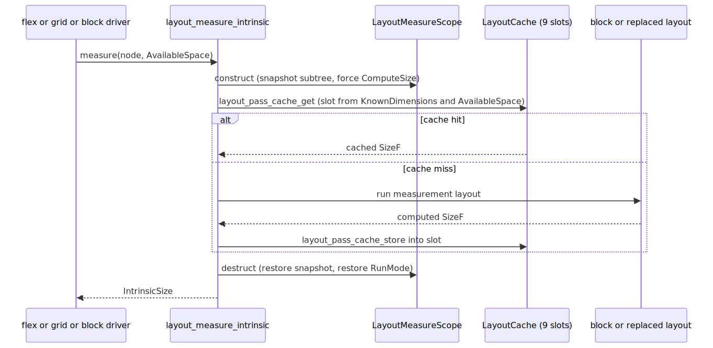

# Radiant — Box Model, Containing Blocks & the Layout Cache

> **Part of the [Radiant detailed-design set](RAD_00_Overview.md).** This document describes the shared *sizing-services* layer that sits beneath every layout mode: the CSS box-model math (content/padding/border/margin edges, `box-sizing`, border-box↔content-box conversion, min/max clamping); the Taffy-style `RunMode`/`SizingMode` and Ladybird-style `AvailableSpace` that unify real layout with side-effect-free measurement; the 9-slot per-element `LayoutCache` and its keying/invalidation; the `LayoutMeasureScope` snapshot/restore that makes a measurement pass leave no trace; containing-block resolution and percentage resolution; the alignment/axis helpers shared by flex and grid; and the callback-based absolutely-positioned-children driver that block, flex, and grid all reuse.
>
> **Primary sources:** `radiant/layout.hpp` / `layout_box.cpp` (`BoxMetrics`, box conversions, min/max clamp), `radiant/layout.hpp` (`AvailableSize`/`AvailableSpace`), `radiant/layout.hpp` (`RunMode`/`SizingMode`/`LayoutOutput`), `radiant/layout.hpp` (9-slot `LayoutCache`), `radiant/layout.hpp` / `layout_pass.cpp` (`LayoutMeasureScope`, cache wiring), `radiant/layout.hpp` / `layout_measure.cpp` (`layout_measure_intrinsic`), `radiant/layout.hpp` / `layout_containing_block.cpp`, `radiant/layout.hpp`, `radiant/layout.hpp` / `layout_alignment.cpp`, `radiant/layout.hpp` / `layout_abs_children.cpp`.
> **Audience:** engine developers. **Convention:** `file:line` references drift; confirm against the symbol name.

---

## 1. What this layer is

The block control-flow spine — `layout_html_doc` → `layout_flow_node` → `layout_block` and BFC/float management — is documented in [RAD_03 — Layout Driver, Block Layout & BFC](RAD_03_Layout_Driver_Block_BFC.md). This document covers the reusable *services* that spine calls into, and that flex ([RAD_08](RAD_08_Flexbox_Layout.md)), grid ([RAD_09](RAD_09_Grid_Layout.md)), and table ([RAD_10](RAD_10_Table_Layout.md)) also call into directly: how a box's four edges are computed, how a size constraint is represented, how measurement is memoized and unwound, how a containing block is resolved, and how positioned children are driven. Intrinsic min/max-content *measurement* — the content that flows *through* these services — is [RAD_05 — Intrinsic Sizing](RAD_05_Intrinsic_Sizing.md); this doc describes the plumbing, RAD_05 the measured quantities.

The design rationale throughout is *unification*: one `AvailableSpace` currency replaces magic sentinel floats, one `LayoutMeasureScope` makes any layout function usable as a measurement function, one `LayoutCache` memoizes both, and one abs-children driver serves three container types. Every place where that unification is only partly realized is called out in [§9](#9-known-issues--future-improvements).

---

## 2. The box model math

`struct BoxMetrics` (`layout.hpp`) is the resolved four-edge snapshot of a box: `BoxEdges margin/padding/border` (`layout.hpp`) plus the precomputed horizontal/vertical sums `padding_h`/`padding_v`/`border_h`/`border_v` and the combined `pad_border_h`/`pad_border_v`. `layout_box_metrics(ViewBlock*)` (`layout_box.cpp:5`) reads `block->bound->margin`/`padding` and, if present, `block->bound->border->width`, then fills the sums. A node with no `bound` group yields all-zero metrics — the guard at `layout_box.cpp:7` is why callers can measure a bare block safely.

### 2.1 Border-box ↔ content-box conversion

Radiant stores geometry as the **border box**: `(x,y,width,height)` on every node is the border-box rectangle ([RAD_01 §2.1](RAD_01_View_and_DOM_Model.md)). The conversions bridge that storage with CSS `box-sizing`:

- `layout_content_width_from_border_box` / `_height_` (`layout_box.cpp:45`/`:51`) subtract `pad_border_h`/`_v`, flooring at 0.
- `layout_border_width_from_content_box` / `_height_` (`layout_box.cpp:57`/`:63`) add `pad_border_h`/`_v` back, after flooring the content at 0.
- `layout_padding_border_width` / `_height_` (`layout_box.cpp:35`/`:40`) expose the pad+border sum directly (used as the border-box floor).

The legacy names `adjust_border_padding_width`/`_height_` (`layout_box.cpp:133`/`:137`) are thin aliases for the border→content direction and remain scattered through older layout code.

### 2.2 Min/max clamping and the border-box floor

`layout_apply_min_max_width` (`layout_box.cpp:79`) and `_height_` (`layout_box.cpp:104`) clamp a computed size against `block->blk->given_max_*` then `given_min_*` (a negative given value means "unset" — the checks are `>= 0`). Two invariants are encoded here and matter to every caller:

1. **min overrides max.** The min clamp runs *after* the max clamp (`layout_box.cpp:88`, `:112`), so a specified `min-width` larger than `max-width` wins, matching CSS 2.1 §10.4.
2. **border-box floor.** When the size is a border box (either the caller says so via `width_is_border_box`, or `block->blk->box_sizing == CSS_VALUE_BORDER_BOX`), the result is floored to `pad_border_h`/`_v` so a border box can never be smaller than its own padding+border (`layout_box.cpp:93`, `:116`). `layout_floor_border_box_width`/`_height_` (`layout_box.cpp:69`/`:74`) expose the same floor standalone.

`adjust_min_max_width`/`_height_` (`layout_box.cpp:125`/`:129`) are the content-box-defaulted wrappers (`width_is_border_box = false`) that most of the block code calls.

---

## 3. RunMode, SizingMode & AvailableSpace: one currency for layout and measurement

The central design move — cited as Taffy-inspired in `layout.hpp` and Ladybird-inspired in `layout.hpp` — is that *real layout* and *intrinsic measurement* are the same code path, differing only in three context fields threaded on `LayoutContext`: `run_mode`, `sizing_mode`, and `available_space`.

### 3.1 The enums

`enum class RunMode` (`layout.hpp`) has three values:

| Value | Meaning |
|---|---|
| `ComputeSize` (0) | compute dimensions only, skip positioning; enables early bailout when both dims known |
| `PerformLayout` (1) | full layout with final `x,y,width,height` |
| `PerformHiddenLayout` (2) | minimal work for `display:none` (zero dimensions) |

The predicate `run_mode_should_position` (`layout.hpp`) is true only for `PerformLayout`, so a single check gates whether a mode positions children.

`enum class SizingMode` (`layout.hpp`) is `InherentSize` (use the element's own CSS `width`/`height`) vs `ContentSize` (ignore them and size to content — the intrinsic case). `LayoutOutput` (`layout.hpp`) is a width/height + first/last baseline result struct with helper constructors, but it is only lightly threaded (see [§9](#9-known-issues--future-improvements)).

### 3.2 AvailableSpace

`struct AvailableSize` (`layout.hpp`) is a per-axis tagged value: `enum AvailableSizeType` (`layout.hpp`) is one of `DEFINITE` (carries `value`), `INDEFINITE` (auto), `MIN_CONTENT`, `MAX_CONTENT`. It replaces sentinel floats with a type-safe constraint, and offers resolution helpers that make caller intent explicit — `to_px_or_zero`/`to_px_or`/`to_px_or_infinity` (`layout.hpp`–`:106`, the last for max-width limits) and `resolve(fallback)` (`layout.hpp`), plus the `is_intrinsic()` predicate (`layout.hpp`) that unifies the two content modes.

`struct AvailableSpace` (`layout.hpp`) pairs a `width` and `height` `AvailableSize` and provides the factories the whole engine uses: `make_definite`, `make_indefinite`, `make_min_content`/`make_max_content` (width is intrinsic, height indefinite — `layout.hpp`/`:164`), and `make_width_definite` (definite width, growing height — the common block case). Two free helpers close the loop: `apply_size_constraints(size,min,max)` (`layout.hpp`) clamps ignoring `INFINITY`/non-positive limits, and `compute_shrink_to_fit_width(min,max,available)` (`layout.hpp`) implements `fit-content = clamp(min-content, available, max-content)`, dispatching on the available-size type.

---

## 4. The 9-slot layout cache

`struct LayoutCache` (`layout.hpp`) hangs off each `DomElement` via `element->layout_cache` (lazily pool-allocated). It holds one `final_layout` `CacheEntry` for `PerformLayout` results plus `measure_entries[9]` for `ComputeSize` results, and an `is_empty` fast-path flag.

### 4.1 Why nine slots

An element can be measured under many constraint combinations during one layout (flex and grid probe min-content and max-content on both axes). A single memo would thrash. `layout_cache_compute_slot` (`layout.hpp`) partitions the constraint space into nine disjoint buckets so distinct queries never evict each other:

| Slot | Condition |
|---|---|
| 0 | both dimensions known (`KnownDimensions`) |
| 1 / 2 | width known; height MaxContent-or-definite / MinContent |
| 3 / 4 | height known; width MaxContent-or-definite / MinContent |
| 5–8 | neither known; the four MinContent×MaxContent combinations |

The slot is chosen from `KnownDimensions` (`layout.hpp` — which dims were passed as input) and the `AvailableSpace` type per axis. `KnownDimensions` is derived from a block's resolved `given_width`/`given_height` by `layout_known_dimensions_from_block` (`layout_pass.cpp:185`), which treats only strictly positive givens as "known".

### 4.2 Keying, tolerance, and lookup

Within a slot, `layout_cache_constraints_match` (`layout.hpp`) validates a hit: the `has_width`/`has_height` flags must match, definite known/available values must agree within a `0.1f` float tolerance, and the `AvailableSize.type` must match on both axes. This tolerance absorbs sub-pixel jitter that would otherwise produce spurious misses. `layout_cache_get`/`_store` (`layout.hpp`/`:254`) route by `RunMode`: `PerformLayout` uses the single `final_layout` entry; `ComputeSize` uses the computed slot.

### 4.3 Wiring and invalidation

The engine never touches the cache directly — it goes through `layout_pass.cpp`. `layout_pass_cache_get_for_space` (`layout_pass.cpp:227`) refuses to serve unless `run_mode == ComputeSize` (`layout_pass.cpp:231`), bumps `g_layout_cache_hits`/`_misses`, and logs. `layout_pass_cache_store_for_space` (`layout_pass.cpp:257`) lazily allocates the cache from `lycon->pool` on first store and is likewise `ComputeSize`-only. `layout_block` performs its lookup at `layout_block.cpp:7656` (`layout_pass_cache_get(..., "BLOCK")`) and returns early on a hit, restoring parent context first.

Invalidation is **coarse and event-driven**, not slot-precise:

- **Style re-resolution** clears the whole cache: when `dom_node_resolve_style` re-resolves an element, `layout_cache_clear(dom_elem->layout_cache)` runs (`layout.cpp:816`) so stale measurements cannot survive a style change.
- **Pool swap / detach** nulls the pointer: `view_pool.cpp:587` and the JS-mutation teardown at `event.cpp:3845` set `elem->layout_cache = nullptr`, since the cache lives in the view pool that a `view_pool_reset_retained` destroys ([RAD_01 §6](RAD_01_View_and_DOM_Model.md)).

There is no per-descendant invalidation: a parent whose child changed relies on the child's own style re-resolution having cleared the child's cache. This is a correctness-by-construction argument rather than an enforced one ([§9](#9-known-issues--future-improvements)).

---

## 5. Side-effect-free measurement: `LayoutMeasureScope`

Because a measurement runs the *same* layout code as real layout, it would ordinarily mutate the subtree it measures — writing `x,y,width,height`, dirtying blocks, stamping `view_type`. `struct LayoutMeasureScope` (`layout.hpp`, impl `layout_pass.cpp:145`) is the RAII guard that makes measurement pure.

Its constructor saves the scalar context (`block`, `line`, `font`, `elmt`, `run_mode`, `sizing_mode`, `available_space`), forces `run_mode = ComputeSize`, and **deep-snapshots the entire subtree** rooted at the node being measured. `layout_measure_snapshot_append` (`layout_pass.cpp:36`) recurses every descendant, saving into a scratch-arena `LayoutViewSnapshot` (`layout_pass.cpp:10`) the fields a measurement can touch: geometry (`x,y,width,height`), `view_type`, the incremental fields `layout_dirty`/`layout_height_contribution`, and — for elements — `content_width/height`, the cached intrinsic widths, the `measuring_intrinsic_width` flag, form intrinsic sizes, and the block `given_*`/`given_*_type` fields. The destructor (`layout_pass.cpp:171`) restores the scalars and calls `layout_measure_snapshot_restore` (`layout_pass.cpp:88`), which replays snapshots in reverse and frees them. `LayoutRunModeScope` (`layout.hpp`) is the lighter guard that flips only `run_mode`.

This is the mechanism the multipass flex/grid measure passes rely on: a measure pass has no lasting effect on the retained layout, so the subsequent final pass starts from a clean tree ([RAD_08](RAD_08_Flexbox_Layout.md), [RAD_09](RAD_09_Grid_Layout.md)).

### 5.1 The measurement entry point

`layout_measure_intrinsic` (`layout_measure.cpp:11`) is the generic entry: it opens a `LayoutMeasureScope`, sets `lycon->available_space`, then dispatches — form controls to `layout_measure_form_control` (`layout_measure.cpp:126`), replaced elements to `layout_measure_replaced` (`layout_measure.cpp:84`), everything else to `measure_intrinsic_sizes` ([RAD_05](RAD_05_Intrinsic_Sizing.md)), and text to `measure_text_intrinsic_widths`. The replaced and form paths consult the same 9-slot cache via `layout_measure_cache_get`/`_store` (`layout_measure.cpp:54`/`:73`), which wrap `layout_pass_cache_*_for_space`. The replaced path also carries the hard-coded intrinsic defaults (300×150 for iframe/video/canvas/svg, 300×54 for audio) at `layout_measure.cpp:105`+ ([§9](#9-known-issues--future-improvements)).

---

## 6. Containing blocks & percentage resolution

`struct LayoutContainingBlock` (`layout.hpp`) captures a resolved containing block as three nested rects — border, padding, content (each `x,y,width,height`) — plus `has_definite_width`/`has_definite_height`. It is the reference frame for percentage sizes and for absolute positioning.

`layout_containing_block_for_view` (`layout_containing_block.cpp:27`) builds it from a `ViewBlock`'s border-box geometry and `BoxMetrics`, deriving the padding rect by insetting the border and the content rect by insetting border+padding, all floored non-negative; `has_definite_*` reflect whether `blk->given_width`/`given_height` are `>= 0`. `layout_initial_containing_block` (`layout_containing_block.cpp:54`) builds the ICB from `viewport_width/height × pixel_ratio` (falling back to `lycon->width/height`). `layout_absolute_containing_block` (`layout_containing_block.cpp:87`) picks the ICB when the block *is* the ICB (`layout_is_initial_containing_block`, `layout_containing_block.cpp:78`, tests root-of-view-tree or parentless), else the block's own containing block; `layout_nearest_block_ancestor` (`layout_containing_block.cpp:19`) walks up to the enclosing block.

Percentage resolution has two entry points with **different bases**, matching CSS:

- `layout_resolve_percent_size_for_child` (`layout_containing_block.cpp:99`) resolves `%`-width/height against the **content box** or **padding box** depending on `use_content_box`, and writes the result to both `lycon->block.given_*` and `child->blk->given_*` (only when the base is `> 0`, so a zero-width container leaves the percent unresolved). NaN sentinels in `given_width_percent`/`given_height_percent` mean "not a percentage".
- `layout_resolve_percent_offsets_for_child` (`layout_containing_block.cpp:123`) resolves `left/right/top/bottom` percentages against the **padding box** (`cb.padding_width`/`padding_height`), the correct base for positioned offsets.

---

## 7. Axis abstraction & alignment helpers

`enum LayoutAxis` (`layout.hpp`) plus the `layout_axis_size`/`set_size`/`pos`/`set_pos` accessors (`layout.hpp`+) let flex and grid write axis-generic code over a `ViewElement`, and `flex_main_axis`/`flex_cross_axis` (`layout.hpp`/`:46`) map a flex `direction` to X/Y. This is a small but load-bearing indirection that keeps the flex/grid main-vs-cross logic from duplicating X/Y branches.

`layout.hpp` / `layout_alignment.cpp` is the shared flex+grid alignment library ([RAD_08](RAD_08_Flexbox_Layout.md), [RAD_09](RAD_09_Grid_Layout.md) consume it). `compute_alignment_offset` (`layout_alignment.cpp:17`) maps a single-item alignment value (`flex-start`/`center`/`flex-end`/…) to a start offset, with a `is_safe` guard that clamps negative free space to 0. `compute_space_distribution` (`layout_alignment.cpp:63`) implements `space-between`/`space-around`/`space-evenly` into a `SpaceDistribution` (`layout.hpp`, gap-before/between/after), falling back to flex-start on negative free space; `alignment_fallback_for_overflow` (`layout_alignment.cpp:152`) encodes that same overflow fallback for callers. `resolve_align_self`/`resolve_justify_self` (`layout_alignment.cpp:187`/`:196`) resolve `auto`→parent value and `normal`→`stretch`. `compute_element_first_baseline` (`layout_alignment.cpp:209`) recurses into the first in-flow child per CSS 2.1 §10.8.1, falling back to the element's bottom content edge; `compute_stretched_cross_size` (`layout_alignment.cpp:250`) computes the stretch size for `align-self: stretch`. Its sibling `compute_element_last_baseline` (`layout_alignment.cpp:237`) is an unimplemented stub returning `-1` ([§9](#9-known-issues--future-improvements)).

---

## 8. The shared absolutely-positioned-children driver

Block, flex, and grid all need to lay out their `position:absolute`/`fixed` children *after* normal in-flow content, against a containing block that each computes differently. Rather than duplicate that iteration three times, `layout.hpp` / `layout_abs_children.cpp` factors it into one driver parameterized by callbacks.

`struct AbsStaticContext` (`layout.hpp`) carries the `kind` (`ABS_STATIC_BLOCK`/`FLEX`/`GRID`), the resolved `LayoutContainingBlock`, optional `flex`/`grid` container back-pointers, a `resolve_percent_against_content_box` flag, and two function pointers: `prepare_child` and `after_child`. `layout_absolute_children_in_context` (`layout_abs_children.cpp:67`) iterates `container->first_child`, filters to abs/fixed elements (`layout_view_is_abs_or_fixed`), builds an `AbsChildLayoutState` (`layout.hpp`) snapshotting the parent block/line context, seeds `given_width/height` from the child (resolving percentages against the content box when requested), invokes `ctx->prepare_child`, runs the actual `layout_abs_block` (in `layout_positioned.cpp`, [RAD_11](RAD_11_Positioned_Float_Multicol_Lists.md)), then `ctx->after_child`, then applies aspect-ratio via `layout_apply_abs_child_aspect_ratio` (`layout_abs_children.cpp:47`, reading the `aspect-ratio` declaration and deriving the missing axis).

The block driver supplies no special callbacks (in-flow containing block only); flex (`layout_flex_multipass.cpp`) and grid (`layout_grid_multipass.cpp`) inject callbacks that compute the static position or grid-area rectangle. This callback seam is the reason all three container types agree on percentage bases, aspect-ratio handling, and iteration order.

---

## 9. Known Issues & Future Improvements

1. **`compute_element_last_baseline` is a stub.** `layout_alignment.cpp:237` has `// TODO: Implement proper last baseline calculation` and returns `-1`, so *last*-baseline alignment (`align-items: last baseline`) silently degrades to no-baseline for flex and grid items. *Improvement:* mirror the recursive first-baseline logic over the last in-flow child.
2. **Hard-coded float-width estimate.** `layout_block.cpp:4123` uses `float float_width = 100.0f; // Conservative estimate` instead of measuring the float, so a float's effect on available width is guessed. *Improvement:* run `layout_measure_intrinsic` for the float and use its max-content width.
3. **Hard-coded replaced defaults are duplicated.** The 300×150 (and 300×54 audio) intrinsic defaults live both in `layout_measure.cpp:105`+ and scattered through `layout_block.cpp` (SVG/iframe/hr paths). Centralizing them into one table would remove the drift risk.
4. **Cache invalidation is coarse and by-construction.** The `LayoutCache` is cleared wholesale on style re-resolution (`layout.cpp:816`) and nulled on pool swap (`view_pool.cpp:587`, `event.cpp:3845`), but there is no descendant-aware invalidation — a parent trusts that any changed descendant re-resolved its own style and thereby cleared its own cache. A mutation that changes layout inputs without triggering a child's style re-resolution could serve a stale measurement. *Improvement:* a dirty-propagation assertion tying cache validity to `layout_dirty`.
5. **`max_iterations` caps truncate silently.** The float-avoidance / find-y loops in the block driver and `block_context_find_y_for_width` cap at 100 iterations with no error logged when the cap is hit (see [RAD_03 §Known Issues](RAD_03_Layout_Driver_Block_BFC.md)); a pathological float stack silently stops converging. Mentioned here because the sizing services (`compute_shrink_to_fit_width`, percentage resolution) feed those loops.
6. **`LayoutOutput` is under-threaded.** `layout.hpp` defines a clean width/height + baseline return struct, but block layout mostly writes `block->width`/`height` in place rather than returning `LayoutOutput`, so the abstraction is not consistently plumbed and the baseline fields are largely unused by the block path.
7. **`KnownDimensions` counts only positive givens as known.** `layout_known_dimensions_from_block` (`layout_pass.cpp:185`) treats a `given_width` of exactly 0 as *unknown*, so a legitimately zero-width element cannot key slot 0. This is usually benign but is an implicit contract worth documenting at the call sites.

---

## Appendix A — Source map

| File | Responsibility (this doc) |
|---|---|
| `radiant/layout.hpp` / `layout_box.cpp` | `BoxMetrics`/`BoxEdges`, border-box↔content-box conversion, min/max clamp + border-box floor. |
| `radiant/layout.hpp` | `AvailableSize`/`AvailableSpace` constraint currency, `apply_size_constraints`, `compute_shrink_to_fit_width`. |
| `radiant/layout.hpp` | `RunMode`/`SizingMode`/`LayoutOutput` enums and predicates. |
| `radiant/layout.hpp` | 9-slot `LayoutCache`, `KnownDimensions`, slot computation, tolerant constraint match. |
| `radiant/layout.hpp` / `layout_pass.cpp` | `LayoutMeasureScope`/`LayoutRunModeScope` snapshot-restore, cache get/store wiring, `KnownDimensions` derivation. |
| `radiant/layout.hpp` / `layout_measure.cpp` | `layout_measure_intrinsic` dispatch, replaced/form measurement + cache use. |
| `radiant/layout.hpp` / `layout_containing_block.cpp` | `LayoutContainingBlock`, ICB, abs containing block, percentage size/offset resolution. |
| `radiant/layout.hpp` | `LayoutAxis` + axis-generic accessors, flex main/cross axis mapping. |
| `radiant/layout.hpp` / `layout_alignment.cpp` | shared flex/grid alignment, space distribution, self-resolution, baselines, stretch. |
| `radiant/layout.hpp` / `layout_abs_children.cpp` | callback-based abs/fixed-children driver + aspect-ratio application. |

## Appendix B — Related documents

- [RAD_00 — Overview](RAD_00_Overview.md) — the set index and architecture.
- [RAD_01 — View & DOM Model](RAD_01_View_and_DOM_Model.md) — border-box geometry convention and the pool the `LayoutCache` lives in.
- [RAD_03 — Layout Driver, Block Layout & BFC](RAD_03_Layout_Driver_Block_BFC.md) — the control-flow spine that calls these sizing services; owns the float-avoidance loops.
- [RAD_05 — Intrinsic Sizing](RAD_05_Intrinsic_Sizing.md) — the min/max-content measurement that flows through `AvailableSpace` and the cache.
- [RAD_08 — Flexbox Layout](RAD_08_Flexbox_Layout.md) — consumer of alignment helpers, the axis abstraction, and the abs-children driver.
- [RAD_09 — Grid Layout](RAD_09_Grid_Layout.md) — same consumer set, with grid-area abs callbacks.
- [RAD_11 — Positioned, Float, Multicol & Lists](RAD_11_Positioned_Float_Multicol_Lists.md) — `layout_abs_block`, invoked per child by the abs-children driver.
