# Radiant — Intrinsic Sizing

> **Part of the [Radiant detailed-design set](RAD_00_Overview.md).** This document covers Radiant's implementation of CSS Sizing Level 3 min-content / max-content / fit-content measurement — the "how wide (and how tall) does this box want to be" query that every non-block layout mode leans on. The defining property is that intrinsic sizing runs *without a committed layout*: it walks the DOM subtree under a temporary `ComputeSize` run mode, reads `specified_style` (and any partially-resolved property groups) directly, measures text with real glyph metrics, and aggregates child contributions per display mode — all without writing the geometry fields that real layout owns ([RAD_01](RAD_01_View_and_DOM_Model.md), [RAD_03](RAD_03_Layout_Driver_Block_BFC.md)). It is the single source of truth so table, flex, grid, and block/inline do not each reinvent the algorithm.
>
> **Primary sources:** `radiant/layout.hpp` (result structs, public API, the dead `IntrinsicSizeCache`), `radiant/intrinsic_sizing.cpp` (the ~6300-line implementation: text measurement, the `measure_element_intrinsic_widths` monolith, height estimation, the unified bidirectional entry, and the table-cell wrapper), `radiant/view.hpp` (`IntrinsicSizes` and its extended forced-break / replaced flags), `radiant/layout.hpp` (`RunMode::ComputeSize`), `radiant/layout.hpp` / `layout_pass.cpp` (`LayoutRunModeScope`, cache snapshot/restore), `lambda/input/css/dom_element.hpp` (the actual per-element width cache).
> **Audience:** engine developers. **Convention:** `file:line` references drift; confirm against the symbol name.

---

## 1. What intrinsic sizing is, and why it is measured without layout

Intrinsic sizing answers two CSS-Sizing-3 questions for a box: its **min-content** size (the narrowest it can be without content overflow — for text, the longest unbreakable word) and its **max-content** size (the widest it wants, with no wrapping — the full line). `fit-content` is then `max(min-content, min(max-content, available))`. These values drive shrink-to-fit blocks and floats, flex base sizes, grid track sizing, and table column distribution. The module header states this unification goal explicitly (`layout.hpp`): one implementation so table/flex/grid/block do not diverge into separate measurement bugs.

The load-bearing design choice is that measurement must not perturb the retained view tree. Radiant unifies DOM and view into one set of nodes ([RAD_01](RAD_01_View_and_DOM_Model.md)), so a naive "just lay it out and read the width" would overwrite the very geometry that real layout committed. Intrinsic sizing instead runs under `RunMode::ComputeSize` (`layout.hpp`), entered via `LayoutRunModeScope` (`layout.hpp`). In this mode the code reads `specified_style` directly and treats the property groups (`blk`, `bound`, `in_line`) as *hints that may not yet exist* — there are many "fallback: read from CSS if the group is not yet resolved" branches (e.g. explicit-width resolution at `intrinsic_sizing.cpp:2376`, box-extra resolution at `:4900+`). Where styles are not resolved at all, the function resolves *just enough* under a nested `ComputeSize` scope: button UA defaults (`intrinsic_sizing.cpp:1997`) and the computed `display` value (`:2302-2305`).

Because measurement is read-mostly and idempotent, a bidirectional entry point (`measure_intrinsic_sizes`, [§7](#7-the-unified-bidirectional-entry-and-callers)) can be called speculatively by any layout mode; the callers that mutate node state across a speculative pass snapshot and restore it through `layout_pass.cpp` ([RAD_01 §6](RAD_01_View_and_DOM_Model.md)).

---

## 2. Result types and the caches

### 2.1 The result structs

The width result carried through the whole module is `IntrinsicSizes` (`view.hpp:507-526`) — a plain `{float min_content; float max_content}` shared with flex and grid, plus five extension fields that exist only to let a parent's inline-run accumulation reason correctly about its children:

| Field | Purpose |
|---|---|
| `first_line_max` / `last_line_max` | width before the first / after the last forced line break (`-1` = no forced break); lets a parent split its inline run at ` `/`pre` newlines instead of summing everything (CSS Text 3 §5.2). |
| `has_forced_break` | whether the child contains a forced break at all. |
| `replaced_includes_pad_border` | set by replaced form controls whose `min/max_content` already contain the border box (`FormControlProp::intrinsic_width`); tells the common pad/border pass at the bottom of the monolith to skip, avoiding double-counting. |
| `replaced_min_excludes_pad_border` | asymmetric variant: min-content is the natural text width (no author padding added) while max-content still gets pad+border — matches Chrome's `appearance:none <select>` shrink-to-fit. |

Two result wrappers sit on top. `TextIntrinsicWidths {min_content, max_content}` (`layout.hpp`) is the text-measurement return. `IntrinsicSizesBidirectional {min/max_content_width, min/max_content_height}` (`layout.hpp`) is the four-value result of the unified entry, with the axis extractors `intrinsic_sizes_width` / `intrinsic_sizes_height` / `intrinsic_sizes_for_axis` (`:275-295`). `CellIntrinsicWidths {min_width, max_width}` (`:308`) is the table-cell MCW/PCW pair.

### 2.2 The real cache lives on `DomElement` — width only

There is a header struct `IntrinsicSizeCache` (`layout.hpp`) with a `min/max_content_width` pair *and* a four-entry per-width height cache (`HeightCacheEntry height_cache[4]`). **It is dead** — a grep for `IntrinsicSizeCache` finds zero references anywhere outside its own declaration. The actual cache is four fields on `DomElement` (`dom_element.hpp:434-437`): `cached_min_content_width`, `cached_max_content_width`, `has_cached_intrinsic_widths`, and the re-entrancy flag `measuring_intrinsic_width`. This cache is **width-only**: height (the width-dependent, expensive part) is never cached and is recomputed on every call.

The cache is read at the very top of the monolith (`intrinsic_sizing.cpp:1946` — only when `styles_resolved && has_cached_intrinsic_widths && !content_only`) and written at the bottom (`:5048-5050`). It is invalidated when styles or the pool change (`view_pool.cpp:591`, `event.cpp:3849` both clear `has_cached_intrinsic_widths`), and it is snapshotted and restored across speculative passes (`layout_pass.cpp:58-61` save, `:111-114` restore) together with the re-entrancy flag so a measurement started inside a speculative pass does not leak state.

### 2.3 The re-entrancy guard

`measuring_intrinsic_width` breaks measurement cycles. Percentage-height ↔ aspect-ratio ↔ width dependencies can make an element's width depend transitively on itself; when the monolith re-enters an element already being measured, it returns `{0,0}` rather than recursing forever (`intrinsic_sizing.cpp:1951-1954`). The flag is set on entry (`:1955`) and cleared on every return path by an inline `MeasureGuard` RAII object (`:1957-1961`). Two sibling guards restore the saved `lycon->view` (`IntrinsicViewGuard`, `:1964-1969`) and the saved font context, releasing any temp font handles (`TempIntrinsicFontGuard`, `:1977-1989`).

---

## 3. Text measurement

`measure_text_intrinsic_widths` (`intrinsic_sizing.cpp:979-1338`) is the leaf of the whole system: min-content is the longest single unbreakable word, max-content is the whole run laid on one line. It walks UTF-8 codepoints, tracking the current break-unit width and a running total, and computes width with **real glyph advances and kerning** via `font_load_glyph`, using the same font-fallback matching as inline text layout ([RAD_06](RAD_06_Inline_and_Text_Layout.md), [RAD_07](RAD_07_Fonts.md)). When no font is available it falls back to roughly 11px per glyph and 4px per space (`:1008`, `:1027`, `:1260`, `:1307`). It honours `text-transform` and `font-variant` (queried from the parent element via `get_element_text_transform` / `get_element_font_variant`), `white-space`, `overflow-wrap`, `word-break`, tabs (`measure_preserved_line_width_with_tabs`, `:875`), emoji ZWJ sequences (`:964-977`), and soft-wrap opportunities. It ends by folding the trailing word into `min_content` and returning `{longest_word, total_width}` (`:1329-1332`).

`compute_text_height_at_width` (`intrinsic_sizing.cpp:1349-1516`) simulates line breaking: it greedily packs break-units into lines at a given available width and multiplies the resulting line count by line-height (CSS Flexbox §9.4). This is the honest wrapping simulation used by height estimation ([§6](#6-height-measurement-an-admitted-estimation)); the header comment (`:1343-1348`) notes it replaced an older division-based estimate that over-counted wrapping for varied word lengths.

---

## 4. The `measure_element_intrinsic_widths` monolith

`measure_element_intrinsic_widths` (`intrinsic_sizing.cpp:1939-5060`, ~3100 lines) is the per-element width algorithm. Its signature takes a `content_only` flag: when set, several short-circuits are skipped so the caller gets the *content* min-content (CSS Flexbox §4.5 content-size suggestion) rather than an explicit CSS width. The phases run in a fixed order.

**Phase 1 — gate and setup (`:1943-2298`).** Null check; cache check (`:1946`); re-entrancy guard and the three RAII guards (`:1951-1989`); save/set `lycon->view` to this element. Font context is then established *before* text children are measured — a `CRITICAL FIX` comment (`:1973-1976`) explains that `<code>` must measure with its own monospace font, not the parent's. If the element has a resolved font it is used directly (`:2002`); otherwise the font shorthand and longhands are parsed straight out of `specified_style` (`:2005-2249`), including system-font keywords and the full `[style] [variant] [weight] size/line-height family` grammar.

**Phase 2 — display resolution (`:2299-2349`).** `resolve_display_value` computes the outer/inner display (with blockification) under a `ComputeSize` scope. `display:none` short-circuits to `{0,0}` (`:2314`). Two booleans are derived that gate the width short-circuits: `is_table_display` (`:2320-2332`) and `is_inline_non_replaced` (`:2343-2349`) — CSS 2.1 §10.3.1 says `width` does not apply to non-replaced inline elements, so they must measure content even when a `width` is declared.

**Phase 3 — short-circuits (skip the content walk).** These three return early with min = max:
- **Explicit CSS width** (`:2351-2374` from a resolved `blk->given_width`, or `:2376-2462` parsed from `specified_style`): the declared width, adjusted for `box-sizing` and floored to its own padding+border. Skipped for tables and inline-non-replaced (CSS Tables §4.1: a table is never narrower than its content).
- **Aspect-ratio** (`:2464-2542`): if a definite height and a ratio are known, width = height × ratio; the ratio comes from `fi->aspect_ratio`, the `aspect-ratio` property, or an intrinsic width/height ratio.
- **Replaced elements** (`:2544-2864`): `img`/`video`/`iframe`/`svg`/`canvas`/`hr` plus form controls (`input`/`select`/`textarea`/`meter`/`progress`). Natural width comes from the loaded image/embed or UA defaults; form controls set the `replaced_includes_pad_border` / `replaced_min_excludes_pad_border` flags so the box-extras pass does not double-count. SVG has its own fallback (`:2846`).

**Phase 4 — per-mode content accumulation.** If no short-circuit fired, the algorithm branches on the resolved inner display. The block/inline path is the default; the others intercept before it.

- **Table** (`:2875-3505`): the CSS Tables §4.1 per-column algorithm. It scans rows and cells building `col_min[]` / `col_max[]` arrays (allocated from the layout scratch arena), taking the max per column across rows, then distributing spanned cells across their columns (`:3376-3392`). Table width is the *sum of per-column intrinsic widths* (comment `:2926`), not the max of row sums. It handles `border-spacing` (resolved/inherited at `:2889-2925`), anonymous-table repair, an inline-run accumulation for non-table children, captions (`:3419-3428`), and finally adds table pad/border and caps by the specified/HTML width. Falls through to the generic path if there is no row structure.
- **Grid** (`:3606-3744`): if `display.inner == grid`, it reads `grid_template_columns->track_count`, sums the **fixed-length** track sizes and column gaps (`:3688-3697`), adds padding/border, applies its own max-width clamp (`:3719-3734`), and **early-returns** — bypassing the generic constraint tail. This is a coarse approximation: percentage and flexible (`fr`) tracks contribute nothing here; real track sizing lives in [RAD_09](RAD_09_Grid_Layout.md).
- **Flex** (detected `:3599-3822`): resolves `is_row_flex`, `is_flex_wrap`, and `flex_gap`, flipping `is_row_flex` for vertical writing modes (`:3800-3803`). Accumulation happens in the shared child loop (`:4310-4327`): for a **row** flex container, max-content sums child max-contents, and min-content sums child min-contents *unless the container wraps*, in which case min-content is the largest single item (CSS Flexbox §9.9.1); for a **column** flex container (and for block), both min and max are the max over children. Flex gaps are added after the loop (`:4611-4619`).
- **Block / inline generic loop** (`:3884-4600`): iterates children, classifying each as inline-level (`is_inline_level_element`, `:1517`) or block. Inline children accumulate into an *inline run*: `inline_max_sum` is the running sum along a line (max-content), while `inline_min_sum` is the max of child min-contents. Block children flush the run and take the max. It threads forced-break propagation via `first_line_max` / `last_line_max` (`:4388-4415`), text-indent (`:4355`), collapsible-space handling, and floats (`float_max_sum` / `float_min_max`, `:4572-4600`). It also materializes and measures `::before` / `::after` pseudo-content (`:3507`, and the pseudo helpers at `:1790-1841`) and propagates the parent's definite height to children so percentage/aspect-ratio children can resolve (`:3825-3883`).

**Phase 5 — box extras and constraints (`:4900-5039`).** Horizontal padding + border are added with a three-tier resolve (view `bound` → CSS longhand → shorthand), *unless* a replaced flag said the value already includes them. Then the min-width floor is applied and the max-width clamp (CSS 2.1 §10.4) with content-box/border-box adjustment — but tables never clamp min-content below content (§4.1, `:5034-5038`).

**Phase 6 — write-back (`:5046-5058`).** On a non-`content_only`, styles-resolved element the two width floats and the bool are cached, and a `std::chrono` timer emits `log_warn("SLOW MEASURE: … took Nms")` if the call exceeded 100ms — a built-in hotspot beacon.

---

## 5. `content_only` and the public width/fit-content wrappers

`calculate_min_content_width` / `calculate_max_content_width` (`intrinsic_sizing.cpp:5066` / `:5095`) are thin dispatchers: for a text node they call `measure_text_intrinsic_widths` and return the matching field; for an element they call the monolith and pull `min_content` / `max_content`. `calculate_fit_content_width` (`:6196`) measures both in one monolith call and returns `max(min, min(max, available))` (CSS Sizing 3 §4.1), respecting min-content as a floor even when max-content is smaller (negative text-indent case).

---

## 6. Height measurement — an admitted estimation

`calculate_max_content_height` (`intrinsic_sizing.cpp:5161`) and its delegate `calculate_min_content_height` (`:5124`) take a `width` argument because height is width-dependent. For a text node the honest path runs: it resolves line-height (walking ancestors when needed) and, when the text max-content exceeds the available width, calls `compute_text_height_at_width` to count wrapped lines (`:5249`). For an element, the code resolves style under a `ComputeSize` scope and walks children accumulating heights — but the comment is candid (`:5264-5265`): *"For elements, we'd need to do a full layout pass … For now, use a simplified estimation."* No real layout runs, so nested/flex/grid content height can diverge from what final layout produces, and because height is never cached it is recomputed on every call. The font-setup logic here is a hand-maintained mirror of Phase 1 of the monolith (comment at `:5290`).

---

## 7. The unified bidirectional entry and callers

`measure_intrinsic_sizes` (`intrinsic_sizing.cpp:6224`) is the **single entry point** the header advertises. It measures width first (width is available-width-independent), then picks a `width_for_height` from the `AvailableSpace` argument — the definite value if given, else the min-content or max-content width depending on the space's mode (`:6259-6269`) — and measures both heights at that one width. Doing width and height together in one call avoids re-walking the subtree, since height depends on the chosen width. `measure_table_cell_intrinsic_widths` (`:6290`) wraps it with max-content available space and floors both results to 16px (CSS 2.1 minimum usable cell width).

The callers are, by weight:
- **Flex measurement** — the heaviest consumer (`layout_flex_measurement.cpp`, ~22 call sites). `measure_content_height_recursive` (`:442`) and the item-measurement helpers populate flex-item base sizes and hypothetical cross sizes; see [RAD_08 — Flexbox Layout](RAD_08_Flexbox_Layout.md).
- **Generic block measurement** — `layout_measure.cpp:34` calls `measure_intrinsic_sizes` as the block measurement entry, and `:162` calls the monolith with `content_only`.
- **Block shrink-to-fit / auto-height** — `layout_block.cpp` (6 sites) uses fit-content for floats and inline-blocks and the min/max widths for auto-height; see [RAD_03](RAD_03_Layout_Driver_Block_BFC.md) and [RAD_04 — Box Model & Containing Blocks](RAD_04_Box_Model_Containing_Blocks.md).
- **Grid track sizing** — `grid_utils.cpp:583` and `layout_grid_multipass.cpp` feed `IntrinsicSizesBidirectional` into min/max track base sizes ([RAD_09](RAD_09_Grid_Layout.md)).
- **Table column distribution** — the dedicated column algorithm consumes cell MCW/PCW ([RAD_10 — Table Layout](RAD_10_Table_Layout.md)); note the table *column* accumulation also exists inline inside the monolith (Phase 4) for the whole-table query.

---

## 8. Known Issues & Future Improvements

1. **Dead `IntrinsicSizeCache` struct.** The header struct (`layout.hpp`), including its four-slot per-width `HeightCacheEntry` height cache, has zero references anywhere. The real cache is the four `DomElement` fields (`dom_element.hpp:434-437`) and caches **width only**. *Improvement:* delete the struct, or wire up its height cache to fix issue 2.
2. **Height is an admitted estimation, and never cached.** `calculate_max_content_height` does not run a real layout for elements (`intrinsic_sizing.cpp:5264-5265`, "for now, use a simplified estimation"), so nested flex/grid/table height can mismatch committed layout; and because there is no height cache, the expensive width-dependent walk repeats on every call.
3. **The monolith is ~3100 lines with heavy duplication.** `measure_element_intrinsic_widths` (`:1939-5060`) inlines table, grid, flex, block/inline, replaced, and pseudo logic. Box-extra/border/padding resolution is duplicated across the table block (`:3433-3465`), the generic tail (`:4900-4948`), the pseudo path (`:4751-4840`), and the grid early-return (`:3703-3714`); font setup is mirrored again in `calculate_max_content_height` (`:5290`). *Improvement:* extract a shared box-extras helper and a per-mode dispatch table.
4. **Grid intrinsic width is a fixed-track approximation with an early return.** The grid branch (`:3606-3744`) sums only fixed-length tracks and gaps, ignoring percentage/`fr` tracks, and early-returns past the generic constraint tail (duplicating the max-width clamp at `:3719`). Real track sizing is in [RAD_09](RAD_09_Grid_Layout.md); the two can disagree.
5. **Per-call timing and the `SLOW MEASURE` beacon signal a known hotspot.** Every element call runs a `std::chrono` timer and warns above 100ms (`:5053-5057`); text measurement loads a glyph per codepoint. The absence of height memoization (issue 2) makes repeated measurement passes (flex, grid multipass) quadratic-ish on deep subtrees.
6. **Debt is expressed as `CRITICAL FIX` / `fallback` / "for now", not `TODO`.** There are no literal TODO/FIXME/HACK tokens; instead accreted special-cases carry `CRITICAL FIX` comments (button UA styling `:1973`, monospace font-before-children `:1973`), form-control border-box flags, and anonymous-table repair — harder to grep and easy to overlook when refactoring.
7. **The re-entrancy guard returns `{0,0}` silently on a cycle.** Breaking a percentage-height ↔ aspect-ratio ↔ width cycle by returning zero (`:1951`) is safe against infinite recursion but can under-measure a legitimately complex box with no diagnostic beyond a `log_debug`.

---

## Appendix A — Source map

| File | Responsibility (this doc) |
|---|---|
| `radiant/layout.hpp` | Result structs (`TextIntrinsicWidths`, `IntrinsicSizesBidirectional`, `CellIntrinsicWidths`), public API declarations, the dead `IntrinsicSizeCache`. |
| `radiant/intrinsic_sizing.cpp` | The whole implementation: `measure_text_intrinsic_widths`, `compute_text_height_at_width`, the `measure_element_intrinsic_widths` monolith, `calculate_*_content_width/height`, `calculate_fit_content_width`, `measure_intrinsic_sizes`, `measure_table_cell_intrinsic_widths`. |
| `radiant/view.hpp` | `IntrinsicSizes` and its forced-break (`first_line_max`/`last_line_max`) and replaced (`replaced_includes_pad_border`/`replaced_min_excludes_pad_border`) extension flags. |
| `radiant/layout.hpp` | `RunMode::ComputeSize` — the measurement-only run mode. |
| `radiant/layout.hpp` / `layout_pass.cpp` | `LayoutRunModeScope`; snapshot/restore of the `DomElement` width cache + re-entrancy flag across speculative passes. |
| `lambda/input/css/dom_element.hpp` | The real per-element cache: `cached_min/max_content_width`, `has_cached_intrinsic_widths`, `measuring_intrinsic_width`. |

## Appendix B — Related documents

- [RAD_00 — Overview](RAD_00_Overview.md) — the set index and architecture.
- [RAD_01 — View & DOM Model](RAD_01_View_and_DOM_Model.md) — the unified node model measurement must not perturb; the `layout_pass` snapshot/restore.
- [RAD_03 — Layout Driver, Block Layout & BFC](RAD_03_Layout_Driver_Block_BFC.md) — block shrink-to-fit and auto-height consumers.
- [RAD_04 — Box Model & Containing Blocks](RAD_04_Box_Model_Containing_Blocks.md) — box-sizing and padding/border semantics the box-extras pass applies.
- [RAD_06 — Inline & Text Layout](RAD_06_Inline_and_Text_Layout.md) and [RAD_07 — Fonts](RAD_07_Fonts.md) — the glyph metrics, kerning, and font fallback text measurement reuses.
- [RAD_08 — Flexbox Layout](RAD_08_Flexbox_Layout.md) — the heaviest caller (flex base/hypothetical sizes).
- [RAD_09 — Grid Layout](RAD_09_Grid_Layout.md) — track sizing consumes the bidirectional result; real track algorithm lives here.
- [RAD_10 — Table Layout](RAD_10_Table_Layout.md) — the column-width algorithm consuming cell MCW/PCW.
