# Radiant — Inline & Text Layout

> **Part of the [Radiant detailed-design set](RAD_00_Overview.md).** This document covers how Radiant turns a run of DOM text plus inline elements (``, ` `, `<wbr>`, inline-block, images) into positioned line boxes. It describes the inline formatting entry (`layout_inline`), the single-function streaming line-breaker (`layout_text`) with its per-character `do…while` loop and `goto` back-edge, the `Linebox` break-cursor model tagged by `BreakKind`, whitespace collapsing / trailing / hanging spaces, the ASCII-Latin measurement fast path versus the per-codepoint glyph loop, codepoint-based kerning, and the two-pass vertical alignment performed in `line_break`. The actual font engine (rasterization, cache, fallback, GPOS tables) is a separate concern — see [RAD_07 — Fonts](RAD_07_Fonts.md).
>
> **Primary sources:** `radiant/layout_text.cpp` (`layout_text`, `line_break`, `output_text`, and the measurement helpers), `radiant/layout_text.hpp`, `radiant/layout_inline.cpp` (`layout_inline`, `compute_span_bounding_box`, block-in-inline splitting), `radiant/layout.hpp` (`struct Linebox`, `struct BlockContext`, `enum BreakKind`, `enum LineFillStatus`), and `radiant/render_text.cpp` (the re-measurement seam).
> **Audience:** engine developers. **Convention:** `file:line` references drift; confirm against the symbol name.

---

## 1. What this area does

Inline and text layout is the one place where CSS's inline formatting context (CSS 2.1 §9.4.2, CSS Text 3) is realized. Block layout ([RAD_03 — Layout Driver, Block Layout & BFC](RAD_03_Layout_Driver_Block_BFC.md)) walks a block's children and, for each in-flow inline-level node, calls either `layout_inline` (an element) or `layout_text` (a text leaf) after `setup_font` has populated `lycon->font` and `lycon->block`. Those two functions cooperatively fill one in-progress line box — `lycon->line`, a `Linebox` — placing `TextRect` fragments and inline `View`s, and flush it with `line_break` when the line fills or a forced break occurs.

The design is deliberately a **streaming, single-pass, per-character line-breaker**: there is no separate itemize → shape → reflow pipeline. `layout_text` (`layout_text.cpp:2612`) is one ~1370-line function whose main body is a `do…while(*str)` loop over the node's UTF-8 bytes, with a `goto LAYOUT_TEXT` back-edge that restarts the loop after every internal wrap. Line state accumulates on the `Linebox`; on overflow the breaker rewinds to a single recorded break cursor (`last_space`) and flushes. This is cache-friendly and simple, but it forgoes any global optimal-break (no Knuth-Plass) and does real shaping only on the ASCII fast path ([§6](#6-measurement-the-latin-fast-path-vs-the-per-codepoint-loop)). The known limits of this approach (no bidi reorder, no complex-script shaping) are collected in [§10](#10-known-issues--future-improvements).

The whole subsystem is unusually spec-annotated: nearly every branch cites a CSS 2.1, CSS Text 3, or UAX #14 clause. That annotation is load-bearing — the branch structure of `layout_text` *is* the spec's decision tree, so the citations are the map to the code.

---

## 2. The data model: Linebox, BreakKind, TextRect

### 2.1 `Linebox` — the in-progress line

`struct Linebox` (`layout.hpp:205`) is a large single-line state struct. Its fields fall into groups: the horizontal bounds (`left`, `right`, and the float-adjusted `effective_left`/`effective_right`), the running cursor `advance_x`, the vertical extents `max_ascender`/`max_descender`, the **break cursor** (`last_space`, `last_space_pos`, `last_space_kind`), a soft-hyphen fallback cursor (`last_non_shy_space*`), trailing/committed/hanging-space bookkeeping, the vertical-align second-pass metrics (`parent_font_*`, `max_top_height`, `max_bottom_height`, `max_top_bottom_height`), and kerning state (`prev_codepoint`, `prev_glyph_index`). The inline `reset_space()` method (`layout.hpp:281`) clears just the break/space cursors without disturbing the rest of the line, while `line_reset` (`layout_text.cpp:1390`) resets the whole line for a new line box and `line_init` (`layout_text.cpp:1487`) establishes its bounds and recomputes float intrusion.

The single most important design choice in the struct is that there is exactly **one break cursor** (`last_space`), not a list of break opportunities. Every character that constitutes a soft wrap opportunity overwrites `last_space` with its byte position, records the pixel position in `last_space_pos`, and tags what kind of break it is in `last_space_kind`. On overflow the breaker rewinds to that one cursor. The only auxiliary cursor is `last_non_shy_space`, kept so a soft-hyphen break can fall back to the previous real break opportunity when the visible hyphen would itself overflow ([§7](#7-soft-hyphens-hanging-spaces-and-trailing-space-trim)).

### 2.2 `BreakKind` — semantic tagging of the cursor

`enum BreakKind` (`layout.hpp:173`) is what lets a single cursor stand in for every break class. It maps CSS Text 3 §4–5 plus UAX #14 line-break classes onto a tag stored in `last_space_kind`:

| Group | Values | Meaning |
|---|---|---|
| Content | `BRK_TEXT` | ordinary word/grapheme content (not a break itself) |
| Whitespace | `BRK_SPACE`, `BRK_PRESERVED_SPACE`, `BRK_TAB`, `BRK_HARD_BREAK` | collapsible/preserved space, tab, forced newline |
| Glue | `BRK_GLUE`, `BRK_GLUE_ZW`, `BRK_ZWJ` | NBSP/NNBSP, word-joiner/ZWNBSP, zero-width joiner (suppress break) |
| Break opportunities | `BRK_ZERO_WIDTH_BREAK`, `BRK_SOFT_HYPHEN`, `BRK_HYPHEN` | ZWSP, SHY (renders visible `-` when broken), explicit hyphen/dash |
| UAX #14 classes | `BRK_CJK`, `BRK_OP`, `BRK_CL`, `BRK_NS`, `BRK_EX_IS_SY`, `BRK_CJ` | ideograph, opening/closing punctuation, non-starter, EX/IS/SY, conditional-Japanese |
| Ideographic | `BRK_IDEOGRAPHIC_SPACE` | U+3000 (hangable break opportunity) |

At the wrap point the tag drives class-specific behavior: `BRK_SOFT_HYPHEN` renders a visible hyphen and consults the fallback cursor; `BRK_IDEOGRAPHIC_SPACE` and preserved spaces *hang* rather than break; CJK tags respect `word-break: keep-all`.

### 2.3 `TextRect` — the emitted fragment

Each visual text fragment on one line is a `TextRect` (defined in `view.hpp`, owned by `ViewText`): `x, y, width, height`, the `start_index`/`length` **byte range** into the node's text, `line_number`, `hanging_trim`, `has_trailing_hyphen`/`has_trailing_ellipsis`, and a `next` pointer forming a linked list. Critically the rect stores only a byte range and a width — **not** a shaped glyph buffer. Layout and rendering both walk the raw bytes and re-measure independently ([§8](#8-the-render_text-re-measurement-seam)). `output_text` (`layout_text.cpp:2447`) commits a rect into the `ViewText.rect` list, advances `advance_x`, and records the last-text-rect/view plus trailing-space bookkeeping for later trimming.

`BlockContext` (`layout.hpp:81`) supplies the driving state text layout reads but does not own: `line_height`/`line_height_is_normal`, `init_ascender`/`init_descender`, `lead_y`, `advance_y`, `text_align`/`text_align_last`, `direction`, `block_container_font` (used for the tab-stop advance), `text_indent`, `is_first_line`, `line_number`, and the float lists.

---

## 3. Inline element handling (`layout_inline`)

`layout_inline` (`layout_inline.cpp:1142`) dispatches inline-level *elements*. It handles a few special tags up front before the general span path.

**`<wbr>`** (`layout_inline.cpp:1148`): HTML5 §4.5.27 — a zero-box line-break opportunity, equivalent to U+200B ZWSP. It stamps a zero-size `RDT_VIEW_INLINE` and records a soft wrap opportunity by setting `line.last_space` to the *element pointer itself* (`layout_inline.cpp:1159`) as a non-null sentinel, tagged `BRK_ZERO_WIDTH_BREAK`. Because that pointer never falls inside a text buffer, the wrap logic in `layout_text` recognizes it via its "last_space outside the text" branch and breaks at the element boundary.

**` `** (`layout_inline.cpp:1167`): a forced break — stamps `RDT_VIEW_BR`, positions it at the trimmed content edge (LTR) or the line start (RTL), sets height to the font cell height (`font_get_cell_height`), then sets `is_last_line = true` and calls `line_break`. It also handles `-webkit-line-clamp` ellipsis width and `clear` on the ` ` (progressive float clearance, CSS 2.1 §9.5.2, `layout_inline.cpp:1205`). The ` ` height rule is an admitted approximation — see [§10](#10-known-issues--future-improvements).

**General spans** (`layout_inline.cpp:1285` onward): saves the parent `FontBox`/vertical-align state, stamps `RDT_VIEW_INLINE`, resolves style (`dom_node_resolve_style`), pushes a counter scope and generates `::before`/`::after` pseudo-content, sets up the span's font (`setup_font`), and re-resolves line-height when the element has its own `line-height`/`font` declaration or when font-size changed and the inherited line-height is a `<number>`/`normal` (CSS number-inheritance rule, `layout_inline.cpp:1418`). Inline margin/border/padding is applied as an *inline-axis edge* (CSS 2.1 §8.3): `inline_left_edge`/`inline_right_edge` are accumulated (`layout_inline.cpp:1458`), the left edge advances the cursor and is tracked in `line.inline_start_edge_pending` so it can be re-applied after a wrap, and the right edge is added after the children close. Children are laid out by recursing through `layout_flow_node` ([RAD_03](RAD_03_Layout_Driver_Block_BFC.md)) at `layout_inline.cpp:1716`.

### 3.1 Block-in-inline splitting

CSS 2.1 §9.2.1.1: an inline element containing block-level children must be split into anonymous block boxes. `layout_inline` scans children (`layout_inline.cpp:1477`) classifying each as block-level or table-internal, taking care to treat absolutely/fixed-positioned and floated children as out-of-flow so they do *not* trigger splitting. When block children exist it delegates to `layout_inline_with_block_children` (`layout_inline.cpp:825`, invoked at `:1556`), then reconstructs the span's bounding box to span the full containing-block width and to cover the leading/trailing anonymous-block struts (`layout_inline.cpp:1584`–`1674`). Table-internal-only children are wrapped in an anonymous inline-table (`wrap_orphaned_table_children`) instead ([RAD_10](RAD_10_Table_Layout.md)).

### 3.2 Span bounding boxes across fragments

A span that wraps across lines produces multiple line fragments, so its bounding box is not simply its first-child geometry. `compute_span_bounding_box` (`layout_inline.cpp:400`) unions child line-fragment rects into the span box, handling the truly-empty case (only inline-axis borders/padding/margin keep a zero-content inline box "present", CSS Inline 3 §2.1), and the multi-line case. Fragment tracking is helped by `inline_span_has_multiple_line_fragments` (`layout_inline.cpp:174`), the split-fragment union recorded via `span_record_split_inline_fragment` (`layout_inline.cpp:310`), and the collapsed-fragment union consumed by `compute_span_from_collapsed_line_fragment` (`layout_inline.cpp:364`) for spans whose only content was trimmed away.

---

## 4. The streaming line-breaker (`layout_text`)

`layout_text` (`layout_text.cpp:2612`) is the heart of the engine. Its structure:

1. **Setup** (`:2640`–`2684`): resolve `white-space` via `get_white_space_value` (walked from the ancestor chain — see [§10](#10-known-issues--future-improvements)) into `collapse_spaces`/`collapse_newlines`/`wrap_lines` (wrapping is disabled in max-content mode). Resolve `word-break`/`line-break`/`overflow-wrap` into `break_all`/`keep_all`/`break_word`, `text-transform`, `text-spacing-trim`, and `lang` for the CJ line-break class (`cj_is_non_starter`, `:2674`).
2. **Leading-space skip** (`:2694`): if collapsing and at a collapsible text edge (`line_is_at_collapsible_text_edge`) or after a prior space, skip the leading collapsible run; a fully-collapsed node becomes `RDT_VIEW_NONE` but may still record a `wrap_opportunity_before_nowrap` (CSS Text 3 §5).
3. **`LAYOUT_TEXT` label** (`:2715`): the `goto` re-entry point after every internal wrap. It re-skips a boundary space, guards against runaway `goto` loops with `layout_text_iterations > 500` (`:2733`), checks whether the cursor is already past the line end, and performs the **first-word-fit** check (`measure_first_word_width`, `:2782`) so an over-long first word wraps to a fresh line before any rect is started.
4. **Rect allocation** (`:2801`–`2876`): allocate/reuse the `ViewText`, handle the font-size-0 case, allocate a `TextRect`, and compute its `y` from the current vertical-align mode (middle/bottom/top or the baseline half-leading model, `:2851`).
5. **Main `do…while(*str)` loop** (`:2887`): per character, measure a width `wd`, add it to the rect, test overflow, and record any break opportunity ([§5](#5-the-per-character-loop-measure-overflow-record)).
6. **End of node** (`:3900`): if `last_space` is set and a look-ahead (`view_has_line_filled`, `layout_text.cpp:2411`) says the remaining content overflows, rewind to `last_space` and break; otherwise `output_text` the whole rect. Timing is accumulated into `g_text_layout_time` (`:3981`).

The look-ahead helpers `text_has_line_filled` / `node_has_line_filled` / `view_has_line_filled` (`layout_text.cpp:2267`/`2383`/`2411`) return a `LineFillStatus` (`layout.hpp:294`: `RDT_NOT_SURE`/`RDT_LINE_NOT_FILLED`/`RDT_LINE_FILLED`) so the end-of-node decision can peek across sibling nodes without committing.

---

## 5. The per-character loop: measure, overflow, record

Each loop iteration (`layout_text.cpp:2887`) does three things.

**Measure `wd`.** The order of cases is: (a) the ASCII-Latin fast path (`measure_shaped_simple_latin_run`, [§6](#6-measurement-the-latin-fast-path-vs-the-per-codepoint-loop)) shapes a whole `[A-Za-z]` run in one call; (b) a preserved newline forces `output_text` + `line_break` + `goto LAYOUT_TEXT` (`:2894`); (c) a space uses `measure_current_space_advance` (`:2973`), with tab handling computing the next tab stop from `tab-size × space advance` measured in the **block container's** font (CSS Text 3 §4.2, `:2976`, default tab-size 8); (d) any other codepoint is decoded from UTF-8, run through `apply_text_transform_full` and small-caps, checked for Unicode fixed-width/zero-width spaces (`get_unicode_space_width_em`), and otherwise measured per-glyph via `font_load_glyph` with a VS16 peek routing to `font_load_glyph_emoji` (`:3110`). The glyph advance is divided by `pixel_ratio` back to CSS pixels. ZWJ emoji sequences zero the following glyph's advance (heuristic — see [§10](#10-known-issues--future-improvements)); small-caps lowercase glyphs are scaled ×0.7; fallback-font metrics blend into `max_ascender`/`max_descender` only when line-height is `normal`.

**Kerning** (`:3241`): when `font.style->has_kerning`, `font_get_kerning(handle, prev_codepoint, codepoint)` is applied to `rect->width` (or `rect->x` at rect start). Kerning is **codepoint-based, not glyph-index-based** (`prev_codepoint` tracked on the `Linebox`) — a deliberate choice so it works with CoreText GPOS on macOS. The shaped-Latin run supplies its first codepoint as the kerning codepoint so kerning at run boundaries is still applied.

**Overflow / wrap decision** (`:3292`): the test is `wrap_lines && rect->x + rect->width - trailing_letter_spacing > line_right + 0.001f` (`line_right` is `effective_right` under float intrusion). The cascade of cases: a U+3000 or pre-wrap trailing space *hangs* rather than breaks; break-spaces with break-all rewinds to the prior break; a space breaks at the current space (collapsible spaces are removed, break-spaces spaces are kept per CSS Text 3 §3); pre-wrap hanging content that fits without its trailing spaces does not wrap; otherwise break at `last_space` (with the soft-hyphen fallback); an emergency mid-word break handles `overflow-wrap`/`break-word` when no break opportunity exists. Each breaking case ends by calling `output_text` + `line_break` and jumping back to `LAYOUT_TEXT`.

**Break-opportunity recording** (`:3644` onward): after a non-breaking character, the loop records the current position as `last_space` and tags `last_space_kind`. Spaces set `BRK_SPACE` (and, for collapsible whitespace, `has_space`, `trailing_space_width`, and hanging-space accumulation); U+3000 sets `BRK_IDEOGRAPHIC_SPACE`; the CJK/break-all path (`:3805` region) uses `has_id_line_break_class` / `is_typographic_letter_unit` and applies UAX #14 LB13–21 by peeking at the next codepoint (including a cross-node peek via `peek_next_inline_codepoint`, `layout_text.cpp:854`, for LB13 at a node boundary). The CSS Text 3 §4.1.2 segment-break transformation is applied here (`:3654`): a collapsed newline between two East Asian W/F characters (neither Hangul) or adjacent to a ZWSP is *removed* rather than turned into a space.

---

## 6. Measurement: the Latin fast path vs the per-codepoint loop

Two measurement strategies coexist. The general path loads each glyph individually with `font_load_glyph` and sums advances — correct for any script but one engine call per codepoint. The fast path `measure_shaped_simple_latin_run` (`layout_text.cpp:976`) shapes a whole run of simple ASCII-Latin bytes with a single `font_measure_text` call, letting the engine apply its own internal kerning. It is gated by `can_shape_simple_latin_run` (`layout_text.cpp:963`), which requires: no text-transform, no small-caps, no letter-spacing, and not `break-all`/`break-word` — i.e. the conditions under which a run has no per-character break points or per-character adjustments. The run must be at least two bytes and every byte must resolve to a real glyph (`font_get_glyph` id non-zero), else it bails to the per-codepoint loop. This is the *only* real "shaping" in the engine; everything else is per-codepoint advance with no GSUB. The same helper is reused by `measure_first_word_width` (`layout_text.cpp:2173`) and by intrinsic sizing ([RAD_05 — Intrinsic Sizing](RAD_05_Intrinsic_Sizing.md)) so min/max-content widths agree with the wrapping measurement.

The distinction between "layout dimensions are float" and the occasional `(int)` cast (e.g. byte lengths) follows the repository rule; text widths and positions are all `float`.

---

## 7. Soft hyphens, hanging spaces, and trailing-space trim

Three of the subtlest behaviors live in the interaction between the main loop and `line_break`.

**Soft hyphens** (SHY, U+00AD): recorded as a zero-width `BRK_SOFT_HYPHEN` break opportunity (`layout_text.cpp:3069`). When the line breaks at a SHY, a visible `-` is rendered and its width added (`:3428`, `:3916`). If the hyphen itself would overflow, the breaker falls back to `last_non_shy_space` — the previous real break opportunity saved when the SHY was recorded. The rect is flagged `has_trailing_hyphen` for the renderer.

**Hanging spaces** (CSS Text 3 §4.1.3): in `pre-wrap`, trailing preserved spaces "hang" past the line's end and do not count for overflow. The loop accumulates `hanging_space_width`/`hanging_space_text_trim` and saves them alongside `last_space`; `line_break` (`layout_text.cpp:1832`) stores a `hanging_trim` on the last rect for JSON/DOMRect output, subtracts the hanging width from `advance_x`, and in RTL saves `rtl_hanging_space` so `line_align` can shift the rect leftward (`:1932`). U+3000 hangs in every white-space mode except `pre`.

**Trailing-space trim** (CSS 2.1 §16.6.1): collapsible trailing spaces at the end of a line are removed. `line_break` trims the last rect's width using either the live `trailing_space_width` (`:1783`) or the *committed* trailing-space info (`:1805`) that survives cross-node character processing — a text rect can have trailing space, then unrelated inline content is processed (clearing the live value), then the line breaks with that rect still last. `output_text` commits the trailing info (`layout_text.cpp:2457`) precisely so `line_break` can trim it correctly. Trailing letter-spacing (CSS Text 3 §8) is likewise trimmed at line ends.

---

## 8. The `line_break` second pass, alignment, and advance

`line_break` (`layout_text.cpp:1780`) finalizes a line in order: (1) trailing/committed-space trim; (2) hanging-space handling; (3) trailing-letter-spacing trim; (4) `contribute_block_root_strut` (the block's zero-width strut, CSS 2.1 §10.8.1) and non-rendered table-marker finalization; (5) a **vertical-alignment second pass** — when inline content exceeds the strut, a different inline font is present, replaced content is on the line, or top/bottom-aligned boxes exist, it re-walks the line's views calling `view_vertical_align` (in `layout.cpp`) to position each inline box relative to the resolved baseline (`:1886`–`1920`); (6) `align_forced_break_rect_to_line_baseline`; (7) horizontal alignment/justification via `line_align` (`layout.cpp:1723`, shared with the block driver — [RAD_03](RAD_03_Layout_Driver_Block_BFC.md)); (8) the RTL hanging-space rect shift; (9) computing the used line height and advancing `block.advance_y`.

The used-line-height computation (`:1941`–`2030`) is intricate: it takes `max(css_line_height, font_line_height)` for mixed-font / replaced-content / normal-line-height lines, honors an explicit `line-height: 0`, applies a ±2px tolerance to absorb font-metric rounding, and tracks per-inline `max_inline_line_height`/`max_normal_line_height`/`max_atomic_inline_height` so that a small replaced element does not inflate the block advance. Finally it increments `line_number`, applies `-webkit-line-clamp`, and calls `line_reset`/`line_init` to start the next line box (recomputing float bounds via `update_line_for_bfc_floats`, `layout_text.cpp:1246`).

---

## 9. The `render_text` re-measurement seam

Rendering does **not** consume a shaped buffer from layout. `render_text.cpp` re-runs `setup_font` on the `ViewText.font` (`render_text.cpp:124`), then for each `TextRect` re-decodes the byte range `[start_index, start_index+length)` and re-loads each glyph (`render_text_load_glyph_for_paint`, `render_text.cpp:646`) to paint shadows, decorations (with skip-ink gaps), inline background/border, and gradient text-fill. Because `TextRect` stores only a byte range and a total width — never per-glyph positions — layout and paint independently walk the same bytes and re-measure. This keeps the layout struct small and avoids persisting a glyph buffer, but duplicates glyph work and risks layout/paint metric divergence if the two paths ever measure differently ([§10](#10-known-issues--future-improvements)). The render side is documented in [RAD_13 — Render Walk & Painters](RAD_13_Render_Walk_Painters.md).

---

## 10. Known Issues & Future Improvements

1. **No real bidi engine.** `direction` (LTR/RTL) is honored only for alignment, `text-indent`, hanging-space placement, and ` `/replaced-element positioning. There is **no UAX #9 (UBA) level resolution or visual reordering** of mixed-direction runs. Directional formatting codepoints (U+202A–U+202E, LRM/RLM U+200E/200F) are recognized only as zero-advance in `text_codepoint_has_zero_advance` (`layout_text.cpp:287`) — never applied. Mixed-direction text renders in logical order. *Improvement:* a UBA reorder pass over each line's runs before `line_align`.
2. **No general complex-script shaping.** Only the ASCII-Latin fast path calls `font_measure_text` (`layout_text.cpp:976`); every other script is measured per-codepoint with no GSUB. Arabic joining, Indic reordering, and ligatures beyond the font's simple advance are not handled. The comment at `layout_text.cpp:884` notes the ZWJ-emoji handling is a heuristic "without HarfBuzz text shaping". *Improvement:* integrate a shaper (HarfBuzz) and persist a shaped buffer (see item 5).
3. **Emoji ZWJ sequences are heuristic.** `is_emoji_for_zwj` (`layout_text.cpp:877`) and `is_zwj_composition_base` use hardcoded codepoint ranges to zero post-ZWJ advances, rather than proper UAX #29 grapheme clustering; non-standard emoji sequences will mis-measure.
4. **` ` reported height is an approximation.** `layout_inline.cpp:1180` admits the rule "is not fully understood" and uses the font cell height, whereas Chrome's reported ` ` height varies by context.
5. **Layout and render re-measure independently from byte ranges.** `TextRect` stores only `start_index`/`length`/`width`, so `render_text.cpp` re-decodes and re-loads every glyph ([§9](#9-the-render_text-re-measurement-seam)). This duplicates work and risks layout/paint divergence. *Improvement:* a shared shaped-glyph buffer keyed by the rect's byte range.
6. **`white-space` is re-walked per text node.** `layout_text.cpp:2642` carries `todo: white-space should be put in BlockContext`; `get_white_space_value` climbs the ancestor chain on every text node. Related: `:2700` `todo: probably should still set it bounds` for fully-collapsed whitespace nodes.
7. **Hardcoded fallbacks.** tab-size default `8` (`layout_text.cpp:2983`), small-caps lowercase scale `0.7f` (multiple sites, `:3094`/`:3133`/`:3235`), and C1-control line-height synthesis ratios. These are correct for common cases but not configurable.
8. **Legacy `@font-face` cruft in the font bridge.** `font_face.cpp:341` `parse_font_face_rule_OLD` is a dead lexbor path (fonts are [RAD_07](RAD_07_Fonts.md)'s domain, cross-linked here only because it is reached from the inline text path via `setup_font`).
9. **Infinite-`goto` guard.** `layout_text` caps its `goto LAYOUT_TEXT` re-entries at `layout_text_iterations > 500` (`layout_text.cpp:2733`) — an explicit admission that the goto-driven control flow can loop under degenerate layouts (extreme negative margins), aborting text layout rather than hanging.
10. **`layout_text` is a single ~1370-line function.** The overflow/wrap cascade and break-recording tail are long and deeply nested; correctness depends on many interacting `Linebox` flags. There is no unit-level test of individual branches — regressions surface only through the layout suite.

---

## Appendix A — Source map

| File | Responsibility (this doc) |
|---|---|
| `radiant/layout_text.cpp` | `layout_text` (the streaming breaker), `line_break` (trim + vertical-align pass + advance), `output_text`, the Latin fast path and per-codepoint measurement helpers, UAX #14 break classification, kerning. |
| `radiant/layout_text.hpp` | `get_white_space_value`, `text_codepoint_has_zero_advance` declarations. |
| `radiant/layout_inline.cpp` | `layout_inline` (spans, ` `, `<wbr>`), inline margin/border/padding edges, block-in-inline splitting, `compute_span_bounding_box` and fragment-union helpers. |
| `radiant/layout.hpp` | `struct Linebox`, `struct BlockContext`, `enum BreakKind`, `enum LineFillStatus`. |
| `radiant/render_text.cpp` | The re-measurement seam — re-decodes `TextRect` byte ranges and re-loads glyphs for painting. |

## Appendix B — Related documents

- [RAD_00 — Overview](RAD_00_Overview.md) — the set index and architecture.
- [RAD_01 — View & DOM Model](RAD_01_View_and_DOM_Model.md) — `ViewText`/`ViewSpan` wrappers and the `TextRect` ownership these functions populate.
- [RAD_03 — Layout Driver, Block Layout & BFC](RAD_03_Layout_Driver_Block_BFC.md) — the block driver that calls `layout_inline`/`layout_text` and shares `line_align`.
- [RAD_05 — Intrinsic Sizing](RAD_05_Intrinsic_Sizing.md) — reuses the same measurement helpers so min/max-content widths agree with wrapping.
- [RAD_07 — Fonts](RAD_07_Fonts.md) — the CSS→engine font bridge (`setup_font`, `@font-face`) and the `lib/font/` engine (glyph rasterization, cache, fallback, GPOS kerning) that this doc's measurement calls into.
- [RAD_13 — Render Walk & Painters](RAD_13_Render_Walk_Painters.md) — consumes the emitted `TextRect` list and re-measures for painting.
