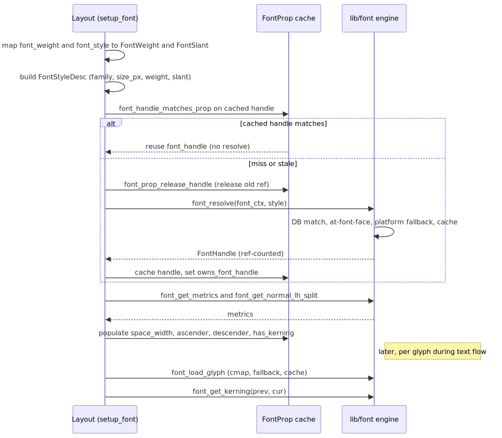

# Radiant — Fonts

> **Part of the [Radiant detailed-design set](RAD_00_Overview.md).** This document covers the font layer as seen from Radiant. Its single most important message is a boundary: the real font engine — glyph rasterization, `cmap` lookup, GPOS/`kern` kerning, per-codepoint fallback, the glyph cache, WOFF2 decode, and COLR/CBDT color-emoji handling — is **not** in `radiant/`. It lives in the unified module under `lib/font/` (~30 files). Radiant's `font.cpp` and `font_face.cpp` are a thin CSS→engine bridge: they map a CSS-resolved `FontProp` to the engine's `FontStyleDesc`, resolve and cache the `FontHandle`, parse and register `@font-face` descriptors, and copy engine metrics back onto the `FontProp`. Everything typographic below the handle is the engine's concern.
>
> **Primary sources:** `radiant/font.cpp` (`setup_font`, handle caching, metric population), `radiant/font.h`, `radiant/font_face.cpp` / `font_face.h` (`@font-face` parse + `register_font_face` bridge), the `FontProp` / `FontBox` structs and `font_style_desc_from_prop` in `radiant/view.hpp`, `radiant/ui_context.cpp` (`FontContext` creation), and — for the boundary — the engine surface in `lib/font/font.h`.
> **Audience:** engine developers. **Convention:** `file:line` references drift; confirm against the symbol name.

---

## 1. What lives in Radiant and what does not

The defining fact of this area is the split at the `FontHandle`. Radiant owns CSS: it resolves `font-family`, `font-weight`, `font-style`, size, and the `@font-face` cascade into a `FontProp`, then asks the engine for a handle. The engine owns everything from the handle down: which physical face resolves, how a codepoint maps to a glyph, how that glyph rasterizes, how missing codepoints fall back, and how color emoji and compressed web fonts decode.

The seam is declared literally in the engine header (`lib/font/font.h:328-334`): "CSS `@font-face` PARSING lives in Radiant … Font face MANAGEMENT lives here." Radiant never touches a `cmap`, never reads a GPOS table, never rasterizes an outline. It calls a handful of engine entry points — `font_resolve`, `font_get_metrics`, `font_load_glyph`, `font_get_kerning`, `font_measure_text`, `font_face_register` — and treats the rest as opaque. This doc documents the Radiant side in full and the engine side only at the API surface; the engine's internals are out of scope by design and belong to `lib/font/`.

### 1.1 Why the split exists

The engine is large enough to stand alone (~30 files: `font_context.c`, `font_glyph.c`, `font_gpos.c`, `font_fallback.c`, `font_cache.c`, `font_metrics.c`, `font_glyf.c`, `font_colr.c`, `font_cbdt.c`, `font_decompress.cpp`, the WOFF2 sub-tree, plus platform backends). Keeping it out of Radiant means the layout code — [RAD_06 — Inline & Text Layout](RAD_06_Inline_and_Text_Layout.md), the heaviest consumer — never has to learn the rasterizer, and the same engine is reusable outside layout (PDF text, the CLI, tests) via the direct-loading API (`font_load_from_file` / `font_load_from_data_uri` / `font_load_from_memory`, `font.h:392-403`). Radiant's contribution is CSS semantics and lifetime management of the handle, nothing more.

---

## 2. The `FontProp` CSS bridge (`view.hpp`)

`struct FontProp` (`view.hpp:409`) is the CSS-resolved font state that CSS style resolution ([RAD_02 — CSS Style Resolution](RAD_02_CSS_Style_Resolution.md)) fills. It carries three groups of fields:

- **Requested CSS style:** `family`, `font_size` (in device pixels, already scaled by `pixel_ratio`), `font_style`, `font_weight`, `font_variant`, `font_kerning`, the precise `font_weight_numeric` (100–900, `0` meaning "use the keyword"), plus `letter_spacing`/`word_spacing` and the text-decoration/shadow fields that ride along on the same struct.
- **Derived metrics** (populated by the bridge, not by CSS): `space_width`, `ascender`, `descender`, `font_height`, `has_kerning` (`view.hpp:422-426`).
- **The cached handle:** `FontHandle* font_handle` and the ownership flag `owns_font_handle` (`view.hpp:427-428`).

The inline helper `font_style_desc_from_prop` (`view.hpp:437`) converts a `FontProp` into the engine's `FontStyleDesc` — mapping `font_weight_numeric` (or, absent that, the `bold`/`bolder`/`lighter` keywords) to a `FontWeight`, and `italic`/`oblique` to a `FontSlant`. This helper is used at the per-glyph layer (it is passed to `font_load_glyph` so the engine knows the requested style when it needs to resolve a fallback face for a missing codepoint); `setup_font` builds an equivalent `FontStyleDesc` inline rather than calling this helper — the two mappings are duplicated (see [§8](#8-known-issues--future-improvements)).

`FontBox` (`view.hpp:1116`) is the transient "current font" the layout context swaps in and out as it enters and leaves inline spans: a `FontProp* style`, the resolved `FontHandle* font_handle`, and `current_font_size`. `lycon->font` is a `FontBox`; `setup_font` is what fills it.

---

## 3. `setup_font` — resolve-and-cache (`font.cpp`)

`setup_font(UiContext*, FontBox*, FontProp*)` (`font.cpp:99`) is the one function the rest of Radiant calls to make a `FontProp` usable. It is re-entered constantly — once per font change during block/inline layout, again during intrinsic sizing ([RAD_05 — Intrinsic Sizing](RAD_05_Intrinsic_Sizing.md)), again during event hit-testing, and again during rendering ([RAD_13 — Render Walk & Painters](RAD_13_Render_Walk_Painters.md), which re-resolves the font per `TextRect`). Because it runs so often, its whole design is a cache-reuse fast path.

The flow (`font.cpp:99-153`):

1. Initialize the `FontBox` (`style`, `current_font_size`, `font_handle = NULL`) and bail with a logged error if there is no `UiContext`/`FontContext`.
2. Map CSS weight to a `FontWeight`: `font_weight_numeric` wins if set, else `bold`/`bolder`→`FONT_WEIGHT_BOLD`, `lighter`→`FONT_WEIGHT_LIGHT`, else normal (`font.cpp:111-119`). Map `italic`/`oblique` to a `FontSlant` (`font.cpp:121-123`). Build a `FontStyleDesc` from `family`, `size_px`, `weight`, `slant`.
3. **Cache hit path:** `font_handle_matches_prop` (`font.cpp:52`) asks the engine for the cached handle's resolved identity via `font_handle_get_style` and compares family, size, weight, and slant. On a match, the existing handle is reused, metrics are re-populated, and it returns — **no `font_resolve`** (`font.cpp:131-135`). This is the common case across the many re-entries.
4. **Miss/stale path:** release the old handle with `font_prop_release_handle` (`font.cpp:43`, which honors `owns_font_handle`), then call `font_resolve(font_ctx, &style)` (`font.cpp:141`). The engine does everything — `@font-face` descriptors, generic-family mapping, system-DB lookup, platform fallback, the fallback chain — and returns a ref-counted handle. On success the handle is cached on the `FontProp` with `owns_font_handle = true` and metrics are populated (`font.cpp:142-149`). On failure it logs and leaves `font_handle` NULL (`font.cpp:152`).

### 3.1 The macOS `system-ui` reuse quirk

`font_handle_matches_prop` has an Apple-only branch (`font.cpp:64-73`): when the requested family is `system-ui` / `-apple-system` / `BlinkMacSystemFont`, CoreText reports the resolved face's family as `"System Font"`, which would never string-match the requested name. Without the special case, every event-driven reflow would treat the cached handle as stale and re-resolve, churning replacement handles. The branch treats a handle whose family is `"System Font"` as a match for those requested names. This is a bridge-level workaround for an engine reporting detail and is the kind of platform coupling flagged in [§8](#8-known-issues--future-improvements).

### 3.2 Metric population

`populate_font_prop_metrics` (`font.cpp:80`) copies engine metrics onto the `FontProp`: `space_width` via `resolved_space_width` (`font.cpp:23`, which loads the space glyph through `font_load_glyph` and divides out `pixel_ratio`, falling back to `FontMetrics::space_width` then `font_get_glyph`); `ascender`/`descender` from `font_get_normal_lh_split`; `font_height` from `FontMetrics::hhea_line_height`; and `has_kerning` from `FontMetrics::has_kerning`, forced to `false` when CSS `font-kerning: none` is set (`font.cpp:94-96`). These derived fields let the text layout loop avoid per-glyph engine calls for the common measurements (space advance, line metrics).

---

## 4. The engine surface Radiant depends on (`lib/font/font.h`)

Radiant calls a small, stable subset of `lib/font/font.h`. Documented here only at the level of "what Radiant asks for"; the implementation is the engine's concern.

| Engine entry point | `font.h` | What Radiant uses it for |
|---|---|---|
| `font_resolve` | `:94` | Resolve a `FontStyleDesc` to a ref-counted `FontHandle` (the miss path of `setup_font`). |
| `font_handle_retain` / `font_handle_release` | `:97-98` | Ownership of the cached handle (`font_prop_release_handle`). |
| `font_handle_get_style` | `:102` | Read a handle's resolved identity for the cache-match test. |
| `font_get_metrics` | `:135` | Fill `space_width`/`font_height`/`has_kerning` and line metrics. |
| `font_get_normal_lh_split` | `:306` | `line-height: normal` ascender/descender split (Chrome-compatible). |
| `font_get_glyph` / `font_load_glyph` | `:152/226` | Per-codepoint advance and metrics; `font_load_glyph` internally does cmap + fallback + cache. |
| `font_load_glyph_emoji` | `:232` | Force emoji/color presentation after a VS16 (U+FE0F). |
| `font_get_kerning` | `:158` | Codepoint-based GPOS/`kern` pair kerning (codepoint, not glyph-index, for CoreText). |
| `font_measure_text` | `:246` | The Latin fast-path run measurement in text layout ([RAD_06](RAD_06_Inline_and_Text_Layout.md)). |
| `font_get_halt_adjustment` | `:166` | `text-spacing-trim` advance adjustment from the OpenType `halt` feature. |
| `font_get_cell_height` | `:312` | ` ` height and text-rect height. |
| `font_face_register` | `:354` | Push a parsed `@font-face` descriptor into the engine registry. |
| `font_find_path` | `:423` | `load_font_path` helper (`font.cpp:13`) for direct path lookup. |

The engine types Radiant reads but never constructs are `FontHandle` (opaque, ref-counted), `FontMetrics` (`font.h:109`), `GlyphInfo` (`font.h:141`), `LoadedGlyph` (`font.h:200` — the per-glyph advance plus `font_ascender`/`font_normal_ascender`/`font_normal_descender`/`font_normal_line_height` that feed the fallback-metric blend in text layout), and `TextExtents` (`font.h:239`).

### 4.1 What the engine does that Radiant does not

Everything below the handle. Per-codepoint fallback is inside `font_load_glyph` — when the primary face lacks a glyph, the engine resolves a fallback via its own codepoint-fallback cache and `fallback_fonts` chain (`font.h:216-227`); Radiant's only fallback intervention is asking for emoji presentation via `font_load_glyph_emoji`. GPOS/`kern` kerning, COLR (`font_colr.c`) and CBDT/CBLC (`font_cbdt.c`) color-emoji bitmap extraction, WOFF1/WOFF2 decode (`font_decompress.cpp`, the only C++ file in the module, wrapping libwoff2/Brotli), the glyph cache and its generation counter (`font_context_glyph_cache_generation`, `font.h:386`, which invalidates borrowed `GlyphBitmap::buffer` pointers on arena reset), and the platform rasterizer/matcher all live in `lib/font/`. The rasterizer is split by platform: CoreText/CoreGraphics on macOS (`font_rasterize_ct.c`, guarded by `__APPLE__`) versus a custom `glyf`-outline reader (`font_glyf.c`) rasterized through ThorVG on Linux/Windows (`font_rasterize_tvg.cpp`, guarded `#ifndef __APPLE__`), with system font matching via CoreText on macOS and fontconfig (`font_config.c`) / DirectWrite (`font_backend_dwrite.cpp`) elsewhere.

---

## 5. `@font-face` — parse in Radiant, manage in the engine (`font_face.cpp`)

Radiant owns `@font-face` *parsing*; the engine owns *management* (matching, loading, caching). `FontFaceDescriptor` (`font_face.h:26`) is Radiant's CSS-metadata struct — `family_name`, `src_local_path`, `src_local_name`, an ordered `src_entries` array of `FontFaceSrc` (`font_face.h:17`, each a resolved path plus a format hint), and the `font_style`/`font_weight`/`font_display` CssEnums.

Three entry points feed it:

- `parse_font_face_rule` (`font_face.cpp:97`) — parses a single CSS rule. It resolves the source URL against the document/stylesheet base path, delegates the actual descriptor parse to the CSS module (`css_parse_font_face_content`, `css_resolve_font_url`), converts the result to a `FontFaceDescriptor`, and registers it.
- `process_font_face_rules_from_stylesheet` (`font_face.cpp:161`) — bulk-processes a stylesheet via `css_extract_font_faces`. It **skips remote sources**: any `http(s)` URL is nulled out (`is_http_url`, `font_face.cpp:17`) because remote web fonts are downloaded asynchronously by the network resource manager, not synchronously here — synchronous download would stall large documents before layout. `is_supported_web_font_source` (`font_face.cpp:21`) gates WOFF2/WOFF/TTF/OTF/TTC. Descriptors with no loadable local source are dropped.
- `process_document_font_faces` (`font_face.cpp:264`) — iterates a document's stylesheets, computing the correct base path per stylesheet (`origin_url` handling for plain paths, `file://`, `http(s)`, and relative paths resolved via `file_realpath`) so relative `src:` URLs resolve against the CSS file, not the HTML document.

### 5.1 `register_font_face` — the bridge to the engine

`register_font_face` (`font_face.cpp:387`) does two things. First it stores the descriptor in `UiContext.font_faces[]` (a dynamically grown array, initial capacity 10, doubling on overflow — `font_face.cpp:398-422`). Second, and critically, it **bridges to the engine** (`font_face.cpp:434-480`): it maps the descriptor's CssEnum weight/style to `FontWeight`/`FontSlant`, builds a `FontFaceDesc` (`font.h:343`) with the source list, and calls `font_face_register(font_ctx, &face_desc)` so that a later `font_resolve` finds the registered face directly. Without this bridge call the descriptor would be invisible to resolution. `fontface_cleanup` (`font.cpp:155`) frees the Radiant-side descriptor array on teardown.

---

## 6. Lifetime and the `FontContext`

The engine's `FontContext` — the shared font database, face cache, glyph cache, and native backend state — is created once per `UiContext` in `ui_context.cpp:159-163`: a `FontContextConfig` sets `pixel_ratio`, `max_cached_faces = 64`, and `enable_lcd_rendering = true`, and `font_context_create` builds it (the database is owned internally). `uicon->default_font` and `legacy_default_font` seed the serif default (Times New Roman / Times) matching Chrome (`ui_context.cpp:165-174`). On teardown the context is destroyed and `font_ctx` nulled (`ui_context.cpp:312`).

Handle lifetime is reference-counted and cache-anchored. A `FontProp` that resolves a handle holds one ref (`owns_font_handle = true`) and releases it in `font_prop_release_handle`; the teardown walks in [RAD_01 — View & DOM Model](RAD_01_View_and_DOM_Model.md) (`release_view_owned_resources_in_node`) release font handles as part of view teardown. Because handles are shared and cached, the same physical face is loaded once and reused across layout, measurement, events, and rendering. Between documents in batch mode the engine offers `font_context_reset_document_fonts` (clears `@font-face` descriptors + face cache + codepoint-fallback cache, keeps the system DB) and `font_context_reset_glyph_caches` (`font.h:378-382`).

---

## 7. Relationship to the text-layout and render consumers

This doc stops at the handle and its metrics; the consumers are documented elsewhere. [RAD_06 — Inline & Text Layout](RAD_06_Inline_and_Text_Layout.md) is the primary caller: it calls `setup_font` to fill `lycon->font`, then during the per-character line-breaking loop calls `font_load_glyph`/`font_measure_text`/`font_get_kerning` directly on the handle and reads `LoadedGlyph` metrics for the fallback-metric blend. Notably there is **no persisted shaped glyph buffer** — a `TextRect` stores only byte ranges and a width, so [RAD_13 — Render Walk & Painters](RAD_13_Render_Walk_Painters.md) re-runs `setup_font` and re-loads glyphs at paint time; layout and render re-measure independently from the same byte ranges. That duplication (and its risk of layout/paint metric divergence) is a text-layout/render concern, cross-linked here but owned by those docs.

---

## 8. Known Issues & Future Improvements

1. **Duplicated CSS→`FontStyleDesc` mapping.** The weight/slant mapping exists twice: inline in `setup_font` (`font.cpp:109-129`) and in `font_style_desc_from_prop` (`view.hpp:437`), and a third variant maps CssEnum→`FontWeight` in `register_font_face` (`font_face.cpp:438-447`). They can drift (e.g. `font.cpp` handles `bolder`/`lighter` keywords; `register_font_face` handles only `bold`/`normal` + numeric range). *Improvement:* have `setup_font` and `register_font_face` both route through one shared mapping helper.
2. **Legacy dead code in `font_face.cpp`.** `parse_font_face_rule_OLD` (`font_face.cpp:341-385`) is an entire lexbor-dependent function, including a hardcoded "Liberation Sans" registration and a `rule == NULL` "hardcoded @font-face" path, left inside a block comment. It is dead but clutters the file and encodes a stale design. *Improvement:* delete it.
3. **Platform coupling leaks into the bridge.** The macOS `"System Font"` reuse quirk (`font.cpp:64-73`, guarded `__APPLE__`) is a bridge-level compensation for how CoreText reports `system-ui`. Any second platform whose backend renames the resolved family would need the same treatment, ad hoc. *Improvement:* have the engine normalize the reported family for generic system families so the bridge's cache-match test can stay platform-agnostic.
4. **Cache-match test relies on exact float equality.** `font_handle_matches_prop` compares `handle_size == fprop->font_size` (`font.cpp:75`) with `==` on floats. This is currently sound because both come from the same resolution path, but it is a fragile invariant — any sub-pixel rounding difference silently forces a re-resolve.
5. **Hard-coded caps.** `@font-face` array initial capacity `10` (`font_face.cpp:399`); `max_cached_faces = 64` at context creation (`ui_context.cpp:161`). These are reasonable defaults but are not configurable from CSS or document scale.
6. **No variable-font or feature-control surface.** Radiant's `FontProp`/`FontStyleDesc` expose only family/size/weight/slant plus `font-kerning`. There is no bridge for `font-variation-settings` (variable-font axes) or `font-feature-settings` (arbitrary OpenType features) — only the specific `halt` adjustment (`font_get_halt_adjustment`) is surfaced. *Improvement:* extend `FontStyleDesc` and the bridge to carry axis/feature maps if variable-font support is desired.
7. **Fallback handling is fragile at the seam.** Radiant delegates per-codepoint fallback entirely to `font_load_glyph`, but special-cases only emoji (`font_load_glyph_emoji`); the fallback-metric blend for line height depends on `LoadedGlyph::font_normal_*` being populated correctly by whichever fallback face the engine picks — a dependency that is implicit and untested at the bridge level.

---

## Appendix A — Source map

| File | Responsibility (this doc) |
|---|---|
| `radiant/font.cpp` | `setup_font` (resolve-and-cache), `font_handle_matches_prop`, `populate_font_prop_metrics`, `resolved_space_width`, `font_prop_release_handle`, `load_font_path`, `fontface_cleanup`. |
| `radiant/font.h` | Bridge function declarations (`setup_font`, `fontface_cleanup`). |
| `radiant/font_face.cpp` | `@font-face` parsing (`parse_font_face_rule`, `process_font_face_rules_from_stylesheet`, `process_document_font_faces`), the engine bridge (`register_font_face` → `font_face_register`), the dead `_OLD` path. |
| `radiant/font_face.h` | `FontFaceDescriptor` / `FontFaceSrc` structs; parse/register API; text-flow log categories. |
| `radiant/view.hpp` | `FontProp` (CSS style + derived metrics + cached handle), `FontBox`, `font_style_desc_from_prop`. |
| `radiant/ui_context.cpp` | `FontContext` creation (`FontContextConfig`), default fonts, teardown. |
| `lib/font/font.h` | The engine surface Radiant calls (`font_resolve`, `font_load_glyph`, `font_get_kerning`, `font_get_metrics`, `font_face_register`, …); the boundary. Engine internals are out of scope. |

## Appendix B — Related documents

- [RAD_00 — Overview](RAD_00_Overview.md) — the set index and architecture.
- [RAD_01 — View & DOM Model](RAD_01_View_and_DOM_Model.md) — the view teardown that releases font handles; `FontProp` lives on `DomElement`.
- [RAD_02 — CSS Style Resolution & Computed Style](RAD_02_CSS_Style_Resolution.md) — populates the `FontProp` this doc consumes.
- [RAD_05 — Intrinsic Sizing](RAD_05_Intrinsic_Sizing.md) — re-enters `setup_font` during measurement.
- [RAD_06 — Inline & Text Layout](RAD_06_Inline_and_Text_Layout.md) — the primary consumer: the per-character line breaker calling `font_load_glyph`/`font_measure_text`/`font_get_kerning`.
- [RAD_13 — Render Walk & Painters](RAD_13_Render_Walk_Painters.md) — re-resolves the font and re-loads glyphs at paint time.
