# Radiant — Flexbox Layout

> **Part of the [Radiant detailed-design set](RAD_00_Overview.md).** This document covers Radiant's CSS Flexbox Level 1 implementation for `display:flex`/`inline-flex` containers (and, by reuse, for grid items). It explains why the implementation is split across three large files as a *pipeline*, not three rival implementations; the multi-pass rationale forced by the chicken-and-egg dependency between item sizing and content layout; the numbered ten-phase core algorithm with its faithful §9.7 grow/shrink resolution loop; the two caches that keep re-measurement affordable; and the alignment seam shared with grid.
>
> **Primary sources:** `radiant/layout_flex.cpp` (the ~6.1k-line core: `layout_flex_container`, the phase pipeline, `resolve_flexible_lengths`, sizing/alignment primitives), `radiant/layout_flex.hpp` (`FlexLineInfo`, the public function surface), `radiant/layout_flex_measurement.cpp` / `.hpp` (PASS 1 content measurement + the measurement cache), `radiant/layout_flex_multipass.cpp` / `.hpp` (the orchestrator: entry, pass sequencing, nested content, absolute children, auto margins), `radiant/layout_alignment.hpp` / `.cpp` (`SpaceDistribution`, `compute_alignment_offset`, `compute_space_distribution`), `radiant/view.hpp` (`FlexProp`, `FlexItemProp`), `radiant/layout.hpp` (`FlexContainerLayout`), `radiant/layout_guards.h` (`MAX_FLEX_DEPTH`).
> **Audience:** engine developers. **Convention:** `file:line` references drift; confirm against the symbol name.

---

## 1. Scope and the three-file split

Flexbox is one of Radiant's largest layout modes, and it is deliberately spread across three source files. The split is a **pipeline split, not three implementations**: each file owns one stage of a single algorithm and calls into the next.

- `layout_flex_multipass.cpp` is the **orchestrator**. It owns the public entry `layout_flex_content` (`layout_flex_multipass.cpp:2520`), pass sequencing, the depth guard, the layout-pass cache, the nested-content sub-pass, absolute-positioned children, and auto-margin centering.
- `layout_flex_measurement.cpp` is **PASS 1** — intrinsic content measurement plus the measurement cache. It answers "how big does this item want to be?" before the core algorithm can size anything.
- `layout_flex.cpp` is the **core algorithm** — the numbered ten-phase `layout_flex_container` (`layout_flex.cpp:595`) and all the sizing/alignment primitives it needs, including the §9.7 flexible-length resolver.

Everything downstream (the DOM/view nodes it reads and writes, the box-model conventions it obeys) is shared with the rest of the engine and is documented elsewhere: the unified node model in [RAD_01 — View & DOM Model](RAD_01_View_and_DOM_Model.md), the block-layout driver that dispatches into flex in [RAD_03 — Layout Driver, Block Layout & BFC](RAD_03_Layout_Driver_Block_BFC.md), the border-box/containing-block conventions in [RAD_04 — Box Model & Containing Blocks](RAD_04_Box_Model_Containing_Blocks.md), and the intrinsic-sizing machinery that PASS 1 leans on in [RAD_05 — Intrinsic Sizing](RAD_05_Intrinsic_Sizing.md).

Flex is entered from block layout: `layout_flex_content` is declared and called at `layout_block.cpp:1009`/`:4540`/`:4710`. All layout dimensions here are `float`, per the Radiant convention.

---

## 2. Why multi-pass — the chicken-and-egg

CSS flexbox has a circular dependency baked into its definition. An item's main-axis flex-basis (when `auto`) and its cross-axis hypothetical size depend on the item's **min-content / max-content contributions** — i.e. how big its content wants to be. But laying out that content properly needs the item's **final box size** — which is only known *after* the flex algorithm has grown/shrunk it. Content sizing needs the box; the box needs content sizing.

Radiant breaks the cycle with a measurement pass and two caches (diagrammed below):

1. **PASS 1 (measurement)** lays each child out in `RunMode::ComputeSize` against an unconstrained/heuristic width to extract intrinsic min/max-content sizes, and stores them in the measurement cache. This never commits final geometry.
2. **The core algorithm** then picks flex-basis, wraps into lines, and grows/shrinks items to produce **final box sizes**.
3. **SUB-PASS 2 (final content layout)** re-lays each item's real children inside the now-known content box, and reconciles container auto-height from the actual content bottom.

This is the whole reason `layout_flex_measurement.cpp` exists as a separate file: it is the "measure first" half of the algorithm, structurally separated from the "size and place" half in `layout_flex.cpp`.

---

## 3. Data model

### 3.1 Container CSS — `FlexProp`

`FlexProp` (`view.hpp:1194`) is the resolved container-level CSS, populated by CSS resolution ([RAD_02 — CSS Style Resolution](RAD_02_CSS_Style_Resolution.md)). Its fields:

| Field | Meaning |
|---|---|
| `direction` | `FlexDirection` / `CSS_VALUE_ROW…` — main-axis orientation |
| `wrap` | `FlexWrap` — nowrap / wrap / wrap-reverse |
| `justify` | main-axis distribution (`JustifyContent`) |
| `align_items`, `align_content` | cross-axis item / line alignment |
| `row_gap`, `column_gap` (+ `_is_percent`) | gutters |
| `writing_mode`, `text_direction` | axis mapping for non-LTR/horizontal modes |
| `first_baseline`, `has_baseline_child` | computed after layout, for the container's participation in a parent's baseline alignment |

The `FlexDirection`/`FlexWrap`/`JustifyContent` enums (`layout_flex.hpp:8-30`) are defined equal to the corresponding `CSS_VALUE_*` constants, so resolved CSS values flow straight through without a translation table.

### 3.2 The live container context — `FlexContainerLayout`

`FlexContainerLayout : FlexProp` (`layout.hpp:309`) is the per-container working state built for one flex layout. It extends `FlexProp` with: the collected `flex_items` (a `View**` array) plus `item_count`/`allocated_items`; the `lines` array (`FlexLineInfo*`) plus `line_count`/`allocated_lines`; cached `main_axis_size`/`cross_axis_size`; a `needs_reflow` flag; a back-pointer `lycon` set in `init_flex_container`; and two spec-driven sizing-mode flags that steer the whole algorithm:

- `main_axis_is_indefinite` (`layout.hpp:328`) — §9.2 fit/shrink-to-fit: when true, flex-grow must not distribute extra space along the main axis. This is the guard that keeps auto-sized columns from growing (see [§6.1](#61-flexible-length-resolution--97)).
- `has_definite_cross_size` (`layout.hpp:333`) — §9.4: whether the container has an explicit cross size (CSS height for row flex, width for column flex).

The live context hangs off `LayoutContext::flex_container` (`layout.hpp:349`), so nested flex temporarily swaps and restores this pointer.

### 3.3 One flex line — `FlexLineInfo`

`FlexLineInfo` (`layout_flex.hpp:33`) describes one wrap line: its `items`/`item_count`, `main_size`, `cross_size`, the `cross_position` assigned by align-content, `free_space`, the `total_flex_grow`/`total_flex_shrink` sums used by the resolver, and the line `baseline`.

### 3.4 Per-item CSS and caches — `FlexItemProp`

`FlexItemProp` (`view.hpp:529`) carries per-item CSS and a large working set. Directly resolved from CSS: `flex_basis` (`-1` = auto), `flex_grow`, `flex_shrink`, `align_self`, `order`, `aspect_ratio`, `baseline_offset`. Computed and cached during layout: `intrinsic_width`/`intrinsic_height` (each an `IntrinsicSizes` min/max-content pair filled by PASS 1), the resolved `resolved_min/max_width/height` constraints, and the Phase-4.5 `hypothetical_cross_size` / `hypothetical_outer_cross_size`. A bitfield tracks state: `flex_basis_is_percent`, the four `is_margin_*_auto` flags, `has_intrinsic_width/height`, `needs_measurement`, `has_explicit_width/height`, and `main_size_from_flex` (set when a parent flex grew/shrank this item — used to decide whether the item's own auto-height is "explicit"). Form controls store equivalent props in `FormControlProp` instead; the `get_item_flex_*` helpers (`layout_flex.hpp:90-93`) bridge both representations so the core algorithm never special-cases controls.

### 3.5 Measurement cache row and alignment result

`MeasurementCacheEntry` (`layout_flex_measurement.hpp:10`) is one measured node: `node`, `measured_width`/`measured_height`, `content_width`/`content_height`, `context_width` (the container content width used, for smart invalidation), and a `generation` stamp. `SpaceDistribution` (`layout_alignment.hpp:41`) is the result of distributing free space among items: `{gap_before_first, gap_between, gap_after_last}` — see [§7](#7-alignment-subsystem).

The Taffy-inspired `AvailableSpace`/`RunMode::ComputeSize` abstraction — which lets one code path double as intrinsic-size measurement — belongs to the intrinsic-sizing subsystem and is documented in [RAD_05 — Intrinsic Sizing](RAD_05_Intrinsic_Sizing.md); flex is a consumer of it.

---

## 4. Entry and pass sequencing

`layout_flex_content` (`layout_flex_multipass.cpp:2520`) is the public entry. Its flow:

1. **Early flex-depth guard.** If `lycon->flex_depth >= MAX_FLEX_DEPTH` (16, `layout_guards.h:37`) it bails *before* the expensive item collection (`layout_flex_multipass.cpp:2528`). A second guard inside the orchestrator (`:456`) catches the recursive case; the early one exists specifically because `collect_and_prepare_flex_items` is costly for pathological inputs.
2. **Layout-pass cache lookup.** `layout_pass_cache_get` (`layout_flex_multipass.cpp:2544`), keyed on a `KnownDimensions` derived from the layout context, short-circuits a repeat layout with identical constraints — the common case when a parent measures a child several times. The mechanics of this whole-container cache are shared with other modes and described in [RAD_04 — Box Model & Containing Blocks](RAD_04_Box_Model_Containing_Blocks.md).
3. **ComputeSize early bailout.** In `RunMode::ComputeSize`, if both `given_width` and `given_height` are definite, the container's size is already known and full layout is skipped (`:2560`).
4. **Font refresh** so children inherit the container's computed font (`:2576`).
5. **PASS 2** → `layout_flex_container_with_nested_content` (`:2585`), the real work.
6. **PASS 3** → `layout_flex_absolute_children` (`:2594`) lays out absolutely-positioned children excluded from the flex algorithm.
7. **Cache store** of the final `{width,height}` result (`:2601`).

### 4.1 The orchestrator

`layout_flex_container_with_nested_content` (`layout_flex_multipass.cpp:451`) is the ~375-line orchestrator. It increments `flex_depth`, applies nested-flex width inheritance when a column parent stretches this child, calls `init_flex_container` (`layout_flex.cpp:164`) to build the `FlexContainerLayout` and set the §9.2/§9.4 sizing-mode flags, runs `collect_and_prepare_flex_items` (`layout_flex.cpp:2091`), recalculates auto cross/main sizes, invokes the core `layout_flex_container`, and finally drives the nested-content sub-pass via `layout_final_flex_content` (`:1415`) and `apply_auto_margin_centering` (`:846`).

---

## 5. PASS 1 — measurement and intrinsic sizing

`requires_content_measurement` (`layout_flex_measurement.cpp:1512`) gates the pass: it returns true when any child has element children or is a text node (i.e. has content whose intrinsic size matters). When gated in, `measure_all_flex_children_content` (`:1538`, capped at 100 children) calls `measure_flex_child_content` (`:621`) per child. That routine performs a **preliminary layout in `RunMode::ComputeSize`** against an unconstrained width — falling back to a hard-coded **366px** when no container width is available (`:661`) — and stores the result in the measurement cache. Text uses `measure_text_content_accurate` (`:1454`) / `measure_text_run` (`:1473`) for min/max-content widths, and `measure_content_height_recursive` (`:442`, depth-capped by `MAX_MEASURE_DEPTH=32` at `:436`) walks the subtree for content height. `calculate_item_intrinsic_sizes` (`layout_flex_measurement.hpp:33`) folds the measured values into each `FlexItemProp`'s intrinsic caches and sets `has_intrinsic_*`.

### 5.1 The measurement cache and smart invalidation

The cache is a fixed global array `static MeasurementCacheEntry measurement_cache[1000]` with a `static int cache_count` (`layout_flex_measurement.cpp:555`). `store_in_measurement_cache` (`:568`) appends an entry stamped with the current `cache_generation`; `get_from_measurement_cache` (`:590`) returns a hit only when the entry's generation matches the current one, so entries from a previous top-level layout are silently treated as misses. `advance_measurement_cache_generation` (called at the start of each top-level layout) bumps the generation to invalidate wholesale, while `invalidate_measurement_cache_for_node` removes a single node by swap-with-last. The stored `context_width` supports invalidation when the container width that produced the measurement changes.

This global fixed-capacity design is the main structural weakness of the measurement subsystem — see [§9](#9-known-issues--future-improvements).

---

## 6. The core ten-phase algorithm

`layout_flex_container` (`layout_flex.cpp:595`) is the ~1400-line heart. Its phases mirror CSS Flexbox §9 and are each logged as "Phase N"; the sub-phases (4b, 5b, 5c, 7b, 7c, 8b, 9a, 9.5) are pragmatic fixups layered on top to handle auto-height, container min/max clamping with re-distribution, stretch relayout, and baseline correction.

- **Phase 1** — use the items already collected by `collect_and_prepare_flex_items` (`:956`). That collector runs seven per-child steps: create/verify the View (resolving its CSS), measure content, apply the skip test (`should_skip_flex_item` at `:2046`, dropping absolute/hidden children), apply cached measurements, **re-resolve percentage width/height against *this* container**, apply explicit CSS dims / aspect-ratio, and append to `flex_items`. Items are then order-sorted by `sort_flex_items_by_order` (`:2017`).
- **Phase 2 / 2.5** — order sort, then `resolve_flex_item_constraints` (`:2938`) resolves each item's min/max, including the `auto`-minimum which becomes min-content.
- **Phase 3** — `create_flex_lines` (`:3939`) performs wrapping per §9.3, comparing each item's **outer hypothetical main size** (`calculate_hypothetical_main_size` at `:2847` = basis clamped by min/max, plus margins) against the container main size.
- **Phase 4** — `resolve_flexible_lengths` per line (`:34`, body from `:4090`), the grow/shrink core detailed in [§6.1](#61-flexible-length-resolution--97). **Phase 4b** is a shrink-to-fit main-size fixup (`:1233`); **Phase 4.5** computes hypothetical cross sizes via `determine_hypothetical_cross_sizes` (`:1288`).
- **Phase 5** — `calculate_line_cross_sizes` (`:1295`). **Phase 5b** applies the container's min-size before alignment (so justify-content sees the right main size); **Phase 5c** re-runs the flex distribution if that min-clamp turned an indefinite main axis definite (`:1352`).
- **Phase 6** — `align_items_main_axis` per line (`:1372`) — justify-content.
- **Phase 7** — finalize the container's auto cross/main size from the summed line cross sizes plus padding/border (`:1375`), with special handling when the container is itself a grid or flex item whose size a parent set. **Phase 7b** applies container min-height (`:1635`); **Phase 7c** applies max clamping for auto-sized containers and may re-run flex distribution (`:1669`).
- **Phase 8** — `align_content` distributing space among lines (`:1777`); **Phase 8b** re-lays items after `align-content:stretch` (`:1783`).
- **Phase 9** — `align_items_cross_axis` (`:1807`). **Phase 9a** adjusts line cross sizes for baseline alignment (`:1813`); **Phase 9.5** stores the first line's baseline into `FlexProp::first_baseline` (`:1911`); **Phase 10** applies relative-position offsets to items (`:1950`).

### 6.1 Flexible-length resolution — §9.7

`resolve_flexible_lengths` (`layout_flex.cpp:34`, body from `:4090`) is a faithful implementation of the iterative §9.7 algorithm:

1. Set each item's target to its hypothetical main size (`:4106`); record the outer flex base via `get_effective_flex_base` (`:105`), which floors a border-box basis to padding+border so a content-box size can't go negative.
2. Decide grow vs shrink from the sum of hypothetical sizes versus container main size (`use_grow_factor` at `:4147`).
3. Pre-freeze inflexible items — those with no flex props, or `flex-grow:0 && flex-shrink:0`, or on the wrong side of their hypothetical (`:4152`).
4. Compute initial `free_space` from **base** sizes, not hypothetical (`:4176`).
5. Loop up to `MAX_ITERATIONS = 10` (`:4194`): distribute remaining free space by grow factor, or by **scaled shrink factor = `flex_shrink × flex_base_size`** (`:4286`), then two-phase-freeze any item that violated a min/max (`total_violation` accounting via `apply_flex_constraint`, `layout_flex.hpp:62`). The loop exits early when no item violates.

The load-bearing deviation is the indefinite-column guard `is_indefinite_column` (`:4256`): when the main axis is indefinite and the direction is column, items are **never** grown or shrunk — the container will size-to-content in Phase 7, so the auto-height estimate used as `container_main_size` is not a real constraint. For an indefinite *row* (shrink-to-fit), both grow and shrink are allowed because the shrink-to-fit width derived from max-content contributions is a real size. This asymmetry is documented inline at `:4241-4258`.

### 6.2 Nested content and grid reuse

After the core algorithm assigns final boxes, `layout_final_flex_content` (`layout_flex_multipass.cpp:1415`) and `layout_flex_item_content` (`:920`) recursively lay out each item's real children inside the now-known content box — the SUB-PASS 2. Container auto-height is then reconciled against the actual `flex_in_flow_content_bottom` (`:188`) and border-box constraints. Baselines computed during the algorithm are re-adjusted here by `reposition_baseline_items` (`layout_flex.cpp:3682`) because real child dimensions differ from the measured estimates.

Grid items reuse this whole machine: `layout_grid_multipass.cpp:1253` calls `layout_flex_container_with_nested_content` directly for a grid item that is itself a flex container — see [RAD_09 — Grid Layout](RAD_09_Grid_Layout.md).

---

## 7. Alignment subsystem

Alignment is factored into `layout_alignment.{hpp,cpp}` as spec-mechanical helpers reused by both flex and grid. `compute_alignment_offset` (`layout_alignment.hpp:65`) computes a single offset for start/center/end alignment with safe/unsafe overflow handling; `compute_space_distribution` (`:93`) turns space-between/around/evenly into a `SpaceDistribution` of before/between/after gaps. The flex-specific wrappers `align_items_main_axis`, `align_items_cross_axis`, and `align_content` live in `layout_flex.cpp` and call these helpers; baseline alignment uses `find_max_baseline` (`layout_flex.hpp:96`) and `calculate_item_baseline`. Auto-margin centering is handled separately in the orchestrator by `apply_auto_margin_centering` (`layout_flex_multipass.cpp:846`), which consumes free space before justify-content sees it, matching the spec's auto-margin precedence. The safe/unsafe alignment fallback and the box-model conventions these offsets are measured against are shared with [RAD_04 — Box Model & Containing Blocks](RAD_04_Box_Model_Containing_Blocks.md).

---

## 8. Data flow summary

**Inputs:** a `ViewBlock` flex container with resolved `FlexProp`/`FlexItemProp` (from `resolve_css_style.cpp`, [RAD_02](RAD_02_CSS_Style_Resolution.md)), its child `DomNode`s, and a `LayoutContext` carrying font, block content sizes, `available_space`, and `run_mode`. Percentage item sizes are re-resolved against *this* container in `collect_and_prepare_flex_items`. **Intermediate state:** the `FlexContainerLayout` plus its `FlexLineInfo[]` and the two caches (measurement + layout-pass). **Outputs:** each item View receives a final border-box `x/y/width/height` and margins; the container receives its final `width`/`height` and `first_baseline`; and the whole-container result is stored in the layout-pass cache keyed on `KnownDimensions`.

---

## 9. Known Issues & Future Improvements

1. **Fixed-size global measurement cache.** `static MeasurementCacheEntry measurement_cache[1000]` with `static int cache_count` (`layout_flex_measurement.cpp:555`) is a process-global, capacity-capped array ("Fixed size for simplicity") — not per-document. Overflow logs an error and drops the entry (`:571`); a document with more than 1000 measured nodes silently loses caching, and there is a theoretical cross-document bleed risk mitigated only by the generation counter. *Improvement:* a per-`ViewTree` hash-map cache with real eviction.
2. **Hard-coded measurement fallbacks.** The default container width `366` in `measure_flex_child_content` (`:661`), the `line_init(..., 10000)` sentinel width (`:641`), the scattered `10000.0f` "unconstrained" widths (`layout_flex_multipass.cpp:2123` and elsewhere), and the **tag-based height estimates** (e.g. h4 = 20px at `:756`, and the "p=36px, h1=32px" heuristics noted at `layout_flex_multipass.cpp:2121`) are magic numbers that can mis-measure content in edge cases. *Improvement:* derive these from font metrics / actual available space.
3. **Correctness caps.** `MAX_ITERATIONS = 10` (`layout_flex.cpp:4194`), `MAX_FLEX_DEPTH = 16` (`layout_guards.h:37`), and `MAX_MEASURE_DEPTH = 32` (`layout_flex_measurement.cpp:436`) are hard caps added for fuzzer-found blowups. They protect against pathological trees but silently truncate genuinely deep or genuinely slow-converging layouts rather than reporting a limit hit.
4. **`has_flex_item_prop` duplicated across all three files.** It is re-defined as a `static` in `layout_flex.cpp:39`, `layout_flex_measurement.cpp:438`, and `layout_flex_multipass.cpp:268`, and the measurement file additionally carries its own `flex_measurement_direction_is_row` (`:68`) parallel to `is_main_axis_horizontal`. Divergence between copies is a live risk. *Improvement:* hoist the shared predicates into `layout_flex.hpp`.
5. **Incomplete last-baseline alignment.** `layout_alignment.cpp:242` carries `// TODO: Implement proper last baseline calculation`; `align-items:last baseline` is not fully spec-correct.
6. **space-evenly workaround.** `space-evenly` is routed through a custom `x-justify-content` property in style resolution rather than a first-class CSS value (`layout_flex_multipass.cpp:831` note). This is a resolution-layer patch that should be normalized.
7. **Heavy per-phase logging in the hot path.** Every phase and many per-item steps emit `log_info`/`log_debug` (e.g. the "Phase N" and "ITERATIVE_FLEX" lines throughout `layout_flex.cpp`). On large trees this is a real log-volume and throughput concern; the logging is not compiled out in release. *Improvement:* gate the per-item lines behind a debug-only channel.
8. **Monolithic functions mixing spec logic with fixups.** `layout_flex_container` (~1400 lines) and `layout_flex_container_with_nested_content` (~375 lines) interleave the §9 algorithm with the 4b/5b/5c/7b/7c/8b/9a/9.5 fixup branches, making the spec logic hard to test in isolation.

---

## Appendix A — Source map

| File | Responsibility (this doc) |
|---|---|
| `radiant/layout_flex.cpp` | Core algorithm: `layout_flex_container` (Phases 1–10), `collect_and_prepare_flex_items`, `create_flex_lines`, `resolve_flexible_lengths` (§9.7), constraint & alignment primitives, `init_flex_container`. |
| `radiant/layout_flex.hpp` | `FlexLineInfo`, the `FlexDirection`/`FlexWrap`/`JustifyContent` enums, and the public flex function surface. |
| `radiant/layout_flex_measurement.cpp` / `.hpp` | PASS 1: `requires_content_measurement`, `measure_flex_child_content`, text/height measurement, and the fixed-size measurement cache with generation invalidation. |
| `radiant/layout_flex_multipass.cpp` / `.hpp` | Orchestrator: `layout_flex_content` entry, pass sequencing, depth guards, layout-pass cache, `layout_flex_container_with_nested_content`, SUB-PASS 2 content layout, absolute children, auto-margin centering. |
| `radiant/layout_alignment.hpp` / `.cpp` | `SpaceDistribution`, `compute_alignment_offset`, `compute_space_distribution` — the flex/grid-shared alignment mechanics. |
| `radiant/view.hpp` | `FlexProp` (container CSS) and `FlexItemProp` (item CSS + intrinsic/constraint caches). |
| `radiant/layout.hpp` | `FlexContainerLayout` (the live per-container context) and its slot on `LayoutContext`. |
| `radiant/layout_guards.h` | `MAX_FLEX_DEPTH` recursion cap. |

## Appendix B — Related documents

- [RAD_00 — Overview](RAD_00_Overview.md) — the set index and layout-mode map.
- [RAD_01 — View & DOM Model](RAD_01_View_and_DOM_Model.md) — the `ViewBlock`/`FlexItemProp` storage this doc reads and writes.
- [RAD_03 — Layout Driver, Block Layout & BFC](RAD_03_Layout_Driver_Block_BFC.md) — the dispatch that calls `layout_flex_content`.
- [RAD_04 — Box Model & Containing Blocks](RAD_04_Box_Model_Containing_Blocks.md) — border-box conventions, the layout-pass cache / `KnownDimensions`, and the alignment offset seam.
- [RAD_05 — Intrinsic Sizing](RAD_05_Intrinsic_Sizing.md) — the `AvailableSpace`/`RunMode::ComputeSize` machinery PASS 1 uses to measure items.
- [RAD_09 — Grid Layout](RAD_09_Grid_Layout.md) — grid items reuse `layout_flex_container_with_nested_content` and the alignment subsystem.
