# Radiant — CSS Grid Layout

> **Part of the [Radiant detailed-design set](RAD_00_Overview.md).** This document covers Radiant's CSS Grid implementation: `grid-template-*` and `repeat()` expansion, definite and auto placement (dense/sparse) over an occupancy matrix, the CSS Grid §11.4–11.8 track-sizing algorithm (intrinsic sizing, `fr`, `minmax`, `fit-content`, auto-stretch), track offsetting and content/self alignment, baseline alignment, and per-item content layout. The defining structural fact is a **two-layer architecture**: a legacy C-style grid state (`GridContainerLayout`/`GridTrack`) coexists with a newer **Taffy (Rust) C+ port** in `namespace radiant::grid`, bridged by an adapter that converts in and out on every sizing/placement pass.
>
> **Primary sources:** `radiant/layout.hpp` (public grid state and shared layout declarations), `radiant/layout_grid_multipass.cpp` (the multipass driver `layout_grid_content`), `radiant/layout_grid.cpp` (`layout_grid_container` — the grid algorithm proper), `radiant/grid_positioning.cpp` (track offsets, item alignment, and baseline groups), `radiant/grid_sizing.cpp` (track allocation + enhanced-sizing wrapper), `radiant/grid_utils.cpp` (template-area parsing + intrinsic API), and the internal implementation headers `radiant/grid_track.hpp`, `radiant/grid_occupancy.hpp`, `radiant/grid_placement.hpp`, `radiant/grid_sizing_algorithm.hpp`, and `radiant/grid_enhanced_adapter.hpp`.
> **Audience:** engine developers. **Convention:** `file:line` references drift; confirm against the symbol name.

---

## 1. What Grid is, and the two-layer split

Grid is entered from block layout as one of the display-mode branches (see [RAD_03 — Layout Driver, Block Layout & BFC](RAD_03_Layout_Driver_Block_BFC.md)); the entry point is `layout_grid_content(LayoutContext*, ViewBlock*)` (`layout_grid_multipass.cpp:390`). Grid containers and their items are the same in-place-tagged `ViewBlock` nodes described in [RAD_01 — View & DOM Model](RAD_01_View_and_DOM_Model.md); grid does not build a parallel tree, it decorates the view nodes with computed track and placement data.

The single most important thing to understand about this subsystem is that it is **two implementations wearing one coat**. Historically Radiant grew a hand-written C-style grid layer; it was then partially superseded by a port of the Rust [Taffy](https://github.com/DioxusLabs/taffy) grid module, re-expressed in the project's C+ subset with no STL. Rather than replacing the old layer wholesale, the port sits behind an **adapter** that converts the legacy structs into the enhanced structs, runs the ported algorithms, and copies the results back — every pass. The two layers and their seam are shown below.

**Legacy layer** (`layout.hpp`, C linkage): `GridContainerLayout : GridProp` (`layout.hpp`) is the central mutable state — `computed_rows`/`computed_columns` arrays of `GridTrack` (`layout.hpp`), the `grid_items` pointer array, explicit/implicit/negative-implicit counts, auto cursors, container/content dimensions, the `auto_fit_columns[64]`/`auto_fit_rows[64]` masks, ownership flags, and a `lycon` back-reference. `GridTrackSize` (`layout.hpp`) is the *parsed* CSS spec (type enum `GridTrackSizeType` at `layout.hpp`: `LENGTH`/`PERCENTAGE`/`FR`/`MIN_CONTENT`/`MAX_CONTENT`/`AUTO`/`FIT_CONTENT`/`MINMAX`/`REPEAT`), carrying `minmax` children and `repeat()` metadata (`is_auto_fill`/`is_auto_fit`). Per-item placement inputs and computed outputs live on `GridItemProp`, reached through `grid_item_prop(item)` (`layout.hpp`), which also routes form-control items via `item->form->grid_item`.

**Enhanced (Taffy) layer** (`namespace radiant::grid`): the working structs the algorithm actually operates on. The Taffy heritage is stated in the retained internal implementation headers `grid_track.hpp`, `grid_occupancy.hpp`, `grid_placement.hpp`, and `grid_sizing_algorithm.hpp`, with the ItemBatcher pattern called out in `grid_sizing_algorithm.hpp`. §2 covers these structs.

**Adapter** (`grid_enhanced_adapter.hpp`, `namespace grid_adapter`): the conversion glue and the two real drivers — `place_items_with_occupancy` (`grid_enhanced_adapter.hpp:600`) and `run_enhanced_track_sizing` (`grid_enhanced_adapter.hpp:917`). Because the algorithm proper lives here (not in the "pure" driver — see [§5](#5-track-sizing-1148)), the adapter is not a thin shim; it is where placement and sizing happen.

---

## 2. The data model

### 2.1 Dual coordinate system (`layout.hpp`)

Grid lines are represented in two coordinate systems, following Taffy's design (documented at `layout.hpp`). `GridLine` (`layout.hpp`) is the CSS-spec 1-based coordinate: line 1 is the start of the explicit grid, line -1 is its end, 0 is invalid. `OriginZeroLine` (`layout.hpp`) is the normalized 0-based coordinate the algorithm computes in: 0 is the explicit-grid start, negatives extend up/left into the negative implicit grid. `OriginZeroLine` carries the helpers `implied_negative_implicit_tracks()` (`layout.hpp`) and `implied_positive_implicit_tracks(explicit_count)` (`layout.hpp`) that tell placement how many implicit tracks a given line forces into existence. `LineSpan` (`layout.hpp`), `TrackCounts` (`layout.hpp`, three fields: `negative_implicit`, `explicit_count`, `positive_implicit`, with conversion helpers between the two coordinate systems), `AbsoluteAxis` (`layout.hpp`), and the `CellOccupancyState` enum (`layout.hpp`: `Unoccupied`/`DefinitelyPlaced`/`AutoPlaced`) round out the module.

### 2.2 Enhanced tracks (`grid_track.hpp`)

Taffy separates a track's minimum and maximum sizing functions. `MinTrackSizingFunction` (`grid_track.hpp:58`) and `MaxTrackSizingFunction` (`grid_track.hpp:121`) are distinct types over `SizingFunctionType` (`grid_track.hpp:41`), with predicates `is_intrinsic()`/`is_percent()`/`is_fr()` and a `fit_content_limit()`; a `TrackSizingFunction` (`grid_track.hpp` minmax pair) bundles the two. `EnhancedGridTrack` (`grid_track.hpp:290`) is the algorithm's per-track working struct: `base_size`, `growth_limit`, plus the §11 scratch fields (`item_incurred_increase`, `base_size_planned_increase`, `growth_limit_planned_increase`, `infinitely_growable`, `content_alignment_adjustment`) — these named scratch fields are what make the port a faithful translation of the Rust freeze/plan algorithm rather than a reinvention. `GridTrackKind` (`grid_track.hpp:277`) distinguishes real `Track` entries from `Gutter` (gap) entries, since gaps are modelled as inert tracks in the array.

### 2.3 No-STL fixed-capacity arrays

Per project rules, the enhanced layer uses no STL containers. Tracks live in `TrackArray` (`grid_track.hpp:458`, cap `MAX_GRID_TRACKS=64` at `grid_track.hpp:452`) and helper indices in `IndexArray` (`grid_track.hpp:489`); items live in `ItemInfoArray` (`grid_placement.hpp:228`, cap `MAX_GRID_ITEMS=256`) and contributions in `ContribArray`. Each is a fixed struct with a `push_back` that **silently no-ops past capacity** (e.g. `grid_track.hpp:471`, `grid_placement.hpp:236`) — the source of the silent large-grid truncation noted in [§8](#8-known-issues--future-improvements). Fields carry `LARGE_ARRAY_OK` markers documenting the bound (e.g. `grid_track.hpp:459`).

### 2.4 Occupancy matrix (`grid_occupancy.hpp`)

`CellOccupancyMatrix` (`grid_occupancy.hpp:42`, "Based on Taffy's CellOccupancyMatrix design") is a row-major flat `data_` buffer allocated with `mem_alloc`/`mem_free` (not pooled), holding a `CellOccupancyState` per cell and a per-axis `TrackCounts`. `mark_area_as` (`grid_occupancy.hpp:187`) stamps a placed item's cells; `expand_to_fit_range` (`grid_occupancy.hpp:360`) grows the buffer four-way as implicit tracks appear.

---

## 3. The multipass driver

`layout_grid_content` (`layout_grid_multipass.cpp:390`) orchestrates the whole thing, following the same multipass shape as flex (`layout_grid_multipass.cpp:23` notes it mirrors `layout_flex_multipass.cpp`; cross-reference [RAD_08 — Flexbox Layout](RAD_08_Flexbox_Layout.md)). It first guards nested-grid recursion: `lycon->grid_depth` against `MAX_GRID_DEPTH`, with an RAII `GridDepthGuard` (`layout_grid_multipass.cpp:403`) that increments/decrements the counter — this guard exists because the entire ported algorithm is header-`inline` and produces large stack frames ([§8](#8-known-issues--future-improvements)). It then consults the shared Taffy-style layout-pass cache via `layout_pass_cache_get(...,"GRID")` (`layout_grid_multipass.cpp:437`) and, in `RunMode::ComputeSize` with both dimensions already known, returns the cached size without laying out (`layout_grid_multipass.cpp:448`). Otherwise it runs the passes.

- **Pass 0 — `resolve_grid_item_styles`** (`layout_grid_multipass.cpp:828`): creates the item `View`s and resolves their CSS; no layout, no measurement. Returns the item count.
- **Pass 1 — `measure_grid_items`** (`layout_grid_multipass.cpp:967`): intrinsic min/max-content measurement per item, feeding the track-sizing contributions. This is the seam into [RAD_05 — Intrinsic Sizing](RAD_05_Intrinsic_Sizing.md); grid items participate in the shared `IntrinsicSizes` model.
- **Pass 2 — `layout_grid_container`** (`layout_grid.cpp:186`): the grid algorithm proper — collect items, expand `repeat()`, place, size tracks, position, align. Detailed in [§4](#4-placement-and-auto-placement)–[§6](#6-positioning-alignment-and-baselines).
- **Pass 3 — `layout_final_grid_content`** (`layout_grid_multipass.cpp:1140`): lays out each item's real content at the determined cell size, recursing (`layout_grid_content` at `:1238` for nested grids, `layout_flex_container_with_nested_content` at `:1253` for nested flex). It then **reconciles** auto/intrinsic row heights up from the actual laid-out content heights (`layout_grid_multipass.cpp:547`), because the Pass-1 intrinsic height "may underestimate" complex flex/margin content (`:547-548`). Fixed-size tracks (length/percentage) are excluded from reconciliation per CSS Grid §7.2.1 (`layout_grid_multipass.cpp:578-580`).
- **Absolute path — `layout_grid_absolute_children`** (`layout_grid_multipass.cpp:1558`): lays out absolutely-positioned grid children against the grid area, invoked after the main passes (`:807`) and on the empty-container short path (`:518`).

The `ComputeSize`-only branch (`layout_grid_multipass.cpp:517`) runs just `layout_grid_container` + `layout_grid_absolute_children` to answer a measurement query without full content layout — the grid analogue of the measure/layout split described in [RAD_05](RAD_05_Intrinsic_Sizing.md).

---

## 4. Placement and auto-placement

Pass 2's `layout_grid_container` (`layout_grid.cpp:186`) begins by deciding shrink-to-fit width (`layout_grid.cpp:216` — inline-grid, or abs-pos with no explicit width), computing the content box (subtracting border/padding), and resolving percentage gaps (deferred to `gap=0` for indefinite width, `layout_grid.cpp:262`). Then, in order: `collect_grid_items` (`layout_grid.cpp:673`) gathers element children into the item array; `expand_auto_repeat_tracks` (`layout_grid.cpp:982`) expands `repeat(auto-fill/auto-fit, …)` now that content width and item count are known ([§7](#7-repeat-template-areas-and-utilities)); named-line resolution maps item line-name references through `find_grid_line_by_name` (`layout_grid.cpp:371-383`); and then **placement**.

Placement is delegated to `grid_adapter::place_items_with_occupancy` (`layout_grid.cpp:392`, defined `grid_enhanced_adapter.hpp:600`). The adapter builds an `ItemInfoArray` via `extract_grid_item_info` (`grid_enhanced_adapter.hpp:336`) per item, sizes a `CellOccupancyMatrix` from `calculate_initial_grid_extent` (`grid_enhanced_adapter.hpp:550`), and calls the spec-ordered `place_grid_items` (`grid_placement.hpp:591`). That function walks placement in the CSS-mandated phases: (1) items definite in both axes → `place_definite_item` (`grid_placement.hpp:253`); (2) definite-row/auto-column; (3) the remainder in DOM order — definite-column items, then fully-auto items via `place_indefinite_item` (`grid_placement.hpp:450`) advancing a `GridCursor` (`grid_placement.hpp:39`). `GridAutoFlow` (`grid_placement.hpp:45`) with `is_dense` (`grid_placement.hpp:55`) selects packing: **dense** resets the cursor to the grid start each iteration (`grid_placement.hpp:679`) so it back-fills holes, whereas sparse advances monotonically. Results copy back through `apply_placement_to_item` (`grid_enhanced_adapter.hpp:420`), offset by the negative-implicit track count, into each `gi->computed_grid_*`. Negative line references are resolved once the grid extent is known via `resolve_negative_lines_in_items` (`grid_enhanced_adapter.hpp:453`).

After placement, `determine_grid_size` (`layout_grid.cpp:806`) recomputes track counts — but placement already established `computed_column_count`/`computed_row_count` including negative-implicit tracks, and `determine_grid_size` does not see those, so a **guard** prevents it from shrinking the counts below what placement set (`layout_grid.cpp:401-413`). That guard is a direct symptom of the two-layer split ([§8](#8-known-issues--future-improvements)). Orthogonal-flow items (vertical writing modes) get their width contributions re-measured per CSS Grid §11.7.1 (`layout_grid.cpp:429-569`).

---

## 5. Track sizing (§11.4–§11.8)

The real track-sizing implementation is `grid_adapter::run_enhanced_track_sizing` (`grid_enhanced_adapter.hpp:917`), reached through the public wrapper `resolve_track_sizes_enhanced` (`grid_sizing.cpp:161`). **Do not be misled by the "pure" driver** `run_track_sizing_algorithm` (`grid_sizing_algorithm.hpp:1506`): it explicitly *skips* §11.5 intrinsic sizing ("For now we skip this step", `grid_sizing_algorithm.hpp:1516`) and is effectively dead — the live work is in the adapter, which calls the §11.5 machinery directly. This is the single most important trap in the subsystem for a new maintainer ([§8](#8-known-issues--future-improvements)).

Before sizing, `initialize_track_sizes` (the legacy allocator at `grid_sizing.cpp:11`) allocates the `computed_rows`/`computed_columns` arrays — clamping counts at 1000 (`grid_sizing.cpp:22`) — and assigns explicit vs implicit track specs, with implicit tracks cycling through `grid-auto-rows`/`grid-auto-columns` (including backward wrap for negative implicit tracks).

`run_enhanced_track_sizing` then, for columns then rows, converts the legacy tracks to a `TrackArray` via `convert_tracks_to_enhanced` (`grid_enhanced_adapter.hpp:168`) — each `GridTrack` becoming an `EnhancedGridTrack` through `convert_to_track_sizing`/`convert_to_min_sizing`/`convert_to_max_sizing` (`grid_enhanced_adapter.hpp:141`/`49`/`95`) — and runs the algorithm:

1. **§12.5 indefinite handling** (`grid_enhanced_adapter.hpp:968-993`): for an indefinite container, percentage-bearing tracks (bare `%`, `fit-content(%)`, `minmax(*,%)`) are temporarily demoted to auto/max-content for the first pass, then re-resolved against the determined container size afterward. Percentage column gaps are likewise saved and treated as `gap=0` for the first pass (`grid_enhanced_adapter.hpp:943-948`).
2. **§11.4 `initialize_track_sizes`** (`grid_sizing_algorithm.hpp:105`) — set `base_size`/`growth_limit` floors from the min/max sizing functions.
3. **§11.5 intrinsic sizing**: `collect_item_contributions` (`grid_enhanced_adapter.hpp:769`) gathers each item's min/max-content contribution — including margins per §12.1 (`grid_enhanced_adapter.hpp:824`), with percentage margins resolved to 0 against an indefinite basis — then `resolve_intrinsic_track_sizes` (`grid_sizing_algorithm.hpp:549`) distributes them span-1-first then by increasing span (`increase_sizes_for_spanning_item` at `grid_sizing_algorithm.hpp:294`, `spanned_tracks_size` at `:264`), sorted and batched per Taffy's ItemBatcher (`grid_sizing_algorithm.hpp:526`/`543`). Definite-width containers additionally cap auto-track growth limits to avoid max-content overflow (`grid_enhanced_adapter.hpp:1002-1082`).
4. **§11.6 `maximize_tracks`** (`grid_sizing_algorithm.hpp:1154`) grows tracks toward their growth limits with any free space.
5. **§11.7 `expand_flexible_tracks`** (`grid_sizing_algorithm.hpp:1236`) distributes remaining space across `fr` tracks using an iterative freeze loop (`FlexInfo` at `:1301`, `item_crosses_flexible_track` at `:502`).
6. **§11.8 `stretch_auto_tracks`** (`grid_sizing_algorithm.hpp:1456`) stretches auto tracks to fill positive free space when content-alignment is `normal`/`stretch`.

Finally `compute_track_offsets` (`grid_sizing_algorithm.hpp:1540`) turns sizes into positions, content-alignment gutter adjustment is applied (`compute_alignment_gutter_adjustment`, `apply_alignment_to_tracks`), and results copy back via `copy_enhanced_tracks_to_old` (`grid_enhanced_adapter.hpp:204`). That copy uses **largest-remainder apportionment** (`grid_enhanced_adapter.hpp:199-251`) so the rounded integer track sizes sum exactly to the rounded float grid width — avoiding 1px seams between adjacent cells.

---

## 6. Positioning, alignment, and baselines

`position_grid_items` (`grid_positioning.cpp:19`) converts track sizes into line positions and folds in `justify-content`/`align-content`. It guards zero-track grids up front (`grid_positioning.cpp:22-24`, a fuzzer-found crash). For `space-between`/`space-around`/`space-evenly` it calls the shared `radiant::alignment_is_space_distribution` / space-distribution helpers when there is positive free space (`grid_positioning.cpp:70-74`), otherwise a simple offset via `compute_alignment_offset_simple`; negative free space with a space-* value falls back to a start-like alignment (`grid_positioning.cpp:81-84`). `align_grid_items` (`grid_positioning.cpp:389`) / `align_grid_item` (`grid_positioning.cpp:535`) then apply `justify-self`/`align-self` and margins within each item's cell (`resolve_margin_side` at `grid_positioning.cpp:328`).

Baseline alignment now runs directly inside `align_grid_items` (`grid_positioning.cpp`). It detects baseline-aligned rows, calls `compute_grid_item_alignment_baseline` (which delegates to the shared `radiant::compute_element_first_baseline` API declared in `layout.hpp`), computes each row's maximum above/below-baseline extents in scratch arrays, grows rows when a baseline-sharing group requires it, and shifts each participating item. The former standalone baseline driver was dead and has been removed.

**Item content layout reuses flex machinery.** Pass 3's per-item layout consumes the shared flex declarations from `layout.hpp`, shares the measurement cache with flex (`layout_grid_multipass.cpp:1049`), and dispatches nested flex containers straight into `layout_flex_container_with_nested_content` (`layout_grid_multipass.cpp:1253`). The stretch-vs-auto item sizing logic explicitly mirrors flex (`layout_grid_multipass.cpp:837`, "Same pattern as flex layout"). See [RAD_08 — Flexbox Layout](RAD_08_Flexbox_Layout.md) for the shared item-layout and measurement plumbing.

---

## 7. `repeat()`, template areas, and utilities

`expand_auto_repeat_tracks` (`layout_grid.cpp:982`) expands `repeat(auto-fill/auto-fit, …)` once content width and item count are known: it computes how many repetitions fit and, for `auto-fit`, caps the repeat count at the item count when there are more tracks than items (`layout_grid.cpp:1043-1044`), recording the resulting track indices into the `auto_fit_columns`/`auto_fit_rows` masks. Grid-template-areas are parsed by `parse_grid_template_areas` (`grid_utils.cpp:202`), which validates that each named area is rectangular (`grid_utils.cpp:348`) and records its row/column span; `resolve_grid_template_areas` (`layout.hpp`) maps areas onto line numbers. The intrinsic-sizing bridge into [RAD_05](RAD_05_Intrinsic_Sizing.md) is `calculate_grid_item_intrinsic_sizes` (`grid_utils.cpp:409`, declared `layout.hpp`) plus `measure_grid_item_intrinsic`.

---

## 8. Known Issues & Future Improvements

1. **The "pure" track-sizing driver is dead and skips §11.5.** `run_track_sizing_algorithm` (`grid_sizing_algorithm.hpp:1506`) omits intrinsic sizing entirely ("For now we skip this step", `grid_sizing_algorithm.hpp:1516`); the real path is `run_enhanced_track_sizing` in the adapter. A future caller reaching for the "clean" driver would silently get wrong sizes. *Improvement:* either finish §11.5 in the pure driver or delete it and route everything through the adapter's entry.
2. **Dual-representation cost and two sources of truth.** Every sizing pass converts `GridTrack` → `EnhancedGridTrack` (`convert_tracks_to_enhanced`, `grid_enhanced_adapter.hpp:168`) and back (`copy_enhanced_tracks_to_old`, `:204`). Both structs carry `base_size`/`growth_limit`, so they can disagree mid-pass, and the round-trip copy is per-pass overhead. *Improvement:* migrate the legacy state to the enhanced structs and retire the adapter seam.
3. **Sparse packing is incomplete.** `grid_placement.hpp:398` carries `// TODO: Use last_of_type for sparse packing` — the sparse cursor does not track the last placed line per span, so sparse auto-flow can diverge from spec in edge cases.
4. **Auto-fit empty-track collapse is deferred.** `collapse_empty_auto_fit_tracks` (`layout_grid.cpp:921`) exists but is gated off; CSS Grid §7.2.3.2 gutter collapse for empty `auto-fit` tracks is unimplemented (`layout_grid.cpp:426`, `:1040`). Empty auto-fit tracks therefore still occupy space.
5. **Silent capacity caps and clamps.** `MAX_GRID_TRACKS=64` (`grid_track.hpp:452`) and `MAX_GRID_ITEMS=256` (`grid_placement.hpp:226`) truncate silently because `push_back` no-ops past capacity (`grid_track.hpp:471`, `grid_placement.hpp:236`); track counts are additionally clamped to 1000 with no diagnostic (`grid_sizing.cpp:22`). Large grids fail quietly. *Improvement:* log at truncation, or grow dynamically like the occupancy matrix does.
6. **Pass-3 row-height reconciliation is a heuristic patch.** The Pass-1 intrinsic height "may underestimate" complex flex/margin content, so Pass 3 re-derives auto/intrinsic row heights from laid-out content (`layout_grid_multipass.cpp:547`). This is an accuracy repair, not a clean single-pass result, and only touches non-fixed tracks (§7.2.1, `:578`).
7. **`determine_grid_size` shrink guard.** The guard at `layout_grid.cpp:401-413` defensively prevents `determine_grid_size` from shrinking placement-established counts because that legacy function cannot see negative implicit tracks — a workaround forced by the two-layer split rather than a designed invariant.
8. **Placeholder spans and "simplified" line-name math.** `grid_placement.hpp:127`/`142` and `grid_enhanced_adapter.hpp:298` set `span=1` as a placeholder pending post-hoc resolution, and `grid_placement.hpp:170` flags its line-name calculation as "simplified — actual CSS grid line calculation is more complex."
9. **Header-inline algorithm bloats the stack.** The entire ported algorithm is `inline` in `.hpp` files (`grid_sizing_algorithm.hpp` ~1848 lines, `grid_enhanced_adapter.hpp` ~1305), inflating per-call stack frames — which is precisely why the dedicated `MAX_GRID_DEPTH` guard exists (`layout_grid_multipass.cpp:398`). *Improvement:* move bodies to `.cpp` and shrink stack pressure.

---

## Appendix A — Source map

| File | Responsibility (this doc) |
|---|---|
| `radiant/layout.hpp` / `layout_grid_multipass.cpp` | Public grid declarations and the multipass driver `layout_grid_content`; passes 0–3, depth guard, pass cache, Pass-3 row-height reconciliation, per-item content layout (flex reuse). |
| `radiant/layout_grid.cpp` | Pass-2 `layout_grid_container`: shrink-to-fit, item collection, `repeat()` expansion, placement dispatch, `determine_grid_size` + shrink guard, orthogonal-flow re-measure, auto-fit collapse (gated). |
| `radiant/grid_positioning.cpp` | `position_grid_items` (track offsets + content alignment/space distribution), `align_grid_items`/`align_grid_item` (self-alignment + margins). |
| `radiant/grid_sizing.cpp` | Legacy `initialize_track_sizes` (allocation, implicit cycling, 1000-clamp) and the `resolve_track_sizes_enhanced` wrapper. |
| `radiant/grid_utils.cpp` | Template-area parsing, area resolution, `calculate_grid_item_intrinsic_sizes` intrinsic bridge. |
| `radiant/layout.hpp` | Legacy C-layer state (`GridContainerLayout`, `GridTrack`, `GridTrackSize`, `grid_item_prop`) and dual grid coordinates (`GridLine`, `OriginZeroLine`, `TrackCounts`, `LineSpan`, `CellOccupancyState`). |
| `radiant/grid_track.hpp` | Enhanced tracks: min/max sizing functions, `EnhancedGridTrack` scratch fields, `TrackArray`/`IndexArray` caps. |
| `radiant/grid_occupancy.hpp` | `CellOccupancyMatrix` (mem-alloc buffer, `mark_area_as`, dynamic expand). |
| `radiant/grid_placement.hpp` | `GridCursor`/`GridAutoFlow`/`GridPlacement`/`GridItemInfo`; spec-ordered `place_grid_items`, dense/sparse packing. |
| `radiant/grid_sizing_algorithm.hpp` | §11.4–§11.8 algorithm bodies; the dead `run_track_sizing_algorithm` that skips §11.5. |
| `radiant/grid_enhanced_adapter.hpp` | The legacy↔enhanced seam: conversions, largest-remainder round-trip, `place_items_with_occupancy`, `run_enhanced_track_sizing`. |

## Appendix B — Related documents

- [RAD_00 — Overview](RAD_00_Overview.md) — the set index and architecture.
- [RAD_01 — View & DOM Model](RAD_01_View_and_DOM_Model.md) — grid containers/items are in-place-tagged `ViewBlock` nodes, not a separate tree.
- [RAD_03 — Layout Driver, Block Layout & BFC](RAD_03_Layout_Driver_Block_BFC.md) — the display-mode dispatch that enters `layout_grid_content`.
- [RAD_04 — Box Model & Containing Blocks](RAD_04_Box_Model_Containing_Blocks.md) — content-box/border-padding math the container-sizing steps rely on.
- [RAD_05 — Intrinsic Sizing](RAD_05_Intrinsic_Sizing.md) — the Pass-1 measurement seam and the shared `IntrinsicSizes` model + layout-pass cache.
- [RAD_08 — Flexbox Layout](RAD_08_Flexbox_Layout.md) — grid items reuse flex item layout/measurement; the multipass shape mirrors flex.
