# Radiant — Table Layout

> **Part of the [Radiant detailed-design set](RAD_00_Overview.md).** This document covers Radiant's CSS 2.1 §17 table formatting context: how a `<table>` DOM subtree is normalized into a well-formed grid, how the transient `TableMetadata` scratch grid holds all mutable column/row state while the view nodes stay field-free, and how the single mega-function `table_auto_layout` runs the auto/fixed width-distribution algorithm, colspan/rowspan resolution, border-collapse conflict resolution, row heights with baseline vertical-align, and caption placement.
>
> **Primary sources:** `radiant/layout_table.cpp` (the ~9945-line engine: `layout_table_content`, `build_table_tree`, `analyze_table_structure`, `table_auto_layout`), `radiant/layout_table.hpp` (public entry + helper decls), `radiant/layout_table_metadata.{hpp,cpp}` (the scratch-arena `TableMetadata` grid + audited factory), `radiant/layout_table_caption.{hpp,cpp}` (post-width caption re-layout). Structs `TableProp`/`ViewTable`/`ViewTableRowGroup`/`ViewTableRow`/`TableCellProp`/`ViewTableCell`/`CollapsedBorder` live in `radiant/view.hpp`.
> **Audience:** engine developers. **Convention:** `file:line` references drift; confirm against the symbol name.

---

## 1. Purpose and shape

A table is the most structurally demanding layout mode Radiant supports. Unlike block or flex layout, where a box's size is a function of itself and its children, a table cell's used width is a global property of its entire *column* — every cell in a column shares one width computed from the min/max content contributions of all cells in that column, spanning cells, `<col>` elements, and the caption. This coupling is why table layout cannot be a straight recursive walk; it is a multi-phase algorithm that measures everything, distributes width across columns, then positions every cell.

Radiant implements this as one code path rooted at `layout_table_content` (`layout_table.cpp:9796`), invoked from the block-flow dispatcher when a node's display resolves to `table` or `inline-table` (dispatch in [RAD_03](RAD_03_Layout_Driver_Block_BFC.md)). The path is three calls deep: `build_table_tree` (structure), `detect_anonymous_boxes` (annotate), and `table_auto_layout` (everything else). The last is a ~2900-line orchestrator with inline "Step N" phase comments and is the subject of most of this document.

The design keeps two ideas cleanly separated. First, the *view nodes* (`ViewTable`, `ViewTableRow`, `ViewTableCell`, …) carry no grid state — they alias `DomElement` memory under the zero-field invariant of [RAD_01](RAD_01_View_and_DOM_Model.md). Second, all *mutable grid state* — per-column widths, per-row heights, the occupancy map — lives in a transient `TableMetadata` object allocated on the layout scratch arena and discarded when layout finishes. Only the final geometry is written back into the durable view/`TableCellProp` fields.

---

## 2. The table view model

### 2.1 Zero-field view subclasses

The table view wrappers `ViewTable : ViewBlock` (`view.hpp:1322`), `ViewTableRowGroup : ViewBlock` (`view.hpp:1356`), `ViewTableRow : ViewBlock` (`view.hpp:1370`), and `ViewTableCell : ViewBlock` (`view.hpp:1431`) add **only navigation methods, never fields** — the code states the rule in-line at `ViewTableRowGroup` (`view.hpp:1357`): "Do NOT add fields here - views share memory with DomElement!". This is the [RAD_01](RAD_01_View_and_DOM_Model.md) invariant applied to tables: a `ViewTableCell*` is the same storage as the parsed `<td>` DOM element, so building the view tree is tag-and-fill, not allocation.

The navigation methods are non-trivial because they must respect *anonymous-box* rules (§2.4). `ViewTable::first_row`/`next_row`/`first_row_group`/`first_direct_cell` (`view.hpp:1326-1340`) transparently skip or synthesize row groups depending on whether the table is acting as its own tbody/tr (`acts_as_tbody`/`acts_as_row`, `view.hpp:1343`/`1346`). `ViewTableRowGroup::get_section_type` (`view.hpp:1361`) returns `TABLE_SECTION_THEAD/TBODY/TFOOT` (`enum TableSectionType`, `view.hpp:1350`) for visual reordering of header/footer groups. `ViewTableRow::first_cell`/`next_cell`/`parent_row_group` (`view.hpp:1374-1380`) walk cells.

### 2.2 `TableProp` and `TableCellProp` (the durable per-node state)

The per-node table properties hang off `DomElement`'s tagged union, discriminated by `item_prop_type` (`dom_element.hpp:384-398`): `tb` (a `TableProp*`, tag `ITEM_PROP_TABLE`) on a table node, `td` (a `TableCellProp*`) on a cell node — they share the union with the flex/grid/form item-prop pointers, so a node is a table *or* flex *or* grid item, never two at once.

`TableProp` (`view.hpp:1278`) holds table-wide settings: `table_layout` (`TABLE_LAYOUT_AUTO=0`/`FIXED=1`), `caption_side` (`TOP=0`/`BOTTOM=1`), `empty_cells` (`SHOW`/`HIDE`), separate-model `border_spacing_h`/`border_spacing_v`, the `border_collapse` boolean, `fixed_row_height`, the table's `computed_font_size` (saved so `em`-based table heights resolve against the table's own font after cell layout has clobbered `lycon->font`), plus four `is_annoy_*` bit-flags marking a node that doubles as an anonymous tbody/tr/td/colgroup.

`TableCellProp` (`view.hpp:1397`) holds `vertical_align` (`CELL_VALIGN_TOP/MIDDLE/BOTTOM/BASELINE`), the spanning quad `col_span`/`row_span`/`col_index`/`row_index` (spans from attributes, indices computed during analysis), the `is_empty`/`hide_empty` bits for `empty-cells: hide`, the measured `intrinsic_width` used to re-derive column widths in collapse mode, and the four resolved collapsed-border pointers `top_resolved`/`right_resolved`/`bottom_resolved`/`left_resolved`.

`CollapsedBorder` (`view.hpp:1386`) is `{width, style, color, priority}` — the *winning* border after §17.6.2 conflict resolution, where `priority` (higher wins) encodes the source (cell > row > row-group > column > col-group > table).

### 2.3 `TableMetadata` — the transient grid

All the state that changes *during* the algorithm lives in `struct TableMetadata` (`layout_table_metadata.hpp:7`), a scratch-arena allocation holding `column_count`/`row_count`, the row-major occupancy map `grid_occupied` accessed through the inline `grid(row, col)` accessor (`layout_table_metadata.hpp:35`), and a family of parallel per-axis arrays: per column, `col_widths`, `col_single_min_widths`, `col_min_widths`, `col_max_widths`, `col_percent_widths`, `col_collapsed`, `col_original_widths`, `col_edge_max_border` (sized `cols+1`, one per grid line), and `col_has_explicit_width`; per row, `row_heights`, `row_y_positions`, `row_collapsed`, `row_has_percent_height`; and four scalar `collapsed_border_*` edge widths.

Its lifecycle is deliberately explicit. Construction/teardown go through the audited factory `table_metadata_create`/`table_metadata_destroy` (`layout_table_metadata.cpp:53`/`60`) — the single sanctioned `new`/`delete` boundary (`NEW_DELETE_OK` at `layout_table_metadata.cpp:56`/`62`), with the object itself `mem_alloc`'d from `MEM_CAT_LAYOUT` and its arrays `scratch_calloc`'d off the passed `ScratchArena`. It is created once per `table_auto_layout` run, never persisted on the view tree, and freed at the end — so all durable geometry must be copied back into cell/row view fields before it dies. The per-cell measurement pair is the small `struct CellWidths {min_width, max_width}` (`layout_table.cpp:5262`), the MCW/PCW result of measuring one cell.

### 2.4 Anonymous-box normalization

CSS 2.1 §17.2.1 requires a table to present as a strict table → row-group → row → cell hierarchy regardless of authored markup (a bare `display: table-cell` in a `
`, a `<tr>` with no `<tbody>`, etc.). Radiant normalizes *before* sizing so the algorithm always sees a well-formed grid. `build_table_tree` calls `generate_anonymous_table_boxes` (`layout_table.cpp:4475`) up front, and orphaned table-internal boxes are wrapped by `wrap_orphaned_table_children` (declared `layout_table.hpp:32`), gated by `is_table_internal_display` (`layout_table.hpp:35`). Rather than allocate real wrapper nodes everywhere, Radiant often marks an existing node as *doubling* as an anonymous ancestor via the `is_annoy_tbody`/`is_annoy_tr`/`is_annoy_td`/`is_annoy_colgroup` flags on `TableProp`/`TableCellProp` — which is exactly why the `ViewTable`/`ViewTableRow` navigation helpers must consult those flags to iterate correctly. `detect_anonymous_boxes` (`layout_table.cpp:4019`), run as Step 1.5 of the outer entry, annotates the built tree with these flags.

---

## 3. Entry and structure building

`layout_table_content` (`layout_table.cpp:9796`) is the block-flow entry. It first **saves the table's font-size** (`layout_table.cpp:9806`) because cell layout mutates `lycon->font` and later `em` resolution for the table itself must use the table's own size; it updates the font context so children inherit correctly (`layout_table.cpp:9823`); and it **ensures `tb` is allocated** even when the table arrived as an abs-positioned grid/flex child that was earlier stamped `RDT_VIEW_BLOCK` without a `TableProp` (`layout_table.cpp:9834-9850`, using the grepable `unsafe_view_table_storage` cast from [RAD_01](RAD_01_View_and_DOM_Model.md)). Then it runs the three-call pipeline (`build_table_tree` → `detect_anonymous_boxes` → `table_auto_layout`), writes `advance_y`/`max_width` back for `finalize_block_flow` (`layout_table.cpp:9874-9890`), and applies relative/sticky positioning to row-groups/rows/cells (`layout_table.cpp:9900-9943`, shared with [RAD_11](RAD_11_Positioned_Float_Multicol_Lists.md)).

`build_table_tree` (`layout_table.cpp:4463`) resolves table properties, generates anonymous boxes, and recursively stamps each descendant's view type via `mark_table_node` (`layout_table.cpp:4483`). Its header comment describes it as "simplified using unified tree architecture" — because the DOM subtree *is* the view tree ([RAD_01](RAD_01_View_and_DOM_Model.md)), there is no separate allocation, only tagging.

`analyze_table_structure` (`layout_table.cpp:5928`) is the single-pass structure analyzer (the "Phase 3 optimization"). It counts rows and columns where the column count is `max(cells-per-row including colspan, colgroup/`<col>` span count)` (`layout_table.cpp:5935-5981`), then calls `normalize_rowspans_to_row_groups` (`layout_table.cpp:5990`) to clamp each rowspan to its row group (§17.5, including HTML `rowspan=0` meaning "to end of group"). If normalization changed any span, it re-simulates the occupancy grid to recount columns (`layout_table.cpp:5994-6035`), because a clamped rowspan can displace cells in later rows. A final pass assigns each cell's `col_index`/`row_index`, fills `grid_occupied`, and flags `row_collapsed` for `visibility: collapse`. It allocates and returns the `TableMetadata`; a `nullptr` return means no rows/columns (a caption-only table, handled specially by the caller).

---

## 4. The `table_auto_layout` orchestrator

`table_auto_layout` (`layout_table.cpp:6142`) is the ~2900-line core. It is structured as a sequence of inline "Step N" phases over the shared `TableMetadata`. What follows walks those phases; each is a *region* of one function, not a separate function (see [§8](#8-known-issues--future-improvements) on this monolith).

### 4.1 Caption collection (pre-Step 1)

Before sizing, it collects **all** captions — §17.4 permits multiple — by scanning direct children for the `<caption>` tag or `display: table-caption` and summing `caption_height` including vertical margins (`layout_table.cpp:6162-6194`). A **caption-only table** (structure analysis returns `nullptr`) takes a shrink-to-fit fast path: the table wrapper width is the caption's explicit width, or its measured min-content width via `layout_measure_intrinsic_widths` ([RAD_05](RAD_05_Intrinsic_Sizing.md)) (`layout_table.cpp:6203-6241`).

### 4.2 Step 1 / 1.5 — analyze and resolve borders

Step 1 (`layout_table.cpp:6196`) calls `analyze_table_structure` (§3) to get the `TableMetadata`. Step 1.5 (`layout_table.cpp:6447`) runs `resolve_collapsed_borders` (`layout_table.cpp:2276`) when `border_collapse` is set. That function resolves every horizontal edge (between rows, plus top/bottom table edges) and vertical edge by collecting candidate borders from the adjoining cells/rows/table and picking the §17.6.2 winner by width then priority, writing the result into each cell's `*_resolved` pointers for the paint phase ([RAD_12](RAD_12_Paint_IR_Display_List.md)). Layout positioning continues to use the *original* border widths; only rendering uses the resolved ones. Immediately after, it computes `col_edge_max_border` — the max resolved border at each column grid line across all rows — so every cell in a column lands on the same fixed vertical grid line regardless of its own border (`layout_table.cpp:6455-6461`).

### 4.3 Step 2 — per-cell width measurement

Step 2 (`layout_table.cpp:6585`) measures every cell with `measure_cell_widths` (`layout_table.cpp:5468`), which returns a border-box `CellWidths{min, max}` — the cell's minimum content width (MCW, narrowest without overflow) and preferred content width (PCW). This is the seam into intrinsic sizing: the actual min/max-content measurement of cell contents is [RAD_05](RAD_05_Intrinsic_Sizing.md)'s `layout_measure_intrinsic_widths`. CSS `min-width`/`max-width` on the cell are folded in by `apply_table_cell_width_constraints` (`layout_table.cpp:5278`), which converts content-box constraints to border-box and lets `min-width` override `max-width` per the used-width rules. Single-column cells feed their MCW/PCW directly into `col_min_widths`/`col_max_widths`; multi-column (colspan) cells are distributed across their spanned columns by `apply_colspan_width_contribution` (`layout_table.cpp:1421`), which raises the columns' min/max only if the span's requirement exceeds the sum already present.

### 4.4 Step 3 — width distribution (auto and fixed)

**Auto layout** (`layout_table.cpp:7156`, §17.5.2) runs when `table_layout != FIXED` or no explicit width was given. It sums `col_min_widths` and `col_max_widths`, adds `(columns+1) * border_spacing_h` in the separate model (`layout_table.cpp:7178`), and honors the caption's minimum width contribution (`layout_table.cpp:7184-7205`, again via intrinsic measurement). It then distributes the available width: if the table is over-constrained (available `<` sum of minimums) it shrinks columns toward their min; if there is extra space it grows auto columns and percentage columns; otherwise it scales each column between its min and pref proportionally. Percentage columns (`col_percent_widths`) are given their percentage of the table width before the remainder is shared among auto columns.

**Fixed layout** (`layout_table.cpp:7698`, guarded by `table_layout == FIXED && fixed_table_width > 0`) ignores content: column widths come from the first row's cells and any `<col>` elements, then are scaled to exactly fill the explicit table width. `fixed_table_width` is captured earlier at `layout_table.cpp:6800-6856`.

### 4.5 Step 4 — positioning, row heights, vertical-align

Step 4 (`layout_table.cpp:7815`) positions cells and computes row heights. Column x-positions are accumulated into a scratch `col_x_positions` array starting from table padding + left border-spacing (halved in collapse mode, `layout_table.cpp:7830-7833`). The per-cell absolute x comes from `table_column_visual_x` (`layout_table.cpp:1400`/`1677`), which handles RTL column ordering when `table_uses_rtl_column_order` is true (`layout_table.cpp:1642`). Row heights are the max cell height in each row; rowspanning cells distribute their extra height across the spanned rows via `distribute_rowspan_heights` (`layout_table.cpp:2617`, called from Step 4) and `update_rowspan_cell_heights` (`layout_table.cpp:4711`). Within each cell, content is vertically aligned by `apply_cell_vertical_alignment` (`layout_table.cpp:4500`) for top/middle/bottom, and baseline-aligned cells are handled by a dedicated pass that finds each cell's first baseline via `find_first_baseline_recursive` (`layout_table.cpp:905`) and shifts content so all baseline cells in a row share a baseline (`layout_table.cpp:1052-1132`), with final text-position fixups through `adjust_row_text_positions_final`/`adjust_cell_text_positions_final` (`layout_table.hpp:26-27`).

### 4.6 Caption placement

Top captions are positioned before the grid (`layout_table.cpp:7964`, `8021`) and bottom captions after (`layout_table.cpp:9175`), each caption re-laid-out to the now-known table width. `relayout_table_caption`/`adjust_table_caption_width` (`layout_table_caption.cpp:9`, `.hpp:7-8`) re-flow a `<caption>` once the table width is final; the header notes some of this is also done inline within `table_auto_layout`.

---

## 5. Integration seams

**Block flow.** On completion `layout_table_content` writes `lycon->block.advance_y = table->height` and a corrected `max_width` (border-box minus right padding/border, which `finalize_block_flow` adds back) so the surrounding block context sizes the table wrapper (`layout_table.cpp:9871-9895`). The box model and containing-block resolution are [RAD_04](RAD_04_Box_Model_Containing_Blocks.md).

**Intrinsic sizing.** Cell MCW/PCW and caption min-widths all bottom out in [RAD_05](RAD_05_Intrinsic_Sizing.md)'s `layout_measure_intrinsic_widths` / `IntrinsicSizes`. The §17.5.2 column distribution is essentially a specialized consumer of those intrinsic contributions.

**Floats / BFC and positioned.** A table participates in the block-formatting context: direct-float intrusion is queried (the digest cites `table_direct_left/right_float_intrusion`), and relative/sticky positioning of table-internal boxes reuses the [RAD_11](RAD_11_Positioned_Float_Multicol_Lists.md) machinery (`layout_relative_positioned`/`layout_sticky_positioned`, invoked at `layout_table.cpp:9905-9941`).

**Paint.** Resolved collapsed borders (`TableCellProp::*_resolved`) and cell backgrounds are consumed by the render walk ([RAD_12](RAD_12_Paint_IR_Display_List.md)/[RAD_13](RAD_13_Render_Walk_Painters.md)); layout only computes them.

---

## 6. Design rationale

- **State externalized to a transient grid.** Keeping mutable column/row state in a scratch-arena `TableMetadata` (rather than on the view nodes) preserves the zero-field view invariant, keeps per-node memory tiny, and makes the whole grid re-derivable cheaply on relayout — nothing table-specific survives on the tree except the final geometry and `TableCellProp`.
- **Normalize before sizing.** Anonymous-box wrapping and the `is_annoy_*` doubling flags run first so every later phase can assume a clean table/row-group/row/cell hierarchy, at the cost of navigation helpers that must be flag-aware.
- **Single-pass structure analysis.** Column/row counting, index assignment, rowspan normalization, and collapse flags are folded into `analyze_table_structure` to avoid repeated DOM walks.
- **Border-collapse as a separate resolution pass.** Producing per-cell `CollapsedBorder` with an explicit `priority` cleanly separates §17.6.2 conflict resolution (layout time) from border painting (render time), and lets layout positioning keep using original border widths.

---

## 7. Known Issues & Future Improvements

1. **The 501k single-file mega-function.** `layout_table.cpp` is ~9945 LOC and dominated by `table_auto_layout` (`layout_table.cpp:6142`), a single ~2900-line function whose phases are delimited only by "Step N" comments and share a large flat set of locals. This is the strongest extraction candidate in Radiant: caption handling, structure analysis (already partly factored), border-collapse resolution, auto width distribution, fixed distribution, and cell positioning could each become their own function/file. Cognitive load and merge-conflict surface are both high. *Improvement:* split each Step into a named function taking the `TableMetadata` explicitly.
2. **Stale dead header declarations.** `table_auto_layout_algorithm` and `table_fixed_layout_algorithm` are declared in `layout_table.hpp:17-18` but have **no definitions** — the logic was inlined into `table_auto_layout`. These decls mislead readers into looking for functions that do not exist. *Improvement:* delete the decls (and either extract real functions matching them or drop the names entirely).
3. **Debt is structural, not marked.** A grep for `TODO`/`FIXME`/`HACK`/`XXX` across `layout_table.cpp`, `layout_table_metadata.cpp`, and `layout_table_caption.cpp` finds **none** — the tech-debt here is size and coupling, not tagged intent, so it will not surface in a marker sweep. The header comments themselves flag "simplified" building (`build_table_tree` at `layout_table.cpp:4463`) and a "Phase 3 optimization" without a corresponding removal plan.
4. **Caption logic is duplicated across placement and inline handling.** Caption sizing/placement appears both in the dedicated `layout_table_caption.{cpp,hpp}` helpers and inline within `table_auto_layout` (top at `layout_table.cpp:7964`/`8021`, bottom at `9175`), plus the caption-only fast path at `6203`. Keeping these in sync is manual.
5. **Wide parallel-array `TableMetadata`.** The grid carries ~15 parallel arrays (`layout_table_metadata.hpp:8-23`) indexed by bare column/row integers; a bug that indexes one array with the wrong axis or an off-by-one against the `cols+1` edge array (`col_edge_max_border`) is silent. *Improvement:* a small accessor layer or a per-column struct-of-arrays would make misuse harder.

---

## Appendix A — Source map

| File | Responsibility (this doc) |
|---|---|
| `radiant/layout_table.cpp` | The engine: `layout_table_content` (entry), `build_table_tree` (structure), `analyze_table_structure` (single-pass grid), `table_auto_layout` (orchestrator with all Step N phases), `measure_cell_widths`, `resolve_collapsed_borders`, `distribute_rowspan_heights`, `table_column_visual_x`, baseline/vertical-align passes. |
| `radiant/layout_table.hpp` | Public entry + helper decls; the stale `*_algorithm` decls; `wrap_orphaned_table_children`/`is_table_internal_display`. |
| `radiant/layout_table_metadata.{hpp,cpp}` | `struct TableMetadata` (scratch grid: occupancy + per-column/row arrays + collapsed-border edges), `grid(r,c)`, audited `table_metadata_create`/`_destroy`. |
| `radiant/layout_table_caption.{hpp,cpp}` | `relayout_table_caption` / `adjust_table_caption_width` — re-flow a caption after table width is known. |
| `radiant/view.hpp` | `TableProp`, `TableCellProp`, `CollapsedBorder`, and the zero-field `ViewTable`/`ViewTableRowGroup`/`ViewTableRow`/`ViewTableCell` navigation wrappers. |

## Appendix B — Related documents

- [RAD_00 — Overview](RAD_00_Overview.md) — the set index and architecture.
- [RAD_01 — View & DOM Model](RAD_01_View_and_DOM_Model.md) — the zero-field invariant that keeps table view state in `TableMetadata` and the `unsafe_*` casts table entry uses.
- [RAD_03 — Layout Driver, Block Layout & BFC](RAD_03_Layout_Driver_Block_BFC.md) — the block-flow dispatcher that routes into `layout_table_content` and consumes its `advance_y`.
- [RAD_04 — Box Model & Containing Blocks](RAD_04_Box_Model_Containing_Blocks.md) — border-box math and containing-block sizing used for table/caption widths.
- [RAD_05 — Intrinsic Sizing](RAD_05_Intrinsic_Sizing.md) — the cell MCW/PCW and caption min-width measurement seam.
- [RAD_11 — Positioned, Float, Multicol & Lists](RAD_11_Positioned_Float_Multicol_Lists.md) — the relative/sticky/float/BFC machinery tables reuse.
- [RAD_12 — Paint IR & Display List](RAD_12_Paint_IR_Display_List.md) / [RAD_13 — Render Walk & Painters](RAD_13_Render_Walk_Painters.md) — consumers of resolved collapsed borders and cell geometry.
