# Radiant — Positioned, Floats, Multi-column, Lists & Counters

> **Part of the [Radiant detailed-design set](RAD_00_Overview.md).** This document covers the "other" layout modes that hang off the block/BFC driver: CSS positioning (relative, sticky, absolute, fixed) and its containing-block resolution; floats and `clear`; the generic absolute-child driver shared by block, flex and grid; the deliberately simplified post-flow multi-column fragmentation; and the coupled list-marker + counter engine (including list-style-type numeral formatting). These modes all read and mutate the same in-place view tree described in [RAD_01](RAD_01_View_and_DOM_Model.md) and share the `BlockContext`/float machinery of [RAD_03](RAD_03_Layout_Driver_Block_BFC.md).
>
> **Primary sources:** `radiant/layout.hpp` (all declarations and shared layout state), `radiant/layout_positioned.cpp` (relative/sticky/absolute/fixed positioning and floats), `radiant/layout_abs_children.cpp` (the shared abs-child driver), `radiant/layout_multicol.cpp` (fragmentation/balancing), `radiant/layout_list.cpp` + `radiant/render_list.cpp` (markers), `radiant/layout_counters.cpp` (counter engine + numeral formatting), and `radiant/block_context.cpp` (float-list management).
> **Audience:** engine developers. **Convention:** `file:line` references drift; confirm against the symbol name.

---

## 1. What this document is

Once the block driver ([RAD_03](RAD_03_Layout_Driver_Block_BFC.md)) has placed a node in normal flow, several CSS features move, wrap, fragment, or annotate it. Radiant keeps each of these as a bolt-on operating on already-computed geometry rather than a first-class formatting context. Relative and sticky positioning *shift* a box after it is laid out; absolute/fixed positioning re-runs a self-contained sizing/placement pass against a resolved containing block; floats register into the enclosing BFC and are queried by line layout; multi-column takes single-column flow output and redistributes it; list markers and counters are threaded through the block traversal as a side channel. Every one of these writes back into the `float x,y,width,height` fields on the shared `DomNode`/view struct ([RAD_01](RAD_01_View_and_DOM_Model.md)), so there is no parallel data structure to keep in sync — the trade-off is that ordering (when each pass runs relative to auto-sizing and margin resolution) is load-bearing and subtle.

Dispatch entry points, all from the block driver: relative/sticky at `layout_block.cpp:9054`/`:9056` (also `layout.cpp:1403`), `layout_abs_block` at `layout_block.cpp:7737`, `layout_multicol_content` at `layout_block.cpp:4465`, and `process_list_item`/`setup_list_container_counters` around `layout_block.cpp:7697`–`:7722`. The counter context itself is created once per document in `layout.cpp:2951` (`counter_context_create`) and destroyed at `layout.cpp:2967`.

---

## 2. Positioning

### 2.1 Relative and sticky (shift-after-layout)

`layout_relative_position_offset` (`layout_positioned.cpp:183`) computes the `(offset_x, offset_y)` from `top/right/bottom/left`, resolving percentages against the *containing block* dimensions — deliberately derived from the nearest block ancestor's border box minus padding/border, because `content_width`/`content_height` are not yet populated during child layout (see the comment at `:224`). Over-constrained horizontal insets are resolved by direction: LTR lets `left` win, RTL negates `right` (`:248`–`:278`), matching CSS 2.1 §9.4.3. `layout_relative_positioned` (`:303`) applies the offset to `block->x/y` without disturbing siblings; for an inline span (`RDT_VIEW_INLINE`) it additionally walks descendants via `offset_children_recursive` (`:156`) because inline children carry block-relative coordinates and must move with the box — but it deliberately does *not* recurse into block-level children, which establish their own coordinate origin.

`layout_sticky_positioned` (`:341`) is a constraint solver, not an offset: it finds the nearest scroll-container ancestor (`overflow != visible`), converts the element's position into that scroller's content coordinates by accumulating ancestor border-box offsets plus padding/border (`:385`), and then clamps the element so its edges honor the inset constraints (`top` means "top edge ≥ scrollport_top + T", etc.). A second clamp keeps the element inside its containing block (`:457`–`:491`). At scroll offset 0 this typically yields no shift; the design computes the constraints eagerly so a later scroll can reuse them.

### 2.2 Containing block resolution

`find_containing_block` (`layout_positioned.cpp:522`) branches on position type: `fixed` uses the initial containing block (`find_initial_containing_block` at `:512`, currently the root block — viewport support is noted as future work); `absolute` walks ancestors for the nearest *positioned* one (checking both `RDT_VIEW_INLINE` spans and blocks, `:529`–`:551`) and falls back to the ICB; relative/static use the nearest block container. The tricky part is converting the element's static position — expressed in parent-content coordinates — into containing-block coordinates. `calculate_parent_to_cb_offset` (`:565`) walks the block chain accumulating `x/y`, and critically *jumps* through positioned ancestors: when it meets an `absolute`/`fixed` ancestor it re-resolves that ancestor's own containing block rather than continuing the DOM-parent chain (`:589`–`:617`), because a positioned box's coordinates are already relative to its CB, not its DOM parent. This is cross-referenced by [RAD_04 — Box Model & Containing Blocks](RAD_04_Box_Model_Containing_Blocks.md), which owns the containing-block helpers (`layout_containing_block_for_view`, `layout_absolute_containing_block`).

### 2.3 Absolute / fixed sizing and placement

`calculate_absolute_position` (`layout_positioned.cpp:699`) implements the CSS 2.1 §10.3.7 (horizontal) and §10.6.4 (vertical) constraint equations. It first resolves the containing block's padding box, with a special case: when the CB is the initial containing block (`layout_is_initial_containing_block`), the box is the viewport rectangle at (0,0) and the root element's borders are *not* subtracted (`:717`–`:726`). It re-resolves percentage insets and sizes against the actual CB, then determines width in priority order — explicit `width`; both `left`+`right` with `auto` width (solve from the equation); intrinsic keyword (shrink-to-fit = 0 initially); aspect-ratio-from-max-height; replaced/form intrinsic; else shrink-to-fit via `layout_measure_intrinsic_widths` clamped to available width (`:821`–`:921`). Min/max-width clamping is applied *before* position (`:929`) so that right/bottom-anchored boxes get the correct edge. Auto margins absorb remaining space per §10.3.7 (centering when both are auto, `:937`–`:981`). The vertical axis mirrors this (`:1003`–`:1160`). Replaced elements (`img`, `iframe`) and form controls take intrinsic sizes.

`layout_abs_block` (`:1242`) is the driver around it: it guards recursion depth (this path bypasses `layout_flow_node`'s guard, `:1248`), links the block into its CB's `first/last_abs_child` list (`:1262`), calls `calculate_absolute_position`, loads and sizes `` (re-deriving x/y and re-solving auto margins after the intrinsic size is known, `:1280`–`:1469`), establishes a new BFC (`:1607`), lays out inner content, applies float/clear if the element also floats (§9.7 says float is ignored for abspos, enforced in `element_has_float` at `:2104`), and finally auto-sizes width/height from flow content — with numerous guards to *not* overwrite flex/grid/form/replaced dimensions and to avoid a circular dependency when children use percentage widths that resolve against the container's own shrink-to-fit width (`:1714`–`:1800`).

Two deferred-correction passes handle ordering hazards. `re_resolve_abs_children_vertical` (`:1174`) re-resolves percentage heights, `top`, and `bottom`-anchored `y` for abs children after an auto-height CB is finalized — abs children are laid out eagerly in DOM order and initially resolve percentages against 0. `layout_finalize_static_positioned_abs_descendants` (`:2031`) and `layout_shift_static_positioned_abs_descendants` (`:2051`) fix up static-position abs/fixed descendants after a normal-flow ancestor's final position (or later move) is known — used mainly by flex/grid static positioning, where the static origin is captured in parent-local coordinates and needs the parent-to-CB delta applied.

### 2.4 The shared abs-children driver

`layout_absolute_children_in_context` (`layout_abs_children.cpp:67`) is a single generic loop that block, flex, and grid all reuse to lay out their abs/fixed children. Callers pass an `AbsStaticContext` (`layout.hpp`) carrying `kind` (`ABS_STATIC_BLOCK`/`FLEX`/`GRID`), the containing block, flex/grid container handles, and two callbacks: `prepare_child` (seed the static position for this mode) and `after_child` (post-placement fixup). The driver iterates children, skips non-abs elements (`layout_view_is_abs_or_fixed`), seeds `given_width/height` from the child's `BlockProp`, invokes `prepare_child`, delegates to `layout_abs_block`, invokes `after_child`, then applies `aspect-ratio` (`layout_apply_abs_child_aspect_ratio` at `:47`). Flex wires it up at `layout_flex_multipass.cpp:389`–`:396`, grid at `layout_grid_multipass.cpp:1559`–`:1566`. This is exactly the design rationale flagged in [RAD_04](RAD_04_Box_Model_Containing_Blocks.md): unify static-position handling instead of duplicating it in three modes.

---

## 3. Floats and clear

### 3.1 The float data model

A placed float is a `FloatBox` (`layout.hpp:37`): it stores both the border-box (`x,y,width,height`, parent-relative) and the margin-box bounds (`margin_box_top/bottom/left/right`, in BFC content-area coordinates), the `float_side`, and a `next` pointer for the per-BFC linked list. Float state lives on the `BlockContext` (`layout.hpp:81`): separate `left_floats`/`right_floats` head+tail lists with O(1) append, `left/right_float_count`, `lowest_float_bottom`, and the content-area edges `float_left/right_edge`. A space query at a Y returns a `FloatAvailableSpace` (`layout.hpp:56`): `left`/`right` available edges plus `has_left_float`/`has_right_float` intrusion flags.

### 3.2 Placement algorithm

`layout_float_element` (`layout_positioned.cpp:2137`) implements CSS 2.2 §9.5.1. It locates the enclosing BFC via `block_context_find_bfc` on the *parent* context (`:2153`), computes the parent's content-area offset and its position in BFC coordinates by walking the block chain (`:2195`), and derives the float's initial Y from its normal-flow placement (with a `clear` branch that starts at the border edge, `:2224`). It then enforces §9.5.1 Rule 5 — the float's outer top may not be higher than any preceding float's outer top — by scanning both BFC lists for the max `margin_box_top` (`:2246`–`:2263`). The core loop (`:2288`) queries available space at the current Y; if the margin box fits it sets `block->x` at the left/right edge of the available span and breaks; otherwise it shifts Y down to the next float's `margin_box_bottom` and retries (bounded to 100 iterations). A float wider than its containing block is allowed to overflow at its leftmost/rightmost position rather than looping forever (`float_wider_than_cb`, `:2282`, `:2372`). A small epsilon (`0.001f`, `:2337`) tolerates float32 rounding when sibling percentage widths sum to 100%. The float is *not* added to the BFC here — the caller (`layout_block.cpp:7470`/`:7475`) invokes `block_context_add_float`.

`block_context_add_float` (`block_context.cpp:273`) allocates a `FloatBox`, stores the border box, converts to BFC-relative coordinates by accumulating ancestor block offsets up to the establishing element (`:305`), computes the margin box relative to the BFC content origin (`:315`), and appends to the correct side list. Once registered, `adjust_line_for_floats` (`layout_positioned.cpp:2473`) shrinks each subsequent line box: it verifies the current view is inside the BFC establishing element and *not* inside a float (lines inside a float ignore the parent's float context, `:2496`–`:2508`), queries space at the line's Y, and clamps `line.effective_left/right`, setting `has_float_intrusion`. BFC roots (including abspos) expand their height to contain floats via the `max_float_bottom` scan in `layout_abs_block` (`:1664`) — the general containment path is described in [RAD_03](RAD_03_Layout_Driver_Block_BFC.md).

### 3.3 Clear

`layout_clear_element` (`:2568`) reads `block->position->clear` (guarding against the uninitialized `0` value, `:2570`), finds the BFC clear Y via `block_context_clear_y`, converts it to parent coordinates, and if it exceeds the current `block->y` shifts the box down and marks `bound->has_clearance`. Crucially it only propagates the clearance delta into the parent's `advance_y` for *in-flow* blocks — floats are out of normal flow (§9.5) and their clearance must not inflate the container's flow height (`:2632`–`:2639`).

---

## 4. Multi-column (post-flow fragmentation)

Radiant's multicol is explicitly a *simplified* implementation (`layout_multicol.cpp:2292`): it lays content out once at column width and then redistributes, rather than running a full fragmentation engine. `is_multicol_container` (`:36`) reports true when any of `column_count`/`column_width`/`column_height` is set (even `column-count:1`, so spanners still work). `calculate_multicol_dimensions` (`:48`) implements the §3.4 pseudo-algorithm: both count+width → `min(count, floor((avail+gap)/(w+gap)))` then refill; count-only → even divide; width-only → fit max then refill; `normal` gap computes to 1em.

### 4.1 Data model

The fragmentation state (all local to `layout_multicol.cpp`) is: `ColumnState` (`:107`) for the running column cursor during a balancing simulation; `ColumnFragment` (`:116`) — one physical column slot with `{fragment_index, column_index, row_index, x, y, width, target_height, used_height}`; `ColumnGroup` (`:127`) — the fragments array plus `column_count/width/gap`, `row_gap`, `target_height`, `group_used_height`, `wraps_rows` (fragments are scratch-arena allocated, capacity `MAX_MULTICOL_BLOCKS = 1024`, `:8`); `FragmentedFlowCursor` (`:141`) — `{group, current_fragment, block_offset}` for streaming blocks into fragments; and `InlineFragmentItem` (`:147`) for line-level fragmentation. The persistent per-`MultiColumnProp` outputs are `computed_column_count/used_column_count/column_width` (`view.hpp:892`, enums `ColumnSpan`/`ColumnFill`/`ColumnWrap` at `view.hpp:876`–`:890`).

### 4.2 Control flow

`layout_multicol_content` (`:2297`) runs three phases. **Phase 1** lays out all children once with `content_width`/line bounds constrained to the column width, capturing total flow height (`:2371`–`:2399`); a single-column fast path at `:2321` just runs normal flow. **Phase 2** collects block children and splits them at spanners (`column-span: all`) into column groups per §7.1 (`:2412`+). **Phase 3** distributes each group across columns: `multicol_balanced_target_search` (`:2059`) binary-searches (12 steps) the smallest per-column target height for which `multicol_simulate_column_count` (`:2027`) yields no more than `column_count` fragments — respecting explicit break-before/after and skipped for `column-fill: auto`. Blocks are then placed through the cursor helpers `multicol_cursor_place_block`/`_advance_block`/`_advance_fragmented_block` (`:2216`/`:2227`/`:2232`). Spanners are laid out at full container width between groups (`:2645`+), with collapsed top margins handled as `max(prev_margin_bottom, spanner_margin_top)` — flagged in-code as simplified (`:2716`). Nested/descendant spanners are split out by `multicol_split_child_around_spanners` (`:1550`). Inline lines that straddle a column boundary are re-projected by `multicol_project_fragmented_inline_descendants` (`:957`), and out-of-flow (abs) descendants are re-anchored into their fragment by `multicol_apply_positioned_fragment_anchors` (`:730`), including the spanner-as-containing-block case (`:662`).

---

## 5. Lists and markers

List handling lives in `layout_list.cpp` and is invoked from the block driver. `setup_list_container_counters` (`:305`) gives `OL`/`UL`/`MENU`/`DIR` the CSS 2.1 §12.5 implicit `counter-reset: list-item` (skipped only if an explicit reset already names `list-item`), honoring `<ol start>` (reset to N−1) and `<ol reversed>`. For a reversed `OL` without a `start`, the initial value is computed by a DFS over the children summing implicit/explicit list-item increments (`:350`), the general form of which is `compute_reversed_counter_initial` (`:394`, CSS Lists 3 §4.4.2). `process_list_item` (`:528`) handles `<li value>` (as a `counter-set`, ±1 so auto-increment lands on the value), auto-increments `list-item` unless the element already has an explicit `counter-increment` for it, decides inside/outside marker position (default outside; forced inside for inline list-items), resolves the effective `list-style-type` (inheriting from the parent list, defaulting to `disc`), and checks for a `::marker { content }` override.

`create_marker_element` (`:447`) builds a synthetic `::marker` DomElement whose marker text comes, in priority order, from: a loaded `list-style-image`; `::marker{content}`; a string marker (CSS Lists 3 §4.1); or `counter_format("list-item", …)` with a trailing `". "` (`:482`). The marker's width is measured with `font_measure_text` for text markers, image dimensions for images, or a bullet-size fallback. The result is stored the way [RAD_01](RAD_01_View_and_DOM_Model.md) describes: `marker_elem->view_type = RDT_VIEW_MARKER` and `marker_elem->blk` is *reinterpreted* as a `MarkerProp*` (`layout_list.cpp:517`–`:518`). `MarkerProp` (`view.hpp:988`) carries `marker_type`, `width`/`height`/`bullet_size`, `text_content`, `image_url`+`loaded_image`, and `is_outside`; the marker element is attached via `block->pseudo->marker` and inserted into the DOM at `layout_block.cpp:4350`.

Rendering is in `render_list.cpp` (detailed in [RAD_13 — Render Walk & Painters](RAD_13_Render_Walk_Painters.md)). `render_marker_view` (`:14`) draws the marker: a list-style-image (rasterizing SVG on demand), or a vector `disc`/`circle`/`square`/`disclosure-*` shape, or right-aligned glyph runs for numeric/alphabetic markers (`:154`+). `render_litem_view` and `render_list_view` only preserve list traversal state; all visible marker pixels come from the synthetic `::marker` view.

---

## 6. Counters

The counter engine (`layout_counters.cpp`, header `layout.hpp`+) models CSS 2.1 §12.4 scoping. A `CounterContext` (`:34`) holds an arena, a `current_scope`, and a `scope_stack` (`lam::ArrayList<CounterScope*>`). Each `CounterScope` (`:28`) is a `HashMap` of name → `CounterValue` plus a `parent` link; a `CounterValue` (`:20`) carries `value`, `propagated`, and `created_by_reset` bits. `counter_push_scope`/`counter_pop_scope` (`:62`/`:81`) manage the stack; the root scope is never popped.

The subtle piece is `counter_pop_scope_propagate` (`:107`). Because CSS counter scope extends to *subsequent siblings* (§12.4.1), leaving an element must leak certain counters up to the parent scope. The `propagate_resets` flag distinguishes regular elements (reset counters propagate so siblings see them) from pseudo-elements (reset counters stay scoped). It carefully refuses to overwrite a parent's own reset counter or an inherited/propagated one, and scans ancestor scopes to detect nested scopes (`:127`–`:187`). `counter_reset`/`counter_increment`/`counter_set` (`:313`/`:360`/`:406`) parse a "name value name value …" spec via `parse_counter_spec` (`:213`) and mutate the scope chain; `counter_set` and `counter_increment` search the chain, while `counter_reset` creates in the current scope and removes a superseded propagated sibling counter (`:333`). Lookups are `counter_get_value` (`:451`, walk to root) and `counter_get_all_values` (`:469`, collect the whole chain for `counters()`).

Numeral formatting is `counter_format_value` (`:716`), dispatching by `list-style-type`: decimal / decimal-leading-zero, roman (`int_to_lower_roman`/`_upper_roman` at `:521`/`:543`, additive table, decimal fallback outside 1–3999), latin/alpha (`:555`/`:582`, bijective base-26), lower-greek (`:595`, 24-letter alphabetic with UTF-8 encoding), armenian (`:634`, additive 1–9999), georgian (`:670`, additive 1–19999), plus the bullet code points for disc/circle/square. `counter_format` (`:786`) and `counters_format` (`:794`) wrap it for the `counter()`/`counters()` `content` functions consumed at `layout_block.cpp:763`/`:777`. Marker text (§5) is the same `counter_format` path.

---

## 7. Known Issues & Future Improvements

1. **Multicol is explicitly simplified.** The header comment at `layout_multicol.cpp:2292` states it uses block-level distribution and does not fully fragment within block elements. Spanner top-margin collapsing is `max(prev_margin_bottom, spanner_margin_top)` and marked "simplified" in-code (`:2716`). *Improvement:* a real fragmentation cursor that can break inside a block, not only project inline lines after the fact.
2. **Fixed positioning is not truly viewport-anchored.** `find_containing_block(CSS_VALUE_FIXED, …)` returns the root block via `find_initial_containing_block` (`layout_positioned.cpp:512`/`:523`) with an in-code note that viewport support is future work; fixed boxes will scroll with the page rather than pin to the viewport.
3. **Fragile float coordinate math guarded by `#ifndef NDEBUG`.** `layout_float_element` keeps several debug-only coordinate variables (`layout_positioned.cpp:2162`+, and `cb_x`/`cb_y` in `calculate_absolute_position` at `:704`), indicating the BFC↔local coordinate conversion has been bug-prone. The 100-iteration cap (`:2268`) and the `0.001f` fit epsilon (`:2337`) are defensive constants, not principled bounds.
4. **`layout_abs_block` is a 700-line mega-function with heavy re-correction.** The abspos path in `layout_positioned.cpp:1242`+ re-solves margins, x, and y multiple times (after image load, after shrink-to-fit, after auto height) with many mode guards (flex/grid/form/replaced). Correctness depends on these fix-ups running in exactly the right order; there is no assertion tying the final geometry to the constraint equation.
5. **Image-load failure uses a placeholder box.** Failed abspos `` loads fall back to a hard-coded 40×30 placeholder (`layout_positioned.cpp:1464`); marker image-load failure silently falls through to the numeric/bullet render (`render_list.cpp:70`).
6. **Very few explicit TODO/FIXME markers.** The structural debt in this area shows up as `simplified`/`placeholder`/"Phase N" narration rather than tagged TODOs, so grep-based debt tracking under-counts it (notably the mega-functions in §7.4 and multicol §7.1).

---

## Appendix A — Source map

| File | Responsibility (this doc) |
|---|---|
| `radiant/layout.hpp` / `layout_positioned.cpp` | Relative/sticky offsetting, containing-block resolution, absolute layout, float placement, clear, and deferred fixups. |
| `radiant/layout.hpp` / `layout_abs_children.cpp` | Generic abs-child driver and its shared block/flex/grid state. |
| `radiant/layout.hpp` / `layout_multicol.cpp` | Multicol dimensions, fragmentation cursors, balancing, spanners, inline flow, and out-of-flow fragmentation. |
| `radiant/layout.hpp` / `layout_list.cpp` | List counters, list-item processing, and synthetic `::marker` creation. |
| `radiant/render_list.cpp` | Synthetic `::marker` rendering (`render_marker_view`) and list/list-item traversal state. |
| `radiant/layout.hpp` / `layout_counters.cpp` | Counter scope stack, reset/increment/set, `counter()`/`counters()`, and numeral formatting. |
| `radiant/layout.hpp` | `FloatBox`, `FloatAvailableSpace`, and the float lists + BFC fields on `BlockContext`. |
| `radiant/block_context.cpp` | `block_context_add_float` (FloatBox construction + BFC coordinate conversion). |

## Appendix B — Related documents

- [RAD_01 — View & DOM Model](RAD_01_View_and_DOM_Model.md) — the in-place view tree these passes mutate; the `RDT_VIEW_MARKER` / `blk`-as-`MarkerProp*` reinterpretation.
- [RAD_03 — Layout Driver, Block Layout & BFC](RAD_03_Layout_Driver_Block_BFC.md) — the block driver that dispatches these modes and owns the BFC / float-containment machinery.
- [RAD_04 — Box Model & Containing Blocks](RAD_04_Box_Model_Containing_Blocks.md) — containing-block helpers used by abspos resolution and the shared abs-child driver.
- [RAD_05 — Intrinsic Sizing](RAD_05_Intrinsic_Sizing.md) — `layout_measure_intrinsic_widths` used for abspos shrink-to-fit and multicol.
- [RAD_08 — Flexbox Layout](RAD_08_Flexbox_Layout.md) and [RAD_09 — Grid Layout](RAD_09_Grid_Layout.md) — consumers of the shared abs-child driver via their own `AbsStaticContext`.
- [RAD_13 — Render Walk & Painters](RAD_13_Render_Walk_Painters.md) — `render_list.cpp` marker painting.
