# Radiant — Paint IR, Display List & Backend Abstraction

> **Part of the [Radiant detailed-design set](RAD_00_Overview.md).** This document covers the two retained rendering intermediate representations that sit between the layout/view tree and the pixel/vector backends: the target-neutral, semantic **PaintIR** and its raster-only lowering, the **DisplayList**. It describes why Radiant records draw commands into an immutable buffer and replays them separately (single-threaded, tiled-parallel, or via retained fragments), the record→replay data flow through the `rc_*` painter gateway, the `RenderBackend` vtable that SVG/PDF plug into by consuming PaintIR directly, and the supporting clip/transform/tile/retained-cache machinery. The per-feature painters (backgrounds, borders, glyphs), the raster surface, and PDF/SVG page assembly are [RAD_13](RAD_13_Render_Walk_Painters.md)'s and [RAD_14](RAD_14_SVG_Vector_Graph.md)'s subjects and are only cross-referenced here.
>
> **Primary sources:** `radiant/paint_ir.h` / `paint_ir.cpp` (`PaintOp`/`PaintCmd`/`PaintList`, the lowering switch, validation), `radiant/display_list.h` / `.cpp` (`DisplayOp`/`DisplayItem`/`DisplayList`), the `display_list_record_*.cpp` and `display_list_replay*.cpp/.hpp` family, `radiant/display_list_storage.{cpp,hpp}` (deep-copy into the arena), `radiant/retained_display_list.{hpp,cpp}` (fragment cache), `radiant/tile_pool.{h,cpp}` (parallel replay), `radiant/transform.hpp`, `radiant/clip_shape.h`, `radiant/render_paint_gateway.hpp`, `radiant/render_painter.{cpp,hpp}` (`rc_*`), `radiant/render_backend.h` (the `RenderBackend` vtable), `radiant/render_output.cpp` (orchestration).
> **Audience:** engine developers. **Convention:** `file:line` references drift; confirm against the symbol name.

---

## 1. Two IR levels, one paint algorithm

Radiant does not rasterise directly out of the view-tree walk. It records draw commands into a buffer first and consumes that buffer separately. There are two such buffers, stacked, and understanding why there are *two* is the key design fact of this area.

**PaintIR** (`paint_ir.h`) is the upper layer: *target-neutral, semantic* paint commands. The intent recorded at the top of the header (`paint_ir.h:1-29`) is that PaintIR is the single place the per-element paint algorithm lives, so every backend — raster, SVG, PDF — consumes the same commands instead of each re-deriving "how to paint a background with a border and a shadow." A `PaintList` (`paint_ir.h:431`) is a growable array of `PaintCmd` tagged unions backed by an `Arena`.

**DisplayList** (`display_list.h`) is the lower layer: *one* raster lowering of PaintIR. Its ops are pixel-domain — rasterised glyph bitmaps, premultiplied compositing, direct-surface fills — and it is explicitly "Phase 1 of the multi-threaded rendering proposal" (`display_list.h:1-8`). A `DisplayList` (`display_list.h:332`) is a growable array of `DisplayItem` plus a `ScratchArena` that owns *all* variable-length data (paths, gradient stops, dash arrays, clip-shape polygons) so the list is self-contained.

The two layers relate by a single function: `paint_ir_lower_raster` (`paint_ir.h:557`, body `paint_ir.cpp:944`) turns a `PaintList` into a `DisplayList`. The vector-primitive PaintIR ops lower **1:1** onto the matching `dl_*` command, so a lowered DisplayList is byte-for-byte identical to recording those `dl_*` calls directly (`paint_ir.h:20-24`). This "thin layer above DisplayList" property is what made PaintIR safe to insert under the existing raster path without changing a pixel. Vector backends (SVG/PDF) consume PaintIR through a *different* lowering, `paint_ir_lower_svg` (`paint_ir.h:595`), and never touch the DisplayList except for raster-only fallbacks like page backdrops.

### 1.1 The three PaintOp tiers

`enum PaintOp` (`paint_ir.h:43-94`) is deliberately layered into three bands, and the band an op sits in tells you which backends handle it natively.

| Tier | Ops | Contract |
|---|---|---|
| Vector primitives (`paint_ir.h:44-60`) | `PAINT_FILL_RECT`, `PAINT_FILL_ROUNDED_RECT`, `PAINT_FILL_PATH`, `PAINT_STROKE_PATH`, gradients, `PAINT_DRAW_IMAGE`/`_RESOURCE`, `PAINT_DRAW_GLYPH`, `PAINT_DRAW_PICTURE`, video/webview placeholders, `PAINT_PUSH/POP_CLIP`, `PAINT_PUSH/POP_TRANSFORM` | lower 1:1 to `dl_*`; byte-identical raster; exact SVG representation where possible |
| Raster-lowering tier (`paint_ir.h:62-79`) | `PAINT_SAVE_BACKDROP`, `PAINT_COMPOSITE_OPACITY`, `PAINT_APPLY_BLEND_MODE`, `PAINT_APPLY_FILTER`, `PAINT_BOX_BLUR_REGION`/`_INSET`, shadow-clip ops, `PAINT_OUTER_SHADOW`, `PAINT_FILL_SURFACE_RECT`, `PAINT_BLIT_SURFACE_SCALED` | pixel-domain ops mirroring DisplayList commands; **not** the semantic contract — they are the raster expansion of the effect-group op below |
| Higher-level semantic ops (`paint_ir.h:81-93`) | `PAINT_GLYPH_RUN`, `PAINT_BEGIN/END_EFFECT_GROUP`, `PAINT_SVG_SUBSCENE` | the canonical cross-backend contract; lowered incrementally per target |

The header states the rationale for the middle tier plainly (`paint_ir.h:62-68`): routing pixel-domain effect ops through the builder during migration gives the raster path a *single* emission gateway, while the higher-level `PAINT_*_EFFECT_GROUP` op it expands from is fleshed out. A vector backend is meant to consume the effect group, not these pixel ops.

### 1.2 The semantic ops

`PaintEffectGroup` (`paint_ir.h:316-328`) is a descriptor for a CSS stacking effect: visual `bounds`, optional clip/transform, `opacity`, `blend_mode`, `filter`, `backdrop_filter`, `shadow`, `isolation`. It exists so each backend can decide native-vs-fallback for a whole grouped subtree in one place. `PaintGlyphRun` (`paint_ir.h:364-383`) is a run of glyphs sharing a font/colour carrying positions and an optional UTF-8 text payload — *not* rasterised bitmaps — so SVG can emit native `<text>`. `PaintSvgSubscene` (`paint_ir.h:332-353`) carries a nested inline/external SVG root plus the inherited paint (`currentColor`, `fill`, `stroke`) and viewBox geometry that must survive lowering, plus a `resource_generation` for retain safety (Phase F). Because glyph-run and SVG-subscene lowering pull in heavyweight font/SVG dependencies, they are injected as **registered function pointers** (`paint_ir.h:355-361`, `385-387`; e.g. `render_svg.cpp:124` registers `render_glyph_run_raster_lower`) rather than linked into the PaintIR core.

`paint_ir_validate` (`paint_ir.cpp:115`) walks a `PaintList` and checks clip/backdrop/shadow-clip/effect-group depth balance, returning a `PaintIrValidationResult` (`paint_ir.h:438`); `paint_ir_validate_or_log` (`paint_ir.cpp:449`) is the log-on-failure wrapper the lowerings call before emitting.

---

## 2. Why record→replay

The split between recording draw commands and consuming them is the load-bearing decision that everything else in this doc serves.

The recording pass runs on the main thread and walks the view tree, which is inherently serial and touches shared layout state ([RAD_01](RAD_01_View_and_DOM_Model.md)). Rasterisation — turning those commands into pixels — is embarrassingly parallel per screen region and needs no view-tree access. By recording into an *immutable, self-contained* buffer, Radiant decouples the two: once a `DisplayList` is recorded, it can be replayed once on the main thread (`dl_replay`), sliced across N worker threads by tile (`dl_replay_tile`), or partially rebuilt from cached fragments for an incremental repaint — all from the same recorded data, with no locking, because the buffer is read-only during replay (`display_list.h:4-8`).

Self-containment is enforced at record time. `display_list_storage.cpp` deep-copies every variable-length payload into the DisplayList's own `ScratchArena`: `dl_copy_stops`/`dl_copy_dashes` (`display_list_storage.cpp:34`/`42`) for gradient stops and dashes, `dl_store_clip_shapes` (`display_list_storage.cpp:50`) for clip-shape polygons, and path cloning for fills/strokes. After recording, the list references nothing that a later mutation or a worker thread could invalidate — a prerequisite for both off-thread replay and copyable retained fragments ([§6](#6-retained-incremental-replay)).

---

## 3. Recording: view tree → PaintList → DisplayList

The raster recording flow is driven from `render_output_render_raster_target` (`render_output.cpp:356`). It `dl_init`s a fresh `DisplayList` on the view-tree arena (`render_output.cpp:378-379`), calls `retained_dl_cache_begin_frame` (`render_output.cpp:381`) to bump the cache epoch, then `render_output_render_view_tree` → `render_raster_view_tree` (`render_output.cpp:283-288`) walks the tagged view tree and issues `rc_*` painter calls.

The `rc_*` functions (`render_painter.hpp:14+`, bodies in `render_painter.cpp`) are the drawing wrappers every feature painter in [RAD_13](RAD_13_Render_Walk_Painters.md) calls — `rc_fill_rect`, `rc_draw_glyph`, `rc_push_clip`, `rc_outer_shadow`, and so on. Each routes through the **`PaintRecordTarget` gateway** (`render_paint_gateway.hpp:7-11`), which holds a `PaintList*`, a `DisplayList*`, and a log prefix. Every `paint_record_*` inline (e.g. `paint_record_fill_rect` at `render_paint_gateway.hpp:28`) does exactly two things: append one `PaintCmd` to the `PaintList` via the matching `paint_*` builder, then immediately call `paint_record_lower_pending` (`render_paint_gateway.hpp:17-20`), which runs `paint_ir_lower_raster_fragment` and `paint_list_clear`.

So today the raster path records PaintIR **one command at a time and eagerly lowers each into the DisplayList**, keeping the PaintList permanently near-empty. This is the pragmatic migration state: the semantic layer is threaded through the single emission gateway (so there is exactly one place ops are emitted), but no PaintIR-level batching or optimisation happens yet — the per-op copy-and-switch overhead is pure cost for now ([§9](#9-known-issues--future-improvements)).

Around each retainable view subtree, the walk brackets the emitted range with element markers: `dl_begin_element`/`dl_end_element` (`display_list.h:470-472`) emit `DL_BEGIN_ELEMENT`/`DL_END_ELEMENT` items carrying a `view_id` and a `matching_index` that links begin↔end (`DlElementMarker`, `display_list.h:286-290`). These markers are the granularity unit for both dirty-clip skipping ([§5](#5-single-threaded-replay-and-dirty-clip-skipping)) and retained capture ([§6](#6-retained-incremental-replay)).

---

## 4. Raster lowering: the PaintIR → DisplayList switch

`paint_ir_lower_raster_internal` (`paint_ir.cpp:944`) is the heart of the lowering. It is one big `switch(cmd->op)` over the `PaintList`:

- **Vector primitives** map straight onto the matching `dl_*` call (`paint_ir.cpp:953+`) — `PAINT_FILL_RECT` → `dl_fill_rect`, `PAINT_FILL_PATH` → `dl_fill_path`, etc. This is where the 1:1 byte-identity is realised.
- **Raster-lowering-tier ops** map onto their pixel-domain `dl_*` twin equally directly.
- **Effect groups** are the only structural case. `PAINT_BEGIN_EFFECT_GROUP` pushes a frame onto an on-stack `PaintIrRasterEffectFrame effect_stack[]` (`paint_ir.cpp:947`, type at `:864`) and calls `paint_ir_lower_raster_effect_begin` (`paint_ir.cpp:886`); `PAINT_END_EFFECT_GROUP` pops it and calls `paint_ir_lower_raster_effect_finish` (`paint_ir.cpp:914`). Those two expand the semantic group into a save-backdrop / composite-opacity / blur / shadow `dl_*` sequence, using `paint_ir_effect_bounds_to_region` (`paint_ir.cpp:870`) to convert the semantic `Bound` into a physical pixel region.

`paint_ir_lower_raster` and `paint_ir_lower_raster_fragment` (`paint_ir.cpp:1177`/`1181`) both call this internal; the "fragment" form is what the gateway invokes per-op. Semantic ops that lack a raster expansion — notably `PAINT_GLYPH_RUN` — are simply ignored by this lowering (the raster path still records glyphs as bitmap `PAINT_DRAW_GLYPH` ops directly), which is one of the incompletenesses in [§9](#9-known-issues--future-improvements).

The SVG lowering (`paint_ir_lower_svg` / `_stream`, `paint_ir.cpp:1966+`) is the vector counterpart: it emits SVG fragments for the exactly-representable primitives, handles text runs and opacity-only groups, and counts everything it cannot represent into a `PaintSvgLoweringStats` (`paint_ir.h:576`) so callers can choose native support, raster fallback, or a diagnostic comment as the capability table grows. It is detailed in [RAD_14](RAD_14_SVG_Vector_Graph.md).

---

## 5. Single-threaded replay and dirty-clip skipping

`dl_replay` (`display_list_replay.cpp:48`) is the reference consumer. It validates the list, pushes a dirty clip via `dl_replay_push_dirty_clip` (`display_list_replay.cpp:58`), opens a ThorVG batch with `rdt_vector_begin_batch` (`:67`), then loops the items in a `switch(item->op)` (`:85`). Vector ops paint through `rdt_*` calls and stay batched; each pixel/effect op forces `rdt_vector_flush_batch` (e.g. `:141`, `:171`) so the surface is coherent before direct-pixel work, then hands off to a sibling file — `dl_replay_backdrop_*`, `dl_replay_shadow_*`, `dl_replay_apply_filter`, `dl_replay_box_blur_*`, `dl_replay_draw_glyph` (the `display_list_replay_*.cpp` family). The batch is closed with `rdt_vector_end_batch` (`:263`).

**Dirty-clip skipping** makes a partial repaint cheap. When a `DL_BEGIN_ELEMENT` marker's bounds do not intersect the dirty region and its `matching_index` points forward, the loop jumps straight past the whole subtree by setting `i = item->element_marker.matching_index` (`display_list_replay.cpp:73-78`); individual skippable ops are filtered by `dl_replay_can_skip_item_for_dirty` (`display_list_replay.cpp:13`). This is what lets an incremental repaint touch only the changed elements while replaying a full recorded list. `dl_validate` (`display_list.h:480`) and `DisplayListValidationResult` (`display_list.h:339`) guard the clip/backdrop/shadow/element depth balance the skip logic relies on.

---

## 6. Retained incremental replay

The retained cache lets clean subtrees survive a re-record entirely. `RetainedDisplayListCache` (`retained_display_list.cpp:29`) is a `Pool`/`Arena`-backed `HashMap` keyed by `view_id`, holding one `RetainedDisplayListFragment` (`retained_display_list.cpp:15`) per view: a self-contained `DisplayList` copy of that element's `DL_BEGIN_ELEMENT..DL_END_ELEMENT` range, plus its `bounds`, `marker_bounds`, and `last_stored_epoch`.

**Capture** runs after recording. `retained_dl_cache_capture` (`retained_display_list.cpp:360`) scans the recorded list for `DL_BEGIN_ELEMENT` markers and calls `retained_dl_cache_store_marker` (`:319`) for each; if the range is retainable (`dl_item_is_retainable_for_fragment`, `display_list.h:482`, per-item at `retained_display_list.cpp:312`) it deep-copies the item range into the per-view fragment via `retained_dl_copy_range` (`:186`), which re-deep-copies clip-shape polygons into the fragment's own arena (`retained_dl_copy_clip_shape_stack`, `:39`) so the fragment is independently immutable.

**Reuse** happens on a later frame for clean subtrees. `retained_dl_append_fragment_for_dirty` (`retained_display_list.cpp:478`) re-injects a cached fragment into the new list, but only after two gates pass: `retained_dl_fragment_resources_valid` (`:424`) checks the stored video/glyph resource generations still match (a re-decoded image or re-shaped glyph invalidates the fragment), and the fragment must not intersect the `DirtyTracker`'s dirty rects (`:485-498`, consulting the caller-supplied `contains_view` predicate). The `RetainedDisplayListStats` counters (`retained_display_list.hpp:9-18`) record capture/reuse hits and each rejection reason for diagnostics.

---

## 7. Parallel tiled replay

`render_output_replay_display_list` (`render_output.cpp:291`) chooses the replay strategy. The tiled path engages only when **all** of these hold (`render_output.cpp:309`): the frame is not a dirty/selective replay, the configured thread count is not 1, the list is non-empty, and `dl_contains_glyphs` (`display_list.h:479`) is false. When it engages it builds a `TileGrid` of 256-CSS-px tiles (512 physical at 2×) with `tile_grid_init` (`tile_pool.h:56`, `TILE_SIZE_CSS` = 256 at `tile_pool.h:28`), clears them to the canvas background, builds a `TileJob[]` (`tile_pool.h:71`) sharing the read-only DisplayList, dispatches to the `RenderPool` worker threads with `render_pool_dispatch` (`tile_pool.h:113`), and composites the tiles back with `tile_grid_composite` (`tile_pool.h:65`). Otherwise it falls back to serial `dl_replay` (`render_output.cpp:338`).

Each worker runs `dl_replay_tile` (`tile_pool.h:122`, body `tile_pool.cpp`), which replays only the items whose `bounds[4]` intersect the tile and translates page-absolute coordinates into tile-local ones. The translation is pushed down: clip shapes are offset per-tile by `tile_offset_clip_shape` (`tile_pool.cpp:32`), and glyphs are re-emitted tile-locally by `replay_tile_glyph` (`tile_pool.cpp:385`), so the shared DisplayList payloads themselves stay untranslated and reusable across every tile.

The glyph gate is the practical catch: because `dl_contains_glyphs` forces the serial path, and almost every real page has text, the parallel path rarely engages in practice even though per-tile glyph rendering exists ([§9](#9-known-issues--future-improvements)).

---

## 8. The backend seam: `RenderBackend` and clip/transform state

`RenderBackend` (`render_backend.h:23`) is a vtable of function pointers — `render_block`, `render_inline`, `render_bound`, `render_text`, `render_image`, `render_marker`, `begin/end_block_children`, `begin/end_effect_group`, `begin/end_transform`, `on_font_change`, and more — that the shared tree walker `render_walk_block`/`render_walk_inline` (`render_backend.h:98-99`) dispatches through, carrying accumulated position/font/colour in `RenderWalkState` (`render_backend.h:89`). All coordinates at this seam are CSS logical pixels.

The two seams coexist deliberately. The **raster** backend uses full-node overrides (`render_block`/`render_inline`) that funnel into the `rc_*`/PaintIR/DisplayList pipeline of this doc, because raster needs HiDPI scaling, pixel post-processing, scrollbars, and display-list markers that the generic callbacks do not model (`render_backend.h:4-18`). The **SVG/PDF** backends implement the vtable and consume PaintIR *directly*: they register the glyph-run lowerer and call `paint_ir_lower_raster` only for raster-only page backdrops (`render_svg.cpp:125`, `render_pdf.cpp:208`) and `paint_ir_lower_svg_stream` for native vector output (`render_svg.cpp:139`). Capability negotiation between them lives in `render_backend_caps.*` (`RenderExportTargetCaps`, referenced from `PaintSvgLoweringOptions`, `paint_ir.h:569`).

**Clip and transform** state threads through both IR levels as payload fields, not as ambient global state. `ClipShape` (`clip_shape.h:18`) is a tagged union over polygon/circle/ellipse/inset/rounded-rect, capped at `RDT_MAX_CLIP_SHAPES` = 8 (`clip_shape.h:29`); the header is header-only and carries the point-in-shape, rect-inside, and scanline-bounds helpers (`clip_shape.h:145-238`) that replay and tiling use to mask direct-pixel ops, plus `clip_shape_to_params`/`clip_shape_from_params` (`clip_shape.h:284`/`307`) for the serialised `float[8]` form stored in `DlClipShapeStack` (`display_list.h:157`). Transforms are combined once by `radiant::compute_transform_matrix` (`transform.hpp:33`), which folds a CSS `TransformFunction` chain — 2D affine plus a perspective/`matrix3d` quad-mapping branch (`transform.hpp:65-179`) — into a single `RdtMatrix` that paint ops carry alongside a `has_transform` flag.

---

## 9. Known Issues & Future Improvements

1. **Eager per-command lowering yields no batching benefit.** The gateway records one `PaintCmd`, lowers it, then clears the `PaintList` on every op (`render_paint_gateway.hpp:17-20`, and every `paint_record_*` inline). PaintIR is a "thin layer above DisplayList" (`paint_ir.h:22-24`) that today adds a copy-and-switch per op with no cross-op optimisation. The overhead is unmeasured. *Improvement:* record whole subtrees into the `PaintList` and lower in bulk, enabling coalescing/culling before raster.
2. **Triple-mirrored op and payload definitions.** `PaintOp` ↔ `DisplayOp` ↔ the `rdt_*` calls, and `Paint*` ↔ `Dl*` payload structs, mirror each other by hand (`paint_ir.h:100-310` vs `display_list.h:66-290`). Adding one primitive means edits in ~3 struct sites plus the lowering switch (`paint_ir.cpp:944`) and the replay switch (`display_list_replay.cpp:85`) — roughly 3 edit sites per primitive before it renders. *Improvement:* generate the mirrored trio from one op table.
3. **~18 fragmented `display_list_*` files.** Recording, replay, storage, bounds, and the per-effect replay families are split across many small files (`display_list_replay_state.cpp` ~60 lines, `..._raster.cpp` ~50, `..._shadow.cpp` ~74, several 5–24-line headers). The split is by effect family, not by a clear layering rule, so navigation cost is high. *Improvement:* consolidate the tiny replay/record units by pipeline stage.
4. **Semantic ops are not fully lowered.** Raster lowering ignores `PAINT_GLYPH_RUN` semantic runs and richer effects (`paint_ir.h:83-88`); SVG handles only text runs and opacity-only groups; `PAINT_SVG_SUBSCENE` is a Phase-F stub (`paint_ir.h:91-92`, `330-331`). Most effect groups round-trip through raster fallback rather than native vector constructs, so the "one paint algorithm for all backends" promise is only partly realised.
5. **Tiling disabled whenever glyphs are present.** `render_output_replay_display_list` forces the serial path if `dl_contains_glyphs` is true (`render_output.cpp:308-309`). Because most real pages have text, the parallel tiled path rarely engages even though tile-local glyph rendering already exists (`tile_pool.cpp:385`). *Improvement:* let glyph ops render tile-locally in the parallel path and drop the page-level gate.
6. **No `TODO/FIXME/HACK/XXX` markers, but the debt is structural.** The core files grep clean of inline debt markers; the migration is incremental-by-design (Phase C/D/F), so the incompleteness above is not flagged in-line and is easy to mistake for finished work.

---

## Appendix A — Source map

| File | Responsibility (this doc) |
|---|---|
| `radiant/paint_ir.h` / `.cpp` | `PaintOp` tiers, `PaintCmd`/`PaintList`, effect-group/glyph-run/SVG-subscene ops, `paint_ir_lower_raster` switch, SVG lowering, validation, registered lowerers. |
| `radiant/display_list.h` / `.cpp` | `DisplayOp`/`DisplayItem`/`DisplayList`, per-op payload structs, element markers, lifecycle. |
| `radiant/display_list_record_*.cpp` | Vector / raster / effect recording APIs (`dl_*` builders) that lowering targets. |
| `radiant/display_list_replay*.cpp/.hpp` | `dl_replay` control flow + the backdrop/shadow/effects/glyph/raster/state replay families and dirty-clip skip. |
| `radiant/display_list_storage.{cpp,hpp}` | Deep-copy of stops/dashes/paths/clip-shapes into the DisplayList `ScratchArena`. |
| `radiant/retained_display_list.{hpp,cpp}` | `RetainedDisplayListCache`/`Fragment`, capture, resource-generation-gated reuse, stats. |
| `radiant/tile_pool.{h,cpp}` | `TileGrid`/`RenderPool`/`TileJob`, `dl_replay_tile`, page-absolute → tile-local translation. |
| `radiant/render_paint_gateway.hpp` | `PaintRecordTarget` + `paint_record_*` inlines; the eager record-then-lower gateway. |
| `radiant/render_painter.{cpp,hpp}` | `rc_*` drawing wrappers the feature painters call. |
| `radiant/render_backend.h` | `RenderBackend` vtable + shared tree-walker API. |
| `radiant/render_output.cpp` | Frame orchestration: record, capture, choose serial/tiled/dirty replay. |
| `radiant/clip_shape.h` / `radiant/transform.hpp` | Clip-shape union + hit/scanline helpers; `compute_transform_matrix`. |

## Appendix B — Related documents

- [RAD_00 — Overview](RAD_00_Overview.md) — the set index and architecture.
- [RAD_01 — View & DOM Model](RAD_01_View_and_DOM_Model.md) — the tagged view tree this pipeline records from.
- [RAD_13 — Render Walk & Painters](RAD_13_Render_Walk_Painters.md) — the per-feature `rc_*` painters, raster surface, and PDF page assembly that feed the gateway.
- [RAD_14 — SVG & Vector Graphics](RAD_14_SVG_Vector_Graph.md) — `paint_ir_lower_svg` and native SVG output consuming PaintIR directly.
- [RAD_16 — Animation & Frame Scheduling](RAD_16_Animation_Frame_Scheduling.md) — when a repaint fires and how dirty tracking drives selective/retained replay.
- [RAD_17 — Interaction State](RAD_17_Interaction_State.md) — the `DirtyTracker` that gates dirty-clip skip and retained fragment reuse.
