# Radiant — Render Walk, Painters & Export

> **Part of the [Radiant detailed-design set](RAD_00_Overview.md).** This document covers how a laid-out view tree becomes output. One shared tree walk (`render_walk.cpp`) traverses the tree exactly once and dispatches every drawing decision through a `RenderBackend` vtable; each output target (raster window/PNG/JPEG, PDF, SVG) supplies its own callback set. It describes the walker (z-order, effect groups, transforms), the raster record→lower→replay pipeline, the per-feature painters (`render_bound` and its background/border/shadow/text/image/clip/effect/filter/composite kin), the PDF backend, capability gating, output targets, and the profiler. The *IR machinery itself* — PaintIR shape, the DisplayList, record/replay internals — is [RAD_12](RAD_12_Paint_IR_Display_List.md)'s job; this doc is the walk, the painters, and the export seams.
>
> **Primary sources:** `radiant/render.hpp` (the `RenderBackend` vtable, `RenderWalkState`, `RenderContext`, backend capabilities, profiling, and the `rc_*` seam), `radiant/render_walk.cpp` (the shared walker), `radiant/render_raster_walk.cpp` (raster backend + dispatcher), `radiant/render.cpp` (iframe embed), `radiant/render_block.cpp` (block paint pipeline), the per-feature painter `.cpp` files, `radiant/render_output.cpp` (targets, tiled/strip/selective/retained), `radiant/render_pdf.cpp` (`PdfRenderContext`), `radiant/render_backend_caps.cpp`, `radiant/render_profiler.cpp`, and `radiant/render_painter.cpp`.
> **Audience:** engine developers. **Convention:** `file:line` references drift; confirm against the symbol name.

---

## 1. Purpose and the two pipelines

Radiant renders the *same* view tree that layout tagged in place ([RAD_01](RAD_01_View_and_DOM_Model.md)) into three structurally different outputs, but it refuses to duplicate the tree walk for each. The walk lives once in `render_walk.cpp`; the divergence is pushed into a vtable of function pointers, `struct RenderBackend` (`render.hpp`). Every backend receives the walker's per-node position/font/color and decides how to draw.

There are two lowering strategies behind that one walk:

- **Raster** (screen, PNG, JPEG, tiled/strip PNG) records a **semantic paint IR** (`PaintList`), lowers each fragment into a **DisplayList**, then replays that list to pixels in an `ImageSurface`. The painters never touch the surface directly — they emit through the `rc_*` gateway ([§5](#5-the-rc_-paint-ir-seam)).
- **Vector export** (PDF, SVG) walks the same tree through backend callbacks that record the *same* PaintIR and lower it **directly** to backend primitives (HPDF ops, SVG markup), bypassing the DisplayList entirely.

The load-bearing seam is therefore: **the DisplayList is the raster-only intermediate; PaintIR is the shared semantic layer.** That is what keeps a PDF background rectangle and a screen background rectangle semantically the same object. SVG export is a sibling of the PDF path and is documented in [RAD_14](RAD_14_SVG_Vector_Graph.md); this doc treats it as one more backend on the same walker.

---

## 2. The `RenderBackend` vtable and the shared walker

### 2.1 The vtable

`struct RenderBackend` (`render.hpp`) carries a `void* ctx` (the backend's own context — `RenderContext*` for raster, `PdfRenderContext*` for PDF) plus two tiers of callbacks. The **full-node overrides** `render_block`/`render_inline` (`render.hpp`) let a backend take over an entire node; when null, the walker recurses through the generic path. The **per-feature callbacks** are the finer-grained ones the generic walker calls itself: `render_bound`, `render_text`, `render_image`, `render_inline_svg`, `render_marker`, `render_column_rules`, the `begin/end_block_children` and `begin/end_inline_children` container wrappers, the `begin/end_effect_group` and `begin/end_transform` stacking wrappers, and `on_font_change` (`render.hpp`). All coordinates passed to callbacks are CSS logical pixels; HiDPI scaling is a raster-side concern applied later.

The walker carries `struct RenderWalkState` (`render.hpp`): the accumulated absolute `x,y`, the inherited `FontBox font` and `Color color`, and the `UiContext*`. This is the walk's cursor — position is accumulated as `state->x += block->x` on entry and restored on exit (`render_walk.cpp:138`, `:247`).

### 2.2 Block traversal — four phases

`render_walk_block` (`render_walk.cpp:253`) drives a block through `render_paint_block_run` (declared `render.hpp`) with a four-callback `RenderPaintBlockOps` structure — `begin`, `paint_self`, `paint_children`, `finish`. This phase decomposition is shared verbatim by the raster path ([§4](#4-render_bound-and-the-block-paint-pipeline)), which is precisely why both the vector and raster paths agree on ordering.

- `render_walk_block_begin` (`render_walk.cpp:118`) saves the parent cursor, calls `setup_font` and `on_font_change` if the block sets a font, advances the cursor, then opens a transform group (if `block->transform->functions` and the backend supports `begin_transform`/`end_transform`) and an effect group.
- `render_walk_block_paint_self` (`render_walk.cpp:159`) calls `backend->render_bound` if the block has a `bound`, applies the block's own text color, and dispatches SVG/image/webview-layer self-content. Inline SVG sets `stop_after_self` so children are not re-walked.
- `render_walk_block_paint_children` (`render_walk.cpp:198`) wraps `begin/end_block_children` around: in-flow children, then positioned children, then positive-z descendants (ordering below).
- `render_walk_block_finish` (`render_walk.cpp:224`) paints column rules, closes the effect group and transform, and restores the saved cursor/font/color.

`render_walk_inline` (`render_walk.cpp:269`) mirrors this for spans but is flatter — inline elements have no transform group and their effect group has no visual-overflow bounds (`render_walk_inline_effect_group`, `render_walk.cpp:97`).

### 2.3 Whether an effect group is needed

`render_walk_block_effect_group` (`render_walk.cpp:67`) decides whether stacking effects require an isolated group: it returns true when opacity is below `0.9995`, a `mix-blend-mode` other than normal is set, a `filter` or `backdrop-filter` chain is present, or a `box-shadow` exists. When true it computes the group `bounds` expanded by `render_geometry_block_visual_overflow` and packs opacity, blend mode (cast to int for PaintIR serialization, `render_walk.cpp:89`), filter pointers, and the shadow/backdrop flags into a `PaintEffectGroup`. A backend that leaves `begin_effect_group` null simply never isolates — acceptable for SVG/PDF which flatten.

### 2.4 Paint order and z-index

Document-order-plus-z is the walker's responsibility, and it is deliberately three passes over the children (`render_walk.cpp`):

1. `render_walk_children` walks in-flow children, **skipping** any child that is out-of-flow positioned (`absolute`/`fixed`) or positive-z positioned — those are deferred.
2. `render_walk_positioned_children` asks `stacking_order.cpp` to collect the block's `first_abs_child` chain, stable-sort it by `z_index`, then paints in ascending paint order.
3. `render_walk_positive_z_descendants` asks the same helper to collect positive-z positioned descendants (recursing through inline elements) and paints them last, again in stable ascending paint order.

The shared helper uses growable `ArrayList` buffers and preserves source order for equal `z-index` entries. `event.cpp` consumes the same paint-order lists in reverse for hit-testing, so topmost targeting and render order do not carry separate sort rules.

### 2.5 Per-node dispatch

`render_walk_view` (`render_walk.cpp:315`) is the type switch keyed on `view->view_type`: block-family tags route to `render_block` or `render_walk_block`; `RDT_VIEW_INLINE` to `render_inline`/`render_walk_inline`; `RDT_VIEW_TEXT` to `render_text`; `RDT_VIEW_MARKER` to `render_marker`. The `lam::view_require_*` casts (`lib/tagged.hpp`, see [RAD_01](RAD_01_View_and_DOM_Model.md)) are the zero-cost reinterpretations that make dispatch safe.

---

## 3. The raster backend and dispatcher

The raster path is a `RenderBackend` whose full-node overrides are wired in `render_raster_backend_init` (`render_raster_walk.cpp:160`): `render_block`, `render_inline`, `render_text`, `render_marker`. It intentionally leaves `render_bound`/`render_image`/effect/transform callbacks null because the raster overrides do that work themselves inside the richer `RenderContext` machinery (scrollbars, HiDPI, dirty tracking) rather than through the generic walker — the header calls this a staged migration (`render.hpp`).

`render_raster_view_tree` (`render_raster_walk.cpp:216`) enters at the `<html>` root and calls `render_children`, which builds a raster backend + `RenderWalkState` seeded from the `RenderContext` (`render_raster_walk.cpp:170`) and hands off to the shared `render_walk_children`. So even the raster path flows through the one walker.

`render_raster_dispatch_block` (`render_raster_walk.cpp:26`) is the raster feature router invoked per block override. In order it checks: viewport-miss cull; `RDT_VIEW_LIST_ITEM` → `render_litem_view`; form control → `render_block_view`; `HTM_TAG_SVG` → `render_inline_svg`; `embed->img` → `render_image_view`; `embed->video` → video content (guarded by dirty-miss / retained-fragment, wrapped in an element marker with suppression depth); webview layer → `render_webview_layer_content`; `embed->doc` → `render_embed_doc` (iframe); list-style → `render_list_view`; otherwise `render_block_view`. Each branch times itself into the profiler ([§8](#8-profiling-and-path-traces)).

Positioned and positive-z children have their own raster entry points (`render_raster_positioned_children`, `render_raster_positive_z_descendants`, `render_raster_walk.cpp:180`/`190`) that rebuild a backend and delegate to the shared `render_walk_positioned_children`/`render_walk_positive_z_descendants` — keeping z-order logic in exactly one place.

---

## 4. `render_bound` and the block paint pipeline

`render_bound` (`render_block.cpp:186`) is the boundary orchestrator — the single most-called painter, run for every block/inline with a `BoundaryProp`. Its order is fixed and CSS-correct (shadows under, borders over):

1. resolve percentage border-radius against the element's own box (`resolve_border_radius_percentages`, `render_block.cpp:193`);
2. `render_box_shadow` — outer shadows, painted *before* background so they sit underneath (`render_block.cpp:198`, entry `render_background.cpp:1226`);
3. an optional radial-gradient **mask** clip push (`render_block.cpp:204`);
4. `render_background` — solid color, gradients, and background-image (`render_block.cpp:220`, entry `render_background.cpp:83`);
5. `render_box_shadow_inset` — inset shadows *after* background so they land inside (`render_block.cpp:225`, entry `render_background.cpp:1401`);
6. `render_border` — or, for `border-collapse` table cells, resolved collapsed edges filled directly via `rc_fill_surface_rect` centered on cell edges per CSS 2.1 §17.6.2 (`render_block.cpp:240-292`, entry `render_border.cpp:533`).

Outlines are painted **separately and later** by `render_outline_deferred` (`render_block.cpp:303`, entry `render_outline` at `render_border.cpp:837`), invoked after children so an outline is not overdrawn by descendants; `render_block_deferred_child_outlines` (`render_block.cpp:525`) walks child blocks for their deferred outlines.

The raster block paint itself is decomposed into the same four phases as the walker, driven through `render_paint_block_run`. `render_block_view` (`render_block.cpp:691`) first calls `render_block_skip_paint` (`render_block.cpp:368`) — empty-clip, fully-transparent (opacity ≈ 0), viewport-miss, dirty-miss, and retained-fragment-hit early exits — then runs the pipeline: `render_block_begin_phase` (`render_block.cpp:437`, element marker, visibility, transform push, font, default list marker, CSS-clip scope, effect group), `render_block_paint_self` (`render_block.cpp:458`, `render_bound` + vector path + form control), `render_block_paint_children_phase` (`render_block.cpp:593`, inherited color, scroller, overflow clip, `render_children`, positioned, positive-z), and `render_block_finish_phase` (`render_block.cpp:599`, scroller chrome, column rules, effect-group finish, clip pop, transform pop, restore, marker end). Inline elements are painted by `render_inline_view` (`render.cpp:194`), which suppresses inline background/border on the aggregate box and defers them to per-line-fragment painting in the text path so a wrapping `<code>` breaks its decoration at line boundaries (`render.cpp:200-221`).

### 4.1 The individual painters

- **Background** (`render_background.cpp`): `render_background` at `:83` handles color, `background-image`, and gradients. `render_paint_boundary.cpp` builds the gradient PaintIR primitives (`render_paint_boundary_build_linear_gradient` `:305`, `_build_radial_gradient` `:348`) and can emit a whole simple boundary into PaintIR in one shot (`render_paint_boundary_emit_simple` `:141`).
- **Border / outline** (`render_border.cpp`): `render_border` `:533` draws the four edges (solid/dashed/dotted/double, per-corner radius); `render_outline` `:837` draws the outline that sits outside the border box.
- **Shadows** (`render_background.cpp`): outer `render_box_shadow` `:1226` and inset `render_box_shadow_inset` `:1401`, both blurring through the filter path ([§6](#6-filters-effects-and-composite)).
- **Text** (`render_text.cpp`): `render_text_view` `:75` lays glyphs, loading each through `font_load_glyph` and emitting via `rc_draw_glyph`; inline background/border fragments are painted here per line. Glyph rasterization and font handling proper are [RAD_06](RAD_06_Inline_and_Text_Layout.md)/[RAD_07](RAD_07_Fonts.md).
- **Image** (`render_img.cpp`): `render_image_view` handles `object-fit`/scaling and blits decoded pixels; this file also owns `save_surface_to_png` `:50` and `save_surface_to_jpeg` `:106`, the raster export encoders.
- **Clip** (`render_clip.cpp`): `RenderClipScope` (`render.hpp`) is an RAII-style scope; `render_clip_push_css_scope` / `_push_rect_scope` / `_push_overflow_scope` push a `ClipShape` onto the `RenderContext::clip_shapes[]` stack (bounded by `RDT_MAX_CLIP_SHAPES`, `render_clip.cpp:402`) and `render_clip_pop_scope` pops it.
- **Effect group** (`render_effects.cpp`): `render_effect_group_begin`/`_finish` (`render.hpp`) snapshot backdrop pixels for opacity, `mix-blend-mode`, and filter/backdrop-filter, then composite on finish.

---

## 5. The `rc_*` paint-IR seam

Every raster painter draws indirectly. The `rc_*` wrappers (`render.hpp`, impl `render_painter.cpp`) — `rc_fill_rect`, `rc_fill_rounded_rect`, `rc_fill_path`, `rc_stroke_path`, `rc_fill_linear_gradient` / `_radial_gradient`, `rc_draw_image`, `rc_draw_glyph`, `rc_draw_picture`, `rc_push_clip` / `rc_pop_clip`, `rc_outer_shadow`, `rc_box_blur_region` / `_inset`, `rc_apply_filter`, `rc_composite_opacity`, `rc_apply_blend_mode`, `rc_video_placeholder`, `rc_webview_layer_placeholder` — each delegate to a `paint_record_*` inline (`render.hpp`). Each `paint_record_*` records the primitive into the `PaintList` (semantic IR) through a `PaintBuilder` and then **immediately** `paint_ir_lower_raster_fragment` lowers that one fragment into the `DisplayList` and clears the list (`render.hpp`). The comment on `RenderContext::paint_list` (`render.hpp:34-37`) fixes the contract: the lowering is byte-identical to the legacy direct `dl_*` calls, so the raster path genuinely flows through the semantic IR one fragment at a time. If either target is missing, `paint_record_missing` logs an error rather than silently dropping (`render.hpp`). The IR/DisplayList structures and the lowering rules are [RAD_12](RAD_12_Paint_IR_Display_List.md).

---

## 6. Filters, effects, and composite

`render_composite.cpp` implements the CSS `mix-blend-mode` math (`render_blend_multiply`/`screen`/`overlay`/… at `:12+`) and the compositors `render_composite_apply_blend` `:122`, `render_composite_source_over_premul` `:140`, and `render_composite_opacity` `:172`. These operate on captured backdrop pixels: an effect group saves the backdrop, paints its subtree, then composites.

Blur is where platform acceleration appears. `render_filter.cpp` uses Apple's Accelerate framework on `__APPLE__`: it includes `<Accelerate/Accelerate.h>` (with a `Rect`→`MacOSRect` rename to dodge the name clash, `render_filter.cpp:1-5`) and blurs via `vImageBoxConvolve_ARGB8888` in three passes to approximate a Gaussian, gated on `caps->gaussian_blur` (`render_filter.cpp:285-313`). On non-Apple platforms (`#ifndef __APPLE__`, `render_filter.cpp:204`) it falls back to a software `box_blur_region` targeting σ = b/2 (`render_filter.cpp:480-492`); the same box blur backs `box-shadow` blur (`render_filter.cpp:549`).

---

## 7. Output targets and the raster driver

`render_output.cpp` owns target selection and the raster record→replay driver. `render_output_kind_from_file` (`:79`) maps an extension to a `RenderOutputKind` (`.jpg`/`.jpeg`→JPEG, `.pdf`→PDF, `.svg`→SVG, else PNG; null→SCREEN). `render_output_render_view_tree_to_target` (`:481`) dispatches: SCREEN/PNG/JPEG go to the raster target; TILED_PNG to the strip path; PDF/SVG **reject** the in-memory view-tree entry and require the file-level `render_html_to_*` path because they build their own headless `UiContext` (`:497-500`).

`render_output_render_raster_target` (`:356`) is the record→replay driver:

1. `render_output_init_context` (`:155`) zeroes a `RenderContext`, allocates the `PaintList`, binds `RdtVector` to `surface->pixels`, logs the live backend caps, sets scale from `pixel_ratio`, sets the default font, and sets the root clip to the surface bounds.
2. `render_output_canvas_background` (`:205`) resolves the canvas color by propagating the `<html>` background, else the `<body>` background per CSS. `render_output_clear_surface` (`:238`) then either clears the whole surface or, when the `DirtyTracker` has regions and `is_dirty` is false, clears **only** the dirty rects and records a `dirty_union` for selective repaint ([RAD_16](RAD_16_Animation_Frame_Scheduling.md)).
3. Record: `render_raster_view_tree` walks the tree into the `DisplayList` via the raster backend; retained-fragment capture is bracketed with `retained_dl_cache_begin_frame` / `retained_dl_cache_capture` (`:381`, `:409`).
4. Replay: `render_output_replay_display_list` (`:291`) chooses **threaded tiled** replay (`TileGrid` + `RenderPool`, gated off when the list has glyphs or a selective-dirty replay is active) else single-threaded `dl_replay` (`:309-339`).
5. Post: `render_video_frames`, profiler event + `RenderPathTrace`, and `save_surface_to_jpeg`/`save_surface_to_png` (`:455-462`).

**Tiled/strip PNG** for pages too tall for one surface: `render_output_render_tiled_png` (`:594`) records the full page once to a `DisplayList`, then replays it per 4096px horizontal strip (`RADIANT_TILE_STRIP_H`-overridable) via `dl_replay_tile`, streaming each strip's rows straight into libpng so peak memory is bounded by strip height, not page height (`:683-720`).

**Retained fragments** let an unchanged subtree skip re-recording: `render_block_try_retained_fragment` (`render_block.cpp:109`) looks up a cached `RetainedDisplayListFragment` by the block's `view->id`, validates it against the current video/glyph generations, and appends it for the dirty region — a hit short-circuits the whole subtree.

**Iframe embed** (`render_embed_doc`, `render.cpp:54`) constrains the clip to the iframe content box, swaps the active document, resets color/font, propagates the embedded body/html background to fill the viewport, and recurses into the embedded view tree.

---

## 8. PDF export

PDF is a full second backend, not a raster post-process. `render_html_to_pdf` (`render_pdf.cpp:2262`) builds a headless `UiContext`, loads and lays out the HTML afresh, auto-sizes the page from `calculate_content_bounds`, then calls `render_view_tree_to_pdf` (`:2116`). That builds a `PdfRenderContext` (`:60`) — HPDF doc/page/font, page dims, an owned `PaintList`, a `PdfEffectRasterFallback` (nested effect fallback with its *own* paint list, `:53`), a `PdfPaintLoweringState` (transform/opacity stacks plus command/emitted/fallback/unsupported counters, `:37`), and a page-backdrop pool/arena/DisplayList for backdrop-filter flattening — and wires a `RenderBackend` of `pdf_cb_*` callbacks via `pdf_make_backend` (`:2095`). Crucially it then drives the **same** `render_walk_block`/`render_walk_children`.

Each PDF callback (`pdf_cb_render_bound` `:1709`, `pdf_cb_render_text` `:1820`, `pdf_cb_render_image` `:1830`, `pdf_cb_render_inline_svg` `:1842`, `pdf_cb_render_column_rules` `:1927`, the transform/effect-group wrappers `:2013-2085`, `pdf_cb_on_font_change` `:2085`) records paint IR into `ctx.paint_list` and lowers it directly to HPDF ops. Anything PDF cannot do vector-natively — gradients, effect groups, SVG subscenes — routes through `pdf_raster_fallback_*` (`:829`, `:871`, `:912`): rasterize to an ABGR surface and embed as an image. `HPDF_SaveToFile` writes the file; on success `render_html_to_pdf` logs and returns 0 (`:2354`).

### 8.1 Capability gating

Two capability structures decide native-vs-fallback. **Runtime** `RenderBackendCaps` (`== RdtVectorCaps`, `render.hpp`), queried via `render_backend_get_caps` (`render_backend_caps.cpp:5`), reports what the *live* vector rasterizer can do (vector_paths, gradients, nested_clips, gaussian_blur, color_matrix_filters, native_text_runs, tile_offsets…). `render_backend_supports_filter_chain` (`render_backend_caps.cpp:17`) walks a `FilterProp` chain against those caps and always rejects `DROP_SHADOW`/`URL`. **Static** `RenderExportTargetCaps` (`render.hpp`) is a compile-time feature matrix for SVG vs PDF; both mark `blend_modes`/`filters`/`shadows` as false (`:49-51`, `:67-69`), which is what deterministically forces the PDF/SVG lowering into raster fallback rather than dropping the effect.

---

## 9. Profiling and path traces

`RenderProfiler` (`render.hpp`) accumulates per-zone counters/timers keyed by `RenderProfileZone` (`render.hpp`) — glyph load/draw, setup-font, bound, text, image, SVG, filter, clip, opacity, blend, block, inline, dispatch, block-self, children, overflow-clip, font-metrics. The painters bracket their work with `render_profiler_add_sample`/`_add_time`. At the end of a raster render, `render_output_render_raster_target` emits a `RenderProfilerEvent` and a `RenderPathTrace` (`render.hpp`) — a one-shot record of which path ran (target, replay mode, selective/tiled flags, DisplayList item count, backend caps snapshot, retained-cache stats). File-level PDF/SVG exports emit a `file_export` path trace with no DisplayList (`render_output.cpp:518-530`). These traces are the primary way to confirm, after the fact, that (say) a page took the tiled or selective path.

---

## 10. Known Issues & Future Improvements

1. **CSS stacking contexts are still simplified.** Collection/sort order is now shared by render and hit-testing, but the engine still models only its existing positioned/positive-z phases rather than the full CSS stacking-context layer algorithm for negative z-index, floats, inline stacking contexts, isolation, and descendants of independently stacking elements. *Improvement:* extend `stacking_order.cpp` from a shared sorter into the full stacking-context builder.
2. **PDF success paths emit `log_error` noise.** Multiple non-error PDF outcomes log at error level — e.g. "fallback effect group rendered as passthrough content" (`render_pdf.cpp:1033`) and the raster-fallback effect-group notice (`:598`) fire on the *success* path where a fallback is the intended behavior. This makes real PDF errors hard to spot. *Improvement:* demote intended fallbacks to `log_debug`.
3. **Duplicated body-background propagation.** `render_output_canvas_background` (`render_output.cpp:205`) and the iframe branch of `render_embed_doc` (`render.cpp:122-156`) reimplement the same `<html>`-then-`<body>` background walk. *Improvement:* extract one shared helper.
4. **File sprawl (~50 `render_*` files, ~26.8k LOC).** Painter logic, low-level pixel ops, and IO decode are interleaved; the largest are `render_svg_inline.cpp` (5633), `render_pdf.cpp` (2384), `render_background.cpp` (2107), `render_svg.cpp` (1978). No TODO/FIXME/HACK markers exist — the debt is structural (sprawl + duplication), not annotated.
5. **The raster path is only partway onto the shared abstraction.** The header comments admit it: `render.hpp` describes richer raster block state being "migrated in staged slices," and `render.hpp:15-37` labels the PaintIR routing "Phase C." The raster backend deliberately leaves `render_bound`/effect/transform callbacks null and does that work inside `RenderContext` instead of the generic walker, so the two paths are not yet fully unified.
6. **PDF/SVG re-do layout headlessly.** `render_html_to_pdf` (`render_pdf.cpp:2262`) reloads and re-lays-out the HTML rather than reusing an existing view tree, and cannot be driven from the in-memory `render_output_render_view_tree_to_target` (`render_output.cpp:497`). Two parallel entry conventions (`render_html_to_*` vs `render_output_*`) coexist. *Improvement:* allow vector export off a pre-laid view tree.
7. **Effect-group need vs. capability is decided in two places.** The walker's `render_walk_block_effect_group` (`render_walk.cpp:67`) decides an effect group is *needed*; the backend caps decide it is *supported*. A backend that opens a group it cannot honor relies on flatten/fallback correctness elsewhere — there is no single assertion tying the two together.

---

## Appendix A — Source map

| File | Responsibility (this doc) |
|---|---|
| `radiant/render.hpp` | The `RenderBackend` vtable and `RenderWalkState`; shared-walker API. |
| `radiant/render_walk.cpp` | The single tree walk: block/inline phases, effect-group decision, z-order, transform wrappers. |
| `radiant/render.hpp` / `stacking_order.cpp` | Shared positioned/positive-z collection and stable paint-order sorting consumed by render and hit-testing. |
| `radiant/render_raster_walk.cpp` | Raster backend wiring + `render_raster_dispatch_block` feature router + `render_children`. |
| `radiant/render.hpp` / `render.cpp` | `RenderContext` god-struct; `render_inline_view`; iframe `render_embed_doc`. |
| `radiant/render_block.cpp` | `render_bound` orchestrator, `render_outline_deferred`, the four-phase raster block pipeline, skip/dirty/retained gating. |
| `radiant/render.hpp` | `RenderPaintBlockOps` — the shared four-phase block driver used by walker and raster. |
| `radiant/render_background.cpp` | `render_background`, `render_box_shadow`, `render_box_shadow_inset`. |
| `radiant/render_border.cpp` | `render_border`, `render_outline`. |
| `radiant/render_paint_boundary.cpp` | Builds boundary/gradient PaintIR primitives. |
| `radiant/render_text.cpp` | `render_text_view` glyph emission and per-fragment inline decoration. |
| `radiant/render_img.cpp` | `render_image_view`; `save_surface_to_png` / `save_surface_to_jpeg`. |
| `radiant/render_clip.cpp` | `RenderClipScope` push/pop over `clip_shapes[]`. |
| `radiant/render_effects.cpp` | `render_effect_group_begin`/`_finish` — opacity/blend/filter isolation. |
| `radiant/render_filter.cpp` | CSS filters; Apple vImage blur vs software box blur. |
| `radiant/render_composite.cpp` | `mix-blend-mode` math and backdrop compositors. |
| `radiant/render.hpp` / `render_painter.cpp` | The `rc_*` gateway → PaintIR → DisplayList lowering seam. |
| `radiant/render_output.cpp` | Output-target dispatch; raster record→replay; tiled/strip PNG; selective repaint; retained capture. |
| `radiant/render_pdf.cpp` | `PdfRenderContext`, `pdf_cb_*` callbacks, PaintIR→HPDF lowering, raster fallbacks. |
| `radiant/render.hpp` / `render_backend_caps.cpp` | Runtime `RenderBackendCaps` vs static `RenderExportTargetCaps`; filter-chain support. |
| `radiant/render.hpp` / `render_profiler.cpp` | Per-zone counters, `RenderPathTrace`. |
| `radiant/surface.cpp` | `ImageSurface` ABGR8888 buffer, lazy decode, tile offsets. |

## Appendix B — Related documents

- [RAD_00 — Overview](RAD_00_Overview.md) — the set index and architecture.
- [RAD_01 — View & DOM Model](RAD_01_View_and_DOM_Model.md) — the tagged view tree this walk consumes; the `lam::view_*` casts.
- [RAD_12 — Paint IR & Display List](RAD_12_Paint_IR_Display_List.md) — the IR/DisplayList structures and record/replay machinery this doc's painters emit into.
- [RAD_14 — SVG & Vector Graphics](RAD_14_SVG_Vector_Graph.md) — the SVG export backend (sibling of the PDF path on the same walker) and inline-SVG rendering.
- [RAD_06 — Inline & Text Layout](RAD_06_Inline_and_Text_Layout.md) and [RAD_07 — Fonts](RAD_07_Fonts.md) — glyph rasterization and font handling behind `render_text_view`.
- [RAD_16 — Animation & Frame Scheduling](RAD_16_Animation_Frame_Scheduling.md) — the dirty-region scheduling that feeds selective repaint and retained fragments.
- [RAD_20 — Application Shell & Browsing](RAD_20_Application_Shell_Browsing.md) — the window surface and `UiContext` this render targets.
