# Radiant — SVG, Vector Graphics & Diagram Layout

> **Part of the [Radiant detailed-design set](RAD_00_Overview.md).** This document covers three cohesive sub-areas that share one paint pipeline: the `RdtVector` immediate-mode vector API and its dual ThorVG / CoreGraphics backends selected at compile time; the inline-SVG renderer that walks a *Radiant-parsed* SVG element tree and records it into that API (plus the easily-confused opposite-direction view-tree→SVG-text serializer); and the Dagre-*inspired* graph/diagram auto-layout that emits a Lambda SVG element which re-enters the SVG renderer.
>
> **Primary sources:** `radiant/rdt_vector.hpp` (the immediate-mode `rdt_*` API that bans direct `tvg_*`), `radiant/rdt_vector_tvg.cpp` (ThorVG backend), `radiant/rdt_vector_cg.mm` (CoreGraphics backend), `radiant/render_svg_inline.cpp` / `.hpp` (inline-SVG renderer, 5633 lines), `radiant/render_svg.cpp` (view-tree→SVG-text output, opposite direction), `radiant/render_vector_path.cpp`, `radiant/render_path.cpp`, `radiant/layout_graph.cpp` / `.hpp`, `radiant/graph_dagre.cpp`, `radiant/graph_edge_utils.cpp` / `.hpp`, `radiant/graph_layout_types.hpp`, `radiant/graph_theme.cpp` / `.hpp`, `radiant/graph_to_svg.cpp` / `.hpp`.
> **Audience:** engine developers. **Convention:** `file:line` references drift; confirm against the symbol name.

---

## 1. What this area is

Everything Radiant paints as a vector — CSS backgrounds and borders, block clip paths, inline `<svg>`, standalone `.svg` files, and auto-laid-out `.mmd`/`.d2`/`.dot` diagrams — funnels through one narrow immediate-mode surface, `RdtVector` (`rdt_vector.hpp`). That surface is the whole point of the design: Radiant code calls `rdt_path_*`/`rdt_fill_*`/`rdt_stroke_*`/`rdt_push_clip`/`rdt_picture_*` and never touches ThorVG or CoreGraphics directly. The header states the rule literally (`rdt_vector.hpp:10`): "All Radiant rendering code calls rdt_* functions — never tvg_* directly." The one licensed exception is `render_svg_inline.cpp`, which may bridge a `Tvg_Paint` into an `RdtPicture` for text/image glyph runs (`rdt_picture_take_tvg_paint`, `rdt_vector.hpp:284`, guarded by `#ifndef LAMBDA_HEADLESS`).

Three sub-areas share this surface and are documented in turn:

1. **The `RdtVector` abstraction** (§2–§3) — the API plus two interchangeable backends and a capability table that lets callers degrade gracefully.
2. **SVG** (§4–§5) — the inline-SVG renderer (SVG *input*) and, separately, the view-tree→SVG-text serializer (SVG *output*); these run in opposite directions and are easy to confuse.
3. **Graph / diagram layout** (§6–§8) — a Dagre-inspired hierarchical layout that produces a Lambda SVG element and round-trips through the SVG renderer.

The recording substrate they share — PaintIR and the DisplayList — is owned by [RAD_12 — Paint IR & Display List](RAD_12_Paint_IR_Display_List.md); the render walk that drives it is [RAD_13 — Render Walk & Painters](RAD_13_Render_Walk_Painters.md). This doc describes the seams into those, not their internals.

---

## 2. The `RdtVector` abstraction and its dual backend

### 2.1 The API surface

`struct RdtVector` (`rdt_vector.hpp:68`) is a one-field wrapper around an opaque `RdtVectorImpl*` bound at `rdt_vector_init` to a **caller-owned ABGR8888 pixel buffer** (stride in pixels, not bytes — `rdt_vector.hpp:115`). Around it the header declares the full immediate-mode vocabulary: path construction (`rdt_path_new`/`rdt_path_move_to`/`rdt_path_cubic_to`/`rdt_path_add_rect`/`rdt_path_add_circle`, `rdt_vector.hpp:144-153`), fill/stroke (`rdt_fill_path`/`rdt_fill_rect`/`rdt_stroke_path`, `:171-189`), gradients (`rdt_fill_linear_gradient`/`rdt_fill_radial_gradient`, `:195-207`), nested alpha-mask clipping (`rdt_push_clip`/`rdt_pop_clip` plus save/restore depth, `:215-222`), image blit (`rdt_draw_image`, `:230`), and SVG-picture loading/drawing (`rdt_picture_*`, `:243-258`). A portable path can also be inspected without knowing the backend via `rdt_path_visit` over the `RdtPathCommand` stream (`rdt_vector.hpp:44,165`).

`RdtPath` and `RdtVectorImpl` are opaque (`rdt_vector.hpp:63,66`); each backend defines the concrete struct. `RdtMatrix` (`rdt_vector.hpp:21`) is a 3×3 affine deliberately laid out identically to `Tvg_Matrix`, with inline `rdt_matrix_identity`/`rdt_matrix_multiply`/`rdt_matrix_translate` helpers (`rdt_vector.hpp:288-312`) so transform composition needs no backend call.

### 2.2 Backend selection is compile-time, and callers branch on capabilities not identity

There is **no runtime dispatch**. Each translation unit — `rdt_vector_tvg.cpp` or `rdt_vector_cg.mm` — defines the entire `rdt_*` symbol set, and the linker resolves exactly one per build. `rdt_vector_cg.mm` is listed in the global `exclude_source_files` (`build_lambda_config.json:46`) and is compiled only into the macOS app build (the `LAMBDA_HEADLESS` GUI target); the CLI-only headless target also excludes it and excludes the ThorVG library entirely (`build_lambda_config.json`, `cli` platform block). ThorVG remains the portable default on Linux and Windows and is still linked on macOS for SVG-DOM pictures.

Because both TUs export the same symbols, callers cannot and must not branch on "which backend am I." Instead every backend publishes an immutable `RdtVectorCaps` table (`rdt_vector.hpp:87`), returned by `rdt_vector_get_caps` (`rdt_vector.hpp:127`), and optional-feature code gates on the flag. The two instances are `g_tvg_caps` (`rdt_vector_tvg.cpp:774`) and `g_cg_caps` (`rdt_vector_cg.mm:273`). The table advertises `vector_paths`, `rounded_rects`, `gradients`, `nested_clips`, `image_scaling`, `picture_svg`, `picture_duplication`, `svg_dom_pictures`, `opacity_group`, `blend_modes`, `gaussian_blur`, `color_matrix_filters`, `native_text_runs`, `vector_batching`, `premultiplied_surface`, `tile_offsets`, and `clip_depth_save_restore`. The helper `rdt_backend_supports_gaussian_blur` (`render_backend_caps.cpp:10`) and the CSS-filter path (`render_filter.cpp:208`) are examples of callers honoring a cap rather than assuming a backend.

The current caps parity is: both backends set `vector_paths`/`rounded_rects`/`gradients`/`nested_clips`/`image_scaling`/`picture_svg`/`picture_duplication`/`svg_dom_pictures`/`vector_batching`/`tile_offsets`/`clip_depth_save_restore` = true and `opacity_group`/`blend_modes`/`color_matrix_filters`/`native_text_runs`/`premultiplied_surface` = false. They differ on `gaussian_blur`: CoreGraphics advertises it unconditionally (`rdt_vector_cg.mm:286`), while ThorVG advertises it only under `#ifdef __APPLE__` (`rdt_vector_tvg.cpp:787-791`) — i.e. the ThorVG *backend's native filter blur* is unavailable on Linux/Windows. This does **not** mean SVG blur is gone on those platforms — see the important clarification in §5.4.

### 2.3 ThorVG backend internals

`rdt_vector_tvg.cpp` wraps the ThorVG C API (`thorvg_capi.h`). `rdt_vector_init` creates a software canvas targeting the caller's ABGR8888 buffer (`rdt_vector_tvg.cpp:800`). Two performance structures matter. First, a **content-hash paint cache** dedupes repeated fills/strokes/gradients: `rdt_paint_hash_path`/`rdt_paint_hash_common` (`rdt_vector_tvg.cpp:190,202`) key a mutex-guarded cache (`g_paint_cache_mutex`) so an identical path re-issued across frames need not be rebuilt. Second, clipping is emulated: ThorVG has no clip stack, so the backend maintains a **thread-local mask stack** of fixed depth (`RDT_MAX_CLIP_DEPTH 8`, `rdt_vector_tvg.cpp:1461`; `struct ClipEntry`, `:1463`; `rdt_push_clip`/`rdt_pop_clip`/`rdt_clip_save_depth`/`rdt_clip_restore_depth`, `:1474-1516`) and applies each active clip as a per-shape alpha mask at draw time. The header comment (`:1441-1458`) documents this design and the tight push→draw→pop bracketing it assumes.

### 2.4 CoreGraphics backend internals

`rdt_vector_cg.mm` targets a `CGContextRef` (`RdtVectorImpl` at `rdt_vector_cg.mm:25`). CoreGraphics only draws to *premultiplied*-alpha bitmap contexts, but Radiant's public surface is straight-alpha ABGR; the backend therefore keeps a **private premultiplied backing surface** and converts at flush boundaries (design note at `rdt_vector_cg.mm:265-267`; `cg_premul_channel` at `:121`; `cg_flush_to_target` at `:152`). Batching is a flush-deferral counter: `rdt_vector_begin_batch`/`rdt_vector_end_batch` bump/decrement `batch_depth` (`rdt_vector_cg.mm:33,384-397`) and defer `cg_flush_to_target` until the outermost batch closes. Because CoreGraphics is y-up, the backend flips the CTM to y-down at context creation (`CGContextTranslateCTM`/`CGContextScaleCTM(ctx, 1, -1)`, `:199-200`), and re-applies the flip around image draws (`:834`, `:1237`). Note the caps table reports `premultiplied_surface = false` even though the *internal* backing is premultiplied — the flag describes the *public* surface contract (straight-alpha), which stays true.

---

## 3. Paths and pictures on top of the abstraction

Two small files build geometry through the `RdtVector` API. `render_path.cpp` constructs clip/border geometry: `render_path_create_rounded_rect` (`render_path.cpp:7`) emits a per-corner rounded rectangle using the circle-approximation constant `RENDER_PATH_KAPPA` (`render_path.cpp:5`), and `render_path_create_clip_path` (`:65`) derives the current block's clip rectangle (honoring `has_clip_radius`). `render_vector_path.cpp` renders a CSS `VectorPathProp` — a block whose `vpath->segments` linked list carries `VPATH_MOVETO`/`LINETO`/`CURVETO`/`CLOSE` — into an `RdtPath` and then strokes/fills it through the render context (`render_vector_path`, `render_vector_path.cpp:6`).

SVG *pictures* — standalone `.svg` files and offscreen scenes — are loaded through `rdt_picture_load`/`rdt_picture_load_data` (`rdt_vector.hpp:243-244`). Critically, **Radiant parses the SVG itself**, not ThorVG's loader: `svg_picture_create` (`rdt_vector_tvg.cpp:1646`) calls `html5_parse_svg_document` (`:1667`) to produce a `KIND_SVG_DOM` picture holding a Radiant-parsed `Element` root plus an owned `Pool` (`RdtPicture::Kind`, `rdt_vector_tvg.cpp:60`; the file comment at `:1710` states "the SVG path is parsed by Radiant (not ThorVG)"). Loaded pictures are cached by path under `g_picture_cache_mutex` (`rdt_vector_tvg.cpp:101,286`). When drawn (`rdt_picture_draw`), a `KIND_SVG_DOM` picture is replayed through the same DisplayList path as inline SVG (`:1894`), so file-SVG, inline-SVG, and PDF export (`render_pdf.cpp`) all share one renderer. `rdt_picture_get_svg_root`/`rdt_picture_find_svg_element_by_id` (`rdt_vector.hpp:246-247`) expose that parsed tree for scripting.

---

## 4. Inline SVG — walking a Radiant-parsed element tree

`render_svg_inline.cpp` (5633 lines) is the real SVG feature implementation. It does not use ThorVG's SVG loader; it walks the `Element*` tree Radiant already parsed and records paint operations. The render walk reaches it through the backend seam: `render_inline_svg` (`render_svg_inline.cpp:5519`) is called from `render.cpp:161`, `render_raster_walk.cpp:53`, and via the backend function pointer `backend->render_inline_svg` in `render_walk.cpp:176`. Layout consults `calculate_svg_intrinsic_size` (`render_svg_inline.cpp:924`) for CSS Images-Level-3 sizing (the `SvgIntrinsicSize` struct, `render_svg_inline.hpp:28`) from `layout_block.cpp`.

### 4.1 Traversal state and dispatch

All traversal state lives in `SvgInlineRenderContext` (`render_svg_inline.hpp:40`): the `svg_root` and `Pool`, an optional `FontContext`, the required `DisplayList* dl` and `PaintList* paint_list` record targets, the accumulated `RdtMatrix transform` (viewBox × group × element), viewBox transform fields, inherited paint/text style (fill/stroke/opacity/`current_color`/font), the `defs` `HashMap` of id→definition, an embedded-`<style>` rule cache, and the `suppress_masks` recursion guard.

The core recursion is `render_svg_element` (`render_svg_inline.cpp:4812`), a tag dispatcher over per-tag handlers: `render_svg_rect` (`:1602`), `render_svg_circle` (`:1621`), `render_svg_ellipse` (`:1637`), `render_svg_line` (`:1654`), `render_svg_polyline`/polygon (`:1718`), `render_svg_path` (`:2539`), `render_svg_text` (`:3353`), `render_svg_image` (`:3844`), `render_svg_group` (`:4384`), `render_svg_children` (`:4518`), and `<use>` resolution `render_svg_use_target`/`render_svg_external_use` (`:4570,4632`). `<defs>` is registered by `process_svg_defs` (`:4532`) → `register_svg_def_element` (`:1033`), which stores gradients, clip paths, masks, symbols, patterns, and markers in a `SvgDefTable`.

### 4.2 Geometry, paint, filters, clips, text

Path data is parsed by `parse_svg_path_d` (`render_svg_inline.cpp:2001`), which handles M/L/C/S/Q/T/A/Z and converts elliptical arcs to cubics via `arc_to_beziers` (`:1888`); an unrecognized command is logged, not fatal (`:2263`, "unsupported command"). Transform lists are parsed by `parse_svg_transform` (`:798`) into a 6-float matrix; `points` attributes by `parse_points_to_path` (`:1680`).

Paint dispatch is `draw_svg_fill_stroke` (`render_svg_inline.cpp:1445`), routing to solid fill, `draw_gradient_fill` (`:1329`), `draw_pattern_fill` (`:1377`), or stroke. Filters: `resolve_svg_solid_filter_tint` for `<feFlood>` (`:1182`) and `resolve_svg_gaussian_blur_filter` for `<feGaussianBlur>` (`:1219`), the latter bracketed by `svg_begin_gaussian_blur_filter`/`svg_finish_gaussian_blur_filter` (`:1309,1315`). Clip/mask handling: `resolve_svg_clip_path` (`:4350`) and `build_clip_path_from_def` (`:4276`), with a masked-source repaint path (`render_svg_masked_source_*`, `:4153-4214`) guarded against recursion by `suppress_masks`. Embedded CSS is collected by `collect_svg_style_rules` (`:3063`) + `parse_svg_style_text` (`:461`) and applied with `svg_apply_inherited_paint_attrs` (`:756`). Text uses a dual path: Radiant glyph rasterization (`render_svg_text_with_radiant_glyphs` at `:3212`, `draw_glyph_affine` at `:3189`, with a cmap check `font_file_has_unicode_cmap` at `:2729`) and, when needed, a ThorVG `tvg_text` run bridged into an `RdtPicture` via `rdt_picture_take_tvg_paint` (`:3510` etc.).

### 4.3 Record then replay

Handlers do not blit. They append to a `PaintList`/`DisplayList` through inline wrappers (`svg_fill_path`/`svg_stroke_path`/`svg_fill_linear_gradient`/`svg_draw_picture`, `render_svg_inline.cpp:180-213`) that call the shared `paint_record_*` API ([RAD_12](RAD_12_Paint_IR_Display_List.md)). `render_svg_inline_register_paint_ir_lowerers` (`:5409`) registers the SVG subscene lowerer so a deferred `PaintSvgSubscene` (`render_svg_inline.hpp:117`) can be expanded later by raster, PDF, and SVG-output backends. `render_svg_to_vec_via_display_list` (`:5446`) is the offscreen entry: it builds the PaintList/DisplayList and replays it into an existing `RdtVector` (with tiling support), so pictures follow the exact same replay path as page raster output rather than emitting immediate `rdt_*` calls.

---

## 5. SVG output — the opposite-direction serializer (do not confuse with §4)

`render_svg.cpp` is a different thing entirely and a frequent source of confusion: it is a `RenderBackend` that serializes the **already-laid-out view tree back out to an SVG *text* document**. It consumes views and produces SVG markup; §4 consumes SVG and produces pixels.

### 5.1 Entry and driver

The entry point is `render_view_tree_to_svg` (`render_svg.cpp:1717`, declared in `render_svg.hpp:11`), called from `render_img.cpp:501`. It builds an `SvgRenderContext` (`render_svg.cpp:44-66`, a `StrBuf* svg_content` plus font/block/effect state) and wires a standard render-walk backend via `svg_make_backend` (`:1622`). The walk's callbacks emit markup: `svg_cb_render_bound` → `render_bound_svg` (`:788`) for rects/borders/backgrounds, `svg_cb_render_text` → `render_text_view_svg` (`:290`) for `<text>`, borders via `svg_emit_border_side` (`:696`), and inline SVG via `svg_cb_render_inline_svg` (`:1337`), which itself builds a `PaintSvgSubscene` (`:1387`) so nested inline SVG re-uses §4's machinery.

### 5.2 Raster fallback for inexpressible effects

Effects SVG text cannot express (Gaussian blur, blend modes, color-matrix filters) are rasterized to an embedded `<image>`: `svg_begin_effect_raster_fallback`/`svg_finish_effect_raster_fallback` (`render_svg.cpp:232,248`) capture the effect group and `svg_emit_raster_fallback_image` (`:214`) encodes it as a base64 PNG via `svg_encode_surface_png` (`:161`). This is the output analog of the caps-driven degradation in §2.2 — the serializer honors the same "SVG can't do this" boundary by falling back to pixels.

### 5.3 Both SVG directions share the subscene builder

`PaintSvgSubscene` (`render_svg_inline.hpp:117`) is the shared unit: raster (`render_raster_walk.cpp:53`), PDF (`render_pdf.cpp`), and this SVG-output backend (`render_svg.cpp:1387`) all defer inline-SVG through the same builder, which keeps one code path for SVG regardless of the final target.

### 5.4 Important: SVG `<feGaussianBlur>` is not gated by the backend blur cap

The `gaussian_blur` capability flag (§2.2) describes the **vector backend's native filter blur**, consumed by the CSS filter/backdrop path (`render_filter.cpp:208`, `render_backend_caps.cpp:10`). Inline SVG's `<feGaussianBlur>` takes a *different* route: `svg_finish_gaussian_blur_filter` records a `box_blur_region` DisplayList op (`svg_box_blur_region`, `render_svg_inline.cpp:239,1317`) that is replayed in **software** by `dl_replay_box_blur_region` (`display_list_replay_effects.cpp:28`), with no `__APPLE__` guard. So inline-SVG blur works on all platforms; only the backend-native CSS-filter blur is `__APPLE__`-limited for ThorVG. The scan digest's blanket claim ("no Gaussian blur on Linux/Windows") over-generalizes and should be read as this narrower statement.

---

## 6. Graph / diagram layout — data model

The graph sub-area turns a parsed `.mmd`/`.d2`/`.dot` diagram into a laid-out SVG element. Its data model lives in `graph_layout_types.hpp`, split into public result types and internal algorithm types, all allocated in session-domain arenas (`lam::ArrayOwnedList<T, lam::LayoutSessionDomain>`, `graph_layout_types.hpp:18-36`).

The public results are `NodePosition` (id, center x/y, width/height, rank, order — `:97`), `EdgePath` (from/to ids, an owned `PersistentPoint2DList`, `is_bezier`, `directed`, arrow flags, style — `:106`), `SubgraphPosition` (`:118`), and the top-level `GraphLayout` (owned position lists plus width/height/spacing/algorithm/direction — `:127`). Inputs are `GraphLayoutOptions` (algorithm, direction, `node_sep`, `rank_sep`, `edge_sep`, `use_splines`, `max_iterations` — `:146`) and `SvgGeneratorOptions` (padding, default colors, font, and an optional `DiagramTheme*` — `:157`).

The internal algorithm types are `LayoutNode` (id/label/shape/dims plus computed x,y/rank/order and borrowed in/out edge ref-lists — `:171`), `LayoutEdge` (from/to nodes, `is_back_edge`, arrow flags, owned `path_points` — `:195`), `LayoutLayer` (rank + node refs — `:216`), `LayoutSubgraph` (member node ids, nested subgraph refs, bbox, padding/label_height — `:222`), and `LayoutGraph` (owned node/edge/layer/subgraph lists plus min/max bounds — `:242`).

Extraction is in `layout_graph.cpp`: `build_layout_graph` (`layout_graph.cpp:264`) allocates the arena and recursively extracts the parsed `Element` tree via `extract_nodes_recursive`/`extract_edges_recursive`/`extract_subgraphs_recursive` (`:97,121,219`). The public entry `layout_graph` (`layout_graph.cpp:463`) auto-selects an algorithm and delegates through `layout_graph_with_options` (`:478`), which builds the graph, runs the algorithm, post-processes edges, and finally converts to the public result via `extract_graph_layout` (`:335`). `create_default_layout_options` (`:11`) seeds dagre, TB direction, `node_sep=60`, `rank_sep=80`, `use_splines=false`, `max_iterations=100`.

---

## 7. The Dagre-inspired hierarchical algorithm — and what it is not

`layout_graph_dagre` (`graph_dagre.cpp:545`) runs a five-phase hierarchical layout. It is **Dagre-inspired, not a faithful port of the JS Dagre library** — this is the single most important accuracy point in this section, and it is verifiable by the *absence* of the JS-Dagre machinery.

1. **Back-edge marking.** `detect_back_edges_dfs` (`graph_dagre.cpp:18`) runs a WHITE/GRAY/BLACK DFS and marks edges that revisit a GRAY (on-stack) node as `is_back_edge` — it *marks* cycles rather than removing an acyclic component (`detect_and_mark_back_edges`, `:62`).
2. **Rank assignment.** `dagre_assign_ranks` (`graph_dagre.cpp:128`) uses **longest-path DFS** (`compute_rank_dfs`, `:90`) ignoring back edges — *not* network-simplex or tight-tree ranking.
3. **Layer creation.** `dagre_create_layers` (`graph_dagre.cpp:178`) buckets nodes by rank and assigns per-layer `order`.
4. **Crossing reduction.** `dagre_reduce_crossings` (`graph_dagre.cpp:281`) is the **barycenter heuristic** (`compute_barycenter`, `:218`; `count_crossings_between_layers`, `:236`) with up/down sweeps capped by `opts->max_iterations` — *not* Brandes–Köpf ordering.
5. **Coordinate assignment.** `dagre_assign_coordinates` (`graph_dagre.cpp:406`) is a **simple grid**: y from rank × `rank_sep`, x from order within the centered layer, then a shift so min = (0,0). Edge routing `dagre_route_edges` (`:505`) emits straight lines (or splines when `use_splines`) with endpoints clipped to node rectangles (`clip_to_node_boundary`, `:483`).

What is **absent** (grep-confirmed zero hits, matching the digest): network-simplex ranking, **dummy/virtual nodes** for multi-rank edges, `normalize`/`denormalize` steps, Brandes–Köpf x-coordinate assignment, and **any subgraph/cluster-nesting logic inside the algorithm** — subgraphs are only extracted and post-hoc bounding-boxed in `layout_graph.cpp`, never used as layout constraints. The consequence is that long edges are routed straight over grid coordinates and may overlap intervening nodes. Document this as "Dagre-inspired," never "Dagre port."

Edge post-processing is separate, in `graph_edge_utils.cpp`: `snap_to_orthogonal` (`graph_edge_utils.cpp:11`) turns diagonals into L-bends, `remove_collinear_points` (`:67`) prunes redundant points, and shape-boundary endpoint clipping handles non-rectangular nodes — `clip_to_diamond_boundary`/`clip_to_circle_boundary`/`clip_to_ellipse_boundary`/`clip_to_stadium_boundary`/`clip_to_hexagon_boundary` (`:112,131,149,176,214`), selected by `shape_needs_special_clipping` (`:271`). `post_process_edges` (`:342`) clips, orthogonalizes, then re-clips (because orthogonalization changes segment directions).

---

## 8. Graph → SVG, and the round-trip back into the renderer

`graph_to_svg_with_options` (`graph_to_svg.cpp:577`) builds a **Lambda SVG `Element` tree via `MarkBuilder`** (`:586`) — the same data model as parsed SVG, so the output feeds straight back into the inline-SVG renderer or a formatter. It emits, back-to-front, an arrow-marker def, an optional themed background rect, an edges group, a subgraphs group (rounded rect + header band), and a nodes group (shape + label), then wraps them in a translated main group. Node shapes are dispatched by `render_node_shape` (`:141`) across box/circle/ellipse/diamond/hexagon/triangle/stadium/cylinder/etc.; edges by `render_edge_path` (`:466`) with `render_arrowhead` (`:434`) and `create_arrow_marker` (`:558`). Themed color getters (`graph_to_svg.cpp:46-88`) resolve from `SvgGeneratorOptions.theme` and fall back to defaults when it is null. `graph_to_svg` (`:781`) is the default-options wrapper; `create_default_svg_options`/`create_themed_svg_options` (`:14,28`) build the options.

Colors come from `graph_theme.cpp/.hpp`. `DiagramTheme` (`graph_theme.hpp:31`) is a two-color foundation (`bg`/`fg`) plus nine derived colors computed by blending at documented ratios (`ThemeMixRatios`, `graph_theme.hpp:60-70`: text 100%, line 30%, arrow 50%, node_fill 3%, node_stroke 20%, group_header 5%, surface 8% of fg over bg). About fifteen predefined themes are registered (tokyo-night, nord, dracula, catppuccin-mocha, one-dark, github-dark/light, solarized-light, catppuccin-latte, zinc-dark/light; `THEME_DEFAULT` aliases zinc-dark), resolved by `get_theme_by_name` (`graph_theme.cpp:412`) and mixable via `mix_colors`/`parse_hex_color`/`format_hex_color`.

The full round-trip is driven from `main.cpp`: a `.mmd`/`.d2`/`.dot`/`.gv` input is detected (`main.cpp:3079`), parsed by `parse_graph_mermaid`/`parse_graph_d2`/`parse_graph_dot` (`:3111-3119`), laid out by `layout_graph` (`:3130`), converted by `graph_to_svg[_with_options]` (`:3140,3144`), and the resulting SVG element is set as the input root (`:3153`) so it is either serialized with `format_xml` (`:3160`) or re-rendered through the SVG renderer — the same element model everywhere.

---

## 9. Known Issues & Future Improvements

1. **`render_svg_inline.cpp` is a 5633-line monolith.** It mixes SVG parsing, CSS style resolution, path/arc geometry, gradients/patterns, filters, clips/masks, and text glyph rendering in one file. *Improvement:* split along the natural seams — path parsing, filters/masks, gradients/patterns, and text — into separate TUs sharing `SvgInlineRenderContext`.
2. **Graph layout is Dagre-inspired, not a faithful port** (`graph_dagre.cpp`). No network-simplex ranking, no dummy/virtual nodes for multi-rank edges, no `normalize`/`denormalize`, no Brandes–Köpf x-assignment, and no subgraph/cluster nesting inside the algorithm (grep-confirmed zero hits; subgraphs are only extracted/positioned in `layout_graph.cpp`). Long edges routed straight over grid coordinates can overlap intervening nodes. *Improvement:* introduce dummy nodes for long edges before crossing reduction to enable proper spline routing.
3. **Backend caps parity gaps** (`rdt_vector_tvg.cpp:774` vs `rdt_vector_cg.mm:273`). Both leave `opacity_group`, `blend_modes`, `color_matrix_filters`, and `native_text_runs` = false, so those effects silently no-op or fall back to raster (§5.2). The ThorVG native `gaussian_blur` cap is `__APPLE__`-only (`rdt_vector_tvg.cpp:787-791`) — the CSS-filter blur path degrades on Linux/Windows ThorVG builds (but inline-SVG `<feGaussianBlur>` does not; see §5.4).
4. **Fixed clip-stack depth in the ThorVG backend.** `RDT_MAX_CLIP_DEPTH` is hard-coded to 8 (`rdt_vector_tvg.cpp:1461`); overflow is logged and the clip dropped (`:1476`). Deeply nested SVG clip paths beyond depth 8 silently lose clipping.
5. **Two directions named "SVG" are easy to confuse.** `render_svg_inline.cpp` is SVG *input* (element tree → pixels); `render_svg.cpp` is SVG *output* (view tree → SVG text). They share only the `PaintSvgSubscene` builder. *Improvement:* rename `render_svg.cpp` to something like `render_svg_output.cpp` to make the direction unmistakable.
6. **Sparse explicit debt markers.** The only "unsupported" log in the inline renderer is the SVG path parser's unknown-command branch (`render_svg_inline.cpp:2263`); `rdt_picture_load` logs unsupported formats rather than falling back. Most debt here is structural (file size, algorithm scope) rather than tagged with TODO/FIXME.
7. **Manual lifetime bookkeeping around `RdtPicture`.** The path-keyed picture cache plus its mutex (`rdt_vector_tvg.cpp:101,286`) pair with hand-managed `Pool`/`Element` ownership on `KIND_SVG_DOM` pictures — a place to watch for leaks or races under concurrent load.

---

## Appendix A — Source map

| File | Responsibility (this doc) |
|---|---|
| `radiant/rdt_vector.hpp` | The immediate-mode `rdt_*` API, `RdtMatrix`/`RdtPath`/`RdtVector`, the `RdtVectorCaps` table, and the "never call `tvg_*`" rule. |
| `radiant/rdt_vector_tvg.cpp` | ThorVG backend: SW canvas, content-hash paint cache, emulated clip mask stack, `svg_picture_create` (Radiant-parsed SVG-DOM pictures), `g_tvg_caps`. |
| `radiant/rdt_vector_cg.mm` | CoreGraphics backend: premultiplied backing surface, straight-alpha conversion at flush, batch-depth flush deferral, y-down CTM flip, `g_cg_caps`. |
| `radiant/render_svg_inline.cpp` / `.hpp` | Inline-SVG renderer: `render_svg_element` dispatch, per-tag handlers, path/arc/transform parsing, gradients/patterns/filters/clips/masks, dual-path text, record/replay into `RdtVector`. |
| `radiant/render_svg.cpp` / `.hpp` | Opposite direction: view-tree → SVG-text serializer (`render_view_tree_to_svg`, `svg_make_backend`) with raster fallback for inexpressible effects. |
| `radiant/render_path.cpp`, `radiant/render_vector_path.cpp` | Rounded-rect/clip path construction and CSS `VectorPathProp` rendering through `rdt_*`. |
| `radiant/layout_graph.cpp` / `.hpp` | Extract a `LayoutGraph` from a parsed graph `Element` and produce the public `GraphLayout`. |
| `radiant/graph_dagre.cpp` | The Dagre-inspired five-phase hierarchical layout (back-edge marking, longest-path ranking, layering, barycenter crossing reduction, grid coordinates, edge routing). |
| `radiant/graph_edge_utils.cpp` / `.hpp` | Edge orthogonal snapping, collinear pruning, and shape-boundary endpoint clipping. |
| `radiant/graph_layout_types.hpp` | Public and internal graph data structures over session-domain owned lists. |
| `radiant/graph_theme.cpp` / `.hpp` | `DiagramTheme`, mix ratios, ~15 predefined themes, color parsing/mixing. |
| `radiant/graph_to_svg.cpp` / `.hpp` | Emit a Lambda SVG `Element` (via `MarkBuilder`) from the layout so output re-enters the SVG renderer. |

## Appendix B — Related documents

- [RAD_00 — Overview](RAD_00_Overview.md) — the set index and architecture.
- [RAD_01 — View & DOM Model](RAD_01_View_and_DOM_Model.md) — the parsed `Element`/view tree that both inline SVG and the SVG-output serializer traverse.
- [RAD_12 — Paint IR & Display List](RAD_12_Paint_IR_Display_List.md) — the `paint_record_*` / DisplayList substrate the inline-SVG renderer records into and replays.
- [RAD_13 — Render Walk & Painters](RAD_13_Render_Walk_Painters.md) — the render walk and `RenderBackend` seam that dispatch `render_inline_svg` and drive the SVG-output backend.
- [RAD_07 — Fonts](RAD_07_Fonts.md) — the `FontContext` and glyph pipeline used by SVG `<text>` rendering.
