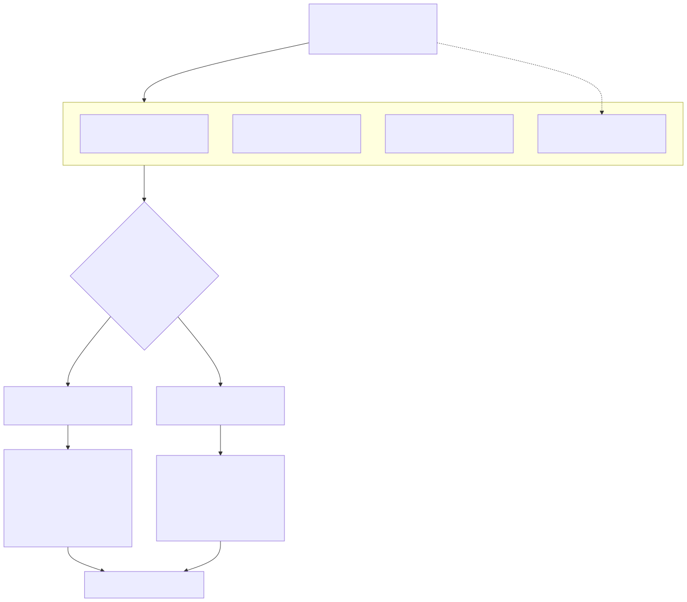
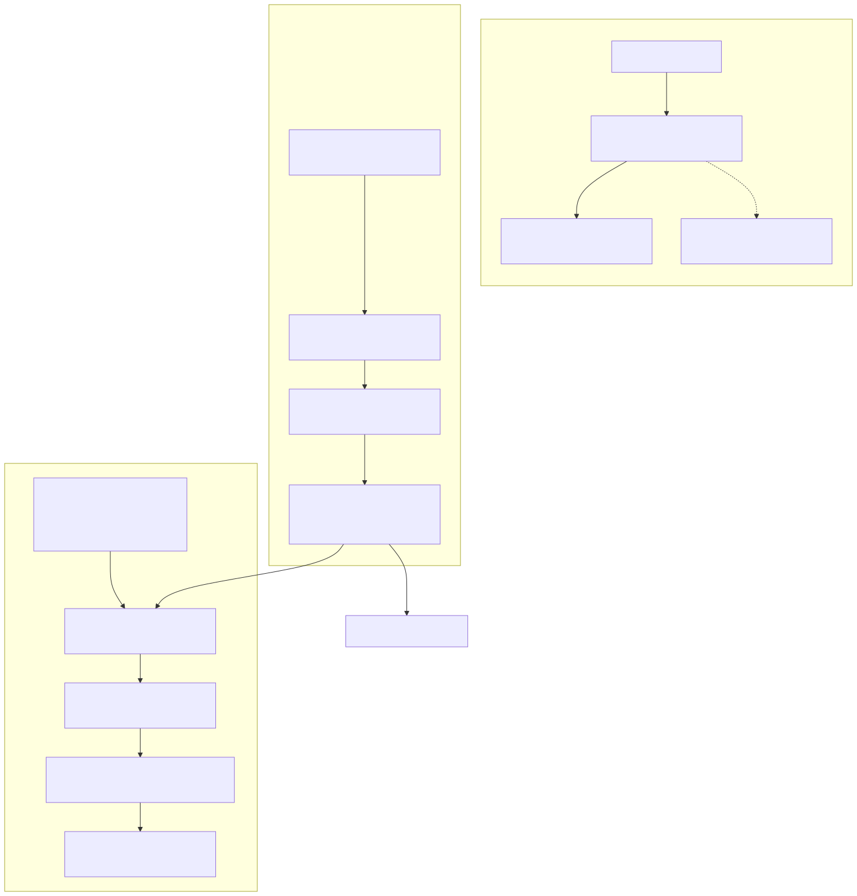

# Radiant — SVG, Vector Graphics & Diagram Layout

> **Last verified against tree:** 2026-10-08 (shared chart text measurement); 2026-10-07 (§4.4 layer content keys and folded uniform scale); 2026-10-06 (geometric clip intersections and lazy SVG font metrics; 2026-10-03 P7/P10 stroke/filter audit in §4.2, P12 SMIL in §4.5 and P13 exports in §5.3; other SVG geometry/paint sections retain the 2026-10-02 audit; graph sections retain the 2026-09-30 audit)

> **Part of the [Radiant detailed-design set](RAD_00_Overview.md).** This document covers three cohesive sub-areas that share one paint pipeline: the `RdtVector` immediate-mode vector API and active ThorVG backend, with an excluded CoreGraphics implementation retained for future exploration; the inline-SVG renderer that walks a *Radiant-parsed* SVG element tree and records it into that API (plus the easily-confused opposite-direction view-tree→SVG-text serializer); and Lambda graph layout whose routed edges enter Radiant as generated SVG paint layers.
>
> **Primary sources:** `radiant/render.hpp`, `radiant/rdt_vector_tvg.cpp`, `radiant/rdt_vector_cg.mm`, `radiant/render_svg_inline.cpp`, `radiant/render_svg.cpp`, `radiant/render_vector_path.cpp`, `radiant/render_path.cpp`, `radiant/graph_format.cpp`, `lmd/package/graph/document.ls`, `lmd/package/graph/layout.ls`, `lmd/package/graph/dagre.ls`, and `lmd/package/graph/transform.ls`.
> **Audience:** engine developers. **Convention:** `file:line` references drift; confirm against the symbol name.

---

## 1. What this area is

Everything Radiant paints as a vector — CSS backgrounds and borders, block clip paths, inline `<svg>`, standalone `.svg` files, and auto-laid-out `.mmd`/`.d2`/`.dot` diagrams — funnels through one narrow immediate-mode surface, `RdtVector` (`render.hpp`). That surface is the whole point of the design: Radiant code calls `rdt_path_*`/`rdt_fill_*`/`rdt_stroke_*`/`rdt_push_clip`/`rdt_picture_*` and never touches ThorVG or CoreGraphics directly. The header states the rule literally (`render.hpp`): "All Radiant rendering code calls rdt_* functions — never tvg_* directly." The one licensed exception is `render_svg_inline.cpp`, which may bridge a `Tvg_Paint` into an `RdtPicture` for text/image glyph runs (`rdt_picture_take_tvg_paint`, `render.hpp`, guarded by `#ifndef LAMBDA_HEADLESS`).

Three sub-areas share this surface and are documented in turn:

1. **The `RdtVector` abstraction** (§2–§3) — the API, active ThorVG implementation, retained CoreGraphics exploration source, and capability table that lets callers degrade gracefully.
2. **SVG** (§4–§5) — the inline-SVG renderer (SVG *input*) and, separately, the view-tree→SVG-text serializer (SVG *output*); these run in opposite directions and are easy to confuse.
3. **Graph / diagram layout** (§6–§8) — a Dagre-inspired Lambda layout over measured rich HTML nodes, with routed links lowered through generated SVG subscenes.

The recording substrate they share — PaintIR and the DisplayList — is owned by [RAD_12 — Paint IR & Display List](RAD_12_Paint_IR_Display_List.md); the render walk that drives it is [RAD_13 — Render Walk & Painters](RAD_13_Render_Walk_Painters.md). This doc describes the seams into those, not their internals.

---

## 2. The `RdtVector` abstraction and backend sources

### 2.1 The API surface

`struct RdtVector` (`render.hpp`) is a one-field wrapper around an opaque `RdtVectorImpl*` bound at `rdt_vector_init` to a **caller-owned ABGR8888 pixel buffer** (stride in pixels, not bytes — `render.hpp`). Around it the header declares the full immediate-mode vocabulary: path construction (`rdt_path_new`/`rdt_path_move_to`/`rdt_path_cubic_to`/`rdt_path_add_rect`/`rdt_path_add_circle`, `render.hpp`), fill/stroke (`rdt_fill_path`/`rdt_fill_rect`/`rdt_stroke_path`, `:171-189`), gradients (`rdt_fill_linear_gradient`/`rdt_fill_radial_gradient`, `:195-207`), nested geometric clipping (`rdt_push_clip`/`rdt_pop_clip` plus save/restore depth, `:215-222`), image blit (`rdt_draw_image`, `:230`), and SVG-picture loading/drawing (`rdt_picture_*`, `:243-258`). A portable path can also be inspected without knowing the backend via `rdt_path_visit` over the `RdtPathCommand` stream (`render.hpp,165`).

`RdtPath` and `RdtVectorImpl` are opaque (`render.hpp,66`); each backend defines the concrete struct. `RdtMatrix` (`render.hpp`) is a 3×3 affine deliberately laid out identically to `Tvg_Matrix`, with inline `rdt_matrix_identity`/`rdt_matrix_multiply`/`rdt_matrix_translate` helpers (`render.hpp`) so transform composition needs no backend call.

### 2.2 ThorVG is active; CoreGraphics is retained but excluded

There is **no runtime dispatch**. Both translation units define the complete `rdt_*` symbol set, so only one could be linked into a build. The current build configuration always compiles `rdt_vector_tvg.cpp` and lists `rdt_vector_cg.mm` in `exclude_source_files`, including the Jube overlay. CoreGraphics is intentionally not compiled or tested; its source is retained only for future backend exploration. ThorVG is therefore the sole active vector backend on every platform.

Callers still must not branch on backend identity. The active implementation publishes an immutable `RdtVectorCaps` table (`render.hpp`), returned by `rdt_vector_get_caps`, and optional-feature code gates on the flag. The retained CoreGraphics source follows the same contract so it can be evaluated later without changing callers. The table advertises `vector_paths`, `rounded_rects`, `gradients`, `nested_clips`, `image_scaling`, `picture_svg`, `picture_duplication`, `svg_dom_pictures`, `opacity_group`, `blend_modes`, `gaussian_blur`, `color_matrix_filters`, `native_text_runs`, `vector_batching`, `premultiplied_surface`, `tile_offsets`, and `clip_depth_save_restore`.

In the active ThorVG backend, native `gaussian_blur` is advertised only under `#ifdef __APPLE__`; the native CSS-filter blur path therefore degrades on Linux/Windows. This does **not** mean SVG blur is gone on those platforms — see the important clarification in §5.4. Any capability claims in the excluded CoreGraphics source are exploratory until that backend is deliberately reactivated and tested.

### 2.3 ThorVG backend internals

`rdt_vector_tvg.cpp` wraps the ThorVG C API (`thorvg_capi.h`). `rdt_vector_init` creates a software canvas targeting the caller's ABGR8888 buffer. A content-hash paint cache dedupes repeated fills, strokes, and gradients across frames. ThorVG has no clip stack, so the backend keeps a growable thread-local stack of paths. During display-list replay, a batch contains draws under one stable clip stack. Pushing or popping a clip flushes the preceding batch, and nested geometric clippers are applied once to that batch scene using `tvg_paint_set_clip`. Outside batches, the same helper clips individual paints. This preserves intersection and ordering without the full-surface alpha-mask composites that dominated repeated sprite draws. Clip paths remain owned by the adapter stack under **D4.2.6/D4.5.1v4**; ThorVG owns each submitted clipper shape.

### 2.4 Retained CoreGraphics exploration source

`rdt_vector_cg.mm` is excluded from compilation but retained for future exploration. It targets a `CGContextRef`, keeps a private premultiplied backing surface while preserving Radiant's straight-alpha ABGR public contract, defers flushes through `batch_depth`, and flips CoreGraphics' y-up CTM to Radiant's y-down coordinates. These internals are design notes, not a maintained capability guarantee, until the source is intentionally brought back under a compile/test target.

---

## 3. Paths and pictures on top of the abstraction

Two small files build geometry through the `RdtVector` API. `render_path.cpp` constructs clip/border geometry: `render_path_create_rounded_rect` (`render_path.cpp:7`) emits a per-corner rounded rectangle using the circle-approximation constant `RENDER_PATH_KAPPA` (`render_path.cpp:5`), and `render_path_create_clip_path` (`:65`) derives the current block's clip rectangle (honoring `has_clip_radius`). `render_vector_path.cpp` renders a CSS `VectorPathProp` — a block whose `vpath->segments` linked list carries `VPATH_MOVETO`/`LINETO`/`CURVETO`/`CLOSE` — into an `RdtPath` and then strokes/fills it through the render context (`render_vector_path`, `render_vector_path.cpp:6`).

SVG *pictures* — standalone `.svg` files and offscreen scenes — are loaded through `rdt_picture_load`/`rdt_picture_load_data` (`render.hpp`). Critically, **Radiant parses the SVG itself**, not ThorVG's loader: `svg_picture_create` (`rdt_vector_tvg.cpp:1646`) calls `parse_svg_document` in `lambda/input/input-xml.cpp` to produce a `KIND_SVG_DOM` picture holding a Radiant-parsed `Element` root plus an owned `Pool` (`RdtPicture::Kind`, `rdt_vector_tvg.cpp:60`; the file comment at `:1710` states "the SVG path is parsed by Radiant (not ThorVG)"). Loaded pictures are cached by path under `g_picture_cache_mutex` (`rdt_vector_tvg.cpp:101,286`). Drawn into a page (an ``, a CSS background, or an SVG `<image>`), a `KIND_SVG_DOM` picture is painted into the recording on the recording thread by `render_svg_record_picture`, exactly like inline SVG and with its text as glyph items. It is never deferred to replay, where tile workers would run the painter concurrently ([RAD_12 §3](RAD_12_Paint_IR_Display_List.md)). Off-screen draws (`rdt_picture_draw`, e.g. rasterizing an image cache, the PDF raster fallback) record and replay a private DisplayList (`render_svg_to_vec_via_display_list`), so file-SVG, inline-SVG, and PDF export (`render_pdf.cpp`) all share one renderer. `rdt_picture_get_svg_root`/`rdt_picture_find_svg_element_by_id` (`render.hpp`) expose that parsed tree for scripting.

---

## 4. Inline SVG — walking a Radiant-parsed element tree

`render_svg_inline.cpp` (5633 lines) is the real SVG feature implementation. It does not use ThorVG's SVG loader; it walks the `Element*` tree Radiant already parsed and records paint operations. The render walk reaches it through the backend seam: `render_inline_svg` (`render_svg_inline.cpp:5519`) is called from `render.cpp:161`, `render_raster_walk.cpp:53`, and via the backend function pointer `backend->render_inline_svg` in `render_walk.cpp:176`. Layout consults `calculate_svg_intrinsic_size` (`render_svg_inline.cpp:924`) for CSS Images-Level-3 sizing (the `SvgIntrinsicSize` struct, `render.hpp`) from `layout_block.cpp`.

### 4.1 Traversal state and dispatch

All traversal state lives in `SvgInlineRenderContext` (`render.hpp`): the `svg_root` and `Pool`, an optional `FontContext`, the required `DisplayList* dl` and `PaintList* paint_list` record targets, the accumulated `RdtMatrix transform` (viewBox × group × element), viewBox transform fields, inherited paint/text style (fill/stroke/opacity/`current_color`/font), the `defs` `HashMap` of id→definition, an embedded-`<style>` rule cache, the `suppress_masks` recursion guard, the `id_scope` tree that same-document `<use>` references resolve in (the DOM tree root for inline SVG, from `render_svg_reference_scope`; the SVG root otherwise), and the `use_chain` of instances being expanded.

The core recursion is `render_svg_element` (`render_svg_inline.cpp:4617`), a tag dispatcher over `render_svg_basic_shape` (rect/circle/ellipse/line/polyline/polygon), `render_svg_path`, `render_svg_text`, `render_svg_image`, `render_svg_group`, `render_svg_children`, and `<use>` resolution `render_svg_use_target`/`render_svg_external_use`. `<defs>` is registered by `process_svg_defs` → `register_svg_def_element`, which stores gradients, clip paths, masks, symbols, patterns, and markers in a `SvgDefTable`. A `<use>` does not go through that table: its fragment resolves like `getElementById` over `id_scope` (`rdt_picture_find_element_id`), so any element can be instanced, including a `<symbol>` in another inline `<svg>` of the page. The instance renders as a `<g>` carrying the `<use>`'s transform and presentation attributes, then `translate(x, y)` (`svg_group_enter`/`svg_group_leave`, shared with `render_svg_group`), so the content inherits from the `<use>`; a reference to the `<use>`'s own ancestor, or to an element already being instanced, renders nothing (SVG 2 §5.6).

### 4.2 Geometry, paint, filters, clips, text

Path data is parsed by `parse_svg_path_d` (`render_svg_inline.cpp:2132`), which handles M/L/H/V/C/S/Q/T/A/Z and converts elliptical arcs to cubics via `arc_to_beziers`; either zero radius produces a line. Each segment is emitted only after all its finite decimal parameters and arc flags parse; malformed input retains the completed prefix, and smooth curves reflect only a matching preceding curve kind. `svg_append_basic_shape_path` (`:1651`) shares geometry across paint, masks and clips: rectangle radii use two-way auto fallback and independent half-size clamps; lines retain the initial `stroke:none`. Transform lists are parsed by `parse_svg_transform` into a 6-float matrix; `points` attributes by `parse_points_to_path`.

SVG length contexts capture the declaring font descriptor and borrow its isolated font context under **D4.2.2v2–D4.2.4**. Font metrics are resolved only when an `ex` unit is consumed (including CSS math and filter resources); pixels, percentages and `em` lengths do not scan the font database. Authored SVG font faces remain isolated from page font faces.

Object-bounding-box resources consume `rdt_path_get_bounds` (`rdt_vector_tvg.cpp:1332`): cubic derivative extrema give the geometry box, isolated moves do not expand it, and closepath restores the subpath origin. Paths, polygons and polylines now supply that box to gradient/pattern painting. `parse_svg_color` (`render_svg_inline.cpp:682`) delegates to the shared `css_parse_color`, including percentage RGB, named colors and HSL; shared RGBA conversion lives in `lib/color.h`. Group-opacity capture (`svg_group_enter`, `render_svg_inline.cpp:4230`) uses the root target viewport and its placement transform before viewBox/group mapping, so missing or nonzero viewBox origins do not change the capture region. These values remain logical floats (**RSC1/RSC6** in [Radiant Scale](../../../vibe/radiant/Radiant_Scale.md)); retained paint ownership remains governed by **D4.2.2v2–D4.2.4** in [Lambda Formal Design](../../Lambda_Formal_Design.md). Coverage and remaining work are recorded in the [SVG implementation plan](../../../vibe/impl/Lambda_Impl_SVG_Support.md#74-progress-record).

Paint dispatch uses `draw_svg_fill_stroke`, gradient/pattern lowering and the
shared stroke-width/dash/order facts. Authored path topology places start/mid/end
markers on paths, lines, polylines and polygons; marker instances resolve
viewBox/PAR, units and context paints. Affine non-scaling strokes share the
paint/hit geometry path. Broader SVG2 vector effects remain explicitly partial
in the [support matrix](../../HTML_CSS_SVG_Support.md#152-attributes-styling-and-paint-servers).

Filters use `svg_filter_compile` and `render_svg_filter_execute`
(`render_svg_inline.cpp`, `render_svg_filter.cpp`) through the common
`svg_render_effect_scope` boundary. Document-owned, mutation-keyed programs
contain the F1–F4 graph facts; acquisition pins them against reclamation.
Intermediate premultiplied surfaces and work counters are execution-owned;
the final surface survives source/scratch/program teardown. Filter and primitive
regions take viewport/geometry from the referencing target and current font
metrics from the declaring resource through `RdtSvgFilterRun::resolve_lengths`.
External resources use their isolated document and relative URL base. These
ownership seams follow **D4.2.2v2–D4.2.6/D4.5.1v4** (pin, gen-check,
copy-as-value). Component transfer and convolution remain unavailable.
The [P7/P10 audit](../../../vibe/impl/Lambda_Impl_SVG_Support.md#714-p7p10-final-stroke-oracle-and-filter-resource-audit)
records coordinate, mutation, teardown and browser-reference evidence.

SVG authored styles use `svg_style_init`/`svg_style_property_value`, backed by
`css_select_element_declaration`, the shared CSS parser/selector/cascade engine.
Inline nodes use their live host DOM and stylesheet environment; external SVG
images/use documents allocate isolated metadata for the paint walk. Inline
importance and selector-list specificity follow the shared priority comparator.
Group family/size/weight/slant and visibility inherit through traversal state;
hidden containers still visit visible descendants. Gradient stops use the same
adapter for color, currentColor and opacity. `svg_get_dom_presentation_property`
serves interaction queries, so visibility paint and pointer targets agree.
Stylesheet text replacement queues owner reparsing even for a STYLE-classified
mutation. SVG layer keys include host document epochs, glyph-cache generations
and font descriptor/source generations, retaining document ownership under
**D4.2.2v2–D4.2.4/D4.5.1v3**.
Text is laid out as addressable characters on one line (SVG 2 §11).
`svg_text_collect` collapses whitespace across text/tspan/a boundaries and consumes
full positioning lists in UTF-16 units; repeated rotation, inherited spacing,
baseline facts, chunks, text-anchor and nested textLength feed `svg_text_place`.
Logical font metrics and authored family-list fallback come from `lib/font`.
`font_visit_glyph_path` shares TrueType outline conversion with font rasterization
and uses the native CoreText outline visitor where available. Bitmap-only glyphs
use coverage contours with preserved holes; empty outline stubs cannot suppress
that fallback. Color glyph pixels are copied into an owned image resource.
All glyph contours enter the shared SVG fill/stroke paint and text/tspan opacity
scopes; paint servers and complete effects remain later work. Decoration paths
share `render_path_create_decoration` with HTML text; underline/overline precede
glyph paint and line-through follows it. `svg_text_geometry_path` derives DOM
bounds and pointer cells from this same layout, preserving tracking but excluding
positioned and calibrated gaps. Isolated SVG resources and geometry-only callers
own their font registry and copy CSS metadata through the existing descriptor
bridge (**D4.2.2v2-D4.2.4, D4.5.1v3**). ThorVG text remains a fallback for an
unavailable font path. Normative UTF-16, nested-calibration and SVG 2 decoration
fixtures record their specific disagreement with Chromium 143; general shaping
is an existing font-engine limitation.

Chart guide measurement shares this positioned SVG layout. A batch keeps one
font/style context for direct text requests, copies advances and the union of
character-cell and glyph-outline bounds, and releases its transient document.
The host `radiant.measure_svg_text` function is read-only (**D7.4.6**); only
copied scalar metrics cross the ownership seam (**D4.2.2v2**, **D4.5.1v4**).
This also preserves the existing SVG DOM geometry path through the shared
collector. Measurement includes the renderer's current fallback and spacing
behavior; it does not introduce a separate shaper.

Chart truncation uses `radiant.graphemes` for stateful UAX #29 segmentation
with the bundled Unicode data. Its copied strings and result array belong to
the caller's runtime, protected by precise roots (**D4.5.1v4**). It preserves
input bytes, including embedded NUL, independently of SVG font shaping.

### 4.3 Record then replay

Handlers do not blit. They append to a `PaintList`/`DisplayList` through inline wrappers (`svg_fill_path`/`svg_stroke_path`/`svg_fill_linear_gradient`/`svg_draw_picture`, `render_svg_inline.cpp:180-213`) that call the shared `paint_record_*` API ([RAD_12](RAD_12_Paint_IR_Display_List.md)). `render_svg_inline_register_paint_ir_lowerers` (`:5409`) registers the SVG subscene lowerer so a deferred `PaintSvgSubscene` (`render.hpp`) can be expanded later by raster, PDF, and SVG-output backends. `render_svg_to_vec_via_display_list` (`:5446`) is the offscreen entry: it builds the PaintList/DisplayList and replays it into an existing `RdtVector` (with tiling support), so pictures follow the exact same replay path as page raster output rather than emitting immediate `rdt_*` calls.

### 4.4 Raster layer cache for unchanged inline SVG

The interactive viewer repaints the whole page on every frame that has a DOM mutation (RAD_16 §3), and §4.3 re-walks, re-parses and re-rasterises every inline `<svg>` on each of those frames. A decorative full-page SVG therefore cost ~60 ms a frame at 2× even when nothing inside it changed. `render_inline_svg` now consults a per-document **layer cache** first (`svg_layer_paint`, `render_svg_inline.cpp`, same file as the walker because it reuses `render_svg_to_display_list`):

- **Change signal.** `DomElement::svg_layer_generation` is bumped by `dom_mutation_notify` (`lambda/dom/dom.cpp`, `dom_svg_layer_note_mutation`) for every `<svg>` ancestor of a mutated node, including the `parent` side of a removal. It is independent of the bounded `mutation_records` ledger, so record overflow never hides a change. Page-level inputs that also shape the raster are part of the key: layer size in physical pixels, the layer scale (`raster_scale` times any folded CSS scale), and the inherited `SvgInitialPaint`; the DOM node id guards a recycled element address. Host-document changes key through `DomDocument::style_content_epoch`, which `dom_mutation_notify` bumps for every mutation except a presentation write of a non-inherited property (an opacity or transform animated on an ancestor cannot change the raster), and through `doc_state_content_version`, which is `DocState::version` minus its repaint/reflow bookkeeping bumps (`render_flag_bumps`), so a frame's own repaint request does not invalidate every layer. `<use>`/`url(#id)` references *outside* the `<svg>` are not tracked — a change there is picked up only when the referencing SVG itself mutates.
- **Capture policy.** A miss records the SVG directly and arms the entry; only the *second consecutive* paint of identical content captures (`svg_layer_capture`), so an SVG animated every frame never pays for a layer it would not reuse. `RADIANT_SVG_LAYER=eager` captures on the first paint (this is how a one-frame `lambda render` can be diffed against `RADIANT_SVG_LAYER=off`; at whole-pixel positions the two agree to within one level per channel). Layers above 48 MB, or beyond 256 MB per document, stay uncached.
- **Capture mechanics.** The page painters that share the surface — ThorVG fills, glyph blits, group-opacity composites — all assume an opaque target (the ThorVG target is `TVG_COLORSPACE_ABGR8888`, premultiplied, while the CPU composites use straight math; a straight-alpha ThorVG target blended translucent fills wrongly in a spot check). The layer is therefore rendered twice, over black and over white, each pass recording its own private `DisplayList` (`svg_layer_render_pass`; serial replay hands owned payloads such as pictures to the backend, so one list cannot be replayed twice, which washed out PDF page images in `doc_editor_prince_scroll`). The `RasterRenderContext` list, clip, transform and dirty state point at the layer while recording so `DL_DRAW_GLYPH` runs land in it; `svg_layer_resolve_alpha` recovers exact straight RGBA from the difference, and a cached paint at a whole-pixel position is pixel-identical to a direct one. The surface is a document resource (`services.svg_layer_registry`, `dom_document_add_resource`) modelled on the `<canvas>` backing store.
- **Paint.** A hit emits one `DL_BLIT_SURFACE_SCALED` through `render_painter_blit_surface_scaled`; `raster_blit_surface_scaled` has a whole-pixel 1:1 fast path (integer source-over, clear pixels skipped, solid pixels copied). An axis-aligned uniform scale plus translation in `rdcon->transform` (a CSS drift on the layer, a presentation stage fitted to its window) folds in (`svg_layer_device_transform`): the scale into the capture resolution, the translation into the destination, which is snapped to whole device pixels — a fractional position moves the layer by at most half a pixel against a direct paint (ink centroid shift ≤0.46 px on a 0.907-scaled stage, ink totals within 0.05%). Rotation, skew, flips and non-uniform scale disqualify the layer for that frame. The CSS transform reaches `rdcon->transform` because `render_raster_dispatch_block` pushes the `<svg>` block's own transform around its early SVG dispatch (`render_state_push_transform`); before 2026-09-30 that dispatch skipped `render_block_view`, so a CSS transform on an `<svg>` element was silently not painted.

What this buys: a page whose static art sits in its own `<svg>` elements, with per-frame changes confined to a small dynamic `<svg>` and motion on static layers expressed as CSS translates, repaints from cached rasters — `test/ui/doc_editor.html` went from ~7.5 to ~24 fps in the window. A `.slides` deck animating 100 objects on a fitted stage repaints its 33 shape `<svg>` elements from layers on every animated frame: they are captured once when the cue starts and once when its final commit restyles them. Static art and animated elements sharing one `<svg>` still re-rasterise together, because the unit is the `<svg>` element.

---

### 4.5 SVG animation and clock dependencies

`svg_animation.cpp`/`svg_animation.hpp` adapt the document scheduler to
`animate`, `animateTransform` and `set`. Base DOM attributes remain unchanged;
the document owns typed sampled values and generation-checked `DomNodeRef`
controls. Pause/seek and begin/end methods feed the same interval evaluator as
events and syncbases. Directly nested SVG shares its outer fragment's clock;
SVG below an HTML integration point owns a separate clock. Detach prevents
driver creation while a pinned node can retain its sampled state for reattachment.
Nested SVG reads its outer fragment time; its pause/seek setters are inert,
following [SVG Animations §5.8](https://svgwg.org/specs/animations/#InterfaceSVGSVGElement).

Font, ancestor viewport, currentColor and filter type samples precede dependent attributes;
priority within one attribute still follows begin time and document order.
Equal relative units survive interpolation until used-value resolution. Mixed
units use the shared SVG length resolver; opacity/offset percentages use a
dimensionless basis. Discrete to-animation transitions follow SVG 1.1 §19.2.9,
including XML initial values. Indefinite simple duration ignores keyTimes and
retains the initial function value even when frozen.

Style properties and compiled filter programs key both DOM epoch and effective
animation generation. External use exposes samples only inside its active source
subtree, follows the host clock, and keeps separately referenced resources static.
Cached strings copy sampled values before another instance can replace sample
storage. Pinned filter programs preserve their recorded facts until released.
This follows **D4.2.2v2–D4.2.6/D4.5.1v4**, whose seam contract is
**“pin, gen-check, copy-as-value.”** SVG image picture draw state is separate from
the immutable parsed owner; every fragment in its private document receives
the image time. HTML image copies sharing a cached URL share the surface clock,
following [HTML §15.4.2](https://html.spec.whatwg.org/multipage/rendering.html#images).

The supported value classes, explicit work/storage bounds, raw Chromium
differences and final gates are in
[the implementation record §7.16](../../../vibe/impl/Lambda_Impl_SVG_Support.md#716-p12-remaining-timing-instance-dom-and-final-closeout).
Access keys observe trusted character input independently of focus. Wallclock
calendar/time/zone values resolve against one captured fragment origin, preserved
across pause/seek; expired pre-zero intervals cannot freeze or feed syncbases.

Use instances own private controls, samples and nested instance registries under
the host document. Hit testing replays the actual use chain before resolving
implicit event timing; qualified ID events and access keys also reach subsequent
instances. Host clock ticks deliver private begin/repeat/end timing to dependent
animations. External use source DOM/style/font documents retain their parsed
picture owner until the host releases private controls (**D4.2.6/D4.5.1v4**).
All instances share the host's work/storage limits.

The animation DOM surface includes targetElement, getStartTime, getCurrentTime,
getSimpleDuration and void begin/end methods, with finite float argument
conversion and InvalidStateError/NotSupportedError DOMExceptions. TimeEvent
creation and initialization preserve readonly view/detail, IDL long conversion,
nonbubbling/noncancelable dispatch and initialization guards. These extend the
record-owned host protocol (**D7.4.4**); exception/event construction uses precise
roots (**D5.3.3**). Motion/discard and general SVG DOM reflection/prototypes are
outside N1, and the broad SMIL matrix row remains partial.
`make test-svg-smil` exercises controlled/running clocks through real UI input
at 1×/2× with layers disabled/eager; its browser mode keeps independent reference
pages distinguishable from the raw SVG captures.

---

## 5. SVG output — the opposite-direction serializer (do not confuse with §4)

`render_svg.cpp` is a different thing entirely and a frequent source of confusion: it is a `RenderBackend` that serializes the **already-laid-out view tree back out to an SVG *text* document**. It consumes views and produces SVG markup; §4 consumes SVG and produces pixels.

### 5.1 Entry and driver

The entry point is `render_view_tree_to_svg` (`render_svg.cpp:1717`, declared in `render.hpp`), called from `render_img.cpp:501`. It builds an `SvgRenderContext` (`render_svg.cpp:44-66`, a `StrBuf* svg_content` plus font/block/effect state) and wires a standard render-walk backend via `svg_make_backend` (`:1622`). The walk's callbacks emit markup: `svg_cb_render_bound` → `render_bound_svg` (`:788`) for rects/borders/backgrounds, `svg_cb_render_text` → `render_text_view_svg` (`:290`) for `<text>`, borders via `svg_emit_border_side` (`:696`), and inline SVG via `svg_cb_render_inline_svg` (`:1337`), which itself builds a `PaintSvgSubscene` (`:1387`) so nested inline SVG re-uses §4's machinery.

### 5.2 Raster fallback for inexpressible effects

Effects SVG text cannot express (Gaussian blur, blend modes, color-matrix filters) are rasterized to an embedded `<image>`: `svg_begin_effect_raster_fallback`/`svg_finish_effect_raster_fallback` (`render_svg.cpp:232,248`) capture the effect group and `svg_emit_raster_fallback_image` (`:214`) encodes it as a base64 PNG via `svg_encode_surface_png` (`:161`). This is the output analog of the caps-driven degradation in §2.2 — the serializer honors the same "SVG can't do this" boundary by falling back to pixels.

### 5.3 Both SVG directions share the subscene builder

`PaintSvgSubscene` (`render.hpp`) is the shared unit: raster (`render_raster_walk.cpp:53`), PDF (`render_pdf.cpp`), and this SVG-output backend (`render_svg.cpp:1387`) all defer inline-SVG through the same builder, which keeps one code path for SVG regardless of the final target.

P13 export records resolved SVG paint through `render_svg_subscene_with_paint`.
SVG lowers supported paths/gradients and embeds a transparent snapshot for other
paint; PDF retains native opaque paths and uses density-aware transparent replay
for the rest. SVG pictures use the same subscene and image-placement contract.
Authored `data-*`, role/label and geometry metadata are copied into optional
`DlElementMarker` snapshots; SVG text carries an accessible title alongside its
glyph outlines. Semantic PaintIR groups retain those values without changing
raster or PDF graphics state. The recording arena owns all copied strings until
synchronous lowering finishes; retained marker copies use the same copy helper
(**D4.2.2v2–D4.2.6/D4.5.1v4**). Both exports share native canvas-background
resolution, and PDF applies output scale to its page CTM with logical tree
coordinates. `make test-svg-export` verifies the portable output matrix.

CLI exports create the document at time zero and resolve SMIL before recording.
Negative begins and frozen intervals that ended before zero therefore contribute
their initial sampled state. Delayed animations retain their base paint; SVG
images start at their own initial time. PNG/SVG/PDF use the same snapshot,
including external use and animated filter resources. No CLI sample-time option
is currently exposed. `svg_smil_export_initial` verifies this contract in all
three formats at both densities.

### 5.4 Important: SVG `<feGaussianBlur>` is not gated by the backend blur cap

The `gaussian_blur` capability flag (§2.2) describes the **vector backend's native filter blur**, consumed by the CSS filter/backdrop path (`render_filter.cpp:208`, `render_backend_caps.cpp:10`). Inline SVG's `<feGaussianBlur>` takes a *different* route: `svg_finish_gaussian_blur_filter` records a `box_blur_region` DisplayList op (`svg_box_blur_region`, `render_svg_inline.cpp:239,1317`) that is replayed in **software** by `dl_replay_box_blur_region` (`display_list_replay_effects.cpp:28`), with no `__APPLE__` guard. So inline-SVG blur works on all platforms; only the backend-native CSS-filter blur is `__APPLE__`-limited for ThorVG. The scan digest's blanket claim ("no Gaussian blur on Linux/Windows") over-generalizes and should be read as this narrower statement.

---

## 6. Graph / diagram layout — semantic HTML and Velmt

The C syntax parsers produce a Lambda `<graph>` element. `graph.transform.to_html()` normalizes it to a semantic `<graph data-radiant-layout="lambda-graph">` containing measured `<node>` children and zero-size `<edge>` metadata children. Nodes may contain arbitrary block, inline, flex, grid, text, image, or whole-SVG content.

Radiant first lays out every direct child with its normal layout engine. The retained Lambda callback receives ephemeral Velmt handles containing each child's border-box dimensions and attributes. `graph.layout.from_velmts()` builds the canonical map model, calls `graph.layout.compute()`, and returns border-box top-left placements plus routed edge geometry. The callback is pure; registration is the explicit orchestration step.

The resulting document retains its Lambda runtime, heap, JIT code, callback, and generated layer roots. Callback lookup is scoped by the parent document's retained heap plus layout name, so simultaneous documents cannot overwrite one another's `lambda-graph` registration.

---

## 7. The Dagre-inspired hierarchical algorithm — and what it is not

`lmd/package/graph/dagre.ls` is **Dagre-inspired, not a faithful port of the JS Dagre library**. It normalizes nodes and edges, assigns longest-path ranks, creates layers, performs a barycenter ordering sweep, assigns centered coordinates, transforms those coordinates for TB/BT/LR/RL, clips endpoints to node rectangles, and emits orthogonal paths.

Network-simplex ranking, dummy nodes for long edges, Brandes-Kopf coordinate assignment, shape-specific clipping, parallel-edge separation, self-loop routing, clusters, and edge-label placement are not yet implemented. Long or cyclic graphs can therefore produce weaker ordering and routes than Graphviz or JS Dagre.

---

## 8. Generated SVG paint and CLI flow

`graph.transform.paint` converts routed edge points into immutable `<svg>` elements returned as custom-layout `paint_layers`. Radiant roots those elements for the document lifetime and merges generated layers with normal node child views using one stable signed-z sequence. SVG, PDF, and raster backends consume the same sequence; hit testing consumes it in reverse while skipping generated layers, which are initially non-interactive.

`LambdaDocumentTransformConfig` selects `lambda.graph.document.to_html`; the native loader parses the graph input, passes typed `theme`/`view_key` options, and invokes that public package export. `render`, `view`, `layout`, and generic document loading share this route without generating Lambda source. This is an ordinary shipped-package invocation under **D7.2.1–D7.2.2**. Final SVG/PDF/PNG/JPEG output is produced by normal Radiant rendering; there is no direct C graph-to-SVG path.

---

## 9. Known Issues & Future Improvements

1. **`render_svg_inline.cpp` is a 5633-line monolith.** It mixes SVG parsing, CSS style resolution, path/arc geometry, gradients/patterns, filters, clips/masks, and text glyph rendering in one file. *Improvement:* split along the natural seams — path parsing, filters/masks, gradients/patterns, and text — into separate TUs sharing `SvgInlineRenderContext`.
2. **Graph layout is Dagre-inspired, not a faithful port** (`lmd/package/graph/dagre.ls`). It still lacks network-simplex ranking, dummy nodes, Brandes-Kopf x-assignment, clusters, parallel-edge separation, and self-loop routing. *Improvement:* normalize long edges through dummy ranks before repeated crossing-reduction sweeps.
3. **Backend caps parity gaps** (`rdt_vector_tvg.cpp:774` vs `rdt_vector_cg.mm:273`). Both leave `opacity_group`, `blend_modes`, `color_matrix_filters`, and `native_text_runs` = false, so those effects silently no-op or fall back to raster (§5.2). The ThorVG native `gaussian_blur` cap is `__APPLE__`-only (`rdt_vector_tvg.cpp:787-791`) — the CSS-filter blur path degrades on Linux/Windows ThorVG builds (but inline-SVG `<feGaussianBlur>` does not; see §5.4).
4. **Fixed clip-stack depth in the ThorVG backend.** `RDT_MAX_CLIP_DEPTH` is hard-coded to 8 (`rdt_vector_tvg.cpp:1461`); overflow is logged and the clip dropped (`:1476`). Deeply nested SVG clip paths beyond depth 8 silently lose clipping.
5. **Two directions named "SVG" are easy to confuse.** `render_svg_inline.cpp` is SVG *input* (element tree → pixels); `render_svg.cpp` is SVG *output* (view tree → SVG text). They share only the `PaintSvgSubscene` builder. *Improvement:* rename `render_svg.cpp` to something like `render_svg_output.cpp` to make the direction unmistakable.
6. **Sparse explicit debt markers.** The only "unsupported" log in the inline renderer is the SVG path parser's unknown-command branch (`render_svg_inline.cpp:2263`); `rdt_picture_load` logs unsupported formats rather than falling back. Most debt here is structural (file size, algorithm scope) rather than tagged with TODO/FIXME.
7. **Layer cache has no eviction.** `svg_layer_registry` (§4.4) keeps a captured layer until the document is torn down or the same element changes; an `<svg>` removed from the tree keeps its raster (bounded by the 256 MB per-document cap). A rotated, skewed, flipped or non-uniformly scaled `<svg>` never caches. *Improvement:* evict entries not painted for N frames; draw transformed layers through `DL_DRAW_IMAGE` with a premultiplied upload.
8. **Manual lifetime bookkeeping around `RdtPicture`.** The path-keyed picture cache plus its mutex (`rdt_vector_tvg.cpp:101,286`) pair with hand-managed `Pool`/`Element` ownership on `KIND_SVG_DOM` pictures — a place to watch for leaks or races under concurrent load.

---

## Appendix A — Source map

| File | Responsibility (this doc) |
|---|---|
| `radiant/render.hpp` | The immediate-mode `rdt_*` API, `RdtMatrix`/`RdtPath`/`RdtVector`, the `RdtVectorCaps` table, and the "never call `tvg_*`" rule. |
| `radiant/rdt_vector_tvg.cpp` | ThorVG backend: SW canvas, content-hash paint cache, geometric clip path stack, `svg_picture_create` (Radiant-parsed SVG-DOM pictures), `g_tvg_caps`. |
| `radiant/rdt_vector_cg.mm` | CoreGraphics backend: premultiplied backing surface, straight-alpha conversion at flush, batch-depth flush deferral, y-down CTM flip, `g_cg_caps`. |
| `radiant/render.hpp` / `render_svg_inline.cpp` | Inline-SVG declarations and implementation: element dispatch, path/arc/transform parsing, gradients/patterns/filters/clips/masks, dual-path text, and record/replay into `RdtVector`. |
| `radiant/render.hpp` / `render_svg.cpp` | View-tree → SVG-text declarations and serializer (`render_view_tree_to_svg`, `svg_make_backend`) with raster fallback for inexpressible effects. |
| `radiant/render_path.cpp`, `radiant/render_vector_path.cpp` | Rounded-rect/clip path construction and CSS `VectorPathProp` rendering through `rdt_*`. |
| `lmd/package/graph/layout.ls`, `dagre.ls` | Pure canonical graph geometry, ranking, coordinates, and edge routing. |
| `lmd/package/graph/transform.ls`, `transform/*` | Semantic HTML, custom-layout installation, themes, and generated SVG edge layers. |
| `radiant/graph_format.cpp` / `lmd/package/graph/document.ls` | Graph syntax detection plus the shared configured package transform for render, view, layout, and generic loading. |
| `radiant/stacking_order.cpp` | Stable signed-z merge of generated layers and measured node views. |

## Appendix B — Related documents

- [RAD_00 — Overview](RAD_00_Overview.md) — the set index and architecture.
- [RAD_01 — View & DOM Model](RAD_01_View_and_DOM_Model.md) — the parsed `Element`/view tree that both inline SVG and the SVG-output serializer traverse.
- [RAD_12 — Paint IR & Display List](RAD_12_Paint_IR_Display_List.md) — the `paint_record_*` / DisplayList substrate the inline-SVG renderer records into and replays.
- [RAD_13 — Render Walk & Painters](RAD_13_Render_Walk_Painters.md) — the render walk and `RenderBackend` seam that dispatch `render_inline_svg` and drive the SVG-output backend.
- [RAD_07 — Fonts](RAD_07_Fonts.md) — the `FontContext` and glyph pipeline used by SVG `<text>` rendering.

### SVG image resources (2026-10-02 verification)

`render_svg_image` resolves the source URI in the document/resource context and
uses the shared image cache and raster decoders, including GIF and static WebP.
A single intrinsic-to-image-rectangle transform applies x/y and aspect fitting
before the element transform. Nested SVG images record through the same SVG
painter in isolated image mode; standalone SVG loads a DOM-backed document.
GIF frames and decode promotion advance resource generation and invalidate layers.
Deferred cache-owned images are checked by generation at replay; fallback decoded
surfaces transfer to PaintIR and their pixels are copied into DisplayList storage
before cleanup (**D4.2.2v2-D4.2.4/D4.5.1v3**). No vendored ThorVG loader/code is
modified. The implementation plan records browser and cache/scale evidence.

**2026-10-02 P6 paint increment.** Typed inherited fill/stroke/currentColor and
recursive use context paint share geometry frames. Gradients carry spread,
focal circles, transforms and owned dash arrays through PaintIR/DisplayList/
retained caches; dynamic stops use shared styles. Local/external templates retain
isolated document/font owners and relative bases under **D4.1.3, D4.2.2v2-D4.2.4,
D4.2.6**. Pattern tiles and radial-cone fallbacks share offscreen path coverage
and preserve suspended clip ownership. Focused scale/cache validation passes
936/936, vector 24/24, DisplayList 77/77 and retained storage 24/24. Chromium
normative differences and the running aggregate gate are recorded in
[vibe SVG implementation plan](../../../vibe/impl/Lambda_Impl_SVG_Support.md) §7.4.
This was the initial geometry checkpoint. Markers/effects/textPath/embedded HTML/animation and macOS exports are implemented in §§4–5 and the SVG closeout record; Linux/Windows P13 runtime smoke remains outstanding.
