# Radiant — Events & Input Dispatch

> **Part of the [Radiant detailed-design set](RAD_00_Overview.md).** This document covers the interaction *input* half of Radiant: the single funnel `handle_event()` that takes platform input, hit-tests it against the layout view tree, builds a root→target view stack, and fires DOM-style events out to three consumers at once — native default actions, the Lambda/JS handler bridge, and the editing controllers. It covers the `RdtEvent` union and `EventContext` record, the hit-test recursion, mouse/keyboard/IME/scroll/context-menu input, the deterministic `event_sim` replay harness that drives the *same* funnel, and the event-state JSONL log. Timing and animation (the render loop, frame clock, `@keyframes`) are a separate concern documented in [RAD_16 — Animation & Frame Scheduling](RAD_16_Animation_Frame_Scheduling.md).
>
> **Primary sources:** `radiant/event.hpp` (event, input-context, logging, context-menu, and scrolling declarations), `radiant/event.cpp` (`handle_event`, targeting, and dispatch), `radiant/event_sim.{cpp,hpp}` (JSON-driven replay/test harness), `radiant/event_state_log.cpp` (JSONL log + `JsonWriter`), `radiant/context_menu.cpp`, `radiant/scroller.cpp`, `radiant/ime_mac.mm`, and `radiant/ime_win.cpp`.
> **Audience:** engine developers. **Convention:** `file:line` references drift; confirm against the symbol name.

---

## 1. Responsibility and the single-funnel principle

Radiant routes *every* input — real GLFW callbacks, native IME composition, and synthesized test events — through one function: `handle_event(UiContext*, DomDocument*, RdtEvent*)` (`event.cpp:6664`). The GLFW callbacks in `window.cpp` (cursor/button/scroll/key/char) build an `RdtEvent` and call it directly (`window.cpp:485/505/519/597/620`); the platform IME shims funnel through the C bridge `radiant_dispatch_editing_composition_event` (`event.cpp:3647`) which itself calls `handle_event` (`event.cpp:3680`); and the automation harness synthesizes events into the *same* call ([§8](#8-event_sim--deterministic-replay--ui-test-harness)). There is exactly one production input path.

The design rationale is fidelity: because the test harness exercises the identical `handle_event`, a JSON-scripted regression test hits every real dispatch, hit-test, and default-action site. The cost is that `handle_event` is a single ~2900-line switch over `EventType` and `event.cpp` is the largest interaction file in the tree (~9,554 lines / 440KB). This monolith is the recurring theme of [§10](#10-known-issues--future-improvements).

`handle_event` short-circuits early for documents that cannot receive DOM events: it returns if there is no `doc`, no content at all, or — for PDF documents which have a `view_tree` but no `html_root` — after logging "PDF document - skipping DOM event handling" (`event.cpp:6674-6683`). Otherwise it calls `event_context_init` (`event.cpp:5040`), opens an event-state-log cascade via `state_begin_event_cascade` (`event.cpp:6688`), emits the raw input record (`event.cpp:6689`), and switches on the event type.

---

## 2. The event model — `RdtEvent` and `EventContext`

### 2.1 The `RdtEvent` tagged union

`enum EventType` (`event.hpp:8`) enumerates the input vocabulary: `RDT_EVENT_MOUSE_DOWN`/`_UP`/`_MOVE`/`_DRAG`, `_SCROLL`, `_KEY_DOWN`/`_KEY_UP`, `_TEXT_INPUT`, the three `_COMPOSITION_START`/`_UPDATE`/`_END` IME events, `_FOCUS_IN`/`_FOCUS_OUT`, and the synthetic `_CLICK`/`_DBL_CLICK`. Every concrete event struct inherits `struct Event { EventType type; double timestamp; }` (`event.hpp:27`), so the tag is always the first field.

`union RdtEvent` (`event.hpp:113`) overlays the payload structs on that shared header: `MousePositionEvent` (int `x`,`y`), `MouseButtonEvent` (adds `button`/`clicks`/`mods`), `ScrollEvent` (fractional `xoffset`/`yoffset`), `KeyEvent` (`key`/`scancode`/`mods`), `TextInputEvent` (a single UTF-32 `codepoint`), `CompositionEvent` (borrowed UTF-8 `text` plus `preedit_caret`), and `FocusEvent` (`target`/`related` as `void*` `View*`). Key codes `RDT_KEY_*` (`event.hpp:58`) are GLFW-aligned values (arrows, Home/End, Backspace/Delete/Enter/Tab/Escape, and the editing-shortcut letters A/B/C/I/U/V/X/Y/Z), and modifier flags `RDT_MOD_SHIFT`/`_CTRL`/`_ALT`/`_SUPER` (`event.hpp:52`) are a bitmask where `SUPER` is Cmd on macOS. The `CompositionEvent.text` lifetime contract is explicit (`event.hpp:100`): it is borrowed from the platform sender and need only survive one `handle_event` call.

`struct MouseState` (`event.hpp:127`) tracks the persistent pointer state across events — `is_mouse_down`, the `down_x`/`down_y` at press time (the drag anchor), the current CSS `cursor`, and the live `GLFWcursor*`.

### 2.2 `EventContext` — the per-event working record

`struct EventContext` (`event.hpp`) is threaded through the entire dispatch and accumulates both the resolved target and the effects to apply afterward. Its fields group into:

- **Input + resolved target**: the `RdtEvent event` copy, the hit `target` `View*`, the `target_text_rect` and `target_text_offset` (with a `_valid` flag) for text-leaf hits, and the `offset_x`/`offset_y` of the pointer within the target.
- **Style context** carried down the hit-test recursion: `BlockBlot block` (the accumulated coordinate origin) and the current `FontBox font`.
- **Effects output** applied by the caller after dispatch: `new_cursor` (a `CssEnum`), `new_url`/`new_target` (link navigation), and `need_repaint`.
- **`default_prevented`** (`event.hpp`) — the JS `preventDefault()` signal. The bridge sets it when a scripted listener calls `event.preventDefault()`, and native default-action sites (link nav, checkbox toggle, radio select, video play/pause) check it before running their default. This is the unification seam between the JS handler world and Radiant's native behaviors.
- **Editing / clipboard plumbing**: `paste_text`, a `caret_pos_override` (so the cut default action can report the selection start before it collapses the live selection), and an `editing_target_ranges` snapshot so `InputEvent.getTargetRanges()` uses pre-mutation ranges.
- **Iframe bridging**: `iframe_container` and `target_document`, set when the hit target lands inside an embedded iframe document so events can propagate back across the boundary ([§3](#3-hit-testing-the-view-tree)).

---

## 3. Hit-testing the view tree

Hit-testing resolves a pointer coordinate to a target `View*`. `target_html_doc` (`event.cpp:1213`) seeds the default font from the `ViewTree`'s HTML version and calls `target_block_view` on the root block; `target_block_view(EventContext*, ViewBlock*)` (`event.cpp:982`) is the recursive workhorse. It descends in the parent's accumulated coordinate space (`evcon->block.x/y`, advanced by each block's `x`/`y` at `event.cpp:985`) and tests candidates in a deliberate priority order:

1. **Scrollbars first** — if the block owns a `scroller->pane`, `scrollpane_target` (`scroller.cpp:255`) is checked; a hit on the scrollbar targets the block and stops (`event.cpp:990-998`). Otherwise the block's stored scroll offset is subtracted from the coordinate origin so descendants are tested in scrolled space (`event.cpp:1003-1009`).
2. **Child-window webviews** — a `WEBVIEW_MODE_WINDOW` embed stops hit-testing entirely; the OS delivers events directly to the native web view (`event.cpp:1015-1027`). See [RAD_22 — Media & Webview](RAD_22_Media_Webview.md).
3. **Layer-mode webviews** — a `WEBVIEW_MODE_LAYER` embed targets the block and injects the translated mouse coordinate into the offscreen web view via `webview_layer_platform_inject_mouse` (`event.cpp:1031-1051`). **This exact block is duplicated back-to-back** (`event.cpp:1053-1075`) — a copy-paste bug ([§10](#10-known-issues--future-improvements)).
4. **Embedded iframe documents** — a block with `embed->doc` recurses into the iframe's `view_tree` via a nested `target_html_doc`, and on a hit records `iframe_container` so the event propagates across the boundary (`event.cpp:1079-1107`).
5. **Absolute/fixed positioned children** — walked in `position->first_abs_child` list order (`event.cpp:1109-1119`). This is **DOM/list order, not z-index order** — the `// todo: should target based on z-index order` at `event.cpp:1113` marks the gap, so overlapping positioned elements can hit-test wrong.
6. **Static in-flow children** — `target_children` (`event.cpp:753`) dispatches to `target_inline_view`/`target_text_view` and recursive `target_block_view`. Inside rich-editable subtrees, `find_editable_margin_text_hit` (`event.cpp:906`) snaps clicks in whitespace/margins to the nearest text run so the caret has somewhere to land (`event.cpp:1150-1171`).
7. **The block itself** — finally, the block's own border box is tested (`event.cpp:1192-1204`). Replaced elements (img/video/canvas/iframe/embed/object/hr) inside a rich editable are explicitly made hit-testable here (`event.cpp:1187-1194`) so an image can be clicked and selected rather than snapping to adjacent text.

The recursion restores the parent's coordinate/font context on the way out, but *keeps* the target's block position when a hit was found so the caller can compute glyph-precise offsets (`event.cpp:1174-1180`).

---

## 4. Dispatch — view stack, no capture phase

Once a target is resolved, `build_view_stack(EventContext*, View*)` (`event.cpp:1229`) walks `view->parent` from the target up to the root, **prepending** each node, producing a root→target `ArrayList`. `fire_events(EventContext*, ArrayList*)` (`event.cpp:1307`) then iterates that list **top-down** (root first), dispatching each entry by `view_type` to `fire_block_event`/`fire_inline_event`/`fire_text_event` (`event.cpp:1283`/`1249`/`1238`).

There is **no separate capture phase** and no bubbling re-walk: dispatch is a single stack-down pass. `fire_inline_event` is where anchor-tag default navigation lives — on `RDT_EVENT_MOUSE_DOWN` at an `<a>` it reads `href`/`target` into `new_url`/`new_target`, *unless* `default_prevented` is set (`event.cpp:1258-1279`). `fire_block_event` runs scroll-pane behaviors (wheel scroll, thumb mouse-down/up/drag) for blocks that own a scroller (`event.cpp:1287-1304`). Cursor resolution also happens here — text views default the cursor to `CSS_VALUE_TEXT`, inline views honor `in_line->cursor`.

The scriptable-listener path is separate from `fire_events` and runs earlier in each `handle_event` branch: `dispatch_lambda_handler` (`event.cpp:1951`). It walks the target's DOM ancestry, and for each element with a `native_element` performs a `render_map_reverse_lookup` to find which Lambda template produced it, then invokes the matching `TemplateHandlerEntry` by event name (`event.cpp:1980-1990`). Event objects are built by `build_lambda_event_map` (`event.cpp:1479`) as a Lambda map `{type, target_class, target_tag, x, y}` plus `input_type`/`data`/`key`/`char` for the relevant kinds. This bridge, its `EvalContext` restoration dance around the JIT, and the full JS `addEventListener` integration are documented in [RAD_21 — JS Scripting Integration](RAD_21_JS_Scripting_Integration.md); here the only load-bearing seam is that the bridge sets `default_prevented` on `EventContext`.

---

## 5. Mouse and drag-and-drop

`RDT_EVENT_MOUSE_MOVE` (`event.cpp:6702`) hit-tests, updates hover via `update_hover_state`, updates dropdown hover, dispatches `mousemove` to the bridge, then fires the stack. It also advances the drag-and-drop state machine: a pending drag becomes active once movement exceeds a 5px threshold (`dx*dx + dy*dy > 25.0f`, `event.cpp:6741`), at which point `dragstart` fires to both the Lambda bridge and a real JS `DragEvent` (`radiant_dispatch_drag_event`, `event.cpp:6754`), and drop targets are resolved by walking up for a `dropzone` attribute (`event.cpp:6759-6775`). The native `DragDropState` survives handler-driven DOM mutation via fallback retention so JS drag-and-drop rides on it directly.

`RDT_EVENT_MOUSE_DOWN`/`_UP` share a branch (`event.cpp:7144`) covering focus change, text-selection anchoring, checkbox/radio/select/dropdown default actions, context-menu open on right-click, and clipboard shortcuts. Selection and caret writes route through the canonical StateStore / `DomSelection` rather than the view (the Phase-6 single-source-of-truth comment at `event.cpp:6691-6697`); event code computes glyph geometry but writes canonical boundaries — [RAD_17 — Interaction State](RAD_17_Interaction_State.md) owns those mutations.

---

## 6. Keyboard, IME, and text input

`RDT_EVENT_KEY_DOWN` (`event.cpp:8217`) handles editing shortcuts and caret navigation. Clipboard combos (Cmd/Ctrl+C/X/V), select-all, formatting (B/I/U), and undo/redo (Z/Y) are matched against `RDT_KEY_*` plus `RDT_MOD_*`, and navigation keys drive caret movement. Modern editing routes through the editing-controller / transaction path (comment at `event.cpp:9411`); a legacy contenteditable key-path remains with unfinished `TODO: delete selected text` / `TODO: insert character at caret` stubs (`event.cpp:9303/9311/9316/9488/9492`) that the controller path supersedes. `RDT_EVENT_KEY_UP` (`event.cpp:9341`) is lightweight. `RDT_EVENT_TEXT_INPUT` (`event.cpp:9381`) delivers a committed Unicode codepoint (from GLFW's char callback) into the focused editing surface.

The three `RDT_EVENT_COMPOSITION_*` events (`event.cpp:9367`) carry native IME preedit/commit text. IME is platform-native and does **not** flow through GLFW keys — it enters at the shared C bridge `radiant_dispatch_editing_composition_event` (`event.cpp:3647`), which resolves the editing surface from focus/caret and re-enters `handle_event` with a `CompositionEvent`. On macOS, `ime_mac.mm` swaps GLFW's content-view class at runtime (`object_setClass`) with a subclass overriding the four `NSTextInputClient` methods (`setMarkedText:`/`insertText:`), forwarding to `ime_dispatch_editing` (`ime_mac.mm:78`) and falling back to `super` for non-editing elements; it deliberately avoids `view.hpp` to dodge AppKit's `Rect` clash (`ime_mac.mm:11-14`, `RADIANT_CAST_OK` at `ime_mac.mm:69`). On Windows, `ime_win.cpp` intercepts `WM_IME_STARTCOMPOSITION`/`WM_IME_COMPOSITION`/`WM_IME_ENDCOMPOSITION` (`ime_win.cpp:125`) and positions the candidate window via `ImmSetCandidateWindow` (`ime_win.cpp:89`) from `radiant_editing_focused_caret_rect`. The concrete editing semantics of a composition (marked-text ranges, commit) belong to [RAD_18 — Editing, Selection & DOM Ranges](RAD_18_Editing_Selection_Ranges.md).

---

## 7. Scrolling and the context menu

Scrolling is handled in `scroller.cpp`. `scrollpane_target` (`scroller.cpp:255`) hit-tests the scrollbar track/thumb; `scrollpane_scroll` (`scroller.cpp:214`) applies wheel deltas; `scrollpane_drag` (`scroller.cpp:340`) converts a thumb drag delta into a scroll position. Crucially, scroll position is **not** stored on the view — every write goes through `scroll_state_set_position_for_view` into the StateStore ([RAD_17](RAD_17_Interaction_State.md)), so scroll survives relayout and participates in incremental reconcile. `RDT_EVENT_SCROLL` in `handle_event` (`event.cpp:8168`) hit-tests to find the scrollable block and calls `scrollpane_scroll` through `fire_block_event`.

The native context menu (`event.hpp`) is a fixed 5-item popup — Cut/Copy/Paste/Delete/Select-All (`CtxMenuItem`, `event.hpp`) — opened by right-click on a text control via `context_menu_open` (`event.hpp`). Per-item enablement (`context_menu_item_enabled`) enforces the rules that Cut/Copy/Delete need a non-empty selection and Paste needs clipboard text. Command execution is indirected through a `ContextMenuEditHooks` callback table (`event.hpp`) so the menu stays decoupled from the editing controller. `context_menu_contains` keeps clicks inside the popup from routing to the view underneath.

---

## 8. `event_sim` — deterministic replay & UI test harness

`event_sim.cpp` is **not** production input. It is a JSON-driven test-automation and deterministic-replay harness, and it is enormous (~5,902 lines / 258KB) for one reason: it is a single giant `process_sim_event` (`event_sim.cpp:3608`) dispatch plus dozens of `assert_*` implementations. Its value is that it drives the *same* `handle_event` real windows use, so a scripted scenario is a high-fidelity regression test.

**Loading.** `event_sim_load` (`event_sim.cpp:1962`) parses a scenario JSON (the full schema is documented in the `event_sim.hpp` header comment, `event_sim.hpp:8-70`) into an `EventSimContext` holding an `ArrayList` of `SimEvent` (`event_sim.hpp:165`); `event_sim_load_replay_log` (`event_sim.cpp:2213`) instead loads an event/state JSONL replay so a recorded session can be re-run exactly (`SIM_EVENT_REPLAY_INPUT` replays the raw `input.raw` record verbatim).

**Ticking.** On each render tick, `event_sim_update` pulls the next `SimEvent` and calls `process_sim_event` (`event_sim.cpp:3608`), which resolves targets by CSS selector / visible text / index via `find_element_by_selector` (`event_sim.cpp:314`/`418`) and then either synthesizes an `RdtEvent` into `handle_event` (`sim_mouse_move` `event_sim.cpp:2913`, `sim_mouse_button` `2924`, `sim_key` `2942`, `sim_scroll` `2954`) or runs an assertion.

**Action vocabulary** (`SimEventType`, `event_sim.hpp:83`): primitives (`mouse_move/down/up/drag`, `key_press/down/up/combo`, `scroll`), high-level actions (`click`, `dblclick`, `type`, `focus`, `check`, `select_option`, `resize`, `drag_and_drop`, `editing_text_drag_drop`, `paste_text`, `ime_compose`, `set_editing_selection/value`), navigation (`navigate`, `navigate_back`, `switch_frame`), and utilities (`log`, `render`, `dump_caret`, `advance_time`, webview eval/wait).

**Assertion vocabulary** — the reason the file is huge. Roughly forty `assert_*` kinds cover caret, selection, form-selection, preedit, target, text, value, checked, visible, focus, pseudo-state, scroll, rect, style, position, element-at, attribute, count, state-store (and snapshot), event-log, editing-event, editing-selection/value, pixel color channels, Mark state-dump against a fixture, reconcile-mode, and browser-reference pixel snapshot (`event_sim.hpp:117-162`).

**Fuzzing.** `event_sim_fuzz_schema` (`event_sim.cpp:3542`), driven by `SIM_EVENT_FUZZ_SCHEMA` with a `steps`/`seed`, synthesizes deterministic legal input sequences and asserts schema invariants hold. Results are tallied and printed by `event_sim_print_results` (which uses `fprintf(stderr,...)` — acceptable for a scoped test harness but a deviation from the general no-`fprintf` guidance).

---

## 9. Event/state JSONL logging

`event_state_log.cpp`, with declarations in `event.hpp`, implements a structured JSON-Lines log of input events, FSM transitions, and end-of-cascade state snapshots, kept **separate** from the human-readable `log.txt`. It is disabled by default and opened only when `--event-log` calls `event_state_log_open`, writing one file per document at `./temp/events_${pid}_${doc}.jsonl` so iframes and multi-session runs do not interleave.

The writer is a fixed-buffer, alloc-free `JsonWriter` (`event.hpp`) that builds one JSON object per line into a caller-provided buffer (`jw_obj_begin`/`jw_key`/`jw_str`/…/`jw_finish`), so it is safe in release builds. A **cascade** is the unit of work triggered by one external cause — `event_state_log_begin_cascade` tags each with `"input"`, `"webdriver"`, `"event_sim"`, `"navigation"`, etc. Inside `handle_event`, every cascade opens with `event_log_raw_input` and `event_log_hit_target` and closes with editing/history/mutation/selection/clipboard/composition snapshots (emitters `event_log_*` at `event.cpp:126`–`457`). This log is what the `assert_event_log`/`assert_editing_event` sim assertions read back and what `event_sim_load_replay_log` consumes for deterministic replay.

---

## 10. Known Issues & Future Improvements

1. **Duplicated layer-mode webview hit-test block.** The `WEBVIEW_MODE_LAYER` inject block appears twice back-to-back in `target_block_view` — `event.cpp:1029-1051` and again `event.cpp:1053-1075`, byte-for-byte identical. The second is dead (the first `goto RETURN`s on a hit) and is almost certainly a copy-paste bug; the duplicate should be deleted. *(Note: the scan digest cited these as `~1056-1077`/`~1079-1100`; the current lines are `~1029-1075`.)*
2. **z-index is not honored in positioned hit-testing.** Absolute/fixed children are walked in DOM/list order (`event.cpp:1109-1119`, `// todo: should target based on z-index order` at `event.cpp:1113`), so overlapping positioned elements can hit-test to the wrong target. Hit-testing should walk the paint order that [RAD_12 — Paint IR & Display List](RAD_12_Paint_IR_Display_List.md) establishes.
3. **Legacy contenteditable key path has unfinished stubs.** `event.cpp:9303/9311/9316/9488/9492` carry `TODO: delete selected text` / `TODO: insert character at caret` in a legacy key handler superseded by the editing-controller/transaction path (comment at `event.cpp:9411`). The dead path should be removed so the transaction path is the only key→edit route.
4. **No capture phase, and dispatch is not a full DOM event model.** `fire_events` (`event.cpp:1307`) is a single root→target down-walk with no capture and no bubble re-walk; `preventDefault` is modeled as one `EventContext` flag rather than per-listener propagation control. Scripts expecting standard capture/bubble semantics ([RAD_21](RAD_21_JS_Scripting_Integration.md)) are not fully served.
5. **`handle_event` monolith.** `event.cpp` is ~9,554 lines / 440KB and `handle_event` is a ~2,900-line switch; `event_sim.cpp` is ~5,902 lines. High cognitive load. Splitting per-`EventType` handlers into separate translation units would help without changing the single-funnel contract.
6. **`native_element`-based JS lookup is transitional.** `dispatch_lambda_handler` (`event.cpp:1951`) relies on `DomElement::native_element` and `render_map_reverse_lookup`; `native_element` is itself flagged transitional in [RAD_01](RAD_01_View_and_DOM_Model.md). If it is removed, the bridge's reverse-lookup must move to `dom_element_to_element()`.
7. **`event_sim_print_results` uses `fprintf(stderr,...)`.** Scoped to the test harness, but a deviation from the project no-`fprintf` guidance.

---

## Appendix A — Source map

| File | Responsibility (this doc) |
|---|---|
| `radiant/event.hpp` | `EventType` enum, `RdtEvent` union + payload structs, `RDT_KEY_*`/`RDT_MOD_*`, `MouseState`. |
| `radiant/event.hpp` | `EventContext` — the per-event working record (target, effects, `default_prevented`, editing/iframe plumbing). |
| `radiant/event.cpp` | `handle_event` funnel, `target_block_view`/`target_html_doc` hit-test, `build_view_stack`, `fire_events`, `dispatch_lambda_handler`, per-EventType handling, IME bridge, event-log emitters. |
| `radiant/event.hpp` / `scroller.cpp` | Scrollbar hit-test/drag/wheel; scroll position written to the StateStore, not the view. |
| `radiant/event.hpp` / `context_menu.cpp` | Fixed 5-item text-control context menu and its `ContextMenuEditHooks` callback table. |
| `radiant/ime_mac.mm` | macOS `NSTextInputClient` shim → shared composition bridge. |
| `radiant/ime_win.cpp` | Windows `WM_IME_*` interception + candidate-window positioning → shared composition bridge. |
| `radiant/event_sim.{cpp,hpp}` | JSON-driven / JSONL-replay test harness: `process_sim_event`, selector resolution, action set, `assert_*` vocabulary, schema fuzzing. |
| `radiant/event.hpp` / `event_state_log.cpp` | Alloc-free `JsonWriter` + per-document `./temp/events_*.jsonl` cascade log. |

## Appendix B — Related documents

- [RAD_00 — Overview](RAD_00_Overview.md) — the set index and architecture.
- [RAD_01 — View & DOM Model](RAD_01_View_and_DOM_Model.md) — the view tree this doc hit-tests; `native_element` used by the JS bridge.
- [RAD_12 — Paint IR & Display List](RAD_12_Paint_IR_Display_List.md) — the paint order that positioned hit-testing should (but does not) follow.
- [RAD_16 — Animation & Frame Scheduling](RAD_16_Animation_Frame_Scheduling.md) — the render loop and frame clock that drive `event_sim_update` ticks; the timing half split from this doc.
- [RAD_17 — Interaction State](RAD_17_Interaction_State.md) — the StateStore that owns hover/focus/scroll/selection mutations this doc computes but does not store.
- [RAD_18 — Editing, Selection & DOM Ranges](RAD_18_Editing_Selection_Ranges.md) — editing intents, IME composition semantics, and selection ranges the input path feeds.
- [RAD_21 — JS Scripting Integration](RAD_21_JS_Scripting_Integration.md) — the Lambda/JS handler bridge, `addEventListener`, and `preventDefault`.
- [RAD_22 — Media & Webview](RAD_22_Media_Webview.md) — the child-window and layer-mode webview embeds special-cased in hit-testing.
