# Radiant — Animation & Frame Scheduling

> **Part of the [Radiant detailed-design set](RAD_00_Overview.md).** This document covers the *timing half* of Radiant: the cross-platform `RadiantFrameClock` vsync wake source, the `window.cpp` render loop it paces, the generic `AnimationScheduler`/`TimingFunction`/`AnimationInstance` engine, the CSS `@keyframes` runtime (`KeyframeRegistry`, per-frame keyframe sampling into in-place view mutations and dirty rects), and the video-frame wake path. The threading contract is the load-bearing idea: the native clock only *wakes* the loop; every animation sample and every mutation runs on the UI thread.
>
> **Primary sources:** `radiant/radiant.hpp` + `radiant/frame_clock.cpp` (`RadiantFrameClock`, native vsync thread, timeout policy), `radiant/view.hpp` + `radiant/animation.cpp` (`AnimationScheduler`, `AnimationInstance`, `TimingFunction`), `radiant/view.hpp` + `radiant/css_animation.cpp` (`KeyframeRegistry`, `CssKeyframes`, keyframe sampling, style-resolution wiring), `radiant/render.hpp` + `radiant/video_frame_wake.cpp` (video wake), `radiant/window.cpp` (`view_frame_clock` main loop, `view_wake_glfw`, `view_next_wait_timeout`).
> **Audience:** engine developers. **Convention:** `file:line` references drift; confirm against the symbol name.

---

## 1. Purpose and shape

Radiant's document viewer is not a spin-loop. It is an event-driven GLFW loop that parks in `glfwWaitEventsTimeout` when idle and only redraws when something asks it to: a script's `requestAnimationFrame`, a caret blink, a CSS animation, a decoded video frame, an async resource completion, or a raw input event. This document describes the machinery that decides *when* to wake and *what* time-driven visuals to sample once awake.

There are two cooperating pieces. The **frame clock** (`frame_clock.cpp`) is a thin, platform-specific vsync source whose sole job is to post an empty GLFW event at display cadence so the loop re-runs; it never touches view state. The **animation engine** (`animation.cpp` + `css_animation.cpp`) is a UI-thread scheduler that, each tick, advances every active animation, applies the interpolated value directly onto the view tree ([RAD_01](RAD_01_View_and_DOM_Model.md)), and records dirty rectangles for the paint/render walk ([RAD_12](RAD_12_Paint_IR_Display_List.md), [RAD_13](RAD_13_Render_Walk_Painters.md)). Events and input dispatch — the other half of `event.cpp` — are covered separately in [RAD_15](RAD_15_Events_Input.md); this doc is the timing/animation seam only.

---

## 2. The frame clock as a wake source

### 2.1 Modes and the platform struct

`struct RadiantFrameClock` (`radiant.hpp`) is a small POD: a `RadiantFrameClockMode mode`, the negotiated `refresh_hz`/`refresh_interval`, bookkeeping timestamps `last_frame_time`/`next_frame_time`, a `wake_callback`/`wake_user_data` pair, and an opaque `RadiantFrameClockPlatform*`. The mode enum (`radiant.hpp`) enumerates `MONOTONIC` (portable fallback), `MACOS_CV_DISPLAY_LINK`, `WINDOWS_DWM`, `WINDOWS_QPC_TIMER`, and `LINUX_TIMERFD`. `radiant_frame_clock_init` (`frame_clock.cpp:290`) clamps the requested refresh into `[24, 240]` Hz (`radiant_frame_clock_clamp_refresh_hz`, `frame_clock.cpp:79`), seeds the monotonic timestamps, and tries `frame_clock_platform_create` (`frame_clock.cpp:226`) to obtain a native source — on failure it silently stays in `MONOTONIC` mode.

The platform struct `RadiantFrameClockPlatform` (`frame_clock.cpp:27`) holds the native handles behind heavy `#if defined(__APPLE__) / _WIN32 / __linux__` branches, plus three `volatile` cross-thread flags (`running`, `wants_frame_wake`, `has_tick`) accessed only through the `__atomic_*` helpers `frame_clock_store_int`/`frame_clock_load_int` and their u64/i64 siblings (`frame_clock.cpp:53`-`77`). Those atomics are the entire concurrency surface between the native thread and the UI thread.

### 2.2 The native tick and the wake gate

Each platform runs its own tiny driver that, on every display tick, stores a fresh host timestamp, sets `has_tick = 1`, and calls `frame_clock_wake_if_requested`:

| Platform | Driver | Timestamp source |
|---|---|---|
| macOS | `frame_clock_cv_display_link_cb` (`frame_clock.cpp:122`), a `CVDisplayLink` output callback | `now->hostTime` → `frame_clock_mach_seconds` (mach timebase) |
| Windows | `frame_clock_windows_thread_main` (`frame_clock.cpp:142`), a thread that spins on `DwmFlush` (or `Sleep` fallback) | `QueryPerformanceCounter` |
| Linux | `frame_clock_linux_thread_main` (`frame_clock.cpp:169`), a thread that `poll`s a `timerfd` | `CLOCK_MONOTONIC` ns |

The gate is `frame_clock_wake_if_requested` (`frame_clock.cpp:105`): it fires the wake callback **only** when `wants_frame_wake` is set. This is the crux of idle parking — when no animation is running the UI thread clears `wants_frame_wake`, the display link keeps ticking, but no empty events are posted and the loop stays blocked in `glfwWaitEventsTimeout`. `radiant_frame_clock_start` (`frame_clock.cpp:316`) sets `running` and launches the display link / thread, marking `native_started`. On the macOS path the negotiated refresh is *replaced* by the display's actual nominal refresh period read from `CVDisplayLinkGetNominalOutputVideoRefreshPeriod` (`frame_clock.cpp:245`).

### 2.3 The timeout policy

`radiant_frame_clock_next_timeout` (`frame_clock.cpp:413`) is where the loop decides how long to sleep. If a redraw is already pending it returns `0.0` (redraw now). Otherwise it writes `wants_frame_wake = frame_driven` into the platform struct — *this* is how the UI thread arms or disarms the native wake for the next idle period. If not frame-driven it returns `1.0` (park up to a second, waiting for input); if frame-driven with a native clock started it also returns `1.0` and relies on the native wake to interrupt early; only in the pure-`MONOTONIC` frame-driven case does it compute an interval-clamped timeout from `next_frame_time - now`. `radiant_frame_clock_mark_presented` (`frame_clock.cpp:436`) advances `last_frame_time`/`next_frame_time` after each redraw. `radiant_frame_clock_now` (`frame_clock.cpp:384`) reads the last native timestamp (falling back to `radiant_frame_clock_monotonic_seconds` when there is no tick yet), giving the loop a vsync-aligned "now".

---

## 3. The render loop tie-in (`window.cpp`)

The loop lives at `view_frame_clock`, `while (!glfwWindowShouldClose(window))` (`window.cpp:1284`). Setup at `window.cpp:1267`-`1276` inits the clock at 60 Hz, wires `view_wake_glfw` as both the frame-clock wake callback and the *video* wake callback (`radiant_video_set_wake_callback`), and starts the native source. `view_wake_glfw` (`window.cpp:83`) is trivial: `glfwPostEmptyEvent()` — the only thing the native thread is allowed to do to the UI.

Each iteration, in order:

1. `radiant_frame_clock_now` for the tick time; `glfwPollEvents`; drain libuv (`uv_run(..., UV_RUN_NOWAIT)`).
2. Flush `requestAnimationFrame` callbacks — `js_animation_frame_flush(currentTime * 1000.0)` (`window.cpp:1296`); pending rAF sets `frame_driven` (the JS scripting seam is [RAD_21](RAD_21_JS_Scripting_Integration.md)).
3. Run the deterministic input harness `event_sim_update` when active (`window.cpp:1310`) — see [RAD_15](RAD_15_Events_Input.md).
4. Tick the editing caret blink via `radiant_editing_animation_tick` (`window.cpp:1324`) — the caret-blink FSM is [RAD_18](RAD_18_Editing_Selection_Ranges.md).
5. **Tick animations** (`window.cpp:1332`): only when `state->animation_scheduler->has_active_animations`. Before ticking it computes the current scroll offset and writes `dirty_tracker.viewport_y`/`viewport_height` so off-screen animations do not inflate the dirty region, then calls `animation_scheduler_tick(scheduler, currentTime, &state->dirty_tracker)` and folds its "still active" return into `frame_driven`.
6. Check `video_frame_pending` (`window.cpp:1355`) and stray `needs_repaint`/`needs_reflow`/`is_dirty` flags (`window.cpp:1363`); poll dirty webview layers ([RAD_22](RAD_22_Media_Webview.md)).
7. If `do_redraw`, call `window_refresh_callback` then `radiant_frame_clock_mark_presented` (`window.cpp:1380`).
8. Compute the sleep with `view_next_wait_timeout` (`window.cpp:124`) and block in `glfwWaitEventsTimeout` (`window.cpp:1393`).

`view_next_wait_timeout` starts from the frame clock's timeout and takes the minimum against the caret-blink deadline, the editing-animation frame interval, the sim schedule, and the libuv backend timeout (`view_min_timeout`, `view_uv_timeout_seconds`, `window.cpp:106`/`112`). The net effect: an idle document blocks up to 1 s; an animating document is woken every vsync by the native clock (or, in fallback, by the computed interval timeout).

---

## 4. The generic animation engine

### 4.1 Data model

`struct AnimationInstance` (`view.hpp`) is an intrusive doubly-linked node carrying an `AnimationType` (`ANIM_CSS_ANIMATION`, `ANIM_CSS_TRANSITION`, `ANIM_GIF`, `ANIM_LOTTIE` — `view.hpp`), a `void* target` and `void* state` (type-specific), the timing block (`start_time`/`duration`/`delay`/`iteration_count`/`current_iteration`), `direction`/`fill_mode`/`play_state`, an embedded `TimingFunction timing`, the `tick`/`on_finish` callbacks, and `bounds[4]` (absolute x/y/w/h in CSS px) used purely for dirty tracking. `struct AnimationScheduler` (`view.hpp`) is a `first`/`last`/`count` list plus `current_time`, the `has_active_animations` flag the loop gates on, and the `Pool*` all instances are allocated from. It lives at `DocState::animation_scheduler` (`state_store.hpp:445`).

### 4.2 Timing functions

`struct TimingFunction` (`view.hpp`) is a tagged union over `TIMING_LINEAR`, `TIMING_CUBIC_BEZIER` (with a pre-computed `samples[11]` spline table), and `TIMING_STEPS` (count + `StepPosition`). `timing_cubic_bezier_init` (`animation.cpp:77`) fills the sample table; evaluation `timing_function_eval` (`animation.cpp:133`) dispatches to the linear/bezier/steps evaluators. The bezier solver is a Newton–Raphson-with-binary-subdivision root find over the sample table (`bezier_get_t_for_x`, `animation.cpp:56`), ported from ThorVG's Lottie interpolator (credited at `animation.cpp:12`). The four CSS keyword presets `TIMING_EASE`/`EASE_IN`/`EASE_OUT`/`EASE_IN_OUT` are globals initialized once by `timing_init_presets` (`animation.cpp:151`). The steps evaluator (`timing_eval_steps`, `animation.cpp:105`) implements `step-start`/`step-end`/`jump-both`/`jump-none`.

### 4.3 The tick loop

`animation_scheduler_tick` (`animation.cpp:328`) walks the list once per frame. Paused instances count as active but are skipped; finished instances with a forwards/both fill mode stay parked (holding their end value), while finished-no-fill instances fire `on_finish` and are removed. For a running instance it calls `compute_animation_progress` (`animation.cpp:272`) — which handles the delay window (respecting `fill-backwards`), zero-duration snap-to-end, iteration counting, completion, and the four direction modes (normal/reverse/alternate/alternate-reverse), returning a raw `t ∈ [0,1]` or `-1` for "not active". It then eases with `timing_function_eval`, **saves the previous `bounds`**, calls `anim->tick(anim, eased_t)` to apply the value, and marks *both* the old and new bounds dirty via `dirty_mark_rect` (`animation.cpp:389`) so the previous frame's pixels are cleared when a transform moves the element. Progress and geometry are computed here; the actual painting is the render walk's job ([RAD_13](RAD_13_Render_Walk_Painters.md)).

### 4.4 Lifecycle and lifetime hazards

Instances come from `animation_instance_create` (`animation.cpp:190`, defaults: running, 1 iteration, linear) and are linked with `animation_scheduler_add` (`animation.cpp:199`). Removal is by instance, by target (`animation_scheduler_remove_by_target`, for elements leaving the DOM), or wholesale. The critical one is `animation_scheduler_remove_views` (`animation.cpp:252`): it drops every `ANIM_CSS_ANIMATION`/`ANIM_CSS_TRANSITION` instance because those hold a raw `View*` target that dangles once the view pool is freed for a full relayout ([RAD_01](RAD_01_View_and_DOM_Model.md) §6), while deliberately *keeping* GIF/Lottie instances whose targets are image-cache surfaces, not view-pool memory ([RAD_22](RAD_22_Media_Webview.md)). This target/lifetime split is the subtlest invariant in the subsystem.

---

## 5. The CSS `@keyframes` runtime

### 5.1 The keyframe registry

`keyframe_registry_create` (`css_animation.cpp:494`) scans all of a document's stylesheets (and cached inline sheets) for `CSS_RULE_KEYFRAMES` rules and parses each rule's raw text into a `CssKeyframes` (`view.hpp`): a name plus an offset-sorted array of `CssKeyframeStop` (`view.hpp`), each stop holding a `CssAnimatedProp` array. The parser `parse_keyframes_content` (`css_animation.cpp:320`) is a hand-rolled recursive-descent over the CSS text: it reads `from`/`to`/`N%` selectors, then per-declaration resolves the property name through `property_name_to_id` (`css_animation.cpp:122`, a fixed `strcmp` table of ~28 animatable properties), classifies it via `property_value_type` (`css_animation.cpp:153`) into `FLOAT`/`COLOR`/`LENGTH`/`TRANSFORM`, and parses the value (colors via `parse_color_value`; transform function lists via `parse_transform_value`/`parse_transform_func`, which understand translate/scale/rotate/skew variants). Stops are insertion-sorted by offset. The registry is built lazily on first use and cached on `doc->keyframe_registry`; `keyframe_registry_find` (`css_animation.cpp:561`) is a linear name scan. Everything is pool-allocated, so `keyframe_registry_destroy` (`css_animation.cpp:571`) is a no-op.

Note the hard caps in the parser: at most 64 keyframe stops and 32 declarations per stop (`css_animation.cpp:343`/`347`), a 64-byte property-name buffer and a 256-byte value buffer (`css_animation.cpp:413`/`434`). These are silent truncation points ([§7](#7-known-issues--future-improvements)).

### 5.2 Starting an animation during style resolution

`css_animation_resolve` (`css_animation.cpp:983`) is called from block layout at `layout.cpp:858` (right after display resolution), so animation start is a side effect of laying out an element. It searches the element's `specified_style` AVL tree for `CSS_PROPERTY_ANIMATION_NAME`, bails on `none`, then reads the companion longhands (`ANIMATION_DURATION`, `-DELAY`, `-ITERATION_COUNT`, `-DIRECTION`, `-FILL_MODE`, `-PLAY_STATE`, `-TIMING_FUNCTION`) into a `CssAnimProp`, converting `ms` units to seconds and `infinite` to `-1`. It de-dupes against instances already running for the same element+name, looks up the keyframes, skips finite zero-duration animations, and finally calls `css_animation_create`. This is also the point where animation *property resolution* physically lives — it reads resolved CSS style but is implemented here in `css_animation.cpp` rather than in the main cascade, a cross-cutting seam with [RAD_02](RAD_02_CSS_Style_Resolution.md).

`css_animation_create` (`css_animation.cpp:882`) allocates a `CssAnimState { keyframes, element }` (`view.hpp`), fills an `AnimationInstance` with `tick = css_animation_tick` / `on_finish = css_animation_finish`, seeds `bounds` from the element's absolute layout position (walking the parent chain), and adds it to the scheduler.

### 5.3 Sampling a keyframe into the view

`css_animation_tick` (`css_animation.cpp:752`) is the per-frame callback. Given eased progress `t`, `find_keyframe_pair` (`css_animation.cpp:581`) locates the surrounding stops and a local `t`; per-stop easing is applied if the stop carries its own `timing`. It then interpolates every property in the trailing stop against its match in the leading stop — `css_interpolate_float`/`css_interpolate_color` for scalars and colors, direct value copy for length, and `interpolate_transform_list` (`css_animation.cpp:661`) for transform function lists — and writes each result through `apply_animated_value` (`css_animation.cpp:708`). That applier mutates the view **in place**: opacity/color land on a lazily-created `InlineProp` (`ensure_inline_prop`), background-color on a lazily-created `BackgroundProp` (`ensure_background_prop`), and transform on an arena-allocated `TransformProp`. Finally the tick recomputes `anim->bounds` from the element's current absolute position and inflates them by any translate/scale/rotate displacement so the dirty region covers the transformed visual box. Because Radiant unifies DOM and view ([RAD_01](RAD_01_View_and_DOM_Model.md)), there is no separate "animated style" layer — the animation writes the same property structs the renderer reads.

---

## 6. Other time-driven visuals

**Video** (`video_frame_wake.cpp`) is deliberately minimal (18 lines). A global callback pair is registered via `radiant_video_set_wake_callback`; when a decoder produces a frame it calls `radiant_video_notify_frame_ready` (`video_frame_wake.cpp:13`), which flips `DocState::video_frame_pending` through `doc_state_mark_video_frame_pending` and then invokes the wake callback (also `view_wake_glfw`). The loop redraws only when `has_active_video && video_frame_pending` (`window.cpp:1355`), so paused or low-FPS video does not force a full display-refresh loop. The decoder plumbing is [RAD_22](RAD_22_Media_Webview.md).

**GIF and Lottie** ride the *same* `AnimationScheduler` as `ANIM_GIF`/`ANIM_LOTTIE` instances, created via `animation_instance_create` in `gif_player.cpp:101` and `lottie_player.cpp:94`, with `target` pointing at an `ImageSurface` (not a view). Their tick callbacks advance frame indices rather than interpolating CSS properties, which is exactly why `animation_scheduler_remove_views` leaves them alone. Details in [RAD_22](RAD_22_Media_Webview.md).

---

## 7. Threading model

The contract is simple and strict: **the native frame clock only wakes the loop; nothing else.** The `CVDisplayLink` callback, the Windows `DwmFlush` thread, and the Linux `timerfd` thread each do only three atomic stores (timestamp, `has_tick`, then the gated wake) and call `glfwPostEmptyEvent` — they never read or write an `AnimationInstance`, a view, or the dirty tracker. All animation sampling (`animation_scheduler_tick` → `css_animation_tick` → `apply_animated_value`) and all view mutation happen on the UI thread inside the `window.cpp` loop. The only shared state between threads is the three `volatile` flags in `RadiantFrameClockPlatform`, always touched through the `__atomic_*` helpers. Video wake follows the same discipline: the decoder thread flips one `bool` and posts an empty event; the actual blit happens on the UI thread. This is what lets the animation code freely dereference raw `View*`/`DomElement*` targets without locks — they are only ever read on the thread that owns them.

---

## 8. Known Issues & Future Improvements

1. **CSS transitions are declared but unwired.** `CssTransitionProp` (`view.hpp`) and the `ANIM_CSS_TRANSITION` enum (`view.hpp`) exist, and `animation_scheduler_remove_views` (`animation.cpp:252`) even accounts for the type, but a repository grep finds **no creation site**: there is no `css_transition_create`, and the *only* callers of `animation_instance_create` are `css_animation_create` (`@keyframes`), `gif_player.cpp:101`, and `lottie_player.cpp:94`. `css_animation_resolve` reads `animation-*` longhands but never any `transition-*` property. So `transition:` declarations parse but never animate today. *Improvement:* add a transition detector at the style-resolution seam that diffs old vs. new computed values and spawns `ANIM_CSS_TRANSITION` instances, reusing the existing interpolation/tick machinery.
2. **Hard parser caps silently truncate.** `parse_keyframes_content` caps at 64 stops and 32 declarations per stop (`css_animation.cpp:343`/`347`), with 64-byte name and 256-byte value buffers (`css_animation.cpp:413`/`434`). Overflow is dropped without a warning. *Improvement:* at least `log_warn` on overflow, or grow dynamically.
3. **`property_name_to_id` is a fixed strcmp table.** Only ~28 properties are animatable (`css_animation.cpp:122`); anything else in a keyframe is silently ignored. New animatable properties require editing three coupled tables (`property_name_to_id`, `property_value_type`, `apply_animated_value`).
4. **Heavy platform `#ifdef` in `frame_clock.cpp`.** Every function branches on `__APPLE__`/`_WIN32`/`__linux__` (`frame_clock.cpp:27`, `226`, `316`, `384`) rather than dispatching through a small vtable; each new clock operation must re-branch in several places. *Improvement:* a `RadiantFrameClockOps` function-pointer table per platform.
5. **`radiant_frame_clock_start` has dead trailing statements.** The `#else` fallthrough stores `running = 0` and returns `false`, but the two statements after the `#endif` (`frame_clock.cpp:369`-`370`) are unreachable on every platform — harmless but confusing.
6. **Registry lookup and dedup are linear.** `keyframe_registry_find` (`css_animation.cpp:561`) and the "already running?" scan in `css_animation_resolve` (`css_animation.cpp:1022`) are O(n) over all keyframes / all active animations, run per element during layout. Fine at current scale, a hazard for animation-heavy pages.
7. **Transform-dirty bounds are approximate.** `css_animation_tick` inflates bounds by a generous `max(w,h)` margin for scale/rotate (`css_animation.cpp:859`) rather than computing the true transformed AABB, over-painting to stay correct. Acceptable, but wasteful for large elements.

---

## Appendix A — Source map

| File | Responsibility (this doc) |
|---|---|
| `radiant/radiant.hpp` | `RadiantFrameClock` struct, mode enum, public API. |
| `radiant/frame_clock.cpp` | Native vsync sources (CVDisplayLink / DWM thread / timerfd thread), atomic wake gate, `next_timeout`/`mark_presented`/`now` policy. |
| `radiant/view.hpp` | `AnimationInstance`, `AnimationScheduler`, `TimingFunction`, animation-type/direction/fill/play enums, CSS animation/keyframe structs. |
| `radiant/animation.cpp` | Timing-function evaluation (bezier/steps/presets), scheduler list ops, `compute_animation_progress`, `animation_scheduler_tick`, pause/resume, `remove_views`. |
| `radiant/css_animation.cpp` | `@keyframes` text parser, registry build/find, `css_animation_resolve` (style wiring), `css_animation_create`, `css_animation_tick` (sampling + apply + dirty bounds). |
| `radiant/render.hpp` + `radiant/video_frame_wake.cpp` | Global video wake callback; `radiant_video_notify_frame_ready` sets `video_frame_pending` + wakes. |
| `radiant/window.cpp` | `view_frame_clock` main loop, `view_wake_glfw`, `view_next_wait_timeout`; the tick order that drives rAF, caret, animation, and video. |

## Appendix B — Related documents

- [RAD_00 — Overview](RAD_00_Overview.md) — the set index and architecture.
- [RAD_01 — View & DOM Model](RAD_01_View_and_DOM_Model.md) — the unified DOM/view tree that animations mutate in place, and the relayout that invalidates `View*` targets.
- [RAD_02 — CSS Style Resolution](RAD_02_CSS_Style_Resolution.md) — populates the `animation-*` longhands `css_animation_resolve` reads; the transition seam belongs here too.
- [RAD_12 — Paint IR & Display List](RAD_12_Paint_IR_Display_List.md) — consumes the dirty rects the scheduler marks.
- [RAD_13 — Render Walk & Painters](RAD_13_Render_Walk_Painters.md) — the repaint driven by animation ticks.
- [RAD_15 — Events & Input](RAD_15_Events_Input.md) — the sibling "interaction" half of `event.cpp`; the `event_sim` harness that shares this loop.
- [RAD_18 — Editing, Selection & DOM Ranges](RAD_18_Editing_Selection_Ranges.md) — the caret-blink animation folded into the same loop.
- [RAD_20 — Application Shell & Browsing](RAD_20_Application_Shell_Browsing.md) — the window/shell that owns `view_frame_clock`.
- [RAD_21 — JS Scripting Integration](RAD_21_JS_Scripting_Integration.md) — `requestAnimationFrame` flushing.
- [RAD_22 — Media & Webview](RAD_22_Media_Webview.md) — video decode/blit, GIF/Lottie players that ride the shared scheduler.
