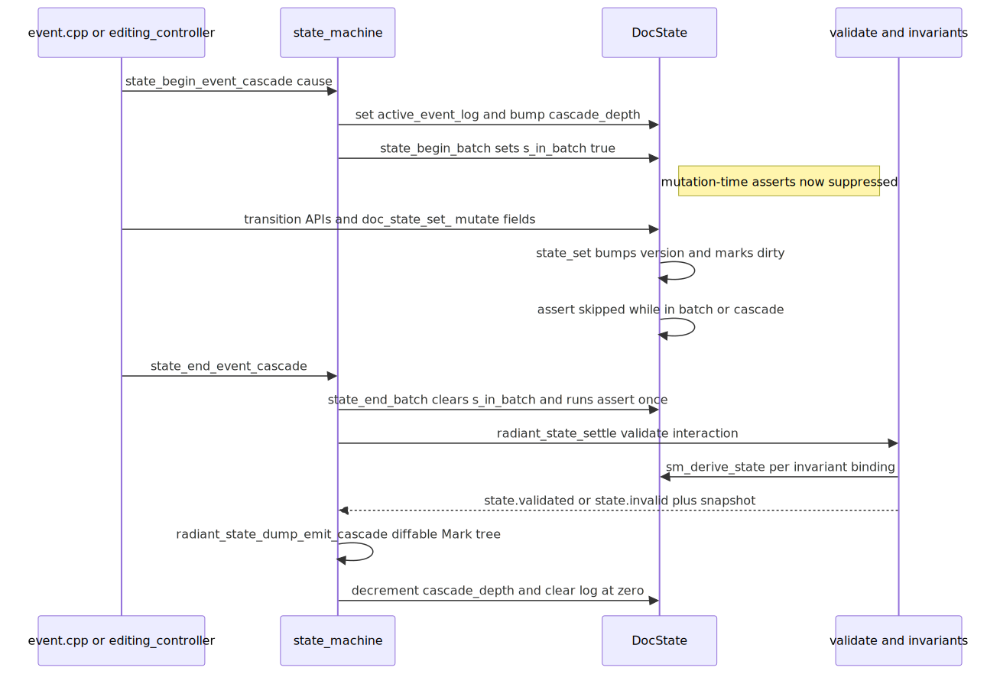

# Radiant — Interaction State: DocState, State Machine & Schema

> **Part of the [Radiant detailed-design set](RAD_00_Overview.md).** This document covers Radiant's per-document interaction/UI-state layer: the one big mutable `DocState` struct that holds every piece of live presentation state (focus/hover/active, selection/caret, IME, drag-drop, dropdown and context-menu overlays, form-control values, scroll, dirty/reflow tracking, and the Lambda reactive-template reconciliation maps); the reactive `state_set`/`on_change` primitive that backs generic per-node flags; and the *stateless* state machine + declarative schema that wrap direct mutation with a validation/invariant/logging boundary. It is emphatically **not** a Redux/signals store and **not** a persistence/undo store — it models interaction, and rendering reads projections off it.
>
> **Primary sources:** `radiant/event.hpp` / `state_store.cpp` (the `DocState` struct, `state_set`/`state_set_bool`/`state_on_change`, batching, `radiant_state_dump_mark`, prune-after-reflow), `radiant/state_store_internal.hpp` (legacy `CaretState`/`SelectionState`/`FocusState` projections), `radiant/event.hpp` / `state_machine.cpp` (transition APIs, cascade boundary, `radiant_state_settle`, invariant checking), `radiant/event.hpp` / `state_schema.cpp` (`SmFamily`/`SmEvent`/`SmInvariantId` enums, `RADIANT_STATE_RULES`, `RADIANT_INVARIANTS`, `sm_derive_*`, `sm_classify_view`, `SmTransitionGuard`).
> **Audience:** engine developers. **Convention:** `file:line` references drift; confirm against the symbol name.

---

## 1. What this layer is (and is not)

`DocState` (`event.hpp`) is a single, per-document, mutable C struct. Every interactive fact about a rendered document lives directly in its fields: who has focus, what is hovered or pressed, the current text selection and caret, the IME composition, an in-flight drag-and-drop, the open `<select>` dropdown and native context-menu overlays, live form-control values, scroll offsets, and the incremental dirty/reflow queues. It is owned one-per-document by a thin `StateStore` wrapper (`event.hpp`) that carries the document pointer plus the pool and arena; `state_store_create` (`state_store.cpp:983`) allocates the store and its `DocState`, and `state_store_doc_state` (`state_store.cpp:1027`) returns the canonical projection.

The design is deliberately *not* a reactive graph. Hot input paths mutate `DocState` fields directly — a hover change is a field write, not a signal propagation — because event dispatch and editing must stay cheap. What keeps that direct-mutation model honest is a **separate, stateless validation boundary**: the state machine ([§4](#4-the-state-machine-a-stateless-validation-boundary)) never stores a current state; instead it *derives* an FSM state on demand from `DocState` (`sm_derive_*`) and asserts a table of invariants after each transition and at cascade settle points. Because the FSM is derived rather than stored, there is no second source of truth to keep in sync with the fields — the fields *are* the state, and the machine is a checker layered over them.

An immutable / copy-on-write mode is declared (`STATE_MODE_IMMUTABLE`, `event.hpp`) with the intent of enabling undo/time-travel, but it is a stub: `state_set_immutable` shallow-copies the struct and re-hashes the map with `// TODO: implement proper HAMT for structural sharing` (`state_store.cpp:5142`). In practice `STATE_MODE_IN_PLACE` (direct mutation) is the only mode used.

---

## 2. The reactive core: `state_set` / `state_on_change`

The one genuinely reactive primitive is a `HashMap` keyed by `StateKey` and holding `StateEntry` values. A `StateKey` (`event.hpp`) is `{ void* node, const char* name }` where `name` is an interned string such as `:hover` or `caret-offset`; a `StateEntry` (`event.hpp`) carries the `Item value`, a `last_modified` version stamp, and an optional `on_change` callback plus user data. This is the mechanism behind generic per-node boolean/`Item` flags.

`state_set` (`state_store.cpp:4026`) interns the name, upserts the entry via `hashmap_set` (replacing in place — the map stores entries by value), fires the entry's `on_change` callback with old and new values if one is registered, sets `state->is_dirty`, bumps the monotonic `version`, and finally calls `state_assert_after_mutation`. `state_on_change` (`state_store.cpp:5225`) registers or updates the callback on an entry (creating a value-less entry if the key does not yet exist). The `version` counter is the coarse change clock the whole store shares — `last_modified` stamps and the selection sequence counters all read from it.

`state_set_bool` (`state_store.cpp:4070`) is where the generic map gives way to typed storage. It special-cases the semantically-loaded names: `:hover`/`:active`/`:focus` route to `view_state_set_hovered`/`_active`/`_focused` (per-view packed `ViewState` bits, [§3](#3-the-data-model)), and `:checked`/`:disabled`/`:readonly`/`:required` route to the corresponding `form_control_set_*` writers. Only names outside that set fall through to a raw `state_set` with an `ITEM_TRUE`/`ITEM_FALSE` value. This keeps CSS pseudo-class state (`:hover`) out of the generic hash map and in the compact per-view struct that layout and paint already touch.

---

## 3. The data model

Beyond the reactive map, `DocState` embeds a large collection of typed sub-states. The most important structural pieces:

| Field / struct | Where | Role |
|---|---|---|
| `state_map` | `event.hpp` | `StateKey → StateEntry` — the generic reactive per-node flag map ([§2](#2-the-reactive-core-state_set--state_on_change)). |
| `view_state_map` | `event.hpp` | `(view_id, kind) → ViewStateEntry` — lazily-created per-view interaction state. |
| `ViewState` | `event.hpp` | Packed per-view struct: hover/active/focus flag bits plus a union of `scroll{x,y,max,drag}` and `form{disabled/readonly/checked, selected_index, range_value, selection_start/end, current_value}`. |
| `template_state_map`, `render_map` | `event.hpp,335` | Lambda reactive-template reconciliation maps (see `template_state.h` / `render_map.h`) — the observer keys that drive template re-render and the DOM↔source bridge. |
| `dom_selection`, `EditingSelection sel` | `event.hpp,380` | **Canonical** DOM-spec selection + the StateStore selection authority for the active editing surface. |
| `CaretState`, `SelectionState`, `FocusState` | `state_store_internal.hpp:10,30,49` | **Legacy** render/validation projections retained until call sites migrate to the canonical selection. |
| `EditingInteractionState editing` | `event.hpp` | Shared editing-controller projection: active surface, pointer-selection, IME composition, autoscroll, and the rich-edit transaction FSM fields. |
| `DirtyTracker`, `ReflowScheduler` | `event.hpp,120` | Incremental repaint/relayout queues (a linked list of `DirtyRect`, and a queue of `ReflowRequest` with a `ReflowScope`). |
| dropdown / context-menu overlay fields | `event.hpp` | `open_dropdown` + geometry, and `context_menu_target` + geometry + hover index, drawn as document-level overlay layers. |

`ViewState` (`event.hpp`) deserves emphasis: it is a bit-packed union, so a given view is *either* a scroll surface *or* a form control, never carrying both payloads — the `ViewStateKind` discriminant (`VIEW_STATE_SCROLL`/`VIEW_STATE_FORM_CONTROL`, `event.hpp`) selects the arm. This is what lets pseudo-class reads (`view_state_get_hovered`, `event.hpp`) and form-value reads stay allocation-free on the common path. The caret/selection projection structs in `state_store_internal.hpp` are plain structs of `float` geometry and `int` offsets; they exist purely so rendering and validation paths can keep reading cached caret/selection geometry while the canonical model is `DomSelection` + `EditingSelection` ([RAD_18 — Editing, Selection & DOM Ranges](RAD_18_Editing_Selection_Ranges.md)).

The interned pseudo-class and form state names, plus the `CHANGE_*` reflow-reason bitmask, are defined in `event.hpp`.

---

## 4. The state machine: a stateless validation boundary

The state machine holds **no** state. Its job is to (a) map a caller's intent to a schema `SmEvent`, (b) mutate `DocState` through the existing writers, and (c) validate. There are per-family transition entry points — `focus_transition` (`state_machine.cpp:57`), `caret_transition` (`:144`), `selection_transition` (`:170`), `hover_transition` (`:240`), `active_transition` (`:277`), and `drag_transition` (`:339`). Each follows the same shape, visible in `focus_transition`: map the transition *kind* to an `SmEvent` (`focus_kind_to_sm_event`, `:37`), open a `SmTransitionGuard` scoped to the family/event/target, call `transition_enter` (which bumps `transition_depth`, `:29`), perform the actual mutation via the ordinary writers (`focus_set`/`focus_clear`/`focus_move`), call `transition_leave`, sync projections, `guard.commit()`, then `radiant_state_assert_valid` and `radiant_state_validate_interaction`.

FSM states are *derived*, not stored. `sm_derive_state` (`state_schema.cpp:767`) dispatches by `SmFamily` to a per-family deriver — `sm_derive_focus_state`, `sm_derive_selection_state`, `sm_derive_rich_edit_state`, and so on (`state_schema.cpp:642–801`) — each of which reads `DocState` fields and returns the current FSM-state enum value for that family (`SelectionFsmState`, `FocusFsmState`, … `RichEditFsmState`, defined in `event.hpp`). `sm_classify_view` (`state_schema.cpp:804`) maps a `View*` to an `SmViewClass` (text control, checkbox, radio, select, range, …) by inspecting its `FormControlProp`. Because these derive on demand, a transition never has to write "the new FSM state" anywhere — it writes the underlying fields and the deriver reports whatever those fields imply.

> **Note vs. the scan digest:** the digest placed `sm_derive_*` and `sm_classify_view` in `state_machine.cpp`. They actually live in **`state_schema.cpp`** (`:642`–`:821`). The transition APIs are in `state_machine.cpp`.

### 4.1 The declarative schema

The schema is two static tables. `RADIANT_STATE_RULES[]` (`state_schema.cpp:236`, **80 rules**) enumerates, per `(family, view_class, from_state, event)`, the allowed `to_states`, the side-effect `actions` bitmask (`SmActionFlag`, `event.hpp` — e.g. `SM_ACT_DISPATCH_BEFOREINPUT`, `SM_ACT_MUTATE_DOM`), and a human-readable name. `RADIANT_INVARIANTS[]` (`state_schema.cpp:517`, 26 bindings over 21 distinct `SmInvariantId` values, `event.hpp`) binds each invariant to the family/state where it must hold. The families themselves are `SmFamily` — 15 of them (`event.hpp`: document, focus, selection, IME, hover, active, drag-drop, scroll, the four form families, dropdown, context-menu, rich-edit) — and events are `SmEvent`, ~67 of them (`event.hpp`).

`SmTransitionGuard` (`event.hpp`) is an RAII debug recorder. On construction (`sm_transition_scope_begin`, `state_schema.cpp:861`) it snapshots the family, event, view class, target, and the *current* `from_state` (via `sm_derive_state`) into the `DocState`'s `sm_active_transition` scope. Writers call `sm_observe_action` (`state_schema.cpp:883`) to record which side effects actually fired (e.g. `SM_ACT_WRITE_CHECKED` from `form_control_set_checked_for_event`, `state_store.cpp:4125`); `guard.commit()` marks the transition legitimate. Under `NDEBUG` the whole guard compiles to empty inline stubs (`event.hpp`), so it costs nothing in release builds. This is the mechanism by which the schema's declared `actions` can, in debug, be checked against what the code really did.

---

## 5. The cascade boundary: the single consistency checkpoint

Individual field writes must not each pay for a full invariant sweep, and mid-transition the store is legitimately inconsistent. Both problems are solved by batching everything inside an **event cascade** and validating once at the end.

`state_begin_event_cascade` (`state_machine.cpp:1663`) sets `active_event_log`, opens a cascade id in the event-state log (`event_state_log_begin_cascade`), increments `active_cascade_depth`, and calls `state_begin_batch`. `state_begin_batch` (`state_store.cpp:5256`) simply sets the file-static `s_in_batch = true`. While that flag is set — or while `transition_depth > 0` or `active_cascade_depth > 0` — `state_assert_after_mutation` (`state_store.cpp:4018`) short-circuits and does nothing, so the many field writes inside a cascade run without per-mutation asserts.

The checkpoint is `radiant_state_settle` (`state_machine.cpp:1919`): it runs `radiant_state_validate_interaction`, emits a `state.validated` or `state.invalid` record plus a compact snapshot, and calls `radiant_state_dump_emit_cascade` to append a diffable Mark-tree snapshot ([§6](#6-the-mark-tree-dump)). `state_end_event_cascade` (`state_machine.cpp:1935`) closes the cascade: it calls `state_end_batch` (which clears `s_in_batch` and runs the single deferred `radiant_state_assert_valid`, `state_store.cpp:5280`), then `radiant_state_settle`, then `event_state_log_end_cascade`, and finally decrements `active_cascade_depth`, clearing the log handle at zero. This makes the begin→mutate→settle→end sequence the *one* place where consistency is enforced.

`radiant_state_validate_interaction` (`state_machine.cpp:1641`) delegates to `radiant_state_validate_interaction_schema` (`:1628`), which walks `RADIANT_INVARIANTS`, skips any binding whose bound state does not match the derived current state (`schema_invariant_binding_applies`, `:1621`, via `sm_derive_state`), and runs `validate_schema_invariant_primitive` for each applicable invariant. Roughly twenty `validate_*` functions back these primitives — focus/hover/active/drag graph walks, caret and selection projection checks, editing-surface / false-island / target-range checks for rich editing, the view-state registry, dirty-tracking, and input-event ordering. `radiant_state_assert_valid` (`state_machine.cpp:1646`) is a debug-only assert that logs the failing invariant's message and `assert()`s; under `NDEBUG` it is a no-op.

---

## 6. The Mark-tree dump

State snapshots reuse Lambda's own data model so they are diffable text usable by layout-regression and WebDriver tooling. `radiant_state_dump_mark` (`state_store.cpp:817`) spins up a scratch pool and a Lambda `Input`, builds a Mark element tree via `state_dump_build_doc_item` (`:790`) using `MarkBuilder`, and serializes it with `print_root_item`. The dump collects the `state_map` grouped by node, emits document-level attributes, and recurses the DOM root. Diffing helpers (`state_dump_*_changed`/`differs`) suppress default-valued state so a snapshot shows only what deviates.

`radiant_state_dump_to_file` (`state_store.cpp:839`) writes one snapshot to a path; `radiant_state_dump_emit_cascade` (`:856`) appends a per-cascade `<entry cascade:… seq:…>` record to an open `StateDumpLog` (path `./temp/state/state_${pid}_${doc}.mark`, `event.hpp`). Because settle calls this on every cascade, a session produces a chronological, diffable trail of interaction-state evolution.

---

## 7. Data flow: who feeds it, what it drives

`DocState` is fed by the input and editing subsystems and consumed by rendering. Platform input and event simulation flow through `event.cpp` / `event_sim.cpp` ([RAD_15 — Events & Input](RAD_15_Events_Input.md)) into the transition APIs and `doc_state_set_*` writers; rich-text editing flows through `editing_controller.cpp` / `text_edit.cpp` into `state_store_set_selection` (`event.hpp`), `state_store_set_text_control_selection` (`:672`), and the rich-edit transaction events ([RAD_18](RAD_18_Editing_Selection_Ranges.md)); scrolling flows through `scroller.cpp`; layout diagnostics through `cmd_layout.cpp`. The `source_pos_bridge` (`source_pos_bridge.cpp`) converts `(DomNode*, offset) ↔ (source_path, offset)` via the `render_map` for the Lambda editor — its full contract is documented in [RAD_01 — View & DOM Model §7](RAD_01_View_and_DOM_Model.md#7-the-source-position-bridge).

On the output side, rendering reads projections rather than the raw fields: the caret/selection/focus projections, the dropdown and context-menu overlay geometry, and the cached video placements. The `DirtyTracker`/`ReflowScheduler` and the `needs_repaint`/`needs_reflow` flags gate incremental relayout and redraw ([RAD_13 — Render Walk & Painters](RAD_13_Render_Walk_Painters.md)); `state_sync_dirty_flags_before_assert` (`state_store.cpp:5266`) keeps those flags aligned with the authoritative dirty tracker before each settle so the render loop and the invariant checks observe one source. The `EventStateLog` and `StateDumpLog` feed diagnostics, WebDriver, and regression tests.

Because many `DocState` fields cache raw `View*`/`DomElement*` pointers that do not survive a relayout, `state_store_prune_after_reflow` (`state_store.cpp:3143`) runs after each reflow to prune orphaned state-map entries, view-state owners, and stale cursor/transient-owner pointers using stable node ids — the same weak-by-`id` binding described in [RAD_01 §6](RAD_01_View_and_DOM_Model.md#6-incremental-relayout).

---

## 8. Known Issues & Future Improvements

1. **`state_store.cpp` is a 338 KB / ~8500-line monolith** spanning 20+ concern sections (interned names, dump, create/destroy, get/set, constraint attributes, dropdown FSM, immutable mode, callbacks, batch, dirty, reflow, visited links, caret/selection projection, selection compat, focus, clipboard). It is the prime split candidate in this subsystem — a natural decomposition follows the function-prefix families (`doc_state_*`, `form_*`, `view_state_*`, `selection_*`, `caret_*`, `state_dump_*`).
2. **Immutable / COW mode is an unimplemented stub.** `state_set_immutable` shallow-copies and re-hashes rather than structurally sharing — `// TODO: implement proper HAMT for structural sharing` (`state_store.cpp:5142`). Related dangling TODOs: `state_end_batch` never fires deferred callbacks (`// TODO: trigger deferred callbacks`, `:5284`), and the dump element builder has a `// TODO: add attributes if needed` (`:8338`). Undo/time-travel cannot rely on this mode today.
3. **Caret/selection projection consumers remain.** Canonical `DomSelection`/`EditingSelection` now own writes; `CaretState`/`SelectionState` (`state_store_internal.hpp`) are refreshed projection caches for render/debug paths. Several invariants — notably `SM_INV_SELECTION_PROJECTION_CACHE` (`event.hpp`) — exist only to police this cache. Migrating renderers to read DomRange layout data directly would let the projection structs and those invariants be deleted.
4. **`s_in_batch` is a file-static global** (`state_store.cpp:4013`), not a `DocState` field. It gates whether mutation-time asserts fire, so it is not per-document and is unsafe if multiple documents or threads mutate state concurrently. *Improvement:* move it into `DocState` alongside `active_cascade_depth`/`transition_depth`.
5. **Selectionchange coalescing is spread across several counters and two drains.** `selection_mutation_seq`/`selection_event_seq`/`selection_projection_seq` plus the per-text-control `tc_selectionchange_head` linked-list drain (`event.hpp`) form a subtle ordering surface with no single owner; ordering bugs here are hard to reason about.
6. **Cached `View*`/`DomElement*` pointers require manual prune-after-reflow.** Numerous `DocState` fields (`hover_target`, `active_target`, `cursor->view`, drag/drop views, editing surfaces) hold raw pointers that go stale on relayout and depend on `state_store_prune_after_reflow` (`:3143`) being called at the right time. A missed prune leaves a dangling pointer that later reads dereference.

---

## Appendix A — Source map

| File | Responsibility (this doc) |
|---|---|
| `radiant/event.hpp` | `DocState` struct, `StateKey`/`StateEntry`, `ViewState`, `DirtyTracker`/`ReflowScheduler`, the full state/selection/form/focus API surface, interned-name and `CHANGE_*` macros. |
| `radiant/state_store.cpp` | `state_set`/`state_set_bool`/`state_on_change`, batching (`s_in_batch`), `state_assert_after_mutation`, `radiant_state_dump_mark`/`_to_file`/`_emit_cascade`, `state_store_prune_after_reflow`, immutable-mode stub, all `doc_state_*`/`form_*`/`view_state_*`/`selection_*`/`caret_*` writers. |
| `radiant/state_store_internal.hpp` | `CaretState`/`SelectionState`/`FocusState` render/validation projection structs. |
| `radiant/event.hpp` / `state_machine.cpp` | Transition APIs (`focus_transition` … `drag_transition`), cascade boundaries, state settling, and invariant validation. |
| `radiant/event.hpp` / `state_schema.cpp` | State-machine enums and rule tables, derived-state helpers, classification, and transition guards. |
| `radiant/event.hpp` / `source_pos_bridge.cpp` | `(DomNode*,offset) ↔ (source_path,offset)` mapping over `render_map` (detailed in RAD_01). |

## Appendix B — Related documents

- [RAD_00 — Overview](RAD_00_Overview.md) — the set index and architecture.
- [RAD_01 — View & DOM Model](RAD_01_View_and_DOM_Model.md) — the `DocState`/`ViewState` weak refs bound by node `id` that survive `view_pool_reset_retained`, and the source-position bridge contract.
- [RAD_13 — Render Walk & Painters](RAD_13_Render_Walk_Painters.md) — consumes the `DirtyTracker`/`ReflowScheduler` and the projections this store maintains.
- [RAD_15 — Events & Input](RAD_15_Events_Input.md) — the event dispatch path that opens cascades and drives the transition APIs.
- [RAD_18 — Editing, Selection & DOM Ranges](RAD_18_Editing_Selection_Ranges.md) — the canonical `DomSelection`/`EditingSelection` model and the rich-edit transaction FSM whose fields live in `DocState`.
- [RAD_19 — Form Controls](RAD_19_Form_Controls.md) — the form-control writers (`form_control_set_*`) that `state_set_bool` and the schema's form families drive.
