# Radiant — Editing, Selection & DOM Ranges

> **Part of the [Radiant detailed-design set](RAD_00_Overview.md).** This document covers Radiant's WHATWG-aligned editing model as it sits over the shared DOM/view tree ([RAD_01](RAD_01_View_and_DOM_Model.md)): the spec-conformant `DomRange`/`DomSelection` primitives, live-range mutation envelopes, the 50-plus `inputType` intent taxonomy, the `editing_run_transaction` state machine, and — the load-bearing decision — the **C++/JS seam (Stage 4B)** where rich contenteditable input is routed to script and the native rich-text engine is retired. It also covers caret/selection geometry and hit-testing, and the pluggable clipboard store. The native form-control editing path is a sibling subject — see [RAD_19](RAD_19_Form_Controls.md).
>
> **Primary sources:** `radiant/event.hpp` / `dom_range.cpp` (`DomBoundary`/`DomRange`/`DomSelection`, mutation envelopes, `Selection.modify`, extract/clone/surround, stringification), `radiant/event.hpp` / `dom_range_resolver.cpp` (layout cache, hit-testing, selection rects), `radiant/event.hpp` / `editing.cpp` (`EditingSurface` + retired-engine Layer-A helpers), `radiant/event.hpp` / `editing_dispatch.cpp` (`editing_run_transaction`, the beforeinput/JS seam), `radiant/event.hpp` / `editing_intent.cpp` (`InputIntentType`), `radiant/event.hpp` / `editing_host.cpp` (contenteditable recognition), `radiant/event.hpp` / `editing_controller.cpp` (navigation/history/composition hooks), `radiant/event.hpp` / `editing_geometry.cpp` (caret rects, hit-test), `radiant/event.hpp` / `editing_target_range.cpp` (StaticRange target ranges), `radiant/event.hpp` / `clipboard.cpp` (multi-MIME store).
> **Audience:** engine developers. **Convention:** `file:line` references drift; confirm against the symbol name. The historical design docs `vibe/radiant/Radiant_Design_Editing*.md` and `Radiant_Design_Selection.md` are rationale only and are explicitly marked phased-out.

---

## 1. Scope and the central decision

The editing subsystem is a **WHATWG-aligned editing model** layered over the unified DOM/view tree, where a `DomText` *is* its own `ViewText` and a `DomElement` *is* its own `ViewElement` ([RAD_01](RAD_01_View_and_DOM_Model.md)). It resolves four editing surfaces uniformly — text form controls, `contenteditable`, and Lambda `data-editable` templates — through one `EditingSurface` abstraction, maps raw key/text/composition events to spec `inputType` intents, and dispatches them through a single transaction state machine.

The one decision that shapes everything else is **Stage 4B**: the native C++ rich-text engine has been retired. For any rich editing host, Radiant no longer mutates the DOM itself; it fires `beforeinput` to script (JS `addEventListener` and Lambda `on` handlers) and returns without native mutation. `contenteditable` is now a "pure routing flag." The native mutation path survives only for **form text controls**, which is the non-rich branch documented in [RAD_19 — Form Controls](RAD_19_Form_Controls.md). This split — rich is script-owned, form is native — is the recurring context for the rest of this document.

---

## 2. The Range / Selection data model

### 2.1 `DomBoundary` and the UTF-16 / UTF-8 seam

The atom is `struct DomBoundary { DomNode* node; uint32_t offset; }` (`event.hpp`), the WHATWG boundary point. Per spec (`event.hpp`), `offset` means a **UTF-16 code-unit** offset for `CharacterData` (`DomText`/`DomComment`) and a **child index** for element/fragment nodes. This is the crux of Radiant's Unicode discipline: **DOM-API offsets are UTF-16, but internal text storage (`DomText::text`) is UTF-8**, and conversion happens *only* at the API boundary via `dom_text_utf16_to_utf8`/`dom_text_utf8_to_utf16`/`dom_text_utf16_length` (`event.hpp`); the common ASCII path returns the input unchanged. `dom_boundary_compare` (`dom_range.cpp`, declared `event.hpp`) implements the spec's boundary-ordering algorithm, returning `DOM_BOUNDARY_BEFORE`/`EQUAL`/`AFTER`/`DISJOINT` (`event.hpp`), and `dom_node_boundary_length` (`event.hpp`) gives the UTF-16 length or child count that bounds a valid offset.

### 2.2 `DomRange` — the live range

`struct DomRange` (`event.hpp`) owns `start`/`end` boundaries under the invariant `start <= end`, an `is_live` flag (false for a future `StaticRange`), a `ref_count` (the selection holds one, a JS handle holds one), and doubly-linked `prev`/`next` pointers threading it into `state->live_ranges`. It also carries a **layout cache** — `layout_valid`, `start_view`/`start_x`/`start_y`/`start_height` and the `end_*` counterparts (`event.hpp`) — filled lazily by the resolver ([§6](#6-geometry-caret-selection-rects-and-hit-testing)) and invalidated by `dom_range_invalidate_layout` after reflow or a boundary mutation. The full spec method set (`set_start`/`set_end`/`set_start_before` etc., `collapse`, `select_node`, `compare_boundary_points`, `compare_point`, `intersects_node`, `clone`) is declared at `event.hpp`; each setter returns `false` and sets a stable `*out_exception` DOMException name string on invalid offset or hierarchy errors.

### 2.3 `DomSelection` — SINGLE range, Chromium-compatible

`struct DomSelection` (`event.hpp`) holds `ranges[DOM_SELECTION_MAX_RANGES]` where **`DOM_SELECTION_MAX_RANGES == 1`** (`event.hpp`). The spec permits multiple ranges, but the header records the deliberate choice: every WPT test that matters and every mainstream browser uses 0 or 1, so Radiant supports `range_count ∈ {0,1}` rigorously and **silently ignores any `addRange()` beyond the first**, matching Chromium (`event.hpp`). A collapsed selection *is* the canonical caret. The `direction` field (`DOM_SEL_DIR_FORWARD`/`BACKWARD`, `event.hpp`) records anchor-vs-focus ordering. `associated_doc_root` (`event.hpp`) captures the document root when the range was set; the Range mutators use it to implement the "selection range moved into a different root" drop rule (`dom_range.cpp:349-356`, `705`, `720`) — when the active range's new root differs from the captured one, the range is dropped and `range_count` falls to 0.

### 2.4 `EditingSelection` — the façade over both worlds

`struct EditingSelection` (`event.hpp`) is the union facade owned by the StateStore (`DocState`). Its `kind` is `EDIT_SEL_DOM_RANGE` (rich, carrying a `DomRange* range`) or `EDIT_SEL_TEXT_CONTROL` (form, carrying `DomElement* control` plus UTF-16 `start_u16`/`end_u16`). This is the single seam through which the two selection representations — DOM Range for rich, UTF-16 offsets for form controls — are unified, and `mutation_seq` lets projection consumers detect staleness.

---

## 3. Editing surfaces and hosts

Raw input never touches a range directly; it is first resolved to an `EditingSurface` (`event.hpp`). `EditingSurfaceKind` (`event.hpp`) is `NONE`/`TEXT_CONTROL`/`CONTENTEDITABLE`/`LAMBDA_TEMPLATE`, and `EditingMode` (`event.hpp`) refines it (`RICH`, `PLAINTEXT_ONLY`, and the three text-control modes). `editing_surface_from_target`/`_from_focus` resolve a surface from a hit-tested view or the focused node; `editing_surface_is_rich`/`_is_text_control` (`event.hpp`) are the predicates the dispatcher branches on. The `target_in_false_island` bit flags a `contenteditable="false"` widget nested inside an editable host — input must no-op there even though the selection may cross the boundary.

Recognition of `contenteditable` is centralized in `event.hpp` / `editing_host.cpp`: `editing_host_lookup` (`event.hpp`) walks ancestors for the nearest `contenteditable="true"|""|"plaintext-only"` element and reports its `EditingHost::mode` (Rich vs PlaintextOnly) and the `="false"` island flag. This is deliberately "one concept, one resolver" (`event.hpp`) — it replaced ad-hoc `contenteditable` reads formerly scattered across `event.cpp` and `dom_range.cpp`. The IDL surface (`html_element_get_contentEditable`, `_get_isContentEditable`, `_set_contentEditable`, `event.hpp`) reflects the HTML spec attribute, including the `SyntaxError`-on-bad-value setter contract.

---

## 4. The intent taxonomy

`enum InputIntentType` (`event.hpp`) enumerates the 50-plus WHATWG `inputType` values: text insertion (`insertText`, `insertReplacementText`, `insertParagraph`, `insertLineBreak`, `insertHorizontalRule`, `insertImage`, `insertLink`), paste/drop/yank variants, the full delete family (`deleteContent{Backward,Forward}`, `deleteWord*`, `deleteSoftLine*`, `deleteHardLine*`, `deleteByCut`, `deleteByDrag`), IME composition (`compositionStart`, `insertCompositionText`, `insertFromComposition`, `deleteCompositionText`), the `format*` group (bold/italic/underline/…, justify, ordered/unordered list, indent/outdent, block, colors, font), `selectAll`, and `historyUndo`/`historyRedo`. Some are "consumer-issued only" — Radiant never synthesizes them but exposes them so scripts can drive the same dispatcher (`event.hpp`).

The carrier `struct InputIntent` (`event.hpp`, aliased `EditingIntent`) bundles `type`, the payload (`data`/`html_data`/`data_mime` and their owned copies), the originating `key`/`mods`, and IME `is_composing`/`composition_caret`. Keystrokes become intents in `input_intent_from_key_event` (`editing_intent.cpp:110`): Cmd/Ctrl+Z → `historyUndo` (Shift → Redo), Cmd+X → `deleteByCut`, Enter → `insertParagraph` (Shift → `insertLineBreak`), and Backspace/Delete modified by Cmd/Alt/Ctrl select the soft-line / word / content delete granularity. Printable text uses `input_intent_from_text_input` and IME uses `input_intent_from_composition_event` (`editing_intent.cpp:188`, `199`).

`input_intent_is_dispatchable` (`editing_intent.cpp:77`) is the pivotal classifier: it returns **false** for the entire `format*` group, `selectAll`, `compositionStart`, and `insertImage`, and **true** for everything else. Non-dispatchable intents are never fired as a JS `InputEvent`; `format*`/`selectAll` remain Layer-A selection operations that never reach the beforeinput seam.

---

## 5. The transaction state machine and the C++/JS seam

`editing_run_transaction` (`editing_dispatch.cpp:805`) is the unified state machine, driven by an `EditingTransaction` (`event.hpp`) that bundles the surface, intent, the decoupling `EditingDispatchHooks`, and an optional native `mutate` callback. It first normalizes the transaction, then reaches the decision point.

### 5.1 The seam — `editing_dispatch.cpp:832-860`

If `editing_surface_is_rich(&current_surface)` **and** `input_intent_is_dispatchable(intent->type)`, the transaction takes the Stage 4B path: it calls `editing_dispatch_beforeinput_ex` to fire `beforeinput` to the script handlers, then **returns `true` with `out_mutated = false`** — logging `"script-managed surface — routed ... to script, native apply bypassed"` (`editing_dispatch.cpp:852-855`). No native mutation runs. The comment block (`editing_dispatch.cpp:832-841`) is explicit that the native rich-edit behavior layer "is retired and never runs," and that Phase 5 made this unconditional (Phase 3 had gated it on a `data-script-edit` attribute). This is **the C++/JS seam**: `EditingDispatchHooks` (`event.hpp`) is three function pointers — `dispatch_input_event` (JS `InputEvent`), `dispatch_lambda_event` (Lambda `on`), and `copy_selection` — so the core editing code carries no direct dependency on the JS or Lambda runtimes; the bridge in [RAD_21 — JS Scripting Integration](RAD_21_JS_Scripting_Integration.md) plugs in through them.

### 5.2 The native branch (form controls / non-dispatchable)

When the surface is not rich (or the intent is non-dispatchable), the transaction runs the full native machine (`editing_dispatch.cpp:862-1011`): it computes StaticRange target ranges, snapshots the selection, logs the transaction, and drives an `SmTransitionGuard` sequence in the `SM_FAMILY_RICH_EDIT` family — BEGIN → BEFOREINPUT → (mutate via `tx.mutate`) → SET_SELECTION → INPUT → COMMIT. `beforeinput` is dispatched through `editing_dispatch_beforeinput_ex` (`editing_dispatch.cpp:1022`); a `preventDefault` aborts the native mutation. A subtle Stage-4B guard sits at `editing_dispatch.cpp:901-920`: if a rich host's `beforeinput` was prevented (JS applied the edit and may have reconciled/detached the leaf view this transaction referenced), the transaction re-anchors to the surviving editing host (`editing_surface_from_target` on the host owner) so the target-range invariant keeps pointing at a live surface. The re-entrant window flag `rich_transaction_in_script_dispatch` (`editing_dispatch.cpp:1077-1085`) suppresses target-range asserts while the script mid-reconciles the subtree.

The actual entry points are in `event.cpp`, which builds the transaction from GLFW key/text/paste events and calls `editing_run_transaction`, or the form variants `editing_dispatch_form_beforeinput`/`_form_input` (`event.hpp`) that share intent logging and beforeinput/input ordering while keeping value-store mutation in the form path.

The retired engine leaves only two **Layer-A helpers** in `editing.cpp:123`: `editing_rich_find_text_descendant` (backs click-to-place-caret) and `editing_rich_is_composition_intent` (IME classification). Both are pure navigation/classification, not editing apply.

---

## 6. DOM Range mutation, selection modify, stringification

`dom_range.cpp` is a 4551-line monolith holding the whole spec surface. The WHATWG §5.5 Range algorithms are here: `dom_range_delete_contents` (`:1534`), `dom_range_extract_contents` (`:1539`), `dom_range_clone_contents` (`:1543`), `dom_range_insert_node` (`:1547`), and `dom_range_surround_contents` (`:1615`, which throws `InvalidStateError` when the range partially contains non-Text nodes). Supporting primitives are `dom_node_clone` (`:1216`) and `dom_text_split_at` (`:1243`).

**Live-range mutation envelopes** implement WHATWG DOM §5.3 boundary adjustments so that every open range and the selection stay valid across a tree mutation: `dom_mutation_pre_remove` (`:1053`, called before removing a child), `dom_mutation_post_insert` (`:1078`, shifting offsets past an insertion), `dom_mutation_text_split` (`:1130`), plus `dom_mutation_text_replace_data` and `dom_mutation_text_merge` (declared `event.hpp`, `337`). Each walks `state->live_ranges`, adjusts endpoints per spec, and re-syncs the selection; all are safe to call with no state, no ranges, or no selection. The binding layer (JS DOM mutation) is responsible for calling them around every tree/text mutation.

`dom_selection_modify` (`:4277`) with `dom_boundary_move` (`:4236`) implements `Selection.modify` across character/word/document granularity (`DomModGranularity`, `event.hpp`), consulting `text_is_selectable_for_modify` (`:3018`) to skip non-selectable subtrees. Browser-style boundary discovery lives alongside: `dom_selection_compute_select_all_boundaries` (`:2454`, trimming whitespace-only edges and treating ` `/`<table>` as edge stops), `user_select_all` handling (`:2467`), and `dom_selection_triple_click_range_for_node` (`:2492`, table-cell-aware). Stringification is `dom_range_to_string` (`:1986`) and `dom_range_to_string_ex` (`:2576`) with two modes — `DOM_STRINGIFY_RAW` matching `Range.toString()` and `DOM_STRINGIFY_RENDERED` matching `Selection.toString()`, which skips text hidden by `user-select: none`/`content-visibility` or by the not-rendered-as-text tag list (`event.hpp`).

---

## 7. Geometry: caret/selection rects and hit-testing

Because the DOM *is* the layout tree, every `DomText` carries a `TextRect` chain describing where its glyphs are drawn, and `event.hpp` / `dom_range_resolver.cpp` turns spec-level boundaries into pixels and back. `dom_range_resolve_layout` (`dom_range_resolver.cpp:593`) fills the `DomRange` layout cache from those `TextRect` chains (idempotent when `layout_valid`); `dom_hit_test_to_boundary` (`:1275`) maps a viewport `(vx, vy)` in CSS pixels to the closest `DomBoundary`. `dom_range_for_each_rect` (and the per-text / per-rect variants at `event.hpp`) emits selection rectangles; when given a `UiContext` it uses the registered **glyph-precise X resolvers** (`GlyphXResolverFn`/`ByteOffsetForXResolverFn`, `event.hpp`) so selection edges align pixel-exactly with the caret painter, and `ByteOffsetForXResolverFn` backs Up/Down arrow column preservation.

`event.hpp` / `editing_geometry.cpp` wraps this for both surface kinds behind one `EditingBoundary` (`event.hpp`) and `EditingCaretRect` (`:38`). `editing_geometry_hit_test_boundary` (`editing_geometry.cpp:639`) is the unified pixel→boundary entry, honoring `EditingClampPolicy` and a Mac-specific `EDITING_POINT_BEHAVIOR_MAC` tweak (`:658`); `editing_geometry_caret_rect` and the text-control variants (`_text_control_caret_rect` at `:688`, `_for_each_selection_rect`) produce the rects the painters draw. The canonical selection→projection-cache refresh is `state_store_refresh_caret_projection` (`event.hpp`).

---

## 8. Clipboard

`event.hpp` / `clipboard.cpp` is a global multi-MIME store (`g_store`, `clipboard.cpp:48`) serving both the synchronous DOM clipboard-event path and the async `navigator.clipboard` API. A `ClipboardItem` (`event.hpp`) is a set of alternative `ClipboardEntry` representations (e.g. `text/plain` + `text/html`) of one payload. The store writes/reads text, MIME, HTML, and full multi-MIME item lists (`event.hpp`), gated by `ClipboardPermission` state for `navigator.permissions.query`. The backend is a `ClipboardBackend` vtable (`event.hpp`): only two exist — the in-memory backend for tests/headless (`clipboard_backend_inmemory`, `clipboard.cpp:169`) and a GLFW plain-text bridge (`clipboard_backend_glfw`, compiled only under `RADIANT_CLIPBOARD_GLFW`, `clipboard.cpp:194-230`) that falls back to the in-memory backend when GLFW is absent (`:232`). Per-OS rich-MIME backends (NSPasteboard/Win32/X11) are a later phase. `clipboard_store_sanitize` (`clipboard.cpp`, declared `event.hpp`) is a near-no-op that only strips `<script>`/`<style>` for `text/html`. Cut/copy/paste orchestration lives in `event.cpp` via the `copy_selection` hook and the `deleteByCut`/`insertFromPaste` intents; `editing_dispatch_beforeinput_ex` invokes `copy_selection` for `INPUT_INTENT_DELETE_BY_CUT` before dispatch (`editing_dispatch.cpp:1061-1066`).

---

## 9. The projection-cache caveat

The canonical selection is `state->dom_selection` / `state->sel`; `CaretState` and `SelectionState` are projection caches for renderer/event paths that still need view + byte-offset snapshots. View/offset helper writes convert to `DomSelection` or `EditingSelection` first, then `state_store_refresh_caret_projection` rebuilds the projection caches. `dom_selection_sync_from_selection_projection`/`_caret` (`event.hpp`, implemented in `state_store.cpp`) remain only as compatibility bridges for projection-only paths. [RAD_17 — Interaction State](RAD_17_Interaction_State.md) owns the projection structs, and the DOM-boundary bridge to the Lambda editor's doc-tree value is the source-position bridge in [RAD_01 — View & DOM Model](RAD_01_View_and_DOM_Model.md).

---

## 10. Known Issues & Future Improvements

1. **`dom_range.cpp` is a 4551-line monolith.** It mixes lifecycle, boundary comparison, mutation envelopes, extract/clone/surround, selectAll/triple-click, `Selection.modify`, and stringification. It is the single largest file in the area and the prime split candidate — a natural fission is (a) range/selection core + comparison, (b) mutation envelopes + §5.5 mutators, (c) modify/selectAll/word-breaking, (d) stringification.
2. **Projection-cache consumers remain.** The canonical `DomSelection`/`EditingSelection` model still feeds `CaretState`/`SelectionState` projection caches for render/debug paths (`event.hpp`, `event.hpp`). *Improvement:* migrate renderers to the DomRange layout cache directly and delete the projection structs plus their invariants.
3. **Text-control target range is a StaticRange hack.** `compute_text_control_target_ranges` (`editing_target_range.cpp:20`) synthesizes a boundary over the control *element* carrying UTF-16 `selectionStart`/`End`, "until E0 can promote form values to concrete DOM text nodes" (`event.hpp`). Two selection representations (DOM Range vs form UTF-16 offsets) remain unified only by the `EditingSelection` facade.
4. **Incomplete OS clipboard backends.** Only in-memory and GLFW plain-text backends exist (`clipboard.cpp:169`, `194-232`); NSPasteboard/Win32/X11 rich-MIME backends are unimplemented, and `clipboard_store_sanitize` is a near-no-op (`event.hpp`). Rich copy/paste (`text/html`, images) round-trips only within the process.
5. **Pattern-regex validation TODO (F5).** Form constraint validation `te_validate` cannot enforce `pattern="..."` — `TODO(F5): pattern="..." — needs lazy-compiled regex` (`text_edit.cpp:641`). (Detail belongs to [RAD_19](RAD_19_Form_Controls.md), noted here because it is a spec-coverage gap in the editing surface.)
6. **LTR-only `Selection.modify`.** Direction mapping assumes LTR (left→backward, right→forward, `event.hpp`), and word granularity uses a simplistic alphanumeric-vs-other classifier (`event.hpp`) rather than a Unicode word-segmentation algorithm — RTL and complex-script editing will misbehave.
7. **Single-range selection by design.** `DOM_SELECTION_MAX_RANGES == 1` (`event.hpp`); extra `addRange()` calls are silently ignored. This matches Chromium but is not the full spec, so multi-range selection WPTs cannot pass.
8. **In-flux native-vs-JS mental model.** Two models coexist — rich is script-owned (Stage 4B), form is native — and the code carries many `retired`/`phased out`/`Stage 4B` markers (`editing_dispatch.cpp:832`, `902`; `editing.cpp:123`; `event.hpp,49`; `event.hpp`). The historical design docs remain on disk but are marked dead, which invites confusion.

---

## Appendix A — Source map

| File | Responsibility (this doc) |
|---|---|
| `radiant/event.hpp` / `dom_range.cpp` | `DomBoundary`/`DomRange`/`DomSelection`, UTF-16↔UTF-8 offsets, Range/Selection methods, live-range mutation envelopes, navigation, and stringification. |
| `radiant/event.hpp` / `dom_range_resolver.cpp` | Layout-cache resolution, pixel↔boundary hit-testing, selection rectangles, glyph-precise X resolvers, and projection sync. |
| `radiant/event.hpp` / `editing.cpp` | `EditingSurface`/`EditingMode` resolution and the surviving Layer-A helpers. |
| `radiant/event.hpp` / `editing_dispatch.cpp` | `editing_run_transaction`, the beforeinput/JS seam, dispatch hooks, and form dispatch variants. |
| `radiant/event.hpp` / `editing_intent.cpp` | Input-intent taxonomy and key/text/composition mapping. |
| `radiant/event.hpp` / `editing_host.cpp` | Centralized `contenteditable` recognition, `="false"` islands, and the `contentEditable` IDL. |
| `radiant/event.hpp` / `editing_controller.cpp` | Rich navigation, history, composition, and drag-autoscroll hooks. |
| `radiant/event.hpp` / `editing_geometry.cpp` | Caret/selection rectangles and unified pixel-to-boundary hit-testing. |
| `radiant/event.hpp` / `editing_target_range.cpp` | StaticRange-style target ranges for InputEvents. |
| `radiant/event.hpp` / `clipboard.cpp` | Multi-MIME clipboard storage, backend vtable, GLFW backend, and permission state. |

## Appendix B — Related documents

- [RAD_00 — Overview](RAD_00_Overview.md) — the set index and architecture.
- [RAD_01 — View & DOM Model](RAD_01_View_and_DOM_Model.md) — the unified DOM/view tree these ranges point into, and the source-position bridge to the Lambda editor doc tree.
- [RAD_15 — Events & Input](RAD_15_Events_Input.md) — the GLFW key/text/composition/paste pipeline that produces the intents fed to `editing_run_transaction`.
- [RAD_17 — Interaction State](RAD_17_Interaction_State.md) — `DocState`/StateStore, the caret/selection projection structs refreshed from `DomSelection`.
- [RAD_19 — Form Controls](RAD_19_Form_Controls.md) — the native (non-rich) text-control editing path: value/selection IDL, undo/redo, IME, constraint validation, caret/selection rendering.
- [RAD_21 — JS Scripting Integration](RAD_21_JS_Scripting_Integration.md) — the JS/Lambda `beforeinput` handlers that own rich-host editing after the Stage 4B seam.
