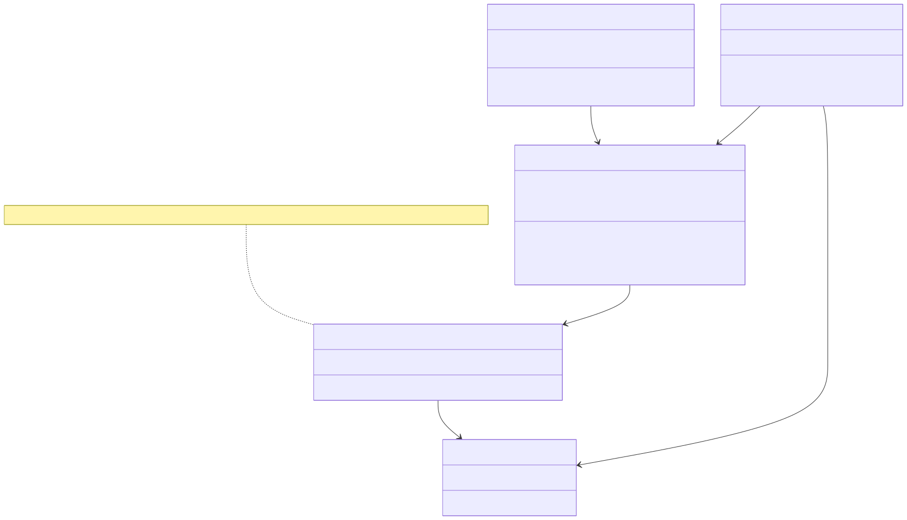
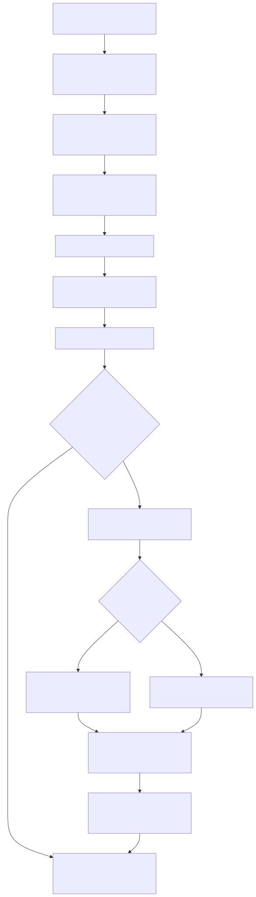

# Radiant — Editing, Selection & DOM Ranges

> **Last verified against tree:** 2026-08-28 *(F14.3/F14.4 canonical-target dispatch update)*

> **Part of the [Radiant detailed-design set](RAD_00_Overview.md).** This document covers Radiant's WHATWG-aligned editing model as it sits over the shared DOM/view tree ([RAD_01](RAD_01_View_and_DOM_Model.md)): the spec-conformant `DomRange`/`DomSelection` primitives, live-range mutation envelopes, the `inputType` intent taxonomy, and the ordinary notification/default-action path for `contenteditable`. It also covers caret/selection geometry and hit-testing, and the pluggable clipboard store. The native form-control editing path is a sibling subject — see [RAD_19](RAD_19_Form_Controls.md).
>
> **Primary sources:** `radiant/event.hpp` / `dom_range.cpp` (`DomBoundary`/`DomRange`/`DomSelection`, mutation envelopes, `Selection.modify`, extract/clone/surround, stringification), `radiant/editing.cpp` (surface classification), `radiant/event.cpp` (ordinary contenteditable notification/default/input dispatch and canonical target re-resolution), `radiant/editing_dispatch.cpp` (form notification bridge and diagnostics), `radiant/editing_host.cpp` (canonical host recognition), and `radiant/editing_target_range.cpp` (immutable `InputEvent` target ranges).
> **Audience:** engine developers. **Convention:** `file:line` references drift; confirm against the symbol name. The historical design docs `vibe/radiant/Radiant_Design_Editing*.md` and `Radiant_Design_Selection.md` are rationale only and are explicitly marked phased-out.

---

## 1. Scope and the central decision

The editing subsystem is a **WHATWG-aligned editing model** layered over the unified DOM/view tree, where a `DomText` is its own `ViewText` and a `DomElement` is its own `ViewElement` ([RAD_01](RAD_01_View_and_DOM_Model.md)). It resolves text controls and standard `contenteditable` hosts through one `EditingSurface` abstraction, maps raw key/text/composition events to `inputType` intents, and routes every contenteditable edit through one ordinary default-action dispatch site.

The path has a strict notification/default/notification contract. It dispatches cancelable `beforeinput`, lets author JavaScript or an ordinary Lambda handler prevent the package default, then re-resolves the current canonical contenteditable surface from the StateStore's DOM `Selection` (with focused-surface fallback for a range-less composition start). The package applies the unprevented default and sends non-cancelable `input` after a claim or change. `editing_live_host_guard`, its retained `DomNodeRef`, and its view-ID validity check are retired: author mutation can replace the original host, and a replacement is eligible only if canonical selection/focus now resolves it. Form controls retain their separate value-store action between the same kind of notifications, as documented by [RAD_19](RAD_19_Form_Controls.md). This ordering follows **S12.1.3** and **S12.2.2**; package dispatch remains within **D7.2.1–D7.2.3**.

---

## 2. The Range / Selection data model

### 2.1 `DomBoundary` and the UTF-16 / UTF-8 seam

The atom is `struct DomBoundary { DomNode* node; uint32_t offset; }` (`event.hpp`), the WHATWG boundary point. Per spec (`event.hpp`), `offset` means a **UTF-16 code-unit** offset for `CharacterData` (`DomText`/`DomComment`) and a **child index** for element/fragment nodes. This is the crux of Radiant's Unicode discipline: **DOM-API offsets are UTF-16, but internal text storage (`DomText::text`) is UTF-8**, and conversion happens *only* at the API boundary via `dom_text_utf16_to_utf8`/`dom_text_utf8_to_utf16`/`dom_text_utf16_length` (`event.hpp`); the common ASCII path returns the input unchanged. `dom_boundary_compare` (`dom_range.cpp`, declared `event.hpp`) implements the spec's boundary-ordering algorithm, returning `DOM_BOUNDARY_BEFORE`/`EQUAL`/`AFTER`/`DISJOINT` (`event.hpp`), and `dom_node_boundary_length` (`event.hpp`) gives the UTF-16 length or child count that bounds a valid offset.

### 2.2 `DomRange` — the live range

`struct DomRange` (`event.hpp`) owns `start`/`end` boundaries under the invariant `start <= end`, an `is_live` flag (false for a future `StaticRange`), a `ref_count` (the selection holds one, a JS handle holds one), and doubly-linked `prev`/`next` pointers threading it into `state->live_ranges`. It also carries a **layout cache** — `layout_valid`, `start_view`/`start_x`/`start_y`/`start_height` and the `end_*` counterparts (`event.hpp`) — filled lazily by the resolver ([§6](#6-geometry-caret-selection-rects-and-hit-testing)) and invalidated by `dom_range_invalidate_layout` after reflow or a boundary mutation. The full spec method set (`set_start`/`set_end`/`set_start_before` etc., `collapse`, `select_node`, `compare_boundary_points`, `compare_point`, `intersects_node`, `clone`) is declared at `event.hpp`; each setter returns `false` and sets a stable `*out_exception` DOMException name string on invalid offset or hierarchy errors.

### 2.3 `DomSelection` — SINGLE range, Chromium-compatible

`struct DomSelection` (`event.hpp`) holds `ranges[DOM_SELECTION_MAX_RANGES]` where **`DOM_SELECTION_MAX_RANGES == 1`** (`event.hpp`). The spec permits multiple ranges, but the header records the deliberate choice: every WPT test that matters and every mainstream browser uses 0 or 1, so Radiant supports `range_count ∈ {0,1}` rigorously and **silently ignores any `addRange()` beyond the first**, matching Chromium (`event.hpp`). A collapsed selection *is* the canonical caret. The `direction` field (`DOM_SEL_DIR_FORWARD`/`BACKWARD`, `event.hpp`) records anchor-vs-focus ordering. `associated_doc_root` (`event.hpp`) captures the document root when the range was set; the Range mutators use it to implement the "selection range moved into a different root" drop rule (`dom_range.cpp:349-356`, `705`, `720`) — when the active range's new root differs from the captured one, the range is dropped and `range_count` falls to 0.

### 2.4 `EditingSelection` — the façade over both worlds

`struct EditingSelection` (`event.hpp`) is the union facade owned by the StateStore (`DocState`). Its `kind` is `EDIT_SEL_DOM_RANGE` (rich, carrying a `DomRange* range`) or `EDIT_SEL_TEXT_CONTROL` (form, carrying `DomElement* control` plus UTF-16 `start_u16`/`end_u16`). This is the single seam through which the two browser-required selection domains are unified, and `mutation_seq` orders selectionchange delivery and presentation refreshes.

---

## 3. Editing surfaces and hosts

Raw input never touches a range directly; it is first resolved to an `EditingSurface` (`event.hpp`). `EditingSurfaceKind` is `NONE`/`TEXT_CONTROL`/`CONTENTEDITABLE`; `EditingMode` refines contenteditable to rich or `plaintext-only` and text controls to their value modes. `editing_surface_from_target`/`_from_focus` resolve a surface from a hit-tested view or the focused node; `editing_surface_is_rich`/`_is_text_control` are the predicates the dispatcher branches on. The `target_in_false_island` bit flags a `contenteditable="false"` widget nested inside an editable host — input must no-op there even though the selection may cross the boundary.

Recognition of `contenteditable` is centralized in `event.hpp` / `editing_host.cpp`: `editing_host_lookup` (`event.hpp`) walks ancestors for the nearest `contenteditable="true"|""|"plaintext-only"` element and reports its `EditingHost::mode` (Rich vs PlaintextOnly) and the `="false"` island flag. This is deliberately "one concept, one resolver" (`event.hpp`) — it replaced ad-hoc `contenteditable` reads formerly scattered across `event.cpp` and `dom_range.cpp`. The IDL surface (`html_element_get_contentEditable`, `_get_isContentEditable`, `_set_contentEditable`, `event.hpp`) reflects the HTML spec attribute, including the `SyntaxError`-on-bad-value setter contract.

---

## 4. The intent taxonomy

`enum InputIntentType` (`event.hpp`) enumerates the 50-plus WHATWG `inputType` values: text insertion (`insertText`, `insertReplacementText`, `insertParagraph`, `insertLineBreak`, `insertHorizontalRule`, `insertImage`, `insertLink`), paste/drop/yank variants, the full delete family (`deleteContent{Backward,Forward}`, `deleteWord*`, `deleteSoftLine*`, `deleteHardLine*`, `deleteByCut`, `deleteByDrag`), IME composition (`compositionStart`, `insertCompositionText`, `insertFromComposition`, `deleteCompositionText`), the `format*` group (bold/italic/underline/…, justify, ordered/unordered list, indent/outdent, block, colors, font), `selectAll`, and `historyUndo`/`historyRedo`. Some are "consumer-issued only" — Radiant never synthesizes them but exposes them so scripts can drive the same dispatcher (`event.hpp`).

The carrier `struct InputIntent` (`event.hpp`, aliased `EditingIntent`) bundles `type`, the payload (`data`/`html_data`/`data_mime` and their owned copies), the originating `key`/`mods`, and IME `is_composing`/`composition_caret`. Keystrokes become intents in `input_intent_from_key_event` (`editing_intent.cpp:110`): Cmd/Ctrl+Z → `historyUndo` (Shift → Redo), Cmd+X → `deleteByCut`, Enter → `insertParagraph` (Shift → `insertLineBreak`), and Backspace/Delete modified by Cmd/Alt/Ctrl select the soft-line / word / content delete granularity. Printable text uses `input_intent_from_text_input` and IME uses `input_intent_from_composition_event` (`editing_intent.cpp:188`, `199`).

`input_intent_is_dispatchable` (`editing_intent.cpp:77`) is the pivotal classifier: it returns **false** for the entire `format*` group, `selectAll`, `compositionStart`, and `insertImage`, and **true** for everything else. Non-dispatchable intents are never fired as a JS `InputEvent`; `format*`/`selectAll` remain Layer-A selection operations that never reach the beforeinput seam.

---

## 5. The contenteditable default-action dispatch

`dispatch_contenteditable_plain_event` in `event.cpp` is the single ordinary
contenteditable path. It dispatches cancelable `beforeinput` to the original
event target, then refreshes the canonical selection shadow and resolves the
current `EditingSurface`. The selection focus boundary is preferred; the
focused editing surface is used only when a composition start has no DOM range.
No original-host identity, `DomNodeRef`, view ID, route snapshot, or live-host
validity check survives the author notification.

The order is fixed: initial editing-surface resolution → cancelable
`beforeinput` → canonical selection/focus re-resolution → package default (only
when not prevented) → non-cancelable `input` after a claim or DOM change. Live
`DomRange` mutation envelopes preserve the selection's current boundaries while
author code edits the tree. If the original host is detached and no replacement
is canonical, the default declines. If author code moves selection/focus to a
replacement editable host, the package applies there and the `input` event uses
that same owner. This is the post-F14.4 target rule and is consistent with
**S12.1.3** (author mutation in `pn` handlers) and **S12.2.2** (current DOM
mutation semantics).

Lambda `edit` templates use the same ordinary handler path; their return verdict
is the author-side decision, without a prepared transaction or route/result side
channel. The entire path remains inside one retained JS dispatch batch, so
MutationObserver delivery stays after the post-action `input` notification.

---

## 6. DOM Range mutation, selection modify, stringification

`dom_range.cpp` is a 4551-line monolith holding the whole spec surface. The WHATWG §5.5 Range algorithms are here: `dom_range_delete_contents` (`:1534`), `dom_range_extract_contents` (`:1539`), `dom_range_clone_contents` (`:1543`), `dom_range_insert_node` (`:1547`), and `dom_range_surround_contents` (`:1615`, which throws `InvalidStateError` when the range partially contains non-Text nodes). Supporting primitives are `dom_node_clone` (`:1216`) and `dom_text_split_at` (`:1243`).

**Live-range mutation envelopes** implement WHATWG DOM §5.3 boundary adjustments so that every open range and the selection stay valid across a tree mutation: `dom_mutation_pre_remove` (`:1053`, called before removing a child), `dom_mutation_post_insert` (`:1078`, shifting offsets past an insertion), `dom_mutation_text_split` (`:1130`), plus `dom_mutation_text_replace_data` and `dom_mutation_text_merge` (declared `event.hpp`, `337`). Each walks `state->live_ranges`, adjusts endpoints per spec, and re-syncs the selection; all are safe to call with no state, no ranges, or no selection. The binding layer (JS DOM mutation) is responsible for calling them around every tree/text mutation.

`dom_selection_modify` (`:4277`) with `dom_boundary_move` (`:4236`) implements `Selection.modify` across character/word/document granularity (`DomModGranularity`, `event.hpp`), consulting `text_is_selectable_for_modify` (`:3018`) to skip non-selectable subtrees. Browser-style boundary discovery lives alongside: `dom_selection_compute_select_all_boundaries` (`:2454`, trimming whitespace-only edges and treating ` `/`<table>` as edge stops), `user_select_all` handling (`:2467`), and `dom_selection_triple_click_range_for_node` (`:2492`, table-cell-aware). Stringification is `dom_range_to_string` (`:1986`) and `dom_range_to_string_ex` (`:2576`) with two modes — `DOM_STRINGIFY_RAW` matching `Range.toString()` and `DOM_STRINGIFY_RENDERED` matching `Selection.toString()`, which skips text hidden by `user-select: none`/`content-visibility` or by the not-rendered-as-text tag list (`event.hpp`).

---

## 7. Geometry: caret/selection rects and hit-testing

Because the DOM *is* the layout tree, every `DomText` carries a `TextRect` chain describing where its glyphs are drawn, and `event.hpp` / `dom_range_resolver.cpp` turns spec-level boundaries into pixels and back. `dom_range_resolve_layout` (`dom_range_resolver.cpp:593`) fills the `DomRange` layout cache from those `TextRect` chains (idempotent when `layout_valid`); `dom_hit_test_to_boundary` (`:1275`) maps a viewport `(vx, vy)` in CSS pixels to the closest `DomBoundary`. `dom_range_for_each_rect` (and the per-text / per-rect variants at `event.hpp`) emits selection rectangles; when given a `UiContext` it uses the registered **glyph-precise X resolvers** (`GlyphXResolverFn`/`ByteOffsetForXResolverFn`, `event.hpp`) so selection edges align pixel-exactly with the caret painter, and `ByteOffsetForXResolverFn` backs Up/Down arrow column preservation.

`event.hpp` / `editing_geometry.cpp` wraps this for both surface kinds behind one `EditingBoundary` and `EditingCaretRect`. `editing_geometry_hit_test_boundary` is the unified pixel→boundary entry, honoring `EditingClampPolicy` and the Mac-specific `EDITING_POINT_BEHAVIOR_MAC` tweak; `editing_geometry_caret_rect` and the text-control variants produce the rects the painters draw. `selection_refresh_presentation` updates only the derived geometry/blink cache; logical boundaries remain canonical.

---

## 8. Clipboard

`event.hpp` / `clipboard.cpp` is a global multi-MIME store serving both the synchronous DOM clipboard-event path and the async `navigator.clipboard` API. A `ClipboardItem` is a set of alternative `ClipboardEntry` representations (for example `text/plain` plus `text/html`) of one payload. The store writes/reads text, MIME, HTML, and full multi-MIME item lists, gated by `ClipboardPermission` state. The first contenteditable gate exposes the event payload but intentionally does not perform a general native cut, paste, or drop mutation; a selected editor or template action owns those operations. Form controls retain their value-specific paste action.

---

## 9. Canonical boundaries and presentation geometry

The canonical selection is `state->dom_selection` / `state->sel`. Snapshot/accessor functions derive anchor, focus, offsets, direction, and collapse state directly from `DomSelection`, `DomRange`, or the active text-control selection. `SelectionPresentation` contains only caret/range geometry, iframe offsets, blink state, and the previous dirty rectangle; it cannot become a second source of logical truth. Pointer-gesture lifetime lives in `EditingInteractionState`, not the presentation cache. The DOM-boundary bridge to the Lambda editor's doc-tree value remains the source-position bridge in [RAD_01 — View & DOM Model](RAD_01_View_and_DOM_Model.md).

---

## 10. Known Issues & Future Improvements

1. **`dom_range.cpp` is a 4551-line monolith.** It mixes lifecycle, boundary comparison, mutation envelopes, extract/clone/surround, selectAll/triple-click, `Selection.modify`, and stringification. It is the single largest file in the area and the prime split candidate — a natural fission is (a) range/selection core + comparison, (b) mutation envelopes + §5.5 mutators, (c) modify/selectAll/word-breaking, (d) stringification.
2. **Text-control target range is a StaticRange hack.** `compute_text_control_target_ranges` synthesizes a boundary over the control *element* carrying UTF-16 `selectionStart`/`End`, until form values can be promoted to concrete DOM text nodes. The document-vs-text-control distinction remains intentionally unified by the `EditingSelection` facade.
3. **Incomplete OS clipboard backends.** Only in-memory and GLFW plain-text backends exist; NSPasteboard/Win32/X11 rich-MIME backends are unimplemented, and `clipboard_store_sanitize` is a near-no-op. Rich copy/paste (`text/html`, images) round-trips only within the process.
4. **Pattern-regex validation TODO (F5).** Form constraint validation `te_validate` cannot enforce `pattern="..."` without a lazy-compiled regex. (Detail belongs to [RAD_19](RAD_19_Form_Controls.md), noted here because it is a spec-coverage gap in the editing surface.)
5. **LTR-only `Selection.modify`.** Direction mapping assumes LTR and word granularity uses a simplistic alphanumeric-vs-other classifier rather than a Unicode word-segmentation algorithm — RTL and complex-script editing will misbehave.
6. **Single-range selection by design.** `DOM_SELECTION_MAX_RANGES == 1`; extra `addRange()` calls are silently ignored. This matches Chromium but is not the full spec, so multi-range selection WPTs cannot pass.
7. **Editor matrix boundary.** CodeMirror, ProseMirror light DOM, and Editor.js have pinned offline authoritative-state probes. The capability manifest is the source of truth for their supported configurations and explicit exclusions, including Editor.js ordinary paragraph paste, which upstream delegates to browser-native structural editing and this gate intentionally does not restore. An editor render or one typing probe is not treated as blanket compatibility.

---

## Appendix A — Source map

| File | Responsibility (this doc) |
|---|---|
| `radiant/event.hpp` / `dom_range.cpp` | `DomBoundary`/`DomRange`/`DomSelection`, UTF-16↔UTF-8 offsets, Range/Selection methods, live-range mutation envelopes, navigation, and stringification. |
| `radiant/event.hpp` / `dom_range_resolver.cpp` | Layout-cache resolution, pixel↔boundary hit-testing, selection rectangles, and glyph-precise X resolvers. |
| `radiant/event.hpp` / `editing.cpp` | `EditingSurface`/`EditingMode` resolution and canonical-host helpers. |
| `radiant/event.hpp` / `radiant/event.cpp` | Editing-surface contracts and the contenteditable notification/default/input path, including canonical target re-resolution. |
| `radiant/editing_dispatch.cpp` | Form-control notification bridge and editing diagnostics. |
| `radiant/event.hpp` / `editing_intent.cpp` | Input-intent taxonomy and key/text/composition mapping. |
| `radiant/event.hpp` / `editing_host.cpp` | Centralized `contenteditable` recognition, `="false"` islands, and the `contentEditable` IDL. |
| `radiant/event.hpp` / `editing_controller.cpp` | Rich navigation, history, composition, and drag-autoscroll hooks. |
| `radiant/event.hpp` / `editing_geometry.cpp` | Caret/selection rectangles and unified pixel-to-boundary hit-testing. |
| `radiant/event.hpp` / `editing_target_range.cpp` | StaticRange-style target ranges for InputEvents. |
| `radiant/event.hpp` / `clipboard.cpp` | Multi-MIME clipboard storage, backend vtable, GLFW backend, and permission state. |

## Appendix B — Related documents

- [RAD_00 — Overview](RAD_00_Overview.md) — the set index and architecture.
- [RAD_01 — View & DOM Model](RAD_01_View_and_DOM_Model.md) — the unified DOM/view tree these ranges point into, and the source-position bridge to the Lambda editor doc tree.
- [RAD_15 — Events & Input](RAD_15_Events_Input.md) — the GLFW key/text/composition/paste pipeline that produces the intents fed to the common gate.
- [RAD_17 — Interaction State](RAD_17_Interaction_State.md) — `DocState`/StateStore, canonical selection accessors, and the presentation-only geometry cache.
- [RAD_19 — Form Controls](RAD_19_Form_Controls.md) — the native (non-rich) text-control editing path: value/selection IDL, undo/redo, IME, constraint validation, caret/selection rendering.
- [RAD_21 — JS Scripting Integration](RAD_21_JS_Scripting_Integration.md) — the JS/Lambda event bridge and template action context.
