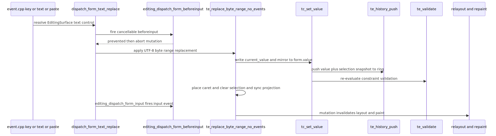

# Radiant — Form Controls & Text-Control Editing

> **Part of the [Radiant detailed-design set](RAD_00_Overview.md).** This document covers Radiant's HTML form controls (`<input>`, `<textarea>`, `<select>`, `<button>`) as replaced elements with UA-chrome layout and rendering, and — critically — the **native** text-control editing engine that still applies value mutations in C++. Where [RAD_18 — Editing, Selection & DOM Ranges](RAD_18_Editing_Selection_Ranges.md) describes how rich `contenteditable` hosts route `beforeinput` to script and never mutate natively (Stage 4B), form controls remain the *non-rich* branch: they receive input from the same event/intent plumbing but their value edits, undo ring, IME preedit, paste sanitization, and constraint validation are all done in-engine here.
>
> **Primary sources:** `radiant/form_control.hpp` (the `FormControlType` enum, `FormDefaults` intrinsic-size constants, the `FormControlProp` POD that carries every control's live state), `radiant/layout_form.cpp` (intrinsic sizing per control type), `radiant/render_form.cpp` (control-chrome painting, caret/selection/preedit overlay), `radiant/text_edit.{cpp,hpp}` (value byte-range edit, undo/redo ring, IME, paste, validation, ARIA), `radiant/text_control.{cpp,hpp}` (UTF-8↔UTF-16 value/selection IDL, legacy-projection sync).
> **Audience:** engine developers. **Convention:** `file:line` references drift; confirm against the symbol name.

---

## 1. Why form controls stay native

The editing subsystem has two mental models running side by side. Rich editing hosts (`contenteditable`, Lambda `data-editable`) are, as of Stage 4B, **script-owned**: `editing_run_transaction` delivers `beforeinput` to JS/Lambda and returns without applying any native mutation ([RAD_18](RAD_18_Editing_Selection_Ranges.md)). Form controls are the deliberate exception. An `<input>` or `<textarea>` value is not (yet) a tree of DOM text nodes a script editor can splice — it is a flat UTF-8 buffer (`FormControlProp::current_value`, `form_control.hpp:197`) with UTF-16 selection offsets. So the value mutation, caret placement, undo snapshot, and validation are all applied in C++ on the *non-rich* branch of the dispatcher.

The seam is explicit in `event.cpp`: `dispatch_form_text_replace` (`event.cpp:2436`) resolves the `EditingSurface`, confirms `editing_surface_is_text_control` (`event.cpp:2446`), fires a cancellable `beforeinput` through `editing_dispatch_form_beforeinput` (`event.cpp:2471`), and — only if not prevented — applies the edit via `te_replace_byte_range_no_events` (`event.cpp:2523`) followed by `editing_dispatch_form_input` (`event.cpp:2541`). The `_no_events` suffix is the tell: the dispatcher owns the WHATWG `InputEvent` pair, while `text_edit.cpp` owns the buffer. The legacy entry `te_replace_byte_range` (`text_edit.cpp:278`) is retained only for callers with no `EventContext` and fires the `input` hook itself (`text_edit.cpp:289`).

---

## 2. The form-control state model

Every form element is a "replaced element" — its box has intrinsic dimensions from control type, not content flow. All of its live state hangs off a single POD, `struct FormControlProp` (`form_control.hpp:118`), reached through `DomElement::form` when `item_prop_type == ITEM_PROP_FORM`. Following the C+ convention it has no constructor/destructor; lifecycle is `form_control_prop_init` (assign non-zero defaults, `text_control.cpp:70`) and `form_control_prop_release` (free owned heap pointers, `text_control.cpp:89`).

`FormControlType` (`form_control.hpp:23`) is the coarse category — `TEXT` (covers text/password/email/url/search/tel/number), `CHECKBOX`, `RADIO`, `BUTTON`, `SELECT`, `TEXTAREA`, `RANGE`, `IMAGE`, `HIDDEN` — resolved from the `type` attribute by the inline `get_input_control_type` (`form_control.hpp:284`). Date/time/color/file types currently fall through to `TEXT` (`form_control.hpp:316`).

The struct groups its fields by concern:

- **Back-pointers**: `state_ref` (fast-read `DocState*`; writers must go through StateStore APIs), `form_state_ref`, `scroll_state_ref` (`form_control.hpp:120-122`).
- **Static attributes**: `input_type`, `value`, `placeholder`, `name`, sizing (`size`, `cols`, `rows`, `maxlength`), and the range attrs (`range_min/max/step/value`).
- **State bitfield**: `disabled`, `readonly`, `checked`, `required`, `autofocus`, `multiple`, `dropdown_open`, `appearance_none` (`form_control.hpp:143-150`). Note these bits are a *projection*; the canonical pseudo-state (`:disabled`, `:checked`, …) lives in StateStore ([RAD_17](RAD_17_Interaction_State.md)) and is read via `form_control_is_disabled`/`_readonly`/`_required`.
- **Select fields**: `selected_index`, `option_count`, `hover_index`, `select_size`.
- **Intrinsic dims**: `intrinsic_width`/`intrinsic_height`, computed in [§3](#3-layout-and-intrinsic-sizing).
- **`::placeholder` style**: a resolved `FontProp*` plus color/opacity, so the placeholder pseudo-element paints with author styling.
- **Flex/grid item props**: because a form control uses `FormControlProp` in the view's item-property union slot, its flex fields (`flex_grow/shrink/basis`) are duplicated here, and the original `GridItemProp*` is stashed in `grid_item` (`form_control.hpp:183`) after the union is switched to `FORM`.
- **Text-control selection state** ([§4](#4-the-text-control-value-and-selection-idl)): `current_value` (live UTF-8 `.value`), `current_value_len`/`_u16_len`, `selection_start`/`selection_end` (UTF-16), `selection_direction`, `tc_initialized`, plus the `selectionchange` coalescing link `tc_sc_next_pending`.
- **Editing state**: `custom_validity_msg`, the change-on-blur snapshot `value_at_focus`, the opaque undo ring `history` (`EditHistory*`), auto-scroll (`scroll_x/y`), caret blink (`caret_blink_t`/`caret_on`), password reveal, and the IME preedit trio (`preedit_utf8`/`preedit_len`/`preedit_caret`, `form_control.hpp:258-260`).

---

## 3. Layout and intrinsic sizing

`layout_form_control` (`layout_form.cpp:430`) is the entry: it requires `item_prop_type == ITEM_PROP_FORM` and a non-null `form`, then switches on `control_type` to compute the intrinsic content size, then reconciles with any CSS `width`/`height` under the box-sizing model. Per-type helpers do the measurement:

- `calc_text_input_size` (`layout_form.cpp:18`) starts from `FormDefaults::TEXT_*` (a Chrome-matched 153×21 border-box at 1× — `form_control.hpp:41`) but special-cases date/time/datetime-local/color inputs to fixed Chrome intrinsic widths (`layout_form.cpp:24-`); width scales by `size` characters.
- `calc_textarea_size` (`layout_form.cpp:168`) uses `cols`×`rows` against the font advance (defaults 20×2, `form_control.hpp:78`).
- `calc_button_size` (`layout_form.cpp:250`) measures the label (`form_button_label_text`, `layout_form.cpp:233`) plus `BUTTON_PADDING_*`, floored at `BUTTON_MIN_WIDTH`.
- `calc_select_size` (`layout_form.cpp:281`) walks `<option>`/`<optgroup>` children measuring text intrinsic widths; `appearance: none` switches from max-content to min-content (`layout_form.cpp:287`) to match Chrome's shrink behavior, and optgroup options add `OPTGROUP_OPTION_INDENT`.
- Checkbox/radio are fixed `CHECK_SIZE` squares (`layout_form.cpp:468`); range/image are set upstream in `resolve_htm_style`; hidden is zero-sized.

After the switch, intrinsic **content-area** size is combined with actual CSS border/padding and box-sizing (`layout_form.cpp:497-550`), applying `given_width`/`given_height` and min/max clamps, and the final border-box is stamped onto `block->width`/`height`/`content_width`/`content_height`.

The **intrinsic-sizing snapshot** ([RAD_05 — Intrinsic Sizing](RAD_05_Intrinsic_Sizing.md)) reads form controls through `form_control_min_content_width`/`form_control_max_content_width` (`layout_form.cpp:711`/`723`), which both simply return the already-computed `intrinsic_width` — a form control has a *fixed* intrinsic size, so min-content and max-content are identical and no separate measurement pass is needed. `is_form_control` (`layout_form.cpp:694`) is the tag gate (`input`/`button`/`select`/`textarea`).

---

## 4. The text-control value and selection IDL

`text_control.{cpp,hpp}` is the bridge between the WHATWG IDL surface (UTF-16 `.value`, `.selectionStart`/`.selectionEnd`, `setSelectionRange`) that JS sees and the UTF-8 buffer the engine stores. `tc_is_text_control` (`text_control.cpp:49`) is the identity gate, mirroring HTML §4.10.5.1, and works even before layout has populated `elem->form` (JS may run on a parsed-but-unlaid DOM), lazily creating the prop via `tc_get_or_create_form` (`text_control.cpp:98`).

`tc_ensure_init` (`text_control.cpp:231`) seeds `current_value` from the HTML default (input `value` attr / textarea children) and collapses the selection at end-of-text. Conversions `tc_utf8_to_utf16_length`/`tc_utf16_to_utf8_offset`/`tc_utf8_to_utf16_offset` (`text_control.cpp:136`-`168`) do the code-unit ↔ byte math (surrogate pairs count as 2 UTF-16 units). `tc_set_value` (`text_control.cpp:294`) is the canonical writer: it replaces the buffer, collapses selection to the new end, mirrors the legacy `form->value` pointer used by the renderer, and refreshes placeholder/validation. `tc_set_selection_range` (`text_control.cpp:370`) clamps and writes the `(start, end, dir)` triple.

Because the editor mid-migration keeps two selection representations, `tc_sync_legacy_to_form` (`text_control.cpp:404`) reconciles them: when `state->sel.kind == EDIT_SEL_TEXT_CONTROL` and targets this element, StateStore's `EditingSelection` is treated as the source of truth (`text_control.cpp:422`); otherwise it falls back to the legacy caret/anchor projection or a `DomSelection` whose boundaries land on the control element. This duplication — canonical `EditingSelection` alongside `form->selection_*` alongside legacy projection fields — is the same tech-debt flagged across [RAD_18](RAD_18_Editing_Selection_Ranges.md) and is called out in [§8](#8-known-issues--future-improvements).

---

## 5. The editing engine: byte-range mutation, undo, IME, paste, validation

`text_edit.cpp` is the native editing heart. All offsets it manipulates internally are **UTF-8 byte** indices (matching StateStore projection); the UTF-16 IDL boundary is crossed only at the `tc_*` seam.

### 5.1 Value mutation

`te_replace_byte_range_no_events` (`text_edit.cpp:293`) is the primitive every edit funnels through. It normalizes/clamps `[start, end)`, builds `old[0..start) + repl + old[end..)` in a temp buffer, writes it via `tc_set_value`, updates password-reveal state, places the caret at `start + repl_len`, clears any selection, syncs the legacy projection, and (via `tc_set_value`) pushes an undo entry. Word/line boundary scanners (`te_word_start`/`te_word_end` `text_edit.cpp:133`/`162`, `te_line_start`/`te_line_end` `text_edit.cpp:182`/`190`, `te_prev_word_byte`/`te_next_word_byte` `text_edit.cpp:254`/`265`) and the selection helpers (`te_select_word_at`/`te_select_line_at`/`te_select_all`, `text_edit.cpp:214`-`243`) supply the offsets for keyboard word-delete and double/triple-click selection.

### 5.2 Undo/redo ring

The undo store is a bounded ring, `struct EditHistory` (`text_edit.hpp:125`), of `EditHistoryEntry` value+selection snapshots (`text_edit.hpp:117`) with `head`/`count`/`cursor`/`cap`. `te_history_push` (`text_edit.cpp:439`) drops the redo tail when the cursor is off-newest, dedupes against the most recent entry (value *and* selection must match, `text_edit.cpp:457-467`), overwrites the head slot, and advances. `te_history_undo`/`te_history_redo` (`text_edit.cpp:486`/`508`) walk the cursor and restore both value and selection, wrapping the `tc_set_value` call in `tc_history_guard_enter/exit` so the restore does not itself push a new entry. The at-focus state is seeded into the ring by `te_focus_capture_value` (`text_edit.cpp:340`, which also snapshots `value_at_focus` for change-on-blur), so a user can always undo back to what was originally in the field.

### 5.3 Change-on-blur

`te_focus_capture_value` copies `current_value` into `value_at_focus` on focus; `te_blur_should_dispatch_change` (`text_edit.cpp:370`) compares them on blur and returns whether a `change` event is warranted (HTML §4.10.5.5), always clearing the snapshot afterward. A missing snapshot is treated as no-change to avoid spurious `change` firings.

### 5.4 IME preedit composition

The OS input method's partial text lives in `preedit_utf8` and is *not* part of `current_value` until commit; the renderer overlays it with an underline. `te_ime_begin`/`te_ime_update`/`te_ime_cancel` (`text_edit.cpp:771`/`781`/`869`) maintain that transient buffer and toggle the placeholder-shown bit. Commit is split so the unified dispatcher can own `beforeinput`/`input`: `te_ime_commit_prepare` (`text_edit.cpp:822`) clears the preedit *before* insertion (so both aren't briefly visible), rejects the commit on readonly/disabled controls while still accepting the session, and computes the byte range to replace; `te_ime_commit_finish` (`text_edit.cpp:863`) is cleanup. The all-in-one `te_ime_commit` (`text_edit.cpp:806`) chains prepare → `te_replace_byte_range` → finish for legacy callers. `te_ime_is_composing` (`text_edit.cpp:766`) is simply "preedit buffer non-null".

### 5.5 Paste sanitization

`te_prepare_paste_replacement` (`text_edit.cpp:649`) builds the sanitized replacement without applying it: single-line `<input>` collapses CR/LF/CRLF to U+0020 spaces while `<textarea>` normalizes to `\n` (`text_edit.cpp:676-685`), then `maxlength` is enforced by computing the post-deletion codepoint budget and truncating the paste at a UTF-8 character boundary (`text_edit.cpp:699-726`). `te_paste` (`text_edit.cpp:737`) applies that replacement through `te_replace_byte_range`. Readonly/disabled controls reject the paste up front (`text_edit.cpp:663`).

### 5.6 Constraint validation and ARIA

`te_validate` (`text_edit.cpp:602`) is the v1 constraint-validation pass: it reflects `required`/`readonly`/`disabled` into the `:required`/`:optional`/`:read-only` pseudo-state bits, then computes validity — custom validity (`custom_validity_msg`) overrides everything, empty-while-required fails, and non-empty values are checked for `number`/`email`/`url` via `te_value_is_number`/`_is_email`/`_is_url` (`text_edit.cpp:541`/`565`/`587`) — and stamps `:valid`/`:invalid`. It is called cheaply from `tc_ensure_init`, `tc_set_value`, and blur. `te_aria_reflect` (`text_edit.cpp:895`) mirrors `disabled`/`readonly`/`required`/`:invalid` and range `aria-valuenow/min/max` onto the element's ARIA attributes for assistive tech and attribute selectors.

---

## 6. Rendering form-control chrome

`render_form_control` (`render_form.cpp:1579`) dispatches on `control_type` to `render_text_input`, `render_checkbox`, `render_radio`, `render_button`, `render_select`, `render_textarea`, or `render_range`; hidden and broken-image buttons paint nothing. This runs inside the render walk ([RAD_13 — Render Walk & Painters](RAD_13_Render_Walk_Painters.md)) after `render_block_view` has painted any author background/border, so the UA chrome (white fill, 3-D inset border) is drawn *only* when the author has not overridden it (`form_border_has_author_override`, `render_form.cpp:178`) to avoid stomping CSS styling.

`render_text_input` (`render_form.cpp:442`) is the richest painter and is where all the text-control editing state becomes visible. It resolves the display text — substituting U+25CF for password masking (`build_password_display`, keeping the unmasked source only for caret byte→codepoint mapping), or overlaying the IME preedit (`build_preedit_display_text`, `render_form.cpp:403`), or falling back to the placeholder. It computes a logical caret X, clamps `scroll_x` so the caret stays inside the content box (auto-scroll, F4), and paints the selection highlight via `paint_text_control_selection_rect` (`render_form.cpp:101`) using the shared editing-geometry resolver `editing_geometry_text_control_caret_rect` (`render_form.cpp:551`) so selection edges align pixel-exactly with the caret. Caret visibility follows `caret_on`/`caret_blink_t` (forced on in headless renders for deterministic snapshots). `render_select_dropdown` (`render_form.cpp:1080`) paints the open listbox popup separately (above the normal display list) with `hover_index`/`selected_index` highlighting.

---

## 7. Where input comes from

Form controls are driven by the same GLFW key/text/composition/paste plumbing as the rest of editing ([RAD_15 — Events & Input](RAD_15_Events_Input.md)). The event handlers resolve an `EditingSurface`; when it is a text control the flow takes the *native* branch described in [§1](#1-why-form-controls-stay-native): `dispatch_form_text_replace` → `editing_dispatch_form_beforeinput` → (`te_replace_byte_range_no_events` | `te_paste` | `te_ime_commit_*`) → `editing_dispatch_form_input`. Selection extension for click-drag routes through `dispatch_form_selection_extend` (`event.cpp:435`), and rich `selectAll` reaching into a subtree with descendant text controls is reconciled by `rich_select_all_sync_descendant_text_controls` (`event.cpp:2162`). Checkbox/radio/button/select activation is ordinary click handling that flips the StateStore bits and, for `<select>`, toggles `dropdown_open`.

The target range the `InputEvent` carries is computed by `editing_compute_target_ranges` (`editing_target_range.hpp:23`); for text controls this is a **synthetic StaticRange-style boundary** over the control element with UTF-16 selectionStart/End offsets rather than real DOM text-node boundaries — an interim hack noted in the header (`editing_target_range.hpp:4-8`) that persists until form values can be promoted to concrete DOM text nodes. It is the same two-representations tension as [§4](#4-the-text-control-value-and-selection-idl).

---

## 8. Known Issues & Future Improvements

1. **Text-control target range is a StaticRange hack.** `editing_compute_target_ranges` builds a synthetic boundary over the control element with UTF-16 offsets instead of real DOM text nodes (`editing_target_range.hpp:4-8`). It stays until form values become concrete DOM text — the same "E0 promotion" blocker referenced in [RAD_18](RAD_18_Editing_Selection_Ranges.md). *Improvement:* promote `<input>`/`<textarea>` values to a shadow text node so DOM Range and form offsets unify.
2. **`TODO(F5)`: `pattern="…"` validation is unimplemented.** `te_validate` (`text_edit.cpp:641`) checks number/email/url but has an explicit TODO for `pattern` because it "needs lazy-compiled regex". Until then a `pattern` attribute is silently ignored — a control with only a `pattern` constraint always reports `:valid`.
3. **Three selection representations mid-migration.** Canonical `EditingSelection` (StateStore), the HTML-facing `form->selection_start/end` mirror, and legacy caret/anchor projection fields are reconciled by hand in `tc_sync_legacy_to_form` (`text_control.cpp:404`). Two sources of truth for the caret is fragile; it should collapse to `EditingSelection` once the projection consumers are ported.
4. **IME edge cases.** `te_ime_commit_prepare` (`text_edit.cpp:822`) accepts a composition *session* on readonly/disabled controls but rejects the commit, and orphaned compositions are silently dropped in `te_ime_begin` (`text_edit.cpp:775`). There is no reconversion / candidate-window geometry reported back to the OS, and the preedit caret is a single codepoint offset with no segment/clause underlining.
5. **Paste sanitization is minimal.** `te_prepare_paste_replacement` handles newline normalization and `maxlength` truncation only (`text_edit.cpp:649`); it does not strip control characters, apply `inputmode`/type-specific filtering (e.g. non-numeric into `type=number`), or coordinate with the rich clipboard MIME store.
6. **Constraint validation is a v1 subset.** Beyond the missing `pattern` (item 2), `te_validate` (`text_edit.cpp:602`) does not implement `min`/`max`/`step` for number/range, `minlength`, or the full email/url grammar — the `te_value_is_*` helpers are approximate.
7. **Chrome-matched magic numbers.** `FormDefaults` (`form_control.hpp:38-112`) hard-codes dozens of pixel constants (153×21 text input, 57px select, per-type date/time widths in `layout_form.cpp:24-`) reverse-engineered from Chrome. These drift as Chrome's UA stylesheet changes and are unverified across platforms/DPI beyond the tuned cases.
8. **Legacy dual dispatch surface.** `te_replace_byte_range` vs `te_replace_byte_range_no_events`, and `te_ime_commit` vs the `_prepare`/`_finish` split, exist purely to straddle "legacy caller without EventContext" and "unified dispatcher". The legacy variants (`text_edit.cpp:278`, `806`) are latent duplication once all callers own an `EventContext`.

---

## Appendix A — Source map

| File | Responsibility (this doc) |
|---|---|
| `radiant/form_control.hpp` | `FormControlType`, `FormDefaults` intrinsic-size constants, the `FormControlProp` POD (all live control + text-control state), `get_input_control_type`/`is_text_input_type`, prop init/release decls. |
| `radiant/layout_form.cpp` | `layout_form_control` dispatch, per-type intrinsic sizing (`calc_text_input_size`/`_textarea`/`_button`/`_select`), box-sizing reconciliation, `is_form_control`, `form_control_min/max_content_width`. |
| `radiant/render_form.cpp` | `render_form_control` dispatch and per-type painters; `render_text_input` caret/selection/preedit/password overlay; `render_select_dropdown` popup; UA-chrome-vs-author-CSS gating. |
| `radiant/text_control.{cpp,hpp}` | UTF-8↔UTF-16 conversions, `tc_ensure_init`/`tc_set_value`/`tc_set_selection_range`, `tc_sync_legacy_to_form`, `selectionchange` coalescing, active/focused text-control tracking. |
| `radiant/text_edit.{cpp,hpp}` | `te_replace_byte_range[_no_events]`, word/line scanners, undo/redo ring (`EditHistory`), change-on-blur, IME preedit lifecycle, paste sanitization, `te_validate` constraint validation, `te_aria_reflect`. |
| `radiant/editing_target_range.hpp` | `editing_compute_target_ranges` — the synthetic StaticRange for text-control InputEvents. |

## Appendix B — Related documents

- [RAD_00 — Overview](RAD_00_Overview.md) — the set index and architecture.
- [RAD_05 — Intrinsic Sizing](RAD_05_Intrinsic_Sizing.md) — reads form controls via `form_control_min/max_content_width` (fixed intrinsic size).
- [RAD_13 — Render Walk & Painters](RAD_13_Render_Walk_Painters.md) — the walk that calls `render_form_control` after author background/border.
- [RAD_15 — Events & Input](RAD_15_Events_Input.md) — the key/text/composition/paste plumbing that feeds `dispatch_form_text_replace`.
- [RAD_17 — Interaction State](RAD_17_Interaction_State.md) — StateStore owns the canonical `:disabled`/`:checked`/`:valid` pseudo-state that `FormControlProp` bits mirror.
- [RAD_18 — Editing, Selection & DOM Ranges](RAD_18_Editing_Selection_Ranges.md) — the rich `contenteditable` path and the Stage 4B native-engine retirement this doc contrasts against; shares the legacy-projection duplication.
