# Radiant — Application Shell, Browsing & Document Loading

> **Part of the [Radiant detailed-design set](RAD_00_Overview.md).** This document covers the outermost layer of Radiant when it runs as an interactive viewer or a headless renderer: the single global `UiContext` that owns the window, surface, fonts, current document, browsing session and webview manager; the `RadiantFrameClock`-paced main loop that pumps GLFW, libuv and the JS event loops on one UI thread; the browsing session that manages navigation and a bounded back/forward history; and — the largest part — the DOM-backed document-loading architecture, where every supported input format (HTML, SVG, image, XML, source text, PDF, `.ls`, LaTeX, Markdown+math, wiki) is normalized into a single `DomDocument` before layout and rendering are shared.
>
> **Primary sources:** `radiant/view.hpp` (`struct UiContext` at `view.hpp:1491`), `radiant/ui_context.cpp` (`ui_context_init`, `free_document`, `ui_context_cleanup`), `radiant/window.cpp` (`view_doc_in_window_with_events_internal`, the main loop, `render`, `show_html_doc`), `radiant/browsing_session.{h,cpp}` (`session_navigate`, history stack, `BROWSE_HISTORY_MAX`), `radiant/frame_clock.{h,cpp}` (`RadiantFrameClock`), the CLI dispatch in `lambda/main.cpp` (`layout`/`render`/`view`/`webdriver` subcommands), and the per-format loaders in `radiant/cmd_layout.cpp` (`load_html_doc`, `load_lambda_html_doc`, `load_svg_doc`, `load_xml_doc`, `load_text_doc`, `load_lambda_script_doc`, `load_markdown_doc`, `load_latex_doc`, `load_wiki_doc`) plus `dom_document_create` / `build_dom_tree_from_element` (defined in `lambda/input/css/dom_element.cpp`).
> **Audience:** engine developers. **Convention:** `file:line` references drift; confirm against the symbol name.

---

## 1. Purpose and shape of the shell

Radiant has three externally visible modes — `layout` (parse + style + layout, emit the view tree as JSON), `render` (rasterize/vectorize to SVG/PDF/PNG, [RAD_13](RAD_13_Render_Walk_Painters.md)), and `view` (open an interactive window). All three, plus the W3C `webdriver` server ([RAD_23](RAD_23_WebDriver_Automation.md)), share one runtime object: the global `UiContext` in `window.cpp`. The shell's job is to construct that context, load a document into it, and — for `view` — run a frame loop until the window closes. Everything downstream (style, layout, paint) reads and writes through the same context.

The CLI entry points live in `lambda/main.cpp`: `strcmp(argv[1], "layout")` routes to `cmd_layout` (`main.cpp:2891`), `"render"`/`"render-batch"` to `cmd_render_batch` (`main.cpp:2907`), `"view"` to `view_doc_in_window_with_events` (`main.cpp:3336`/`3346`), and `"webdriver"` to `cmd_webdriver` (`main.cpp:3801`). The `view` handler additionally resolves `.pdf` inputs to an in-memory Lambda bridge script and top-level SVG to a temporary path before delegating. The design bias is deliberately single-window and single-document: the global `ui_context` lets GLFW's C callbacks reference it without a user-pointer indirection, at the cost of tabs/multi-document support ([§8](#8-known-issues--future-improvements)).

---

## 2. The global `UiContext`

`struct UiContext` (`view.hpp:1491`) is the aggregate root. Its fields fall into a few groups:

| Group | Fields | Notes |
|---|---|---|
| Window & geometry | `GLFWwindow* window`, `window_width`/`window_height` (physical px), `viewport_width`/`viewport_height` (CSS px), `pixel_ratio` | `viewport_*` drive `vh`/`vw` units and media queries; `window_*` is the framebuffer. |
| Render target | `ImageSurface* surface` | The window backbuffer, blitted to screen ([RAD_12](RAD_12_Paint_IR_Display_List.md), [RAD_13](RAD_13_Render_Walk_Painters.md)). |
| Fonts | `FontContext* font_ctx`, `default_font`, `legacy_default_font`, `fallback_fonts`, `font_faces[]` | Default is Times/Times New Roman 16px ([RAD_07](RAD_07_Fonts.md)). |
| Media cache | `hashmap* image_cache` | Decoded image cache shared across the document. |
| Document & state | `DomDocument* document`, `MouseState mouse_state` | The one live document; its `state` is the `DocState` ([RAD_17](RAD_17_Interaction_State.md)). |
| Browsing & embedding | `BrowsingSession* browsing_session`, `WebViewManager* webview_mgr` | `webview_mgr` is `NULL` until the first `<webview>` element ([RAD_22](RAD_22_Media_Webview.md)). |
| Instrumentation | `EventStateLog* event_log`, `StateDumpLog* state_dump_log`, `bool headless` | `headless` also gates clipboard to the in-process store. |

`ui_context_init(UiContext*, bool headless)` (`ui_context.cpp:68`) zeroes the struct, seeds a 1200×800 viewport, sets the locale for Unicode input, then branches on `headless` ([§3](#3-window-lifecycle-and-headless-windowless-default)). Regardless of branch it creates the `FontContext` (after the window so `pixel_ratio` is known), sets the two default `FontProp`s, wires the fallback-font array, calls `rdt_engine_init(1)` and `timing_init_presets()`, shares the font context with the vector backend via `rdt_set_font_context`, and finally builds the surface through `ui_context_create_surface` (`ui_context.cpp:59`). Teardown mirrors this: `ui_context_cleanup` (`ui_context.cpp:293`) destroys the webview manager, calls `free_document`, releases fonts and the image cache, shuts down the render pool and ThorVG, destroys the surface, and only tears down GLFW when a window was actually created (calling `glfwTerminate` without a prior `glfwInit` is undefined).

`free_document` (`ui_context.cpp:248`) is the per-document teardown: it cancels or abandons the document's JS timers (choosing `js_event_loop_abandon_document_timers` when the JS batch-cleanup guard tripped, [RAD_21](RAD_21_JS_Scripting_Integration.md)), cleans up retained JS state, destroys the `DocState`, frees DOM-owned embed image surfaces, destroys the view tree/pool ([RAD_01](RAD_01_View_and_DOM_Model.md)), and destroys the `Url` and the `DomDocument` arena.

---

## 3. Window lifecycle and headless-windowless default

The headless branch of `ui_context_init` (`ui_context.cpp:76-113`) is the notable one: **it does not create even a hidden window by default.** The comment records why — on macOS, GLFW's hidden-window path can block in LaunchServices before the test runner reaches document loading, so headless automation runs entirely against the in-memory view tree with `uicon->window == NULL`, `pixel_ratio = 1.0`, and viewport fixed at 1200×800. Tests that genuinely need a parent window (native webview integration) opt back in with the environment variable `LAMBDA_HEADLESS_GLFW_WINDOW`, which takes the old path: `glfwInit` (suppressing the dock icon/menu bar via `GLFW_COCOA_MENUBAR` on macOS), `glfwCreateWindow` with `GLFW_VISIBLE=FALSE`, and a graceful fall back to `NULL` if creation fails.

The GUI branch (`ui_context.cpp:114-151`) forces the X11 platform on Linux (Wayland/XWayland visibility quirk), creates the window, calls `glfwShowWindow`+`glfwFocusWindow`, then reads the framebuffer size to compute `pixel_ratio = framebuffer_w / window_w`. It keeps `window_*` as physical pixels and `viewport_*` as the requested CSS pixels — the two never collapse, because layout runs in CSS pixels while the surface is physical. Platform IME shims (`radiant_ime_mac_attach`/`radiant_ime_win_attach`, `ui_context.cpp:154-155`) are installed in both branches and are no-ops where unsupported.

---

## 4. The main loop: one thread pumping three event sources

`view_doc_in_window_with_events_internal` (`window.cpp:902`) is the driver. Setup order: `ui_context_init` → optional `event_sim_load` → `js_dom_set_ui_context(&ui_context)` (`window.cpp:992`) → `js_dom_set_host_driven_loop(host_driven_loop)` where `host_driven_loop = (!headless || sim_ctx != nullptr)` (`window.cpp:1004`) → load the document (`load_doc_by_format` or `load_lambda_script_source_doc`, `window.cpp:1068-1070`) → conditionally initialize network support for HTTP documents (`network_downloader_init_shared` + `enhanced_cache_create`, `window.cpp:1100-1111`) → `session_create` (`window.cpp:1114`) → pre-layout resource discovery. It then splits into a headless synchronous path (`window.cpp:1199` region, running `event_sim_update` in a loop and pumping `js_event_loop_pump_nowait` between events) and the GUI frame loop.

The GUI loop (`window.cpp:1284-1395`) is a single-threaded pump. On each iteration it, in order:

1. `glfwPollEvents()` — drain OS input into the GLFW callbacks (`key_callback`, `character_callback`, `cursor_position_callback`, `mouse_button_callback`, `scroll_callback`).
2. `uv_run(lambda_uv_loop(), UV_RUN_NOWAIT)` — advance libuv timers/handles used by networking and JS.
3. `js_animation_frame_flush(...)` when `js_animation_frame_has_pending()` — fire queued `requestAnimationFrame` callbacks and mark the tick `frame_driven` ([RAD_21](RAD_21_JS_Scripting_Integration.md)).
4. `resource_manager_flush_layout_updates(...)` — **drain network completions on the UI thread**; off-thread downloads never touch the DOM directly, they queue completions that this call applies (this is also done inside `render()` at `window.cpp:704`).
5. `event_sim_update(...)` when a simulation is active, auto-closing the window when the sim finishes.
6. Editing-animation tick + caret-blink projection (`radiant_editing_animation_tick`, `caret_has_projection`, [RAD_18](RAD_18_Editing_Selection_Ranges.md)).
7. `animation_scheduler_tick(...)` when the scheduler has active animations, after setting the dirty-tracker viewport bounds so off-screen animations don't inflate the dirty region ([RAD_16](RAD_16_Animation_Frame_Scheduling.md)).
8. A `has_active_video && video_frame_pending` check — video wakes the loop through `RdtVideoCallbacks::on_frame_ready` rather than spinning ([RAD_22](RAD_22_Media_Webview.md)).
9. A pickup of `needs_repaint`/`needs_reflow`/`is_dirty` set by paths that bypass GLFW callbacks (macOS IME, async loaders).
10. `webview_manager_poll_dirty(...)` when a webview manager exists — re-snapshots dirty layer webviews and marks the document dirty so the display list rebuilds ([RAD_22](RAD_22_Media_Webview.md)).
11. If `do_redraw`, call `window_refresh_callback(window)` (which calls `render()`), then `radiant_frame_clock_mark_presented`.
12. Compute the next wait budget with `view_next_wait_timeout(...)` (`window.cpp:124`) and block in `glfwWaitEventsTimeout(wait_timeout)`.

The loop is event-driven, not busy: it *waits* between frames. Wake callbacks unblock the wait early by posting an empty GLFW event — `view_wake_glfw` (`window.cpp:83`), `network_wake_glfw` (`window.cpp:88`), and the video wake set via `radiant_video_set_wake_callback`. The `RadiantFrameClock` (`frame_clock.{h,cpp}`, initialized at 60 Hz in `window.cpp:1268`) provides the monotonic `radiant_frame_clock_now` time base and computes the next presentation deadline (`radiant_frame_clock_next_timeout`); its pacing/mode logic is the subject of [RAD_16 — Animation & Frame Scheduling](RAD_16_Animation_Frame_Scheduling.md) and is only invoked here.

### 4.1 `render()` — the repaint funnel

`render(GLFWwindow*)` (`window.cpp:685`) is what actually paints. It sets the GL viewport/ortho projection and clears, then: flushes network layout updates and, when all resources have loaded, triggers a final stabilization `reflow_html_doc` and restores the window title from the page `<title>` (`window.cpp:704-757`, including a page-load-timeout path that shows partial content); reflows and recreates the surface if the window was resized (`window.cpp:761-782`); runs an incremental reflow when `DocState::needs_reflow` is set by a pseudo-class/state change (`window.cpp:786-795`); calls `render_html_doc` when the document is dirty or has dirty caret regions, else takes a **video-only fast path** (`render_video_frames_cached`) that blits new frames without rebuilding the display list (`window.cpp:798-814`); and finally `repaint_window()` + `glfwSwapBuffers` + `glFinish` (`window.cpp:816-821`). The `glFinish` is deliberate — it makes window resizing less visually jarring.

---

## 5. The browsing session

`BrowsingSession` (`browsing_session.h:31`) owns **only navigation history**. Networking (the `NetworkThreadPool` and `EnhancedFileCache`) is created and owned by `window.cpp` and merely *referenced* by the session (`session->thread_pool`/`session->file_cache` are borrowed, freed by the caller — `session_create` at `browsing_session.cpp:74`, note at `browsing_session.cpp:98`). The history is a growable array of `HistoryEntry` (`browsing_session.h:24`: owned `Url*`, owned `char* title`, `float scroll_y`), with `history_count`/`history_index`/`history_capacity` and a hard cap `#define BROWSE_HISTORY_MAX 100` (`browsing_session.h:21`).

`session_navigate` (`browsing_session.cpp:103`) is the core routine. It resolves the URL relative to the current entry (`url_resolve_relative`, falling back to `url_parse`), then **truncates forward history** — every entry after the current index is freed and `history_count` reset to `history_index + 1` (`browsing_session.cpp:125-128`), the standard browser semantics where navigating from a mid-history point discards the forward stack. If the history is at `BROWSE_HISTORY_MAX`, it **evicts the oldest** entry by `memmove`-ing the array down and decrementing both counters (`browsing_session.cpp:131-137`). It pushes the new entry, cleans up the outgoing document's network support (`radiant_cleanup_network_support`), loads via `show_html_doc(resolved, href_copy, vw, vh)`, and extracts the `<title>` through `session_extract_title` → `find_title_text` (a recursive DOM walk, `browsing_session.cpp:45`). `session_go_back`/`session_go_forward` (`browsing_session.cpp:187`/`235`) move the index, clear webviews from the old page, reload the entry's URL, and refresh the title if it changed. Scroll restoration rides along via `session_save_scroll_position`/`session_get_scroll_position` writing `HistoryEntry::scroll_y`.

`show_html_doc` (`window.cpp:369`) is the session's loading hook: it calls `load_html_doc`, sets `given_scale`/`scale`, installs the document on `ui_context.document`, ensures `DocState`, processes `@font-face`, lays out, and renders. Because it goes through `load_html_doc`, all format dispatch (below) is reachable from a navigation.

---

## 6. The DOM-backed document-loading architecture

The load path is intentionally **DOM-backed and format-normalizing**. Every input type is converted into a `DomDocument` — a Lambda `Element` root, a Radiant `DomElement` tree, resolved CSS, and (for dynamic documents) retained runtime state — after which layout and rendering are identical. The invariant is: format-specific code stops at producing a coherent `DomDocument`; nothing downstream cares whether the source was HTML, an image wrapper, XML, PDF-generated HTML, `.ls` output, LaTeX, Markdown, or source text.

Dispatch is by scheme first, then file extension, in `load_html_doc_no_redirect` (`cmd_layout.cpp:3522`). `load_html_doc` (`cmd_layout.cpp:3597`) wraps it in a redirect loop (up to 8 hops) that follows a document-level `pending_navigation_url` (meta-refresh style) — the old design note attributed dispatch to `load_html_doc()` directly, but the extension switch actually lives in the `_no_redirect` inner function. Each branch ultimately produces a Lambda element tree, then two shared calls do the normalization: `dom_document_create(input)` (`lambda/input/css/dom_element.cpp:125`) allocates the `DomDocument`, and `build_dom_tree_from_element(root, dom_doc, parent)` (same file) builds the retained `DomElement` tree in place.

The per-format flows (all in `cmd_layout.cpp` unless noted):

- **HTML / HTTP / default** — `load_lambda_html_doc` (`cmd_layout.cpp:2957`). The richest path. It loads source (memory/file/HTTP), converts non-UTF-8 charset, parses with the HTML5 parser, creates the `DomDocument`, builds the DOM tree, extracts viewport and `<base href>`, collects external/inline/`@import` stylesheets in document order, applies inline `style=""` before scripts, then — **scripts run before the CSS cascade** so JS DOM mutations are visible to style (`execute_document_scripts` at `cmd_layout.cpp:3266`, re-scan of inline `<style>` after mutation, `collect_and_compile_event_handlers` at `cmd_layout.cpp:3333`), then applies the cascade. JS scripting is detailed in [RAD_21](RAD_21_JS_Scripting_Integration.md).
- **SVG (top-level) and raster images** (`.svg`, `.png`, `.jpg`, `.jpeg`, `.gif`) — `load_svg_doc`/`load_image_doc` both delegate to `load_dom_backed_image_document` (`cmd_layout.cpp:3679`), which escapes the image URL/filename, generates a tiny `html > head(style) > body[data-rdt-document=image] > img.rdt-image-document` document, and feeds that in-memory HTML string to `load_lambda_html_doc`. Making an image a normal DOM page is the right shape for future zoom/copy/context-menu affordances. Inline SVG inside HTML stays on the inline-SVG render path ([RAD_14](RAD_14_SVG_Vector_Graph.md)), not this wrapper.
- **XML** — `load_xml_doc` (`cmd_layout.cpp:4869`). Parses with `ui_mode` for unified DOM allocation; **only** renders as styled content when the XML declares an `<?xml-stylesheet?>` directive, otherwise falls back to the source-text viewer (`cmd_layout.cpp:4921`). It finds the first real root (skipping PIs/comments), loads the referenced CSS, wraps the XML content in a synthetic `html > body`, builds Radiant DOM for the XML root under that body (preserving XML tag names as custom DOM tags for selector matching), and applies the cascade.
- **Source text** (`.json`, `.yaml`, `.yml`, `.toml`, `.txt`, `.csv`, `.ini`, `.conf`, `.cfg`, `.log`) — `load_text_doc` (`cmd_layout.cpp:3775`). Reads the file, HTML-escapes it, wraps it in a `<pre>` with inline monospace CSS, parses that generated HTML, builds the DOM, applies the inline stylesheet. This is intentionally a viewer, not a semantic renderer — YAML is shown as source, not converted to a tree.
- **`.ls` Lambda script** — `load_lambda_script_doc` (`cmd_layout.cpp:5524`) → `load_lambda_script_source_doc` (`cmd_layout.cpp:5127`). Allocates a heap `Runtime`, creates a retained result `Input` with `ui_mode=true`, sets `runtime->ui_mode=true` and `runtime->result_arena=result_input->arena`, runs the script with MIR, then interprets the result: a full `<html>` element is used directly; another element is wrapped in `html > body`; a scalar/text value is stringified into a `
`; an SVG element/string is wrapped as in-memory HTML; an HTML string is parsed. It builds the `DomDocument` from the retained input and stores `dom_doc->lambda_runtime` so the heap, JIT code, name pool, generated nodes and event-handler state stay live for an interactive script document.
- **PDF** — `load_pdf_bridge_doc` (`cmd_layout.cpp:3498`) builds a small **in-memory** Lambda bridge script (import the PDF package, `input(path, 'pdf')`, `pdf.pdf_to_html(doc, {max_pages: 48})`) and hands it to `load_lambda_script_source_doc`. PDF rendering is therefore a dynamic HTML-generation path; the bridge source is never written to `./temp`.
- **LaTeX** (`.tex`, `.latex`) — `load_latex_doc` (`cmd_layout.cpp:4600`). Builds an in-memory script that imports the LaTeX package, loads the file via `input(path, {type: "latex"})`, and calls `latex.render(ast, {standalone: true})`; generated nodes are allocated in a retained result-input arena and passed **directly** to DOM construction (no stringify-to-HTML/reparse fallback). It applies default LaTeX CSS, KaTeX CSS, inline `<style>` and inline `style=""`, and retains `dom_doc->lambda_runtime`.
- **Markdown + math** (`.md`, `.markdown`) — `load_markdown_doc` (`cmd_layout.cpp:4004`). Parses Markdown via `input_from_source(..., "markdown")`, then runs a **math subflow** (`cmd_layout.cpp:4080`): it walks the tree collecting `<math>` nodes (parent, child index, source, display/inline mode), builds one batched in-memory script importing the math package, allocates a math `Runtime` with `ui_mode=true` and `result_arena = input->arena` so generated nodes land in the retained markdown arena, runs it, and **splices** the returned rendered elements directly into the tree (no deep copy, no serialize/reparse). It loads `markdown.css`, math + KaTeX CSS when present, applies the cascade, and stores `dom_doc->lambda_runtime` only when a math node was used.
- **Wiki** (`.wiki`) — `load_wiki_doc` (`cmd_layout.cpp:4432`). Parses via `input_from_source(..., "wiki")`, builds the DOM, loads `wiki.css`, applies the cascade. Simpler than HTML/Markdown: no scripts, no math pass.

### 6.1 Retained-generated-node invariants

The design rules the loaders uphold (absorbed from the former `Radiant_View_Design.md` and re-verified against the code):

1. Every loader returns a `DomDocument` ready for shared layout and rendering.
2. Format-specific parsing/generation happens **before** DOM construction.
3. Dynamic flows (`.ls`, PDF, LaTeX, Markdown math) prefer **retained** Lambda element trees over deep copy or serialize/reparse — they allocate generated nodes into a retained arena (`result_arena` bound to the result input's arena) rather than round-tripping through HTML text.
4. Any flow that needs runtime-owned nodes or event execution must retain its `Runtime` on `dom_doc->lambda_runtime`, which keeps heap/JIT/name-pool/generated-nodes alive past load.
5. Source viewers and image viewers are still DOM-backed HTML documents so future interaction features reuse the normal view infrastructure.
6. Top-level XML without an `<?xml-stylesheet?>` is treated as source text, not an unstyled custom-element page.

---

## 7. Networking: window-owned, session/document-borrowed

Network resources are created in `view_doc_in_window_with_events_internal` only for HTTP/HTTPS documents (`window.cpp:1100`): `network_downloader_init_shared()` plus an `EnhancedFileCache` under `./temp/cache`, then `radiant_init_network_support(doc, NULL, file_cache)` wires the document's `resource_manager` and (in GUI mode) sets `network_wake_glfw` as the wake callback. Downloads run off-thread; completions are queued and drained on the UI thread each tick via `resource_manager_flush_layout_updates` ([§4](#4-the-main-loop-one-thread-pumping-three-event-sources)). Both the `BrowsingSession` and the document's resource manager *reference* these window-owned objects — a lifetime coupling flagged in [§8](#8-known-issues--future-improvements).

---

## 8. Known Issues & Future Improvements

1. **Networking is borrowed, not owned, by the session — a lifetime coupling.** `BrowsingSession` holds `thread_pool`/`file_cache` pointers it explicitly does not own (`browsing_session.cpp:98`), and per-navigation `radiant_cleanup_network_support(old_doc)` is called from `session_navigate`/`go_back`/`go_forward` (`browsing_session.cpp:156`, `207`, `254`). The window creates network support only for the *initial* document if it is HTTP (`window.cpp:1100`); a later same-window navigation to an HTTP page relies on `show_html_doc`→`load_html_doc` re-initializing it, so ownership of network lifetime is split across three files. *Improvement:* give the session an explicit owned network context, or document the ownership contract in one place.
2. **History cap is a hard-coded 100 with silent eviction.** `BROWSE_HISTORY_MAX` (`browsing_session.h:21`) drops the oldest entry by `memmove` (`browsing_session.cpp:131`) with no user signal. `history_ensure_capacity` also silently returns on `mem_realloc` failure (`browsing_session.cpp:39`), after which the push can fail and `session_navigate` returns `NULL` (`browsing_session.cpp:141`). *Improvement:* make the cap configurable and surface allocation failure distinctly from a load failure.
3. **Windowless-by-default is a platform workaround, not a clean abstraction.** The headless branch avoids creating a window because GLFW's hidden-window path can deadlock in macOS LaunchServices (`ui_context.cpp:76-108`), reachable only via `LAMBDA_HEADLESS_GLFW_WINDOW`. Downstream code must therefore tolerate `uicon->window == NULL` everywhere (e.g. `update_window_title` early-returns, `ui_context_cleanup` guards `glfwTerminate`). A missed guard crashes only on the windowless path. *Improvement:* a null-object window wrapper would remove the scattered `if (window)` checks.
4. **Single global `ui_context` blocks multi-document/tabbed browsing.** GLFW callbacks reference the global directly, so there is no per-window state; the shell cannot host more than one document at a time.
5. **Dispatch responsibility is split and the old doc was stale.** Extension dispatch is in `load_html_doc_no_redirect` (`cmd_layout.cpp:3522`) while `load_html_doc` (`cmd_layout.cpp:3597`) only handles redirects — the former `Radiant_View_Design.md` claimed dispatch happened in `load_html_doc()`. The extension `strcmp` ladder is also duplicated conceptually with `detect_doc_format` in `window.cpp:173`. *Improvement:* one extension→loader table shared by both.
6. **`render()` does network draining and title management inline.** `render` (`window.cpp:685`) both flushes network completions and owns the loading-progress/partial-load window title (`window.cpp:704-757`), overlapping with the main loop's own `resource_manager_flush_layout_updates`. The double-flush is harmless but the responsibility split (loop vs. render) makes the load-completion path hard to follow.
7. **Loader coverage gaps.** Top-level SVG and images are viewers with no zoom/pan yet (the wrapper CSS pins `img.rdt-image-document` to `max-width: none`, `cmd_layout.cpp:3714`); XML without an `<?xml-stylesheet?>` silently degrades to source text; wiki runs neither scripts nor a math pass. These are intentional current limits, not bugs, but they are incomplete relative to HTML.

---

## Appendix A — Source map

| File | Responsibility (this doc) |
|---|---|
| `radiant/view.hpp` | `struct UiContext` (`view.hpp:1491`) — the aggregate root owning window, surface, fonts, document, session, webview manager. |
| `radiant/ui_context.cpp` | `ui_context_init` (headless-windowless default), `ui_context_create_surface`, `free_document`, `ui_context_cleanup`. |
| `radiant/window.cpp` | `view_doc_in_window_with_events_internal` (setup + main loop), `render` (repaint funnel), `show_html_doc`, `reflow_html_doc`, wake callbacks, `RadiantFrameClock` wiring, `detect_doc_format`/`load_doc_by_format`. |
| `radiant/browsing_session.{h,cpp}` | `BrowsingSession`/`HistoryEntry`, `session_navigate`/`go_back`/`go_forward`, `BROWSE_HISTORY_MAX`, title extraction, scroll restoration. |
| `radiant/frame_clock.{h,cpp}` | `RadiantFrameClock` time base and next-timeout used by the main loop (owned by [RAD_16](RAD_16_Animation_Frame_Scheduling.md)). |
| `radiant/cmd_layout.cpp` | The per-format loaders and the dispatch (`load_html_doc`, `load_html_doc_no_redirect`, `load_lambda_html_doc`, `load_dom_backed_image_document`, `load_svg_doc`/`load_image_doc`, `load_xml_doc`, `load_text_doc`, `load_lambda_script_doc`/`_source_doc`, `load_pdf_bridge_doc`, `load_latex_doc`, `load_markdown_doc`, `load_wiki_doc`). |
| `lambda/input/css/dom_element.cpp` | `dom_document_create`, `build_dom_tree_from_element` — the shared normalization every loader funnels through. |
| `lambda/main.cpp` | CLI dispatch for `layout`/`render`/`view`/`webdriver`. |

## Appendix B — Related documents

- [RAD_00 — Overview](RAD_00_Overview.md) — the set index and architecture.
- [RAD_01 — View & DOM Model](RAD_01_View_and_DOM_Model.md) — the `DomDocument`/`DomElement` tree every loader produces and the shell owns.
- [RAD_02 — CSS Style Resolution](RAD_02_CSS_Style_Resolution.md) — the cascade each loader applies after DOM construction.
- [RAD_13 — Render Walk & Painters](RAD_13_Render_Walk_Painters.md) — `render_html_doc`, invoked from the main loop's `render()`.
- [RAD_16 — Animation & Frame Scheduling](RAD_16_Animation_Frame_Scheduling.md) — the `RadiantFrameClock` pacing and `animation_scheduler_tick` the loop drives.
- [RAD_21 — JS Scripting Integration](RAD_21_JS_Scripting_Integration.md) — `execute_document_scripts`, host-driven JS event loop, retained JS runtime.
- [RAD_22 — Media & Webview](RAD_22_Media_Webview.md) — `webview_manager_poll_dirty`, video frame wakes composited by the loop.
- [RAD_23 — WebDriver Automation](RAD_23_WebDriver_Automation.md) — the `webdriver` subcommand driving a headless `UiContext` through the same load/layout pipeline.
