# Radiant — JS Scripting Integration

> **Part of the [Radiant detailed-design set](RAD_00_Overview.md).** This document covers the Radiant-side driver that runs a page's `<script>` elements: how `execute_document_scripts` walks the parsed HTML tree, concatenates a browser-global preamble (window/document/XHR/WebSocket stubs) with inline, external, and onload sources, and transpiles them to MIR through the LambdaJS engine — all under an `alarm` + `sigsetjmp` + SIGSEGV/SIGBUS watchdog — with the unified `DomElement*` tree as the DOM context. It also covers how the retained JS runtime is stashed on `DomDocument` and reused by `collect_and_compile_event_handlers` to compile `on<type>` inline handlers, and why scripts run **before** the CSS cascade.
>
> **Primary sources:** `radiant/script_runner.cpp` / `script_runner.h` (`execute_document_scripts`, `execute_document_script_tasks_postdom`, `append_browser_document_preamble`, `collect_and_compile_event_handlers`, the watchdog handlers), `radiant/cmd_layout.cpp` (the load pipeline that orders scripts before cascade), `lambda/input/css/dom_element.hpp` (the retained-runtime fields on `DomDocument`). The DOM/CSSOM binding surface it drives lives in `lambda/js/` and is documented in [JS_13 — Web-Platform DOM, CSSOM, Events & Fetch](../js/JS_13_Web_DOM.md).
> **Audience:** engine developers. **Convention:** `file:line` references drift; confirm against the symbol name.

---

## 1. Purpose & scope — the seam between Radiant and LambdaJS

Radiant is a layout engine, not a JS engine. When it loads an HTML page it needs to *run* that page's scripts so DOM mutations, class/style changes, and event-handler registrations are reflected before layout. The entire responsibility of turning `<script>` text into executed code that mutates Radiant's document lives in one file — `radiant/script_runner.cpp` — which is a *driver*, not an interpreter. It extracts sources, orders them, wraps a browser-shim preamble around them, hands them to the LambdaJS transpiler, and manages the lifetime of the resulting runtime. The actual DOM/CSSOM/Event binding objects the scripts touch (`document`, `window`, an element wrapper, `getComputedStyle`, `addEventListener`) are LambdaJS host objects documented in [JS_13 — Web DOM](../js/JS_13_Web_DOM.md); this doc covers the Radiant-side seam and cross-refs the JS set for the binding internals.

Two entry points make up the public surface (`script_runner.h:42`/`68`): `execute_document_scripts` runs the page's scripts at load time, and `collect_and_compile_event_handlers` compiles `on*` attribute handlers afterward using the runtime the first call left behind. Both are `extern "C"` and are called from the load pipeline in `cmd_layout.cpp` ([§6](#6-pipeline-position-scripts-before-cascade)).

The critical design fact carried over from [RAD_01 — View & DOM Model](RAD_01_View_and_DOM_Model.md): the "DOM" the scripts mutate is the *same* `DomElement*` tree that CSS resolves and layout measures — there is no separate scripting DOM. A `getElementById(...).style.display = 'none'` from page JS writes the exact struct the cascade will read moments later. That unification is what makes "scripts before cascade" both possible and necessary.

---

## 2. Extracting scripts: the task collection

`execute_document_scripts(Element* html_root, DomDocument* dom_doc, Pool* pool, Url* base_url)` (`script_runner.cpp:1818`) begins by walking the **Lambda `Element*` parse tree** (not the `DomElement*` tree) in document order via `collect_scripts_recursive` (called at `script_runner.cpp:1836`), building a `JsScriptTaskCollection` (`script_runner.cpp:223`). Each `<script>` becomes a `JsScriptTask` (`script_runner.cpp:198`) tagged with a kind (`JS_SCRIPT_TASK_CLASSIC` / `MODULE` / `BODY_ONLOAD`), a scheduling class (`POST_DOM` / `ASYNC` / `DEFER` / `AFTER_SCRIPTS`), and a compile policy. Inline scripts read their text out of the element (with XHTML `<![CDATA[ … ]]>` markers stripped, `script_runner.cpp:317`); external `src` scripts are resolved with `resolve_script_url` (`script_runner.cpp:370`) and loaded through `load_script_content` (`script_runner.cpp:559`), which either does `download_http_content_cached` for HTTP(S) or reads from disk — the **same URL-resolution and HTTP infrastructure Radiant uses for CSS and images** ([RAD_20 — Application Shell & Browsing](RAD_20_Application_Shell_Browsing.md)). A per-document `LruCache` (`s_script_source_cache`, `script_runner.cpp:139`) memoizes loaded source keyed by resolved path, validated by mtime/size for local files.

`<body onload="…">` (and `window.onload`) attribute bodies are collected separately into `collection->onload_handlers` and later spliced into the source stream by `append_body_onload_source` (`script_runner.cpp:966`), which leaves timer-based calls intact because the preamble stubs implement them.

Two gates can short-circuit before any JIT work. `s_execute_external_scripts` (`script_runner.cpp:141`, toggled by `script_runner_set_execute_external_scripts`) lets static smoke renders keep inline scripts but skip heavy external browser libraries; and a total-source budget `script_total_compile_limit_bytes()` (checked at `script_runner.cpp:1854`) abandons document JS entirely for oversized bundles, rendering the parsed DOM/CSS instead. If `script_task_collection_has_executable_tasks` (`script_runner.cpp:1141`) finds nothing runnable, the function returns early.

---

## 3. The browser-global preamble

Real-world pages assume a browser environment. LambdaJS provides the DOM/CSSOM host objects, but not the loose grab-bag of window globals pages poke at. Radiant fills that gap with a **preamble of plain JS source** prepended to every document's script stream, built by `append_browser_document_preamble` (`script_runner.cpp:1045`). It is executed first, as its own MIR unit `<document-preamble>` (`execute_document_script_tasks_postdom` at `script_runner.cpp:1703`, transpiled at `:1713`), so all later scripts see the shims as ordinary globals.

The preamble aliases `window = globalThis`, wires `window.document`/`navigator`/`console`/`performance`/`screen`, forwards the timer and rAF globals, and — importantly — makes `window.addEventListener`/`removeEventListener`/`dispatchEvent` delegate to `document` (`script_runner.cpp:1088-1090`) so page-level listeners land on the one real EventTarget. `getComputedStyle` and `matchMedia` are forwarded/stubbed (`:1091-1092`), and `scrollTo`/`scroll`/`scrollBy` are pure JS that record scroll offsets onto `window`/`documentElement`/`body` (`:1093-1127`) since Radiant has no live scroll during load. A representative slice of what the preamble supplies:

| Global | Provided as | Note |
|---|---|---|
| `window` | `= globalThis` | every other global is hung off it |
| `document` | LambdaJS host object | the real DOM binding ([JS_13](../js/JS_13_Web_DOM.md)) |
| `navigator` / `screen` / `performance` | plain literals | fixed UA string, 1920×1080 screen, `performance.now()` returns 0 |
| `localStorage` / `sessionStorage` | no-op object literals | reads return `null` |
| `XMLHttpRequest` / `WebSocket` / `Worker` | empty/no-op constructors | **no real networking or threads** (`script_runner.cpp:1082-1087`) |
| `MutationObserver` / `IntersectionObserver` / `ResizeObserver` | no-op constructors | never fire |
| `matchMedia` | returns `{matches:false,…}` | media queries always report no match |
| `scrollTo` / `scrollBy` / `scroll` | JS that records offsets | no live scrolling during load |

After the page's own scripts run, `execute_browser_global_sync` (`script_runner.cpp:1472`) runs a short `<browser-global-sync>` snippet (`append_browser_global_sync`, `:350`) that reconciles `jQuery`/`$` between the bare globals and their `window.*` aliases, since libraries may assign either.

---

## 4. Transpile-and-run: the post-DOM scheduler

Once the preamble is in place, `execute_document_script_tasks_postdom` (`script_runner.cpp:1703`) orders the tasks into three queues via `script_scheduler_enqueue` (`post_dom`, `defer`, `async_ready`) and runs them with browser-shaped lifecycle events interleaved: it sets `document.readyState` to `interactive`, dispatches `readystatechange`, runs post-DOM then defer scripts, dispatches `DOMContentLoaded`, runs async-ready scripts, waits for load-blocking resources (`script_runner_wait_for_load_blockers`, `:1658`), sets `readyState` to `complete`, runs the body `onload` tasks, and finally dispatches `window` `load`. Each unit goes through `execute_js_source_with_preamble` (`script_runner.cpp:1381`) → `transpile_js_to_mir_with_preamble_len` (`:1402`), so every script shares the one persistent document realm and can call functions the previous script defined.

The `Runtime` for the whole batch is stack-local (`script_runner.cpp:1871`): `runtime.dom_doc` points at the `DomDocument`, and a fresh mmap pool (`pool_create_mmap`) backs allocation. The thread-local `EvalContext* context` and `Context* input_context` are saved and restored around the batch (`:1875-1876`, `:1984-1985`) so JS execution does not clobber the host's Lambda interpreter state. The JS event loop is initialized (`js_event_loop_init`, `:1882`) so `setTimeout`/`setInterval` queue rather than drop.

---

## 5. The signal watchdog

Page scripts are untrusted, and large minified bundles can hang the JIT or crash inside compiled code. `execute_document_scripts` therefore wraps the whole transpile-and-run in a **process-level signal watchdog** (`script_runner.cpp:1887-1982`, `#ifndef _WIN32`). It installs `SA_SIGINFO` handlers for SIGSEGV and SIGBUS (`js_exec_crash_handler`, `:90`) and a SIGALRM handler (`js_exec_timeout_handler`, `:77`), arms `alarm(timeout_seconds)` (`:1907`), sets the `js_exec_guarded` flag, and establishes a recovery point with `sigsetjmp` (`:1913`). Timeout length scales with source size via `js_exec_timeout_seconds` (`:114`): a 5s base plus 5s per 32 KiB, capped at 120s (env-overridable up to 600s).

On the normal path (`sigsetjmp` returns 0) the batch runs, then the alarm is cancelled and the previous handlers are restored (`:1928-1932`). If a signal fires while guarded, the handler is async-signal-safe — it `write()`s a message to stderr (not `log_error`), restores the old handlers, and `siglongjmp`s back with a code of `1` (crash) or `2` (timeout). Both recovery arms (`:1933`, `:1955`) mark the result `ItemError`, set the sticky `js_batch_cleanup_unsafe` flag, and — crucially — call `jm_cleanup_active_mir` / `jm_abandon_active_mir_after_signal` because the `siglongjmp` skips the MIR/transpiler C++ destructors, so the active JIT code pages must be reclaimed or abandoned explicitly to avoid orphaning large mappings. `script_runner_js_batch_cleanup_unsafe()` (`:2086`) exposes the flag so document teardown knows the partially-built runtime memory must be abandoned rather than reset. If not guarded, `js_exec_crash_handler` forwards to the previously-installed handler (`:103-111`) so it does not swallow unrelated crashes.

This is a coarse but pragmatic guard: it recovers the *process* from a bad page, at the cost of a possibly-inconsistent JS heap, which is why the unsafe flag exists. The whole mechanism is compiled out on Windows ([§8](#8-known-issues--future-improvements)).

---

## 6. Pipeline position: scripts before cascade

The ordering is set in `cmd_layout.cpp` inside the document loader (`load_lambda_html_doc`). After DOM-tree construction and inline `style=""` attribute application, and with `dom_doc->root` set, `execute_document_scripts` is called at `cmd_layout.cpp:3266` — **before** the CSS cascade, which does not run until `cmd_layout.cpp:3338`+. The rationale is recorded inline (`cmd_layout.cpp:3260-3264`): load-time JS routinely mutates the DOM — sets `className`, injects `<style>`, `appendChild`/`removeChild`s subtrees — and browser semantics require those mutations to be reflected in style resolution. Running scripts first lets the cascade resolve the *post-mutation* tree.

This forces a subtlety: if JS mutated the DOM (`dom_doc->js_mutation_count > 0`, `cmd_layout.cpp:3280`), inline `<style>` sheets are **re-collected** from the `DomElement*` tree via `collect_inline_styles_from_dom` (`cmd_layout.cpp:3291`) and merged back with the linked stylesheets, so dynamically-added or `disabled`-toggled `<style>` elements are honored. Only after this does `collect_and_compile_event_handlers` run (`cmd_layout.cpp:3333`), then the cascade. Because the cascade has not run yet, `getComputedStyle` called *during* load-time JS cannot read cascaded values from the layout tree; it answers via on-demand selector matching against the parsed stylesheets ([JS_13](../js/JS_13_Web_DOM.md)) — a documented limitation of the ordering.

The host↔JS wiring around this is set up earlier in the shell: `js_dom_set_ui_context` and `js_dom_set_host_driven_loop` (`window.cpp`, [RAD_20](RAD_20_Application_Shell_Browsing.md)) tell LambdaJS about Radiant's geometry APIs and who owns the event loop. When the loop is host-driven (interactive `view`), `execute_document_scripts` flushes only microtasks and leaves timers queued for the window loop to pump post-commit (`script_runner.cpp:1997-2008`); the reason is spelled out in the comment — draining `setTimeout(0)` before the first layout would make geometry APIs read zero-sized boxes. A static one-shot render drains the whole event loop immediately (`:2009-2015`).

---

## 7. Retained runtime & inline event handlers

If the batch produced a valid preamble MIR context, the runtime is **retained on the `DomDocument`** (`script_runner.cpp:2022-2031`): `js_mir_ctx`, `js_preamble_state`, and `js_runtime_heap`/`nursery`/`name_pool`/`type_list`/`pool` are all stashed on the doc (fields declared at `dom_element.hpp:187-193`). This keeps compiled functions (`clicked()`, `toggle()`, etc.) alive so event dispatch can invoke them later without re-compiling. `s_retain_js_state` (`script_runner.cpp:140`) gates retention: static headless renders set it false and release the transient context immediately after load-time DOM mutation, avoiding the cost of holding large MIR/transpiler pools.

`collect_and_compile_event_handlers(DomDocument*)` (`script_runner.cpp:2256`) is the consumer of that retained state, and it only runs if `dom_doc->js_mir_ctx` is set (`:2257`). It walks the `DomElement*` tree with `collect_handlers_recursive` (`:2190`), reading the fixed table of `on*` attributes (`EVENT_HANDLER_ATTRS`, `:2098` — `onclick`, `onmouseover`, `onsubmit`, `onscroll`, and 13 others). For each it emits a wrapper `function __evt_handler_N(event) { … }` into one shared compile buffer. When the attribute is a plain global call like `doThing(event)`, `append_global_call_inline_handler` (`:2149`) rewrites it into a safe `globalThis["doThing"]`/`window["doThing"]` lookup-and-call so the handler resolves a script-defined function by name; otherwise the raw attribute body is inlined verbatim.

The concatenated wrappers are compiled with `transpile_js_to_mir_with_preamble` (`:2311`) against a `Runtime` reconstructed from the retained heap/nursery/name_pool (`:2291-2297`). Setting the thread-local `context` to a matching `EvalContext` makes the transpiler treat this as `reusing_context=true`, so the new MIR context is **deferred rather than destroyed** — its code pages must survive because the installed `Function` Items point into them. Each wrapper is then fetched by name via `js_property_get` on the global object and installed into the element's `on<type>` IDL slot with `js_dom_set_event_handler_function` (`:2351`, defined in `lambda/js/js_dom.cpp:1182`). From that point the ordinary LambdaJS `js_dom_dispatch_event` path handles `this`, the `Event` argument, `return false` default-prevention, and propagation ([JS_13](../js/JS_13_Web_DOM.md), [RAD_15 — Events & Input](RAD_15_Events_Input.md)).

Editing-related handlers reach JS through the same retained runtime but a different trigger: `beforeinput` handlers are dispatched from the editing/selection layer at the beforeinput seam described in [RAD_18 — Editing, Selection & DOM Ranges](RAD_18_Editing_Selection_Ranges.md), not compiled here.

---

## 8. Known Issues & Future Improvements

1. **No watchdog on Windows.** The entire crash/timeout guard is `#ifndef _WIN32` (`script_runner.cpp:64-134`, `1887-1982`). On Windows a hanging or crashing page script takes the process down with no recovery — there is no SEH/`__try` equivalent. *Improvement:* a SEH-based guard or a worker-thread execution model with a timeout join.
2. **The signal watchdog is coarse and leaves the JS heap inconsistent.** Recovery via `siglongjmp` (`script_runner.cpp:1913`) skips C++ destructors; the code compensates with `jm_cleanup_active_mir`/`jm_abandon_active_mir_after_signal` and the sticky `js_batch_cleanup_unsafe` flag (`:75`, `:2086`), but a caught SIGSEGV means the runtime is only safe to *tear down*, not continue. Signal handlers touch process-global state (`js_exec_old_*`), so this is not re-entrant across concurrent documents.
3. **Preamble stubs are non-functional shims.** `XMLHttpRequest`, `WebSocket`, and `Worker` are empty/no-op constructors (`script_runner.cpp:1082-1087`) — pages that depend on XHR/fetch-over-XHR, sockets, or workers silently get nothing. `matchMedia` always returns `matches:false` (`:1092`), and the observers never fire. This is enough to *parse and initialize* many real pages but not to drive dynamic data-loading. (Real `fetch`/XHR host objects do exist in `lambda/js/`, per [JS_13](../js/JS_13_Web_DOM.md); the preamble deliberately shadows them with stubs at the window level for the static-render path.)
4. **Scripts-before-cascade limits `getComputedStyle` during load.** Because the cascade runs after scripts (`cmd_layout.cpp:3266` vs `3338`), computed style read from load-time JS is answered by on-demand matching, not the resolved layout tree; cascaded/inherited values that depend on the full cascade may be unavailable at that moment.
5. **ES modules and non-classic script types are skipped.** `JS_SCRIPT_TASK_SKIPPED_MODULE_UNSUPPORTED` / `SKIPPED_UNSUPPORTED_TYPE` statuses (`script_runner.cpp:190-196`) mean `<script type="module">` and unusual `type` values are collected but not executed.
6. **Large-bundle budget silently drops JS.** `script_total_compile_limit_bytes()` (`script_runner.cpp:1854`) and the external-size gates (`:1538-1563`) skip document JS beyond a byte budget and render the static DOM/CSS — correct as a fallback, but a page can render "wrong" with no user-visible error. The `s_execute_external_scripts` toggle similarly hides external-script effects in smoke renders.
7. **Inline-handler rewrite is a hand-rolled mini-parser.** `append_global_call_inline_handler` (`script_runner.cpp:2149`) recognizes only the `name(...)` / `return name(...)` shape via ad-hoc identifier scanning; anything else falls back to inlining the raw attribute string, which then depends on the full transpiler. `func_name` is a fixed `char[64]` and the depth guard is a hard `depth > 100` (`:2193`).
8. **Webview IPC from JS is not wired.** `<webview>` message dispatch to the runtime is still TODO in the platform layers ([RAD_22 — Media & Webview](RAD_22_Media_Webview.md)); scripts cannot yet receive or drive embedded-webview messages.

---

## Appendix A — Source map

| File | Responsibility (this doc) |
|---|---|
| `radiant/script_runner.cpp` | The whole driver: `execute_document_scripts`, task collection, `append_browser_document_preamble`, the post-DOM scheduler, the signal watchdog, retained-runtime handoff, and `collect_and_compile_event_handlers`. |
| `radiant/script_runner.h` | Public surface: the two entry points plus `script_runner_set_retain_js_state`/`set_execute_external_scripts`/`cleanup_*`/`js_batch_cleanup_unsafe`. |
| `radiant/cmd_layout.cpp` | Load pipeline ordering: scripts before cascade, `<style>` re-collection after JS mutation, event-handler compilation. |
| `lambda/input/css/dom_element.hpp` | The retained-runtime fields on `DomDocument` (`js_mir_ctx`, `js_runtime_*`, `js_preamble_state`, `js_mutation_count`). |
| `lambda/js/js_dom.cpp` | `js_dom_set_event_handler_function`, `js_dom_set_document`/`set_ui_context`/`set_host_driven_loop` — the binding calls this driver invokes (internals in JS_13). |

## Appendix B — Related documents

- [RAD_00 — Overview](RAD_00_Overview.md) — the set index and architecture.
- [RAD_01 — View & DOM Model](RAD_01_View_and_DOM_Model.md) — the unified `DomElement*` tree that JS mutates and layout reads.
- [RAD_15 — Events & Input](RAD_15_Events_Input.md) — the event dispatch path that fires the handlers this doc compiles.
- [RAD_18 — Editing, Selection & DOM Ranges](RAD_18_Editing_Selection_Ranges.md) — the `beforeinput` seam through which editing reaches JS.
- [RAD_20 — Application Shell & Browsing](RAD_20_Application_Shell_Browsing.md) — window setup, `js_dom_set_ui_context`/host-driven-loop wiring, and the network infra that loads external scripts.
- [RAD_22 — Media & Webview](RAD_22_Media_Webview.md) — embedded `<webview>` and the TODO IPC-to-runtime seam.
- [JS_13 — Web-Platform DOM, CSSOM, Events & Fetch](../js/JS_13_Web_DOM.md) — the LambdaJS binding objects (`document`, `window`, elements, `getComputedStyle`, EventTarget) this driver transpiles against.

---

