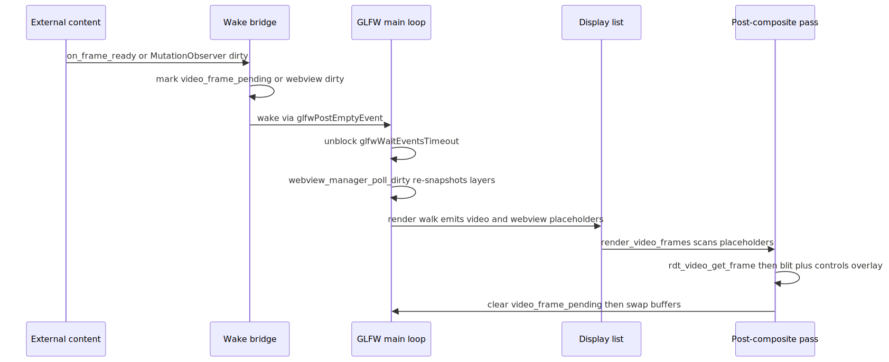

# Radiant — Media & Embedded Webview

> **Part of the [Radiant detailed-design set](RAD_00_Overview.md).** This document covers the two subsystems that push *external* content into a Radiant document: animated media (GIF, Lottie, video) and native embedded web views (`<webview>`). Their code lives in separate files but they are the same design: content that Radiant does not lay out or paint itself is decoded/rendered by an outside engine into an `ImageSurface`, then composited into the window surface at a layout-computed rect. Both share the `#ifdef`-selected mac/linux/stub platform-abstraction pattern and the same main-loop dirty-poll/wake hooks. This doc describes that unifying pattern, each media player, the placeholder-plus-post-composite render split, and the webview child-window/layer modes.
>
> **Primary sources:** media — `radiant/render.hpp` + `radiant/gif_player.cpp`, `radiant/render.hpp` + `radiant/lottie_player.cpp`, `radiant/rdt_video.h` + `radiant/rdt_video_avf.mm` + `radiant/rdt_video_stub.cpp`, `radiant/render.hpp` + `radiant/render_media.cpp`, `radiant/render.hpp` + `radiant/render_video.cpp`, `radiant/image_surface_generation.cpp`, `radiant/render.hpp` + `radiant/video_frame_wake.cpp`; webview — `radiant/radiant.hpp`, `radiant/webview_manager.cpp`, `radiant/webview_child_{mac.mm,linux.cpp,stub.cpp}`, `radiant/webview_layer_{mac.mm,linux.cpp,stub.cpp}`, `radiant/webview_handle_{mac,linux}.h`.
> **Audience:** engine developers. **Convention:** `file:line` references drift; confirm against the symbol name.

---

## 1. The unifying pattern: external content composited into the surface

A Radiant document is normally laid out ([RAD_03](RAD_03_Layout_Driver_Block_BFC.md)–[RAD_11](RAD_11_Positioned_Float_Multicol_Lists.md)) and painted ([RAD_13](RAD_13_Render_Walk_Painters.md)) entirely by Radiant. Media and webviews break that: their pixels are produced by an *external* engine — the OS image decoder, ThorVG, AVFoundation, WebKit — that Radiant cannot drive glyph-by-glyph. The engine therefore treats each as a black box that writes RGBA into an `ImageSurface` (`struct ImageSurface`, defined in `surface.cpp` and used across `view.hpp`), and Radiant's only job is to composite that surface into the window at the box's layout rect.

Three invariants recur across all four content types:

1. **A dedicated `ImageSurface` holds the external pixels.** GIF and Lottie point the surface's `pixels` at their own frame buffer; layer-mode webviews snapshot into a freshly allocated surface; video keeps its frame buffer inside the `RdtVideo` and copies at blit time.
2. **A `generation` counter invalidates the render cache.** Whenever external pixels change, the code calls `image_surface_bump_generation` (`image_surface_generation.cpp:3`), which increments `ImageSurface::generation` and skips 0. The render walk's fragment cache compares this generation (`render_block.cpp:126`) and re-blits only when it changed. This is the whole mechanism that lets a 30-fps video repaint without re-running layout.
3. **A platform abstraction chosen by `#ifdef`, with a stub fallback.** Video (`rdt_video.h`) and both webview modes expose a single C API implemented three ways — mac (`.mm`), linux (`.cpp`), and a no-op stub (`.cpp`) — selected at compile time by `__APPLE__` / `__linux__` guards, not by build config. The whole `radiant/` directory is glob-compiled, so the stubs must guard their bodies with the inverse `#if !defined(__APPLE__) && !defined(__linux__)` (`webview_child_stub.cpp:6`, `rdt_video_stub.cpp` compiles unconditionally but only defines the struct when no real backend links).

The second half of the pattern is the **wake/dirty-poll loop**. Because external content changes asynchronously (a video decodes a frame on an AVF dispatch queue; a webview mutates its DOM in WebKit), Radiant's GLFW main loop would otherwise sit blocked in `glfwWaitEventsTimeout`. Both subsystems solve this the same way: a callback marks the document dirty and posts an empty GLFW event to unblock the loop, which then re-polls, rebuilds the display list, and repaints. This is the [RAD_16](RAD_16_Animation_Frame_Scheduling.md) frame-scheduling seam and the [RAD_20](RAD_20_Application_Shell_Browsing.md) main-loop seam; the wake plumbing is described in [§5](#5-the-frame-ready-wake-and-post-composite-flow).

---

## 2. Media players — three engines behind one animation seam

GIF and Lottie are *animations*: they register with the shared `AnimationScheduler` ([RAD_16](RAD_16_Animation_Frame_Scheduling.md)) as an `AnimationInstance` (`view.hpp`, with `void* state` and a `tick`/`on_finish` pair). Video is deliberately *not* on the scheduler — it is driven by its own decode thread and wakes the loop directly ([§2.3](#23-video-mac-avfoundation-stub-elsewhere)). All three are attached during style resolution / surface decode: `surface.cpp` calls `lottie_detect_by_*` then `lottie_player_create_*` (`surface.cpp:786-807`) and `gif_detect_animated*` then `gif_animation_create` (`surface.cpp:930-937`); `resolve_htm_style.cpp:862,916` calls `rdt_video_create` for `<video>` elements.

### 2.1 GIF — frame-swap, no re-decode

`gif_player.cpp` does **not** decode GIFs itself. `gif_detect_animated` (`gif_player.cpp:137`) checks the `.gif` extension and delegates to `image_gif_load` (`lib/image.h`), returning a pre-decoded `GifFrames*` only when it is multi-frame; `gif_detect_animated_from_memory` (`gif_player.cpp:153`) does the same from bytes after checking the `GIF` magic. `gif_animation_create` (`gif_player.cpp:74`) wraps those frames in a `GifAnimation` (`render.hpp`) and registers an `ANIM_GIF` instance whose scheduler `duration` is one loop's total delay, with infinite iterations handled internally.

The tick is cheap: `gif_animation_tick` (`gif_player.cpp:12`) advances `current_frame` when `now >= frame_end_time`, points `surface->pixels` straight at the next frame's already-decoded `pixels` (`gif_player.cpp:37`), and bumps the surface generation. No pixels are copied or re-decoded — the surface pointer is just swapped. Loop counting (from the GIF NETSCAPE extension) is done in the tick, not by the scheduler. `gif_animation_finish` (`gif_player.cpp:47`) frees the frames via `image_gif_free` and nulls `surface->pixels`.

### 2.2 Lottie — ThorVG re-raster per tick

`lottie_player.cpp` uses ThorVG (`thorvg_capi.h`), the same vector engine that backs Radiant's SVG rendering — see [RAD_14](RAD_14_SVG_Vector_Graph.md) for the shared `RdtPicture`/ThorVG stack. `lottie_player_init` (`lottie_player.cpp:119`) loads the JSON into a `Tvg_Animation`, creates a dedicated `SwCanvas`, and allocates an ABGR8888 pixel buffer sized to the render dimensions. Detection is `lottie_detect_by_path` (`.json`/`.lottie` extension, `lottie_player.cpp:247`) or the content heuristic `lottie_detect_by_content` (`lottie_player.cpp:260`), which scans the first 512 bytes for the Lottie top-level keys `v`, `fr`, `ip`.

Unlike GIF, each `lottie_animation_tick` (`lottie_player.cpp:17`) genuinely re-rasterizes: it maps normalized progress `t` to a frame number, `tvg_animation_set_frame`, clears the buffer, `tvg_canvas_draw`/`tvg_canvas_sync`, then points `surface->pixels` at the buffer and bumps generation. `lottie_animation_finish` (`lottie_player.cpp:52`) destroys the canvas and deletes the animation (which also frees the picture — the comment at `lottie_player.cpp:66` warns against double-free) and frees the pixel buffer. The player defaults to `loop = true` to match browser behavior (`lottie_player.cpp:165`).

### 2.3 Video — mac AVFoundation, STUB elsewhere

Video hides behind the platform-agnostic C API `rdt_video.h`. **Only macOS has a real backend** (`rdt_video_avf.mm`); Linux (FFmpeg) and Windows (Media Foundation) are declared in the header comment (`rdt_video.h:8-10`) but **not implemented** — `rdt_video_stub.cpp` provides no-op stubs that leave state stuck at `RDT_VIDEO_STATE_IDLE` and return 0/`false`/`-1` from every getter (`rdt_video_stub.cpp:54-92`). On those platforms the renderer degrades to a play-button overlay ([§4](#4-render-split-placeholder-then-post-composite-blit)).

The macOS backend (`struct RdtVideo`, `rdt_video_avf.mm:27`) is a no-ARC Objective-C++ struct. `rdt_video_open_file` (`rdt_video_avf.mm:243`) builds an `AVURLAsset`/`AVPlayerItem`/`AVPlayer` for local files only (the header is explicit: web URLs deferred, `rdt_video.h:55-56`), and — critically — uses an `AVAssetImageGenerator` for frames rather than an `AVPlayerItemVideoOutput`. The comment at `rdt_video_avf.mm:265-267` records why: `AVPlayerItemVideoOutput` makes otherwise-playable items fail with `AVFoundationErrorDomain -11821` in headless/test environments, so `AVPlayer` is kept only for timing/audio and frames are pulled on demand. `rdt_video_get_frame` (`rdt_video_avf.mm:434`) lazily `copyCGImageAtTime`s into a `CGBitmapContext` RGBA buffer, caching by `last_generated_frame_ms` so repeated pulls of the same time are cheap.

State is tracked via KVO on `AVPlayerItem.status` and `AVPlayer.timeControlStatus` (`RdtVideoObserver`, `rdt_video_avf.mm:118`), with a fallback that polls those same properties in `rdt_video_get_state` (`rdt_video_avf.mm:373`) because KVO may not fire without a run loop. The `RdtVideoState` enum (`rdt_video.h:22`) and the `RdtVideoCallbacks` struct (`rdt_video.h:40`, four callbacks: state/frame/duration/size) are the entire cross-platform contract. A `addPeriodicTimeObserver` block throttled to ~30 fps (`rdt_video_avf.mm:285-301`, gated on `current_ms - last_ms >= 33`) sets `has_new_frame` and fires `on_frame_ready` — the wake trigger of [§5](#5-the-frame-ready-wake-and-post-composite-flow).

---

## 3. Embedded webview — a native web engine as a child or a layer

A `<webview>` element (`HTM_TAG_WEBVIEW`) embeds a full native browser engine inside a Radiant document. The public API and per-element state live in `radiant.hpp`: `enum WebViewMode { WEBVIEW_MODE_WINDOW = 0, WEBVIEW_MODE_LAYER = 1 }` and `struct WebViewProp`, hung off the element's `embed->webview`. `WebViewProp` carries the opaque `WebViewHandle*`, the `src`/`srcdoc` (borrowed from DOM attributes), cached bounds `last_x/y/w/h`, and — for layer mode — the snapshot `ImageSurface* surface`, a `dirty` flag, and `visible`/`loaded`/`needs_create` flags.

### 3.1 The two modes

**Child-window mode** (`WEBVIEW_MODE_WINDOW`, the default) creates a native web view as an always-on-top overlay parented to the GLFW window. On macOS, `webview_platform_create` (`webview_child_mac.mm:170`) gets the `NSWindow` via `glfwGetCocoaWindow`, adds a `WKWebView` as a subview of the content view, and positions it in flipped-Y NSView coordinates (`webview_child_mac.mm:232`). On Linux, `webview_platform_create` (`webview_child_linux.cpp:261`) creates a `GTK_WINDOW_POPUP` hosting a `WebKitWebView`, positioned at absolute screen coordinates (GLFW window pos + layout offset) and pumped via `gtk_main_iteration_do`. The overlay renders itself; Radiant never composites its pixels, so it is always on top and has no z-order relationship with document content.

**Layer/compositing mode** (`WEBVIEW_MODE_LAYER`, "Stage 2" in `radiant.hpp`) renders the web engine *offscreen* and snapshots it into an `ImageSurface` that Radiant composites with correct z-order. On macOS, `webview_layer_platform_create` (`webview_layer_mac.mm:156`) builds a hidden `WKWebView`; `webview_layer_platform_snapshot` (`webview_layer_mac.mm:306`) calls the async `takeSnapshotWithConfiguration` and — because the render pipeline needs the result synchronously — spins the run loop up to 500 ms until it completes (`webview_layer_mac.mm:379-385`), guarded by `snapshot_in_progress`. On Linux, `webview_layer_platform_create` (`webview_layer_linux.cpp:314`) uses a `GtkOffscreenWindow` with software rendering forced on, and `on_snapshot_ready` (`webview_layer_linux.cpp:230`) converts WebKit's cairo `ARGB32`-premultiplied surface to non-premultiplied RGBA row-by-row (`webview_layer_linux.cpp:277-301`).

### 3.2 The manager and its post-layout sync

`WebViewManager` (`webview_manager.cpp:18`) owns a growable array of `TrackedHandle{handle, mode}` plus the `GLFWwindow*`. It is created lazily: `webview_manager_sync_layout` (`webview_manager.cpp:313`) first calls `tree_has_webview` (`webview_manager.cpp:159`) and only allocates the manager (stored on `UiContext::webview_mgr`) if the tree actually contains a `<webview>`. Documents without webviews pay nothing.

The core walk is `sync_walk` (`webview_manager.cpp:177`): it accumulates absolute position (respecting scroll offsets), and for each webview branches on mode. Layer mode (`webview_manager.cpp:198`) lazily creates the handle + an `ImageSurface` sized `w*pixel_ratio × h*pixel_ratio`, loads `srcdoc` or `src`, resizes on dimension change, and re-snapshots when `dirty`. Child mode (`webview_manager.cpp:258`) creates the native handle, repositions on bounds change via `webview_set_bounds`, and toggles visibility from `display:none`. `webview_manager_clear` (`webview_manager.cpp:374`) destroys all handles before a page navigation ([RAD_20](RAD_20_Application_Shell_Browsing.md)).

### 3.3 Event injection and hit-testing

Child-window webviews receive input natively (they are real OS windows). Layer-mode webviews are offscreen, so Radiant must forward input: `webview_layer_platform_inject_{mouse,key,text,scroll}` (`radiant.hpp`) translate Radiant events into JavaScript `dispatchEvent` calls that run inside the web content — e.g. the mac mouse injector runs `document.elementFromPoint(x,y).dispatchEvent(...)` (`webview_layer_mac.mm:427-447`), the Linux path is identical (`webview_layer_linux.cpp:490-508`). Hit-testing a click onto a layer webview — deciding that a point falls inside the composited surface and should be forwarded — is the [RAD_15](RAD_15_Events_Input.md) event-routing seam; this doc owns only the injection side.

---

## 4. Render split — placeholder, then post-composite blit

Media and layer-webview content is **not** blitted during the normal render walk. `render_media.cpp` is the layout→display-list bridge for all replaced media. For still images (`render_image_content`, `render_media.cpp:118`) it does blit inline, applying full `object-fit`/`object-position` math and the SVG `preserveAspectRatio` default. But for video and layer webviews it only *records a placeholder* into the display list:

- `render_video_content` (`render_media.cpp:311`) emits a `DL_VIDEO_PLACEHOLDER` (`rc_video_placeholder`) carrying the `RdtVideo*`, the dest rect, and `object_fit` flags — with `has_controls` packed into bit 8 (`render_media.cpp:321`) and the current `video_frame_generation` so the display list caches correctly. It does **not** touch pixels.
- `render_webview_layer_content` (`render_media.cpp:289`) emits a `DL_WEBVIEW_LAYER_PLACEHOLDER` (`rc_webview_layer_placeholder`) referencing the snapshot surface and its generation; `render_media_is_webview_layer` (`render_media.cpp:284`) gates this.

The actual video pixels are blitted **after** tile compositing produces the final surface. `render_video_frames` (`render_video.cpp:405`, called from `render_output.cpp:431`) scans the display list for `DL_VIDEO_PLACEHOLDER` items, caches each placement into `DocState::video_placements` for the fast path, skips off-viewport videos (`is_video_visible`, `render_video.cpp:51`), pulls the current frame with `rdt_video_get_frame`, and `blit_video_frame` (`render_video.cpp:28`)s it via `raster_blit_pixels_scaled`. It then draws chrome: a full controls overlay (`render_video_controls`, `render_video.cpp:184` — play/pause, seek bar, time, volume, all drawn with ThorVG paths and font-system glyphs) when `has_controls`, an error X (`render_error_state`, `render_video.cpp:337`) in the error state, or a large centered play button (`render_play_button_overlay`, `render_video.cpp:373`) for idle/paused/ready. The idle/loading branch is where a poster image *would* be shown but is not yet plumbed (`render_video.cpp:454`).

The reason for the post-composite split is the [RAD_16](RAD_16_Animation_Frame_Scheduling.md) video-only fast path: when only a video frame changed, `render_video_frames_cached` (`render_video.cpp:495`) re-blits from the cached `video_placements` **without** rebuilding the display list or replaying tiles. `window.cpp:810` takes this path when `has_active_video && video_frame_pending`. Layer webviews have no such post-composite blit — their placeholder is composited in-band by the painter from the snapshot surface, using generation for cache invalidation.

---

## 5. The frame-ready wake and post-composite flow

External content changes asynchronously, so both subsystems must wake the blocked GLFW loop. The video wake bridge is `video_frame_wake.cpp`: a single global callback registered by `radiant_video_set_wake_callback` (`video_frame_wake.cpp:8`), which `window.cpp:1272` sets to `view_wake_glfw` (a `glfwPostEmptyEvent` wrapper) for the duration of the main loop and clears at exit (`window.cpp:1397`). When AVFoundation reports a fresh frame, the `on_frame_ready` callback (`media_frame_ready`, `resolve_htm_style.cpp:25`) calls `radiant_video_notify_frame_ready`, which does two things (`video_frame_wake.cpp:13-18`): marks the document via `doc_state_mark_video_frame_pending` (`state_store.cpp:3929`, which bumps `video_frame_generation`) and fires the wake callback. The state callbacks (`media_state_changed`, `resolve_htm_style.cpp:16`) also set `has_active_video` and wake, so playback start/stop repaints too.

Webview layer views wake through a different but parallel path: their content marks itself dirty. A `MutationObserver` injected into every layer webview (`webview_layer_mac.mm:185-189`, `webview_layer_linux.cpp:65-71`) posts a `__dirty` IPC message whenever the DOM mutates, and the message handler sets `handle->dirty`. The main loop polls this each tick via `webview_manager_poll_dirty` (`webview_manager.cpp:368` → `poll_dirty_walk`, `webview_manager.cpp:333`, called at `window.cpp:1369`): it checks `webview_layer_platform_is_dirty`, re-snapshots the changed surface, bumps its generation, and returns `true` so the loop repaints. Child-window webviews need no wake — they repaint themselves natively.

The end-to-end tick is therefore: async change → wake bridge marks dirty + posts empty GLFW event → loop unblocks → poll dirty webviews and video-pending → rebuild display list (placeholders) → composite → `render_video_frames` post-composite blit → `doc_state_clear_video_frame_pending` (`render_video.cpp:486`) → swap buffers. The generation counters ([§1](#1-the-unifying-pattern-external-content-composited-into-the-surface)) ensure only the changed surface is re-blitted.

---

## 6. Known Issues & Future Improvements

1. **Webview IPC to the Lambda runtime is a TODO on every platform.** `window.__lambda.invoke()` messages are received and logged but never dispatched: `webview_child_mac.mm:160`, `webview_child_linux.cpp:97`, and `webview_layer_linux.cpp:113` all carry `// TODO: ... dispatch to Lambda runtime`. The macOS layer handler (`webview_layer_mac.mm:70-76`) only sets `dirty` and does not even log the payload. The entire injected bridge (`_callbacks`, `on()`) is inert. *Improvement:* wire the JSON `{command, payload}` into the [RAD_21](RAD_21_JS_Scripting_Integration.md) runtime.
2. **No Linux or Windows video.** `rdt_video_stub.cpp:3-4` documents that FFmpeg and Media Foundation backends are "not yet implemented, using stubs"; every getter returns 0/false and playback never leaves `RDT_VIDEO_STATE_IDLE`. Video works on macOS only; elsewhere the page shows a permanent play button.
3. **Video source is local files only.** `rdt_video_open_file` is the sole source entry (`rdt_video.h:55-58`); web URLs are explicitly deferred. A `<video src="https://...">` will not load even on macOS.
4. **Layer-mode snapshot is forced synchronous by spinning the run loop.** `webview_layer_mac.mm:379-385` and `webview_layer_linux.cpp:453` block up to 500 ms pumping the platform event loop to turn an async snapshot into a synchronous call for the render pipeline. This is fragile (nested run-loop reentrancy, and a hard 500 ms stall on a slow snapshot) and is the main reason layer mode is still "Stage 2".
5. **AVFoundation frame path is per-frame `AVAssetImageGenerator`, not a video output.** The workaround for error -11821 (`rdt_video_avf.mm:265-271`) copies a `CGImage` every frame via `CGBitmapContextCreate` — noticeably less efficient than a zero-copy `AVPlayerItemVideoOutput`/`IOSurface` path.
6. **Poster image is not plumbed.** The idle/loading branch of `render_video_frames` (`render_video.cpp:452-457`) comments that a poster "would need to be passed through" and falls back to the play button; `poster` attribute support is missing.
7. **GIF finish leaves a dangling `surface->pixels` briefly.** `gif_animation_finish` frees the frames, after which `surface->pixels` points at freed memory until it is nulled two lines later (`gif_player.cpp:55-64`) — a narrow window, but any interleaved read during teardown would be a use-after-free.
8. **No macOS child-mode compositing / z-order.** Child-window webviews are always-on-top overlays with no relationship to document z-order; only layer mode composites correctly. Mixing a child webview under other content is impossible.
9. **`WebViewProp.src`/`srcdoc` are borrowed pointers.** They are documented as borrowed DOM-attribute storage in `radiant.hpp`; their lifetime is tied to the DOM node and is not retained through a `view_pool_reset_retained` ([RAD_01 §6](RAD_01_View_and_DOM_Model.md)) — a relayout that frees attribute storage while a webview holds `src` would dangle. No `PersistentFieldRef` guards them.

---

## Appendix A — Source map

| File | Responsibility (this doc) |
|---|---|
| `radiant/render.hpp` + `radiant/gif_player.cpp` | `GifAnimation`, `gif_detect_animated*`, `gif_animation_create/tick/finish` — frame-swap GIF, no re-decode. |
| `radiant/render.hpp` + `radiant/lottie_player.cpp` | `LottiePlayer`, ThorVG init/tick re-raster, `lottie_detect_by_*`. |
| `radiant/rdt_video.h` | Platform-agnostic video C API: `RdtVideo`, `RdtVideoState`, `RdtVideoFrame`, `RdtVideoCallbacks`. |
| `radiant/rdt_video_avf.mm` | macOS AVFoundation backend — `AVPlayer` timing + `AVAssetImageGenerator` frames + KVO state. |
| `radiant/rdt_video_stub.cpp` | No-op video stub (Linux/Windows) — stuck at IDLE. |
| `radiant/render.hpp` + `radiant/render_media.cpp` | Layout→display-list bridge: inline image blit, `render_video_content`/`render_webview_layer_content` placeholder emit. |
| `radiant/render.hpp` + `radiant/render_video.cpp` | Post-composite video blit + controls/error/play-button chrome; cached fast path. |
| `radiant/image_surface_generation.cpp` | `image_surface_bump_generation` — the cache-invalidation counter shared by all players. |
| `radiant/video_frame_wake.cpp` | Global wake bridge: `radiant_video_set_wake_callback` / `radiant_video_notify_frame_ready`. |
| `radiant/radiant.hpp` | `WebViewMode`, `WebViewProp`, manager + platform API declarations. |
| `radiant/webview_manager.cpp` | `WebViewManager`, lazy creation, `sync_walk` post-layout sync, `poll_dirty_walk`. |
| `radiant/webview_child_{mac.mm,linux.cpp,stub.cpp}` | Child-window native overlay backends + `lambda://` scheme handler + IPC. |
| `radiant/webview_layer_{mac.mm,linux.cpp,stub.cpp}` | Offscreen snapshot backends + JS-`dispatchEvent` input injection + MutationObserver dirty. |
| `radiant/webview_handle_{mac,linux}.h` | Opaque `WebViewHandle` struct per platform (mode-aware). |

## Appendix B — Related documents

- [RAD_00 — Overview](RAD_00_Overview.md) — the set index and architecture.
- [RAD_01 — View & DOM Model](RAD_01_View_and_DOM_Model.md) — `embed->img`/`embed->video`/`embed->webview` live on `DomElement`; retained-field lifetime for external content.
- [RAD_13 — Render Walk & Painters](RAD_13_Render_Walk_Painters.md) — the painter that composites image and layer-webview surfaces and reads the `generation` cache key.
- [RAD_14 — SVG & Vector Graphics](RAD_14_SVG_Vector_Graph.md) — the ThorVG/`RdtPicture` stack shared by Lottie and by the video controls overlay.
- [RAD_15 — Events & Input](RAD_15_Events_Input.md) — hit-testing a point onto a layer webview and routing input to the injectors.
- [RAD_16 — Animation Frame Scheduling](RAD_16_Animation_Frame_Scheduling.md) — the `AnimationScheduler` that drives GIF/Lottie ticks and the video-only fast repaint path.
- [RAD_20 — Application Shell & Browsing](RAD_20_Application_Shell_Browsing.md) — the GLFW main loop that polls webview-dirty and video-pending each tick and posts the wake events.
- [RAD_21 — JS Scripting Integration](RAD_21_JS_Scripting_Integration.md) — where webview IPC should (but does not yet) dispatch.
