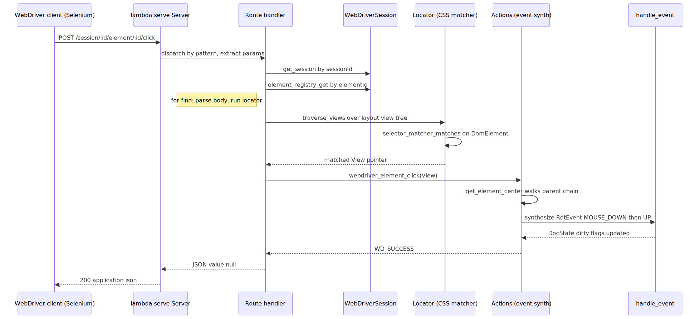

# Radiant — WebDriver Automation

> **Part of the [Radiant detailed-design set](RAD_00_Overview.md).** This document covers Radiant's W3C WebDriver server: an HTTP endpoint (default `localhost:4444`) that lets Selenium/Puppeteer-style clients drive Radiant's layout engine headlessly. It describes the command entry point, the `lambda/serve`-backed route table, the per-session always-headless `UiContext`, how elements are located by running Radiant's real CSS selector matcher over the layout View tree, and how interaction is performed by *synthesizing* `RdtEvent`s through the same `handle_event` path the GUI uses. Large parts of the protocol are still stubbed; those seams are called out throughout and collected in [§8](#8-known-issues--future-improvements).
>
> **Primary sources:** `radiant/webdriver/webdriver.hpp` (all structs, enums, and the C API), `radiant/webdriver/cmd_webdriver.cpp` (`cmd_webdriver` CLI), `radiant/webdriver/webdriver_server.cpp` (HTTP server, route handlers, JSON helpers), `radiant/webdriver/webdriver_session.cpp` (session lifecycle, `ElementRegistry`, navigation), `radiant/webdriver/webdriver_locator.cpp` (locator strategies + view-tree traversal), `radiant/webdriver/webdriver_actions.cpp` (event synthesis, element queries, screenshots), `radiant/webdriver/webdriver_errors.cpp` (error-code mapping).
> **Audience:** engine developers. **Convention:** `file:line` references drift; confirm against the symbol name.

---

## 1. Purpose and shape

The WebDriver subsystem exists so that Radiant's layout/render engine can be exercised by the standard browser-automation ecosystem — the server advertises `browserName:"radiant"` and implements enough of the [W3C WebDriver protocol](https://www.w3.org/TR/webdriver/) that a generic Selenium `webdriver.Remote` client can create a session, navigate to a document, find elements, and click them (`cmd_webdriver.cpp:52-62` documents exactly that Python flow). It is not a general browser: there is no live GUI window, no back/forward, and no JS-from-driver (`executeScript`); the value is deterministic, headless, scriptable layout testing.

Architecturally the subsystem is a thin protocol shell wrapped around machinery that already exists elsewhere in Radiant. It contributes almost no new rendering logic. Instead it reuses three existing seams: the `lambda/serve` HTTP router for transport, the standard `load_html_doc` → `layout_html_doc` pipeline ([RAD_20 — Application Shell & Browsing](RAD_20_Application_Shell_Browsing.md)) for page loading, Radiant's CSS `SelectorMatcher` ([RAD_02 — CSS Style Resolution](RAD_02_CSS_Style_Resolution.md)) for element location, and the `handle_event` input dispatcher ([RAD_15 — Events & Input](RAD_15_Events_Input.md)) for interaction. The WebDriver code's own job is translation: HTTP+JSON in, Radiant operations out, W3C-shaped JSON back.

The seven files map cleanly onto responsibilities: `cmd_webdriver.cpp` is the CLI; `webdriver_server.cpp` is transport + routing + every endpoint handler; `webdriver_session.cpp` owns session state, the element registry, and navigation; `webdriver_locator.cpp` finds elements; `webdriver_actions.cpp` performs interaction and answers element queries; `webdriver_errors.cpp` maps the internal `WebDriverError` enum to W3C error strings and HTTP status codes; `webdriver.hpp` declares all of it as a C-linkage API.

---

## 2. The command entry point

`cmd_webdriver(int argc, char** argv)` (`cmd_webdriver.cpp:71`) is dispatched from the CLI at `main.cpp:3801` (the `webdriver` subcommand). It parses `-p`/`--port` (default `4444`, validated to the 1–65535 range) and `--host` (default `localhost`), installs `SIGINT`/`SIGTERM` handlers that call `webdriver_server_stop` on a file-static `g_server` (`cmd_webdriver.cpp:16-24,107-108`), then calls `webdriver_server_create` followed by the blocking `webdriver_server_run` (`cmd_webdriver.cpp:111-122`). When `server_run` returns (after a signal-triggered stop) it tears the server down with `webdriver_server_destroy`. The `print_help` text (`cmd_webdriver.cpp:26-63`) doubles as the human-readable endpoint list and a copy-pasteable Selenium snippet.

Because the server is blocking, one process serves one WebDriver endpoint; concurrency across *sessions* is handled inside that single event loop, not by multiple processes.

---

## 3. The HTTP server and route table

`struct WebDriverServer` (`webdriver.hpp:264`) holds a `Server*` from `lambda/serve`, a `HashMap* sessions` keyed by session-UUID string, and its own `Arena`/`Pool`. `webdriver_server_create` (`webdriver_server.cpp:820`) builds a `MEM_ROLE_TEMP` pool+arena, allocates the server struct from the arena, constructs the sessions hashmap with a murmur-hash-over-`id` hasher and a `strcmp` comparator (`webdriver_server.cpp:846-856`), then creates the underlying HTTP server via `server_create` with a 60-second timeout (`webdriver_server.cpp:864-869`). It registers one global middleware, `wd_json_middleware` (`webdriver_server.cpp:116`), which stamps `Content-Type: application/json; charset=utf-8` and `Cache-Control: no-cache` on every response, then calls `webdriver_register_routes`.

`webdriver_register_routes` (`webdriver_server.cpp:762`) is the authoritative endpoint list — note this is *per-route registration against the `lambda/serve` router* (`server_get`/`server_post`/`server_del`), not a dispatch switch. Route params like `:sessionId`, `:elementId`, `:name`, `:propertyName`, `:cssProperty` are extracted inside handlers via `http_request_param`. The registered endpoints:

| Method + pattern | Handler | Status |
|---|---|---|
| `GET /status` | `handle_status` | implemented (static readiness) |
| `POST /session` | `handle_new_session` | implemented (always headless) |
| `DELETE /session/:sessionId` | `handle_delete_session` | implemented |
| `GET/POST /session/:sessionId/timeouts` | `handle_get_timeouts` / `handle_set_timeouts` | get real; **set is a TODO no-op** (`:209`) |
| `POST/GET /session/:sessionId/url` | `handle_navigate` / `handle_get_url` | implemented |
| `GET /session/:sessionId/title` | `handle_get_title` | **stub** returns `""` |
| `GET /session/:sessionId/source` | `handle_get_source` | **stub** returns `""` |
| `POST /session/:sessionId/element[s]` | `handle_find_element[s]` | implemented (CSS/link/tag) |
| `GET /session/:sessionId/element/active` | `handle_get_active_element` | **TODO**, always no-such-element (`:395`) |
| `POST .../element/:elementId/element` | `handle_find_element_from_element` | **stub**, always no-such-element |
| `POST .../element/:elementId/click` | `handle_element_click` | implemented |
| `POST .../element/:elementId/clear` | `handle_element_clear` | implemented |
| `POST .../element/:elementId/value` | `handle_element_send_keys` | **TODO**: body not parsed (`:468`) |
| `GET .../element/:elementId/text` | `handle_element_text` | wired, but backing fn is a stub (`actions.cpp:254`) |
| `GET .../element/:elementId/attribute/:name` | `handle_element_attribute` | **TODO** returns null (`:512`) |
| `GET .../element/:elementId/property/:propertyName` | `handle_element_property` | **TODO** returns null (`:535`) |
| `GET .../element/:elementId/css/:cssProperty` | `handle_element_css` | **TODO** returns `""` (`:558`) |
| `GET .../element/:elementId/rect` | `handle_element_rect` | implemented |
| `GET .../element/:elementId/{enabled,selected,displayed}` | respective handlers | implemented |
| `GET .../screenshot`, `.../element/:elementId/screenshot` | `handle_screenshot` / `handle_element_screenshot` | page-level implemented; element = full page |
| `POST/DELETE /session/:sessionId/actions` | `handle_perform_actions` / `handle_release_actions` | **perform is a TODO no-op** (`:707`); release is a no-op |
| `GET/POST /session/:sessionId/window/rect` | `handle_get_window_rect` / `handle_set_window_rect` | get real; **set is a TODO no-op** (`:751`) |

Every handler follows the same skeleton: fetch `sessionId`, resolve the session via `get_session` (`webdriver_server.cpp:63` — hashmap lookup by a zero-initialized key struct), error with `WD_ERROR_INVALID_SESSION_ID` if missing, then do work. Responses are built by three tiny helpers — `wd_send_success` (wraps a raw JSON value), `wd_send_value` (wraps a JSON *string*), and `wd_send_error` (emits the W3C `{"value":{"error":...,"message":...,"stacktrace":""}}` envelope) at `webdriver_server.cpp:34-57`.

The lifecycle functions `webdriver_server_start` (`:887`), `webdriver_server_run` (`:898`, starts-if-needed then blocks in `server_run`), `webdriver_server_stop` (`:910`), and `webdriver_server_destroy` (`:920`, iterates the sessions hashmap destroying each session before freeing the server) round out the module.

---

## 4. Sessions: an always-headless UiContext per session

`struct WebDriverSession` (`webdriver.hpp:104`) is the heart of the subsystem. Each session owns a full `UiContext* uicon`, the current `DomDocument* document`, an `ElementRegistry* elements`, its own `Arena`/`Pool`, the W3C timeout triple, a `window_width`/`window_height`, a `headless` flag, and a monotonic `document_version` used for stale-element detection.

`webdriver_session_create(width, height, headless)` (`webdriver_session.cpp:116`) creates a `MEM_ROLE_TEMP` pool+arena, allocates the session, generates a UUID (`generate_uuid`, `webdriver_session.cpp:25` — a v4 UUID from `rand()`, explicitly non-cryptographic), sets W3C-default timeouts (implicit `0`, pageLoad `300000`, script `30000` unused), creates the element registry, then **allocates and initializes a fresh `UiContext`** via `ui_context_init(uicon, headless)` and `ui_context_create_surface` (`webdriver_session.cpp:163-180`). This is the always-headless per-session context described in [RAD_20](RAD_20_Application_Shell_Browsing.md): each session gets its own off-screen surface, independent of any GUI window and of the global `ui_context` singleton the interactive shell uses.

Critically, `handle_new_session` (`webdriver_server.cpp:131`) hard-codes `webdriver_session_create(1280, 720, true)` — width, height, and headlessness are **not read from the client's requested capabilities**. Every session is 1280×720 and headless regardless of what the driver asks for. The capabilities JSON returned to the client (`webdriver_server.cpp:143-165`) reports `platformName` by `#ifdef`, `setWindowRect:true`, and the timeout triple, but `setWindowRect` is aspirational (see `handle_set_window_rect`, [§8](#8-known-issues--future-improvements)).

### 4.1 Navigation

`webdriver_session_navigate(session, url)` (`webdriver_session.cpp:215`) is the load path: `url_parse` the target, `load_html_doc(base, url, w, h)` (the same loader the shell uses, [RAD_20](RAD_20_Application_Shell_Browsing.md)), bump `document_version`, point `uicon->document` at the new doc, ensure `DocState` via `radiant_document_ensure_state` (needed by the interaction-state queries in [§6](#6-element-queries)), **clear the element registry** (all prior element handles are now stale), and finally `layout_html_doc(uicon, doc, false)`. The version bump plus registry clear is the stale-reference mechanism: `ElementRef.document_version` (`webdriver.hpp:66`) is stamped at registration and compared against the session's current version by `element_registry_is_stale` (`webdriver_session.cpp:94`).

`webdriver_session_get_url` (`webdriver_session.cpp:254`) serializes `document->url`. `webdriver_session_get_title` (`:265`) and `webdriver_session_get_source` (`:275`) are both explicit stubs returning `""`/`NULL` with `TODO` comments.

### 4.2 The element registry

`struct ElementRegistry` (`webdriver.hpp:69`) is a `HashMap` from UUID string to `ElementRef{id, View* view, document_version}`. `element_registry_add` (`webdriver_session.cpp:67`) generates a UUID, stores the `ElementRef` by value, and returns a pointer to the stored copy's `id`. The W3C element identifier `element-6066-11e4-a52e-4f735466cecf` is the JSON key under which those UUIDs are returned to the client (`webdriver_server.cpp:330,370`). `element_registry_get` (`:83`) looks a `View*` back up by UUID. Note the registry stores raw `View*` pointers, not node ids — combined with the fact that navigation clears the registry, this means element handles are only valid within a single loaded document and become dangling (not merely "stale") if the view tree is torn down out from under them; the `document_version` check catches the version-mismatch case but not a same-version relayout.

---

## 5. Element location over the layout View tree

Element location is where the subsystem leans hardest on existing Radiant machinery, and it does so over the **layout View tree**, not a separate DOM index. Recall from [RAD_01 — View & DOM Model](RAD_01_View_and_DOM_Model.md) that a `DomNode` *is* its own `View`; the locator walks that unified tree.

`webdriver_find_element(session, strategy, value, root)` (`webdriver_locator.cpp:347`) defaults `root` to `session->document->view_tree->root` when none is given, then switches on the strategy. `webdriver_parse_strategy` (`:22`) maps the W3C strings `"css selector"`, `"link text"`, `"partial link text"`, `"tag name"`, `"xpath"` onto the `LocatorStrategy` enum (`webdriver.hpp:163`), defaulting to CSS.

The traversal engine is `traverse_views` (`webdriver_locator.cpp:88`): a depth-first walk that invokes a `ViewVisitor` on every element view and recurses into children through the placed-navigation helpers — `ViewBlock::first_child`/`View::next()` for block views and the `RDT_VIEW_INLINE` span branch (`:99-117`). It only visits `is_element()` nodes, so text and marker leaves are skipped as match candidates.

- **CSS** (`find_by_css_selector`, `:172`): parse the selector string with Radiant's own CSS tokenizer + `css_parse_selector_with_combinators` (`parse_css_selector`, `:136`), create a `SelectorMatcher` (`selector_matcher_create`) and configure it with the document's `DocState` via `state_configure_selector_matcher` (so `:hover`/`:checked`/etc. resolve against live interaction state, [RAD_17](RAD_17_Interaction_State.md)). The visitor `css_find_visitor` (`:151`) bridges each `View*` to its `DomElement*` with `lam::dom_require_element(lam::view_dom_node(...))` and calls `selector_matcher_matches` (`:160`) — the exact same matcher that drives CSS cascade in [RAD_02](RAD_02_CSS_Style_Resolution.md). This is the design's biggest win: WebDriver CSS selectors are guaranteed to match whatever Radiant's cascade matches, because it is literally the same code.
- **Link text** (`find_by_link_text`, `:281`): visits `HTM_TAG_A` elements only, extracts their concatenated descendant text via `extract_text_recursive`/`get_view_text` (`:45,67`), and compares by full-equality or `strstr` for the partial variant.
- **Tag name** (`find_by_tag_name`, `:329`): compares `elem->node_name()` case-insensitively via `str_ieq`.
- **XPath**: unimplemented — logs a warning and returns `NULL` (`:372-375`).

`webdriver_find_elements` (`:382`) mirrors the single-element path with the visitor's `find_all` flag set, appending every match into an `ArrayList`; the server handler (`handle_find_elements`, `webdriver_server.cpp:333`) then registers each and emits a JSON array of element objects.

---

## 6. Element queries

The read-only element queries live in `webdriver_actions.cpp` and mostly read fields directly off the placed view.

`webdriver_element_get_rect` (`webdriver_actions.cpp:278`) computes absolute position by summing `x`/`y` up the `parent` chain (each node's geometry is border-box-relative to its parent per [RAD_01](RAD_01_View_and_DOM_Model.md)), then reads `width`/`height` from `ViewBlock` or the inline span. `webdriver_element_is_enabled` (`:310`) checks `PSEUDO_STATE_DISABLED` via `state_get_pseudo_state` ([RAD_17 — Interaction State](RAD_17_Interaction_State.md)) plus the `disabled` attribute. `webdriver_element_is_selected` (`:355`) checks `PSEUDO_STATE_CHECKED` plus `selected`/`checked` attributes. `webdriver_element_is_displayed` (`:331`) checks non-zero dimensions and `display:none` on the block, but has a `TODO` where computed `visibility:hidden` should be consulted (`:347-349`). `webdriver_element_get_attribute` (`:261`) is real — it delegates to `ViewElement::get_attribute`. The remaining query backers are stubs: `get_text` builds an empty `StrBuf` (`:248`, TODO for real extraction — even though the locator already has `get_view_text` that does exactly this), and `get_css` returns `""` (`:270`).

Screenshots are real at page level: `webdriver_screenshot` (`:389`) renders the headless `UiContext` to `./temp/radiant_screenshot.png` via `render_uicontext_to_png`, reads the file back, base64-encodes it, and deletes the temp file. `webdriver_element_screenshot` (`:430`) currently just returns the full-page screenshot (no clipping).

---

## 7. Interaction by synthesizing RdtEvents

The defining design choice for interaction: WebDriver does **not** call element methods or mutate state directly. It synthesizes `RdtEvent`s and feeds them to `handle_event(uicon, doc, event)` (`extern` at `webdriver_actions.cpp:24`; defined in `event.cpp:6664`) — the exact same entry point the GUI uses for real GLFW input ([RAD_15 — Events & Input](RAD_15_Events_Input.md)). The rationale is fidelity: a driver-initiated click travels through hit-testing, focus, pseudo-state updates, form-control logic, and JS event dispatch identically to a user click, so automation tests the real input path rather than a parallel one.

The `sim_*` helpers (`webdriver_actions.cpp:30-87`) each fill an `RdtEvent` union member and dispatch: `sim_mouse_move`, `sim_mouse_button` (which first moves, then presses/releases), `sim_click` (down-then-up), `sim_key`, `sim_text_input` (a Unicode codepoint), and `sim_scroll`.

`webdriver_element_click` (`:130`) gates on displayed+enabled (returning `WD_ERROR_ELEMENT_NOT_INTERACTABLE` otherwise), computes the element center with `get_element_center` (`:93`, same parent-chain walk as `get_rect`), and fires a click there. `webdriver_element_clear` (`:154`) validates the element is an `input`/`textarea`/`contenteditable`, clicks to focus, then synthesizes Ctrl+A followed by Backspace. `webdriver_element_send_keys` (`:183`) clicks to focus, then UTF-8-decodes the text stream character by character; codepoints in the WebDriver PUA range `0xE000`–`0xE00F` are mapped to `RDT_KEY_*` special keys (Backspace/Tab/Enter/Escape/arrows/Delete, `:216-234`) while everything else is sent as `sim_text_input`. (Note the `send_keys` server handler at `webdriver_server.cpp:451` never actually parses the request body and calls this, so the wiring is incomplete even though the action itself works.)

The W3C Actions API is only partially built. `webdriver_perform_actions` (`:440`) iterates a pre-parsed `ArrayList` of `WebDriverAction` (`webdriver.hpp:314`) and dispatches each `ActionType` to the `sim_*` helpers, resolving pointer-move origins to element centers (`:472-486`) — but `ACTION_PAUSE` is skipped (`:449`), `ACTION_POINTER_CANCEL` is a no-op (`:495`), and there is no code path that actually *builds* that `ArrayList` from the HTTP body, so the `handle_perform_actions` route is an unreachable-in-practice no-op. `webdriver_release_actions` (`:503`) is a TODO stub that tracks no pressed state.

---

## 8. Known Issues & Future Improvements

1. **Session capabilities are ignored; always 1280×720 headless.** `handle_new_session` hard-codes `webdriver_session_create(1280, 720, true)` (`webdriver_server.cpp:134`) and never reads the client's requested `capabilities`. `handle_set_window_rect` (`:741`) and `handle_get_window_rect` (`:725`) report the fixed size, and set is a TODO no-op (`:751`). *Improvement:* parse `alwaysMatch`/`firstMatch` capabilities and honor `windowRect`.
2. **JSON parsing is `strstr`-based and fragile.** `wd_extract_json_string` (`webdriver_server.cpp:80`) locates keys with `snprintf`-built patterns and manual quote scanning; it does not understand nesting, arrays, numbers, or escaped structure, and will mis-parse any body where a key name appears inside a value. The file already `#include`s `parse_json`/`mark_reader` (`webdriver_server.cpp:22-28`) but does not use them. *Improvement:* replace with the real `parse_json` + `MarkReader` path already linked in.
3. **Many handlers are stubs or TODOs.** Title (`webdriver_session.cpp:265`), page source (`:275`), set-timeouts (`webdriver_server.cpp:209`), active element (`:395`), find-element-from-element (`:381`), send-keys body parse (`:468`), get-attribute (`:512`), get-property (`:535`), get-css (`:558`), perform-actions body parse (`:707`) all return placeholders. Element `get_text` (`webdriver_actions.cpp:254`) returns empty even though `webdriver_locator.cpp:67` already implements the extraction it needs — that logic should be shared.
4. **XPath is unimplemented.** `LOCATOR_XPATH` logs a warning and returns nothing (`webdriver_locator.cpp:372-375,421-423`); the enum member exists but no engine backs it.
5. **Actions API is incomplete and effectively unreachable.** No code builds the `WebDriverAction` list from the HTTP body, and even the executor skips pause/cancel and tracks no pressed state for `release_actions` (`webdriver_actions.cpp:449,495,503-509`).
6. **Element handles are raw `View*` with weak staleness protection.** `ElementRef.view` (`webdriver.hpp:65`) stores a bare pointer; only a navigation-driven `document_version` bump marks it stale (`webdriver_session.cpp:236,94`). A same-version relayout that reuses/frees views would leave dangling handles undetected. *Improvement:* key handles by the node's monotonic `id` (as `DocState`/`ViewState` weak refs do, [RAD_17](RAD_17_Interaction_State.md)) and re-resolve on use.
7. **Non-cryptographic UUIDs.** Session and element IDs come from `rand()` seeded by `time(NULL)` (`webdriver_session.cpp:25-38`). Fine for local automation, but collision/guessing risk if ever exposed beyond localhost.
8. **`is_displayed` ignores computed visibility.** `webdriver_element_is_displayed` checks dimensions and `display:none` but not `visibility:hidden`/`opacity:0` (`webdriver_actions.cpp:347-349`).
9. **Blocking single-endpoint server.** `webdriver_server_run` blocks (`webdriver_server.cpp:898`); there is no `newSession`-per-connection isolation beyond the sessions hashmap, and `webdriver_server_start`'s non-blocking mode is present but unused by the CLI.

---

## Appendix A — Source map

| File | Responsibility (this doc) |
|---|---|
| `radiant/webdriver/webdriver.hpp` | C-linkage API: `WebDriverError`, `ElementRef`/`ElementRegistry`, `WebDriverSession`, `LocatorStrategy`, `WebDriverServer`, `WebDriverAction`/`ActionType`, all function declarations. |
| `radiant/webdriver/cmd_webdriver.cpp` | `cmd_webdriver` CLI entry: arg parsing, signal handlers, create/run/destroy server. |
| `radiant/webdriver/webdriver_server.cpp` | HTTP server (`lambda/serve`), `webdriver_register_routes`, every route handler, JSON response helpers, `strstr`-based `wd_extract_json_string`, session lookup. |
| `radiant/webdriver/webdriver_session.cpp` | `ElementRegistry`, UUID generation, session create/destroy, `webdriver_session_navigate` (load+layout), url/title/source getters. |
| `radiant/webdriver/webdriver_locator.cpp` | `traverse_views` over the layout View tree; CSS (`selector_matcher_matches`), link-text, tag-name locators; XPath stub. |
| `radiant/webdriver/webdriver_actions.cpp` | `sim_*` `RdtEvent` synthesis → `handle_event`; click/clear/send_keys; element rect/enabled/selected/displayed/attribute queries; page screenshot; Actions executor. |
| `radiant/webdriver/webdriver_errors.cpp` | `webdriver_error_name` / `webdriver_error_http_status` — internal enum to W3C error string + HTTP status. |

## Appendix B — Related documents

- [RAD_00 — Overview](RAD_00_Overview.md) — the set index and architecture.
- [RAD_01 — View & DOM Model](RAD_01_View_and_DOM_Model.md) — the unified `DomNode`/`View` tree the locator walks and the border-box geometry `get_rect` sums.
- [RAD_02 — CSS Style Resolution](RAD_02_CSS_Style_Resolution.md) — the `SelectorMatcher` reused verbatim for CSS-selector element location.
- [RAD_15 — Events & Input](RAD_15_Events_Input.md) — `RdtEvent` and `handle_event`, the input path WebDriver synthesizes into.
- [RAD_17 — Interaction State](RAD_17_Interaction_State.md) — `DocState`/`state_get_pseudo_state` backing `is_enabled`/`is_selected` and the matcher's live pseudo-state.
- [RAD_20 — Application Shell & Browsing](RAD_20_Application_Shell_Browsing.md) — the `UiContext`, `load_html_doc`, and `layout_html_doc` pipeline each session drives headlessly.
