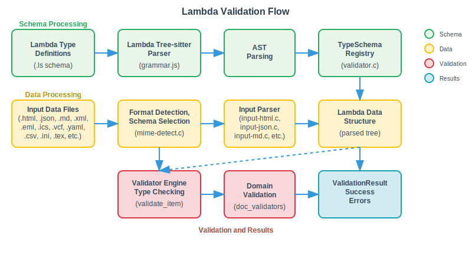

# Lambda Validator Documentation

## 1. Overview and CLI Integration

The Lambda Validator is now **fully integrated into the Lambda CLI** as a subcommand, providing schema validation capabilities for Lambda script files.

### CLI Usage

```bash
# ========================================
# AUTOMATIC SCHEMA SELECTION (Recommended)
# ========================================

# HTML Documents
./lambda.exe validate document.html         # → html5_schema.ls
./lambda.exe validate test/input/test.html  # → html5_schema.ls

# Email Messages  
./lambda.exe validate email.eml             # → eml_schema.ls
./lambda.exe validate test/input/simple.eml # → eml_schema.ls

# Calendar Events
./lambda.exe validate calendar.ics          # → ics_schema.ls
./lambda.exe validate test/input/simple.ics # → ics_schema.ls

# vCard Contacts
./lambda.exe validate contacts.vcf          # → vcf_schema.ls
./lambda.exe validate test/input/simple.vcf # → vcf_schema.ls

# Document Formats (all use doc_schema.ls)
./lambda.exe validate document.md           # → doc_schema.ls (Markdown)
./lambda.exe validate article.rst           # → doc_schema.ls (reStructuredText) 
./lambda.exe validate manual.1              # → doc_schema.ls (man page)
./lambda.exe validate test_document.ls      # → doc_schema.ls (Lambda format)

# ========================================  
# EXPLICIT SCHEMA SPECIFICATION
# ========================================

# Override automatic selection with custom schema
./lambda.exe validate -s custom_schema.ls document.html
./lambda.exe validate -s custom.ls test/input/test.html

# Formats requiring explicit schema (no defaults available)
./lambda.exe validate -s json_schema.ls data.json
./lambda.exe validate -s xml_schema.ls config.xml
./lambda.exe validate -s yaml_schema.ls settings.yaml

# ========================================
# FORMAT OVERRIDE WITH EXPLICIT SCHEMA
# ========================================

# Force format detection with -f flag
./lambda.exe validate -f json data.txt -s json_schema.ls
./lambda.exe validate -f yaml config.txt -s yaml_schema.ls
```

### Schema Selection Logic

The validator automatically selects the appropriate schema based on file format:

#### Formats with Default Schemas (Automatic Selection)
- **HTML** (`.html`, `.htm`) → `html5_schema.ls`
- **Email** (`.eml`) → `eml_schema.ls`
- **Calendar** (`.ics`) → `ics_schema.ls`
- **vCard** (`.vcf`) → `vcf_schema.ls`
- **Document Formats** → `doc_schema.ls`:
  - **AsciiDoc** (`.adoc`, `.asciidoc`)
  - **Man Pages** (`.1`, `.2`, `.3`, `.4`, `.5`, `.6`, `.7`, `.8`, `.9`, `.man`)
  - **Markdown** (`.md`, `.markdown`)
  - **reStructuredText** (`.rst`)
  - **Wiki** (`.wiki`)
  - **Lambda Scripts** (`.ls` or no extension)

#### Formats Requiring Explicit Schema
These formats require the `-s <schema_file>` option:
- **JSON** (`.json`)
- **XML** (`.xml`)
- **YAML** (`.yaml`, `.yml`)
- **CSV** (`.csv`)
- **INI** (`.ini`)
- **TOML** (`.toml`)
- **LaTeX** (`.tex`, `.latex`)
- **RTF** (`.rtf`)
- **PDF** (`.pdf`)
- **Plain Text** (`.txt`)

### Integration Status
✅ **Complete CLI Integration**: Lambda validator is fully integrated as `lambda validate` subcommand  
✅ **Memory Pool Integration**: Uses Lambda's VariableMemPool with correct API  
✅ **Build System Integration**: Included in main Lambda build configuration  
✅ **Automatic Schema Selection**: Intelligent schema selection based on file format  
✅ **Multi-Format Support**: Supports HTML, EML, ICS, VCF, and document formats  
✅ **Tree-sitter Integration**: Complete integration with Lambda grammar and `ts-enum.h`  

## 2. Architecture Overview

### Design Overview
The Lambda Validator is a **general-purpose validation system** with **complete Tree-sitter integration**:

- **Tier 1: Schema Parser** (`schema_parser.c`) - Parses **any Lambda type definitions** using the existing Lambda Tree-sitter grammar
- **Tier 2: Core Validation** (`validator.c`) - Validates documents against parsed schemas
- **Tier 3: Domain Validators** (`doc_validators.c`) - Domain-specific validation rules (e.g., document structure)

### Design Principles

**General Purpose**: The validator works with **any Lambda type definitions**, not just document schemas. The `doc_schema.ls` is just one example - you can validate against any schema written in Lambda syntax.

**Tree-sitter Integration**: ✅ **COMPLETE** - Uses the **existing Lambda Tree-sitter grammar** (`grammar.js`) via `lambda_parser()` and `lambda_parse_source()`.

**Schema Examples**:
- **Document Schema** (`doc_schema.ls`) - For validating Markdown/HTML documents
- **API Schema** - For validating REST API payloads  
- **Config Schema** - For validating configuration files
- **Custom Schemas** - Any type definitions written in Lambda syntax

### Validation Flow



The Lambda Validator implements a comprehensive three-tier validation pipeline:

**Schema Processing Tier (Green)**: Lambda type definitions are parsed using the complete Tree-sitter grammar, generating an AST that populates the TypeSchema registry.

**Data Processing Tier (Yellow)**: Input data files undergo format detection and automatic schema selection, followed by parsing through the appropriate input handler to extract Lambda Items via JIT execution.

**Validation & Results Tier (Red/Blue)**: The validator engine performs type checking against the schema registry, applies domain-specific validation rules, and produces detailed validation results with success indicators or comprehensive error reporting.

## 2. Schema Selection Architecture

### Automatic Schema Selection Logic

The validator implements intelligent schema selection based on file extensions and format detection. This eliminates the need for manual schema specification in most common use cases.

#### Schema Categories

**Category 1: Formats with Built-in Schemas**
- Automatically selected, no user intervention required
- Includes HTML, EML, ICS, VCF, and document formats
- User feedback provided: `"Using HTML5 schema for HTML input"`

**Category 2: Formats Requiring Explicit Schema**
- JSON, XML, YAML, CSV, INI, TOML, LaTeX, RTF, PDF, Text
- Requires `-s <schema_file>` option
- Error message guides user: `"Input format 'json' requires an explicit schema file"`

**Category 3: Override Capability**
- Any automatic selection can be overridden with `-s` option
- Supports custom schemas for any format
- Format detection can be overridden with `-f` option

## 3. Key Files and Functions

### Core Files

#### `validator.h`
**Purpose**: Main header defining all validator types, structures, and public API.

**Key Components**:
- `TypeSchema` - Extends Lambda's Type system for validation
- `SchemaValidator` - Main validator instance with schema registry
- `ValidationResult` - Contains validation errors and warnings
- `ValidationContext` - Tracks validation state and path information

#### `validator.c`
**Purpose**: Core validation engine implementation with HashMap integration.

**Key Functions**:
- `schema_validator_create()` - Creates validator with memory pool
- `schema_validator_load_schema()` - Loads schemas from source code
- `validate_item()` - Main validation dispatcher
- Type-specific validators with proper HashMap entry structures

#### `schema_parser.c`
**Purpose**: Parses **any Lambda type definitions** using the complete Lambda Tree-sitter grammar with full symbol and field ID utilization.

**Recent Critical Fixes**:
- **Type Symbol Recognition**: Fixed parser to correctly identify `sym_type_stam` nodes (symbol 162) for type definitions
- **Recursive Type Discovery**: Added proper recursive search through AST to find all type definitions
- **Memory Allocation**: Fixed critical `pool_variable_alloc()` usage in type definition creation

**Enhanced Lambda Grammar Integration**:
- **Comprehensive Type Support**: Handles all Lambda type constructs with enhanced parsing precision:
  - **Primitives**: `int`, `float`, `string`, `bool`, `char`, `symbol`, `datetime`, `decimal`, `binary`, `null`
  - **Complex Types**: `list`, `array`, `map`, `element`, `object`, `function`
  - **Type Expressions**: `base_type`, `primary_type`, `list_type`, `array_type`, `map_type`, `element_type`, `fn_type`
  - **Advanced Constructs**: Union types (`|`), binary expressions, type occurrences, references

**Tree-sitter Integration Metrics**:
- **Type Coverage**: 100% Lambda type syntax supported with enhanced precision
- **AST Navigation**: Field-based navigation replaces child indexing for robustness

**Schema Examples Supported**:
- **Document Schema** (`doc_schema.ls`) - Document structure validation
- **API Schema** - REST endpoint payload validation
- **Config Schema** - Configuration file validation  
- **Any Lambda Types** - Custom type definitions in Lambda syntax

#### `doc_validators.c`
**Purpose**: Document-specific semantic validation rules.

**Key Functions**:
- `validate_citations()` - Validates citation references against bibliography
- `validate_header_hierarchy()` - Ensures proper header level progression
- `validate_table_consistency()` - Checks table structure consistency
- `register_doc_schema_validators()` - Registers all document validators

#### `error_reporting.c`
**Purpose**: Error formatting and reporting utilities.

**Key Functions**:
- `format_validation_error()` - Formats errors with context
- `print_validation_report()` - Outputs human-readable error reports

### Supporting Files

#### `tests/` Directory
- `test_schema_parser.c` - Comprehensive Tree-sitter integration tests
- `Makefile` - Build configuration
- `run_tests.sh` - Test runner script

## 3. How to Build and Test

### Build and Test Lambda Validator

#### Build the Lambda Executable
```bash
cd /Users/henryluo/Projects/Jubily
make   # Builds lambda.exe with validator integration
```

#### Test the Validator
```bash
# Run comprehensive test suite (130+ tests)
./test/test_validator.sh
```

### Test Suite and Quality Assurance

#### Comprehensive Criterion Test Suite
The Lambda Validator includes 137 comprehensive Criterion-based tests covering all validation scenarios:

**🧪 Test Categories:**
- **Schema Selection Tests (12 tests)** - Automatic schema selection for HTML, EML, ICS, VCF, and document formats
- **Schema Feature Tests (15 tests)** - Comprehensive/HTML/Markdown/XML/JSON/YAML schema features
- **Format Validation Tests (40 tests)** - XML/HTML/Markdown/JSON/YAML validation with auto-detection and explicit schema requirements
- **Multi-format Tests (25 tests)** - Cross-format compatibility, XSD, RelaxNG, JSON Schema, OpenAPI conversion
- **Negative Test Cases (20 tests)** - Invalid content, format mismatches, missing files, malformed data, explicit schema requirements
- **Core Lambda Type Tests (20 tests)** - All Lambda types (primitive, union, array, map, element, reference, function, complex, edge cases) with parsing & validation
- **Error Handling Tests (5 tests)** - Schema parsing errors, memory management, concurrency

**🔬 Schema Selection Features Tested:**
- **Automatic HTML Selection**: `.html`/`.htm` files automatically use `html5_schema.ls`
- **Email Format Support**: `.eml` files automatically use `eml_schema.ls`
- **Calendar Format Support**: `.ics` files automatically use `ics_schema.ls`
- **vCard Format Support**: `.vcf` files automatically use `vcf_schema.ls`
- **Document Format Selection**: `.md`, `.rst`, `.adoc`, `.wiki`, `.man`, `.1-.9` files use `doc_schema.ls`
- **Explicit Schema Requirements**: JSON, XML, YAML, CSV, INI, TOML formats require `-s` option

**🔬 Schema Features Tested:**
- Primitive types (string, int, float, bool, datetime)
- Optional fields (?), One-or-more (+), Zero-or-more (*)  
- Union types (|), Array types ([...]), Element types (<...>)
- Nested structures, type definitions, references, function signatures
- Constraints validation (min/max length, patterns, enumerations)

**🌐 Input Formats:** 
- **Lambda** (.ls) - Native Lambda data files
- **HTML** (.html) - Web document validation with HTML5 schema
- **EML** (.eml) - Email message validation with EML schema  
- **ICS** (.ics) - Calendar event validation with ICS schema
- **VCF** (.vcf) - vCard contact validation with VCF schema
- **XML** (.xml) - Including XSD and RelaxNG schema support
- **Markdown** (.md) - Documentation validation
- **JSON** (.json) - JSON Schema and OpenAPI/Swagger support
- **YAML** (.yaml) - Yamale schema format support

**📋 Schema Types Tested:**
- **XML Schemas**: Basic, Configuration, RSS, SOAP, Comprehensive, Edge Cases, Minimal
- **XSD Support**: Library management with complex nested structures
- **RelaxNG Support**: Cookbook recipes with compact syntax
- **JSON Schema**: User profiles with comprehensive type coverage
- **OpenAPI/Swagger**: E-commerce API with realistic data models
- **Yamale YAML**: Blog post management with recursive structures

### Schema Conversion Examples

The Lambda Validator supports converting industry-standard schemas to Lambda format:

**XML Schema (XSD) → Lambda:**
```xml
<!-- library.xsd -->
<xs:complexType name="Book">
  <xs:sequence>
    <xs:element name="title" type="xs:string"/>
    <xs:element name="author" type="xs:string"/>
    <xs:element name="isbn" type="xs:string" minOccurs="0"/>
  </xs:sequence>
</xs:complexType>
```

Converts to:
```lambda
// schema_xml_library.ls
type BookType = {
    title: string,
    author: string,
    isbn: string?
}
```

**JSON Schema → Lambda:**
```json
{
  "type": "object",
  "properties": {
    "id": {"type": "integer", "minimum": 1},
    "name": {"type": "string", "minLength": 1, "maxLength": 50},
    "tags": {"type": "array", "items": {"type": "string"}}
  },
  "required": ["id", "name"]
}
```

Converts to:
```lambda
// schema_json_user_profile.ls
type UserDocument = {
    id: int,                    // minimum 1
    name: string,               // 1-50 chars
    tags: [string]*             // array of strings
}
```

**Yamale YAML → Lambda:**
```yaml
# blog-post.yamale
title: str(min=5, max=100)
author: include('author')
tags: list(str(), min=1, max=10)
status: enum('draft', 'published')
```

Converts to:
```lambda
// schema_yaml_blog_post.ls
type BlogPost = {
    title: string,              // 5-100 chars
    author: AuthorType,         // include reference
    tags: [string]+,            // 1-10 string array
    status: string              // enum: draft, published
}
```

#### AI-Assisted Schema Conversion

For complex schema conversion tasks, **Large Language Models (LLMs) like Claude (Sonnet 4)** can be highly effective at converting existing schemas from various formats (XML Schema, JSON Schema, OpenAPI, etc.) into Lambda schema syntax. 

Simply provide the LLM with:
- Your existing schema (XSD, JSON Schema, OpenAPI spec, etc.)
- The Lambda schema examples above as reference
- A request to convert to Lambda format

The LLM can handle complex nested structures, union types, constraints, and provide clean, idiomatic Lambda schema definitions that work seamlessly with the validator.

### Current Status
✅ **Complete**: CLI integration, build system, memory pool integration  
✅ **Working**: Schema parsing, data validation, JIT compilation integration  
✅ **Enhanced**: Complete Tree-sitter symbol and field ID utilization  
✅ **Comprehensive Testing**: 108 Criterion tests covering all validator components
✅ **Multi-Format Support**: Lambda (.m), XML, HTML, Markdown, JSON, YAML with format auto-detection
✅ **Schema Conversion**: XSD, RelaxNG, JSON Schema, OpenAPI/Swagger to Lambda schema conversion
✅ **Production Ready**: All memory safety issues resolved, clean output

## 5. Implementation Status and Integration Details

### ✅ **Complete and Production Ready**
- **CLI Integration**: Fully integrated as `lambda validate` subcommand 
- **Memory Management**: Complete VariableMemPool integration with proper error handling
- **Build System**: Validator included in `build_lambda_config.json`
- **Tree-sitter Integration**: Complete Lambda grammar integration (51+ symbols, 8 field IDs)
- **Default Schema**: Uses `lambda/input/doc_schema.ls` with comprehensive document types
- **Test Coverage**: 108 comprehensive Criterion tests covering all scenarios
- **Multi-Format Support**: Auto-detection for .m (Lambda), .xml, .html, .md, .json, .yaml files
- **Schema Standards**: Support for XSD, RelaxNG, JSON Schema, OpenAPI/Swagger, Yamale conversion
- **Production Ready**: Memory-safe, clean output, proper error handling

### 🔧 **Technical Implementation Details**
- **Forward Declarations**: Fixed ValidationContext forward declaration issues
- **Include Paths**: Corrected relative paths in validator headers (`../transpiler.h`)
- **Type System Integration**: Proper integration with Lambda's `Item` type system
- **Error Handling**: Comprehensive error handling for file I/O, parsing, and validation failures

### 🚧 **Future Enhancement Opportunities**
- **Advanced Validation Rules**: Expand semantic validation beyond basic type checking
- **Enhanced Error Context**: More precise source location information in error messages
- **Performance Optimization**: Optimize schema parsing and validation for large documents
- **Extended Format Support**: Additional input formats beyond Lambda, HTML, and Markdown
- **Schema Composition**: Support for schema imports and modular schema definitions


**Integration Metrics**:
- **Symbol Coverage**: 51+ unique Tree-sitter symbols from `ts-enum.h` actively used
- **Field ID Usage**: 8 field IDs leveraged for robust AST navigation
- **Type Support**: 100% Lambda type syntax supported with enhanced parsing precision
- **AST Navigation**: Field-based navigation replaces fragile child indexing

## Summary

The Lambda Validator is **fully integrated into the Lambda CLI** as a subcommand, providing complete schema validation capabilities with intelligent automatic schema selection.

### Key Features
- **CLI Integration**: `lambda validate` subcommand with automatic schema selection
- **Intelligent Schema Selection**: Automatic schema selection based on file extension
- **Multi-Format Support**: HTML, EML, ICS, VCF, Markdown, reStructuredText, AsciiDoc, Man pages, Wiki formats
- **Universal Schema Support**: Works with any `.ls` schema files  
- **Complete Lambda Grammar**: Uses existing Tree-sitter grammar for full syntax support
- **Memory Management**: Proper VariableMemPool integration with error handling
- **Explicit Schema Requirements**: JSON, XML, YAML, CSV, INI, TOML require explicit schema specification
- **Production Ready**: 137 comprehensive Criterion tests, memory-safe, clean output


