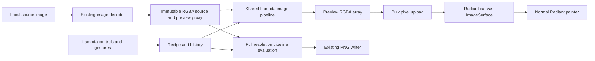

# Lambda Photo Editor Implementation Plan

**Status:** core demo implemented (2026-10-10); release performance targets remain unmeasured.

Implementation includes the retained RGBA canvas bridge, bounded binary decode
with all eight EXIF orientations, recipe/history modules, alpha-aware image
pipeline, native controls and crop gestures, PNG export, and recipe persistence.
The 60-event native replay passes 19 assertions; a 23-event replay covers crop
dragging/cancellation, keyboard comparison, and closing with a pending frame.
Registered script tests, authored button alignment, and forced-GC pixel/lifetime
coverage accompany the implementation. Broader baseline
results are recorded in `temp/photo/`; see [README](README.md) for current usage
and limits. The sections below preserve the original plan and acceptance targets.

Completed engine fixes include shape-preserving numeric unary operations,
`last` receiver context on the MIR defect-capable indexing path, reflected range
values, disabled-control focus cleanup, and preserving authored flex/grid button
alignment. The shared canvas owns its pixel copy (**D4.5.2**); allocation paths
use precise roots (**D5.3.3**). No vendor changes or formal-ruling changes are needed.

Verification on 2026-10-10:

- Build, Radiant dimension lint, and seven selected script tests pass. The
  script selection also passes with `LAMBDA_EXEC_BACKEND=jit`.
- The main editor replay passes in automatic and forced-JIT modes. The native
  RGBA fixture passes under forced collection, poisoned frees, and promotion,
  with zero tracked allocations after document teardown. The gesture, narrow
  drawer (640×720), and flex/grid glyph-position replays also pass.
- The full Lambda gate is not green: its first run lost a LaTeX batch worker
  to SIGKILL; the golden-runner retry passes 1,336/1,338 tests, leaving
  `latex_test_latex_phase3_corpus` (worker killed) and `edit_view_only` (golden
  mismatch). Full logs remain under `temp/photo/`.
- The Radiant layout baseline, page snapshots, vector, DOM integration, page
  loading, and all four photo tests pass. Its remaining failures are
  `doc_editor_indexed_math_arrows`, `dtna_segmented_modes`,
  `LoadsMathIntensiveLatexAsHeadlessView`, and
  `radiant_view_math_intensive_scroll`; the full gate is not green.
- The inspector becomes a toggleable drawer below 900 CSS pixels. Release
  latency/peak-memory measurements are still pending; synchronous float64
  processing remains a limit. Performance targets are not claimed complete.
- Native visual inspection covers the desktop editor and 640×720 drawer.
  The checkerboard's gradient tile size is currently ignored by Radiant;
  transparency remains correct, but this background-paint limitation is open.

**Date:** 2026-10-10
**Development directory:** `test/demo/photo/`

Build a native photo editing demo with Lambda handling the editor model,
controls, and image pipeline, and Radiant handling layout, input, and painting.
The first complete version should let a user open a photo, crop and adjust it,
apply a preset, undo edits, compare with the original, and export a real image.
Reuse Lambda's existing typed-array image operations. The first engine task is
a small, reusable bridge from pixel arrays to Radiant's retained canvas.

## 1. Reference and scope

The [IMG.LY Photo SDK page](https://img.ly/products/photo-sdk/) and its
[Photo Editor UI demo](https://img.ly/demos/photo-editor-ui/web/) establish the
reference workflow: an image workspace, crop and orientation tools, adjustment
controls, filter presets, and export. Its broader product also includes AI
features. Use these workflows as inspiration; build the demo with Lambda and
Radiant and use original UI assets and bundled sample photos.

### First complete demo

| Area | Required behavior |
| --- | --- |
| Open | Bundled sample gallery and an application dialog accepting a local JPEG/PNG path; replace the document only after successful decoding |
| Workspace | Fit to viewport, 100% view, zoom, pan, checkerboard transparency, image dimensions, and original comparison |
| Crop | Freeform, original ratio, 1:1, 4:3, 3:2, and 16:9; draggable edges/corners; Apply and Cancel |
| Orientation | Rotate by quarter turns, flip horizontally/vertically, and straighten within a bounded angle range |
| Adjust | Exposure, brightness, contrast, saturation, temperature, gamma, and reset per control/panel |
| Presets | Original, Mono, Warm, Cool, Vintage, and Vivid, with an intensity control and generated thumbnails |
| History | Undo/redo, one history entry per completed gesture, reset-all as an undoable action |
| Export | Full-resolution PNG, optional output dimensions with aspect lock, explicit destination, and success/error feedback |
| Save edits | Versioned JSON recipe and reload against the matching source image |

Opening and saving through an application path dialog makes the demo usable
without assuming that native operating-system file pickers already exist.
Native pickers and file dropping are a later integration task. JPEG encoding,
text/sticker layers, frames, vignette, blur, sharpening, histograms, and a split
comparison handle follow the first complete version. AI background removal,
retouching, RAW development, ICC/P3 color management, remote asset providers,
and mobile SDK parity are separate projects.

## 2. Existing implementation and required additions

The following inventory describes code inspected on 2026-10-10. Proposed APIs
below are implementation tasks, not claims about the current public surface.

| Capability | Existing source | Use and remaining work |
| --- | --- | --- |
| Reactive Lambda UI | [Reactive UI](../../../doc/Reactive_UI.md), [Tetris](../tetris/tetris.ls) | Use `view`, instance `state`, `on` handlers, and `import dom`; keep rendering pure |
| Shared controls | [DTNA facade](../../../lmd/package/ui/dtna.ls), [input controls](../../../lmd/package/ui/dtna/input.ls) | Reuse buttons, inputs, select/segmented controls, icons, and theme tokens; verify range input behavior before choosing it for sliders |
| Pixel arrays and image kernels | [lambda-vector.cpp](../../../lambda/runtime/lambda-vector.cpp), `fn_load`, `fn_crop`, `fn_resize`, `fn_rotate` | Reuse `(H,W,4)` ubyte RGBA, `as_float`, `as_ubyte`, `flip`, `rot90`, `crop`, `resize`, and `rotate` |
| Decode and PNG encode | [image.h](../../../lib/image.h), [image.c](../../../lib/image.c), `image_load`, `image_save_png` | Existing `load(path)` decodes RGBA; `save(pixels,path)` writes PNG. Add demo validation and error presentation |
| Retained canvas | [canvas_2d.cpp](../../../radiant/canvas_2d.cpp), `CanvasRegistry`, `CanvasEntry` | Reuse document-owned `ImageSurface` and painting; add bulk pixel upload reachable from Lambda |
| Canvas scripting | [dom_canvas.cpp](../../../lambda/dom/dom_canvas.cpp) | Current JS bindings include drawing primitives and `toDataURL`; they do not supply `drawImage`, `getImageData`, or `putImageData`. Browser Canvas code is not an available implementation shortcut |
| Frame scheduling | [DOOM demo](../doom/doom.ls), [controlled inputs](../../../lmd/package/ui/dtna/input.ls) | Reuse `dom.request_frame` / `dom.cancel_frame`; schedule preview work after control patches |
| Drag capture | [DOM catalog](../../../lambda/dom/dom_api.def), `capture_pointer` | Reuse `dom.capture_pointer` and the native `pointerdrag` / `pointerdragend` route; prove coordinates, cancellation, and keyboard alternatives |
| Automation | [test map](../../README.md), [Tetris replay](../tetris/tetris_smoke.json) | Use existing JSON event replays, script goldens, pixel checks, and native close/lifetime tests |

Important kernel details to preserve in the adapters:

- `crop(image, rows, columns)` accepts **inclusive ranges**, not width/height.
- `resize(image, new_height, new_width)` takes height before width.
- `rot90(image, 1)` turns counterclockwise and swaps dimensions.
- `rotate(image, degrees)` is counterclockwise, keeps the input dimensions,
  and fills uncovered pixels with zero. Straightening therefore exposes
  transparent corners until the user crops them away.
- `gamma` and `invert` operate on every channel; `grayscale` returns a 2-D
  result. Preserve alpha explicitly when using these operations in the editor.
- `as_float` currently produces float64 samples. Do not budget it as float32.

## 3. Architecture and ownership

Use native Lambda source modules for the demo. Keep any reusable host changes
in their owning engine modules. No new image value type or external editing
SDK is needed.



Follow the existing formal contracts:

- **S12.1.3:** “template body = pure `fn` transformation; mutation only in
  `on` handlers (`pn`).” UI rendering and recipe evaluation are pure;
  orchestration, canvas upload, and file writes belong in procedures.
- **S1.4 / D7.2.1:** mutable session state belongs to a template instance or
  procedure activation; module bindings remain immutable.
- **D4.5.1v4 / D4.5.2:** Radiant owns its surfaces under document lifetimes;
  “borrow to read, copy or root to keep.” Pixel upload copies into a native
  surface and never leaves a borrowed GC array pointer in the render tree.
- **D5.3.3:** native adapters use `RootFrame` / `Rooted` across allocations and
  callbacks. Precise rooting also covers pending preview/source values.
- **D7.1.1 / D7.1.2v2 / D7.5.3:** keep resource acquisition in the existing
  I/O layer and reach Radiant through the existing module/host seam. Do not
  add an upward Radiant dependency to `lambda-rt`.

These IDs refer to the [formal semantics](../../../doc/Lambda_Formal_Semantics.md)
and [formal design](../../../doc/Lambda_Formal_Design.md). This plan proposes
application behavior and reusable mechanisms; it does not revise language
semantics. Any later ruling change must update both the formal spec and its
working design record under [Doc Convention](../../../doc/Doc_Convention.md).

### Editor model

Separate three kinds of state:

| State | Contents | History and persistence |
| --- | --- | --- |
| Source | Source identity, path, decoded dimensions, immutable original pixels, preview proxy | One active source; pixels are not serialized or copied into history |
| Recipe | Quarter turns, flips, straighten angle, crop rectangle, adjustment values, preset ID/intensity, output size | Serializable; committed snapshots form undo/redo history |
| Session | Active tool, selection, zoom/pan, gesture draft, comparison state, frame token, revision counters, status/error | Transient; navigation and presentation changes do not create edits |

Keep the recipe independent of preview resolution and CSS layout. Store crop
edges normalized to the oriented, straightened image plane. A quarter turn or
flip resets crop to full bounds as part of the same undoable operation; the
UI should make this visible. Straightening updates the image under the crop
without changing the crop's coordinate plane dimensions.

Persist `schema_version`, source identity/fingerprint and dimensions, recipe,
and output options. On reload, verify source identity; if the file moved, ask
the user to locate it and validate it before accepting the recipe. A local
path alone is not a durable image identity.

### History and gesture transactions

Use a bounded list of small recipe snapshots with a cursor; start with a
configurable 100-entry limit. At gesture start, retain the committed recipe.
During drag/slider input, update a draft and request previews. At release,
commit one changed snapshot and clear the redo branch. Escape or cancellation
discards the draft. No-op edits create no history entry. Keyboard adjustment
groups must end on key release or focus change, with the same cancellation
rules. A failed source replacement preserves the current editor session.

## 4. Image processing and display

### One recipe evaluator

Both preview and export call the same operation definitions, in this order:

1. Source orientation: quarter turns, then horizontal/vertical flips.
2. Straighten around the image center, preserving the oriented canvas size.
3. Crop in that image plane.
4. Exposure, brightness, contrast, saturation, temperature, and gamma.
5. Preset color transform, blended by intensity.
6. Optional future spatial effects, followed by requested output resizing.
7. Clamp and quantize once at the final RGBA8 boundary.

Keep source pixels immutable and preserve alpha during RGB adjustments. Define
color transforms once in `mod_pipeline.ls` and test neutral values as identity.
For the initial demo, define these as bounded SDR operations over decoded
sRGB-like sample values; do not advertise a color-managed photographic
exposure pipeline. Exposure can use `2^stops`; gamma's UI mapping must account
for the existing kernel's exponent convention. Specify pivot, luma weights,
temperature mapping, and clamping in tests before adding controls.

For interpolating geometry, premultiply RGB by alpha, resample RGB and alpha
together, then unpremultiply with a defined zero-alpha result. Existing
channel-by-channel interpolation of straight RGBA can otherwise produce dark
or colored fringes. Quarter turns, flips, and integer crops need no such
conversion. Keep gamma's exponent positive and define its input-domain
handling explicitly, including negative intermediate RGB values.

Initially compose existing typed-array channel extraction, broadcasting,
arithmetic, and image kernels. A native fused RGB adjustment kernel is a
conditional optimization after release measurements identify a bottleneck;
it must share one parameterized implementation across presets and retain the
same reference results. Extend an existing helper when possible.

Generate preset thumbnails from the actual pipeline using a small proxy.
Presets are data records containing adjustment/color-transform parameters,
not separate image-processing implementations or replacement photographs.

### Preview scheduling

Start with a preview proxy capped at a 1280-pixel long edge, retaining the full
source for export. Convert normalized crop edges with one shared rule:
floor the left/top edges, ceil the right/bottom edges, clamp to image bounds,
and require at least one pixel on each axis. Adapt that half-open rectangle
to the kernel's inclusive row/column ranges. Scale spatial-effect radii from
source pixels to preview pixels when those effects are introduced.

Coalesce input events to at most one pending `dom.request_frame` callback.
Track source and recipe revisions; only publish a result matching the current
session. Begin with synchronous proxy evaluation on the page thread. Moving
work to a worker is justified only by measurements and must preserve the
existing task completion and document ownership contracts.

Keep the document shell stable and isolate changing control subtrees. After
the patch checkpoint, resolve the current canvas by ID and upload; do not
retain a node from a replaced subtree. The paint callback must not trigger
another recipe change. Prove this sequence in Phase 0 with the existing frame
scheduler before building the editor. Cancel scheduled work on close, and
discard stale results after a source change.

Zoom and pan change the display transform without recomputing adjustments.
At 100% or larger, a low-resolution proxy cannot claim to show source detail:
regenerate the necessary higher-resolution view or visibly identify preview
quality until it is available. Comparing original color uses the same
orientation/crop and display transform with color edits disabled.

### Bulk pixel upload

Proposed Lambda surface: `dom.set_canvas_pixels(canvas, rgba)` as a `pn`
operation returning success or an ordinary error. The spelling is proposed;
the required contract is:

- Accept a valid canvas and an `(H,W,4)` ubyte array. Validate shape, strides,
  dimensions, multiplication overflow, allocation budget, document liveness,
  and incompatible canvas context mode before mutation.
- Match intrinsic canvas dimensions to the supplied bitmap through the
  existing canvas resize/reset path; leave CSS sizing independent. Gather
  strided arrays through the existing array traversal machinery when needed.
- Copy into the document-owned `CanvasEntry` surface. Convert straight RGBA
  into the surface's declared channel/alpha convention exactly once; do not
  reinterpret bytes across incompatible representations.
- Publish through existing surface generation/invalidation machinery so
  retained display lists resolve the new bitmap safely. Stage validation and
  allocation before replacing the visible result.
- Keep the operation independent of photo recipes, filters, or demo paths.
  Add a DOM catalog entry and engine provider using the existing generated
  publication pattern, rather than a handwritten second dispatch table.

Likely touch points are `lambda/dom/dom_api.def`, its existing engine-provider
plumbing, `lambda/module/radiant/radiant_module.cpp`, and
`radiant/canvas_2d.cpp`. Reuse `CanvasRegistry`, `ImageSurface`, and the existing
painter; no separate photo renderer. Do not write PNG files or encode data
URIs on every drag event.

### Crop coordinates and export

Keep one transform from oriented image coordinates to viewport CSS pixels
and its inverse. Include fit scale, zoom, pan, and viewport offset. Pointer
handling uses the inverse; pixel extraction uses the crop adapter. Device
pixel ratio only affects display backing resolution, never recipe coordinates
or exported dimensions. Layout positions and dimensions in `radiant/` remain
`float` under the repository rules.

Export snapshots the committed source/recipe revision and evaluates against
the full source. The current zoom, checkerboard, crop guides, and controls do
not participate. Preserve alpha in PNG and report actual output dimensions.
Handle write failures without losing edits. Write to a sibling temporary
output and replace the destination only after successful encoding where the
existing I/O API supports that transaction; otherwise complete that I/O
mechanism before promising atomic export. Never overwrite the source image.

Later JPEG export must explicitly composite transparency over a chosen matte
and expose quality. Reuse an existing encoder through the correct I/O seam;
do not treat PNG-only `save()` as supporting JPEG based on the filename.

## 5. UI and interaction

Use a dark neutral workspace with a restrained accent color and original
icons from the existing UI package where available. The following dimensions
are starting design targets, not engine constants:

| Region | Layout and behavior |
| --- | --- |
| Top bar | About 56 CSS px; demo name, Open, source name/dirty state, undo/redo, reset, Export |
| Tool rail | About 64 CSS px; Crop, Adjust, Filters; icon plus label and selected/focus states |
| Tool panel | About 280 CSS px; crop ratios/actions, labeled sliders with numeric inputs, or preset grid |
| Workspace | Remaining space; centered photo, crop overlay, checkerboard, loading/error state |
| Bottom bar | Fit, 100%, zoom controls, dimensions, and press-and-hold Compare |

Start at 1440×900, then verify 1024×768. On narrower windows, collapse the
tool panel into an overlay/drawer while retaining usable workspace controls.
Reuse DTNA controls and tokens where their contracts fit; demo CSS owns the
workspace arrangement and theme overrides. There is no need to invent another
component framework.

Crop overlays use DOM/SVG geometry and explicit hit targets over the canvas.
Eight handles, movement within bounds, aspect locking, and a rule-of-thirds
guide share the same crop geometry functions. Use pointer capture so dragging
continues beyond the image. Release capture/gesture state on blur, close,
Escape, and cancellation. Provide numeric crop fields for precise keyboard use.

Support Cmd/Ctrl+Z, redo, Cmd/Ctrl+O, Cmd/Ctrl+S for recipe save, Enter to apply
crop, Escape to cancel, and Space-drag to pan when an editable text field does
not own input. Controls need labels, visible focus, disabled states, and
keyboard increments. Do not consume text-editing shortcuts in filename or
numeric inputs. Display errors next to the action that failed.

## 6. Planned directory structure

```text
test/demo/photo/
  Lambda_Impl_Photo_Editor.md  implementation plan
  README.md                  launch, controls, scope, and verification
  photo.ls                   document shell, views, and event orchestration
  photo.css                  workspace layout and theme
  mod_model.ls               recipe defaults, validation, history, transactions
  mod_geometry.ls            crop constraints and viewport transforms
  mod_pipeline.ls            shared preview/export evaluation
  mod_presets.ls             preset parameter records
  mod_io.ls                  open, recipe persistence, and export procedures
  assets/                    small licensed JPEG/PNG samples and UI assets
  ATTRIBUTION.md             source, license, and modifications for each asset
  tests/
    model_test.ls            paired with model_test.txt
    geometry_test.ls         paired with geometry_test.txt
    pipeline_test.ls         paired with pipeline_test.txt
    io_test.ls               paired with io_test.txt
    photo_smoke.json         open, tools, adjustments, history, export
    photo_crop.json          constrained gestures and cancellation
    photo_close.json         repeated edits/source changes and teardown
    fixtures/                tiny pixel patterns and malformed inputs
  reference/                 curated UI/pixel references and capture metadata
```

Keep generated exports, captures, actual results, and performance records in
repository `temp/photo/`. Every new test `.ls` needs its `.txt` golden; helper
modules use `mod_` names. Keep small deterministic fixtures in the demo and
avoid adding a dependency on a network image service.

## 7. Implementation phases and exit gates

Each phase should leave a runnable vertical slice. Core demo completion is
through Phase 5; Phase 6 is additional scope.

| Phase | Work | Exit gate |
| --- | --- | --- |
| 0 — Prove the engine seams | Add the bounded pixel upload; make a diagnostic Lambda page load a tiny RGBA fixture; test range input, pointer capture, frame-after-patch behavior, canvas sizing and close | Pixel colors/alpha match; slider input updates a surviving or re-resolved canvas; drag capture and teardown work without a file-backed preview |
| 1 — Model and image workspace | Add source/recipe/session model, sample gallery, local-path Open, dimension/memory preflight, EXIF orientation normalization, stable shell, fit/zoom/pan, preview scheduling, PNG export of the unedited source | Open → view → export preserves normalized source pixels; failed Open preserves the previous session; model and geometry goldens pass |
| 2 — Adjustments and history | Implement neutral-safe RGB adjustments, panel controls, draft/commit/cancel, undo/redo, reset, comparison, and real preset thumbnails | One gesture equals one history entry; neutral output is identical; alpha survives; presets and export use the same evaluator |
| 3 — Crop and orientation | Add quarter turns, flips, straighten, normalized crop, presets, handles, guides, numeric fields, and keyboard apply/cancel | Non-square fixtures prove dimensions, orientation, rounding, and exact crop pixels; viewport zoom/DPR does not change exported crop |
| 4 — Persistence and robust export | Add source identity checks, versioned JSON recipe save/load, output size controls, failure handling, and destination replacement rules | Recipe round trip reproduces output; stale/mismatched sources are rejected; preview resolution never limits export; failed writes retain edits |
| 5 — Demo acceptance | Finish styling, narrow-window behavior, keyboard/focus, licensed samples, replay registration, lifecycle stress, release measurements, and README | Full user journey passes; required engine gates pass; repeat open/edit/export/close has bounded memory and no stale callbacks |
| 6 — Extensions | JPEG output, blur/sharpen/vignette, histogram, split comparison, native picker/drop integration; then optional text/sticker/frame composition | Each visible tool changes real exported pixels, has undo coverage, and meets preview/export and lifetime tests |

The critical path is pixel upload and scheduling → editable image slice →
shared evaluator/history → crop mapping → persistence/export → acceptance.
Do not build a large tool palette before Phase 0 proves the host path.

For later text and sticker tools, store object geometry in output-image
coordinates and use the same composition for preview and export. Prove font,
SVG, and raster composition parity through existing Radiant paint facilities
before adding handles; DOM overlays alone are insufficient for exported art.

## 8. Verification and acceptance

### Deterministic correctness

- Tiny labeled RGB/RGBA fixtures: neutral edits, alpha preservation, transparent
  edge resampling without fringes, all eight EXIF orientations, four
  quarter turns, both flips, inclusive crop edges, non-square geometry,
  preset intensity endpoints, output dimensions, and quantization.
- Model tests: draft cancel, no-op commit, redo invalidation, bounded history,
  reset undo, source replacement, schema validation, and recipe round trips.
- Native surface tests: strided arrays, invalid shape/type, allocation failure,
  canvas replacement, resize, stale generations, and document close. Use
  forced collection to prove seam rooting under **D5.3.3**.
- Decode exported PNGs and compare pixels/dimensions with the pipeline result.
  For preview parity, compare the same evaluation size; a downsampled proxy
  is not expected to match every full-resolution edge after resampling.
- Independent expected pixel/math values must supplement round-trip tests,
  which alone can miss a shared mistake in preview and export.

### UI and lifetime coverage

Drive the actual buttons, fields, and native pointer events with JSON replays.
Check crop Apply/Cancel, numeric entry, pointer release outside the workspace,
focus traversal, original comparison release, undo/redo, source replacement,
export errors, and close while a preview callback is pending. Assert state and
decoded output, not only screenshot similarity.

Register the photo test directory with the existing Lambda golden harness and
add a targeted cross-tier test patterned on `DoomDemoTests` for interpreter,
automatic tiering, and MIR JIT. Register UI replay coverage with the existing
Radiant harness; JSON files under the demo directory are not automatically a
baseline gate. Keep shared surface/DOM regressions in their existing native
test suites instead of creating a parallel engine harness.

Capture native UI references at the two desktop target sizes and a narrow
window. If Chromium is used for CSS comparison, use the same demo fixture and
on macOS prefer Puppeteer's headless shell; the comparison is for UI geometry,
not evidence that a native Lambda canvas bridge works.

### Performance and resource targets

Treat these as initial acceptance targets to measure, not current capability:
on a recorded development machine, aim for a p95 adjustment-to-paint latency
below 50 ms at the 1280-pixel proxy size. Record source size, operation mix,
proxy size, device scale, build, and machine. Measure a 12-megapixel export
separately and report its actual time rather than promising a frame budget.

One 4000×3000 RGBA8 source is about 48 MB; a float64 RGBA working image is
about 384 MB. History must contain recipes, not those buffers. Avoid retaining
all intermediate arrays; bound proxy/thumbnail caches, reuse safe scratch
storage, and add tiled or scanline execution only if measured full-resolution
peak memory requires it. Define input/output dimension and memory budgets
before allocation, with a visible error on rejection. Existing `load()` fully
decodes its source; a proxy does not by itself bound that allocation. Audit
and complete header preflight through the existing I/O path in Phase 1.

Benchmark only release builds (`make release` in the main checkout, never in
a worktree). Read [Developer Guide §7](../../../doc/dev/Developer_Guide.md#7-worktrees-and-agent-gotchas)
before builds or tests. Run `make test-lambda-baseline` for runtime/package
changes and `make test-radiant-baseline` for DOM/Radiant changes; both are
required for this bridge. Use the additional source-area gates in
[test/README.md](../../README.md), and run
`make lint ARGS='--rule ^no-int-cast-radiant$'` for Radiant layout changes.
Edit build configuration in `build_lambda_config.json` and let `make`
regenerate build files. Keep all vendor code unchanged.

### Implemented usage

The following commands run the implemented demo and replay:

```sh
mkdir -p temp/photo
./lambda.exe view test/demo/photo/photo.ls
./lambda.exe test/demo/photo/tests/model_test.ls > temp/photo/model_test.actual.txt
diff -u test/demo/photo/tests/model_test.txt temp/photo/model_test.actual.txt
./lambda.exe view test/demo/photo/photo.ls --headless --no-log \
  --event-file test/demo/photo/tests/photo_smoke.json \
  --event-result temp/photo/photo_smoke_result.json
```

Completion means a user can edit and export their own local photo in the
native Radiant window, recover from errors, and repeat the workflow without
unbounded retained buffers. All visible core controls must affect the actual
recipe or image, and a saved recipe must reproduce the exported result.
