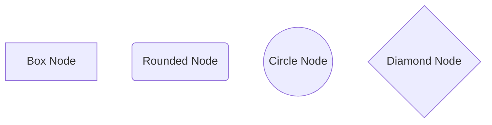
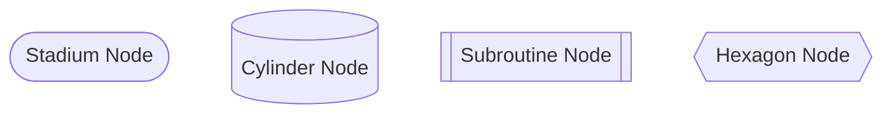
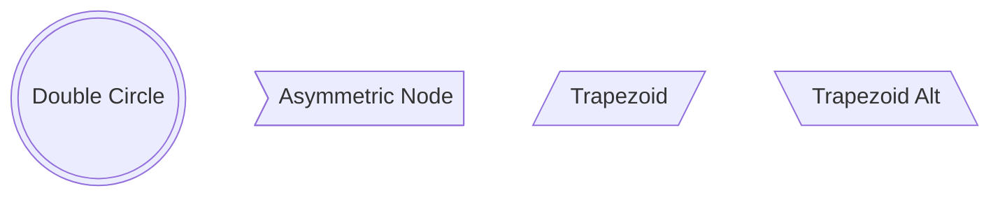
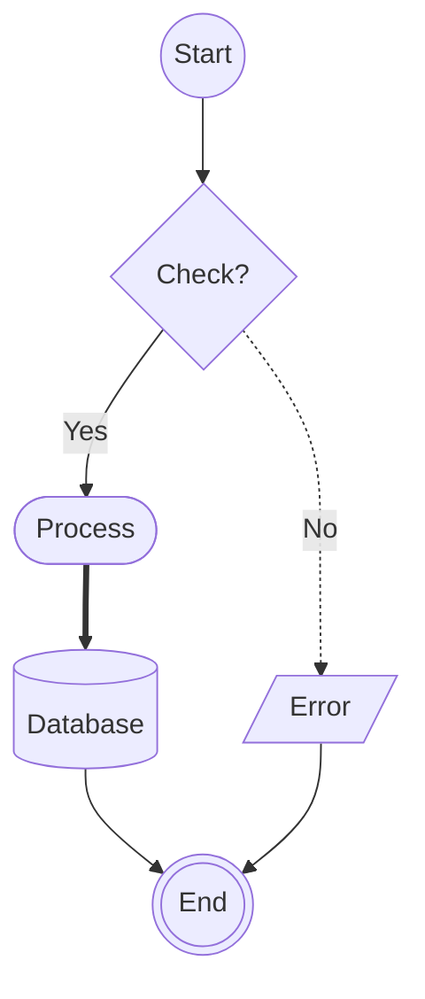

# Mermaid Shapes Test

Test file to verify all 12 mermaid shapes and edge styles.

## Basic Shapes

```mermaid
graph TD
    A[Box Node]
    B(Rounded Node)
    C((Circle Node))
    D{Diamond Node}
```

## Extended Shapes

```mermaid
graph TD
    E([Stadium Node])
    F[(Cylinder Node)]
    G[[Subroutine Node]]
    H{{Hexagon Node}}
```

## More Shapes

```mermaid
graph TD
    I(((Double Circle)))
    J>Asymmetric Node]
    K[/Trapezoid/]
    L[\Trapezoid Alt\]
```

## Edge Styles

```mermaid
graph LR
    A[Start] --> B[Solid Arrow]
    B -.-> C[Dotted Arrow]
    C ==> D[Thick Arrow]
    D --- E[No Arrow]
    E <--> F[Bidirectional]
```

## Complex Graph

```mermaid
graph TD
    Start((Start)) --> Check{Check?}
    Check -->|Yes| Process([Process])
    Check -.->|No| Error[/Error/]
    Process ==> DB[(Database)]
    DB --> End(((End)))
    Error --> End
```
