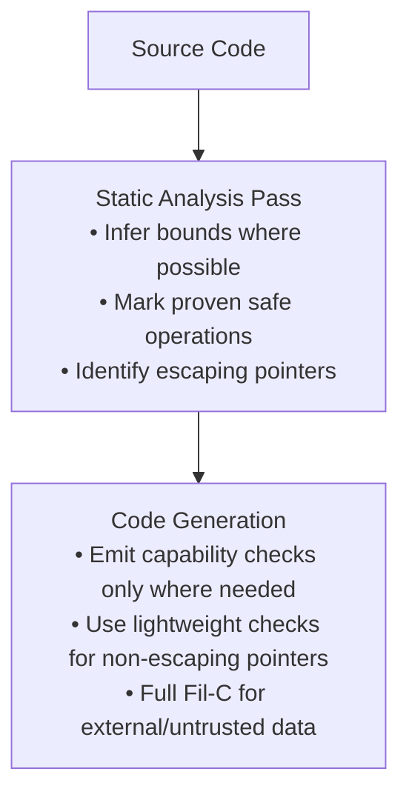
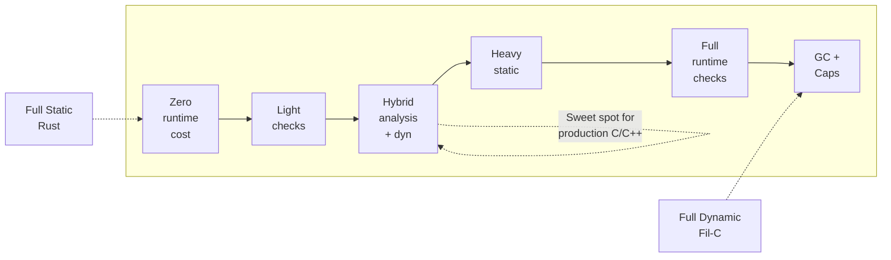

# Fil-C Analysis: Memory Safety Approaches

## Overview

Fil-C is a memory-safe implementation of C/C++ created by Filip Pizlo. It achieves memory safety through **Invisible Capabilities (InvisiCaps)** combined with **garbage collection**, catching all memory safety errors at runtime.

---

## 1. Fil-C vs. Rust

### Fundamental Approach

| Aspect | Rust | Fil-C |
|--------|------|-------|
| **When checked** | Compile time (borrow checker) | Runtime (dynamic checks) |
| **Escape hatch** | `unsafe` blocks | None - no unsafe keyword |
| **Performance** | Zero-cost abstractions | ~4x overhead |
| **Compatibility** | New language, new ecosystem | Compiles existing C/C++ code |
| **Learning curve** | Steep (ownership model) | Minimal (it's just C/C++) |

### Safety Guarantees

Both catch the same classes of memory bugs:
- Out-of-bounds access (heap and stack)
- Use-after-free
- Double free
- Type confusion between pointers and non-pointers
- Data races on pointers

### Key Differences

**Rust:**
- Prevents bugs at compile time via ownership/borrowing
- Zero runtime overhead for safety
- Requires rewriting code in a new language
- `unsafe` blocks allow bypassing safety (necessary for low-level code)

**Fil-C:**
- Catches bugs at runtime via capability checks
- ~4x performance overhead
- Works with existing C/C++ codebases
- No escape hatches - complete safety with no exceptions

### Why Fil-C Claims "Rust-like" Safety

1. **No escape hatches** - Unlike `unsafe` in Rust, Fil-C has no way to disable safety
2. **Complete coverage** - Catches the same bug classes Rust prevents at compile time
3. **Exploitation prevention** - Designed to prevent exploitation, not just find bugs
4. **Capability-based** - Similar to hardware approaches like CHERI, but runs on stock x86_64

### Trade-off Summary

```
Rust:   Pay at development time (learning curve, refactoring)
        Get free runtime performance

Fil-C:  Pay at runtime (4x overhead)
        Get instant compatibility with existing code
```

---

## 2. Fil-C vs. AddressSanitizer (ASan)

### Fundamental Approach

| Aspect | AddressSanitizer | Fil-C |
|--------|------------------|-------|
| **Detection method** | Tag-based (shadow memory) | Capability-based (per-pointer bounds) |
| **Goal** | Bug finding during development | Exploitation prevention in production |
| **Memory model** | Tags memory regions as valid/invalid | Each pointer knows exactly what it can access |

### Safety Guarantees

| Issue | ASan | Fil-C |
|-------|------|-------|
| **Out-of-bounds** | ✓ Detects most | ✓ Catches all |
| **Use-after-free** | ✓ Probabilistic (quarantine) | ✓ Deterministic (GC-backed) |
| **Type confusion** | ✗ Not detected | ✓ Detected |
| **Pointer races** | ✗ Not detected | ✓ Detected |
| **Bypass-resistant** | ✗ Can be bypassed by attackers | ✓ No known bypasses |

### Key Difference: Tag vs Capability

**ASan (Tag-based):**
- Marks memory regions as "poisoned" or "valid"
- A pointer access succeeds if it hits *any* valid memory
- Attacker can potentially find valid memory to exploit

**Fil-C (Capability-based):**
- Each pointer carries its own bounds metadata
- A pointer can *only* access the specific object it was derived from
- Even if memory is valid, wrong pointer = trap

### Example: Why ASan Can Be Bypassed

```c
char buf[16];
char secret[16] = "password";
buf[20] = 'X';  // ASan catches this (out of bounds)

// But an attacker who controls the offset might:
buf[offset] = 'X';  // If offset lands on ANY valid memory, no detection
```

ASan only checks if the *destination* is valid memory. Fil-C checks if the pointer `buf` has permission to access that specific offset—it doesn't, so it always traps.

### Practical Differences

| Aspect | ASan | Fil-C |
|--------|------|-------|
| **Performance overhead** | ~2x slowdown | ~4x slowdown |
| **Memory overhead** | ~2-3x | Higher (GC + aux allocations) |
| **Compatibility** | Excellent | Very good (most code works) |
| **Use case** | Testing/CI | Production hardening |
| **Recompile needed** | Yes | Yes (full ecosystem) |
| **False negatives** | Possible (small overflows) | None by design |

### Summary

- **ASan** = Great for finding bugs during development (fast, easy)
- **Fil-C** = Designed for security-critical production use (complete safety, higher cost)

Fil-C is essentially "what if we made ASan impossible to bypass, at the cost of more overhead and requiring GC?"

---

## 3. Hybrid Safety System Design

A hybrid approach combining **Fil-C's runtime safety** with **compile-time optimization** can reduce overhead while maintaining complete safety.

### Strategy 1: Static Analysis to Eliminate Checks

The compiler can prove certain accesses are always safe and skip runtime checks:

```c
void safe_example(int* arr, int len) {
    for (int i = 0; i < len; i++) {
        arr[i] = 0;  // Compiler can prove i is in [0, len)
    }
}
```

**Techniques:**
- **Range analysis** - Track variable bounds through control flow
- **Loop invariant analysis** - Hoist bounds checks out of loops
- **Escape analysis** - Local pointers that never escape don't need full capability tracking

### Strategy 2: Type System Extensions (Rust-like)

Add optional annotations that enable compile-time proofs:

```c
// Hypothetical syntax
void process(__bounded(len) int* arr, size_t len) {
    // Compiler knows arr has exactly len elements
    // No runtime check needed for arr[0..len]
}

void safe_ref(__nonnull int* p) {
    // Compiler knows p is never NULL
    // Skip NULL check
}
```

### Strategy 3: Profile-Guided Optimization

1. Run with full Fil-C checks, collect statistics
2. Identify "hot" checks that never fail
3. Recompile with those checks weakened or removed in release builds

```
Development:  Full Fil-C (find all bugs)
Profiling:    Record which checks fire
Production:   Remove proven-safe checks (keep safety, reduce overhead)
```

### Strategy 4: Tiered Safety Model

Different safety levels for different code:

| Tier | Checks | Use Case |
|------|--------|----------|
| **Full** | All runtime checks | Untrusted input handling |
| **Optimized** | Statically-proven safe removed | Hot inner loops |
| **Trusted** | Minimal checks | Verified core libraries |

```c
__attribute__((fil_optimized))
void matrix_multiply(float* A, float* B, float* C, int n) {
    // Compiler does aggressive static analysis here
}
```

### Strategy 5: Dependent Types / Refinement Types

More expressive type system that carries proofs:

```c
// Refinement type: array with known length
typedef int array_n[n];  // Length is part of the type

void sum(int n, array_n arr) {
    // All accesses provably safe - no runtime checks
}
```

Languages like **Liquid Haskell**, **F***, and **ATS** do this.

### Strategy 6: Hardware-Assisted Hybrid

Combine software capabilities with hardware features:

| Layer | Mechanism |
|-------|-----------|
| **Compile-time** | Static bounds inference |
| **Cheap runtime** | Intel MPX / ARM MTE for spatial safety |
| **Full runtime** | Fil-C capabilities only where needed |

### Implementation Architecture



### Related Research

| Project | Approach |
|---------|----------|
| **CCured** (Berkeley) | Mixed safe/unsafe pointers with static inference |
| **Cyclone** | Region-based memory with static proofs |
| **Checked C** (Microsoft) | Gradual checked pointers for C |
| **SAFECode** (UIUC) | Pool-based memory with static analysis |
| **SoftBound + CETS** | Fil-C's inspiration, with some static optimization |

### The Trade-off Spectrum



### Expected Outcome

A well-designed hybrid system could achieve:
- **Fil-C-level safety** (complete, no escape hatches)
- **~2x overhead** instead of 4x (by eliminating 50%+ of checks through static analysis)
- **Gradual adoption** (annotate hot paths first, expand over time)

---

## References

- [Fil-C Official Website](https://fil-c.org/)
- [Fil-C GitHub Repository](https://github.com/pizlonator/fil-c)
- [InvisiCaps: The Fil-C Capability Model](https://fil-c.org/invisicaps.html)
- [Fil's Unbelievable Garbage Collector](https://fil-c.org/fugc.html)
- [AddressSanitizer](https://github.com/google/sanitizers/wiki/AddressSanitizer)
- [CHERI](https://www.cl.cam.ac.uk/research/security/ctsrd/cheri/)
- [SoftBound Paper](https://dl.acm.org/doi/10.1145/1543135.1542504)
