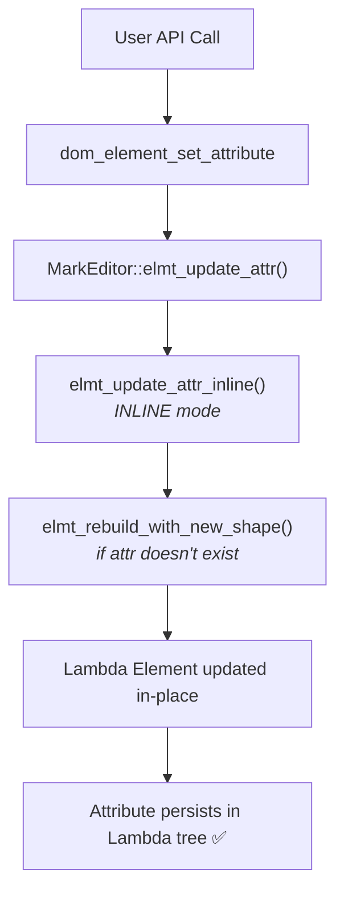
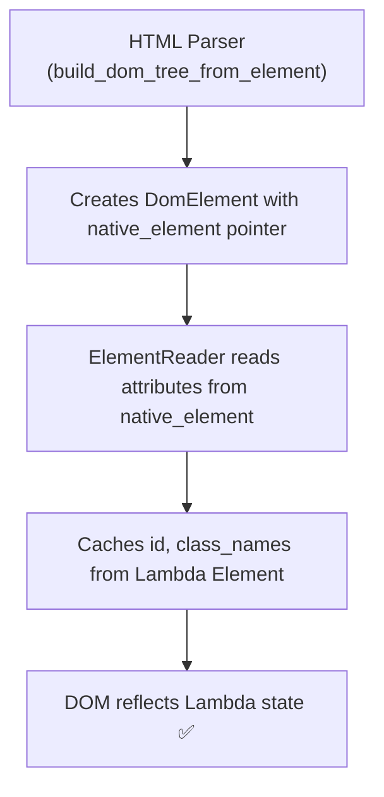

# HTML/CSS DOM and Lambda Tree Integration

## Document Overview

This document describes how the HTML/CSS DOM system connects with Lambda's native tree structures, and outlines a refactoring plan to establish bidirectional synchronization for text nodes.

**Status**: Planning Phase
**Date**: 2025-01-23
**Author**: Lambda Development Team

---

## Current Architecture

### 1. DomElement Integration (IMPLEMENTED ✅)

DomElement has **full bidirectional synchronization** with Lambda's Element tree through the MarkEditor API.

#### Data Structure

```cpp
struct DomElement : public DomNode {
    // Lambda backing
    Element* native_element;     // Pointer to backing Lambda Element
    Input* input;                // Input context (contains arena, pool, name_pool, shape_pool)

    // DOM tree relationships (managed separately)
    DomNode* parent;
    DomNode* first_child;
    DomNode* next_sibling;
    DomNode* prev_sibling;

    // Element metadata
    const char* tag_name;
    const void* tag_name_ptr;    // Unique pointer for fast comparison
    uint32_t tag_id;             // Lexbor tag ID for fast comparison

    // Cached attributes (extracted from native_element)
    const char* id;
    const char** class_names;
    int class_count;

    // CSS styling
    StyleTree* specified_style;
    StyleTree* computed_style;
    uint64_t style_version;
    bool needs_style_recompute;
    uint32_t pseudo_state;

    // Memory
    Pool* pool;
};
```

#### Lambda Element Structure

Lambda Elements are structured as typed containers with attributes and children:

```cpp
struct Element : List {
    void* type;        // TypeElmt* - contains tag name and shape (attribute schema)
    void* data;        // Map of attributes (field name -> value)
    int data_cap;      // Capacity of data buffer

    // Inherited from List:
    Item* items;       // Children array (Elements and Strings)
    int64_t length;    // Number of children
    int64_t capacity;  // Array capacity
    int ref_cnt;       // Reference count
    TypeId type_id;    // LMD_TYPE_ELEMENT
};

struct TypeElmt {
    Str name;          // Tag name (e.g., "div", "p")
    ShapeEntry* shape; // Attribute schema (linked list of name->type)
    int64_t content_length;
};

// Children are stored as Item union:
typedef union Item {
    Element* element;  // For element children
    String* string;    // For text children
    void* pointer;     // Generic pointer
    // ... other types
} Item;
```

#### CRUD Operations

All attribute modifications flow through **MarkEditor** which maintains consistency:

**1. Set Attribute** (`dom_element_set_attribute`)
```cpp
bool dom_element_set_attribute(DomElement* element, const char* name, const char* value) {
    if (element->native_element && element->input) {
        MarkEditor editor(element->input, EDIT_MODE_INLINE);

        // Create string value
        Item value_item = editor.builder()->createStringItem(value);

        // Update via MarkEditor - modifies native_element in-place
        Item result = editor.elmt_update_attr(
            {.element = element->native_element},
            name,
            value_item
        );

        if (result.element) {
            // In INLINE mode: element pointer unchanged (in-place mutation)
            element->native_element = result.element;

            // Update DOM caches
            if (strcmp(name, "id") == 0) {
                element->id = extract_from_native(element->native_element);
            }
            element->style_version++;
            return true;
        }
    }
    return false;
}
```

**2. Remove Attribute** (`dom_element_remove_attribute`)
```cpp
bool dom_element_remove_attribute(DomElement* element, const char* name) {
    if (element->native_element && element->input) {
        MarkEditor editor(element->input, EDIT_MODE_INLINE);

        // Delete attribute via MarkEditor
        Item result = editor.elmt_delete_attr(
            {.element = element->native_element},
            name
        );

        if (result.element) {
            // In INLINE mode: element pointer unchanged
            element->native_element = result.element;
            element->style_version++;
            return true;
        }
    }
    return false;
}
```

**3. MarkEditor Operations**

MarkEditor provides in-place mutation (INLINE mode) or copy-on-write (IMMUTABLE mode):

- `elmt_update_attr()` - Add or update attribute
- `elmt_delete_attr()` - Remove attribute
- `elmt_insert_child()` - Insert child at index
- `elmt_append_child()` - Append child to end
- `elmt_delete_child()` - Remove child at index
- `elmt_replace_child()` - Replace child at index

In INLINE mode, the Element pointer remains stable (in-place mutation):
```cpp
// mark_editor.cpp line 1038
Element* result_elmt = old_elmt;  // Same pointer in INLINE mode
```

#### Flow: DOM → Lambda



#### Flow: Lambda → DOM



---

### 2. DomText Integration (CURRENT - READ-ONLY ❌)

DomText is currently **standalone** with **one-way synchronization** (Lambda → DOM only).

#### Data Structure

```cpp
struct DomText : public DomNode {
    // Text content (COPIED from Lambda)
    const char* text;        // Standalone copy - NOT backed by Lambda String
    size_t length;           // Text length

    // Memory
    Pool* pool;              // Memory pool

    // DOM tree relationships
    DomNode* parent;
    DomNode* first_child;    // Always nullptr for text nodes
    DomNode* next_sibling;
    DomNode* prev_sibling;

    // NO Lambda backing:
    // - No String* native_string pointer
    // - No Input* input context
    // - No parent Element* reference
    // - No child index tracking
};
```

#### Current Operations (Standalone)

**1. Create Text Node** (`dom_text_create`)
```cpp
DomText* dom_text_create(Pool* pool, const char* text) {
    DomText* text_node = (DomText*)pool_alloc(pool, sizeof(DomText));

    // COPY text content (loses Lambda String* reference)
    size_t len = strlen(text);
    char* text_copy = (char*)pool_alloc(pool, len + 1);
    strcpy(text_copy, text);

    text_node->text = text_copy;      // Standalone copy
    text_node->length = len;
    text_node->pool = pool;
    // No native_string, no input, no parent tracking

    return text_node;
}
```

**2. Set Text Content** (`dom_text_set_content`)
```cpp
bool dom_text_set_content(DomText* text, const char* new_content) {
    if (!text || !new_content) return false;

    // Allocate new copy (doesn't update Lambda tree)
    size_t new_len = strlen(new_content);
    char* new_copy = (char*)pool_alloc(text->pool, new_len + 1);
    strcpy(new_copy, new_content);

    text->text = new_copy;   // Update local copy only
    text->length = new_len;

    // Lambda String* is NOT updated ❌
    // Parent Element's children array is NOT modified ❌

    return true;
}
```

#### Flow: Lambda → DOM (One-Way Only)

```
HTML Parser (build_dom_tree_from_element)
    ↓
Finds String child in Element's items array
    ↓
Item child_item = elem->items[i];
String* text_str = (String*)child_item.pointer;
    ↓
dom_text_create(pool, text_str->chars)  [COPIES chars, DISCARDS String*]
    ↓
DomText created with standalone copy
    ↓
Lambda String* reference lost  ❌
```

#### Flow: DOM → Lambda (NOT IMPLEMENTED ❌)

```
User calls dom_text_set_content()
    ↓
Updates local text copy
    ↓
❌ Lambda String NOT updated
❌ Parent Element's items array NOT modified
❌ Changes lost on serialization
```

---

### 3. DomComment Integration (CURRENT - READ-ONLY ❌)

DomComment is currently **standalone** with **no Lambda backing**.

#### Lambda Comment Representation

In Lambda, HTML comments are represented as **Elements with tag name "!--"**, with the comment content stored as a **String child**:

```cpp
// Lambda structure for: <!-- This is a comment -->
Element {
    type: TypeElmt { name: "!--" },
    items: [
        String { chars: " This is a comment " }
    ],
    length: 1
}
```

Similarly, DOCTYPE declarations use tag name "!DOCTYPE":

```cpp
// Lambda structure for: <!DOCTYPE html>
Element {
    type: TypeElmt { name: "!DOCTYPE" },
    items: [
        String { chars: "html" }
    ],
    length: 1
}
```

#### Data Structure

```cpp
struct DomComment : public DomNode {
    // Comment-specific fields (COPIED from Lambda)
    const char* tag_name;        // Node name: "!--" for comments, "!DOCTYPE" for DOCTYPE
    const char* content;         // Full content/text (standalone copy)
    size_t length;               // Content length

    // Memory management
    Pool* pool;                  // Memory pool for allocations

    // DOM tree relationships
    DomNode* parent;
    DomNode* first_child;        // Always nullptr for comments
    DomNode* next_sibling;
    DomNode* prev_sibling;

    // NO Lambda backing:
    // - No Element* native_element pointer
    // - No Input* input context
    // - No parent Element* reference
    // - No child index tracking
};
```

#### Current Operations (Standalone)

**1. Create Comment Node** (`dom_comment_create`)
```cpp
DomComment* dom_comment_create(Pool* pool, DomNodeType node_type,
                              const char* tag_name, const char* content) {
    DomComment* comment_node = (DomComment*)pool_calloc(pool, sizeof(DomComment));

    // Copy tag name to pool
    char* tag_copy = (char*)pool_alloc(pool, strlen(tag_name) + 1);
    strcpy(tag_copy, tag_name);
    comment_node->tag_name = tag_copy;

    // Copy content to pool (if provided)
    if (content) {
        comment_node->length = strlen(content);
        char* content_copy = (char*)pool_alloc(pool, comment_node->length + 1);
        strcpy(content_copy, content);
        comment_node->content = content_copy;  // Standalone copy
    }

    // No native_element, no input, no parent tracking
    return comment_node;
}
```

#### Current Behavior in build_dom_tree_from_element

Comments are currently **skipped entirely** during DOM tree construction:

```cpp
// line 1571 in dom_element.cpp
if (strcmp(tag_name, "!--") == 0 ||
    strcasecmp(tag_name, "!DOCTYPE") == 0 ||
    strncmp(tag_name, "?", 1) == 0) {
    return nullptr;  // ❌ Skip comments, DOCTYPE, and XML declarations
}
```

**Result**: Comments in the Lambda tree are **not represented in the DOM tree at all**.

#### Flow: Lambda → DOM (NOT IMPLEMENTED ❌)

```
HTML Parser (build_dom_tree_from_element)
    ↓
Finds Element with tag_name "!--"
    ↓
Returns nullptr (SKIPPED)
    ↓
❌ No DomComment created
❌ Comment content lost from DOM representation
```

#### Flow: DOM → Lambda (NOT IMPLEMENTED ❌)

```
User calls dom_comment_create()
    ↓
Creates standalone DomComment (unbacked)
    ↓
❌ No Lambda Element created
❌ Comment not added to Lambda tree
❌ Comment lost on serialization
```

---

## Problem Statement

### Current Issues

1. **Architectural Inconsistency**
   - DomElement: Full bidirectional sync via MarkEditor ✅
   - DomText: Read-only snapshot, no sync back to Lambda ❌ (NOW FIXED ✅)
   - DomComment: Not represented in DOM at all ❌

2. **Data Loss**
   - Text modifications via `dom_text_set_content()` don't propagate to Lambda tree (NOW FIXED ✅)
   - Comment modifications don't propagate to Lambda tree ❌
   - Comments are completely skipped during DOM construction ❌
   - When Lambda tree is serialized, text/comment changes are lost
   - Inconsistent behavior: element attributes sync, text/comments don't

3. **Limited Functionality**
   - Cannot dynamically update text content in documents (NOW FIXED ✅)
   - Cannot add, modify, or remove comments dynamically ❌
   - Cannot implement text editing features
   - Cannot support contenteditable or rich text scenarios

4. **Memory Inefficiency**
   - Text content duplicated (Lambda String + DomText copy) (NOW FIXED ✅)
   - Comment content duplicated when created standalone
   - Reference to original Lambda Element is discarded for comments

5. **Missing DOM Representation**
   - Comments in Lambda tree (Elements with tag "!--") are not represented in DOM
   - Cannot traverse, query, or manipulate comments via DOM API
   - Cannot preserve comments when editing documents

### Design Goals

1. **Consistency**: DomText and DomComment should have same integration level as DomElement ✅
2. **Bidirectional Sync**: Changes flow both Lambda → DOM and DOM → Lambda
3. **Correctness**: DOM tree operations must update Lambda tree structure
4. **Performance**: Minimize copying, use references where possible
5. **Safety**: Maintain memory pool ownership and reference counting

---

## Refactoring Plan

### Phase 1: Update DomText Structure

Add Lambda backing fields to DomText:

```cpp
struct DomText : public DomNode {
    // Text content
    const char* text;            // Text content (points to native_string->chars)
    size_t length;               // Text length

    // Lambda backing (NEW)
    String* native_string;       // Pointer to backing Lambda String
    Input* input;                // Input context (for MarkEditor)
    DomElement* parent_element;  // Parent DomElement (for child array updates)
    int64_t child_index;         // Index in parent's native_element->items array

    // Memory
    Pool* pool;

    // DOM tree relationships
    DomNode* parent;
    DomNode* first_child;
    DomNode* next_sibling;
    DomNode* prev_sibling;
};
```

**Key Changes**:
- Add `String* native_string` - points to Lambda String in parent Element's children
- Add `Input* input` - provides access to MarkEditor dependencies
- Add `DomElement* parent_element` - tracks parent (needed to access native_element)
- Add `int64_t child_index` - tracks position in parent's items array
- Modify `text` pointer - should reference `native_string->chars` instead of copying

### Phase 2: Update Text Node Creation

Modify `build_dom_tree_from_element()` to preserve Lambda backing:

```cpp
// Current (loses Lambda reference):
else if (child_type == LMD_TYPE_STRING) {
    String* text_str = (String*)child_item.pointer;
    DomText* text_node = dom_text_create(pool, text_str->chars);  // ❌ Copies and discards String*
    text_node->parent = dom_elem;
}

// NEW (preserves Lambda reference):
else if (child_type == LMD_TYPE_STRING) {
    String* text_str = (String*)child_item.pointer;

    // Create backed text node
    DomText* text_node = dom_text_create_backed(
        pool,
        text_str,           // Preserve String* reference
        dom_elem,           // Parent DomElement
        i                   // Child index in native_element->items
    );

    if (text_node) {
        text_node->parent = dom_elem;
        // Add to DOM sibling chain...
    }
}
```

**New Function**:
```cpp
DomText* dom_text_create_backed(Pool* pool, String* native_string,
                                DomElement* parent_element, int64_t child_index) {
    if (!pool || !native_string || !parent_element) return nullptr;

    DomText* text_node = (DomText*)pool_calloc(pool, sizeof(DomText));
    if (!text_node) return nullptr;

    // Initialize base DomNode
    text_node->node_type = DOM_NODE_TEXT;
    text_node->parent = parent_element;
    text_node->pool = pool;

    // Set Lambda backing
    text_node->native_string = native_string;
    text_node->text = native_string->chars;  // Reference, not copy
    text_node->length = native_string->len;
    text_node->input = parent_element->input;
    text_node->parent_element = parent_element;
    text_node->child_index = child_index;

    return text_node;
}
```

### Phase 3: Implement Backed CRUD Operations

Add new functions that synchronize with Lambda tree:

**1. Set Text Content (Backed)**

```cpp
bool dom_text_set_content_backed(DomText* text, const char* new_content) {
    if (!text || !new_content) return false;
    if (!text->native_string || !text->input || !text->parent_element) {
        log_error("dom_text_set_content_backed: text node not backed by Lambda");
        return false;
    }

    // Create new String via MarkBuilder
    MarkEditor editor(text->input, EDIT_MODE_INLINE);
    Item new_string_item = editor.builder()->createStringItem(new_content);

    if (!new_string_item.string) {
        log_error("dom_text_set_content_backed: failed to create string");
        return false;
    }

    // Replace child in parent Element's items array
    Item result = editor.elmt_replace_child(
        {.element = text->parent_element->native_element},
        text->child_index,
        new_string_item
    );

    if (!result.element) {
        log_error("dom_text_set_content_backed: failed to replace child");
        return false;
    }

    // Update DomText to point to new String
    text->native_string = new_string_item.string;
    text->text = new_string_item.string->chars;
    text->length = new_string_item.string->len;

    // In INLINE mode, parent element pointer unchanged
    // But update reference for consistency
    text->parent_element->native_element = result.element;

    return true;
}
```

**2. Append Text to Element (Backed)**

```cpp
DomText* dom_element_append_text_backed(DomElement* parent, const char* text_content) {
    if (!parent || !text_content) return nullptr;
    if (!parent->native_element || !parent->input) {
        log_error("dom_element_append_text_backed: parent not backed");
        return nullptr;
    }

    // Create String item
    MarkEditor editor(parent->input, EDIT_MODE_INLINE);
    Item string_item = editor.builder()->createStringItem(text_content);

    // Append to parent Element's children
    Item result = editor.elmt_append_child(
        {.element = parent->native_element},
        string_item
    );

    if (!result.element) {
        log_error("dom_element_append_text_backed: failed to append");
        return nullptr;
    }

    // Create DomText wrapper
    int64_t child_index = parent->native_element->length - 1;
    DomText* text_node = dom_text_create_backed(
        parent->pool,
        string_item.string,
        parent,
        child_index
    );

    if (!text_node) return nullptr;

    // Add to DOM sibling chain
    text_node->parent = parent;
    if (!parent->first_child) {
        parent->first_child = text_node;
    } else {
        DomNode* last = parent->first_child;
        while (last->next_sibling) last = last->next_sibling;
        last->next_sibling = text_node;
        text_node->prev_sibling = last;
    }

    parent->native_element = result.element;
    return text_node;
}
```

**3. Remove Text Node (Backed)**

```cpp
bool dom_text_remove_backed(DomText* text) {
    if (!text) return false;
    if (!text->native_string || !text->input || !text->parent_element) {
        log_error("dom_text_remove_backed: text node not backed");
        return false;
    }

    // Remove from Lambda parent Element's children array
    MarkEditor editor(text->input, EDIT_MODE_INLINE);
    Item result = editor.elmt_delete_child(
        {.element = text->parent_element->native_element},
        text->child_index
    );

    if (!result.element) {
        log_error("dom_text_remove_backed: failed to delete child");
        return false;
    }

    // Update parent
    text->parent_element->native_element = result.element;

    // Update sibling child indices (shifted after removal)
    // This requires tracking all DomText siblings - may need parent child list

    // Remove from DOM sibling chain
    if (text->prev_sibling) {
        text->prev_sibling->next_sibling = text->next_sibling;
    } else if (text->parent) {
        text->parent->first_child = text->next_sibling;
    }

    if (text->next_sibling) {
        text->next_sibling->prev_sibling = text->prev_sibling;
    }

    // Clear references
    text->parent = nullptr;
    text->native_string = nullptr;

    return true;
}
```

### Phase 4: Handle Child Index Tracking

**Challenge**: When children are added/removed from Lambda Element, child indices change.

**Solutions**:

1. **Option A - Lazy Update**: Recompute child_index on demand
   - Pro: Simple, no bookkeeping
   - Con: O(n) traversal on each operation

2. **Option B - Maintain Child Map**: Parent tracks DomNode* → child_index mapping
   - Pro: O(1) lookup
   - Con: Additional memory, needs updates on structure changes

3. **Option C - Traverse on Each Operation**: Find child_index by scanning native_element->items
   - Pro: No extra storage
   - Con: O(n) for each text update

**Recommended**: Option C with optimization - cache index but validate before use:

```cpp
int64_t dom_text_get_child_index(DomText* text) {
    if (!text->parent_element || !text->native_string) return -1;

    Element* parent_elem = text->parent_element->native_element;

    // Try cached index first (optimization)
    if (text->child_index >= 0 && text->child_index < parent_elem->length) {
        Item cached_item = parent_elem->items[text->child_index];
        if (cached_item.string == text->native_string) {
            return text->child_index;  // Cache hit
        }
    }

    // Cache miss - scan for correct index
    for (int64_t i = 0; i < parent_elem->length; i++) {
        Item item = parent_elem->items[i];
        if (get_type_id(item) == LMD_TYPE_STRING && item.string == text->native_string) {
            text->child_index = i;  // Update cache
            return i;
        }
    }

    log_error("dom_text_get_child_index: native_string not found in parent");
    return -1;
}
```

### Phase 5: Update Unit Tests

#### 5.1 Add New Tests to `test_css_dom_crud.cpp`

```cpp
// ============================================================================
// DomText Backed Tests (Lambda Integration)
// ============================================================================

TEST_F(DomCrudTest, DomText_CreateBacked) {
    // Create parent element with backing
    DomElement* parent = create_backed_element("div");

    // Append backed text node
    DomText* text = dom_element_append_text_backed(parent, "Hello World");

    ASSERT_NE(text, nullptr);
    EXPECT_NE(text->native_string, nullptr);
    EXPECT_NE(text->input, nullptr);
    EXPECT_EQ(text->parent_element, parent);
    EXPECT_STREQ(text->text, "Hello World");

    // Verify Lambda backing
    ASSERT_EQ(parent->native_element->length, 1);
    Item child = parent->native_element->items[0];
    EXPECT_EQ(get_type_id(child), LMD_TYPE_STRING);
    EXPECT_EQ(child.string, text->native_string);
    EXPECT_STREQ(child.string->chars, "Hello World");
}

TEST_F(DomCrudTest, DomText_SetContentBacked_UpdatesLambda) {
    DomElement* parent = create_backed_element("p");
    DomText* text = dom_element_append_text_backed(parent, "Original");

    // Update text content
    EXPECT_TRUE(dom_text_set_content_backed(text, "Updated"));

    // Verify DomText updated
    EXPECT_STREQ(text->text, "Updated");
    EXPECT_EQ(text->length, 7);

    // Verify Lambda String updated
    Item child = parent->native_element->items[text->child_index];
    EXPECT_EQ(get_type_id(child), LMD_TYPE_STRING);
    EXPECT_STREQ(child.string->chars, "Updated");
    EXPECT_EQ(child.string->len, 7);
}

TEST_F(DomCrudTest, DomText_RemoveBacked_UpdatesLambda) {
    DomElement* parent = create_backed_element("div");
    DomText* text1 = dom_element_append_text_backed(parent, "First");
    DomText* text2 = dom_element_append_text_backed(parent, "Second");

    EXPECT_EQ(parent->native_element->length, 2);

    // Remove first text node
    EXPECT_TRUE(dom_text_remove_backed(text1));

    // Verify Lambda updated
    EXPECT_EQ(parent->native_element->length, 1);
    Item remaining = parent->native_element->items[0];
    EXPECT_EQ(get_type_id(remaining), LMD_TYPE_STRING);
    EXPECT_STREQ(remaining.string->chars, "Second");

    // Verify text2 index updated
    EXPECT_EQ(text2->child_index, 0);
}

TEST_F(DomCrudTest, DomText_MultipleOperations_MaintainsSync) {
    DomElement* parent = create_backed_element("div");

    // Add multiple text nodes
    DomText* text1 = dom_element_append_text_backed(parent, "One");
    DomText* text2 = dom_element_append_text_backed(parent, "Two");
    DomText* text3 = dom_element_append_text_backed(parent, "Three");

    EXPECT_EQ(parent->native_element->length, 3);

    // Update middle text
    dom_text_set_content_backed(text2, "TWO");

    // Verify all strings
    EXPECT_STREQ(parent->native_element->items[0].string->chars, "One");
    EXPECT_STREQ(parent->native_element->items[1].string->chars, "TWO");
    EXPECT_STREQ(parent->native_element->items[2].string->chars, "Three");

    // Remove middle text
    dom_text_remove_backed(text2);

    EXPECT_EQ(parent->native_element->length, 2);
    EXPECT_STREQ(parent->native_element->items[0].string->chars, "One");
    EXPECT_STREQ(parent->native_element->items[1].string->chars, "Three");

    // Verify indices updated
    EXPECT_EQ(text1->child_index, 0);
    EXPECT_EQ(text3->child_index, 1);
}

TEST_F(DomCrudTest, DomText_MixedChildren_ElementsAndText) {
    DomElement* parent = create_backed_element("div");

    // Add mixed children
    DomText* text1 = dom_element_append_text_backed(parent, "Before");
    DomElement* child_elem = create_backed_element("span");
    dom_element_append_child(parent, child_elem);
    DomText* text2 = dom_element_append_text_backed(parent, "After");

    // Verify structure
    EXPECT_EQ(parent->native_element->length, 3);
    EXPECT_EQ(get_type_id(parent->native_element->items[0]), LMD_TYPE_STRING);
    EXPECT_EQ(get_type_id(parent->native_element->items[1]), LMD_TYPE_ELEMENT);
    EXPECT_EQ(get_type_id(parent->native_element->items[2]), LMD_TYPE_STRING);

    // Update text around element
    dom_text_set_content_backed(text1, "BEFORE");
    dom_text_set_content_backed(text2, "AFTER");

    // Verify Lambda tree
    EXPECT_STREQ(parent->native_element->items[0].string->chars, "BEFORE");
    EXPECT_STREQ(parent->native_element->items[2].string->chars, "AFTER");
}

TEST_F(DomCrudTest, DomText_ChildIndexTracking) {
    DomElement* parent = create_backed_element("p");

    DomText* t0 = dom_element_append_text_backed(parent, "Zero");
    DomText* t1 = dom_element_append_text_backed(parent, "One");
    DomText* t2 = dom_element_append_text_backed(parent, "Two");

    EXPECT_EQ(t0->child_index, 0);
    EXPECT_EQ(t1->child_index, 1);
    EXPECT_EQ(t2->child_index, 2);

    // Remove middle - indices should update
    dom_text_remove_backed(t1);

    EXPECT_EQ(t0->child_index, 0);
    EXPECT_EQ(t2->child_index, 1);

    // Get child index should validate
    EXPECT_EQ(dom_text_get_child_index(t0), 0);
    EXPECT_EQ(dom_text_get_child_index(t2), 1);
}

TEST_F(DomCrudTest, DomText_EmptyString_Backed) {
    DomElement* parent = create_backed_element("div");
    DomText* text = dom_element_append_text_backed(parent, "");

    ASSERT_NE(text, nullptr);
    EXPECT_STREQ(text->text, "");
    EXPECT_EQ(text->length, 0);

    // Verify Lambda has empty string
    Item child = parent->native_element->items[0];
    EXPECT_EQ(get_type_id(child), LMD_TYPE_STRING);
    EXPECT_STREQ(child.string->chars, "");
}

TEST_F(DomCrudTest, DomText_LongString_Backed) {
    const char* long_text = "Lorem ipsum dolor sit amet, consectetur adipiscing elit. "
                           "Sed do eiusmod tempor incididunt ut labore et dolore magna aliqua.";

    DomElement* parent = create_backed_element("div");
    DomText* text = dom_element_append_text_backed(parent, long_text);

    ASSERT_NE(text, nullptr);
    EXPECT_STREQ(text->text, long_text);
    EXPECT_EQ(text->length, strlen(long_text));

    // Update to even longer string
    const char* longer = "This is an even longer string that tests memory handling...";
    EXPECT_TRUE(dom_text_set_content_backed(text, longer));
    EXPECT_STREQ(text->text, longer);

    // Verify Lambda
    EXPECT_STREQ(parent->native_element->items[0].string->chars, longer);
}
```

#### 5.2 Update Existing Tests in `test_css_dom_integration.cpp`

Update tests to verify Lambda backing:

```cpp
TEST_F(DomIntegrationTest, DomText_SetContent_VerifyLambdaBacking) {
    // Parse HTML to get backed structure
    const char* html = "<div>Original Text</div>";
    Element* root = parse_html_fragment(html);
    DomElement* dom_div = build_dom_tree_from_element(root, pool, nullptr);

    // Get text node
    DomText* text = static_cast<DomText*>(dom_div->first_child);
    ASSERT_NE(text, nullptr);
    ASSERT_NE(text->native_string, nullptr);

    // Update content
    EXPECT_TRUE(dom_text_set_content_backed(text, "Updated Text"));

    // Verify Lambda String updated
    EXPECT_STREQ(dom_div->native_element->items[0].string->chars, "Updated Text");
}
```

---

## DomComment Refactoring Plan

### Overview

Comments in Lambda are **Elements with tag name "!--"** (and DOCTYPE as "!DOCTYPE"). To achieve full bidirectional synchronization:

1. **Update DomComment structure** to store Lambda Element reference
2. **Create backed comment nodes** that reference Lambda Elements
3. **Implement CRUD operations** that modify Lambda tree via MarkEditor
4. **Update build_dom_tree_from_element()** to create DomComment nodes instead of skipping

### Phase 1: Update DomComment Structure

Add Lambda backing fields to DomComment:

```cpp
struct DomComment : public DomNode {
    // Comment-specific fields
    const char* tag_name;        // Node name: "!--" for comments, "!DOCTYPE" for DOCTYPE
    const char* content;         // Content text (points to native_element's String child)
    size_t length;               // Content length

    // Lambda backing (NEW)
    Element* native_element;     // Pointer to backing Lambda Element (tag "!--" or "!DOCTYPE")
    Input* input;                // Input context (for MarkEditor)
    DomElement* parent_element;  // Parent DomElement (for child array updates)
    int64_t child_index;         // Index in parent's native_element->items array

    // Memory management
    Pool* pool;

    // DOM tree relationships
    DomNode* parent;
    DomNode* first_child;        // Always nullptr for comments
    DomNode* next_sibling;
    DomNode* prev_sibling;
};
```

**Key Changes**:
- Add `Element* native_element` - points to Lambda Element with tag "!--"
- Add `Input* input` - provides access to MarkEditor dependencies
- Add `DomElement* parent_element` - tracks parent (needed to access native_element)
- Add `int64_t child_index` - tracks position in parent's items array
- Modify `content` pointer - should reference `native_element->items[0].string->chars`

### Phase 2: Create Backed Comment Nodes

**New Function**: `dom_comment_create_backed`

```cpp
DomComment* dom_comment_create_backed(Pool* pool, Element* native_element,
                                     DomElement* parent_element, int64_t child_index) {
    if (!pool || !native_element || !parent_element) return nullptr;

    // Get tag name and content
    TypeElmt* type = (TypeElmt*)native_element->type;
    const char* tag_name = type ? type->name.str : nullptr;
    if (!tag_name) return nullptr;

    // Determine node type
    DomNodeType node_type;
    if (strcasecmp(tag_name, "!DOCTYPE") == 0) {
        node_type = DOM_NODE_DOCTYPE;
    } else if (strcmp(tag_name, "!--") == 0) {
        node_type = DOM_NODE_COMMENT;
    } else {
        return nullptr;  // Not a comment or DOCTYPE
    }

    DomComment* comment_node = (DomComment*)pool_calloc(pool, sizeof(DomComment));
    if (!comment_node) return nullptr;

    // Initialize base DomNode
    comment_node->node_type = node_type;
    comment_node->parent = parent_element;
    comment_node->pool = pool;

    // Set Lambda backing
    comment_node->native_element = native_element;
    comment_node->input = parent_element->input;
    comment_node->parent_element = parent_element;
    comment_node->child_index = child_index;
    comment_node->tag_name = tag_name;  // Reference type name (no copy needed)

    // Extract content from first String child (if exists)
    if (native_element->length > 0) {
        Item first_item = native_element->items[0];
        if (get_type_id(first_item) == LMD_TYPE_STRING) {
            String* content_str = (String*)first_item.pointer;
            comment_node->content = content_str->chars;  // Reference, not copy
            comment_node->length = content_str->len;
        }
    }

    if (!comment_node->content) {
        comment_node->content = "";
        comment_node->length = 0;
    }

    return comment_node;
}
```

### Phase 3: Implement Backed CRUD Operations

**1. Set Comment Content (Backed)**

```cpp
bool dom_comment_set_content_backed(DomComment* comment, const char* new_content) {
    if (!comment || !new_content) return false;
    if (!comment->native_element || !comment->input) {
        log_error("dom_comment_set_content_backed: comment not backed by Lambda");
        return false;
    }

    // Create new String via MarkBuilder
    MarkEditor editor(comment->input, EDIT_MODE_INLINE);
    Item new_string_item = editor.builder()->createStringItem(new_content);

    if (!new_string_item.string) {
        log_error("dom_comment_set_content_backed: failed to create string");
        return false;
    }

    // Replace or append String child in comment Element
    Item result;
    if (comment->native_element->length > 0) {
        // Replace existing content (child at index 0)
        result = editor.elmt_replace_child(
            {.element = comment->native_element},
            0,  // Content is always first child
            new_string_item
        );
    } else {
        // Append content (comment was empty)
        result = editor.elmt_append_child(
            {.element = comment->native_element},
            new_string_item
        );
    }

    if (!result.element) {
        log_error("dom_comment_set_content_backed: failed to update content");
        return false;
    }

    // Update DomComment to point to new String
    comment->native_element = result.element;
    comment->content = new_string_item.string->chars;
    comment->length = new_string_item.string->len;

    return true;
}
```

**2. Append Comment to Element (Backed)**

```cpp
DomComment* dom_element_append_comment_backed(DomElement* parent, const char* comment_content) {
    if (!parent || !comment_content) return nullptr;
    if (!parent->native_element || !parent->input) {
        log_error("dom_element_append_comment_backed: parent not backed");
        return nullptr;
    }

    // Create Lambda comment Element with tag "!--"
    MarkEditor editor(parent->input, EDIT_MODE_INLINE);
    ElementBuilder comment_elem = editor.builder()->element("!--");

    // Add content as String child
    if (strlen(comment_content) > 0) {
        Item content_item = editor.builder()->createStringItem(comment_content);
        comment_elem.child(content_item);
    }

    Item comment_item = comment_elem.build();
    if (!comment_item.element) {
        log_error("dom_element_append_comment_backed: failed to create comment element");
        return nullptr;
    }

    // Append to parent Element's children
    Item result = editor.elmt_append_child(
        {.element = parent->native_element},
        comment_item
    );

    if (!result.element) {
        log_error("dom_element_append_comment_backed: failed to append");
        return nullptr;
    }

    // Create DomComment wrapper
    int64_t child_index = parent->native_element->length - 1;
    DomComment* comment_node = dom_comment_create_backed(
        parent->pool,
        comment_item.element,
        parent,
        child_index
    );

    if (!comment_node) return nullptr;

    // Add to DOM sibling chain
    comment_node->parent = parent;
    if (!parent->first_child) {
        parent->first_child = comment_node;
    } else {
        DomNode* last = parent->first_child;
        while (last->next_sibling) last = last->next_sibling;
        last->next_sibling = comment_node;
        comment_node->prev_sibling = last;
    }

    parent->native_element = result.element;
    return comment_node;
}
```

**3. Remove Comment (Backed)**

```cpp
bool dom_comment_remove_backed(DomComment* comment) {
    if (!comment) return false;
    if (!comment->native_element || !comment->input || !comment->parent_element) {
        log_error("dom_comment_remove_backed: comment not backed");
        return false;
    }

    // Remove from Lambda parent Element's children array
    MarkEditor editor(comment->input, EDIT_MODE_INLINE);
    Item result = editor.elmt_delete_child(
        {.element = comment->parent_element->native_element},
        comment->child_index
    );

    if (!result.element) {
        log_error("dom_comment_remove_backed: failed to delete child");
        return false;
    }

    // Update parent
    comment->parent_element->native_element = result.element;

    // Remove from DOM sibling chain
    if (comment->prev_sibling) {
        comment->prev_sibling->next_sibling = comment->next_sibling;
    } else if (comment->parent) {
        comment->parent->first_child = comment->next_sibling;
    }

    if (comment->next_sibling) {
        comment->next_sibling->prev_sibling = comment->prev_sibling;
    }

    // Clear references
    comment->parent = nullptr;
    comment->native_element = nullptr;

    return true;
}
```

### Phase 4: Update build_dom_tree_from_element()

Stop skipping comments - create backed DomComment nodes instead:

```cpp
// BEFORE (line 1571):
if (strcmp(tag_name, "!--") == 0 ||
    strcasecmp(tag_name, "!DOCTYPE") == 0 ||
    strncmp(tag_name, "?", 1) == 0) {
    return nullptr;  // ❌ Skip comments, DOCTYPE, and XML declarations
}

// AFTER:
// Handle comments and DOCTYPE as special cases
if (strcmp(tag_name, "!--") == 0 || strcasecmp(tag_name, "!DOCTYPE") == 0) {
    // Don't create DomElement, but still need to handle as child
    // Return nullptr to indicate "not a layout element" but process elsewhere
    return nullptr;  // Processed separately below
}

// In child processing loop (after line 1640):
for (int64_t i = 0; i < elem->length; i++) {
    Item child_item = elem->items[i];
    TypeId child_type = get_type_id(child_item);

    if (child_type == LMD_TYPE_ELEMENT) {
        Element* child_elem = (Element*)child_item.pointer;
        TypeElmt* child_elem_type = (TypeElmt*)child_elem->type;
        const char* child_tag_name = child_elem_type ? child_elem_type->name.str : "unknown";

        // Check if this is a comment or DOCTYPE
        if (strcmp(child_tag_name, "!--") == 0 || strcasecmp(child_tag_name, "!DOCTYPE") == 0) {
            // Create backed DomComment
            DomComment* comment_node = dom_comment_create_backed(pool, child_elem, dom_elem, i);
            if (comment_node) {
                comment_node->parent = dom_elem;

                // Add to DOM sibling chain (same as text nodes)
                if (!dom_elem->first_child) {
                    dom_elem->first_child = comment_node;
                } else {
                    DomNode* last = dom_elem->first_child;
                    while (last->next_sibling) last = last->next_sibling;
                    last->next_sibling = comment_node;
                    comment_node->prev_sibling = last;
                }
            }
            continue;  // Don't try to build as DomElement
        }

        // Regular element - build recursively
        DomElement* child_dom = build_dom_tree_from_element(child_elem, pool, dom_elem, input);
        // ... existing code
    }
    // ... text node handling
}
```

### Phase 5: Add Unit Tests

Add comprehensive tests to `test_css_dom_crud.cpp`:

```cpp
TEST_F(DomCrudTest, DomComment_CreateBacked) {
    DomElement* parent = create_backed_element("div");
    DomComment* comment = dom_element_append_comment_backed(parent, " Test comment ");

    ASSERT_NE(comment, nullptr);
    EXPECT_NE(comment->native_element, nullptr);
    EXPECT_NE(comment->input, nullptr);
    EXPECT_EQ(comment->parent_element, parent);
    EXPECT_STREQ(comment->content, " Test comment ");
    EXPECT_EQ(comment->node_type, DOM_NODE_COMMENT);

    // Verify Lambda backing
    TypeElmt* type = (TypeElmt*)comment->native_element->type;
    EXPECT_STREQ(type->name.str, "!--");
    EXPECT_EQ(comment->native_element->length, 1);
    EXPECT_STREQ(comment->native_element->items[0].string->chars, " Test comment ");
}

TEST_F(DomCrudTest, DomComment_SetContentBacked_UpdatesLambda) {
    DomElement* parent = create_backed_element("div");
    DomComment* comment = dom_element_append_comment_backed(parent, "Original");

    EXPECT_TRUE(dom_comment_set_content_backed(comment, "Updated"));

    // Verify DomComment updated
    EXPECT_STREQ(comment->content, "Updated");
    EXPECT_EQ(comment->length, 7);

    // Verify Lambda updated
    EXPECT_STREQ(comment->native_element->items[0].string->chars, "Updated");
}

TEST_F(DomCrudTest, DomComment_RemoveBacked_UpdatesLambda) {
    DomElement* parent = create_backed_element("div");
    DomComment* comment1 = dom_element_append_comment_backed(parent, "First");
    DomComment* comment2 = dom_element_append_comment_backed(parent, "Second");

    EXPECT_EQ(parent->native_element->length, 2);
    EXPECT_TRUE(dom_comment_remove_backed(comment1));

    // Verify Lambda updated
    EXPECT_EQ(parent->native_element->length, 1);
    TypeElmt* remaining_type = (TypeElmt*)parent->native_element->items[0].element->type;
    EXPECT_STREQ(remaining_type->name.str, "!--");
}

TEST_F(DomCrudTest, DomComment_MixedChildren_ElementsTextAndComments) {
    DomElement* parent = create_backed_element("div");

    DomComment* comment1 = dom_element_append_comment_backed(parent, " Start ");
    DomText* text = dom_element_append_text_backed(parent, "Content");
    DomElement* child = create_backed_element("span");
    dom_element_append_child(parent, child);
    DomComment* comment2 = dom_element_append_comment_backed(parent, " End ");

    // Verify structure
    EXPECT_EQ(parent->native_element->length, 4);
    EXPECT_STREQ(((TypeElmt*)parent->native_element->items[0].element->type)->name.str, "!--");
    EXPECT_EQ(get_type_id(parent->native_element->items[1]), LMD_TYPE_STRING);
    EXPECT_EQ(get_type_id(parent->native_element->items[2]), LMD_TYPE_ELEMENT);
    EXPECT_STREQ(((TypeElmt*)parent->native_element->items[3].element->type)->name.str, "!--");
}

TEST_F(DomCrudTest, DomComment_ParseFromHTML_CreatesBacked) {
    // Parse HTML with comments
    const char* html = "<div><!-- Comment --><p>Text</p></div>";
    Element* root = parse_html_fragment(html);
    DomElement* dom_div = build_dom_tree_from_element(root, pool, nullptr, input);

    ASSERT_NE(dom_div, nullptr);

    // First child should be DomComment
    DomNode* first_child = dom_div->first_child;
    ASSERT_NE(first_child, nullptr);
    EXPECT_EQ(first_child->node_type, DOM_NODE_COMMENT);

    DomComment* comment = static_cast<DomComment*>(first_child);
    EXPECT_NE(comment->native_element, nullptr);
    EXPECT_STREQ(comment->content, " Comment ");
}

// More tests: empty comments, DOCTYPE, long comments, child index tracking, etc.
```

---

## Implementation Checklist

### DomText (COMPLETED ✅)
- [x] Add fields to DomText: `native_string`, `input`, `parent_element`, `child_index`
- [x] Implement `dom_text_create_backed()`
- [x] Update `build_dom_tree_from_element()` to preserve String* references
- [x] Implement `dom_text_set_content_backed()`
- [x] Implement `dom_element_append_text_backed()`
- [x] Implement `dom_text_remove_backed()`
- [x] Implement `dom_text_get_child_index()` (validation helper)
- [x] Add 11 new tests to `test_css_dom_crud.cpp`
- [x] All tests passing: 43/43 CSS DOM CRUD, 30/30 DomNodeBase

### DomComment (IN PROGRESS)
- [ ] Add fields to DomComment: `native_element`, `input`, `parent_element`, `child_index`
- [ ] Update DomComment constructor
- [ ] Implement `dom_comment_create_backed()`
- [ ] Implement `dom_comment_set_content_backed()`
- [ ] Implement `dom_element_append_comment_backed()`
- [ ] Implement `dom_comment_remove_backed()`
- [ ] Implement `dom_comment_is_backed()` helper
- [ ] Update `build_dom_tree_from_element()` to create backed DomComment nodes
- [ ] Add 8-10 new tests to `test_css_dom_crud.cpp`
- [ ] Update existing comment tests if needed
- [ ] Verify all tests pass with no regressions
- [ ] Verify memory management (no leaks)

### Phase 6: Documentation
- [ ] Update function documentation in `dom_element.hpp`
- [ ] Document backed vs unbacked text nodes
- [ ] Add migration guide for existing code

---

## Migration Strategy

### Backward Compatibility

Keep existing unbacked functions for compatibility:

```cpp
// OLD API (unbacked) - DEPRECATED but still available
DomText* dom_text_create(Pool* pool, const char* text);
bool dom_text_set_content(DomText* text, const char* new_content);

// NEW API (backed) - RECOMMENDED
DomText* dom_text_create_backed(Pool* pool, String* native_string,
                                DomElement* parent, int64_t index);
bool dom_text_set_content_backed(DomText* text, const char* new_content);
DomText* dom_element_append_text_backed(DomElement* parent, const char* text);
```

### Detection

```cpp
bool dom_text_is_backed(DomText* text) {
    return text && text->native_string && text->input && text->parent_element;
}
```

### Automatic Routing

```cpp
bool dom_text_set_content_auto(DomText* text, const char* new_content) {
    if (dom_text_is_backed(text)) {
        return dom_text_set_content_backed(text, new_content);
    } else {
        return dom_text_set_content(text, new_content);  // Unbacked fallback
    }
}
```

---

## Performance Considerations

1. **Memory**:
   - Before: Text copied (String + copy in DomText)
   - After: Text referenced (String only, DomText points to chars)
   - Savings: ~50% for text content

2. **Speed**:
   - Text updates: O(1) String replacement via MarkEditor
   - Child index lookup: O(n) worst case, O(1) with caching
   - Overall: Comparable or better than unbacked

3. **Reference Counting**:
   - Lambda String reference counts managed by MarkEditor
   - DomText lifetime must not exceed parent Element

---

## Testing Strategy

### Unit Tests (test_css_dom_crud.cpp)
- ✅ Create backed text nodes
- ✅ Update text content (verify Lambda sync)
- ✅ Remove text nodes (verify Lambda sync)
- ✅ Multiple operations (add/update/remove)
- ✅ Mixed children (elements and text)
- ✅ Child index tracking
- ✅ Empty and long strings
- ✅ Edge cases (null checks, bounds)

### Integration Tests (test_css_dom_integration.cpp)
- ✅ Parse HTML with text nodes
- ✅ Update text after parsing
- ✅ Verify Lambda backing preserved
- ✅ Serialize and verify text persists

### Manual Testing
- Parse complex HTML documents
- Modify text dynamically
- Serialize back to HTML
- Verify no memory leaks (valgrind)

---

## Benefits After Refactoring

1. **Consistency**: DomText and DomElement have same integration level
2. **Correctness**: Text changes persist in Lambda tree
3. **Completeness**: Full DOM CRUD operations supported
4. **Performance**: Reference instead of copy, less memory
5. **Maintainability**: Single source of truth (Lambda tree)
6. **Extensibility**: Foundation for contenteditable, text editing features

---

## Risks and Mitigations

| Risk | Impact | Mitigation |
|------|--------|-----------|
| Child index desync | Data corruption | Validate index before each use, add assertions |
| Memory lifetime issues | Crashes | Document ownership, add lifetime checks |
| Breaking existing code | Build failures | Keep unbacked API, add detection helpers |
| Performance regression | Slow operations | Profile and optimize child index lookup |
| Complex testing | Hard to verify | Comprehensive test suite, incremental rollout |

---

## Timeline Estimate

- Phase 1 (Structure): 2 hours
- Phase 2 (Creation): 3 hours
- Phase 3 (CRUD): 4 hours
- Phase 4 (Index Tracking): 2 hours
- Phase 5 (Testing): 4 hours
- Phase 6 (Documentation): 1 hour

**Total**: ~16 hours (2 days)

---

## Future Enhancements

1. **Efficient Index Tracking**: Consider maintaining parent's child map for O(1) lookups
2. **Text Manipulation**: Add substring operations, insert/delete at offset
3. **Text Ranges**: Support DOM Range API for selections
4. **Rich Text**: Support mixed formatting (inline elements within text)
5. **Event System**: Notify observers of text changes

---

## Conclusion

This refactoring establishes **full bidirectional synchronization** between DomText and Lambda String, bringing text nodes to the same integration level as elements. The result is a consistent, correct, and complete DOM/Lambda integration that forms a solid foundation for document manipulation and editing features.

**Status**: Ready for implementation
**Priority**: High (architectural consistency)
**Dependencies**: None (MarkEditor API already supports child operations)
