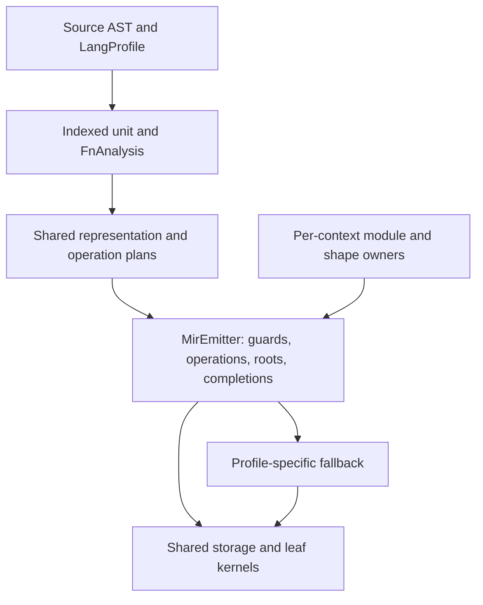

# Lambda Design: Shared Optimization Structures for Lambda and LambdaJS

> **Status: PROPOSAL — 2026-09-10.** Requested follow-up to
> [Lambda_Design_Structs_JS.md](Lambda_Design_Structs_JS.md), focused on
> simplification that lets both languages share implementation and tuning.
> Source inspection is against `57addc5cf`; the performance evidence is the
> recorded Result38–41 series. The subsequent implementation request starts
> with JSCU37's ordinary slot initialization; progress and fresh experiments
> are recorded in [the implementation record](impl/Lambda_Impl_JS2_Performance.md).
> Tasks 1 and 2 subsequently implement shared candidate traversal, field guards
> and native indexing; see [guarded-access progress](impl/Lambda_Impl_JS2_Guarded_Access.md)
> against `a436d168f`. The wider shared operation/construction interfaces,
> effect-based hoisting and additional lane coverage remain proposals.
>
> **Relationship to earlier work.** JSCU9–JSCU35 established or proposed shared
> ownership for roots, capsules, activations, environments, resources and
> callable metadata. This proposal extends that series with **JSCU36–JSCU43**.
> Definition-level callable sharing remains **JSCU33(A)** and is continued here
> under its existing identity. Open work in the predecessor remains open unless
> explicitly described as verified in the source inventory below.
>
> **Formal authority.** **D1.3**, **D1.5**, **D1.8–D1.9**, **D2.4.1–D2.4.3**,
> **D3.3.2v2–D3.3.4**, **D3.4.1–D3.4.6**, **D4.6.1v2**, **D5.1–D5.4**,
> **D6.2.1–D6.2.3v2**, **D8.2.3–D8.2.6**, **D8.3.1–D8.3.4**,
> **D8.4.1v2–D8.4.3v2**, and **D8.6.1–D8.6.4v2**. These proposals implement
> existing contracts; they do not revise a language ruling, authorize a new
> value layout, or change a formal-spec ratchet. Proposed interfaces are logical
> contracts, not declarations of APIs already present in the tree.
>
> **Scope.** Shared compiler/runtime structures in `lambda/runtime` and
> `lambda/core`, with Lambda and JS lowering as their two clients. JS-specific
> semantic adapters remain in `lambda/js`. Existing `lib` storage and algorithms
> are reused. Runtime progress is tracked separately from this design;
> vendor modifications and benchmark-port repairs remain outside its scope.

## 1. Intended outcome

An improvement to shape propagation, field storage, dense indexing, call return
transport or root liveness should have one implementation that benefits both
Lambda and LambdaJS. Each language should supply only the semantic decisions
that differ: admission, coercion, property behavior, invocation behavior and
failure handling.

The desired ownership chain is:

The profile is selected during compilation. Its callbacks choose semantics and
emit guards; this diagram does not introduce a virtual profile call on every
generated load or addition. Open operations retain runtime semantic dispatch.

The structural target is **one authority per fact and one implementation per
physical operation**. Merely moving fields into a shared header is insufficient
if two frontends still recompute the same call shape or emit different ownership
protocols. Conversely, two language-specific fallback functions are appropriate
when their observable behavior differs (**D1.3**, **D2.4.1**, **D8.2.6**).

## 2. Evidence and limits

The detailed numerical audit is
[Result41 JS analysis](impl/Lambda_Benchmark_Result41_JS_Analysis.md).

* Result39 and Result40 contain no JS benchmark measurements. Their Test262
  gates establish baseline correctness, not JS execution speed.
* Relative to Result38, Result41 reduces JS execution time by 34.8%
  geometrically across 63 unchanged benchmark JS programs. JS/QuickJS improves
  from 4.35× to 2.83×; JS/Node improves from 31.50× to 20.45×.
* The improvement is uneven: `primes` improves 27.5×, while `binarytrees` and
  `gcbench` become 4.75× and 4.61× slower. The null-initialization path in §5 is
  a source-level lead for those regressions, not a measured causal attribution.
* R7RS JS takes 26.39× untyped Lambda time geometrically in Result41. Individual
  gaps include `fib` 30.9×, `sum` 21.7× and `fft` 79.7×. Type annotations alone
  do not explain these gaps; the Lambda sources already omit them.
* The raw 63-row JS/Lambda ratio is contaminated: Lambda's `microdiff` sums
  precomputed change metadata and its `hyphen` uses a different algorithm.
  Neither is admissible as a cross-language speedup target. JS/JS comparisons
  remain useful because each JS engine executes the same source.
* Result41 also contains large Lambda regressions and two later refreshed
  Lambda rows. A shrinking JS/Lambda ratio is not, by itself, evidence of a JS
  improvement. Record absolute times and the binary/source revision per cell.

The benchmark evidence determines priority, not semantics. No phase may replace
a workload, precompute its answer, or weaken a conformance test to reach a timing
target. The initial implementation experiment must use release builds and
separate compilation/startup from execution.

## 3. Starting point: existing authorities and remaining duplication

This is a source inventory, not a new struct-size census. Historical sizes in
the predecessor are not presented as current measurements.

| Concept | Existing authority | Remaining work relevant here |
|---|---|---|
| Source identity | Shared AST index and dense binding/function IDs | Access planning should consume these facts rather than create private binding walks |
| Function facts and variants | `FnAnalysis`, `FnVariantAnalysis`, `FnReturnAnalysis` | JS eligibility and return facts still have overlapping consumers and adapters |
| Emitted value | `MirValue`, including contract, representation and ownership | Preserve the full result across JS native calls rather than collapsing it to a register |
| Physical frame and call emission | `MirEmitter`, `MirFunctionPlan`, `MirCallResult` | Finish convergence of JS native completion and direct-entry obligations |
| Field storage | `ShapeEntry::storage` / `LaneStorageDesc`, shared resolvers | Construction and fast access still select equivalent physical work separately |
| Candidate shapes | Lambda propagation and JS literal-site prediction | Lambda handles parameter/return edges; JS mainly recognizes its own literal declarator |
| Numeric indexing | Lambda native lowering; JS numeric-key runtime entries | Share proven index/lane operations instead of ending at a boxed helper result |
| Native roots | `RootFrame`, `RootSpan`, `RootVector` | Extend effect/ownership proofs, not the number of root containers |
| Context and call state | Capsule directory and `JsCallActivation` | Keep semantic activation state; retire the separate native throw slot |
| Environments and buffer views | Shared environment GC carrier; `JsArrayBufferView` | Reuse their ownership and live-view facts in optimized operations |
| Callable metadata | `JsCallableCode` referenced by `JsFunction` | Allocation is still commonly per value; definition-level sharing and the AST owner split remain JSCU33(A) work |

`JsMirCursor`, `JsMirBindingRef`, dynamic compiler journals and shared
`RootVector` ownership have already landed. Replacing them with newly named
equivalents would add migration cost without removing an authority.

The proposals below also retain the **ShapeEntry chain** and existing
`LaneStorageDesc`. A new contiguous shape ABI or an assumption that every field
is one eight-byte Item would conflict with **D3.4.1** and is outside scope.

## 4. JSCU36 — Shared operation facts, consumed once

**Proposal.** Store representation and access-planning facts in the existing
indexed compilation unit and function analysis. Define a shared operation-plan
contract used by both lowerings. Materialize a separate record only when it
eliminates existing duplicated state or repeated analysis.

Four authorities remain distinct under **D2.4.1**:

| Fact | Owner and lifetime | Mutation/publication rule |
|---|---|---|
| Source contract | Retained AST/type owner | Never rewritten by a speculative access plan |
| Candidate shape, numeric range, use/def and effect evidence | ID-keyed analysis in the compilation unit | Produced by declared passes; invalidated when their input facts change |
| Selected operation and representation | Function/node planning side tables | Sealed for the lowering that consumes them |
| Register, root home and scalar provenance | `MirValue` / emitter | Changes only through emitter conversion, call and ownership operations |

The logical access-plan fields are: operation kind, receiver/key/value node
IDs, candidate construction/shape identity, field ordinal or index evidence,
required lane descriptor, guard requirements, result demand and profile
fallback. They reference canonical facts rather than copying a TypeId, name,
shape and binding into every consumer.

`READ`, `INITIALIZE_OWN`, `WRITE_EXISTING` and indexed variants express different
obligations. A plan does not authorize arbitrary JavaScript `[[Set]]` merely
because a slot offset is known. It also does not own runtime receiver pointers,
root slots, realm state or a mutable hit counter.

Candidate propagation uses the existing indexed binding/call graph. Lambda's
working initializer → return → argument → parameter shape propagation is the
first client to extract; JS contributes its literal-site shape identity through
the same fact interface. Use a bounded representation of candidates and widen
to unknown conservatively. The initial version retains one candidate where
possible; ambiguous cases use the generic path. New multiversion function
specialization is not implied (**D8.3.1**, **D8.4.1v2**).

The pass manager declares which facts each stage requires and produces
(**D8.2.5**). A backend scope-map rebuild must not lose a shape fact; late MIR
lowering must not repair binding. Missing facts select a generic operation.

**What this retires:** independent JS/Lambda candidate walks and redundant
per-consumer representation decisions within the extracted families. It does
not require moving every JS semantic flag out of `FnAnalysis` or enlarging all
AST nodes.

## 5. JSCU37 — One construction and slot-initialization mechanism

**Proposal.** Extract the common construction mechanism: resolve a layout,
allocate an instance and its payload, establish precise ownership, initialize
slots using their storage descriptors, and publish the completed value. Keep
source evaluation and property semantics in the profile.

### 5.1 Construction recipes and runtime shapes

A compile-time construction recipe names the ordered fields, relevant storage
requirements and site identity. It is not a runtime `TypeMap*`. Lambda may
resolve a layout from its retained type owner; JS resolves it in the active
realm/module. The shared interface supports both ownership models without
embedding a realm pointer in reusable MIR (**D5.4.3**).

The recipe is owned by the retained compilation artifact. Resolved layouts are
owned by the existing Input/context shape owner. Both retain their existing
destruction rules. A module-local recipe ID is scoped by module identity; two
modules with identical slot numbers must not alias each other's recipe.

Resolve reusable shape handles at the supported module/instance boundary where
possible. If initialization remains lazy, preserve an explicit cold resolve
path. A proven hit should not require catalog lookup, interning, allocation or
cross-thread synchronization (**D5.4.4**). This is shape construction data, not
a per-access feedback cache.

### 5.2 Initialization is a separate operation

The shared initializer takes the authoritative slot descriptor, destination
owner and value. Its contract distinguishes:

* a reserved, not-yet-present property;
* a present property whose value is null;
* a present slot containing a value in an admitted native or boxed lane.

These states cannot be inferred solely from zero bytes. JS `in`, enumeration,
getters and later descriptor operations can distinguish them. A fresh literal
may prove that the instance is inaccessible until its field writes finish;
constructor `this` cannot generally make that proof. Constructor-prefix support
therefore uses the existing reserved-property mechanism or falls back when
escape/reentry makes initialization observable. A presence mask is not added
to every plain object.

Initializer success means the own data property is present with its required
attributes, bytes and GC interpretation consistent. It does not implement a
general property assignment. In JavaScript, CreateDataProperty must not invoke
an inherited setter; ordinary `[[Set]]` may. Both can share a physical write
after their distinct semantic admission.

### 5.3 Null and polymorphic sites

The Result41 JS predicted-slot initializer rejected a null value. On a predicted
leaf `{left: null, right: null}`, the surrounding CreateDataProperty code sees
an existing key, cannot take the new-key path, and constructs a descriptor.
That control path is verified in source. Fresh A/B evidence for the repair is
kept in the implementation record rather than attributed to the historical
Result41 binary.

The correct repair belongs in the initialization contract:

* A fresh slot whose authoritative storage already represents null can finish
  initialization without creating a descriptor or changing the shape.
  Its layout must then remain immutable: a later instance cannot upgrade that
  shared null contract in place. The existing shared transition-root state can
  enforce this without another presence mask or per-instance shape clone.
* A nullable declared lane uses its existing descriptor-defined null encoding.
* A slot whose shared layout currently represents an incompatible value must
  use the canonical transactional transition/detachment path. It cannot retag
  the layout and reinterpret sibling instances.

Construction sites that produce different value types remain valid. A
specialized representation is an optimization choice, not a source contract
(**D3.3.2v2**). Shape identity alone is not sufficient to bake a native field
operation when the existing shape supports an in-place storage retag: the
emitter must check the lane/storage fact or consume a layout whose relevant
facts are immutable. **D3.4.5–D3.4.6** govern bytes and transitions.

Allocation failures leave no partially published object; values evaluated
before an allocation remain precisely rooted. Outliving scalars are copied to
destination-owned storage. A constructor that has already exposed `this`
follows JS's existing partial-construction behavior, not a fictitious atomic
literal-publication rule.

**What this retires:** duplicate fresh-slot physical initialization and
descriptor round trips for admitted ordinary initialization. Accessors,
descriptor redefinitions, symbols/private names and exotic objects retain their
semantic paths until individually supported.

## 6. JSCU38 — Shared guarded field reads and writes

**Proposal.** Extend `MirEmitter` with a shared guarded field-operation family
that consumes JSCU36 facts and `LaneStorageDesc`. The two frontends choose
candidate layouts and semantic admission; the common emitter owns the guard
control flow, physical load/store, result representation and root events.

A read performs these obligations in order:

1. Evaluate receiver and key according to the profile and root them across any
   collecting or reentrant evaluation.
2. Establish receiver kind, exact compatible shape/layout, field presence and
   storage bounds. JS additionally excludes exotics, accessors, deleted slots
   and reserved properties unless the plan specifically implements them.
3. Load using the canonical descriptor. Return a `MirValue` in the requested
   representation, preserving the semantic contract and scalar provenance.
4. On a miss, invoke the existing semantic kernel with the already evaluated
   receiver/key; join its result through the ordinary emitter conversion and
   completion path.

The miss edge never reevaluates a computed property expression or repeats its
coercion. For compound assignment the Reference and old value survive RHS
evaluation, but a cached raw slot address does not survive arbitrary user code.
Revalidate the storage witness before writing.

A write also requires value/storage compatibility, writable-property status
and the profile's mutation permission. Lambda's COW/admission path may replace
the destination owner; JS preserves object identity. Those policies cannot be
hidden inside a universal `set` function. Physical storage and scalar rehoming
can still be shared once the destination is established.

Named keys remain `NameId`s (**D3.4.4v2**, **D4.6.1v2**). Recipe field order and
`slot_entries` accelerate lookup but do not replace the normative shape chain.
The initial implementation needs one guarded candidate and one fallback, with
no mutable per-site state, code patching, feedback vector or method cache
(**D8.4.1v2**).

Propagate candidates through returns/parameters and the existing unique-field
candidate rule before inventing a new prediction mechanism. A module-wide
candidate only changes guard hit probability; a failed prediction must always
produce the same behavior as the generic kernel.

**What this retires:** separate JS/Lambda copies of the physical field guard and
load/store sequence. `js_shaped_slot_get` can remain a reference/helper fallback
during migration, but should cease being the generated hot-hit operation for
admitted sites. Its present MAY_GC/reentry catalog contract stays conservative
because its fallback can collect and invoke user code.

## 7. JSCU39 — Shared indexing and native numeric regions

**Proposal.** Share index proofs, payload addressing, element loads/stores and
representation-preserving numeric operations. Keep the JS property-key and
numeric-coercion rules in its profile.

### 7.1 Index and view facts

The existing JS numeric-key path improves on stringifying indices, but still
normalizes native keys to F64 and calls a helper that rediscovers whether the
number is an array index. A proven integral index should remain in an integral
machine carrier through address calculation. Its semantic identity and range
remain separate from the carrier (**D2.4.1–D2.4.3**).

The logical indexed-access witness contains: rooted owner, carrier kind, element
storage descriptor, live bounds, presence requirements and the effects that
invalidate it. It is emitter-local evidence, not a new property on every array.
Use the existing Array/ArrayNum layout and `JsArrayBufferView`; do not create a
second source of truth for typed-array length, offset or detachment.

| Receiver | Minimum admission before a direct operation | Miss behavior |
|---|---|---|
| Ordinary dense JS array | Exact compatible carrier, index in live bounds, present own element, no descriptor override | Existing property/element kernel, including prototype lookup for holes |
| JS typed array | Compatible view kind, attached/in-bounds live view, admitted index and element conversion | Existing typed-array semantics |
| Lambda array | Valid carrier and contract/range facts; current mutation/COW authority | Existing Lambda indexing/store path |
| Unknown receiver or numeric key | No native operation assumed | Profile key canonicalization and generic access |

Negative, fractional, non-finite and out-of-index-range JS numbers remain
property keys where required. Negative zero is handled by the existing JS key
semantics. Strings and private/symbol keys are not admitted merely because an
inferred TypeId says numeric.

### 7.2 Proof lifetime

A load/store witness expires on any operation that may change the relevant
carrier, length, descriptors, prototype or buffer state. GC relocation requires
reloading the rooted owner and derived address, even when the semantic facts
remain true. A `NO_GC` call may still mutate an array or reenter user code;
GC effects alone are not an alias/effect proof.

Hoist only the checks that are stable across the loop. Unknown calls and alias
writes kill the affected facts. Where no adequate summary exists, recheck at
the access. JS resizable/detachable/shared buffers require their existing live
view and synchronization semantics; speculative elimination of those rules is
not part of this proposal. **D3.3.3v3**'s declared Lambda array certificate must
not be manufactured from a JS numeric-fill observation.

### 7.3 Numeric regions

Keep admitted numeric values native through loads, arithmetic, conditions and
stores. Box only when a consumer demands an Item. Use `MirValue` and
`em_require_rep`, not MIR register-class inference. The profile chooses the
operation: JS Number rounding, negative zero, NaN, remainder and bitwise
conversions are not replaced by Lambda integer arithmetic or truthiness.

This is also a useful extraction boundary for counted loops and range facts.
The shared code knows the representation and range; the profile knows whether
the source operation can call user coercion or produce a different value type.
An unknown operand returns to the generic operation.

**What this retires:** duplicated physical index/load/store sequences and
repeated box → helper → unbox cycles on proven paths. General numeric-key
helpers remain necessary for open accesses. Target workloads include `fft`,
`fannkuch`, `array1`, `matmul`, `quicksort` and `text_search`; the last spends its
timed search loops indexing precomputed code arrays.

## 8. JSCU40 — One function plan, return contract and entry obligation

**Proposal.** Make the existing `FnVariantAnalysis` and `FnReturnAnalysis`
authoritative at every Lambda/JS generated call and wrapper. Preserve the full
`MirCallResult {normal, error, effects}` until its consumer handles both lanes.
`MirFunctionPlan` remains a bound projection of that contract, not another
place to choose a return ABI.

### 8.1 Retire the JS native throw side channel

Current JS native lowering still publishes a throw to
`async_await.native_throw_lane` and retrieves/clears it with
`js_native_throw_publish` / `js_native_throw_take`. This is an observed
conformance gap relative to **D1.4v3**, **D5.2.1v3** and **D8.4.3v2**, not a
proposed exception to those rulings.

Use the existing contracts:

| Planned result | Generated transport | Consumer obligation |
|---|---|---|
| Boxed result/error | Item completion, plus the existing raw scalar companion when the Item is pending | Test failure; resolve or forward a pending scalar as required |
| Native normal result with possible error | Native lane plus error-Item lane | Route the error before consuming the native value |
| Proven infallible native result | Declared native lane | No independent exception poll |

The native-error lane and the raw scalar payload companion are different
planned uses of return transport. Never reinterpret one as the other. A
pending boxed scalar never enters a root slot, spill, environment or another
call unresolved; **D5.2.1v3**'s one-live-pair rule remains in force.

The migration unit includes the native callee, every direct caller, boxed
wrapper, C-reachable entry and fallback edge. It also changes import metadata
and invalidates incompatible compiled caches through the existing build/ABI
identity. Removing `take` calls without returning the error would silently lose
throws and is not a valid simplification.

### 8.2 Direct recursion with preserved depth accounting

Non-tail self-recursion is currently excluded from JS direct-call lowering to
keep the call-depth RangeError catchable. Put that obligation into a shared
entry/call plan with profile-owned error construction.

One source-level invocation must be counted exactly once. A dynamic wrapper
that enters a checked body must not increment twice; a direct native body must
not bypass the check; recursion alternating dynamic and direct paths must use
the same context-owned accounting. Model checked-entry versus already-entered
internal execution explicitly, rather than inventing an ambient one-shot flag.

Depth exit belongs in the common epilogue on normal and error returns. For
suspension, account for the synchronous invocation's actual dynamic extent;
do not keep native call depth charged while a frame is suspended. Preserve
configured stack limits and existing native-fault recovery boundaries. Keep
the path generic until all its entry obligations are covered.

Initially admit stable, noncapturing lexical calls already eligible under the
function plan. Do not expand closure, method, variadic or asynchronous native
specialization merely to land this extraction. **D8.3.1–D8.3.4** still govern
variant count, exact guards and admission.

### 8.3 Invocation semantics stay explicit

JS method calls evaluate the receiver, perform observable Get, propagate its
failure, evaluate arguments, then Call the obtained value with the receiver.
An inferred class or method spelling cannot select a different entry
(**D6.2.2v2**). `this`, `newTarget`, arguments objects and dynamic lexical state
stay in their existing semantic activation mechanisms. `Item* + argc` remains
the JS dynamic boundary; direct calls use the existing individual-operand ABI.

**What this retires:** native throw storage/imports/polls, duplicated return
shape decisions, and dynamic-dispatch overhead on newly proven recursive
sites. It does not retire the ordinary JS call kernel or merge JS and Lambda
capture semantics.

## 9. JSCU41 — One helper-effect and scalar-ownership contract

**Proposal.** Extend the existing helper catalog and function summaries only
where facts needed by both clients are missing. The compiler must consume one
authority for collection, reentry, fallibility, relevant mutation and returned
scalar ownership.

These facts are independent. An infallible helper may allocate; a noncollecting
helper may mutate; an ordinary boxed numeric Item may borrow storage from a
module instead of the current frame. The default remains conservative under
**D1.9** and **D5.3.2**.

Root stores and reloads remain emitter-owned under **D5.3.1–D5.3.4**. Frontends
report semantic events and dirty/live values; they do not keep private policies
for flushing an entire scope or eliding roots. A guarded hot block containing
no collecting operation can retain registers, while its fallback publishes
the required precise homes. A helper with a collecting fallback remains
MAY_GC as a whole unless the noncollecting operation is separately proven and
emitted.

Scalar adoption follows the existing provenance/owner facts:

* inline scalars need no owner transfer;
* caller-owned helper results retain their valid home;
* borrowed module/env scalars need destination ownership before an outliving
  store or invalidating mutation;
* generated-function wide returns use their planned companion transport;
* suspension and container/env/module publication materialize owned storage.

Do not globally turn off JS helper adoption. **D5.2.3** explicitly records why
the conservative JS path remains: helpers can return module-owned scalar
Items, and the existing side-stack GC regression detects a blanket skip.
Audit individual contracts and reuse the shared emitter optimization. Loop
back-edge number-stack reclamation remains subject to **D5.2.2v3**, **D5.2.3**
and open **DO24**; this proposal does not assert that proof is complete.

**What this retires:** parallel helper annotations, ownership guesses based on
function names or MIR register types, and redundant adoption/root traffic only
where the shared proof permits it. No conservative native-stack GC scanning or
new root-vector implementation is introduced.

## 10. JSCU33(A) continuation — Share definition facts, retain instance owners

`JsCallableCode` now separates metadata from `JsFunction`, but
`js_fn_code_ensure` commonly allocates a record for each function value. Moving
fields behind a pointer has not by itself established one code record per
static definition.

Complete the existing JSCU33(A) proposal with an explicit ownership split:

| Layer | Facts it may own | Sharing boundary |
|---|---|---|
| Definition/artifact | Function ID, source span/text owner, parameter/formal metadata, immutable body and entry plan | Values from that retained definition/artifact |
| Realm/module instantiation | Runtime/module binding, resolved executable ownership where instance-dependent | Values in that instantiation only |
| Function value | Environment, observable name/properties/prototype, bound receiver/arguments, mutable capabilities | The individual callable value |

The present `runtime_context` and `module_state_id` fields cannot enter a
process-global interned definition record. AST lexical environments and
captured `this`/`newTarget` are also activation/value state, even when currently
stored beside AST body facts. The retained Script/artifact owns immutable AST
data and must outlive every closure that references it; code/instance records
must not keep an entire realm alive accidentally.

Use the existing indexed FunctionId and artifact lifetime, not function source
text equality, as definition identity. Dynamic compilation creates a new
definition/instantiation according to its existing semantics. Interning code
does not intern callable values. Function factories must still return distinct
JS function objects with independent properties and captures.

This continuation is useful for closure allocation and compiler metadata
duplication, but is not a prerequisite for direct-recursion work: the compiler
already has source function identity. Retain JSCU21's justified value-level
entry projections until measurements support changing them. Respect pinned ABI
offset audits and both languages' tracers.

## 11. JSCU42 — Share compatible leaf algorithms after semantic admission

**Proposal.** Reuse or extract common low-level kernels only when two actual
clients implement the same algorithm and ownership contract. Start with
existing `lib` and core routines. Do not build a new builtin dispatcher or
rewrite libraries solely to make names match.

Candidate families are byte-span search/comparison, buffer growth/copy,
compatible string construction, and numeric operations whose admitted
representations have identical behavior. JS and Lambda adapters perform
argument coercion/admission and translate results to their language's indexing
and failure conventions. Shared kernels consume explicit spans, descriptors
and destination owners.

The source already exposes why a semantic wrapper must remain: JS string
comparison/indexing uses UTF-16 behavior, whereas Lambda string operations
include UTF-8/code-point indexing. An ASCII fact can authorize a common byte
operation; it cannot justify returning a byte index for arbitrary non-ASCII
text. Surrogates, negative indices, missing values and user coercion remain
profile concerns. **D1.3** and **D2.4.3** govern this boundary.

This work follows measured profiles. Result41's `text_search` operates on
precomputed code arrays in its timed region, so sharing string conversion alone
would not address that workload. A shared leaf extraction needs two identified
implementations and a deletion account before it is scheduled.

## 12. JSCU43 — Acceptance requires shared use and retired duplication

Each extraction must name its two clients, canonical owner, retired paths and
semantic fallback. An API used only by JS is not counted as Lambda/JS
convergence, even if placed in `lambda/runtime`.

| Area | Required structural outcome | Performance evidence |
|---|---|---|
| Analysis | One extracted candidate/operation planner consumed by both lowerings | Compiler time and candidate/guard coverage |
| Construction | One physical initializer; null/default ordinary initialization avoids descriptors | Both tree workloads, literal allocation counts, shape/descriptor allocations |
| Fields | One guard/load/store emitter family; no per-site mutable cache | Named read/write, traversal and object workloads |
| Indexing | One lane/addressing mechanism with profile admission | Numeric kernels and full `text_search` |
| Calls | One planned result contract; zero JS native throw side-channel symbols after migration | Recursive kernels, direct-call/helper counts |
| Ownership | Catalog/provenance drives both clients; root policy remains in emitter | Root stores/reloads, scalar adoption, GC and peak number-stack usage |
| Callable code | One retained definition authority per appropriate owner | Function factory allocation and retained-memory measurements |
| Leaf kernels | Two verified callers and removal of equivalent algorithm bodies | Profile-selected text/buffer workloads |

Report physical C/C++ additions and deletions across the combined Lambda/JS/core
scope. Moving code, adding aliases, deleting comments or outsourcing code to an
excluded directory does not count as simplification. Temporary adapters are
named migration residue and removed when their last consumer moves.

Existing **D8.6.1** MIR budgets remain in force. Material inline growth needs an
explicit reviewed budget change under that rule, not relaxed test logic.
Preserve the established **D8.6.4v2** compiler/LOC accounting; its historical
ratchets are not replaced with invented percentage promises in this proposal.
Measure new extraction costs against a fresh fixed baseline as well.

### 12.1 Behavioral gates

| Mechanism | Focused cases beyond the common baseline |
|---|---|
| Construction | Null leaves, nullable slots, mixed-type repeated literals, failure during field evaluation, reserved fields, escaped constructor `this` |
| Fields | Aliased mutation, delete/re-add, descriptor conversion, getters/setters, freeze/seal, prototype changes, polymorphic receivers, compound-assignment side effects |
| Indexing | Holes versus explicit undefined, inherited indices, fractional/negative/non-finite keys, length growth/shrink, typed-array conversion, detached/resizable views, mutation during coercion |
| Calls | Mixed direct/dynamic recursion, configured depth failures caught by caller, nested throw/finally, default/extra arguments, stable binding versus reassignment, Get-before-Call |
| Ownership | Forced GC after allocation and before publication, alias writes invalidating borrowed scalars, outliving env/module values, two contexts and repeated heap replacement |
| Callable code | Repeated factories with independent captures/properties, module teardown with surviving closures, dynamic functions, AST/MIR values, code cache reuse across contexts |
| Leaf kernels | ASCII/non-ASCII, astral characters and surrogate cases, boundary indices, empty spans, destination aliasing |

Run the Lambda baseline for shared-engine changes, the recorded Test262
baseline and focused JS suites, and ownership stress where the touched code
requires it. Broader predecessor forced-GC failures are unresolved baseline
issues, not permission to claim a passing broad stress gate. Diagnose new
failures and distinguish unchanged failures; never change `test_js_test262_gtest`
to mask a regression.

Use dynamic liveness oracles and finalized MIR checks as **D8.6.2–D8.6.3**
require. Check instruction shape/import names rather than raw immediates. New
Lambda `.ls` fixtures include their corresponding expected `.txt` outputs.

### 12.2 Measurement gates

Use pinned release binaries with source/build hashes, machine identity, fixed
workload manifests and engine versions. Interleave A/B samples, retain failures
and full sample sets, and report medians and spread. Preserve checksums and
workload dimensions. Compare startup/compiler time separately from timed work.

For performance-bearing fast paths, require a reproducible beyond-noise gain
on the intended family and inspect regressions elsewhere before landing. A
structural extraction may be runtime-neutral if it demonstrably removes a
duplicate authority without violating compiler/MIR/memory gates; it must not
claim an unmeasured speedup. Allocation work reports peak memory as well as time.

Diagnostic counters may measure guard hits, helper calls, descriptors, boxes,
roots and adoption, but never feed semantic dispatch (**D5.4.4**). Account for
instrumentation overhead and collect final timings without those counters.

## 13. Boundaries preserved by the proposal

| Distinction | Formal authority | Consequence |
|---|---|---|
| Lambda versus JS coercion/truthiness | D1.3; S3.1 | Numeric zero cannot be assigned one shared language truthiness rule |
| Source contract versus inference | D3.3.2v2; S11.4.1v3 | A candidate shape/native lane cannot impose a new runtime contract |
| Representation versus coercion | D2.4.3 | Carrier conversion never invokes language conversion implicitly |
| Lambda snapshots versus JS lexical cells | D6.2.3v2; S9.1.4 | Share environment storage/tracing, preserve capture behavior |
| Source-level property operation versus slot write | D1.3; D8.4.1v2 | Get/Set/DefineOwnProperty require distinct admission and fallback |
| Call versus Construct | D6.2.2v2 | Preserve capabilities, `newTarget` and observable method lookup |
| Native activation versus suspension | D5.1.1v2; D5.1.3 | Outliving state owns its scalars and GC edges |
| Root stack versus number storage | D1.5; D5.3.4 | Raw scalar payloads are never scanned as roots |
| Shared artifact versus context instance | D5.4.3 | No baked realm/global/object addresses in reusable code |

No phase reintroduces C2MIR as a Lambda execution path, edits a vendored
dependency, adds inline caches, changes scheduler ordering or expands the
dual-function specialization policy. Remaining capsule/resource/realm cleanup
continues under JSCU27–JSCU35 and can proceed independently.

## Appendix A — Dependency order and source anchors

This is a dependency sketch. A full task-by-task implementation record belongs
under `vibe/impl` after the proposal is taken up.

1. Pin the measurement/semantic baseline and inventory ownership contracts.
2. Investigate and repair ordinary null initialization within JSCU37's generic
   contract; it does not depend on a broad compiler extraction.
3. Extract JSCU36 candidate facts and JSCU37 construction interfaces, then use
   them in JSCU38 field lowering. Keep both clients working at each extraction.
4. Extend the effect facts required by JSCU41 and share JSCU39 indexing. Hoisting
   follows proven mutation/relocation rules, not merely successful code emission.
5. Complete JSCU40's native completion path before enabling direct recursive
   entries that rely on it. Reuse JSCU41 ownership contracts throughout.
6. Continue JSCU33(A) definition sharing and profile-selected JSCU42 leaf work
   when their allocation/profile evidence warrants it.
7. Close JSCU43 with deletion, semantics, release timing, compiler and memory
   evidence. Broad inheritance from the predecessor is not a completion claim.

| Source | Relevant inspected surface |
|---|---|
| [Formal Design](../doc/Lambda_Formal_Design.md) | Ownership, representations, shapes, calls, shared compiler and ratchets |
| [Formal Semantics](../doc/Lambda_Formal_Semantics.md) | Truthiness, contracts, capture and mutation behavior |
| [Runtime struct design](Lambda_Design_Structs.md) | Shared storage descriptor and ABI authority, SCU7–SCU17 |
| [JS predecessor](Lambda_Design_Structs_JS.md) | JSCU9–JSCU35, especially §8.13–§8.14 landed/residual work |
| [JS compiler unification](Lambda_Design_JS_Unified.md) | Existing shared indexed compiler and demand-driven lowering |
| [Tune10](jube/JS_Tune10_Fast_Paths.md) | Numeric-key recovery and §12 literal-shape support; early status paragraphs are historical |
| [AST core](../lambda/runtime/ast-core.hpp) | `FnAnalysis`, `FnVariantAnalysis`, `FnReturnAnalysis`, indexed identities |
| [Shared emitter](../lambda/runtime/mir_emitter_shared.hpp) | `MirValue`, `MirCallResult`, `MirFunctionPlan`, profiles and root finalization |
| [Lambda MIR lowering](../lambda/runtime/transpile-mir.cpp) | `mir_expr_candidate_shape`, `mir_module_unique_shape_for_field`, guarded reads/writes |
| [JS expression lowering](../lambda/js/js_mir_expression_lowering.cpp) | `jm_emit_predicted_shape_get`, numeric-key emission and recursive-call exclusion |
| [JS call lowering](../lambda/js/js_mir_calls_boxing_types.cpp) | `jm_call_direct_native`, scalar adoption and shared emitter adapters |
| [JS function lowering](../lambda/js/js_mir_function_class_lowering.cpp) | Native body/wrapper result handling |
| [JS function analysis](../lambda/js/js_mir_function_collection_class_inference.cpp) | Binding-stable call selection and parameter evidence |
| [JS runtime](../lambda/js/js_runtime.cpp) | Predicted-slot initialization, shape resolution, call-depth accounting, native throw channel |
| [JS globals](../lambda/js/js_globals.cpp) | CreateDataProperty shortcut and descriptor fallback |
| [JS property entries](../lambda/js/js_props.cpp) | Numeric-key reference and assignment helpers |
| [Storage descriptors](../lambda/lambda-data.hpp) | `ShapeEntry`, `TypeMap`, slot indexes and canonical storage APIs |
| [Array view](../lambda/js/js_typed_array.h) | Shared ArrayBuffer-view state for DataView and typed arrays |
| [Helper catalog](../lambda/runtime/sys_func_registry.c) | Collection/reentry/completion contracts and runtime import ABI |
| [Callable layout](../lambda/js/js_function.hpp) | `JsCallableCode`, value state and optional semantic payloads |
| [Callable allocation](../lambda/js/js_runtime_function.cpp) | Current per-value code allocation and retained owners |

## Appendix B — Questions to resolve during implementation review

These are scoped design choices for the proposed work, not new issue IDs or
exceptions to formal rules. Record actual discovered defects in the existing
central issue ledger.

* Which existing indexed table should own the access-plan projection with the
  least duplicated storage? Choose after enumerating both clients' consumers.
* Which shape fields are immutable across admitted in-place initialization,
  and which require a storage guard? Settle this from the canonical transition
  contract before baking native loads.
* Where should recipe resolution occur for lazy modules so a hot read needs
  neither a registry lookup nor a context-baked pointer? Reuse the existing
  module instantiation owner; do not introduce an access-site cache.
* Which JS entry adapters already account for call depth and ambient activation
  facts? The checked/internal entry matrix must be complete before enabling a
  formerly generic call edge.
* Which helper results have a proven caller-owned home, and which borrow module
  state? Unknown ownership retains adoption under D5.2.3.
* Which fields in `JsCallableCode` are artifact-wide, which are realm-bound,
  and which actually vary by value? Definition sharing depends on that split,
  not on a desired struct-size number.

If implementation exposes a need to change a formal ruling—rather than fill an
implementation gap—bring that specific change for review and update both the
formal spec and working design after ratification. This draft itself makes no
such ruling change.
