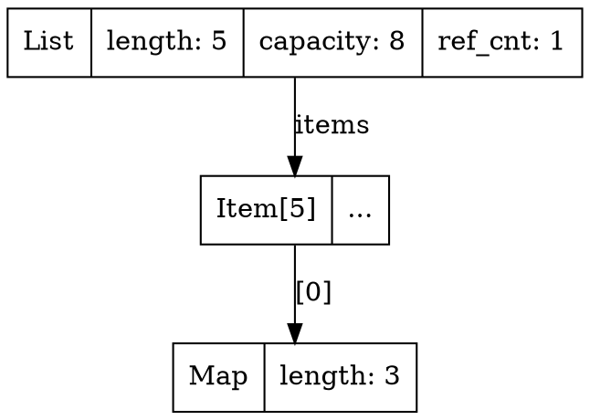

# Lambda Memory Tracker

A lightweight memory tracking system for the Lambda/Radiant engine, designed to work alongside rpmalloc and external profiling tools.

## Goals

1. **Track memory usage** - allocation, free, metadata by category
2. **Detect wrong memory operations** - buffer overflows, double-free, use-after-free (dev time)
3. **Profile memory usage** - via Heaptrack/MTuner integration (dev time)
4. **Aid runtime memory management** - memory pressure callbacks for cache eviction

## Architecture Overview

```
┌─────────────────────────────────────────────────────────────────┐
│                    Lambda/Radiant Code                          │
│           (parsers, formatters, layout, rendering)              │
├─────────────────────────────────────────────────────────────────┤
│                  Memory Tracker API (lib/memtrack.h)            │
│  lmem_alloc() / lmem_free() / lmem_track_* / lmem_query_*      │
├─────────────────────────────────────────────────────────────────┤
│              Tracking Layer (lib/memtrack.c)                    │
│  • Allocation registry (hashmap)                                │
│  • Category accounting                                          │
│  • Memory pressure callbacks                                    │
│  • Debug guards (canaries, fill patterns)                       │
├─────────────────────────────────────────────────────────────────┤
│         Existing Allocators (Pool / Arena / rpmalloc)           │
│                       (unchanged)                                │
├─────────────────────────────────────────────────────────────────┤
│                    System malloc / mmap                          │
└─────────────────────────────────────────────────────────────────┘

External Profiling (dev time):
┌─────────────────────────────────────────────────────────────────┐
│  Heaptrack / MTuner  ──────────────────────────────────────────►│
│  (LD_PRELOAD / instrumentation)                                 │
└─────────────────────────────────────────────────────────────────┘
```

## Scope

### Tracked Code
- Lambda core (parsers, formatters, eval)
- Radiant layout engine
- Radiant rendering
- Input parsers (JSON, XML, HTML, CSS, etc.)
- Caches (font, image, layout)

### Excluded Code
- Tree-sitter generated C code (`parser.c`)
- MIR JIT generated code
- External libraries (FreeType, GLFW, ThorVG) - tracked at boundary only

## Existing Libraries Analysis

| Library | Bug Detection | Profiling | Runtime Mgmt | Overhead | Notes |
|---------|--------------|-----------|--------------|----------|-------|
| **ASan** | ✅ Excellent | ❌ No | ❌ No | ~2x | Dev only, compile-time |
| **Valgrind** | ✅ Excellent | ✅ Yes | ❌ No | ~20x | Too slow for regular use |
| **Heaptrack** | ❌ No | ✅ Excellent | ❌ No | ~10% | **Recommended for profiling** |
| **MTuner** | ❌ No | ✅ Excellent | ❌ No | ~10% | **Alternative, visual UI** |
| **tcmalloc** | ⚠️ Basic | ✅ Yes | ⚠️ Limited | ~5% | Would replace rpmalloc |
| **jemalloc** | ⚠️ Basic | ✅ Yes | ✅ Yes | ~5% | Would replace rpmalloc |
| **mimalloc** | ⚠️ Basic | ✅ Stats | ⚠️ Limited | ~0% | Would replace rpmalloc |

### Decision: Keep rpmalloc + Custom Tracker + External Profiling

**Rationale:**
- rpmalloc is already integrated and performant
- Custom tracker provides category-based accounting (not available in generic tools)
- Heaptrack/MTuner provide deep profiling without code changes
- Memory pressure callbacks require custom implementation

## Memory Tracker Design

### Tracking Modes

| Mode | Description | Overhead | Use Case |
|------|-------------|----------|----------|
| `MEMTRACK_MODE_OFF` | No tracking | 0% | Release builds |
| `MEMTRACK_MODE_STATS` | Stats only | ~1% | Production monitoring |
| `MEMTRACK_MODE_DEBUG` | Full tracking + guards | ~5-10% | Development |

### Memory Categories

Categories enable per-subsystem memory accounting:

```c
typedef enum MemCategory {
    LMEM_CAT_UNKNOWN = 0,

    // Lambda core
    LMEM_CAT_AST,           // AST nodes
    LMEM_CAT_PARSER,        // Parser temporaries
    LMEM_CAT_EVAL,          // Evaluation stack/context
    LMEM_CAT_STRING,        // String data (non-pooled)
    LMEM_CAT_CONTAINER,     // List, Map, Element, Array
    LMEM_CAT_NAMEPOOL,      // Name pool entries
    LMEM_CAT_SHAPEPOOL,     // Shape pool entries

    // Input parsers
    LMEM_CAT_INPUT_JSON,
    LMEM_CAT_INPUT_XML,
    LMEM_CAT_INPUT_HTML,
    LMEM_CAT_INPUT_CSS,
    LMEM_CAT_INPUT_MD,
    LMEM_CAT_INPUT_PDF,
    LMEM_CAT_INPUT_OTHER,

    // Formatters
    LMEM_CAT_FORMAT,

    // Radiant layout/render
    LMEM_CAT_DOM,           // DOM nodes
    LMEM_CAT_LAYOUT,        // Layout computation
    LMEM_CAT_STYLE,         // CSS style data
    LMEM_CAT_FONT,          // Font data/cache
    LMEM_CAT_IMAGE,         // Image data/cache
    LMEM_CAT_RENDER,        // Render buffers

    // Caches (evictable under memory pressure)
    LMEM_CAT_CACHE_FONT,    // Font glyph cache
    LMEM_CAT_CACHE_IMAGE,   // Decoded image cache
    LMEM_CAT_CACHE_LAYOUT,  // Layout cache
    LMEM_CAT_CACHE_OTHER,

    // Temporary allocations
    LMEM_CAT_TEMP,

    LMEM_CAT_COUNT
} MemCategory;
```

### Debug Mode Features

#### Guard Bytes (Buffer Overflow Detection)
```
┌──────────────┬─────────────────────┬──────────────┐
│ HEAD GUARD   │    USER DATA        │ TAIL GUARD   │
│ 16 bytes     │    N bytes          │ 16 bytes     │
│ 0xDE 0xDE... │                     │ 0xAD 0xAD... │
└──────────────┴─────────────────────┴──────────────┘
```

On `lmem_free()`, guards are verified. Corruption triggers:
```
memtrack: buffer overflow detected for allocation 0x12345678
          (alloc'd at input-json.cpp:234, size=1024, category=input-json)
```

#### Fill Patterns
| Pattern | Value | Purpose |
|---------|-------|---------|
| `FILL_BYTE_ALLOC` | `0xCD` | Fresh allocation (detect uninitialized use) |
| `FILL_BYTE_FREE` | `0xDD` | Freed memory (detect use-after-free) |

#### Source Location Tracking
When `MEMTRACK_DEBUG_LOCATIONS` is defined:
```c
#define lmem_alloc(size, cat) lmem_alloc_loc(size, cat, __FILE__, __LINE__)
```

Enables leak reports like:
```
memtrack: leak #1: 0x12345678, 1024 bytes, category=parser, alloc'd at build_ast.cpp:567
```

### Memory Pressure System

#### Pressure Levels
| Level | Threshold | Action |
|-------|-----------|--------|
| `MEM_PRESSURE_NONE` | < soft_limit | Normal operation |
| `MEM_PRESSURE_LOW` | >= soft_limit | Consider eviction |
| `MEM_PRESSURE_MEDIUM` | >= 75% of hard_limit | Evict non-essential |
| `MEM_PRESSURE_HIGH` | >= hard_limit | Aggressive eviction |
| `MEM_PRESSURE_CRITICAL` | >= critical_limit | Emergency, evict all possible |

#### Callback Registration
```c
// Cache manager registers eviction callback
size_t evict_font_cache(MemPressureLevel level, size_t target, void* ctx) {
    FontCache* cache = (FontCache*)ctx;
    if (level >= MEM_PRESSURE_MEDIUM) {
        return font_cache_evict_lru(cache, target);
    }
    return 0;
}

uint32_t handle = memtrack_register_pressure_callback(
    evict_font_cache,
    font_cache,
    (1ULL << LMEM_CAT_CACHE_FONT)
);
```

#### Automatic Triggering
Pressure callbacks are automatically invoked when:
1. `lmem_alloc()` causes memory to exceed soft_limit
2. `memtrack_request_free(bytes)` is called explicitly
3. `memtrack_trigger_pressure(level)` is called manually

## API Reference

### Initialization
```c
// Initialize at program startup
bool memtrack_init(MemtrackMode mode);

// Shutdown and report leaks
void memtrack_shutdown(void);

// Change mode at runtime
void memtrack_set_mode(MemtrackMode mode);
```

### Allocation
```c
void* lmem_alloc(size_t size, MemCategory category);
void* lmem_calloc(size_t count, size_t size, MemCategory category);
void* lmem_realloc(void* ptr, size_t new_size, MemCategory category);
void  lmem_free(void* ptr);
char* lmem_strdup(const char* str, MemCategory category);
```

### Statistics
```c
void   memtrack_get_stats(MemtrackStats* stats);
size_t memtrack_get_current_usage(void);
size_t memtrack_get_peak_usage(void);
size_t memtrack_get_category_usage(MemCategory category);
```

### Debugging
```c
void   memtrack_log_usage(void);           // Print summary to log
void   memtrack_log_allocations(void);     // List all active allocations
size_t memtrack_check_leaks(void);         // Returns leak count
size_t memtrack_verify_guards(void);       // Check for buffer overflows
```

### Snapshots (for profiling code sections)
```c
uint32_t memtrack_snapshot(void);                      // Take snapshot
void     memtrack_compare_snapshot(uint32_t handle);   // Compare to current
void     memtrack_free_snapshot(uint32_t handle);      // Release snapshot
```

### Memory Pressure
```c
void memtrack_set_limits(size_t soft, size_t hard, size_t critical);
uint32_t memtrack_register_pressure_callback(MemPressureCallback cb, void* ctx, uint64_t categories);
void memtrack_unregister_pressure_callback(uint32_t handle);
size_t memtrack_request_free(size_t bytes_needed);
```

## External Profiling Integration

### Heaptrack (Recommended)

[Heaptrack](https://github.com/KDE/heaptrack) provides detailed heap profiling with minimal overhead.

#### Installation
```bash
# macOS
brew install heaptrack

# Linux (Ubuntu/Debian)
sudo apt install heaptrack heaptrack-gui
```

#### Usage
```bash
# Profile Lambda
heaptrack ./lambda.exe script.ls

# Analyze results
heaptrack_gui heaptrack.lambda.exe.12345.gz
```

#### What Heaptrack Shows
- Allocation hotspots (which code allocates most)
- Memory leaks (allocations without frees)
- Peak memory usage over time
- Allocation size distribution
- Flame graphs of allocation call stacks

### MTuner (Alternative)

[MTuner](https://github.com/RudjiGames/MTuner) provides a visual memory profiler.

#### Installation
```bash
# Download from https://github.com/RudjiGames/MTuner/releases
# Available for Windows/Linux
```

#### Usage
```bash
# Requires instrumentation library
# Link with MTuner's rmem library, then run with MTuner GUI
```

#### What MTuner Shows
- Real-time memory visualization
- Allocation timeline
- Memory fragmentation
- Leak detection
- Tag-based filtering (similar to our categories)

### Combining Custom Tracker + External Profiling

The custom tracker and external profilers serve complementary purposes:

| Feature | Custom Tracker | Heaptrack/MTuner |
|---------|---------------|------------------|
| Category-based stats | ✅ | ❌ |
| Memory pressure callbacks | ✅ | ❌ |
| Buffer overflow detection | ✅ (debug mode) | ❌ |
| Call stack profiling | ❌ | ✅ |
| Visual timeline | ❌ | ✅ |
| Flame graphs | ❌ | ✅ |
| Zero code changes | ❌ | ✅ |

**Recommended workflow:**
1. Use custom tracker for runtime management and category stats
2. Use Heaptrack for deep profiling when investigating issues
3. Use ASan for bug detection in CI/development builds

## Integration Plan

### Phase 1: Core Integration
1. Add `lib/memtrack.c` to build
2. Initialize in `main.cpp`:
   ```c
   #ifdef LAMBDA_DEBUG_MEMORY
   memtrack_init(MEMTRACK_MODE_DEBUG);
   #else
   memtrack_init(MEMTRACK_MODE_STATS);
   #endif
   ```
3. Add shutdown call at exit

### Phase 2: Gradual Adoption
Replace allocations in key areas:

```c
// Before (lambda-mem.cpp)
String* str = (String *)heap_alloc(len + 1 + sizeof(String), LMD_TYPE_STRING);

// After
String* str = (String *)lmem_alloc(len + 1 + sizeof(String), LMEM_CAT_STRING);
```

Priority areas:
1. Input parsers (`lambda/input/*.cpp`) - handles untrusted data
2. Radiant DOM/Layout (`radiant/dom.cpp`, `radiant/layout*.cpp`)
3. Caches (font, image) - for pressure callbacks

### Phase 3: Cache Eviction
Register pressure callbacks for evictable caches:

```c
// In font_cache.cpp
void font_cache_init() {
    // ...
    memtrack_register_pressure_callback(
        font_cache_evict_callback,
        g_font_cache,
        (1ULL << LMEM_CAT_CACHE_FONT)
    );
}
```

### Phase 4: CI Integration
Add memory checks to test runs:

```bash
# In test_run.sh
if [ "$MEMTRACK_DEBUG" = "1" ]; then
    # Run with tracker, check for leaks
    ./test_lambda_gtest.exe
    if [ $? -ne 0 ]; then
        echo "Memory issues detected"
        exit 1
    fi
fi
```

## Build Configuration

### Makefile/Premake Changes

Add to `build_lambda_config.json`:
```json
{
  "sources": {
    "lib": [
      "lib/memtrack.c"
    ]
  }
}
```

### Compiler Flags

```makefile
# Debug build with full tracking
CFLAGS_DEBUG += -DMEMTRACK_DEBUG_LOCATIONS -DLAMBDA_DEBUG_MEMORY

# Release build with stats only (optional)
CFLAGS_RELEASE += -DLAMBDA_STATS_MEMORY
```

### Heaptrack Build Target

```makefile
# Profile with Heaptrack
profile-heap: lambda.exe
	heaptrack ./lambda.exe $(PROFILE_SCRIPT)
	heaptrack_gui heaptrack.lambda.exe.*.gz
```

## Files

| File | Description |
|------|-------------|
| `lib/memtrack.h` | Public API header |
| `lib/memtrack.c` | Implementation |
| `lib/typemeta.h` | Type metadata structures and API |
| `lib/typemeta.c` | Type metadata implementation |
| `utils/typemeta_extract.cpp` | Clang LibTooling-based type extractor |
| `utils/typemeta_extract_json.py` | JSON AST parser (no LLVM libs needed) |
| `utils/CMakeLists.txt` | CMake build for typemeta_extract |
| `generated/typemeta_defs.c` | Auto-generated type definitions |
| `vibe/Lambda_Memory_Tracker.md` | This document |

## Type Metadata System (RTTI for C/C++)

The memory tracker includes a **runtime type information** system that enables:
- Runtime type checking of allocations
- Memory walking and inspection
- Better debugging and visualization
- Automatic structure validation

### Design Overview

```
┌─────────────────────────────────────────────────────────────────┐
│                    Type Registry                                │
│  HashMap<type_id -> TypeMeta*>                                  │
├─────────────────────────────────────────────────────────────────┤
│                    TypeMeta Definitions                         │
│  • Primitives (int, float, char*, etc.)                        │
│  • Structs (fields, offsets, nested types)                     │
│  • Arrays (element type, count)                                │
│  • Pointers (target type)                                      │
│  • Unions (variants)                                           │
├─────────────────────────────────────────────────────────────────┤
│                    Allocation Records                           │
│  Each allocation stores: ptr, size, category, TypeMeta*        │
└─────────────────────────────────────────────────────────────────┘
```

### TypeMeta Structure

```c
// Type kinds
typedef enum TypeMetaKind {
    TYPE_KIND_VOID = 0,
    TYPE_KIND_BOOL,
    TYPE_KIND_CHAR,
    TYPE_KIND_INT8,
    TYPE_KIND_INT16,
    TYPE_KIND_INT32,
    TYPE_KIND_INT64,
    TYPE_KIND_UINT8,
    TYPE_KIND_UINT16,
    TYPE_KIND_UINT32,
    TYPE_KIND_UINT64,
    TYPE_KIND_FLOAT,
    TYPE_KIND_DOUBLE,
    TYPE_KIND_POINTER,      // Pointer to another type
    TYPE_KIND_ARRAY,        // Fixed-size array
    TYPE_KIND_FLEX_ARRAY,   // Flexible array member (C99)
    TYPE_KIND_STRUCT,       // Struct with fields
    TYPE_KIND_UNION,        // Union with variants
    TYPE_KIND_ENUM,         // Enumeration
    TYPE_KIND_FUNCTION,     // Function pointer
    TYPE_KIND_OPAQUE,       // Opaque type (size known, structure unknown)
} TypeMetaKind;

// Field descriptor for structs
typedef struct FieldMeta {
    const char* name;           // Field name
    const struct TypeMeta* type;// Field type
    size_t offset;              // Byte offset from struct start
    size_t bit_offset;          // Bit offset (for bitfields, 0 otherwise)
    size_t bit_width;           // Bit width (for bitfields, 0 otherwise)
    uint32_t flags;             // FIELD_FLAG_* flags
} FieldMeta;

// Field flags
#define FIELD_FLAG_CONST        0x01    // const qualifier
#define FIELD_FLAG_VOLATILE     0x02    // volatile qualifier
#define FIELD_FLAG_BITFIELD     0x04    // Is a bitfield
#define FIELD_FLAG_POINTER      0x08    // Is a pointer (for walking)
#define FIELD_FLAG_OWNED        0x10    // Pointer owns the memory (should be freed)
#define FIELD_FLAG_NULLABLE     0x20    // Pointer can be NULL

// Enum value descriptor
typedef struct EnumValueMeta {
    const char* name;
    int64_t value;
} EnumValueMeta;

// Main type metadata structure
typedef struct TypeMeta {
    const char* name;           // Type name (e.g., "List", "DomElement")
    TypeMetaKind kind;          // Type kind
    size_t size;                // sizeof(type)
    size_t alignment;           // alignof(type)
    uint32_t type_id;           // Unique type ID (hash or assigned)
    uint32_t flags;             // TYPE_FLAG_* flags

    union {
        // For TYPE_KIND_POINTER
        struct {
            const struct TypeMeta* target_type;
        } pointer;

        // For TYPE_KIND_ARRAY / TYPE_KIND_FLEX_ARRAY
        struct {
            const struct TypeMeta* element_type;
            size_t count;           // Element count (0 for flex array)
        } array;

        // For TYPE_KIND_STRUCT / TYPE_KIND_UNION
        struct {
            const FieldMeta* fields;
            size_t field_count;
            const struct TypeMeta* base_type; // For inheritance-like patterns
        } composite;

        // For TYPE_KIND_ENUM
        struct {
            const EnumValueMeta* values;
            size_t value_count;
            const struct TypeMeta* underlying_type;
        } enum_info;

        // For TYPE_KIND_FUNCTION
        struct {
            const struct TypeMeta* return_type;
            const struct TypeMeta** param_types;
            size_t param_count;
        } function;
    };
} TypeMeta;

// Type flags
#define TYPE_FLAG_PACKED        0x01    // __attribute__((packed))
#define TYPE_FLAG_ALIGNED       0x02    // Has explicit alignment
#define TYPE_FLAG_ANONYMOUS     0x04    // Anonymous struct/union
#define TYPE_FLAG_CONTAINER     0x08    // Is a container (has items to walk)
#define TYPE_FLAG_REFCOUNTED    0x10    // Has reference counting
#define TYPE_FLAG_POOLED        0x20    // Allocated from pool
```

### Type Registration

Types can be registered manually via macros or auto-generated:

```c
// ============================================================================
// Manual Registration Macros
// ============================================================================

// Register a primitive type
#define LMEM_REGISTER_PRIMITIVE(type, kind) \
    static const TypeMeta _typemeta_##type = { \
        .name = #type, \
        .kind = kind, \
        .size = sizeof(type), \
        .alignment = _Alignof(type), \
        .type_id = 0, /* computed at registration */ \
    }; \
    __attribute__((constructor)) static void _register_##type(void) { \
        typemeta_register(&_typemeta_##type); \
    }

// Begin struct definition
#define LMEM_STRUCT_BEGIN(type) \
    static const FieldMeta _fields_##type[] = {

// Define a field
#define LMEM_FIELD(type, field, field_type_meta) \
    { \
        .name = #field, \
        .type = field_type_meta, \
        .offset = offsetof(type, field), \
        .bit_offset = 0, \
        .bit_width = 0, \
        .flags = 0, \
    },

// Define a pointer field (for memory walking)
#define LMEM_FIELD_PTR(type, field, target_type_meta, owned) \
    { \
        .name = #field, \
        .type = target_type_meta, \
        .offset = offsetof(type, field), \
        .flags = FIELD_FLAG_POINTER | ((owned) ? FIELD_FLAG_OWNED : 0), \
    },

// End struct definition
#define LMEM_STRUCT_END(type) \
    }; \
    static const TypeMeta _typemeta_##type = { \
        .name = #type, \
        .kind = TYPE_KIND_STRUCT, \
        .size = sizeof(type), \
        .alignment = _Alignof(type), \
        .composite = { \
            .fields = _fields_##type, \
            .field_count = sizeof(_fields_##type) / sizeof(FieldMeta), \
        }, \
    }; \
    const TypeMeta* TYPEMETA_##type = &_typemeta_##type;

// ============================================================================
// Example: Registering Lambda Types
// ============================================================================

// Forward declare type metadata pointers
extern const TypeMeta* TYPEMETA_String;
extern const TypeMeta* TYPEMETA_List;
extern const TypeMeta* TYPEMETA_Map;
extern const TypeMeta* TYPEMETA_Element;
extern const TypeMeta* TYPEMETA_Container;

// String type
LMEM_STRUCT_BEGIN(String)
    LMEM_FIELD(String, len, &TYPEMETA_uint32)
    LMEM_FIELD(String, ref_cnt, &TYPEMETA_uint32)
    // chars[] is a flexible array member
LMEM_STRUCT_END(String)

// Container base type
LMEM_STRUCT_BEGIN(Container)
    LMEM_FIELD(Container, type_id, &TYPEMETA_uint8)
    LMEM_FIELD(Container, flags, &TYPEMETA_uint8)
    LMEM_FIELD(Container, ref_cnt, &TYPEMETA_uint16)
LMEM_STRUCT_END(Container)

// List type (extends Container)
LMEM_STRUCT_BEGIN(List)
    LMEM_FIELD(List, type_id, &TYPEMETA_uint8)
    LMEM_FIELD(List, flags, &TYPEMETA_uint8)
    LMEM_FIELD(List, ref_cnt, &TYPEMETA_uint16)
    LMEM_FIELD_PTR(List, items, &TYPEMETA_Item, true)  // owned pointer
    LMEM_FIELD(List, length, &TYPEMETA_int64)
    LMEM_FIELD(List, extra, &TYPEMETA_int64)
    LMEM_FIELD(List, capacity, &TYPEMETA_int64)
LMEM_STRUCT_END(List)
```

### Enhanced Allocation API

```c
// Allocate with type metadata
void* lmem_alloc_typed(const TypeMeta* type, MemCategory category);

// Allocate array of typed elements
void* lmem_alloc_array_typed(const TypeMeta* element_type, size_t count, MemCategory category);

// Convenience macro for typed allocation
#define LMEM_NEW(type, category) \
    ((type*)lmem_alloc_typed(TYPEMETA_##type, category))

#define LMEM_NEW_ARRAY(type, count, category) \
    ((type*)lmem_alloc_array_typed(TYPEMETA_##type, count, category))

// Example usage:
List* list = LMEM_NEW(List, LMEM_CAT_CONTAINER);
Item* items = LMEM_NEW_ARRAY(Item, 100, LMEM_CAT_CONTAINER);
```

### Memory Walking API

```c
// Callback for walking memory
typedef bool (*MemWalkCallback)(
    void* ptr,                  // Pointer to current object
    const TypeMeta* type,       // Type of current object
    const FieldMeta* field,     // Field info (NULL for root)
    int depth,                  // Nesting depth
    void* user_data             // User context
);

// Walk an allocation and all reachable objects
void lmem_walk(void* ptr, MemWalkCallback callback, void* user_data);

// Walk all allocations of a specific type
void lmem_walk_type(const TypeMeta* type, MemWalkCallback callback, void* user_data);

// Walk all allocations in a category
void lmem_walk_category(MemCategory category, MemWalkCallback callback, void* user_data);

// ============================================================================
// Example: Dump all List allocations
// ============================================================================

bool dump_list_callback(void* ptr, const TypeMeta* type,
                        const FieldMeta* field, int depth, void* ctx) {
    if (type == TYPEMETA_List) {
        List* list = (List*)ptr;
        log_info("List at %p: length=%lld, capacity=%lld, ref_cnt=%d",
                 ptr, list->length, list->capacity, list->ref_cnt);
    }
    return true;  // Continue walking
}

void dump_all_lists() {
    lmem_walk_type(TYPEMETA_List, dump_list_callback, NULL);
}
```

### Type Introspection API

```c
// Get type metadata for an allocation
const TypeMeta* lmem_get_type(void* ptr);

// Get field by name
const FieldMeta* typemeta_get_field(const TypeMeta* type, const char* name);

// Get field value (returns pointer to field)
void* typemeta_get_field_ptr(void* obj, const TypeMeta* type, const char* field_name);

// Type checking
bool typemeta_is_kind(const TypeMeta* type, TypeMetaKind kind);
bool typemeta_is_subtype(const TypeMeta* type, const TypeMeta* base);

// Format value as string (for debugging)
char* typemeta_format_value(void* ptr, const TypeMeta* type, char* buf, size_t buf_size);

// ============================================================================
// Example: Generic object inspector
// ============================================================================

void inspect_object(void* ptr) {
    const TypeMeta* type = lmem_get_type(ptr);
    if (!type) {
        log_warn("Unknown type at %p", ptr);
        return;
    }

    log_info("Object at %p: type=%s, size=%zu", ptr, type->name, type->size);

    if (type->kind == TYPE_KIND_STRUCT) {
        for (size_t i = 0; i < type->composite.field_count; i++) {
            const FieldMeta* field = &type->composite.fields[i];
            void* field_ptr = (char*)ptr + field->offset;
            char buf[256];
            typemeta_format_value(field_ptr, field->type, buf, sizeof(buf));
            log_info("  .%s = %s", field->name, buf);
        }
    }
}
```

### Auto-Generation Tools

Two approaches are provided for extracting type metadata from C/C++ headers:

#### Approach Comparison

| Tool | Requirements | Speed | Accuracy | Best For |
|------|-------------|-------|----------|----------|
| **typemeta_extract** (LibTooling) | LLVM/Clang dev libs | Fast | Exact offsets | CI/build integration |
| **typemeta_extract_json.py** | clang binary only | Medium | Good | Quick iteration |

```
┌─────────────────────────────────────────────────────────────────┐
│           Clang LibTooling (typemeta_extract.cpp)               │
│  • Full AST access with exact field offsets                     │
│  • Fast execution, C++ native                                   │
│  • Requires LLVM/Clang development libraries                    │
├─────────────────────────────────────────────────────────────────┤
│           JSON AST Parser (typemeta_extract_json.py)            │
│  • Uses `clang -ast-dump=json`                                  │
│  • No special libraries needed                                  │
│  • Python 3.7+ required                                         │
├─────────────────────────────────────────────────────────────────┤
│  Input: lambda/*.h, radiant/*.hpp                               │
│  Output: generated/typemeta_defs.c                              │
└─────────────────────────────────────────────────────────────────┘
```

#### Option 1: LibTooling-based Extractor (Recommended)

Build the extractor tool:
```bash
# macOS
brew install llvm
export LLVM_DIR=$(brew --prefix llvm)/lib/cmake/llvm
export Clang_DIR=$(brew --prefix llvm)/lib/cmake/clang

# Build
mkdir -p build_utils && cd build_utils
cmake ../utils -DCMAKE_BUILD_TYPE=Release
make
cd ..
```

Usage:
```bash
# Extract types from Lambda headers
./build_utils/typemeta_extract lambda/lambda.h -- -std=c11 -I. > generated/typemeta_defs.c

# With type filtering
./build_utils/typemeta_extract --filter="String|List|Map|Element|Container|Dom.*|View.*" \
    lambda/lambda.h radiant/view.hpp -- -std=c++17 -I. -Iinclude

# Output as JSON (for debugging/tooling)
./build_utils/typemeta_extract --json lambda/lambda.h -- -std=c11 > types.json

# Verbose output
./build_utils/typemeta_extract -v lambda/lambda.h -- -std=c11
```

#### Option 2: JSON AST Parser (No Build Required)

This uses clang's `-ast-dump=json` feature and parses the JSON output:

```bash
# Basic usage
python3 utils/typemeta_extract_json.py lambda/lambda.h -o generated/typemeta_defs.c

# With include paths
python3 utils/typemeta_extract_json.py lambda/lambda.h -I. -Iinclude -o generated/typemeta_defs.c

# Filter types with regex
python3 utils/typemeta_extract_json.py lambda/lambda.h --filter "String|List|Map" -o typemeta.c

# Output JSON instead of C
python3 utils/typemeta_extract_json.py lambda/lambda.h --json -o types.json

# Verbose output
python3 utils/typemeta_extract_json.py lambda/lambda.h -v
```

#### Makefile Integration

Add to `Makefile`:
```makefile
# Generate type metadata from headers
TYPEMETA_HEADERS = lambda/lambda.h lambda/lambda-data.hpp radiant/view.hpp

generated/typemeta_defs.c: $(TYPEMETA_HEADERS) utils/typemeta_extract.cpp
	@mkdir -p generated
	@if [ -x build_utils/typemeta_extract ]; then \
		./build_utils/typemeta_extract $(TYPEMETA_HEADERS) -- -std=c++17 -I. > $@; \
	else \
		python3 utils/typemeta_extract_json.py $(TYPEMETA_HEADERS) -I. -o $@; \
	fi

typemeta: generated/typemeta_defs.c
	@echo "Generated type metadata"

.PHONY: typemeta
```

#### Generated Output Example

The extractor generates C code with TypeMeta definitions:

```c
// Auto-generated by typemeta_extract - DO NOT EDIT
//
// Generated from:
//   lambda/lambda.h
//
// Regenerate with:
//   ./typemeta_extract --output=<file> <headers> -- <clang-args>

#include "typemeta.h"

#ifdef __cplusplus
extern "C" {
#endif

// =============================================================================
// Primitive Types
// =============================================================================

const TypeMeta TYPEMETA_void = { "void", TYPE_KIND_VOID, 0, 1, 0x811c9dc5, 0 };
const TypeMeta TYPEMETA_bool = { "bool", TYPE_KIND_BOOL, sizeof(bool), _Alignof(bool), 0x050c5d1f, 0 };
const TypeMeta TYPEMETA_int32 = { "int32", TYPE_KIND_INT32, sizeof(int32_t), _Alignof(int32_t), 0x3f5d5e5b, 0 };
// ... more primitives ...

// =============================================================================
// Composite Types
// =============================================================================

// struct Container from lambda/lambda.h:45
static const FieldMeta _typemeta_fields_Container[] = {
    {
        .name = "type_id",
        .type = &TYPEMETA_uint8,
        .offset = offsetof(Container, type_id),
        .bit_offset = 0,
        .bit_width = 0,
        .flags = 0,
        .array_count = 0,
        .count_field = NULL,
    },
    {
        .name = "flags",
        .type = &TYPEMETA_uint8,
        .offset = offsetof(Container, flags),
        .bit_offset = 0,
        .bit_width = 0,
        .flags = 0,
        .array_count = 0,
        .count_field = NULL,
    },
    {
        .name = "ref_cnt",
        .type = &TYPEMETA_uint16,
        .offset = offsetof(Container, ref_cnt),
        .bit_offset = 0,
        .bit_width = 0,
        .flags = 0,
        .array_count = 0,
        .count_field = NULL,
    },
};

const TypeMeta TYPEMETA_Container = {
    .name = "Container",
    .kind = TYPE_KIND_STRUCT,
    .size = sizeof(Container),
    .alignment = _Alignof(Container),
    .type_id = 0x8a5c9b2e,
    .flags = TYPE_FLAG_REFCOUNTED,
    .composite = {
        .fields = _typemeta_fields_Container,
        .field_count = sizeof(_typemeta_fields_Container) / sizeof(FieldMeta),
        .base_type = NULL,
    },
};

// struct List from lambda/lambda.h:67
static const FieldMeta _typemeta_fields_List[] = {
    // ... fields ...
    {
        .name = "items",
        .type = NULL  // pointer type,
        .offset = offsetof(List, items),
        .bit_offset = 0,
        .bit_width = 0,
        .flags = FIELD_FLAG_POINTER | FIELD_FLAG_NULLABLE | FIELD_FLAG_OWNED,
        .array_count = 0,
        .count_field = "length",
    },
    // ... more fields ...
};

const TypeMeta TYPEMETA_List = {
    .name = "List",
    .kind = TYPE_KIND_STRUCT,
    .size = sizeof(List),
    .alignment = _Alignof(List),
    .type_id = 0x4a1e2f3b,
    .flags = TYPE_FLAG_CONTAINER | TYPE_FLAG_REFCOUNTED,
    .composite = {
        .fields = _typemeta_fields_List,
        .field_count = sizeof(_typemeta_fields_List) / sizeof(FieldMeta),
        .base_type = &TYPEMETA_Container,
    },
};

// =============================================================================
// Type Registration
// =============================================================================

void typemeta_register_generated(void) {
    // Primitives
    typemeta_register(&TYPEMETA_void);
    typemeta_register(&TYPEMETA_bool);
    // ...

    // Generated types
    typemeta_register(&TYPEMETA_Container);
    typemeta_register(&TYPEMETA_List);
    // ...
}

#ifdef __cplusplus
}
#endif
```

#### Key Features of the Extractor

1. **Exact field offsets** - Uses Clang's AST to get precise `offsetof()` values
2. **Bitfield support** - Correctly handles bit_offset and bit_width
3. **Base type detection** - Identifies inheritance-like patterns (Container → List)
4. **Pointer analysis** - Marks pointer fields with ownership heuristics
5. **Array detection** - Fixed arrays and flexible array members
6. **Source tracking** - Records which file/line each type came from
7. **Type filtering** - Regex-based include/exclude patterns
8. **JSON output** - For tooling integration and debugging

### Validation and Safety Checks

With type metadata, the tracker can perform runtime validation:

```c
// Validate an allocation matches expected type
bool lmem_validate_type(void* ptr, const TypeMeta* expected_type);

// Check all allocations for corruption
size_t lmem_validate_all(void);

// Validation checks performed:
// 1. Size matches TypeMeta->size
// 2. For containers: item count is reasonable (< capacity)
// 3. For ref-counted types: ref_cnt is reasonable (< 1000)
// 4. For pointers: target is also tracked or NULL
// 5. Guard bytes intact (debug mode)
```

### Memory Dump and Visualization

```c
// Dump allocation as formatted text
void lmem_dump(void* ptr, FILE* out);

// Dump all allocations to file
void lmem_dump_all(const char* filename);

// Export allocation graph (DOT format for Graphviz)
void lmem_export_graph(const char* filename);
```

Example DOT output:


## Future Enhancements

1. **Pool/Arena tracking** - Track bulk allocations from Pool/Arena, not just individual mallocs
2. **Allocation age tracking** - Identify long-lived allocations that might be leaks
3. **Thread-specific stats** - Per-thread memory usage for parallel workloads
4. **JSON stats export** - For automated monitoring/graphing
5. **Integration with CI** - Fail builds if peak memory exceeds threshold
6. **Live memory inspector** - WebSocket-based UI for real-time memory visualization
7. **Cycle detection** - Detect reference cycles in ref-counted structures
8. **Type migration** - Validate struct layout changes between versions
