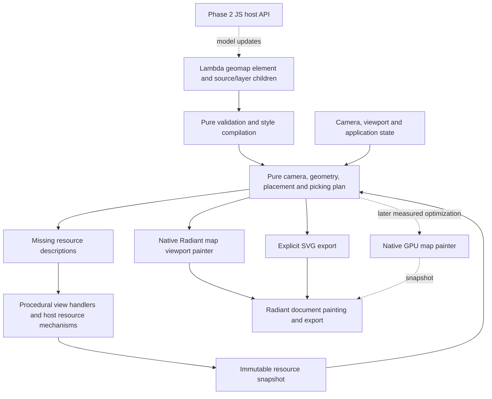

# Lambda Map Package — Proposal

**Status:** Native Lambda/Radiant, the `<geomap ...>` element, and a JS API over
the native renderer in Phase 2 selected by the user on 2026-10-09. Detailed
API, compatibility, and release choices below remain the target design. Native
implementation has started; verified coverage and remaining work are tracked in
[the implementation record](impl/Lambda_Impl_Map.md). This proposal does not
claim completion of a phase or MapLibre compatibility.

**Scope:** A geographic map package for Lambda: declarative map styles,
GeoJSON overlays, camera navigation, tiled basemaps, feature queries,
interactive Radiant views, and document export. This concerns geographic maps,
not Lambda's map collection type.

**Primary reference:** [MapLibre GL JS](https://github.com/maplibre/maplibre-gl-js).
The proposal uses its source/layer/style separation and mapping concepts as
references; it does not promise its complete JavaScript API or style support.

**Specification linkage:** D7.2.1–D7.2.4 cover packages and namespaces;
S12.1.1v2/S12.1.3 cover pure computation and procedural view handlers;
S7.4.1–S7.4.2 cover errors; D4.5.1v4/D4.5.2 and D5.3.3 cover native ownership;
D7.4.1v2/D7.4.2v2/D7.4.4 and D7.5.2/D7.5.3 cover host resources, async work,
IO, and the Radiant boundary. This proposal applies those contracts without
changing the formal specifications. See [Formal Design](../doc/Lambda_Formal_Design.md),
[Formal Semantics](../doc/Lambda_Formal_Semantics.md), and
[Documentation Convention](../doc/Doc_Convention.md).

## 1. Selected direction

Develop a **native Lambda package and Radiant map viewport**. The authoritative
map description is a Lambda **`<geomap ...>` element**, with typed attributes and
child elements for sources and ordered layers. The proposed helper import is
`import maps: lambda.map`. A literal map must display through Radiant without
the application first converting it into an SVG or an HTML wrapper.

**Phase 1 is native:** element normalization, camera, cartography, resource
loading, interaction, rendering, and export. Reuse Radiant's vector/SVG paint
facilities for the first flat-map renderer; SVG is also an explicit export
format. A dedicated GPU painter is a measured extension, not a prerequisite
for the element model.

**Phase 2 adds a JS API over the native renderer:** JS controls the same map
model and renderer through the existing host boundary. The user selected this
target over executing unmodified MapLibre GL JS. Phase 1 has no author-JS or
GL JS dependency; browser-library execution is outside the selected phases.

This follows the chart package's successful separation: Lambda owns the
declarative model and interaction policy; Radiant supplies layout, painting,
events, fonts, and resource mechanisms. A map has its own camera and source
lifecycle rather than being an unusually large geographic chart.

Target three useful applications:

- **Documents:** a location inset, route map, or thematic map embedded in
  HTML, reports, slides, and exported SVG/PDF/PNG.
- **Data applications:** clickable regions and points, tooltips, selection,
  choropleths, and linked map/chart dashboards.
- **Map exploration:** pan and zoom over an explicitly configured basemap,
  with local or remote tiles and application GeoJSON overlays.

Within Phase 1, **v0.1** is an offline GeoJSON map with real navigation,
picking, and document export. **v0.2** adds tiled basemaps and a bounded
cartographic symbol system. Release versions and development phases are
different: native interaction is Phase 1 work, and JS begins in Phase 2.

The element spelling and native-first/JS-second direction are settled. The
namespace and release boundaries remain open for review in §10. `<geomap>` uses
the existing Lambda element syntax; no new parser syntax, primitive type,
compiler backend, or CLI command is proposed.

## 2. What to learn from MapLibre

MapLibre GL JS renders interactive maps in a browser or webview, with GPU
rendering of vector tiles. Its declarative style describes sources, ordered
layers, and their appearance; the imperative `Map` object supplies runtime
control. These are separate design surfaces. Lambda should adopt a useful
style model without copying the mutable JavaScript object model.
Sources: [project README](https://github.com/maplibre/maplibre-gl-js#readme),
[style introduction](https://maplibre.org/maplibre-style-spec/).

The upstream architecture describes worker-side tile decoding, layout into
renderable buckets, feature indexing, and layer-ordered rendering. The useful
lesson is to separate acquisition, decoding, style evaluation, geometry,
placement, and drawing. The architecture note contains historical names and
incomplete headings; the selected release's source must settle implementation
details. [MapLibre architecture](https://github.com/maplibre/maplibre-gl-js/blob/main/ARCHITECTURE.md)

| MapLibre concept | Proposed Lambda interpretation |
|---|---|
| Style document | Normalize a documented subset of version-8 style data into the authoritative `<geomap>` element |
| Sources | Named immutable data descriptions, with separately owned loaded-resource snapshots |
| Ordered layers | Explicit drawing order and source references; one source can serve several layers |
| Camera | A value containing geographic center, zoom, bearing, and supported projection settings |
| Paint/layout properties | Compile into typed style programs and placement rules |
| Feature queries | Query the geometry and placement index associated with a particular displayed frame |
| Runtime events | Normalized inputs to a Lambda view's state update; host completions enter through the existing scheduler |
| Controls and popups | Ordinary accessible HTML/Lambda views anchored to map coordinates |

### Alternatives

| Approach | Benefit | Cost and disposition |
|---|---|---|
| Native Lambda model and Radiant rendering | Fits functional composition, existing document output, and Lambda views; shares chart geometry | **Selected for Phase 1.** Implement map-specific tile management and cartography. |
| Wrap MapLibre GL JS in a normal external browser/webview | Reuses the actual mature renderer and upstream behavior | Not the selected native architecture; a future web export can be considered separately. |
| Run unmodified MapLibre GL JS in LambdaJS/Radiant | Reuses upstream code within the native application | Outside the selected Phase 2 scope; requires a separate browser-API compatibility project. |
| Embed MapLibre Native | Reuses a native mapping engine | Not selected. Adds another renderer and dependency/resource model; retained as comparison material. |

MapLibre Native is an actual separate project, not a C++ build of GL JS.
[MapLibre Native documentation](https://maplibre.org/maplibre-native/docs/book/)

Existing Three.js/WebGL support does not establish MapLibre compatibility.
For example, current upstream worker construction uses `Worker`, module
workers, URL handling, and optional Blob URLs. A compatibility audit must
also trace the pinned build's DOM, image decoding, fetch, transferable buffers,
timers, extensions, and shaders. A successful empty canvas is insufficient.
[Upstream worker factory](https://github.com/maplibre/maplibre-gl-js/blob/main/src/util/web_worker.ts)
Those browser dependencies are not prerequisites for the selected JS API over
the native map renderer.

## 3. Fit with Lambda

### Existing foundation

The current checkout already has geographic chart support:

- [Chart geographic design](Lambda_Pkg_Chart.md#geographic-charts) describes
  GeoJSON marks and several projections, explicitly excluding map tiles and
  general inverse projection from that contract.
- [chart/geo.ls](../lmd/package/chart/geo.ls) validates geometry and renders
  geographic SVG paths; [chart/projection.ls](../lmd/package/chart/projection.ls)
  supplies projection, clipping support, and navigation helpers.
- [chart/geometry.ls](../lmd/package/chart/geometry.ls),
  [chart/svg.ls](../lmd/package/chart/svg.ls), and
  [chart/picking.ls](../lmd/package/chart/picking.ls) supply reusable geometry,
  SVG construction, and displayed-geometry picking.
- [chart/chart.ls](../lmd/package/chart/chart.ls) demonstrates instance-owned
  template state and procedural event handlers.
- Radiant has a document resource manager, image/font processing, SVG
  painting/export, and a shared native GL provider. Its selected WebGL2/Three.js
  profile is documented on macOS; it is not complete browser conformance.
  [Radiant WebGL design](radiant/Radiant_Design_WebGL.md)

These are source-inspected foundations, not map-package test results. The
inspection used checkout HEAD `074431240` with existing unrelated worktree
edits present. No package implementation or platform gate was run for this
proposal. The example's standalone `<geomap>` literal was type-checked with
the existing runtime's `--emit-ast-dump`, after removing the proposed package
import and `normalize` call. This verifies existing element syntax, not native
map rendering or the proposed APIs.

Reuse existing public helpers first. When chart-specific assumptions obstruct
reuse, extract the common geographic/geometry shape into shared modules and
keep chart-facing adapters. Do not copy projection, clipping, SVG, picking,
font, or async machinery into another implementation. Extraction must preserve
the chart's current API, projection fitting, and golden outputs. In particular,
a chart's fitted projection scale is not a tiled map's zoom convention.

### Formal contracts

| Authority | Consequence for the package |
|---|---|
| **D7.2.3/D7.2.4** — packages distribute as source; “`lambda.*` is the one root for everything Lambda ships” | Use an explicit source entry module. A script package and built-in module cannot own the same path. |
| **S16.9.6/S16.9.8** — dotted imports and existing resolution roots | `lambda.map` requires a real `lmd/package/map.ls`; there is no implicit directory index. The name is a recommendation subject to review. |
| **S12.1.1v2** — “`fn` is pure and deterministic under any schedule” | Validation, camera math, style compilation, and rendering from supplied snapshots stay pure. Network requests, file output, live cache changes, and clock sampling do not occur inside those functions. |
| **S12.1.3** — “template body = pure `fn` transformation” | Camera, selection, loading status, and playback belong to each view instance; `on` handlers perform updates. |
| **S7.4.1/S7.4.2** — value errors versus raised errors | Invalid specifications return deliberate `T \| error` values. Procedural loading/export APIs declare and engage raised failures when appropriate. |
| **D4.5.1v4/D4.5.2** — “pin, gen-check, copy-as-value”; “Radiant never retains a GC pointer” | Native render records copy data into document-owned storage or hold an explicitly registered root. Tile completion cannot retain a borrowed Lambda value. |
| **D5.3.3** — slot-backed `RootFrame` / `Rooted<T>` | Native decoding/building and script handoffs use precise roots; no conservative stack scanning. |
| **D7.4.1v2/D7.4.4** — opaque resource IDs and declared host interfaces | Renderer and request resources are checked host objects/IDs, never raw pointers in script values. |
| **D7.4.2v2/D7.5.2** — host async delivery and central IO | Reuse the host scheduler and IO policy. Packages do not create another event loop or bypass resource acquisition. |
| **D7.5.3** — “Lambda reaches Radiant only through the `radiant-dom` module” | Map mechanisms extend that boundary where needed; core Lambda does not link a map renderer. |
| **D7.3.5** — every module kind names its conformance gate | Define package, rendering, interaction, and any added web-platform gates before claiming support. |

The map package is a visualization library, so `lambda.map` is proposed beside
`lambda.chart` and `lambda.graph`. Document-specific adapters can live below
`lambda.doc.*` if needed. This classification is not a new namespace ruling.

## 4. Element model and proposed API

`<geomap>` is the public, persistent description and native viewport identity.
`<source>` children name inputs; `<layer>` children define drawing order and
style. Typed GeoJSON, paint maps, expressions, and coordinates remain ordinary
Lambda attribute values. Source and layer children describe cartography and
do not lay out as HTML content. Controls/popups occupy a separate overlay
view associated with the map instance.

MapLibre JSON is an interchange format, not a competing authoritative model.
A proposed `from_style(style, options)` adapter returns a normalized `<geomap>`;
element authors and JSON importers then share validation and compilation.
CSS `style` retains its normal document-layout meaning; the adapter does not
overload that attribute with a MapLibre style document.

A map has four separable inputs:

1. **Map element:** named source/layer children, appearance, metadata, and
   attribution. A source description is not a live request.
2. **Camera and viewport:** geographic navigation plus logical CSS dimensions.
3. **Resource snapshot:** already acquired GeoJSON, decoded tiles, images, and
   explicit font/measurement inputs, identified by immutable revisions.
4. **Application state:** selected/hovered feature IDs and optional explicitly
   sampled animation time.

Keep the style's original hyphenated property names, such as `circle-color`
and `source-layer`, to simplify interoperability. Lambda maps can use quoted
keys. Do not create a second camelCase/snake_case spelling for every style
property. The surrounding Lambda API uses conventional snake_case.

### Static example

The following is the intended authoring model. The helper package and native
viewport do not exist yet. It describes an offline map; no provider or network
access is required.

```lambda no-run
// no-run: proposed lambda.map module is not implemented
import maps: lambda.map

let model = <geomap id: "bay", width: 640.0, height: 360.0,
    projection: "mercator", center: [103.858, 1.283],
    zoom: 12.0, bearing: 0.0, pitch: 0.0,
    <source id: "places", type: "geojson",
        data: {
            type: "FeatureCollection",
            features: [{
                type: "Feature",
                id: "marina-bay",
                properties: {name: "Marina Bay"},
                geometry: {type: "Point", coordinates: [103.858, 1.283]}
            }]
        }
    >
    <layer id: "paper", type: "background",
        paint: {'background-color': "#eef3f6"}>
    <layer id: "places", type: "circle", source: "places",
        paint: {'circle-radius': 6.0, 'circle-color': "#d64b40"}>
>

maps.normalize(model)
```

The result remains a `<geomap>` element, usable through the existing `render`
and `view` commands after native integration. Package helpers are conveniences;
the literal element is itself the model. Explicit `to_svg` produces an SVG
value for interchange. Formatting that value plus procedural `output` supplies
file serialization; pure conversion itself does not write a file.

### Element identity and HTML integration

HTML's existing `<map>` defines an image map with `<area>` descendants,
referenced by an image's `usemap` attribute; it is not a geographic viewport.
[HTML map element](https://html.spec.whatwg.org/multipage/image-maps.html#the-map-element)

The user selected **`<geomap>`** to avoid overloading that HTML element.
Geographic classification follows the dedicated tag; it needs no heuristic,
hidden kind marker, or geographic/HTML schema discriminator. HTML `<map>` and
`<area>` retain their existing meaning.

Lambda already supports ordinary named elements. Radiant still needs explicit
`geomap` recognition in display, intrinsic sizing, paint, hit testing, export,
and teardown. The geographic viewport's source/layer children are data, not
ordinary flow content. See the verified native-integration gap in §11.

### Public operations

All names and signatures here are proposed. `Frame`, `CompiledStyle`, and
`ResourceSnapshot` denote documented value shapes, not new primitive types.
Snapshots own their immutable data or retain an immutable native projection;
a recyclable resource ID alone is not a snapshot. A frame retains the required
ownership until its consumers finish, so planning and queries never depend on
mutable live cache contents.

| Operation | Contract |
|---|---|
| `normalize(map_element)` | Pure; validate and return a canonical `<geomap>` with typed source/layer children, or a value error |
| `from_style(style, options = {})` | Pure; adapt supported MapLibre style data into that same element model |
| `compile(map_element)` | Pure; return normalized sources, typed style programs, dependency metadata, and validation diagnostics, or a value error |
| `plan(compiled, camera, viewport, resources = {}, state = {})` | Pure; return an immutable frame with ordered geometry, placements, picking data, attribution, revision, and a list of missing resources |
| `render_frame(frame)` | Pure; return SVG for a complete supported frame, or a value error; incomplete output needs an explicit preview option |
| `to_svg(map_element, viewport, resources = {}, state = {})` | Pure explicit export: compose compilation, planning, and SVG rendering from the element's camera |
| `project(lnglat, camera, viewport)` / `unproject(point, camera, viewport)` | Pure geographic ↔ map-local logical CSS coordinate conversion |
| `fit_bounds(bounds, viewport, options = {})` | Pure; return a camera with padding and antimeridian handling |
| `query_rendered(frame, point_or_box, options = {})` | Pure; ordered hits against that frame, not a hidden live map |
| `query_source(snapshot, source_id, options = {})` | Pure; query supplied loaded data, with explicit loaded-tile coverage |
| `update(state, event, frame)` | Pure state transition for navigation, hover, selection, and explicit playback events |
| `model(children, options = {})` / `interactive(map_element, options = {})` | Construct a `<geomap>` / attach instance-owned native-map behavior; retain the element as the authoritative model |

A frame's missing-resource list is declarative dependency data, not a held
procedure or a new effect system. View handlers ask the host to acquire those
dependencies. Completions create new snapshots and trigger a new plan.
This preserves S12.1.1v2's rule that procedural calls execute rather than
becoming reified effects.

Static export requires a complete snapshot. A procedural host-assisted export
operation may acquire resources, await readiness with a deadline, and then
render. Its final API should be derived from actual host usage, not invented
as an unimplemented generic fetch abstraction.

## 5. Geographic and camera contract

Use GeoJSON longitude/latitude order in degrees and its WGS84 coordinate
model. Preserve feature IDs and properties; accept the standard geometry
families, collections, null geometries, and empty collections. Altitude may be
retained as data but has no rendering effect in the initial flat map.
The initial validator can retain the chart's bounded simple-ring contract;
self-intersecting polygons need a visible diagnostic rather than an accidental
fill rule. [RFC 7946](https://www.rfc-editor.org/rfc/rfc7946)

The initial map projection is **Web Mercator**. The existing chart retains its
other projection families; their availability does not imply tiled-map
support. Proposed camera behavior:

- `center` uses geographic degrees; `zoom` is fractional, with world width
  `512 × 2^zoom` logical CSS pixels. `bearing` rotates the flat map;
  `pitch` must be zero initially. Unsupported pitch/projection returns an error.
- Longitude wrapping is explicit. Canonical source longitudes and internal
  unwrapped camera/world-copy coordinates are separate representations.
  Latitude never wraps; clip geometry and constrain navigation at the Mercator
  limit, approximately ±85.051129°, with validation for nonfinite inputs.
- `fit_bounds` supports a crossing interval, such as west 170° and east −170°,
  by unwrapping it before fitting. It must not zoom out to the long way around.
  GeoJSON antimeridian cutting follows RFC 7946 §3.1.9; any additional automatic
  splitting must preserve polygon holes and feature identity.
- `project` and `unproject` share the same camera transform and inverse.
  World-copy choice is explicit when more than one copy is visible. Wheel
  zoom keeps the geographic point under the pointer stationary.
- Perform world/geographic calculations in double precision, then subtract a
  nearby camera/tile origin before converting to Radiant's float dimensions.
  High-zoom paths must not lose detail by casting global world coordinates
  directly to float.

Map geometry uses logical CSS pixels. Device scale changes raster resolution,
not geographic zoom. CSS sizing determines the viewport; an SVG `viewBox`
defines a static drawing frame, not longitude/latitude bounds. Event mapping
must account for document scrolling, CSS transforms, and SVG fitting before
applying the camera inverse. Reuse the existing coordinate adapters under
**RSC1/RSC6/RSC7/RSC8**, rather than duplicating conversions.
[Radiant scale rulings](radiant/Radiant_Scale.md)

## 6. Sources, tiles, and resources

Start with inline/supplied GeoJSON. Add explicit GeoJSON URLs, raster tiles,
and MVT vector tiles in v0.2. TileJSON metadata and XYZ/TMS conventions provide
the initial source vocabulary. Raster and vector tile sources remain distinct
from raster elevation/terrain. A map renderer does not supply a tile service.
[MapLibre sources](https://maplibre.org/maplibre-style-spec/sources/),
[TileJSON 3.0](https://github.com/mapbox/tilejson-spec/tree/master/3.0.0)

### Tile selection and identity

Separate canonical tile identity `(source revision, z, x, y)` from display
identity `(canonical tile, world wrap, overscale)`. Repeated worlds share one
download/decode. Clamp the chosen source zoom to the source's declared range;
parent fallback and overzoom change display transforms rather than inventing
unavailable tile coordinates. For TMS, invert Y using `2^z - 1 - y` only at
the request boundary. Wrap X modulo `2^z`; never wrap Y.

Source tile size is not the camera's world-size constant. Account for raster
`tileSize` when choosing source zoom; 256- and 512-pixel tiles must cover the
same geography at the appropriate source level. MVT geometry scales by each
layer's declared extent, not an assumed 4096. Decode IDs, attributes, command
streams, and ring orientation with overflow/truncation checks. Unsupported
layer versions or encodings produce diagnostics.
[MVT 2.1 specification](https://github.com/mapbox/vector-tile-spec/blob/master/2.1/README.md)

Tile-local clipping, buffered geometry, line joins, polygon holes, and
cross-tile identity must be designed together. Drawing every tile as an
independent opaque rectangle is insufficient for vector layers: it creates
seams, duplicate outlines, and incorrect overlap opacity. Test shared edges
and translucent polygons before enabling those paint properties.

### Loading and cache ownership

The host owns requests and caches; the Lambda view owns the logical source
revision, loading state, and resulting snapshots. Reuse central network/IO
mechanisms and extend cancellation/completion surfaces only where a concrete
map fixture requires it (D7.4.2v2, D7.5.2).

Use these distinct cache stages:

1. Encoded response bytes, keyed by normalized resource identity and relevant
   request context, with existing HTTP validation and storage policy.
2. Decoded source/tile geometry, keyed by source revision, canonical tile,
   decoder version, and decode options.
3. Style-dependent layout/placement, keyed by geometry revision, style
   dependencies, camera-dependent inputs, fonts, and relevant view state.
4. Renderer buffers/images, keyed by their owning context/generation and
   physical raster scale where applicable.

Define byte budgets, active-frame pinning, eviction, concurrency limits, and
bounded retries. Pan/style/source replacement cancels obsolete work; a late
completion must pass document, map-instance, and source-generation checks.
An off-thread decoder consumes owned bytes and returns owned native data;
it never traverses the live DOM or borrows a GC object. Page-thread integration
follows **RC1**, and host completion delivery follows D7.4.2v2.
[Radiant concurrency](radiant/Radiant_Design_Concurrency.md)

Provider URLs, credentials, attribution, source bounds, and caching permission
are explicit configuration. Resolve dependent URLs against their owning
style/TileJSON document, following central policy. Do not silently use a public
demo endpoint, remove required attribution, or log credentials. Offline bundles
contain a manifest of required assets and their provenance; optional MBTiles
or PMTiles readers are later source adapters, not prerequisites.

## 7. Style compatibility and cartography

Use a **versioned support manifest**, rather than claiming MapLibre style
compatibility broadly. Imported JSON and Lambda-authored values enter the same
compiler. Supported properties retain their documented meanings; unsupported
render-affecting properties, source types, or expression operators fail with
their style path and layer/source ID. Benign descriptive metadata can be
preserved. An explicit inspection mode may collect diagnostics without
producing a supposedly complete map.

Version 8 identifies the upstream style document structure, not the MapLibre
GL JS release or Lambda package version.
[Style root specification](https://maplibre.org/maplibre-style-spec/root/)

| Area | Proposed v0.1 | Proposed v0.2 / later |
|---|---|---|
| Root | `version`, `name`, `metadata`, `sources`, `layers`; supported initial camera defaults | Resource-backed `sprite` and selected font inputs |
| Sources | Supplied GeoJSON | URL-backed GeoJSON, TileJSON, raster XYZ/TMS, MVT vector sources |
| Common layer properties | `id`, `type`, `source`, `minzoom`, `maxzoom`, `filter`, `layout.visibility` | `source-layer` for vector tiles; stable revision updates |
| `background` | Color and opacity | Patterns deferred |
| `fill` | Color, opacity, polygon holes; simple outline color | Tile-safe fill/outline behavior; patterns deferred |
| `line` | Color, opacity, width, cap and join for the tested flat-map subset | Dashes after seam/phase tests; gradients/patterns deferred |
| `circle` | Radius, color, opacity, stroke color/width/opacity | Large-point batching and optional clustering |
| `raster` | Unsupported | Opacity and tile placement first; additional adjustments explicitly listed |
| `symbol` | Unsupported; applications may overlay explicitly positioned HTML labels | Point text/icons, measured placement, collision and picking; line labels are a separate extension |
| 3D/globe/terrain/heatmap/custom JS layers | Unsupported | Separately scoped; no implication from scene3d/WebGL availability |

The layer vocabulary and paint/layout distinction reference the
[MapLibre layer specification](https://maplibre.org/maplibre-style-spec/layers/).
Preparation must turn this table into an exact property/default/value-range manifest
and fixture list before implementation; rows are a scope proposal, not a
claim that every property in a layer family is included.

### Expressions

The implemented initial set includes literals and `literal`, `get`, `has`, `id`,
`geometry-type`, `zoom`, `coalesce`, comparisons, `all`/`any`/`!`, `case`,
`match`, `step`, numeric linear `interpolate`, and `number`/`string`/`boolean`
assertions. The [implementation manifest](../test/map/README.md) freezes arity,
types, property applicability, limits, and zoom placement for this increment. Color
interpolation, locale formatting, spatial predicates, and arbitrary Lambda
callbacks are not implied.

Compile expressions once, record their dependencies, and distinguish constant,
feature-, zoom-, and state-dependent work. Imported expression equality,
truthiness, missing-property behavior, and type errors follow the chosen
upstream subset; they must not accidentally inherit different Lambda
operators. The evaluator consumes data and does not `eval` strings or execute
JavaScript. Invalid runtime property values use the pinned upstream property's
documented fallback and report diagnostics, rather than an invented global
coercion rule. [MapLibre expressions](https://maplibre.org/maplibre-style-spec/expressions/)

### Labels and icons

Treat symbols as a cartographic subsystem, not SVG text appended after drawing.
Define stable candidate ordering, measured bounds, viewport-wide collision,
tile-buffer duplicates, priority, and retention across small camera movements.
Picking uses placed visible symbols. Begin with point labels and icons; line
following, variable anchors, and advanced language shaping are separate
acceptance increments.

Reuse Lambda's font subsystem for local-font measurement and rendering. A
pure plan receives immutable measured glyph/label inputs; a template must not
perform hidden font acquisition to make planning appear pure. Compare local
font output with controlled fonts, without promising MapLibre-identical text.

Upstream glyph resources are SDF glyph PBFs addressed by font stack and
256-code-point range; sprites combine image data and JSON indexing, including
density variants. Supporting a style with these references requires actual
decoding, metrics, and sampling support. Do not treat glyph PBFs as font files
or silently replace them with a system font.
[Glyph specification](https://maplibre.org/maplibre-style-spec/glyphs/),
[Sprite specification](https://maplibre.org/maplibre-style-spec/sprite/)

The initial v0.2 symbol profile should use pinned local fonts and a bounded
sprite subset. External glyph PBF support remains optional unless the selected
v0.2 acceptance style requires it; an unsupported `glyphs` reference is a
clear compatibility error.

## 8. Interaction and feature queries

Each map view owns camera, gesture, hover, selection, source revisions, and
loading state. The template derives output from that state; event handlers
call a shared pure reducer and perform necessary host effects
(S12.1.3). No mutable package-global camera or captured mutable closure is
needed. Two maps in one document must operate independently.
Use a package-owned behavior template attached to the native geographic
`<geomap>` viewport. Its derived paint data is not a replacement public model.

Initial interactions include pointer drag, pointer-anchored wheel zoom,
double-click zoom, keyboard navigation, reset/fit controls, hover, and click
selection. Define pointer capture, cancellation, drag thresholds, and
scroll-container behavior explicitly. Touch pinch is a later increment unless
selected for the first delivery. Controls expose keyboard focus and names;
provide a text summary or feature list as an alternative to visual exploration.
Popups use ordinary DOM content and escaped text, with no automatic execution
of feature properties as HTML.

`query_rendered` returns hits in documented visual order, with source,
source-layer, feature ID, style layer, and geometry/properties. It uses the
actual displayed frame and excludes hidden, clipped, or collision-rejected
features. A point/rectangle query is geometric, not a pixel-color test;
layer opacity and pointer policy must be stated in the manifest.

Tile fragments and world copies can produce multiple hits. Preserve them by
default and offer explicit deduplication by stable source/source-layer/feature
identity; never assume IDs are globally unique. Feature state persists across
tile reloads only when a stable ID exists. Generated array-position IDs cannot
promise persistence across source replacement.

`query_source` examines supplied loaded source data and reports its coverage;
it neither fetches unseen tiles nor claims to search the whole planet. These
distinctions follow the useful separation in MapLibre's
[rendered/source query API](https://maplibre.org/maplibre-gl-js/docs/API/classes/Map/#queryrenderedfeatures).
Lambda query order and deduplication options are its own explicitly documented
contract, not an assertion of JavaScript API parity.

## 9. Rendering and export

The common frame representation separates the authoritative element,
cartography, and native rendering:



**Native flat-map painter first:** recognize the geographic `<geomap>` as a
viewport, negotiate its CSS size, and paint its derived frame through existing
Radiant vector/SVG primitives. The DOM identity stays `<geomap>`; internal SVG
paths or a retained paint subtree are derived presentation. Reuse sizing and
surface helpers from existing replaced content rather than copying them. Add
document/subtree teardown and frame-generation invalidation before exposing
live updates.

**Explicit SVG export:** the same frame supplies inspectable portable output.
Raster tiles embed images; vector geometry stays vector where export supports
it. Self-contained export embeds required assets or emits an explicit companion
bundle, never a success-shaped file that depends on unavailable remote tiles.

**GPU later:** profile real vector basemaps before adding a dedicated painter.
Reuse `gl_core`, surface publication, clipping, and resource lifetimes already
used by canvas/scene3d; do not encode the map as a hidden Three.js scene or
duplicate GL context management. Native map-specific geometry buckets and
shaders may be necessary. GPU output can export as an embedded raster at an
explicit density, with the pure SVG renderer available for the supported
flat-map subset. System OpenGL's currently documented macOS profile does not
establish Linux/Windows GPU readiness.

A camera/selection change should repaint the map and update anchored overlays;
it should not reflow the whole document. Recompute geometry, placement, or
style only when their recorded dependencies change. Exports freeze camera,
time, style/source/font revisions, and readiness; attribution is part of the
output. Required missing resources fail export by default. Interactive views
may show loading placeholders and per-source errors while available layers
remain usable, with incomplete status visible.

The package is not a GIS database, routing service, geocoder, address search,
tile generator, or provider account. Those can be future data/source adapters.

### Phase 2 JS API

Expose a declared native map host interface for camera reads/updates,
source/layer changes, feature queries, event subscriptions, and disposal. JS
updates pass the same schema/style validation and source-generation rules as
Lambda updates. Reuse the existing map instance, cartography, tile cache, and
renderer; do not create a second JS-owned scene graph. JS callbacks and host
wrappers obey D7.4.1v2/D7.4.4 and D4.5.2/D5.3.3's precise ownership rules.

Choose familiar MapLibre-style names only where behavior is deliberately
specified. This is a Lambda native-map API, not a drop-in `maplibregl.Map`
implementation. Phase 2 acceptance includes JS camera/source/style changes,
rendered queries, event order, two independent maps, mixed Lambda/JS updates,
GC, removal, and teardown over the native Phase 1 fixtures. No browser Worker
or WebGL compatibility expansion is required merely to expose this API.

## 10. Selected decisions and remaining review

Selected on 2026-10-09: native Lambda/Radiant, an authoritative `<geomap>` element,
and Phase 2 JS bindings over that same native renderer. The following details
remain proposals; they do not silently resolve gaps in existing rulings.

| Decision | Recommendation | Remaining choice |
|---|---|---|
| Product direction | **Selected:** native Lambda/Radiant | Flat vector painter and export details remain engineering choices |
| Element | **Selected:** `<geomap ...>` | Dedicated geographic tag; HTML `<map>` remains the image-map element |
| Public namespace | Explicit `lambda.map` entry module with `maps` as the example alias | Confirm visualization classification and name under D7.2.4 |
| First delivery | Offline GeoJSON navigation/query/export, then tiled v0.2 | Is a tiled street basemap required in the first release? |
| Style support | MapLibre subset imported into native source/layer elements | Select exact reference styles and properties in preparation |
| Label resources | Pinned local fonts and bounded sprites initially | Require external glyph PBFs or line labels for v0.2? |
| Distribution | No bundled commercial/default tile service; explicit offline fixtures | Select any demo provider and its permitted distribution/cache policy |
| Platforms | Portable native vector/package gates on macOS/Linux/Windows | Choose the first GPU platforms when that extension is scoped |
| JS support | **Selected:** Phase 2 JS API over the native renderer | Define exact members and callback/event semantics; unmodified GL JS execution is outside scope |

If unmodified GL JS becomes a future requirement, its acceptance must include a
pinned real vector-tile style, workers, labels, feature queries, interaction,
resource failures, resize, and teardown. A reduced reimplementation or patched
upstream bundle must not be reported as that workload passing.

## 11. Critical engine and package gaps

**Source audit: 2026-10-09, checkout HEAD `074431240`.** The findings below
distinguish missing native integration from new mapping algorithms. They are
source evidence, not executed map tests or a claim of a fundamental compiler
limitation. No geographic viewport exists to validate yet.

| Requirement and priority | Current evidence | Work needed |
|---|---|---|
| **Native `<geomap>` viewport — pre-implementation Phase 1 integration gap** | At proposal time, no geographic viewport/paint path was found. The initial viewport is now implemented; see the implementation record. `layout_tag_is_replaced_content` in [layout_tags.cpp](../radiant/layout_tags.cpp):3 and `layout_is_svg_viewport` in [layout.hpp](../radiant/layout.hpp):23 include SVG/scene3d but no geographic map. [render_raster_walk.cpp](../radiant/render_raster_walk.cpp):75 dispatches native scene3d/canvas, with no map paint branch. | Add dedicated `geomap` tag recognition, display and intrinsic sizing, a native map painter, mutation invalidation, document/subtree ownership, hit testing and export integration. Reuse existing viewport mechanisms. HTML `<map>`'s current hidden classification in `css_default_display_for_element` ([resolve_css_style.cpp](../radiant/resolve_css_style.cpp):3287) is unrelated to the selected tag and needs no geographic override. |
| **Reversible geographic camera — required for Phase 1 navigation** | [chart/projection.ls](../lmd/package/chart/projection.ls):42 implements forward projection; `navigate` at line 90 adjusts chart center/scale through local sensitivity. No map `unproject`, tiled world-size camera, or bounds-fitting operation was found there. | Add pure camera/inverse/fit and world-copy math, with high-zoom precision and event-coordinate tests. This is shared library work, not a parser/JIT change. |
| **Tile source manager and MVT decoder — required for native tiled basemaps** | No MVT/TileJSON decoder or geographic tile renderer was found in the inspected input, module, package, and Radiant sources. Chart geography explicitly excludes tiles. | Add bounded MVT decoding and tile selection/overzoom, geometry revisions, seam handling, and decode/layout caches. Raster tiles can precede vector decoding; an inline-GeoJSON milestone does not close this gap. |
| **Map resource adapter — required for live tiles and complete export** | [network_resource_manager.h](../lambda/network/network_resource_manager.h):162 already exposes load/prefetch, ready-byte copying, cancellation, and repaint scheduling. Its resource table is URL-keyed at line 115; no map/source revision or tile-frame ownership layer exists. | Adapt existing loading to map-instance/source generations, request identity, quotas, cancellation and immutable snapshots. Audit byte/cache key sharing. Add only concrete missing bridge/completion operations; do not build another loader or event loop. |
| **Frame-aware geographic queries and label placement — required as map density grows** | [chart/picking.ls](../lmd/package/chart/picking.ls):19 collects displayed SVG outlines; `nearest` at line 45 scans all records. No tile feature index or viewport-wide cartographic collision/placement subsystem was found in the inspected map-related sources. | Reuse geometry/picking helpers; add indexed point/box queries, tile/world-copy identity, actual clipping/visibility rules, and deterministic symbol placement. A linear implementation is acceptable for bounded early fixtures, not evidence of dense-basemap capacity. |
| **Advanced label shaping/glyph resources — conditional scope gap** | `fn_radiant_measure_text` in [radiant_module.cpp](../lambda/module/radiant/radiant_module.cpp):3710 and `text_measure_batch` in [render_svg_inline.cpp](../radiant/render_svg_inline.cpp):5863 provide existing scalar metrics/bounds. `font_measure_text` in [font_glyph.c](../lib/font/font_glyph.c):1057 has a macOS platform-measurement path and a codepoint/kerning fallback. These inspected APIs do not supply a reusable positioned shaped-glyph-run contract for line-following map labels. | Point labels can start on existing measured text. Audit rendering/measurement consistency per script/platform before promising complex-script or line labels; expose shared glyph-run data if needed. Glyph-PBF/SDF ingestion is separate optional work, not a missing prerequisite for local-font point labels. |
| **Native-map JS host interface — Phase 2 work** | Existing declared DOM/WebGL host-interface and precise wrapper/root infrastructure is available; no native-map interface exists because the renderer/model is new. | Add its declared API and ownership/event semantics over Phase 1's implementation. Browser Worker/GL JS execution gaps do not block this selected target. |

Already available foundations include ordinary typed Lambda elements,
source-distributed packages, reactive state, SVG/vector painting, local fonts,
networking, frame requests, and pointer input. For example,
`fn_radiant_request_frame` / `fn_radiant_cancel_frame` are in
[radiant_module.cpp](../lambda/module/radiant/radiant_module.cpp):3035;
`fn_radiant_capture_pointer` is at line 3238; standard pointer-capture bindings
are in [radiant_dom_iface.cpp](../lambda/module/radiant/radiant_dom_iface.cpp):1265;
physical wheel dispatch and cancellation are in
[event.cpp](../radiant/event.cpp):9449. These need map fixtures and coordinate
integration, but should not be listed as wholly missing engine features.

The current evidence supports extending these mechanisms under
**D7.5.3/D7.4.2v2**, retaining **S12.1.3**'s package-owned interaction policy and
**D4.5.1v4/D4.5.2/D5.3.3**'s ownership contracts. It does not identify a need
for a new language feature, compiler backend, GC model, or browser engine.

## Appendix A. Development outline and code locations

This is a planning outline, not an implementation progress record. After scope
review, the detailed execution plan and evidence should live under `vibe/impl/`
per the documentation convention. All paths marked **new** are proposed.

### A.1 Package and host organization

| Location | Responsibility |
|---|---|
| **new** `lmd/package/map.ls` | Explicit public entry, type/value contracts, convenience functions and template registration |
| **new** `lmd/package/map/{model,style,expression,camera,source,frame,render,interaction}.ls` | Element normalization and pure modules; resource planning and the map-view reducer, split further only for coherent responsibilities |
| Existing `lmd/package/chart/{geo,projection,geometry,svg,picking}.ls` | Reuse first; extract shared geographic utilities with compatibility adapters if required |
| Existing `radiant/{resolve_css_style,layout_tags,replaced_intrinsic,render_raster_walk,render_output,view_pool}.*`; **new** native map viewport module | Dedicated `geomap` tag/display classification, intrinsic size, map paint/export dispatch, mutation and frame invalidation, and document/subtree cleanup |
| Existing `lambda/module/radiant/radiant_dom_iface.cpp`, `radiant_dom_bridge.cpp` | Declared host boundary for required map resource/presentation mechanisms |
| Existing `lambda/network/network_resource_manager.*`, `radiant/resource_loaders.*` | Byte acquisition, resource ownership, main-thread completion and image/font reuse; audit tile cache keys and budgets before extending |
| **new, if needed** `lambda/input/input-mvt.cpp` and module-facing decoder adapter | Bounded MVT decoding from owned bytes; keep format parsing separate from map display and route the callable surface through the existing module contracts |
| Existing `lib/font/`, `radiant/render.hpp`, `radiant/paint_ir.cpp` | Font metrics/outlines, image/SVG paint, clipping and export seams; share the pure package compiler through the versioned embed interface rather than reimplementing style semantics in the painter |
| Existing `radiant/gl_core.*`; **new, optional** map painter | Shared provider/resource management, with measured map-specific drawing |
| **new, Phase 2** native map declared interface and JS adapter | JS controls and queries the same Phase 1 map instance through the existing host-object protocol; no upstream JS renderer dependency |
| **new** `test/lambda/map/`, `test/map/`, `test/demo/map/` | Package goldens, binary/render/interaction fixtures, and a self-contained demo |

Do not register a native built-in at `lambda.map` while the script entry owns
that path (D7.2.4). A native codec extension must follow D7.3/D7.4 rather than
exposing arbitrary core symbols. If a defect truly belongs in a vendored
dependency, stop for approval and retain an approved patch under `patches/`;
do not edit vendor code in place.

### A.2 Phases and completion gates

| Phase | Work and dependencies | Acceptance / completion |
|---|---|---|
| **Preparation — Scope and reference corpus** | Settle remaining §10 details; audit §11 gaps and reusable helpers; pin a MapLibre release, style-spec revision, assets/fonts and licenses; freeze the exact supported property/expression manifest | Offline corpus with hashes, cameras/viewports, expected feature IDs, browser reference captures, named unsupported cases, and explicit tolerances. No moving `latest` reference. |
| **1A — Native element and offline map** | Depends on preparation. Add `<geomap>` normalization and dedicated tag recognition, native sizing/paint/export/cleanup, shared geography adapters, camera/inverse/fit, GeoJSON, style compilation and frame generation | A literal `<geomap>` renders through the CLI with no author JS or manual SVG conversion. Points, routes, holes, bearing, fractional zoom, antimeridian/polar clipping, empty/null geometry and errors; SVG/PNG/PDF visually checked. Existing HTML image maps and chart output retain their behavior. |
| **1B — Native reactive map** | Depends on 1A. Add instance state, event-coordinate conversion, navigation, picking, HTML controls/popups and linked selection | Real pointer drag/wheel/click and keyboard tests in Radiant; zoom anchor invariant; no stale-frame hits; two independent maps; resize/scroll/transform/device-scale cases. Preparation and 1A–1B close v0.1. |
| **1C — Native raster and vector sources** | Depends on 1A–1B and an audited resource seam. Add TileJSON/XYZ/TMS, cancellation/cache budgets, MVT decoding/indexing, parent fallback/overzoom and an offline bundle | Local multi-tile basemap with overlays, 256/512 raster coverage, variable MVT extents, translucent seams/holes, duplicate fragments, interrupted requests, source/style changes, teardown and deterministic complete export. |
| **1D — Native cartography and tiled-map closeout** | Depends on 1C and explicit font/image inputs. Add point-label/icon placement, cross-tile collision, stable identities, queries, attribution and diagnostics | Pinned city basemap plus overlays; no tile-edge duplicate labels; overlap and named script/font fixtures; queries match placed symbols; bounded pan-loop memory; package/platform gates. Preparation and 1A–1D close native v0.2. |
| **2 — JS API over the native renderer** | Depends on the stable Phase 1 model/renderer and existing declared host protocol. Add camera/source/layer updates, queries, events and disposal against the same map instance | JS updates change native pixels and query results; Lambda/JS update ordering, two maps, callback/root ownership, source revisions, removal and teardown are tested. No unmodified MapLibre GL JS execution claim. |
| **3 — Measured extensions** | Separately scoped: GPU batching, clustering, line labels, glyph PBFs, offline archives, or a web export adapter | Each extension has its own manifest/workload. GPU requires vector/native image and hit parity, recovery, platform evidence and measured benefit. Future unmodified GL JS execution requires the separate workload in §10. |

MVT decoding and symbols are substantial work packages; they should not be
hidden in a “reuse WebGL” task. Preparation should produce estimates after the
reference style and host gaps are known. No calendar or frame-rate commitment
is credible from document/source inspection alone.

## Appendix B. Validation and measurement

### B.1 Required fixtures

| Area | Representative checks |
|---|---|
| Camera/geography | Round-trip projection tolerances, 180° crossing, high zoom and origin rebasing, Mercator limits, bounds padding, bearing and wheel-anchor invariants |
| Geometry/style | All GeoJSON families, collections/empties, holes, invalid rings, order/opacity/clip, unsupported properties, typed expressions and missing-value fallbacks |
| Tiles/decoding | XYZ/TMS, tile-size coverage, extent variation, malformed/truncated/overflow PBF, buffered geometry, overzoom, shared-edge and translucent overlap artifacts |
| Resources/lifetime | Late completion after navigation/removal, cancellation, source/style generation replacement, repeated mount/unmount, cache pressure and forced GC during native handoffs |
| Symbols/queries | Font and sprite density, tile-edge collisions, deterministic placements, hidden-symbol exclusion, stable feature-state IDs and explicit fragment deduplication |
| Presentation | Literal native `<geomap>`, unchanged HTML image-map classification, pointer/keyboard paths, two maps, nested scroll/CSS transform, resize, device scale 1/1.5/2, attribution, complete and failed exports |
| Phase 2 JS | Native pixel changes after JS camera/source/style updates, query parity, mixed Lambda/JS update ordering, event subscriptions, rooted callbacks, removal and teardown |

Use exact assertions for decoded values, feature identities, request counts,
source coverage, expression results and camera invariants. Compare rendered
geometry with declared numeric tolerances. Pixel comparisons use pinned fonts,
device scale, cameras, assets and renderer versions; text/antialias differences
need explicit tolerances rather than blanket masks. Assert content in the
rendered map/export, not only the generated SVG source.

MapLibre is an independent reference for the declared compatible subset, not
the expected output of every Lambda-specific interaction. Pin source/style
revisions and retain both browser reference and native artifacts. On macOS,
use `CHROME_HEADLESS_SHELL` for reference captures where required. All temporary
captures/logs belong under `./temp/`.

### B.2 Test wiring and commands

The following are **existing aggregate gates for the future implementation**;
they were not run for this documentation-only proposal:

```bash
make test-lambda-baseline
make test262-baseline
make test-radiant-baseline
make lint ARGS='--rule ^no-int-cast-radiant$'
```

Run the Lambda/Test262 gates for runtime/module changes and the Radiant gate
for rendering/interaction changes. Do not alter Test262 harness behavior to
conceal a runtime failure. Shared geometry extraction also needs the chart
goldens and rendered chart regressions. See the [test map](../test/README.md).

Wire `test/lambda/map/` into the non-recursive functional test-directory list
in `test/test_lambda_gtest.cpp`. Every new golden-driven `.ls` needs its `.txt`.
Introduce a focused map renderer/decoder runner and an aggregate entry before
claiming integration. Intended commands **after adding those targets** are:

```bash
make test-map
./test/test_map_gtest.exe --gtest_filter='MapCamera.*:MapTiles.*:MapRender.*'
```

The native `test_map_gtest` runner and `make test-map` now exist; tile and symbol
cases remain planned. The
future gate must also execute real pointer/keyboard fixtures using the existing
UI automation facilities, not only reducer tests. Add build targets through
`build_lambda_config.json` and normal generation; never edit generated Lua
build files. Keep all Radiant layout positions/dimensions as `float`.

Before building in a worktree, follow
[Developer Guide §7](../doc/dev/Developer_Guide.md#7-worktrees-and-agent-gotchas).
Performance work uses a verified release build in the main checkout:

```bash
make release
```

Measure separately: package compilation/startup, style compilation, tile
acquisition, decoding/indexing, geometry/style planning, symbol placement,
render submission, GPU completion/readback if applicable, and end-to-end
interaction latency. Compare cold and warm cache cases; state whether IO and
compilation are inside each timed region. Retain release binary/revision,
workload/assets, output hashes, viewport/density and warmup details. An SVG/GPU
comparison uses alternating matched runs and a control/control noise check.

Candidate workloads are a 10,000-point overlay, a fixed multi-tile city route
and polygon map, a dense label scene, and a repeated pan/zoom loop. They are
measurement inputs, not promised capacities. Record p50/p95 frame and input
latency, peak memory, active/cache tile bytes, and teardown recovery on named
hardware. Set release budgets from these measurements before retaining an
optimization.

### B.3 Release completion

v0.1/v0.2 completion requires the corresponding phase exits, exact supported
style manifest, offline examples, package resolution from `release/lmd/`,
appropriate aggregate baselines, and rendered interaction/export evidence.
Report platform results separately; do not infer Linux/Windows success from
macOS. Phase 2 JS requires its own native-renderer/API gate. Document unsupported
constructs and remaining optional Phase 3 scope in
the public package documentation before advertising support.

## Appendix C. Reference provenance

External references were reviewed on **2026-10-09**. GitHub `main` and hosted
documentation links are research references; they are not frozen acceptance
versions. Preparation must record the selected release/tag, resolved commit,
distributed-file hashes, style-spec version and corpus manifests.

The expression acceptance runner now pins MapLibre Style Specification
**26.4.4** through `test/map/package-lock.json`, with a first-party corpus and
binary/corpus hashes in its generated report. This closes expression reference
provenance only; the independent geographic/browser corpus and tiled basemap
assets remain preparation work. See [the manifest](../test/map/README.md).

MapLibre GL JS uses BSD-3-Clause with bundled-code notices. Preserve applicable
notices for any reused code/artifacts; map data, tiles, styles, sprites, and
fonts have their own provenance and distribution conditions. No proprietary
Mapbox backports or upstream modifications are proposed.
[MapLibre license and notices](https://github.com/maplibre/maplibre-gl-js/blob/main/LICENSE.txt)

The relevant first-party references are linked beside the claims they support:
the GL JS repository/architecture/worker source, MapLibre Style Specification,
MapLibre Native documentation, GeoJSON RFC 7946, MVT 2.1, and TileJSON 3.0.
The proposal's recommended Lambda API, release scope, cache organization, and
development phases are new design suggestions, not upstream guarantees.
