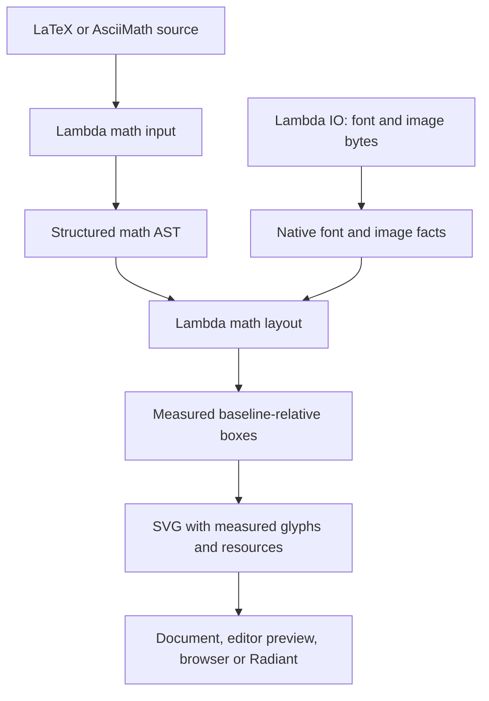

# Lambda Math Package Design

> **Status:** active design; consolidated and checked against the source tree on
> 2026-10-10, revision `4c8f7eaae` plus the current AMS horizontal-arrow
> changes. Remaining gaps are recorded in §10.
> **Scope:** static mathematical typesetting through `lambda.doc.math`.
> **Formal linkage:** **D7.2.4** — package namespace and distribution;
> **D7.1.1 / D7.1.2v2** — layering and resource acquisition;
> **D7.4.6 / S12.1.1v2** — declared host-function effects;
> **D4.2.3 / D4.5.2 / D5.4.2–D5.4.4** — context ownership and retention;
> **D7.1.6** — hosts that exclude Radiant. This consolidation changes no formal
> language ruling. The two rules below were user-ratified on 2026-10-10.

> **DESIGN RULE 1 — TeX conformance before visual similarity.**
>
> Every math layout change MUST follow TeX's math-list algorithms and the
> supported command's TeX/LaTeX definition, using the selected font's measured
> data or its explicitly matched TeX companion. Numeric dimensions require a
> cited algorithm, macro, font table, or authored length. Never fit offsets,
> gaps, glyph centering, sizes, or curves to a screenshot, fixture name, or
> expected image. Missing data or constructions remain explicit limitations.
> MathLive, KaTeX, raster diffs, and refreshed goldens are comparison evidence;
> they do not define correct layout. Verify the algorithm independently with
> TeX box/metric evidence and the geometry actually painted across math styles.

> **DESIGN RULE 2 — Do not add fonts to Lambda packages.**
>
> Math support MUST use the existing bundled CMU and KaTeX faces. Do not add
> font files or families, restore STIX, or introduce a font dependency to
> improve comparison images. An explicit TeX composition may reuse existing
> glyphs under Rule 1. A construction that cannot be supplied remains a
> documented limitation. Optional caller-supplied fonts do not change this
> distribution policy. The already approved Computer Modern metric companion
> supplies TeX data; it does not introduce another painted font.

## 1. Purpose and scope

The package transforms a structured math AST into a measured static SVG. It
owns math layout in Lambda Script so document packages and applications can
reuse and extend the same functional transformation. Parsing, resource
acquisition, font inspection, and painting retain their existing host roles.
Production rendering requires neither an external TeX installation nor
MathLive, KaTeX JavaScript, Node.js, or a font CDN.

The supported surface includes mathematical symbols and alphabets, atom
spacing, fractions, scripts, roots, operators and limits, delimiters, accents,
arrays, text, dimensions, colors, boxes, and selected extension commands.
Support has three distinct meanings: preserving the construct's content,
providing a renderable box, and conforming to its TeX layout definition.
The first two do not establish the third. §7 describes the bounded command
surface; §10 identifies incomplete constructions.

Full LaTeX document processing belongs to `lambda.latex`. Arbitrary package
execution, paragraph/page layout, automatic equation numbering, an interactive
math editor, MathML, and speech generation are outside the current renderer's
contract. Existing AsciiMath input can supply the same AST, but a formula
corpus pass does not establish complete AsciiMath or serialization parity.

## 2. Architecture and ownership

**D7.2.4** places document math at `lambda.doc.math`; `lambda.math` remains
the built-in numerical module. The distributed source lives under
`<lambda-home>/package/math/`, currently `lmd/package/math/` in this checkout.
The public renderer is `lambda.doc.math.math`.



| Owner | Responsibility |
|---|---|
| Math input | Parse syntax, retain command distinctions and scoped structure, report parse errors, and perform supported macro expansion. |
| Lambda math package | Select the math profile; propagate styles; classify atoms; compute boxes, glue, assemblies and annotations; emit SVG. |
| Lambda IO | Acquire font/image bytes and resolve resource locations. |
| Native font services | Return selected-face metrics, glyph identity and geometry, and optional OpenType MATH facts. |
| Document/editor integration | Preserve authored source, choose inline/display presentation, and present failures or source fallbacks. |
| Painter | Paint the supplied SVG and resolved fonts without redoing math layout. |

This separation follows **D7.1.1 / D7.1.2v2**: math policy stays in Lambda;
native services supply facts and never fetch package resources on behalf of
the renderer. Font-query results are copied values, not borrowed native
font/document pointers. Context ownership and retained-input lifetimes follow
**D4.2.3 / D4.5.2**. Host modules declare read queries as functions and effectful
operations as procedures under **D7.4.6 / S12.1.1v2**; repeated reads require
a stable font context. A runtime-only host that excludes Radiant cannot supply
these services (**D7.1.6**).

Repeated queries may reuse a validated font snapshot within their owning
evaluation context (**D5.4.2–D5.4.4**). Identity must include ordered resource
bytes and style descriptors; a family name or GC address is insufficient.
Invalid replacement data must not damage a valid snapshot. Fallback handles
belong to their font context and must not cross independent contexts. A cache
is an optimization: uncached queries must have the same results and ownership.
Measurements and painting share font resolution and baseline conventions;
neither introduces a separate shaping engine.

## 3. Input and public contract

### 3.1 Input model

Callers parse source with `parse(source, {type: "math", flavor: "latex"})`
and pass the resulting AST to the renderer. The current production input is
the direct math parser. The retained Tree-sitter grammar is not the production
math parsing path.

The AST distinguishes nuclei, groups, fractions, scripts, delimiters, styles,
text, environments, spacing, and extension constructs. Named arguments and
command identity matter: `\dfrac` differs from `\tfrac`, `\limits` differs
from `\nolimits`, and a group can change an atom's class. Those distinctions
must survive parsing, rendering, and serialization where supported.

Definitions such as `\def` and `\newcommand` use the existing scoped TeX
expansion facility. This is bounded input support, not a promise to run every
TeX primitive or arbitrary LaTeX package. Recovery parsing and unknown
commands also require care: current fallback paths can paint a command name or
its children. Successful SVG emission alone cannot identify an unsupported
command; explicit unsupported-feature reporting remains outstanding.

Plain string input can be rendered as characters; the rendering API does not
implicitly parse such a string as LaTeX. Applications that accept LaTeX must
use the parser first.

### 3.2 Rendering interface

| Public operation | Result |
|---|---|
| `render_box(ast, options)` | Measured box or error. |
| `render_math(ast, options)` | The box's SVG element or error. |
| `render_inline(ast)` | SVG with initial text math style. |
| `render_display(ast)` | SVG with initial display math style. |
| `render_standalone(ast)` | Display SVG; font declarations already travel with the SVG. |
| `render_box_element(box)` | Extract the rendered element from a measured box. |
| `stylesheet(options)` | Compatibility entry point returning an empty string; no external math stylesheet is required. |

A public measured box exposes `element`, `width`, `height`, `depth`, atom
`type`, `italic`, `font_family`, and compatibility fields `skew` and
`max_font_size`. Dimensions are in em. Currently `skew` is zero and
`max_font_size` describes the initial context scale; they are not promises of
complete TeX skew data or a recursive maximum-size calculation.

| Option | Meaning |
|---|---|
| `display` | Choose display mode and initial display rather than text math style. Later style declarations do not change the surrounding AMS display flag. |
| `color` | Root paint color; otherwise inherit `currentColor`. |
| `font_family` | Select a supplied or installed font family; explicit selection bypasses the default bundled profile. |
| `fonts` | Optional binary face snapshots with family, weight and style descriptors. |
| `font_size` | Positive finite CSS pixel size; dimensions returned by the API remain em. The default physical-length conversion uses 16px per em. |
| `base_uri` | Directory used to resolve relative inline-image sources. |

Parse diagnostics, invalid font data, unresolvable requested glyphs, invalid
image requests, and unavailable required constructions must remain visible.
Document previews may preserve source as a fallback; that is an integration
decision, not a successful math layout result.

## 4. Geometry and style model

### 4.1 One measured box

A box has one full-precision advance width, height above its baseline, and
depth below it. Logical dimensions and ink bounds are different facts: TeX
may assign a logical box that differs from the painted outline. Italic
correction, accent attachment, character-versus-compound identity, and atom
class travel with the relevant nucleus.

Horizontal composition sums advances and takes the union of shifted vertical
extents. Vertical composition derives its extents from child boxes and their
baseline shifts. Rules and explicit glue participate in the same measured
geometry. Phantoms, smash and overlap boxes deliberately alter reserved
dimensions without necessarily changing the painted ink.

Parents consume these full-precision dimensions. Numeric formatting happens
only when emitting output; rounded CSS strings must never feed back into
layout. There is one canonical set of dimensions for every parent, including
struts and delimiters. A real overlay belongs in the composed geometry, not
in a correction table for selected examples.

Ordinary glyphs retain their font baseline. Math-axis centering is applied
where TeX specifies it, such as operators, delimiters and `\vcenter`.
For a centered box, height minus depth equals twice the current axis height.
An infinity glyph beside an arrow is therefore resolved through the correct
symbol font; it is not translated to align its ink with the arrow.

### 4.2 Math context

The context carries display, text, script or scriptscript style plus an
independent cramped flag, selected font profile, semantic alphabet, text/math
mode, size, color and resource base. Child contexts inherit this information
and override only what the TeX construct changes. Group boundaries scope
declarations. Style changes must preserve the outer list's atom relationships.

Scripts descend to script then scriptscript style. A display fraction uses
text-style children; smaller fractions descend further. Denominators,
subscripts, radical nuclei and ordinary accent nuclei use cramped style.
Explicit style commands reset cramped state; underline preserves the
surrounding nucleus style. `\mathchoice` chooses exactly one branch from the
current style.

The bundled CM profile uses 70% and 50% script sizes. A supplied MATH font
provides its own percentages; the ordinary-font fallback uses MathML Core
defaults. Size declarations `\tiny` through `\Huge` use the supported
LaTeX/KaTeX size ladder and distinct script sizes, scoped to their group.
Physical size and math style remain separate concepts.

## 5. Fonts and mathematical data

### 5.1 Existing bundled resources

The default profile uses Computer Modern Serif from the existing CMU bundle,
with ordinary italic, bold and bold-italic faces. Existing CMU Sans and
Typewriter support those variants. Existing KaTeX Script, Caligraphic,
Fraktur and AMS faces supply specialist alphabets; Main, AMS and Size faces
supply missing CM symbols and larger operators. Merely having an asset in the
bundle does not mean every one of its constructions is implemented.

Semantic mathematical alphabets are distinct from a font's character map.
Use mathematical Unicode glyphs when the selected face supplies them;
otherwise use the appropriate ordinary style face and its own measurements.
Latin variables and lowercase Greek normally select math italics, uppercase
Greek normally remains upright, and text/named operators use upright text
unless their command specifies otherwise. Font and atom class are separate
choices.

Missing symbols first try the authored bundled symbol families, then the
available platform fallback. Each resolved glyph retains its actual font,
style, advance, bounds and optional MATH facts. Never attach another face's
dimensions to a replacement outline merely to improve a comparison. Platform
fallback can affect portability; see §10.

### 5.2 Three parameter profiles

| Selected profile | Layout parameter source |
|---|---|
| Default bundled CMU | The explicitly approved Computer Modern TeX companion, with actual CMU/KaTeX painted glyph facts. |
| Explicit supplied/installed font with MATH | That selected font's MATH constants and glyph data. |
| Explicit supplied/installed ordinary font | MathML Core fallback constants derived from that font's normal measurements. |

OpenType MATH is optional. The existing CMU/KaTeX resources used by the default
profile lack it. Absence is a capability result, not corrupt font data.
Available MATH data includes constants, italic corrections, accent attachment,
math kerns, designed variants, assembly parts and connector limits. Font data
provides measurements and constraints; the package still owns the layout
algorithm. The test-only Noto Sans Math fixture exercises this path and is
not a production dependency.

For ordinary explicit fonts, fallback parameters use their own x-height,
underline thickness and script offsets under
[MathML Core's layout-constant defaults](https://w3c.github.io/mathml-core/#layout-constants-mathconstants).
They do not borrow CM or Noto MATH constants. This is a documented fallback
profile, not a claim that an arbitrary ordinary font has original TeX math
metrics.

The bundled companion contains the existing original `cmr10`, `cmsy10`,
`cmsy7`, `cmsy5` and `cmex10` TFM resources. It supplies CM math parameters,
the roman parenthesis strut, bracket thickness and supported delimiter variant
chains and recipes. Symbol parameters follow the 10/7/5 selections; the matched
roman profile scales CM10 instead of borrowing unavailable optical-size data.
Plain TeX's tenex
extension parameters remain at their original size across styles. Its use
does not assert that CMU outline bounds equal original CM glyph boxes.
Matched logical metrics are used only for the explicitly identified CM
constructions. Supplied or installed fonts never inherit this companion.
Resource identity, licenses and hashes are recorded in
[font provenance](../lmd/package/math/fonts/SOURCES.md) and
[companion provenance](../lmd/package/math/fonts/tex/PROVENANCE.md).

### 5.3 Stretching contract

Prefer an adequate natural glyph, then the appropriate designed variant or
font assembly. Assemblies use the font's extender parts and valid connector
overlaps; they preserve the heads and other fixed parts. TeX companion
recipes use their own logical joins and integer repeats. Do not confuse a
font assembly with geometric scaling of a complete glyph.

For wide accents, TeX selects the largest designed accent that fits the
nucleus. A finite variant repertoire can limit coverage. Zero-advance
combining marks require their ink origin and attachment data, not an invented
advance width. Missing italic correction, skew or construction data cannot
be recovered by matching a screenshot.

The current ordinary-font path still scales some complete glyph outlines
when construction data is absent and retains the largest variant when no
larger construction exists. Those behaviors are current limitations, not
exceptions to Rule 1. A successful finite box does not certify a TeX delimiter,
radical, brace or accent construction.

## 6. TeX layout requirements

The algorithmic authority is [Knuth's TeX82 source](https://tug.ctan.org/systems/knuth/dist/tex/tex.web)
and *The TeXbook*, Appendix G. LaTeX extensions follow their documented
package definitions. [OpenType MATH](https://learn.microsoft.com/en-us/typography/opentype/spec/math)
defines optional font facts. MathLive and KaTeX remain useful independent
comparisons, including when their rendering differs from TeX.

### 6.1 Atom classes and glue

Math lists distinguish ordinary, operator, binary, relation, opening, closing,
punctuation and inner atoms. Explicit `\mathord`, `\mathop`, `\mathbin`,
`\mathrel`, `\mathopen`, `\mathclose`, `\mathpunct` and `\mathinner`
set the enclosing class without erasing the content. Ordinary grouped
expressions and fractions have ordinary class; a `\left...\right` group
has inner class. Character identity is separately retained where TeX's
single-character rules apply.

Normalize binary atoms sequentially using the preceding normalized atom and
following significant atom, ignoring explicit glue. Unary signs and binary
atoms next to incompatible classes become ordinary. Then apply TeX's spacing
table in the current style's symbol-font quad, with 18mu per quad.

| Left / right | ord | op | bin | rel | open | close | punct | inner |
|---|---|---|---|---|---|---|---|---|
| ord | 0 | t | m* | T* | 0 | 0 | 0 | t* |
| op | t | t | — | T* | 0 | 0 | 0 | t* |
| bin | m* | m* | — | — | m* | — | — | m* |
| rel | T* | T* | — | 0 | T* | 0 | 0 | T* |
| open | 0 | 0 | — | 0 | 0 | 0 | 0 | 0 |
| close | 0 | t | m* | T* | 0 | 0 | 0 | t* |
| punct | t* | t* | — | t* | t* | t* | t* | t* |
| inner | t* | t | m* | T* | t* | 0 | t* | t* |

Here `t`, `m`, `T` mean 3mu, 4mu and 5mu; `*` suppresses the glue in
script/scriptscript style; `—` is an impossible pair after normalization.
Explicit `\,`, `\:`, `\;` and `\!` use mu glue. `\quad`, `\qquad`
and `\enspace` use text-em dimensions rather than shrinking with math style.

AMS modulo commands contribute atoms and glue to the surrounding math list;
boxing the entire command as an ordinary atom loses boundary spacing and
binary normalization. `\bmod` surrounds its binary label with 5mu kerns
and, outside script styles, negative medium glue. With the default 4mu
medium glue this leaves 1mu on each side before normal atom spacing.
`\pod` / `\pmod` prepend 18mu in display mode and 8mu otherwise;
`\mod` prepends 18mu or 12mu respectively. The `mod` label and argument
are separated by 6mu. These mu dimensions use the current symbol-font quad;
the surrounding AMS display flag is inherited through style changes and
arrays. This static renderer does not implement the macros' line-break penalties.

`\mathstrut` follows LaTeX's `\vphantom(` definition: zero advance and
no paint, with the selected parenthesis's height/depth in the current style.
It is distinct from the text strut used by continued fractions. Phantom and
smash commands produce ordinary compound boxes; source atom classes, operator
limit policy, glyph kerns and italic corrections do not survive that boxing.

### 6.2 Scripts and limits

TeX Rule 18 distinguishes a single-character nucleus from a compound box.
The former starts with zero baseline drops; compound drops use the nucleus
extent and the appropriate script-font parameters. Superscript minima depend
on display/text/cramped style. Subscript and coupled-script constraints use
the current math x-height and rule thickness. When both scripts are present,
open the required gap and apply TeX's coupled adjustment, rather than shifting
each independently. Horizontal attachment uses italic correction and, where
available, the selected font's math kerns. Script-space remains a TeX length,
not a percentage chosen from a screenshot.

For the CM/TeX profile, the superscript bottom must be at least one-quarter
of the math x-height above the baseline. A lone subscript's top is bounded
by four-fifths of that x-height. Paired scripts use the paired-subscript
minimum and at least four default rule thicknesses between their boxes;
when opening that gap, TeX's additional coupled adjustment can raise both
scripts to satisfy the superscript-bottom constraint. All these tests use
measured child extents, including descenders and nested constructs. Supplied
MATH fonts provide the corresponding limits through their own constants.

Large operators select designed display variants and center on the math axis.
Named operators retain text-font lettering and operator spacing. Eligible
operators default to stacked limits in display style; integrals normally keep
side scripts. `\limits` and `\nolimits` override that policy. Stacked limits
use the nucleus/annotation widths, italic correction and big-op spacing
parameters. Brace and bracket annotations default to stacked placement in
every style, with explicit `\nolimits` still honored.

### 6.3 Fractions and radicals

TeX Rule 15 selects numerator and denominator styles, baseline shifts and
clearance from style and rule thickness. With a bar, center it on the math
axis and enforce the appropriate clearance on each side. An authored thick
bar uses its own thickness. Without a bar, open the required numerator-to-
denominator gap symmetrically. Center both children to their shared width.
Binomials and generalized fractions retain their declared fences, thickness
and style; null delimiters retain the TeX null-delimiter space.

In the CM/TeX profile, a ruled fraction requires three times its actual bar
thickness of clearance on each side in display style and one thickness in
smaller styles. A ruleless stack requires seven default rule thicknesses
between the children in display style and three otherwise. Initial shifts
come from the profile's numerator/denominator parameters; these clearances
can increase them. Supplied MATH fonts retain their own fraction/stack gap
constants. `\over`, `\atop`, `\choose`, `\brace` and `\brack` share
these semantics with their corresponding structured fraction forms.

AMS `\cfrac` forces display style and inserts a text strut in its numerator.
Its default numerator alignment is centered; `[l]` and `[r]` align the
numerator to the common fraction width. The trailing negative null-delimiter
space allows nested fraction rules to end together. The current text-strut
profile follows the LaTeX 10pt article size ladder: height/depth are 70/30
of the text baseline skip, including inside script math. Custom document
baseline registers and alternative optical-size font selection are not
implied by this profile. The nonstandard `\sixptsize` has no approved text
baseline definition; a continued fraction in that size reports the missing
definition rather than inventing a strut.

Radicals use a cramped nucleus. In the bundled CM companion, TeX82's
`make_radical` requests a sign for the nucleus's height plus depth, the
style-dependent clearance and the default rule thickness. Selection uses the
original symbol-size search, CMEX next-larger chain and, when necessary, its
top/repeat/bottom recipe. Extension pieces retain their natural proportions;
the extension font remains text-sized in every math style.

The selected sign's logical height supplies the vinculum thickness and extra
top clearance. Initial clearance is the default rule thickness plus one
quarter of the symbol x-height in display style, or one quarter of the
default rule thickness otherwise. Add half any positive excess of the sign's
depth over the nucleus extent plus clearance. Align the sign baseline with
the bottom of the vinculum above the nucleus; the sign's logical depth may
extend below the nucleus. These are font/algorithm dimensions, not outline
estimates or image corrections.

An indexed root follows LaTeX/amsmath's default root definition: typeset the
degree in uncramped scriptscript style, precede it by `5mu`, follow it by
`-10mu`, and raise it by `.6 * (height - depth)` of the root box. Preserve
negative kerns, including an empty degree. The full box includes sign,
vinculum, nucleus and degree. Supplied-font MATH construction and configurable
degree adjustments remain separate obligations in §10; geometric scaling of
a complete sign does not establish conformance.

Authored `\rule[raise]{width}{height}` lengths preserve the optional signed
raise independently of the two mandatory dimensions. The raised/lowered
rule's logical height and depth participate in surrounding math construction.

### 6.4 Delimiters

Automatic delimiter sizing measures content above and below the math axis.
For twice the maximum axis-relative extent, TeX's default demand is the
larger of `901/1000` of that extent and the extent minus `5pt`. Selection,
assembly and axis placement use TeX's delimiter rules and the chosen profile.
`\middle` shares its enclosing group's demand.

The bundled profile supports 26 delimiter shapes: parentheses, brackets,
floors, ceilings, braces, angles, single/double bars, slashes, six vertical
arrows, groups and moustaches. Selection searches the small character at the
current math size and successively larger sizes, then the original CMEX
next-larger chain. An extensible recipe takes the minimum integer repeat
count; a middle piece requires equal repeats above and below it. Logical butt
joins preserve curved tips, corners, brace middles and arrowheads. Finite
chains such as angles and slashes retain their largest design when exhausted.
No complete glyph is stretched in these bundled constructions.

Existing KaTeX Main and Size1–Size4 faces paint the matched characters. Their
authored encoding and baseline translations are font facts; reversing those
translations preserves the original CMEX logical coordinates. TeX defines
selection, dimensions, assembly and axis centering. Null delimiters retain
their space and an axis-centered empty box. No font is added to the bundle
(**D7.2.4 / D7.1.2v2**, Rule 2).

All left, right and middle delimiters share the enclosing group's first-pass
demand, which excludes the delimiters themselves. Under
[e-TeX's definition](https://github.com/TeX-Live/texlive-source/blob/trunk/texk/web2c/etexdir/etex.ch),
`\middle` acts as a close atom before the boundary and an open atom after it;
the boundary restores the enclosing math context. Binary normalization and
glue follow those two roles.

Explicit AMS `\big`, `\Big`, `\bigg`, `\Bigg` use a text-style measurement
with 1, 1.5, 2 and 2.5 multiples of 1.2 times the roman parenthesis strut,
including inside scripts. Automatic and explicit construction are independently
checked for all 26 bundled shapes across four styles. This does not certify
unmapped special delimiters, bold profiles or supplied-font assemblies.
The `l`, `r` and `m` suffixes select open, close and relation atom classes;
unsuffixed sized delimiters are ordinary atoms. This spacing policy applies
independently of whether the glyph construction is conforming.

### 6.5 Accents, over/under annotations and brackets

Narrow accents retain natural glyphs. Wide accents use designed variants or
assemblies and the nucleus's attachment point. TeX character accents attach
scripts to the character nucleus where required; compound accents retain
their full box. Overline and underline use their proper rule/gap/extents and
style policies. Above/below annotations reserve their measured space.

Bundled `\widehat` and `\widetilde` follow TeX82's finite CMEX character
lists. Retain the first design for a narrower nucleus; otherwise choose the
last design whose logical width does not exceed the nucleus. Stop at the
third design even for wider content. Use the text-sized extension font in
every style and its x-height to determine vertical attachment. A wider mark
from another font or anisotropic stretching would change this declared
profile. Independent coverage establishes variant selection and placement
over compound/rule nuclei. Character skew and character-specific script
attachment still require the font data and broader checks listed in §10.

The supported `\overbracket` / `\underbracket` definition follows
[mathtools](https://github.com/latex3/mathtools/blob/main/mathtools.dtx):
a display-style nucleus, ends of `.7` times the text symbol font's
x-height, a `.2` x-height gap, and rule thickness `ht(\braceld)`. A profile
without the required TeX extension data reports that limitation. Correct
annotation placement does not validate the separate brace, group, line-
segment or harpoon construction. Verified AMS arrow marks are specified in §6.7.

### 6.6 Closed multiple integrals

The bundled `\oiint` / `\oiiint` fallback is an explicit Lambda TeX
definition, not the STIX/esint glyph definition. Compose the existing
`\iint` / `\iiint` glyph and `\bigcirc` at their natural sizes and
baselines. Center the two rows in their maximum advance width. Shared
vertical phantoms preserve both rows' complete extents; `\vcenter` centers
the resulting union on the math axis. Treat it as a compound
`\mathop...\nolimits`: no character italic correction, side scripts by
default, ordinary stacked-limit rules when explicitly requested.

Display style selects the existing larger integral face. Text/script/
scriptscript and size declarations follow the normal profile. Raw Unicode
closed integrals use the same math-atom behavior. The circle may differ in
shape and coverage from another font's oval; neither glyph scaling nor
fitted offsets are allowed to remove that difference. Explicit fonts keep
their own closed-integral glyphs and data. The executable definition is
[the bundled integral macro](../test/lambda/math/tex_bundled_integrals.tex).

### 6.7 Horizontal arrows and arrow marks

The bundled profile follows
[AMS](https://github.com/latex3/latex2e/blob/develop/required/amsmath/amsmath.dtx)
for `\xrightarrow` and `\xleftarrow`, and
[mathtools](https://github.com/latex3/mathtools/blob/main/mathtools.dtx)
for `\xleftrightarrow`, `\xRightarrow`, `\xLeftarrow` and
`\xLeftrightarrow`. Fillers combine existing arrowhead and minus/equal glyphs
using the package's negative kerns and centered leaders. Heads and repeated
glyphs retain their natural proportions and baselines. Leader counts and
centering follow TeX's scaled-point arithmetic, including rounding at an
exact repeat boundary. Single-line minus boxes are smashed without changing
their ink; double-line equal signs retain their logical boxes.

Labelled arrows are relations with a compound operator nucleus and stacked
limits. Build the filler in display style and measure label demand in explicit
uncramped script style, independently of the surrounding style. Actual upper
and lower labels use the surrounding style's superscript/subscript policy.
Retain each command's distinct measurement and attachment kerns. Mathtools'
double arrows add text-font control spaces even when an authored label is
empty; those spaces participate in width and limit presence. Empty arguments
and nonempty zero-width arguments remain distinct after TeX argument scanning.

The six AMS over/under single-arrow marks use explicit uncramped style for
both the nucleus and filler. Center narrower content within the filler's
minimum width. Above marks follow the macro's vbox with no interline glue;
below marks follow its vtop with `1.3\ex@` clearance. `\ex@` is the nonlinear
text-size-dependent point length defined by
[amsgen](https://github.com/latex3/latex2e/blob/develop/required/amsmath/amsgen.dtx),
not font x-height. Preserve the body's baseline. Unbraced following scripts
attach after the macro's mathchoice; an authored enclosing group instead
receives ordinary compound-nucleus scripts. Character-accent attachment rules
do not apply to these macros.

Independent evidence covers these twelve constructions at the default text
size across all four math styles, with nested/cramped bodies, label presence,
script attachment and leader boundaries. Separate under-arrow cases cover
the nonlinear clearance at 19 physical text sizes with matched scaled fonts.
This does not certify hooks, maps-to,
harpoons, paired reactions, other profiles or named-size combinations (§10).
All constructions remain in the package layer (**D7.2.4**), and font/metric
resources remain acquired through Lambda IO (**D7.1.2v2**).

## 7. Content and extension surface

The following describes current content/structural support. Entries do not
certify every package's spacing, geometry or typography; §10 states the
remaining obligations.

| Area | Supported behavior and boundary |
|---|---|
| Symbols and alphabets | Greek, binary/relation/arrow/AMS symbols, operator names, ordinary and specialist alphabets, and explicit atom classes. Coverage depends on command mapping and available glyphs. |
| Text and mode changes | Scoped text styles, nested text commands, escaped specials, and embedded `$...$` math. Bundled verbatim uses the existing typewriter face and retains delimited source and starred visible spaces. Font requests follow structured commands rather than literal command text. Quote encoding and supplied-MATH-font text selection remain incomplete. |
| Dimensions | Supported `em`, `ex`, `mu`, `pt`, `bp`, `pc`, `in`, `cm`, `mm`, `px`; TeX points and big points remain distinct. Kern dimensions end at their unit and preserve following tokens. |
| Arrays and AMS environments | Matrix families, cases/rcases/dcases, array, smallmatrix, subarray/substack, aligned/alignedat, gathered and related parsed environments; per-column alignment, starred matrix alignment, row gaps and solid/dashed rules. Cells scope infix fractions. This is bounded layout, not arbitrary TeX alignment/register execution. |
| Array style | Small matrices/subarrays use script style; matrices use text style; supported AMS alignment/gathered environments and dcases use display style. Row placement accounts for cell heights/depths and centers the table on the axis. Complete strut/glue/rule derivation remains outstanding. |
| Equation material | Parsed tags and nonprinting controls are retained. Numbering, references and outer display placement belong to the document layer; standalone math has no general line-breaking engine. |
| Row separators | `\\` and `\cr` are structural controls, never painted backslashes. They delimit rows in an alignment; accepting them elsewhere does not promise paragraph line breaking. `\backslash` remains a literal symbol. |
| Annotation arrows | Six labelled single/double arrows and six AMS over/under single-arrow marks follow §6.7. Paired reaction arrows retain upper/lower content. Other hook/head recipes and package-derived reaction spacing remain incomplete. |
| CD diagrams | Rows, arrow direction, labels and equalities are represented. Their current dimensions are not certified against amscd. |
| Boxes and transforms | Phantom variants, smash, overlaps, authored raise/lower dimensions, reflection and axis centering; framed/color boxes and cancel/strike/phase/actuarial forms render. Package-specific padding, stroke and decoration rules still need conformance work. |
| Color | Scoped foreground paint, background and framed-color boxes are represented. Full xcolor expression evaluation and package-register semantics are not established by these paths. |
| Images | Raster `\includegraphics` with width, height, totalheight and alt; intrinsic aspect ratio when width is absent; relative sources use `base_uri`. Bytes are embedded. Invalid sources/options/dimensions return errors. The current `.9em` default and unitless `bp` contract are KaTeX conventions, not full graphicx natural-size semantics. |
| Logos | `\KaTeX` follows its reference macro: uppercase KATEX, reduced A aligned by text metrics, lowered E and authored kerns. Math alphabet/script declarations do not change its text-font policy. Standalone `\TeX` / `\LaTeX` fallbacks are incomplete. |

HTML wrappers/links/data attributes, arbitrary menclose forms, tooltips,
chemistry `\ce` / `\pu`, accessibility representations and editor atom
metadata are not a complete supported feature set. Parsing or retaining a
generic command does not supply its semantics. Reaction-arrow support alone
does not implement mhchem.

## 8. Output and document integration

The SVG's em width and total height come from the measured box; its vertical
alignment is minus the depth. The view box uses the same baseline-relative
geometry, with visible overflow for intentionally protruding ink. It carries
`class="lambda-math"`, `role="math"` and a source title. A source title is a
useful text fallback, not MathML, speech, or a complete accessibility model.

Ordinary encoded glyphs emit SVG text with the exact measured family, weight,
style and size. Used bundled/supplied text faces accompany the SVG as embedded
font declarations. Font-local unencoded variants and assembly pieces use
outlines; rules and other geometry remain vector elements. Installed-font
choices and unresolved platform fallback require matching resources in the
viewer. Full-face embedding trades larger SVGs for portable declared fonts;
font subsetting is not part of the current design.

MathLive class names, vlist DOM structure, CEIL@2 CSS rounding, and historical
`lm_` HTML snapshots are not current output contracts. The renderer requires
no external math stylesheet. Native rasterization should use ordinary text
painting at the final visible size where eligible, while vector export and
transformed/unencoded glyphs preserve geometry.

LaTeX documents, Markdown projections, AMS prose symbols and editor previews
share this renderer. The document model retains authored math source
independently of its rendered projection; generated font declarations must
survive projection sanitization. Editing later can replace the AST and
rerender without making the box tree mutable. Stable atom IDs, source-range
mapping, hit-testing targets, caret/selection and placeholder edit targets
remain future work rather than implied SVG features.

Scrolling and hit testing must not recompute math or change its geometry.
Host caches may retain styles, transforms and glyph geometry within their
document/resource lifetimes. DOM, style, font, layout, dynamic selector state
and animation changes must invalidate the appropriate data. Performance
changes require unchanged painted output and hit targets as well as measured
latency; startup, scroll latency and process time are separate measurements.

## 9. Testing and verification

### 9.1 Separate proof obligations

| Layer | Evidence required | What it does not prove |
|---|---|---|
| Parsing and content | Named arguments, scopes, macros, escapes, rows, source serialization, and actual expected glyphs. | Recognizable content does not establish layout correctness. |
| Focused math regressions | Box dimensions, selected-face facts, painted coordinates, styles, axis relations, limits and error cases. | Assertions that repeat an unsourced production constant do not validate it. |
| Native font tests | Normal/no-MATH and MATH fonts, variants/connectors, malformed data, fallback ownership and snapshot lifetime. | Correct font parsing does not validate a package layout recipe. |
| Formula corpus | Every retained formula renders with finite measured/emitted geometry, valid SVG and no retired markup/external font URL dependency. | No TeX equivalence, complete command coverage, or guarantee that every fallback font is embedded. |
| Independent TeX oracle | Execute the relevant TeX primitives/package definition; inspect boxes, baselines, glue, variants, styles and limits independently. | Different fonts need not have identical absolute advances or raster images. |
| Native PNG comparison | Expected content reaches the real painter; review Lambda/reference/overlay images and recorded provenance. | A low pixel error is neither semantic correctness nor a TeX conformance proof. |
| Document/UI and aggregate gates | Math source, projection, baseline placement, sanitization, resources, scrolling and lifecycle work through actual integrations. | Focused passes do not make a failing aggregate gate green. |

### 9.2 Corpus and regression contracts

The current geometry corpus combines **206 MathLive-derived formulas** and
**715 Lambda-input-derived formulas**, **921 total**, using retained snapshots
as formula data. The baseline registration runs `--fixture-source all`.
The runner currently renders every case in display style; inline, script,
scriptscript and cramped behavior require focused checks. Historical expected
HTML/errors in snapshots are not compared by this smoke gate. Upstream
Jest/Playwright tests still exercise MathLive, not Lambda.

Focused `.ls` tests have corresponding `.txt` expected results. Tests cover
both supplied MATH fonts and ordinary faces, font switching and fallback,
metric/paint agreement, scripts/fractions, atom classes/glue, choices/sizes,
environments, images, text/escapes, transforms, reaction arrows, closed
integrals, logos and document HTML. Font snapshot reuse has separate lifetime
coverage. A golden changes only after checking the intended content and
painted geometry, never as the sole evidence for a fix.

Independent checked-in oracles cover:

- [Core TeX math rules](../test/lambda/math/tex_reference.tex): character and
  compound nuclei, display/text/cramped shifts, fractions, accents, underline,
  mixed styles, operators and symbol baselines.
- [Vertical delimiters and row controls](../test/lambda/math/tex_delimiter_reference.tex):
  six arrows at four explicit sizes, script and automatic selection, and
  nonpainting row-break controls.
- [Closed integrals](../test/lambda/math/tex_integral_reference.tex): the
  documented bundled macro in all styles, size changes and both limit modes.
- [KaTeX logo](../test/lambda/math/tex_logo_reference.tex): text-font selection,
  math styles, alphabet wrappers and size changes.
- [Automated AMS primitive checks](../test/lambda/math/tex_conformance.test.mjs):
  modulo glue and boundary atoms, the parenthesis phantom, sized-delimiter
  spacing and continued-fraction struts/alignment across four styles.
  Execute 260 boxes and 130 relations against installed amsmath/LaTeX,
  including declarations in modulo arguments and their effect on following atoms;
  shipped TeX positions are compared with actual SVG numerator baselines
  and advances. Named-size probes explicitly match the bundled scaled-CM10
  companion profile rather than LaTeX's alternative optical-size fonts.
- [Automated delimiter checks](../test/lambda/math/tex_delimiter_conformance.test.mjs):
  820 cases compare actual TeX box dimensions and shipped DVI component
  positions with measured SVG geometry. They cover all 26 shapes, four styles,
  four explicit sizes, small/large automatic demands, finite-chain exhaustion,
  and cramped, nested, empty and middle-boundary cases. The reference explicitly
  selects the same scaled-CM10 roman and fixed-size CMEX profile. Encoding
  translations are reversed before comparing component baselines; they never
  supply the expected layout. Native PNG checks separately verify intact
  assembled tips, brace middles and joins.
- [Automated radical and wide-accent checks](../test/lambda/math/tex_radical_conformance.test.mjs):
  472 independently shipped TeX boxes cover square/indexed roots, small and
  finite surds, tall assemblies, nested roots/fractions, lowered nuclei,
  empty/lowered degrees and both finite accent chains across all four styles.
  Compare dimensions, component identities, positions, sizes and painted rules;
  the reference retains installed macro/TFM and production-resource hashes.
  Native PNG checks separately exercise all radical pieces, finite accents
  and indices. Rule nuclei isolate the construction from CMU character
  metrics and unavailable italic/skew data; this is not a character-accent
  conformance certificate.
- [Automated horizontal-arrow checks](../test/lambda/math/tex_arrow_conformance.test.mjs):
  692 independently shipped TeX boxes cover the twelve constructions in §6.7,
  empty and nonempty zero-width labels, distinct measurement/attachment styles,
  leader-count boundaries, braced/unbraced scripts and nested/cramped bodies.
  Under-arrow clearance is checked at 19 physical text sizes with explicitly
  matched scaled fonts. Compare component identities, natural sizes, positions,
  dimensions and rules; retain installed macro/TFM and production-resource
  hashes. Eight native PNG cases verify natural heads and continuous shafts.

These are independent TeX executions, not a single complete automated
conformance suite. `\showbox` intentionally emits `! OK` diagnostics and a
nonzero exit status. A valid run must contain the expected cases and no
unexpected TeX errors; shell status alone cannot classify it as passed.
The automated AMS, delimiter, radical and arrow checks use successful
compilation and shipped position records instead of `\showbox`.
They run with the comparison-harness tests;
automatic checking of the older oracles and wider package coverage remain
outstanding. Missing pdfLaTeX is an explicit skip, not conformance evidence.

### 9.3 Raster comparison contract

`make test-mathcmp` uses the separately retained
[KaTeX screenshot corpus](https://github.com/KaTeX/KaTeX/blob/main/test/screenshotter/ss_data.yaml).
It renders formulas through Lambda's public package and native PNG painter,
then compiles a documented pdfLaTeX equivalent and rasterizes it with Poppler.
Both receive fixture macros and the case's display mode. Browser `pre`,
`post` and `styles` remain metadata; this is a formula-only comparison.

Both layouts use a logical 10pt em, including conversion of authored point
lengths. Painting magnifies that em to the default 64 CSS pixels, with the
corresponding DPI in Poppler. The previous harness left Lambda's logical em at
its default 16px while painting at the requested comparison size; its point
lengths therefore differed from the 10pt reference. Those older raster scores
are not directly comparable with the corrected harness.
Crop white margins and search only integer
translation within the configured radius, default 12px per axis. Never resize
or deform images independently. Boundary hits are flagged. The overlay shows
overlapping ink in black, Lambda-only ink in red and reference-only ink in
green. Ink error measures grayscale difference divided by union ink mass;
mismatch fraction counts differing ink pixels above a chosen tolerance.
Neither metric establishes surrounding-text baseline placement.

References translate supported KaTeX syntax into pdfLaTeX and record every
translation with its source span. Installed reference packages/fonts may
differ from production fonts, including the reference-only STIX integral
glyphs; that does not authorize bundling them. Missing reference glyphs and
undefined commands are fatal. Upstream `nolatex` cases are explicit skips.
Without an explicit threshold, a completed comparison is reported for review;
render errors fail, and an optional ink-error threshold adds a visual gate.
Reports retain formulas, translations, executable/corpus hashes, tool
versions, settings, dimensions, offsets, PNG/SVG/PDF artifacts and logs under
`./temp/`. Dependencies are not installed automatically. Setup and individual
case commands are in [the comparison guide](../test/lambda/math/README.md).

### 9.4 Reproduction and current evidence

Use a stable built host; do not replace it during a run. All generated files
belong under `./temp/`. The standard checks are:

```sh
./test/test_lambda_gtest.exe --gtest_filter='AutoDiscovered/*math_test_math_*'
make test-math-corpus
npm test --prefix test/lambda/math
make test-mathcmp ARGS='--case Integrands --case DelimiterSizing --case MathDefaultFonts'
```

For changes to the math package or parser, complete
`make test-lambda-baseline`; native font/layout/painting changes also require
the relevant native tests and `make test-radiant-baseline`, with the Radiant
dimension lint when layout code changes. Test262 remains a separate runtime
gate when runtime work is involved. Aggregate failures retain their own
diagnostics; focused math checks are not an all-green system baseline.

| Evidence as of 2026-10-10 | Result and limits |
|---|---|
| Focused math run after the arrow changes | **30/30**; `temp/math-arrows/focused-final.log`. |
| Full geometry corpus after the arrow changes | **921/921**; `temp/math-arrows/corpus-final.json`. Rendering smoke coverage only. |
| Automated independent AMS/LaTeX relations | **130/130** across **260** TeX boxes; reported `temp/math-conformance-*/evidence.json`. Includes phantom atom classes, middle-boundary binary normalization, shipped numerator positions, source/binary hashes and the installed AMS definition hash. |
| Automated independent delimiter checks | **820/820** TeX boxes and component-position comparisons; reported `temp/math-delimiter-oracle-*/evidence.json`. Includes source/binary and installed TFM hashes. |
| Automated independent radical/accent checks | **472/472** TeX box, component and rule comparisons; `temp/math-radical-oracle-7bgJro/evidence.json`. Includes installed macro/TFM, production resource and source/binary hashes. |
| Automated independent horizontal-arrow checks | **692/692** TeX box, component and rule comparisons; `temp/math-arrow-oracle-IR4bZt/evidence.json`. Includes all four styles and 19 physical text sizes for under-arrow clearance. Installed AMS/amsgen/mathtools, TFM, production-resource and source/binary hashes are retained. |
| Comparison-harness and conformance checks | **2,217/2,217**, no skips; `temp/math-arrows/comparison-tests-final.log`. Includes native painting, logical point-scale checks and pdfLaTeX/Poppler references; no visual-equality claim. |
| Prior independent integral audit | 17 TeX box dumps, **18/18** axis/style/limit relations; retained under `temp/math-closed-integrals/oracle/`. |
| Prior independent delimiter/logo audits | 27 delimiter boxes plus row-control cases; eight logo boxes. Sources above remain reproducible. |
| Lambda baseline after the arrow changes | **6,585/6,586**: input **2,112/2,112**, runtime **4,473/4,474**. The sole failure is the existing `edit_view_only` boolean `disabled` serialization mismatch; its math/projection/source assertions pass. The LaTeX sample corpus completes in this run. `temp/math-arrows/baseline.log`, `baseline-final/` and `verification.json` retain the results and exact host/source provenance. |
| Prior Lambda baseline after the radical changes | **6,583/6,585**: input **2,112/2,112**, runtime **4,471/4,473**. `edit_view_only` fails boolean `disabled` serialization; its math/projection/source assertions pass in that run. `latex_test_latex_phase3_corpus` exceeds the harness's 60-second limit, including when run alone; the previous math package reproduces that timeout on the same host. The earlier source-loss symptom remains unresolved. `temp/math-radicals/baseline.log`, `baseline-initial/`, `latex-timeout-recheck.log` and `latex-head-recheck.log` retain the evidence. |

Older logs from overlapping builds/edits and narrower focused selections are
not substitute aggregate results. The previous 206-case HTML snapshot scores
measure the retired renderer and cannot be compared with today's 921-case
geometry smoke score. Passing comparisons likewise do not mean pixel identity.

For package-specific evidence, the relevant primary definitions include
[amsmath](https://github.com/latex3/latex2e/blob/develop/required/amsmath/amsmath.dtx),
[LaTeX box/alignment primitives](https://github.com/latex3/latex2e/blob/develop/base/ltplain.dtx),
[row-break controls](https://github.com/latex3/latex2e/blob/develop/base/ltspace.dtx),
[logos](https://github.com/latex3/latex2e/blob/develop/base/ltlogos.dtx), and
[KaTeX's comparison template](https://github.com/KaTeX/KaTeX/blob/main/test/screenshotter/test.tex).
Record the exact installed package/resource version with oracle artifacts;
upstream links alone do not pin a reproducible reference.

## 10. Outstanding work

### 10.1 TeX conformance gaps in existing rendering

These are observed design violations or unverified constructions in the
current code, not permission to adopt their present behavior as a new rule.

| Area | Outstanding obligation |
|---|---|
| Remaining horizontal arrows and profiles | Replace hook, maps-to, harpoon and two-headed constructions with the supported package's font-component and glue recipe. Audit named text sizes, bold and supplied-font profiles. The twelve constructions in §6.7 now have independent bundled-profile evidence; correct hook orientation alone does not establish conformance for the remaining paths. |
| Paired reaction arrows | Derive minimum width, shortening, separation and annotation spacing from the supported AMS/mathtools/mhchem definition. Natural heads and content regressions do not validate those dimensions. |
| Remaining delimiters and profiles | Extend beyond the 26 verified bundled delimiter shapes to unmapped special delimiters (`\arrowvert`, `\Arrowvert`, `\bracevert`). Audit named-size/style combinations and bold/supplied-font profiles. |
| Radicals and wide marks | Complete supplied-font MATH radicals and wide constructions, configurable root-degree adjustments, and package-defined braces/groups/line segments. Bundled radicals and finite CMEX hats/tildes have independent construction evidence; character accents still lack required italic/skew data and broader script/nesting coverage. Whole-glyph stretching in the remaining paths is not conforming. |
| Accents and operators | Extend independent coverage of glyph attachment, nested accents, character/compound scripts, large-op selection and side/stacked limits across profiles. The public zero `skew` field is not measured skew support. |
| Arrays, AMS alignments and CD | Derive struts, row/column glue, rule/dash spacing, centering and diagram dimensions from the declared package definitions. Audit optional arguments, ragged rows and unsupported alignment constructs. Current bounded tables are not arbitrary TeX alignment. |
| Macro expansion and document registers | Extend modulo verification to following scripts, nested font/color macros and configurable math-glue registers. Integrate continued fractions with custom document baseline/strut registers and broaden nested/profile coverage. The default AMS glue and argument declaration scope, parenthesis phantom and cfrac alignment/text-strut contracts now have automated independent evidence. |
| Decorations and framed boxes | Complete package-derived poor-man's-bold, strike/cancel, phase and actuarial geometry, box registers, bbox/enclose options and border/padding policy. Authored raise/reflection/vcenter support is not a certificate for these decorations. |
| Text and quotes | Complete literal paired-quote/font-encoding behavior and text/typewriter selection with supplied MATH fonts. Preserve text/math scoping and escapes while adding typography coverage. Bundled verbatim typewriter selection is independently covered by content/font and native-paint checks. |
| Logos, color and images | Complete standalone `\TeX` / `\LaTeX`; audit xcolor expressions/scoping and graphicx natural-size semantics. Keep the current bounded image convention explicit. |

For each family, establish its command definition and available font data,
then verify the resulting box/glue/assembly behavior with independent TeX and
native painting in display, text, script and scriptscript styles, including
cramped and nested cases. Rules 1 and 2 apply throughout. A recognizable
shape, reduced raster diff, or green smoke count cannot close these items.

### 10.2 Coverage and verification gaps

- Make unsupported commands, generic AST fallthrough and unavailable
  constructions explicit; prevent fallback command text from being counted
  as implemented math. Separate expected parse failures from render success.
- Extend corpus checks beyond forced display style and structural validity:
  expected glyph content, inline baselines, all math styles, profile changes,
  actual font-resource availability and painted geometry need coverage.
- Extend repeatable independent TeX relations beyond the automated AMS
  primitives, bundled delimiters, radicals, finite wide accents and horizontal
  arrows; integrate the older box oracles and additional package macros.
  The present checks remain narrower than a comprehensive conformance suite.
- Verify full document/editor source preservation and generated-font
  sanitization through UI paths. `edit_view_only` still fails boolean-attribute
  serialization. Its math/projection/source assertions pass in the current
  run, but earlier full-context imports lost inter-formula text while a
  standalone import/export succeeded; an older HEAD run also recorded a source
  round-trip failure. Identify the cause of this intermittent loss before
  changing goldens or claiming source preservation. Diagnose the historical
  full LaTeX sample-corpus timeout, which also reproduced with the preceding
  math package. That corpus completes in the current baseline, but this does
  not establish the timeout's cause or resolution. Neither an all-green
  baseline nor complete UI verification is claimed here.
- Bound platform-font fallback and standalone portability. A smoke check for
  external font URLs does not prove every resolved platform face is embedded.
  Ordinary-font measurements also retain the host's shaping limitations.
- Broaden native painting, font-lifetime, installed-font, Linux and Windows
  coverage before claiming cross-platform equivalence. Performance evidence
  must use release binaries, matched artifacts and separate startup/scroll
  measurements; historic macOS improvements are not a portable performance gate.

### 10.3 Deferred product scope

Full MathML/speech output, stable atom/source mappings, placeholders and math
editing, arbitrary HTML integration commands, general chemistry, complete
AsciiMath/LaTeX serialization parity and equation line breaking remain
separate design work. None follows automatically from static SVG coverage.
Any expansion must preserve the existing resource boundary and the two
prominent rules.

## Appendix A. Brief implementation history

This document replaces `Lambda_Pkg_Math2.md`, `Lambda_Pkg_Math3.md`,
`Lambda_Pkg_Math4.md`, `Lambda_Pkg_Math4_PhaseA_Roadmap.md` and
`Lambda_Pkg_Math5.md`, as well as the original proposal/progress log formerly
in this file. Git history retains their detailed implementation records.

| Period | Design progression |
|---|---|
| Initial package and enhancement work | Established Lambda-side static math, shared AST/document integration, symbols/styles/environments, and a MathLive-derived test mirror. The original ~~MathLive-compatible span/CSS output~~ goal later became measured SVG. |
| Math3 and Math4, through 2026-06-18 | Expanded the formula corpus from 206 to 921 and exposed the limits of case-tuned constants. Rule 15/18 and full-precision composition replaced major fraction/script tables. Historical HTML parity reached about 825/921, a different metric from the current smoke gate. |
| Math5 box convergence | Removed competing raw/render/strut extent channels as producers acquired real measured boxes. The useful invariant is one full-precision box; ~~MathLive DOM and CEIL@2 emission as authority~~ was superseded. |
| 2026-10-08–2026-10-09 | Moved production geometry to actual font facts with optional MATH, existing CMU/KaTeX distribution and supplied-font support. Removed STIX and the legacy MathLive renderer/tables/styles. SVG text with embedded fonts replaced ordinary-glyph outline-only painting. |
| 2026-10-09 | Added context-owned font snapshot reuse and corrected native SVG scrolling/hit-test cache lifetimes. Release comparisons retained output/target evidence; those host optimizations did not change math policy. |
| 2026-10-09–2026-10-10 | Approved the CM TeX companion; audited scripts, fractions, spacing, accents, operators and delimiters against TeX. Added native PNG/pdfLaTeX comparison infrastructure and restored several missing command families. The later audit explicitly rejected successful rendering as sufficient conformance evidence. |
| 2026-10-10 | Ratified TeX-first layout and no-new-font rules. Fixed CM symbol fallback, bracket annotation policy/geometry, vertical-arrow sizing, structural row separators and uppercase KaTeX logo handling. Removed the attempted STIX reintroduction and defined closed multiple integrals through existing-glyph TeX composition. Unsourced extension geometry remains listed in §10. |
| 2026-10-10 consolidation | Replaced six overlapping proposals/roadmaps with this current design, bounded support contract, verification model and outstanding-work section. Historical plans, file inventories, tuning constants and implementation anecdotes are omitted. |
| 2026-10-10 AMS primitive continuation | Replaced fixed modulo/strut behavior with AMS/LaTeX definitions, completed continued-fraction alignment/text struts, sized-delimiter classes and ordinary phantom boxing, and restored bundled verbatim's typewriter selection. Added repeatable TeX box/position relations; broader construction and document-register work remains outstanding. |
| 2026-10-10 delimiter continuation | Replaced bundled delimiter scaling with original TeX variant/assembly selection, completed middle-boundary demand and atom behavior, and restored parenthesis aliases. Added independent DVI geometry and native assembly checks. Corrected the comparison harness's logical point scale; existing Size3/Size4 fonts were reused without adding resources. |
| 2026-10-10 radical continuation | Replaced bundled whole-surd stretching with TeX's variant/extension and rule construction, restored default indexed-root kern/raise behavior, and selected finite CMEX hats/tildes. Preserved signed optional rule raises. Added shared independent DVI/rule geometry and native radical/accent checks, reusing the existing fonts and metric files. |
| 2026-10-10 arrow continuation | Replaced six labelled-arrow and six over/under-arrow approximations with AMS/mathtools glyph-leader, style, label and alignment definitions. Preserved TeX's optional-argument and following-script behavior. Added independent leader-boundary geometry and native shaft-continuity checks without adding fonts or metrics. |
