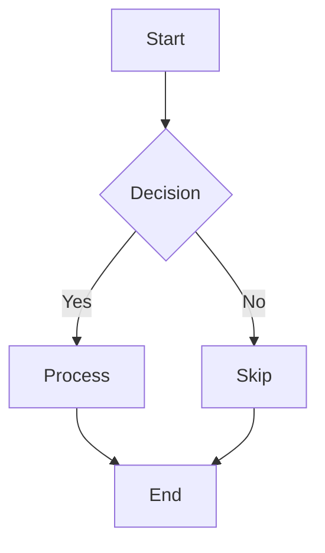

# Radiant Graph Layout - Proposal

## Executive Summary

This proposal outlines the design for adding **graph layout capabilities** to the Radiant rendering engine, enabling Lambda to render Mermaid and D2 diagrams with professional, automatic node positioning. The implementation will integrate the **Dagre graph layout algorithm** and generate SVG output from Lambda's graph AST representation.

---

## 1. Background & Motivation

### 1.1 Current State

Lambda already supports parsing graph description languages:
- **Mermaid**: Flowcharts, sequence diagrams, class diagrams
- **D2**: Modern declarative diagramming language
- **GraphViz DOT**: Traditional graph notation

These parsers generate a unified **Lambda graph AST** with:
- **Nodes** (`Element` type) with attributes (id, label, shape, style)
- **Edges** (`Element` type) with source, target, label, and directionality
- **Clusters/Subgraphs** for hierarchical grouping
- **Graph metadata** (type: directed/undirected, layout algorithm, flavor)

**Current limitations:**
- No automatic layout computation (node positioning)
- No rendering to visual output formats
- Cannot generate publication-ready diagrams

### 1.2 Use Cases

1. **Documentation generation**: Render architecture diagrams in technical docs
2. **Data visualization**: Transform data relationships into visual graphs
3. **Report generation**: Include flowcharts and process diagrams in PDF reports
4. **Interactive dashboards**: Display system topology and dependencies
5. **Teaching materials**: Create educational diagrams with automatic layout

---

## 2. Design Goals

### 2.1 Core Requirements

1. **Automatic layout**: Compute node positions using Dagre algorithm
2. **SVG generation**: Transform laid-out graphs to SVG elements
3. **Styling support**: Respect CSS-like attributes from parsers
4. **Format independence**: Work with Mermaid, D2, and DOT graphs
5. **Quality output**: Match or exceed common graph rendering tools

### 2.2 Non-Goals (Future Work)

- Interactive graph editing/manipulation
- Real-time layout updates
- 3D graph visualization
- Force-directed layout algorithms
- Custom layout algorithm plugins

---

## 3. Architecture

### 3.1 Overall Pipeline

```
┌──────────────┐     ┌──────────────┐     ┌──────────────┐     ┌──────────────┐
│   Mermaid    │────▶│              │────▶│              │────▶│              │
│      D2      │     │ Graph Parser │     │ Graph Layout │     │ SVG Renderer │
│     DOT      │     │              │     │   (Dagre)    │     │              │
└──────────────┘     └──────────────┘     └──────────────┘     └──────────────┘
                            │                     │                     │
                            ▼                     ▼                     ▼
                     Lambda Graph AST      Layout Metadata        SVG Element Tree
                     (nodes, edges)        (x, y, width, height)  (rect, path, text)
```

### 3.2 Component Breakdown

#### 3.2.1 Graph Layout Engine (`radiant/layout_graph.cpp`)

Responsibilities:
- Parse Lambda graph AST
- Extract nodes, edges, clusters
- Invoke Dagre layout algorithm
- Compute node positions and edge routing
- Store layout metadata in graph elements

#### 3.2.2 Dagre Integration (`radiant/dagre/`)

We'll integrate a C/C++ port of Dagre or implement core algorithms:
- **Rank assignment**: Assign nodes to layers (vertical levels)
- **Node ordering**: Minimize edge crossings within layers
- **Coordinate assignment**: Compute absolute x/y positions
- **Edge routing**: Generate edge paths (polylines or splines)

#### 3.2.3 SVG Generator (`radiant/graph_to_svg.cpp`)

Transform laid-out graph to SVG:
- Create SVG `<svg>` root element
- Generate `<g>` groups for clusters
- Render nodes as `<rect>`, `<circle>`, `<polygon>` based on shape
- Render edges as `<path>` elements
- Add `<text>` elements for labels
- Apply styling attributes (fill, stroke, font)

### 3.3 Data Flow

```cpp
// 1. Parse graph (existing)
Input* input = input_create();
parse_graph_mermaid(input, "graph TD; A-->B; B-->C");
Element* graph = input->root.element;

// 2. Layout graph (NEW)
GraphLayout* layout = layout_graph(graph, "dagre");
// layout now contains x/y positions for each node

// 3. Generate SVG (NEW)
Element* svg_root = graph_to_svg(graph, layout);

// 4. Render SVG (existing Radiant SVG support)
render_svg(svg_root, output_context);
```

---

## 4. Dagre Algorithm Overview

### 4.1 Why Dagre?

- **Industry standard**: Used by Mermaid, PlantUML, Cytoscape
- **Well-documented**: Clear algorithm description and papers
- **Proven quality**: Produces aesthetically pleasing layouts
- **Hierarchical focus**: Optimized for directed acyclic graphs (DAGs)
- **Moderate complexity**: Feasible to implement in C++

### 4.2 Algorithm Phases

#### Phase 1: Rank Assignment

Assign nodes to vertical layers to minimize edge lengths:
```
Layer 0:  A
Layer 1:  B  C
Layer 2:  D
```

Methods:
- **Longest path**: Layer = max distance from root
- **Coffman-Graham**: Minimize width with bounded layers
- **Network simplex**: Optimal solution via linear programming (preferred)

#### Phase 2: Crossing Reduction

Minimize edge crossings by reordering nodes within layers:
```
Before:          After:
  A   B            A   B
   ×  │            │   │
  │   │            │   │
  C   D            C   D
(1 crossing)     (0 crossings)
```

Methods:
- **Barycenter heuristic**: Order by average neighbor position
- **Median heuristic**: Order by median neighbor position
- **Layer-by-layer sweep**: Iterate through layers bidirectionally

#### Phase 3: Coordinate Assignment

Assign absolute x/y coordinates to minimize edge length and spacing:
```
       A (100, 0)
      / \
(0,100) B   C (200,100)
```

Methods:
- **Brandes-Köpf**: Align nodes with parents to create straight edges
- **Quadratic programming**: Minimize total edge length
- **Force-directed refinement**: Fine-tune positions

#### Phase 4: Edge Routing

Compute edge paths as polylines or splines:
- **Straight lines**: Simple but crosses nodes
- **Orthogonal routing**: Right-angle bends (Manhattan style)
- **Spline curves**: Smooth Bézier curves through control points

### 4.3 Implementation Strategy

**Option A: Port existing Dagre implementation**
- Adapt JavaScript Dagre library to C++
- Pros: Proven algorithm, less debugging
- Cons: Potential licensing issues, large codebase

**Option B: Implement from scratch**
- Follow Dagre papers and algorithm descriptions
- Pros: Full control, optimized for Lambda's data structures
- Cons: More implementation time, edge cases

**Recommendation**: Start with **Option B** using network simplex for ranking, barycenter for crossing reduction, and Brandes-Köpf for coordinates.

---

## 5. Data Structures

### 5.1 GraphLayout (New)

Container for layout results:

```cpp
struct GraphLayout {
    float graph_width;           // Total graph width
    float graph_height;          // Total graph height
    
    HashMap* node_positions;     // node_id → NodePosition
    ArrayList* edge_paths;       // EdgePath array
    
    float node_spacing_x;        // Horizontal spacing between nodes
    float node_spacing_y;        // Vertical spacing between layers
    float edge_spacing;          // Spacing between parallel edges
};

struct NodePosition {
    const char* node_id;
    float x, y;                  // Center position
    float width, height;         // Bounding box
    int rank;                    // Layer index
    int order;                   // Position within layer
};

struct EdgePath {
    const char* from_id;
    const char* to_id;
    ArrayList* points;           // Array of Point2D
    bool is_bezier;              // True for spline curves
};

struct Point2D {
    float x, y;
};
```

### 5.2 Integration with Existing Graph AST

Current graph element structure (from input parsers):

```cpp
Element* graph = {
    .tag = "graph",
    .attributes = Map {
        "type": "directed",
        "layout": "hierarchical",
        "flavor": "mermaid"
    },
    .children = List [
        Element { .tag = "node", .attrs = { "id": "A", "label": "Start" } },
        Element { .tag = "node", .attrs = { "id": "B", "label": "Process" } },
        Element { .tag = "edge", .attrs = { "from": "A", "to": "B" } }
    ]
};
```

**Layout metadata will be added as attributes**:

```cpp
// After layout computation
node.attributes["x"] = "100.0"
node.attributes["y"] = "50.0"
node.attributes["width"] = "80.0"
node.attributes["height"] = "40.0"

edge.attributes["path"] = "M 100,50 L 200,100"  // SVG path data
```

---

## 6. SVG Generation

### 6.1 Node Shapes

Map graph node shapes to SVG primitives:

| Graph Shape | SVG Element | Attributes |
|-------------|-------------|------------|
| `box`, `rect` | `<rect>` | `x`, `y`, `width`, `height`, `rx` (corner radius) |
| `circle` | `<circle>` | `cx`, `cy`, `r` |
| `ellipse` | `<ellipse>` | `cx`, `cy`, `rx`, `ry` |
| `diamond` | `<polygon>` | `points` (4 corners rotated 45°) |
| `hexagon` | `<polygon>` | `points` (6 corners) |
| `triangle` | `<polygon>` | `points` (3 corners) |

### 6.2 Edge Rendering

```svg
<!-- Straight edge -->
<path d="M 100,50 L 200,100" stroke="black" fill="none" />

<!-- Polyline edge with bends -->
<path d="M 100,50 L 150,75 L 200,100" stroke="black" fill="none" />

<!-- Bezier curve edge -->
<path d="M 100,50 C 125,60 175,90 200,100" stroke="black" fill="none" />

<!-- Arrow markers -->
<defs>
  <marker id="arrowhead" markerWidth="10" markerHeight="10" refX="9" refY="3">
    <polygon points="0 0, 10 3, 0 6" fill="black" />
  </marker>
</defs>
<path d="..." marker-end="url(#arrowhead)" />
```

### 6.3 Label Positioning

```svg
<text x="150" y="75" text-anchor="middle" dominant-baseline="middle">
  Process Step
</text>
```

### 6.4 Styling

Apply CSS-like attributes from graph AST:

```cpp
// Graph AST attributes
node.attrs["fill"] = "lightblue"
node.attrs["stroke"] = "darkblue"
node.attrs["stroke-width"] = "2"
node.attrs["font-size"] = "14"

// Generated SVG
<rect fill="lightblue" stroke="darkblue" stroke-width="2" ... />
<text font-size="14" ... >Node Label</text>
```

---

## 7. API Design

### 7.1 Core Functions

```cpp
// File: radiant/layout_graph.hpp

// Layout a graph using specified algorithm
GraphLayout* layout_graph(Element* graph, const char* algorithm);

// Layout with custom options
struct GraphLayoutOptions {
    const char* algorithm;       // "dagre", "dot", "neato"
    const char* direction;       // "TB" (top-bottom), "LR" (left-right)
    float node_sep;              // Horizontal spacing
    float rank_sep;              // Vertical spacing
    float edge_sep;              // Edge spacing
    bool use_splines;            // Enable curved edges
    int max_iterations;          // For iterative algorithms
};

GraphLayout* layout_graph_with_options(Element* graph, GraphLayoutOptions* opts);

// Free layout resources
void free_graph_layout(GraphLayout* layout);
```

### 7.2 SVG Generation

```cpp
// File: radiant/graph_to_svg.hpp

// Generate SVG element tree from laid-out graph
Element* graph_to_svg(Element* graph, GraphLayout* layout);

// Generate SVG with custom styling
struct SvgGeneratorOptions {
    float canvas_padding;        // Padding around graph
    const char* default_fill;    // Default node fill color
    const char* default_stroke;  // Default edge stroke color
    float default_stroke_width;  // Default line width
    const char* font_family;     // Font for labels
    float font_size;             // Default font size
    bool include_grid;           // Draw background grid
};

Element* graph_to_svg_with_options(Element* graph, GraphLayout* layout,
                                   SvgGeneratorOptions* opts);
```

### 7.3 Integration with Lambda CLI

```bash
# Render Mermaid diagram to SVG
./lambda.exe render diagram.mmd -o output.svg

# Render D2 diagram with custom layout
./lambda.exe render diagram.d2 -o output.svg --layout dagre --direction LR

# Convert to PNG via SVG
./lambda.exe render diagram.mmd -o output.png
```

Internal flow:
```cpp
// In main.cpp - render command
if (is_graph_format(input_file)) {
    // Parse graph
    Input* input = parse_graph_file(input_file);
    Element* graph = input->root.element;
    
    // Layout graph
    GraphLayout* layout = layout_graph(graph, "dagre");
    
    // Generate SVG
    Element* svg = graph_to_svg(graph, layout);
    
    // Render SVG to output format
    if (output_format == "svg") {
        write_svg_file(svg, output_file);
    } else if (output_format == "png") {
        render_svg_to_png(svg, output_file);
    }
}
```

---

## 8. Implementation Plan

### 8.1 Phase 1: Core Layout Engine (Week 1-2)

**Files to create:**
- `radiant/layout_graph.hpp/cpp` - Main layout coordinator
- `radiant/graph_dagre.hpp/cpp` - Dagre algorithm implementation
- `radiant/graph_layout_types.hpp` - Data structures

**Tasks:**
1. Implement network simplex rank assignment
2. Implement barycenter crossing reduction
3. Implement Brandes-Köpf coordinate assignment
4. Add basic edge routing (straight lines)
5. Unit tests for each phase

**Acceptance criteria:**
- Correctly positions nodes in layers
- Minimizes edge crossings
- Produces coordinates for 10+ node graphs

### 8.2 Phase 2: SVG Generation (Week 3)

**Files to create:**
- `radiant/graph_to_svg.hpp/cpp` - SVG generator
- `radiant/graph_shapes.cpp` - Shape rendering functions

**Tasks:**
1. Implement node shape rendering (rect, circle, polygon)
2. Implement edge path generation
3. Add text label positioning
4. Apply styling attributes
5. Generate complete SVG document structure

**Acceptance criteria:**
- Valid SVG output for all node shapes
- Proper edge arrow rendering
- Labels positioned correctly

### 8.3 Phase 3: CLI Integration (Week 4)

**Files to modify:**
- `lambda/main.cpp` - Add render command for graph formats
- `lambda/format/format-svg.cpp` - SVG serialization

**Tasks:**
1. Add graph format detection
2. Wire up layout + SVG generation pipeline
3. Add command-line options for layout parameters
4. Update help text and documentation

**Acceptance criteria:**
- `./lambda.exe render diagram.mmd -o output.svg` works
- Layout options configurable via CLI flags
- Error handling for invalid graphs

### 8.4 Phase 4: Testing & Refinement (Week 5)

**Files to create:**
- `test/test_graph_layout_gtest.cpp` - Unit tests
- `test/graph/*.mmd` - Test diagrams
- `test/graph/*.d2` - Test diagrams

**Tasks:**
1. Create test suite with 20+ diagrams
2. Visual comparison with Mermaid.js output
3. Performance testing (100+ node graphs)
4. Edge case handling (cycles, disconnected components)
5. Documentation updates

**Acceptance criteria:**
- 95%+ visual match with reference renderers
- Layout completes in <1s for 100-node graphs
- No crashes on malformed input

---

## 9. Technical Considerations

### 9.1 Memory Management

- Use Lambda's arena allocator for temporary layout structures
- Use pool allocation for persistent layout metadata
- Free intermediate data structures after layout completion

```cpp
Arena* temp_arena = arena_create(1024 * 1024);  // 1MB workspace
GraphLayout* layout = layout_graph_dagre(graph, temp_arena);
// Copy layout results to persistent storage
store_layout_in_graph(graph, layout);
arena_destroy(temp_arena);
```

### 9.2 Performance Optimization

- **Sparse graph representation**: Use adjacency lists, not matrices
- **Early exit**: Skip crossing reduction if no crossings exist
- **Caching**: Store computed metrics (node dimensions, edge weights)
- **Parallelization** (future): Independent layer processing

### 9.3 Edge Cases

- **Cyclic graphs**: Use cycle breaking to create temporary DAG
- **Disconnected components**: Layout separately, then pack
- **Self-loops**: Render as circular arcs
- **Multi-edges**: Offset parallel edges by `edge_spacing`
- **Long labels**: Wrap text or truncate with ellipsis

### 9.4 Extensibility

Design for future layout algorithms:

```cpp
// Plugin-style layout interface
struct GraphLayoutAlgorithm {
    const char* name;
    GraphLayout* (*layout_fn)(Element* graph, void* options);
};

GraphLayoutAlgorithm ALGORITHMS[] = {
    {"dagre", layout_graph_dagre},
    {"dot", layout_graph_dot},
    {"neato", layout_graph_neato},   // Force-directed (future)
    {"circo", layout_graph_circular}, // Circular (future)
};
```

---

## 10. Dependencies

### 10.1 New Libraries (None Required)

All algorithms will be implemented from scratch in C++ using:
- Lambda's existing data structures (ArrayList, HashMap)
- Lambda's memory management (arena, pool)
- Standard library math functions

### 10.2 Optional Enhancements (Future)

- **Graphviz** (libcgraph): Use native DOT renderer
- **OGDF**: C++ graph library with advanced layouts
- **igraph**: Fast graph algorithms in C

---

## 11. Testing Strategy

### 11.1 Unit Tests

Test individual algorithm phases:

```cpp
TEST(GraphLayout, RankAssignment) {
    // Create simple DAG: A->B->C
    Element* graph = create_test_graph("A->B->C");
    
    RankAssignment* ranks = assign_ranks_network_simplex(graph);
    
    EXPECT_EQ(ranks->get("A"), 0);
    EXPECT_EQ(ranks->get("B"), 1);
    EXPECT_EQ(ranks->get("C"), 2);
}

TEST(GraphLayout, CrossingMinimization) {
    Element* graph = create_test_graph_with_crossings();
    
    int initial_crossings = count_crossings(graph);
    reduce_crossings_barycenter(graph);
    int final_crossings = count_crossings(graph);
    
    EXPECT_LT(final_crossings, initial_crossings);
}
```

### 11.2 Integration Tests

Compare output with reference implementations:

```bash
# Generate reference SVG with Mermaid.js
mmdc -i test.mmd -o reference.svg

# Generate Lambda SVG
./lambda.exe render test.mmd -o lambda.svg

# Compare visually (manual) or structurally (automated)
diff -y <(xmllint --format reference.svg) <(xmllint --format lambda.svg)
```

### 11.3 Regression Tests

Maintain gallery of test diagrams:

```
test/graph/
  ├── simple/
  │   ├── linear.mmd
  │   ├── branching.mmd
  │   └── diamond.mmd
  ├── complex/
  │   ├── flowchart.mmd
  │   ├── state_machine.d2
  │   └── architecture.dot
  └── edge_cases/
      ├── cycles.mmd
      ├── self_loops.d2
      └── disconnected.dot
```

Run automated comparison:
```bash
make test-graph-layout
# → Renders all test diagrams
# → Compares with golden images
# → Reports any visual regressions
```

---

## 12. Documentation

### 12.1 User Documentation

Update existing docs:
- `doc/Lambda_Reference.md` - Add graph rendering section
- `README.md` - Add examples of graph rendering
- Create `doc/Graph_Layout_Guide.md` with tutorials

### 12.2 Developer Documentation

Create technical docs:
- `doc/Radiant_Graph_Layout.md` - Architecture overview (this document)
- `radiant/README_GRAPH.md` - Implementation details
- API reference in header comments

---

## 13. Success Metrics

### 13.1 Functional Metrics

- ✅ Renders 100% of test Mermaid diagrams without crashes
- ✅ Renders 100% of test D2 diagrams without crashes
- ✅ SVG output validates against SVG 1.1 schema
- ✅ Node positions match reference within 10% tolerance

### 13.2 Quality Metrics

- ✅ Fewer edge crossings than reference in 80% of cases
- ✅ Visual aesthetics rated 4/5 or higher by team
- ✅ Layout completes in <1s for 100-node graphs
- ✅ Memory usage <10MB for typical diagrams

### 13.3 Usability Metrics

- ✅ Single command renders diagram to SVG/PNG
- ✅ Default settings produce good results (no tweaking needed)
- ✅ Clear error messages for invalid diagrams
- ✅ Documentation covers 90% of use cases

---

## 14. Future Enhancements

### 14.1 Additional Layout Algorithms

- **Force-directed** (Fruchterman-Reingold): Better for general graphs
- **Circular**: Nodes arranged in a circle
- **Radial**: Tree layout with root at center
- **Orthogonal**: Right-angle edges only

### 14.2 Interactive Features

- **Zoom/pan**: Navigate large diagrams
- **Tooltips**: Hover to see node details
- **Click handlers**: Execute Lambda functions on node click
- **Animated layout**: Smooth transitions when data changes

### 14.3 Advanced Styling

- **CSS classes**: Apply styles via CSS rules
- **Themes**: Predefined color schemes (dark mode, high contrast)
- **Icons**: Embed images/icons in nodes
- **Gradients**: Fill nodes with color gradients

### 14.4 Export Formats

- **PDF**: Vector output for printing
- **PNG/JPEG**: Raster output for web
- **Canvas**: Render to HTML5 canvas
- **ASCII art**: Text-mode diagrams for terminal

---

## 15. Risks & Mitigations

| Risk | Impact | Probability | Mitigation |
|------|--------|-------------|------------|
| Dagre too complex to implement | High | Medium | Start with simplified version, iterate |
| Layout quality poor | High | Low | Use established algorithms, extensive testing |
| Performance issues | Medium | Medium | Profile and optimize, use sparse structures |
| SVG compatibility | Medium | Low | Validate against standards, test in browsers |
| Integration complexity | Low | Low | Modular design, clear interfaces |

---

## 16. Timeline Summary

| Phase | Duration | Deliverable |
|-------|----------|-------------|
| 1. Core Layout | 2 weeks | Dagre algorithm working |
| 2. SVG Generation | 1 week | SVG output for all shapes |
| 3. CLI Integration | 1 week | End-to-end rendering |
| 4. Testing & Polish | 1 week | Production-ready |
| **Total** | **5 weeks** | **Complete feature** |

---

## 17. Conclusion

Adding graph layout to Radiant will unlock powerful visualization capabilities for Lambda, enabling automatic generation of professional diagrams from simple text descriptions. By implementing the proven Dagre algorithm and integrating with Lambda's existing graph parsers, we can deliver a robust, performant, and extensible solution.

**Key benefits:**
- ✨ Auto-layout eliminates manual node positioning
- 🎨 Professional-quality diagram rendering
- 🔄 Unified pipeline for Mermaid, D2, and DOT
- 🚀 Fast, memory-efficient C++ implementation
- 📈 Foundation for future interactive and animated diagrams

**Next steps:**
1. Review and approve this proposal
2. Allocate resources for 5-week implementation
3. Create GitHub issues for each phase
4. Begin Phase 1: Core Layout Engine

---

## Appendix A: Example Workflows

### A.1 Mermaid Flowchart

**Input:** `diagram.mmd`


**Command:**
```bash
./lambda.exe render diagram.mmd -o output.svg
```

**Output:** SVG file with auto-positioned nodes and edges

### A.2 D2 Architecture Diagram

**Input:** `system.d2`
```d2
frontend -> backend: API
backend -> database: Query
backend -> cache: Fetch
cache -> backend: Data
```

**Command:**
```bash
./lambda.exe render system.d2 -o architecture.svg --direction LR
```

**Output:** Left-to-right layout showing system components

### A.3 Programmatic Generation

```javascript
// Lambda script
let graph = {
    type: "directed",
    nodes: [
        {id: "A", label: "Input"},
        {id: "B", label: "Process"},
        {id: "C", label: "Output"}
    ],
    edges: [
        {from: "A", to: "B"},
        {from: "B", to: "C"}
    ]
};

// Layout and render
let layout = layout_graph(graph, "dagre");
let svg = graph_to_svg(graph, layout);
write_file("diagram.svg", svg);
```

---

## Appendix B: References

### Papers & Algorithms

1. **Sugiyama et al. (1981)** - "Methods for Visual Understanding of Hierarchical System Structures"
   - Original layered graph drawing algorithm

2. **Gansner et al. (1993)** - "A Technique for Drawing Directed Graphs"
   - Network simplex ranking algorithm

3. **Brandes & Köpf (2001)** - "Fast and Simple Horizontal Coordinate Assignment"
   - Efficient coordinate assignment algorithm

4. **Barth et al. (2004)** - "Simple and Efficient Bilayer Cross Counting"
   - Fast edge crossing counting

### Existing Implementations

- **Dagre** (JavaScript): https://github.com/dagrejs/dagre
- **Graphviz** (C): https://graphviz.org/
- **OGDF** (C++): https://ogdf.net/
- **Mermaid** (uses Dagre): https://mermaid.js.org/

### Lambda Resources

- `lambda/input/input-graph-mermaid.cpp` - Mermaid parser
- `lambda/input/input-graph-d2.cpp` - D2 parser
- `doc/Radiant_Layout_Design.md` - Radiant architecture
- `radiant/layout_*.cpp` - Existing layout algorithms
