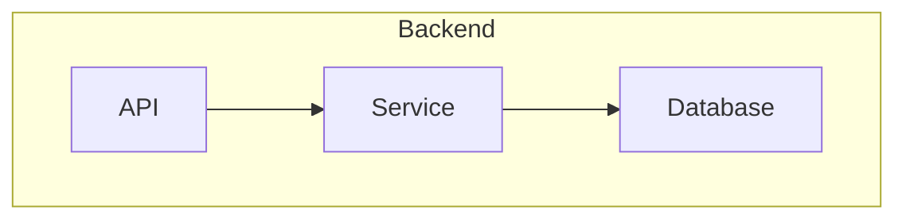

# Radiant Graph Layout - Lessons from beautiful-mermaid

## Implementation Progress

| Phase | Status | Completed |
|-------|--------|-----------|
| 1. Edge Post-Processing | ✅ Complete | Feb 2026 |
| 2. Theme System | ✅ Complete | Feb 2026 |
| 3. Complete Shapes | ✅ Complete | Feb 2026 |
| 4. Subgraph Support | ✅ Complete | Feb 2026 |
| 5. ASCII Output | 🔲 Not Started | — |
| 6. State Diagrams | 🔲 Not Started | — |
| 7. Sequence Diagrams | 🔲 Not Started | — |

**Progress**: 4/7 phases complete (57%)

---

## Executive Summary

This document analyzes the `beautiful-mermaid` library (located in `./beautiful-mermaid`) and compares it with Lambda's current Mermaid graph support. The goal is to identify features and techniques that can improve our graph rendering quality.

**Key finding**: `beautiful-mermaid` is a complete, production-ready Mermaid rendering solution with several features Lambda should adopt, particularly in theming, edge post-processing, and shape coverage.

---

## 1. Architecture Comparison

### beautiful-mermaid Pipeline

```
Mermaid Text → Parser → Layout (Dagre) → Post-processing → Renderer → SVG/ASCII
                          │                    │
                     dagre.js            Edge snapping,
                                         Shape clipping
```

### Lambda Pipeline (Current)

```
Mermaid Text → Parser → Layout (Dagre) → Renderer → SVG
                          │
                   graph_dagre.cpp
                   (missing post-processing)
```

### Key Differences

| Aspect | beautiful-mermaid | Lambda |
|--------|-------------------|--------|
| Language | TypeScript | C++ |
| Layout Engine | dagre.js (npm) | Custom Dagre implementation |
| Post-processing | Comprehensive | Missing |
| Theming | CSS custom properties | Hardcoded colors |
| Output formats | SVG + ASCII | SVG only |

---

## 2. Features beautiful-mermaid Does Better

### 2.1 Theming System (Major Gap)

beautiful-mermaid has an elegant **two-color foundation**:

```typescript
// Just provide bg/fg, everything else derives automatically
const svg = await renderMermaid(diagram, {
  bg: '#1a1b26',
  fg: '#a9b1d6',
})
```

**Implementation details** (from `src/theme.ts`):

```typescript
export const MIX = {
  text:         100, // just use --fg directly
  textSec:      60,  // fg mixed at 60%
  textMuted:    40,  // fg mixed at 40%
  line:         30,  // edge/connector lines
  arrow:        50,  // arrow head fill
  nodeFill:     3,   // node fill tint
  nodeStroke:   20,  // node/group stroke
  groupHeader:  5,   // group header band tint
  innerStroke:  12,  // inner divider strokes
}
```

**CSS custom properties enable runtime theme switching:**

```css
:root {
  --bg: #1a1b26;
  --fg: #a9b1d6;
  --_text: var(--fg);
  --_text-sec: color-mix(in srgb, var(--fg) 60%, var(--bg));
  --_line: color-mix(in srgb, var(--fg) 30%, var(--bg));
  /* ... */
}
```

**15 built-in themes**: Tokyo Night, Nord, Dracula, Catppuccin, GitHub, Solarized, etc.

**Shiki integration**: Extract colors from any VS Code theme.

**Lambda's current state**: `graph_to_svg.cpp` uses hardcoded colors:
```cpp
opts->default_fill = "lightblue";
opts->default_stroke = "black";
```

**Recommendation**: Add a theme system:

```cpp
// radiant/graph_theme.hpp
struct DiagramTheme {
    const char* name;
    const char* bg;
    const char* fg;
    // Optional enrichment (auto-derive if null)
    const char* line;
    const char* accent;
    const char* muted;
    const char* surface;
    const char* border;
};

// Predefined themes
extern const DiagramTheme THEME_ZINC_DARK;
extern const DiagramTheme THEME_TOKYO_NIGHT;
extern const DiagramTheme THEME_NORD;
extern const DiagramTheme THEME_DRACULA;
// ...

// Color derivation
const char* derive_color(const char* fg, const char* bg, int mix_percent);
```

---

### 2.2 ASCII/Unicode Output (Completely Missing)

beautiful-mermaid offers **dual output modes**:

```typescript
const ascii = renderMermaidAscii('graph LR; A --> B --> C')
```

Output:
```
┌───┐     ┌───┐     ┌───┐
│   │     │   │     │   │
│ A │────►│ B │────►│ C │
│   │     │   │     │   │
└───┘     └───┘     └───┘
```

**Implementation** (in `src/ascii/`):
- `canvas.ts` - 2D character grid abstraction
- `grid.ts` - Node placement on grid
- `pathfinder.ts` - A* algorithm for edge routing
- `draw.ts` - Box drawing with Unicode characters
- `converter.ts` - Parse result to ASCII graph structure

**Character sets**:
```typescript
// ASCII mode
const ASCII = { tl: '+', tr: '+', bl: '+', br: '+', h: '-', v: '|', arrow: '>' }

// Unicode mode
const UNICODE = { tl: '┌', tr: '┐', bl: '└', br: '┘', h: '─', v: '│', arrow: '►' }
```

**Direction handling**: BT layouts are drawn as TD then flipped vertically with character remapping.

**Recommendation**: Add ASCII output support:

```bash
./lambda.exe render diagram.mmd -o output.txt --ascii
./lambda.exe render diagram.mmd -o output.txt --unicode
```

---

### 2.3 Complete Node Shape Support (12 vs ~5)

beautiful-mermaid supports **all 12 Mermaid flowchart shapes**:

| Shape | Syntax | beautiful-mermaid | Lambda |
|-------|--------|:-----------------:|:------:|
| Rectangle | `[text]` | ✅ | ✅ |
| Rounded | `(text)` | ✅ | ✅ (as ellipse) |
| Diamond | `{text}` | ✅ | ✅ |
| Stadium | `([text])` | ✅ | ❌ |
| Circle | `((text))` | ✅ | ✅ |
| Subroutine | `[[text]]` | ✅ | ❌ |
| Double Circle | `(((text)))` | ✅ | ❌ |
| Hexagon | `{{text}}` | ✅ | ❌ |
| Cylinder | `[(text)]` | ✅ | ❌ |
| Asymmetric | `>text]` | ✅ | ✅ (as pentagon) |
| Trapezoid | `[/text\]` | ✅ | ❌ |
| Inverse Trapezoid | `[\text/]` | ✅ | ❌ |

**Parser patterns** (from `src/parser.ts`):

```typescript
// Shape detection regex patterns
const SHAPE_PATTERNS = [
  { regex: /^\[\[(.+)\]\]$/, shape: 'subroutine' },
  { regex: /^\(\(\((.+)\)\)\)$/, shape: 'doublecircle' },
  { regex: /^\(\((.+)\)\)$/, shape: 'circle' },
  { regex: /^\(\[(.+)\]\)$/, shape: 'stadium' },
  { regex: /^\[\((.+)\)\]$/, shape: 'cylinder' },
  { regex: /^\{\{(.+)\}\}$/, shape: 'hexagon' },
  { regex: /^>(.+)\]$/, shape: 'asymmetric' },
  { regex: /^\[\/(.+)\\]$/, shape: 'trapezoid' },
  { regex: /^\[\\(.+)\/]$/, shape: 'trapezoid-alt' },
  // ...
]
```

**Recommendation**: Update `input-graph-mermaid.cpp` to parse all shapes:

```cpp
// Determine shape from delimiter patterns
if (open == '[' && tracker.peek(1) == '[') {
    shape = "subroutine";  // [[text]]
} else if (open == '(' && tracker.peek(1) == '(' && tracker.peek(2) == '(') {
    shape = "doublecircle";  // (((text)))
} else if (open == '(' && tracker.peek(1) == '(') {
    shape = "circle";  // ((text))
} else if (open == '(' && tracker.peek(1) == '[') {
    shape = "stadium";  // ([text])
} else if (open == '[' && tracker.peek(1) == '(') {
    shape = "cylinder";  // [(text)]
} else if (open == '{' && tracker.peek(1) == '{') {
    shape = "hexagon";  // {{text}}
}
// ...
```

---

### 2.4 Complete Edge Styles (6 vs ~3)

| Edge | Syntax | beautiful-mermaid | Lambda |
|------|--------|:-----------------:|:------:|
| Solid arrow | `-->` | ✅ | ✅ |
| Dotted arrow | `-.->` | ✅ | ✅ |
| Thick arrow | `==>` | ✅ | ❌ |
| No arrow solid | `---` | ✅ | ❌ |
| No arrow dotted | `-.-` | ✅ | ❌ |
| Bidirectional | `<-->` | ✅ | ❌ |
| Bidirectional dotted | `<-.->` | ✅ | ❌ |
| Bidirectional thick | `<==>` | ✅ | ❌ |

**Data structure** (from `src/types.ts`):

```typescript
export interface MermaidEdge {
  source: string
  target: string
  label?: string
  style: EdgeStyle  // 'solid' | 'dotted' | 'thick'
  hasArrowStart: boolean
  hasArrowEnd: boolean
}
```

**Recommendation**: Extend Lambda's edge parsing and rendering to support all variants.

---

### 2.5 Dagre Edge Post-Processing (Critical Detail)

beautiful-mermaid's `src/dagre-adapter.ts` contains crucial post-processing that makes edges look professional:

#### 2.5.1 Orthogonal Snapping

Dagre outputs edges that may have diagonal segments. `snapToOrthogonal()` converts them to 90° bends:

```typescript
export function snapToOrthogonal(points: Point[], verticalFirst = true): Point[] {
  if (points.length < 2) return points

  const result: Point[] = [points[0]!]

  for (let i = 1; i < points.length; i++) {
    const prev = result[result.length - 1]!
    const curr = points[i]!

    const dx = Math.abs(curr.x - prev.x)
    const dy = Math.abs(curr.y - prev.y)

    // If already axis-aligned, keep as-is
    if (dx < 1 || dy < 1) {
      result.push(curr)
      continue
    }

    // Insert an L-bend
    if (verticalFirst) {
      result.push({ x: prev.x, y: curr.y })
    } else {
      result.push({ x: curr.x, y: prev.y })
    }
    result.push(curr)
  }

  return removeCollinear(result)
}
```

#### 2.5.2 Diamond Shape Clipping

Dagre treats all nodes as rectangles. For diamond shapes, edges connect to the rectangle boundary but the visual diamond is inscribed within:

```typescript
export function clipToDiamondBoundary(
  point: Point,
  cx: number, cy: number,
  hw: number, hh: number,
): Point {
  const dx = point.x - cx
  const dy = point.y - cy
  if (Math.abs(dx) < 0.5 && Math.abs(dy) < 0.5) return point

  // Diamond boundary: |dx|/hw + |dy|/hh = 1
  const scale = 1 / (Math.abs(dx) / hw + Math.abs(dy) / hh)
  return { x: cx + scale * dx, y: cy + scale * dy }
}
```

#### 2.5.3 Circle Shape Clipping

```typescript
export function clipToCircleBoundary(
  point: Point,
  cx: number, cy: number,
  r: number,
): Point {
  const dx = point.x - cx
  const dy = point.y - cy
  const dist = Math.sqrt(dx * dx + dy * dy)
  if (dist < 0.5) return point

  const scale = r / dist
  return { x: cx + scale * dx, y: cy + scale * dy }
}
```

#### 2.5.4 Collinear Point Removal

```typescript
function removeCollinear(pts: Point[]): Point[] {
  if (pts.length < 3) return pts
  const out: Point[] = [pts[0]!]

  for (let i = 1; i < pts.length - 1; i++) {
    const a = out[out.length - 1]!
    const b = pts[i]!
    const c = pts[i + 1]!

    const sameX = Math.abs(a.x - b.x) < 1 && Math.abs(b.x - c.x) < 1
    const sameY = Math.abs(a.y - b.y) < 1 && Math.abs(b.y - c.y) < 1
    if (sameX || sameY) continue  // Skip redundant middle point

    out.push(b)
  }
  out.push(pts[pts.length - 1]!)
  return out
}
```

**Recommendation**: Port these functions to C++ in `radiant/graph_edge_utils.cpp`:

```cpp
// radiant/graph_edge_utils.hpp

// Convert diagonal edges to orthogonal (90°) segments
void snap_to_orthogonal(ArrayList* points, bool vertical_first);

// Clip edge endpoint to diamond boundary
Point2D clip_to_diamond_boundary(Point2D point, float cx, float cy, float hw, float hh);

// Clip edge endpoint to circle boundary
Point2D clip_to_circle_boundary(Point2D point, float cx, float cy, float r);

// Remove collinear intermediate points
void remove_collinear_points(ArrayList* points);
```

---

### 2.6 Subgraph Direction Overrides

beautiful-mermaid handles nested subgraphs with different directions:



**Two-pass layout strategy** (from `src/layout.ts`):

1. **Pre-compute**: Layout direction-overridden subgraphs separately
2. **Inject**: Insert as fixed-size placeholder in main layout
3. **Merge**: Combine positioned results

```typescript
interface PreComputedSubgraph {
  id: string
  label: string
  width: number
  height: number
  nodes: PositionedNode[]
  edges: PositionedEdge[]
  groups: PositionedGroup[]
  nodeIds: Set<string>
  internalEdgeIndices: Set<number>
}
```

**Recommendation**: Add subgraph support to `layout_graph.cpp` with similar two-pass approach.

---

### 2.7 Diagram Type Coverage (5 vs 1)

| Diagram Type | beautiful-mermaid | Lambda |
|--------------|:-----------------:|:------:|
| Flowchart | ✅ | ✅ |
| State Diagram | ✅ | ❌ |
| Sequence Diagram | ✅ | ❌ |
| Class Diagram | ✅ | ❌ |
| ER Diagram | ✅ | ❌ |

Each diagram type has its own pipeline in beautiful-mermaid:
- `src/sequence/` - Parser, layout, renderer for sequence diagrams
- `src/class/` - Parser, layout, renderer for class diagrams
- `src/er/` - Parser, layout, renderer for ER diagrams

**State diagrams** reuse the flowchart pipeline with special handling for `[*]` start/end pseudostates.

---

### 2.8 Text Measurement Strategy

beautiful-mermaid uses font metric estimation without DOM:

```typescript
// styles.ts
export function estimateTextWidth(text: string, fontSize: number, fontWeight: number): number {
  // Inter average character widths as fraction of fontSize, per weight
  const widthRatio = fontWeight >= 600 ? 0.58 : fontWeight >= 500 ? 0.55 : 0.52
  return text.length * fontSize * widthRatio
}

export function estimateMonoTextWidth(text: string, fontSize: number): number {
  // Monospace fonts have uniform character width
  return text.length * fontSize * 0.6
}
```

**Constants calibrated for Inter font**:
```typescript
export const FONT_SIZES = {
  nodeLabel: 13,
  edgeLabel: 11,
  groupHeader: 12,
}

export const FONT_WEIGHTS = {
  nodeLabel: 500,
  edgeLabel: 400,
  groupHeader: 600,
}

export const TEXT_BASELINE_SHIFT = '0.35em'  // Vertical centering
```

---

## 3. What Lambda Does Well (Keep These)

1. **C++ Performance**: Lambda's implementation will be faster than TypeScript
2. **ThorVG Integration**: Direct SVG rendering without browser dependency
3. **Unified Input System**: Graph parsing fits into existing `input/` architecture
4. **Memory Management**: Arena/pool allocation is more efficient than JS GC
5. **Cross-platform**: Single binary for macOS/Linux/Windows

---

## 4. Implementation Plan

### Phase 1: Edge Post-Processing (P0) — ✅ COMPLETE

**Goal**: Make edges look professional

**Files created/modified**:
- `radiant/graph_edge_utils.hpp` - Header for edge utilities
- `radiant/graph_edge_utils.cpp` - Implementation
- `radiant/layout_graph.cpp` - Integrated post-processing after layout

**Completed**:
- ✅ Ported `snapToOrthogonal()` to C++
- ✅ Ported `clipToDiamondBoundary()` to C++
- ✅ Ported `clipToCircleBoundary()` to C++
- ✅ Ported `removeCollinear()` to C++
- ✅ Integrated into Dagre layout pipeline

### Phase 2: Theme System (P1) — ✅ COMPLETE

**Goal**: Support multiple color themes

**Files created**:
- `radiant/graph_theme.hpp` - Theme data structures
- `radiant/graph_theme.cpp` - Theme definitions and color derivation

**Completed**:
- ✅ Defined `DiagramTheme` structure with bg, fg, derived colors
- ✅ Implemented color mixing/derivation using hex color math
- ✅ Added 11 predefined themes: zinc-dark, zinc-light, tokyo-night, nord, dracula, catppuccin-mocha, catppuccin-latte, github-dark, github-light, solarized-dark, solarized-light
- ✅ Updated `graph_to_svg.cpp` to use themed colors
- ✅ Added CLI option: `--theme <name>` (e.g., `--theme tokyo-night`)

### Phase 3: Complete Shape Support (P1) — ✅ COMPLETE

**Goal**: Support all 12 Mermaid shapes

**Files modified**:
- `lambda/input/input-graph-mermaid.cpp` - Parser updates
- `radiant/graph_to_svg.cpp` - Renderer updates

**Completed**:
- ✅ Updated parser to recognize all shape syntaxes
- ✅ Added SVG rendering for all 12 shapes: box, rounded, diamond, circle, stadium, subroutine, doublecircle, hexagon, cylinder, asymmetric, trapezoid, trapezoid-alt

### Phase 4: Subgraph Support (P2) — ✅ COMPLETE

**Goal**: Support nested subgraphs with direction overrides

**Files modified**:
- `lambda/input/input-graph-mermaid.cpp` - Subgraph parsing with `subgraph ID [Label]...end` syntax
- `lambda/input/input-graph.cpp` - Fixed capacity handling in `add_node_to_graph()`, `add_edge_to_graph()`, `add_cluster_to_graph()`
- `radiant/layout_graph.cpp` - Recursive node/edge/subgraph extraction, subgraph bounds computation
- `radiant/graph_to_svg.cpp` - Render subgraph boxes with themed header bars and labels

**Completed**:
- ✅ Parse `subgraph ID [optional label]...end` blocks
- ✅ Parse `direction LR/TB/BT/RL` overrides inside subgraphs
- ✅ Support nested subgraphs (subgraphs within subgraphs)
- ✅ Extract nodes and edges recursively from subgraph hierarchy
- ✅ Render subgraph boxes with rounded corners, header bar, and label
- ✅ Apply themed colors to subgraph boxes

### Phase 5: ASCII Output (P2) — 🔲 NOT STARTED

**Goal**: Terminal-friendly diagram output

**Files to create**:
- `radiant/graph_to_ascii.hpp` - Header
- `radiant/graph_to_ascii.cpp` - Implementation
- `radiant/ascii_canvas.hpp/cpp` - 2D character grid
- `radiant/ascii_pathfinder.hpp/cpp` - A* edge routing

### Phase 6: State Diagram Support (P3) — 3 days

**Goal**: Support `stateDiagram-v2` syntax

**Tasks**:
1. Add parser for state diagram syntax
2. Handle `[*]` start/end pseudostates
3. Handle composite states

### Phase 7: Sequence Diagram Support (P3) — 5 days

**Goal**: Support `sequenceDiagram` syntax

**Tasks**:
1. Create sequence diagram parser
2. Implement column-based timeline layout
3. Render actors, lifelines, messages, activations

---

## 5. C++ Port of Critical Functions

### 5.1 Orthogonal Snapping

```cpp
// radiant/graph_edge_utils.cpp

#include "graph_edge_utils.hpp"
#include "../lib/arraylist.h"
#include <stdlib.h>
#include <math.h>

void snap_to_orthogonal(ArrayList* points, bool vertical_first) {
    if (points->length < 2) return;

    ArrayList* result = arraylist_new(points->length * 2);
    Point2D* first = (Point2D*)points->data[0];

    Point2D* first_copy = (Point2D*)malloc(sizeof(Point2D));
    *first_copy = *first;
    arraylist_append(result, first_copy);

    for (int i = 1; i < points->length; i++) {
        Point2D* prev = (Point2D*)result->data[result->length - 1];
        Point2D* curr = (Point2D*)points->data[i];

        float dx = fabsf(curr->x - prev->x);
        float dy = fabsf(curr->y - prev->y);

        // Already axis-aligned
        if (dx < 1.0f || dy < 1.0f) {
            Point2D* curr_copy = (Point2D*)malloc(sizeof(Point2D));
            *curr_copy = *curr;
            arraylist_append(result, curr_copy);
            continue;
        }

        // Insert L-bend
        Point2D* bend = (Point2D*)malloc(sizeof(Point2D));
        if (vertical_first) {
            bend->x = prev->x;
            bend->y = curr->y;
        } else {
            bend->x = curr->x;
            bend->y = prev->y;
        }
        arraylist_append(result, bend);

        Point2D* curr_copy = (Point2D*)malloc(sizeof(Point2D));
        *curr_copy = *curr;
        arraylist_append(result, curr_copy);
    }

    // Replace original with result
    for (int i = 0; i < points->length; i++) {
        free(points->data[i]);
    }
    arraylist_clear(points);

    for (int i = 0; i < result->length; i++) {
        arraylist_append(points, result->data[i]);
    }
    arraylist_free(result);

    // Remove collinear points
    remove_collinear_points(points);
}
```

### 5.2 Diamond Boundary Clipping

```cpp
Point2D clip_to_diamond_boundary(Point2D point, float cx, float cy, float hw, float hh) {
    float dx = point.x - cx;
    float dy = point.y - cy;

    // Point at center
    if (fabsf(dx) < 0.5f && fabsf(dy) < 0.5f) {
        return point;
    }

    // Diamond boundary: |dx|/hw + |dy|/hh = 1
    float scale = 1.0f / (fabsf(dx) / hw + fabsf(dy) / hh);

    Point2D result;
    result.x = cx + scale * dx;
    result.y = cy + scale * dy;
    return result;
}
```

### 5.3 Circle Boundary Clipping

```cpp
Point2D clip_to_circle_boundary(Point2D point, float cx, float cy, float r) {
    float dx = point.x - cx;
    float dy = point.y - cy;
    float dist = sqrtf(dx * dx + dy * dy);

    // Point at center
    if (dist < 0.5f) {
        return point;
    }

    float scale = r / dist;

    Point2D result;
    result.x = cx + scale * dx;
    result.y = cy + scale * dy;
    return result;
}
```

### 5.4 Collinear Point Removal

```cpp
void remove_collinear_points(ArrayList* points) {
    if (points->length < 3) return;

    ArrayList* result = arraylist_new(points->length);
    arraylist_append(result, points->data[0]);

    for (int i = 1; i < points->length - 1; i++) {
        Point2D* a = (Point2D*)result->data[result->length - 1];
        Point2D* b = (Point2D*)points->data[i];
        Point2D* c = (Point2D*)points->data[i + 1];

        bool same_x = fabsf(a->x - b->x) < 1.0f && fabsf(b->x - c->x) < 1.0f;
        bool same_y = fabsf(a->y - b->y) < 1.0f && fabsf(b->y - c->y) < 1.0f;

        if (same_x || same_y) {
            // Skip redundant middle point
            free(points->data[i]);
            continue;
        }

        arraylist_append(result, points->data[i]);
    }

    // Keep last point
    arraylist_append(result, points->data[points->length - 1]);

    // Replace original
    arraylist_clear(points);
    for (int i = 0; i < result->length; i++) {
        arraylist_append(points, result->data[i]);
    }
    arraylist_free(result);
}
```

---

## 6. Timeline Summary

| Phase | Est. Duration | Status | Deliverable |
|-------|---------------|--------|-------------|
| 1. Edge Post-Processing | 2 days | ✅ Complete | Professional-looking edges |
| 2. Theme System | 3 days | ✅ Complete | 11 color themes |
| 3. Complete Shapes | 2 days | ✅ Complete | All 12 Mermaid shapes |
| 4. Subgraph Support | 4 days | ✅ Complete | Nested groups with directions |
| 5. ASCII Output | 5 days | 🔲 Pending | Terminal-friendly diagrams |
| 6. State Diagrams | 3 days | 🔲 Pending | `stateDiagram-v2` support |
| 7. Sequence Diagrams | 5 days | 🔲 Pending | `sequenceDiagram` support |
| **Total** | **24 days** | **57%** | **4/7 phases complete** |

---

## 7. References

### beautiful-mermaid Source Files

| File | Purpose |
|------|---------|
| `src/parser.ts` | Mermaid text parser |
| `src/layout.ts` | Dagre integration and subgraph handling |
| `src/renderer.ts` | SVG generation |
| `src/dagre-adapter.ts` | Edge post-processing (critical) |
| `src/theme.ts` | CSS custom properties theming |
| `src/styles.ts` | Font metrics and constants |
| `src/types.ts` | TypeScript type definitions |
| `src/ascii/index.ts` | ASCII rendering entry point |
| `src/sequence/` | Sequence diagram pipeline |
| `src/class/` | Class diagram pipeline |
| `src/er/` | ER diagram pipeline |

### Lambda Source Files

| File | Purpose |
|------|---------|
| `lambda/input/input-graph-mermaid.cpp` | Mermaid parser |
| `radiant/layout_graph.cpp` | Layout coordinator |
| `radiant/graph_dagre.cpp` | Dagre algorithm |
| `radiant/graph_to_svg.cpp` | SVG generation |

---

## 8. Conclusion

beautiful-mermaid sets a high bar for Mermaid rendering quality. By adopting its key techniques—especially edge post-processing and theming—Lambda can achieve professional-quality diagram output while maintaining its performance and cross-platform advantages.

**Priority order**:
1. **Edge post-processing** — Immediate visual impact, fixes broken-looking edges
2. **Theme system** — Professional appearance, user customization
3. **Complete shapes** — Parser and renderer updates for full Mermaid compatibility
4. **Subgraphs** — Common in real-world diagrams
5. **ASCII output** — CLI/terminal use case
6. **Additional diagram types** — Sequence, state, class, ER diagrams
