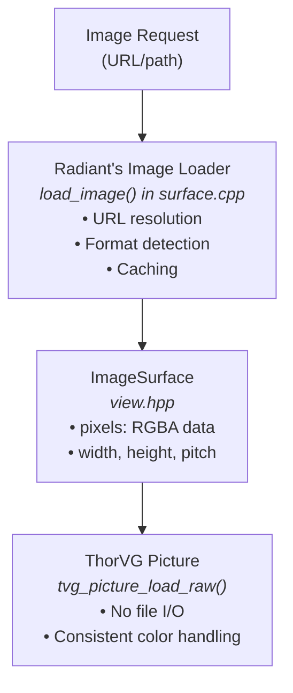

# ThorVG Integration Upgrade Proposal

**Author:** Copilot
**Date:** January 2026
**Status:** Implementation Complete

---

## Executive Summary

This proposal outlines an upgrade to the ThorVG integration in the Radiant layout and rendering engine. The upgrade encompasses:

1. **Version Update**: Migrate from ThorVG v1.0-pre11 to v1.0-pre34
2. **Build System Updates**: Modify `setup-*-deps.sh` scripts to build the new version with TTF loader support
3. **SVG `<text>` Element Support**: Leverage ThorVG's TTF loader to render text within inline SVG
4. **Unified Image Loading**: Integrate Radiant's image loading infrastructure with ThorVG instead of using ThorVG's built-in image loaders

---

## 1. Background & Current State

### Current ThorVG Version: v1.0-pre11

The Radiant engine currently uses ThorVG v1.0-pre11 for:
- Vector graphics rendering (shapes, paths, gradients)
- SVG file loading and rendering
- Background image rendering with vector graphics support

**Current Build Configuration:**
```bash
# macOS/Linux
-Dengines=sw,gl
-Dloaders=svg,png,jpg
-Dsavers=
-Dbindings=capi

# Windows
-Dengines=sw
-Dloaders=all
-Dsavers=tvg
-Dbindings=capi
```

### Current Limitations

1. **No TTF Loader**: ThorVG is built without `-Dloaders=ttf`, limiting SVG text rendering capabilities
2. **SVG `<text>` Not Implemented**: The inline SVG renderer at [render_svg_inline.cpp](../radiant/render_svg_inline.cpp) logs `<text> element not yet implemented`
3. **Dual Image Loading Paths**: Both ThorVG's loaders and Radiant's custom image loading coexist, leading to potential inconsistencies
4. **Outdated Version**: Missing 23 releases worth of bug fixes, performance improvements, and new features

---

## 2. ThorVG v1.0-pre34 Release Highlights

### Key Improvements Since v1.0-pre11

**Engine Improvements:**
- Text spacing functions (`Text::spacing()`)
- ~10% FPS improvement in GL backend via stencil optimization
- ~25% reduction in GL/ES uniform buffer memory usage
- Enhanced arc tessellation stability
- WebGPU renderer improvements and bug fixes
- CPU renderer stability improvements

**SVG/Lottie Improvements:**
- Proper `xml:space` attribute support in `<text>` elements
- Fixed class declaration duplication issues
- Improved Lottie rounded corners rendering
- Better `wiggle` effect alignment with After Effects

**API Additions:**
```cpp
// C++ API
Result Text::spacing(float letter, float line)

// C API
Tvg_Result tvg_text_spacing(Tvg_Paint text, float letter, float line)
```

**Repository Changes:**
- Examples moved to separate repository (smaller footprint)

---

## 3. Upgrade Plan

### 3.1 Version Upgrade: v1.0-pre11 → v1.0-pre34

**Release Tag:** `v1.0-pre34`
**Commit:** `54a98e42813a84d3ac2314b818725f9eea8b1658`
**Release URL:** https://github.com/thorvg/thorvg/releases/tag/v1.0-pre34

### 3.2 Build System Updates

#### New Build Configuration

All platforms will use a unified configuration with TTF support:

```bash
meson setup builddir \
    --buildtype=release \
    --default-library=both \
    --prefix="$INSTALL_PREFIX" \
    -Dengines=sw,gl \
    -Dloaders=svg,ttf \
    -Dsavers= \
    -Dbindings=capi \
    -Dtools= \
    -Dtests=false \
    -Dsimd=true \
    -Dthreads=true
```

**Key Changes:**
| Option | Old Value | New Value | Rationale |
|--------|-----------|-----------|-----------|
| `-Dloaders` | `svg,png,jpg` | `svg,ttf` | Enable TTF for text; remove image loaders (use Radiant's) |
| `-Dsimd` | (default off) | `true` | Performance optimization |
| `-Dthreads` | (default on) | `true` | Multi-threaded rendering |

**Image Loader Removal Rationale:**
- ThorVG's PNG/JPG loaders duplicate Radiant's existing image loading
- Radiant already handles PNG, JPEG, GIF via `lib/image.h` (stb_image)
- Removing ThorVG's image loaders reduces binary size and dependency surface
- Integration via `tvg_picture_load_raw()` provides equivalent functionality

#### setup-mac-deps.sh Changes

```bash
# Function to build ThorVG v1.0-pre34 for Mac
build_thorvg_v1_0_pre34_for_mac() {
    echo "Building ThorVG v1.0-pre34 for Mac..."

    # ... existing clone/checkout logic ...

    git checkout v1.0-pre34 || {
        echo "❌ Failed to checkout ThorVG v1.0-pre34"
        return 1
    }

    meson setup build-mac \
        --buildtype=release \
        --default-library=both \
        --prefix="$SYSTEM_PREFIX" \
        -Dengines=sw,gl \
        -Dloaders=svg,ttf \
        -Dsavers= \
        -Dbindings=capi \
        -Dtools= \
        -Dtests=false \
        -Dsimd=true \
        -Dthreads=true
}
```

#### setup-linux-deps.sh Changes

```bash
# Function to build ThorVG v1.0-pre34 for Linux
build_thorvg_v1_0_pre34_for_linux() {
    echo "Building ThorVG v1.0-pre34 for Linux..."

    # ... existing clone/checkout logic ...

    git checkout v1.0-pre34 || {
        echo "❌ Failed to checkout ThorVG v1.0-pre34"
        return 1
    }

    meson setup build-linux \
        --buildtype=release \
        --default-library=both \
        --prefix="$SYSTEM_PREFIX" \
        -Dengines=sw,gl \
        -Dloaders=svg,ttf \
        -Dsavers= \
        -Dbindings=capi \
        -Dtools= \
        -Dtests=false \
        -Dsimd=true \
        -Dthreads=true
}
```

#### setup-windows-deps.sh Changes

```bash
build_thorvg() {
    echo "Building ThorVG v1.0-pre34 for Windows native..."

    # Clone with new version
    git clone --depth 1 --branch v1.0-pre34 https://github.com/thorvg/thorvg.git

    meson setup builddir \
        --prefix="$SCRIPT_DIR/$DEPS_DIR" \
        --buildtype=release \
        --default-library=static \
        -Dengines=sw \
        -Dloaders=svg,ttf \
        -Dsavers= \
        -Dbindings=capi \
        -Dtools= \
        -Dtests=false \
        -Dsimd=true \
        -Dthreads=true
}
```

---

## 4. SVG `<text>` Element Support

### 4.1 Current State

The inline SVG renderer ([render_svg_inline.cpp](../radiant/render_svg_inline.cpp)) currently has a stub for `<text>`:

```cpp
} else if (strcmp(tag, "text") == 0) {
    // TODO: implement text rendering
    log_debug("[SVG] <text> element not yet implemented");
    return nullptr;
}
```

### 4.2 Implementation Strategy

With TTF loader enabled, ThorVG provides the `tvg::Text` API for text rendering. The implementation will:

1. **Parse SVG Text Attributes**:
   - `x`, `y` - positioning
   - `font-family`, `font-size`, `font-weight`, `font-style`
   - `fill`, `stroke`, `opacity`
   - `text-anchor` (start, middle, end)
   - `dominant-baseline`
   - `letter-spacing`, `word-spacing` (new in v1.0-pre34)

2. **Font Resolution**:
   - Use Radiant's existing `font_face.h` infrastructure for font lookup
   - Fall back to system fonts via FontConfig (Linux) or platform APIs

3. **Text Rendering Pipeline**:

```cpp
static Tvg_Paint* render_svg_text(SvgRenderContext* ctx, Element* elem) {
    // 1. Parse text content
    const char* text_content = get_text_content(elem);
    if (!text_content || !*text_content) return nullptr;

    // 2. Parse attributes
    float x = parse_svg_length(get_svg_attr(elem, "x"), 0);
    float y = parse_svg_length(get_svg_attr(elem, "y"), 0);
    float font_size = parse_svg_length(get_svg_attr(elem, "font-size"), 16);
    const char* font_family = get_svg_attr(elem, "font-family");

    // 3. Create ThorVG Text object
    Tvg_Paint* text = tvg_text_new();

    // 4. Load font via ThorVG's TTF loader
    // Font path resolved via Radiant's font lookup system
    char* font_path = resolve_font_path(font_family, font_weight, font_style);
    if (font_path) {
        tvg_text_set_font(text, font_path, font_size);
    }

    // 5. Set text content
    tvg_text_set_text(text, text_content);

    // 6. Apply fill/stroke
    apply_svg_fill_stroke(ctx, text, elem);

    // 7. Position text
    tvg_paint_translate(text, x, y);

    // 8. Apply letter/line spacing (new in v1.0-pre34)
    float letter_spacing = parse_svg_length(get_svg_attr(elem, "letter-spacing"), 0);
    tvg_text_spacing(text, letter_spacing, 0);

    return text;
}
```

### 4.3 Supporting `<tspan>` Elements

The implementation should also handle `<tspan>` for styled text runs within `<text>`:

```xml
<text x="10" y="20">
  Hello <tspan fill="red">World</tspan>!
</text>
```

This will require:
- Iterating child elements and text nodes
- Accumulating position offsets
- Creating separate Text objects or using ThorVG's text run API

### 4.4 Font Integration with Radiant

Radiant already has font infrastructure in [font_face.h](../radiant/font_face.h) and [font.cpp](../radiant/font.cpp). The SVG text renderer will:

1. Use Radiant's font lookup to resolve font family names to file paths
2. Cache font handles to avoid repeated file loading
3. Support the same fonts used for HTML/CSS text rendering

---

## 5. Unified Image Loading Integration

### 5.1 Current Architecture

**Radiant's Image Loading** ([surface.cpp](../radiant/surface.cpp)):
```cpp
ImageSurface* load_image(UiContext* uicon, const char *img_url) {
    // Uses lib/image.h (stb_image) for PNG, JPEG, GIF
    unsigned char *data = image_load(file_path, &width, &height, &channels, 4);
    surface = image_surface_create_from(width, height, data);
}
```

**ThorVG's Image Loading** (currently enabled):
```cpp
Tvg_Paint* pic = tvg_picture_new();
tvg_picture_load(pic, file_path);  // Uses ThorVG's internal loaders
```

### 5.2 Proposed Architecture

Remove ThorVG's image loaders and route all image loading through Radiant:



### 5.3 Implementation

**New Helper Function:**

```cpp
// radiant/surface.cpp
Tvg_Paint* create_tvg_picture_from_surface(ImageSurface* surface) {
    if (!surface || !surface->pixels) return nullptr;

    Tvg_Paint* pic = tvg_picture_new();

    // Load raw RGBA pixels directly into ThorVG
    Tvg_Result result = tvg_picture_load_raw(
        pic,
        (uint32_t*)surface->pixels,
        surface->width,
        surface->height,
        TVG_COLORSPACE_ARGB8888,  // Match Radiant's pixel format
        false  // Don't copy - surface manages memory
    );

    if (result != TVG_RESULT_SUCCESS) {
        tvg_paint_del(pic);
        return nullptr;
    }

    return pic;
}
```

**Updated SVG Image Element Handler:**

```cpp
// radiant/render_svg_inline.cpp
static Tvg_Paint* render_svg_image(SvgRenderContext* ctx, Element* elem) {
    const char* href = get_svg_attr(elem, "href");
    if (!href) href = get_svg_attr(elem, "xlink:href");
    if (!href) return nullptr;

    float x = parse_svg_length(get_svg_attr(elem, "x"), 0);
    float y = parse_svg_length(get_svg_attr(elem, "y"), 0);
    float width = parse_svg_length(get_svg_attr(elem, "width"), 0);
    float height = parse_svg_length(get_svg_attr(elem, "height"), 0);

    // Use Radiant's unified image loading
    ImageSurface* surface = load_image(ctx->ui_context, href);
    if (!surface) {
        log_debug("[SVG] <image> failed to load: %s", href);
        return nullptr;
    }

    // Convert to ThorVG picture
    Tvg_Paint* pic = create_tvg_picture_from_surface(surface);
    if (!pic) return nullptr;

    // Set dimensions
    if (width > 0 && height > 0) {
        tvg_picture_set_size(pic, width, height);
    }

    // Position
    tvg_paint_translate(pic, x, y);

    return pic;
}
```

### 5.4 Benefits

1. **Single Image Cache**: All images (HTML, CSS background, SVG) use `UiContext::image_cache`
2. **Consistent Format Support**: Same formats across all contexts
3. **Reduced Binary Size**: ThorVG built without PNG/JPG/WebP loaders
4. **Memory Efficiency**: Shared pixel buffers, no duplication
5. **Simplified Debugging**: One code path for image loading issues

---

## 6. Migration Checklist

### 6.1 Pre-Migration

- [ ] Backup existing ThorVG installation
- [ ] Document current ThorVG API usage in codebase
- [ ] Identify any v1.0-pre11-specific API patterns

### 6.2 Build System Updates

- [ ] Update `setup-mac-deps.sh`:
  - [ ] Change version from `v1.0-pre11` to `v1.0-pre34`
  - [ ] Update meson options to include `ttf` loader
  - [ ] Remove `png,jpg` from loaders
  - [ ] Add `-Dsimd=true`
  - [ ] Rename function to `build_thorvg_v1_0_pre34_for_mac`

- [ ] Update `setup-linux-deps.sh`:
  - [ ] Same changes as macOS
  - [ ] Rename function to `build_thorvg_v1_0_pre34_for_linux`

- [ ] Update `setup-windows-deps.sh`:
  - [ ] Update clone command to use `v1.0-pre34`
  - [ ] Update meson options
  - [ ] Test with both MINGW64 and CLANG64

### 6.3 Code Changes

- [ ] Add `render_svg_text()` to [render_svg_inline.cpp](../radiant/render_svg_inline.cpp)
- [ ] Add `render_svg_image()` with Radiant image loading integration
- [ ] Add `create_tvg_picture_from_surface()` helper
- [ ] Update element dispatcher to call new handlers
- [ ] Add font path resolution for SVG text

### 6.4 Testing

- [ ] Verify basic SVG rendering still works
- [ ] Test SVG `<text>` with various fonts
- [ ] Test SVG `<image>` with PNG, JPEG, GIF
- [ ] Test inline SVG in HTML documents
- [ ] Run layout regression tests: `make layout suite=baseline`
- [ ] Performance comparison (before/after)

### 6.5 Documentation

- [ ] Update README.md with new ThorVG version
- [ ] Document TTF loader requirements
- [ ] Add SVG text examples to test suite

---

## 7. Risk Assessment

| Risk | Likelihood | Impact | Mitigation |
|------|------------|--------|------------|
| API Breaking Changes | Low | High | ThorVG maintains C API stability; review changelog |
| Performance Regression | Low | Medium | SIMD enabled; benchmark before/after |
| Font Loading Issues | Medium | Medium | Fall back to system fonts; test on all platforms |
| Windows Build Issues | Medium | Medium | Test in MINGW64 environment; document requirements |
| TTF Loader Dependencies | Low | Low | TTF loader is self-contained in ThorVG |

---

## 8. Timeline Estimate

| Phase | Duration | Description |
|-------|----------|-------------|
| Build System Update | 1 day | Update all three setup scripts, test builds |
| API Verification | 0.5 day | Confirm existing code compiles with new version |
| SVG Text Implementation | 2 days | Implement `<text>` and `<tspan>` support |
| Image Loading Refactor | 1 day | Integrate Radiant image loading |
| Testing & Fixes | 1.5 days | Platform testing, regression fixes |
| **Total** | **6 days** | |

---

## 9. Appendix

### A. ThorVG Build Options Reference

From [ThorVG Feature Selection](https://deepwiki.com/thorvg/thorvg/6.2-feature-selection-and-platform-support):

| Option | Values | Description |
|--------|--------|-------------|
| `engines` | sw, gl, wg, all | Rendering backends |
| `loaders` | svg, ttf, lottie, png, jpg, webp, all | Content loaders |
| `savers` | gif, tvg | Export formats |
| `bindings` | capi | Language bindings |
| `threads` | true/false | Multi-threading support |
| `simd` | true/false | AVX/NEON optimizations |
| `static` | true/false | Static vs system libs for image loaders |

### B. Relevant Source Files

| File | Purpose |
|------|---------|
| [radiant/render_svg_inline.cpp](../radiant/render_svg_inline.cpp) | Inline SVG rendering |
| [radiant/render_svg_inline.hpp](../radiant/render_svg_inline.hpp) | SVG render context |
| [radiant/surface.cpp](../radiant/surface.cpp) | Image loading and caching |
| [radiant/view.hpp](../radiant/view.hpp) | ImageSurface definition |
| [radiant/font_face.h](../radiant/font_face.h) | Font lookup infrastructure |
| [setup-mac-deps.sh](../setup-mac-deps.sh) | macOS dependency setup |
| [setup-linux-deps.sh](../setup-linux-deps.sh) | Linux dependency setup |
| [setup-windows-deps.sh](../setup-windows-deps.sh) | Windows dependency setup |

### C. External References

- ThorVG Repository: https://github.com/thorvg/thorvg
- v1.0-pre34 Release: https://github.com/thorvg/thorvg/releases/tag/v1.0-pre34
- ThorVG Build Documentation: https://deepwiki.com/thorvg/thorvg/6.2-feature-selection-and-platform-support
- ThorVG Font/Text API: https://deepwiki.com/thorvg/thorvg/3.4-font-loader-and-text-rendering
