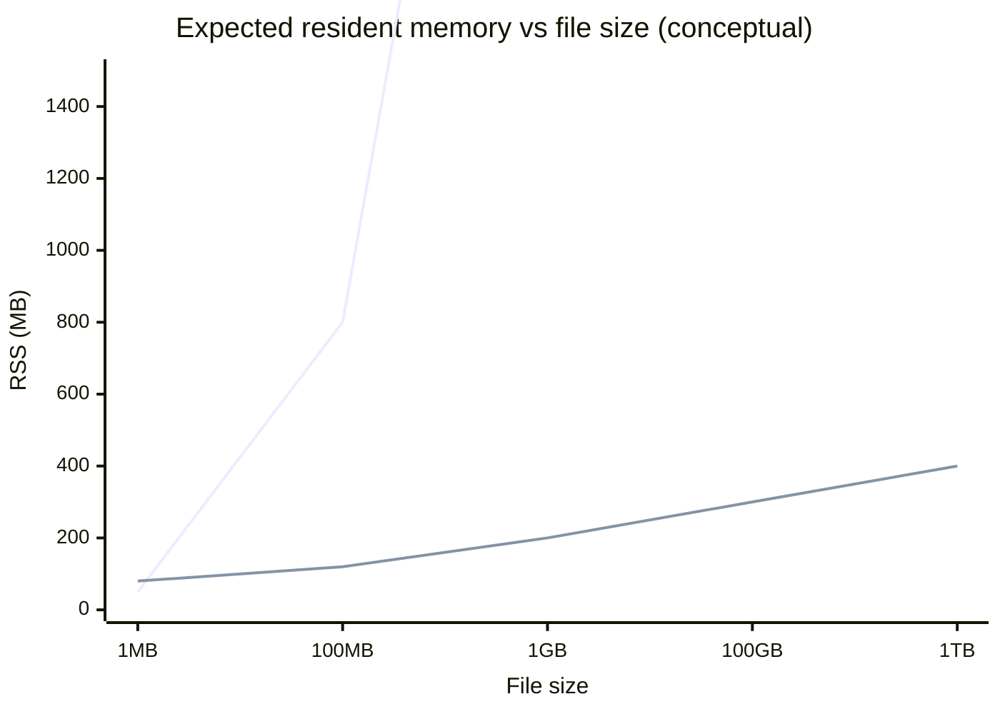

# Large-File Editor Architecture for GB–TB Documents in C/C++

## Executive summary

This document proposes a **file-backed, chunked editor architecture** that keeps UI responsiveness and memory use stable as file size grows into the **GB–TB range**, by avoiding “read the whole file into RAM” behavior and by limiting expensive text processing (wrapping, highlighting, indexing) to a **viewport-centric working set**. The design is informed by proven approaches in production editors and log explorers:

- **File-backed viewing models** that “read directly from disk without loading into memory” (as described by the multi-platform log explorer **klogg**) and that can operate on **huge files** while staying responsive. citeturn3view0turn4search4  
- **Chunk-based buffering** (e.g., LLPAD’s “CachedArea / viewArea” approach) as a simple, scalable model for large-file viewport navigation. citeturn3view1  
- **Piece table / piece tree** ideas (e.g., the **VS Code** text-buffer reimplementation) that avoid repeated copying by representing edits as references to immutable buffers, combined with a balanced tree and line-metadata to support fast access. citeturn15view3turn10view0  
- **Snapshots for concurrency** (as described in Atom’s “base text + patch,” including layered read-only snapshots). citeturn17view3  

The recommended core is a **hybrid**:

1. A **paged/chunked file backend** (windowed mmap when appropriate; buffered async reads otherwise) that provides *byte ranges* on demand, with an explicit **page cache** and optional prefetch hints using OS mechanisms (POSIX `mmap`, `posix_fadvise`, `readahead`; Windows `MapViewOfFile`, overlapped I/O; macOS `dispatch_io` / read-advice). citeturn6search0turn8search0turn8search1turn2search10turn8search6turn8search3  
2. A **file-backed piece table / piece tree** for editable buffers: the on-disk file is the immutable base; inserted text goes into an “add store” (memory + spill-to-temp), and the current document is a tree of “pieces.” This matches the motivations described by VS Code (avoid massive per-line objects and string splitting; store metadata and use balanced trees for lookup/edit stability). citeturn15view3turn10view0  
3. A **sparse, lazily-built line/seek index** and viewport-local caches for wrapping and highlighting that do not require building an O(lines) structure for TB-scale files. The design deliberately accepts that some features (full-file semantic parsing, global folding, whole-file multi-pass formatting) must degrade gracefully or operate asynchronously.

The document includes: target requirements, data-structure comparisons, a C/C++ module architecture (with APIs and code sketches), concurrency and persistence design (including crash recovery), strategies for search/replace and syntax highlighting at huge scale, a plugin model plus compatibility plan, and a testing/benchmarking methodology.

Assumptions are made explicit.

## Assumptions and requirements

### Assumptions

Because your constraints are unspecified, this proposal assumes:

- **Target platforms:** cross-platform **Linux / Windows / macOS** (desktop), with optional platform-specific fast paths. citeturn6search0turn2search10turn8search3  
- **64-bit only** for “large-file mode.” (Several OS and library features, and practical address-space needs for very large mappings, strongly push toward 64-bit.) This is consistent with how other systems gate “large file” handling (e.g., Scintilla’s large-document mode and VS Code’s large-file incident history). citeturn19search14turn15view3turn19search4  
- **Primary use case:** a code/text editor as in spirit of CudaText—configurable, extensible by plugins, and offering regex find/replace and multiple encodings. citeturn10view3turn19search5  
- **Huge-file reality:** files may have either:
  - extremely many lines (tens of millions and beyond), an area that caused memory blowups in line-array editor models, or  
  - extremely long lines (MB–GB), which can stress line-based subsystems. citeturn15view3turn3view2turn18search12  

### Goals and functional requirements

A “large-file editor” must prioritize **time-to-first-view** and **interaction latency** over full-file semantic features.

Key requirements:

- **Fast open and “first paint”**: show the first viewport quickly without pre-indexing the entire file. (klogg explicitly emphasizes reading directly from disk without loading into memory, and VS Code’s redesign emphasized avoiding costly line splitting and metadata creation.) citeturn3view0turn15view3turn10view0  
- **Stable memory usage**: memory should be dominated by a configurable cache and edit history, not file size (as seen in piece-table approaches where memory tracks edits and buffering rather than full duplication). citeturn15view3turn17view0  
- **Smooth scrolling and viewport rendering** even when the file is enormous, with background work for indexing/highlighting. (VS Code identifies `getLineContent` as a hot path and highlights the need to optimize viewport reads.) citeturn15view0turn15view3  
- **Edits at arbitrary positions** (not only append), with undo/redo, and without O(file size) shifts. Piece table / piece tree and patch-based overlays were designed specifically to avoid shifting entire buffers. citeturn17view3turn15view3turn17view0  
- **Search/replace** across huge regions with predictable behavior and controllable resource use; support both literal search and regex (klogg, CudaText both emphasize regex). citeturn0search19turn10view3turn9search2  
- **Encoding support**: at least UTF-8 plus common legacy encodings, with automatic detection where feasible (klogg uses `uchardet`; CudaText also advertises “many encodings”). citeturn3view0turn9search12turn10view3  
- **Extensibility/plugins** similar to CudaText’s Python add-ons and structured configuration (CudaText’s Python plugin API and JSON configs provide one proven approach). citeturn10view3turn19search5turn19search17  

### Performance targets and measurable budgets

Because “open-ended” targets can become untestable, define *budgeted latencies* and *scaling laws* rather than single absolute numbers:

- **Time-to-first-view (TTFV):** should scale sublinearly with file size and be bounded primarily by:
  1) opening the file descriptor/handle,  
  2) reading or mapping a small prefix + scanning for enough line breaks to fill the viewport.  
  This matches chunked viewer designs like LLPAD (buffer a small region and move the view). citeturn3view1  
- **Interaction latency goals (p95):**
  - cursor move within viewport: single-digit ms,  
  - small insert/delete near cursor: single-digit ms,  
  - scroll wheel / page down: tens of ms end-to-end including render.  
  These align with editor “parse/highlight on keystroke” aspirations (Tree-sitter explicitly targets “fast enough to parse on every keystroke”). citeturn10view2  
- **Memory scaling law:** memory ≈ `O(cache_bytes + edits_metadata + indices)` and should be **independent of file size** beyond configured cache. This is the key property emphasized by “read directly from disk” tools and chunked viewers. citeturn3view0turn3view1  

A practical “expected memory vs file size” model (illustrative):



This chart is conceptual (not measured) and exists to formalize the target scaling behavior.

## Data structures and storage backends

This section compares internal text representations and how well they support **GB–TB** scale, including asymptotic complexity, typical constants, and operational risks.

### Comparative analysis of text representations

#### Line array / per-line objects

- **Idea:** store an array of lines; edits replace strings and splice arrays.  
- **Pros:** O(1) line lookup, simple mental model.  
- **Cons for huge files:** metadata can dwarf file size. VS Code reported out-of-memory crashes when a 35 MB file had ~13.7M lines, because per-line objects consumed hundreds of MB; splitting into per-line strings is also expensive. citeturn15view3  
- **Suitability:** poor when line count is huge, even if bytes are modest.

#### Gap buffer

- **Idea:** maintain a contiguous buffer with an “invisible gap” near the cursor; inserts fill the gap; moving the cursor moves the gap. Emacs famously uses this technique. citeturn1search6turn1search3  
- **Pros:** very fast inserts/deletes near the gap; simple cache-friendly memory layout.  
- **Cons:** cursor moves far from the gap can be expensive; Emacs documentation notes the first edit far away can have a noticeable delay because the gap must be moved. citeturn1search6  
- **Suitability:** good for interactive editing when edits cluster, but problematic for workloads involving frequent random seeks, multi-cursor scattered edits, or operations across a TB file. Hansen’s historical work on editor data structures also highlights the need for careful data-structure design in bitmapped editors. citeturn17view2turn13search0  

#### Rope

- **Idea:** represent a long string as a balanced tree of string fragments; efficient concatenation and substring. The classic rope paper motivates scaling to long strings and avoiding excessive copying. citeturn17view1turn1search11  
- **Pros:** good worst-case behavior for edits distributed across the document; supports cheap snapshots in immutable/persistent variants (modern editors like Helix explicitly use a rope for representing buffers). citeturn12search1turn17view1  
- **Cons for GB–TB:** a straightforward rope is still fundamentally an **in-memory representation of text bytes** unless combined with a file-backed leaf/storage model. Without file backing, TB-scale is infeasible.  
- **Suitability:** excellent internal structure for **moderate** sizes and for snapshotting, but needs a file-backed storage abstraction to be a “TB editor.”

#### Piece table

- **Idea:** keep the original file immutable; appended inserted text goes into an “add” store; the current document is a sequence of “pieces” referencing spans in original/add stores. Crowley’s paper describes piece tables, compares multiple sequence structures, and concludes that often the **gap** or **piece table** are best, depending on situations. citeturn17view0  
- **Pros:** edits avoid shifting whole content; memory grows mostly with inserted text + piece metadata; enables natural undo/redo since old text can remain referenced. citeturn17view0turn14search4  
- **Cons:** naive “flat list” piece tables can make line lookup slow without added indexing; managing many small edits can fragment into many pieces. VS Code calls out that many edits can lead to thousands/tens-of-thousands of nodes and proposes normalization as a mitigation. citeturn15view0turn15view3  
- **Suitability:** strong foundation for large-file editing when combined with a balanced tree and line metadata.

#### Piece tree (balanced-tree piece table)

VS Code’s “piece tree” is explicitly described as a **multi-buffer piece table with a red-black tree**, optimized for line-based use. It:
- avoids string concatenation by keeping multiple buffers (e.g., 64 KB chunks),  
- stores per-node line-start offsets (`lineStarts`) and subtree metadata (`left_subtree_length`, `left_subtree_lfcnt`), enabling O(log N) searches by offset/line,  
- and is chosen because simpler models (line arrays) explode memory with huge line counts. citeturn15view3turn15view1turn10view1  

This is close to the right mental model for your C/C++ project, but you must adapt it to **file-backed storage** rather than in-memory JS strings.

#### Patch overlay with snapshots

Atom separated “base text” (immutable, representing last loaded/saved) from “unsaved changes” in a sparse patch structure; it also supports layered patches and freezing for read-only snapshots. citeturn17view3  
This is conceptually similar to a piece table, but it foregrounds **snapshotting as a first-class concurrency tool**.

### Storage backends for huge files

#### Memory-mapped files (mmap / MapViewOfFile)

- POSIX `mmap` creates a mapping between a process address space and a file/memory object. citeturn6search0turn6search1  
- Windows `MapViewOfFile` maps a view of a file mapping into the caller’s address space. citeturn2search10  

**Pros:** O(1)-ish random access (after page faults), OS page cache integration, simpler code for reading spans.  
**Cons:** you still need to handle very large offsets carefully; mapping strategies can require “windowed views” rather than a single gigantic mapping (especially for extreme sizes, and due to platform caveats). Windows mapping behavior is explicit about mapping a “view” with a specified size. citeturn2search10turn6search1  

#### Explicit chunked/paged backend

LLPAD’s core idea is to not read the entire file, but maintain a cached buffer region that backs a view area; as the caret moves, the view moves, and when it reaches the end of the buffer, the next area is read. citeturn3view1  
This is a minimal, robust strategy for very large files; in an editor, you upgrade it with:
- an LRU page cache,  
- prefetch based on scroll direction,  
- and a text representation (piece tree) on top.

### Recommendation: a file-backed piece tree with paged storage

For GB–TB editable files, the most defensible design is:

- **Document representation:** piece tree (balanced pieces + subtree metadata) for edits and line navigation, inspired by VS Code’s piece tree but generalized beyond JS strings. citeturn15view3turn10view0  
- **Storage:** file-backed “base store” + append-only “add store” with spill-to-disk + page cache. This merges piece-table advantages (Crowley) with chunked viewing (LLPAD) and disk-backed semantics (klogg). citeturn17view0turn3view1turn3view0  

## C/C++ architecture design

### High-level module decomposition

The core principle is separation of concerns:
- **Storage** knows about bytes and offsets.
- **Document model** knows about pieces and edits.
- **View/layout** knows about lines, wrapping, and fonts.
- **Derived data** (indexes, highlighting) is asynchronous and snapshot-based.

Request: The following Mermaid diagram is intended to be directly pasted into your repository docs and iterated as the module boundaries firm up.

```mermaid
flowchart LR
  UI[UI Frontend\n(Qt/WinUI/Cocoa/SDL/etc.)] -->|events| Controller[EditorController]

  Controller -->|commands| Model[DocumentModel\nPieceTree + EditTransactions]
  Model --> Snapshot[Immutable DocSnapshot\n(revisioned)]
  Snapshot --> Layout[Layout/Viewport\nline break + wrap cache]
  Snapshot --> Highlighter[Syntax/Token Engine\nviewport-first]
  Snapshot --> Search[Search Engine\nliteral+regex]
  Snapshot --> Index[Line/Seek Index\nsparse + lazy]

  Model --> Undo[Undo/Redo Manager]
  Model --> Persist[Persistence\natomic save + WAL]
  Persist --> FileIO[File Backend\nmmap/window + async reads]
  Model --> FileIO

  PluginHost[Plugin Host\nin-proc + out-of-proc] --> Controller
  PluginHost --> Model
  PluginHost --> Highlighter
```

### Threading model and concurrency strategy

#### Why snapshot-centric concurrency

Large-file responsiveness requires that heavyweight work (indexing, search, highlighting, wrap recomputation) does not block interactive edits. Atom’s design discusses **freezing the current patch and pushing a new patch** so background operations can read a stable snapshot while edits continue. citeturn17view3  

Similarly, xi-editor’s retrospective emphasizes elaborate async/multiprocess design, highlighting both the promise (non-blocking operations) and the complexity tax in interactive systems. citeturn16view1  
This suggests a pragmatic middle ground:

- **Single-writer, multi-reader (SWMR)**: one thread (typically UI or a dedicated model thread) applies edits and produces a new immutable **DocSnapshot** at each transaction boundary; any number of background threads consume snapshots.  
- This matches the “freeze snapshot” approach described in Atom (conceptually) while avoiding xi’s full core/UI process split. citeturn17view3turn16view1  

#### Proposed thread roles

1. **UI thread**  
   Owns rendering and input event processing. It should not block on I/O or full-file computation.

2. **Model thread (optional, but recommended)**  
   Applies edit commands, updates piece tree, and publishes new snapshots. If you choose “UI thread = model thread,” keep edits strictly bounded (no disk I/O, no global parsing).

3. **I/O thread(s)**  
   Executes prefetch and cache fill, using platform APIs:
   - Linux: `io_uring` is a Linux-specific async I/O API for submitting requests processed asynchronously. citeturn2search1turn2search12  
   - Windows: overlapped I/O allows asynchronous reads/writes. citeturn8search6turn8search18  
   - macOS: `dispatch_io` provides asynchronous read operations over file descriptors. citeturn8search3turn8search7  

4. **Worker pool**  
   Consumes snapshots for:
   - sparse line index building,
   - background search,
   - tokenization/highlighting beyond viewport,
   - diagnostics (if you add LSP later).

### Memory model

#### Core goals

- Fixed-size **page cache** for base file bytes plus per-document **edit store** for inserted bytes.
- Bounded **metadata growth** via:
  - piece tree node compaction (merge adjacent pieces when possible),
  - normalization checkpoints when node count becomes too large (VS Code explicitly discusses many nodes as an “Achilles heel” and considers normalization). citeturn15view0turn15view3  
- Optional allocator tuning for multi-threaded workloads. klogg reports using Intel TBB’s scalable allocator and observed a measurable improvement. citeturn4search8turn5search3  

#### Suggested memory budgeting knobs

- `page_cache_mb` (e.g., 64–1024 MB depending on system)  
- `max_pieces` (threshold to trigger compaction / normalization)  
- `max_highlight_work_mb` or “highlight time budget per frame”  
- `max_undo_bytes` / `max_undo_ops` (bounded undo)

Modern allocators and tuning options (optional):
- `jemalloc` is designed with multiple arenas to reduce lock contention for threaded programs. citeturn20search1  
- `mimalloc` supports “first-class heaps” and other features aimed at performance and fragmentation control. citeturn20search2  

### Persistence and crash recovery model

A large-file editor must treat persistence as a first-class system, not an afterthought.

- **Atomic save/replace (preferred):**
  - On POSIX, `rename()` is widely used for atomic replacement workflows (“overwrite-by-rename”). citeturn7search3turn7search10  
  - On Windows, `ReplaceFile` replaces one file with another and preserves attributes; it is an established primitive for atomic-like replacement on the same volume. citeturn7search1turn7search5  

- **Crash recovery / “hot exit” (recommended):**  
  Use a **write-ahead log (WAL)** of edit transactions plus an “add store” file containing inserted bytes. On restart:
  1) reopen base file,  
  2) replay WAL to rebuild piece tree,  
  3) restore cursor/viewport.  
  This general approach mirrors the “base text + changes overlay” approach described in Atom, generalized to disk-based stores. citeturn17view3  

## Core modules, APIs, and algorithms

This section provides concrete C/C++-oriented interfaces and key algorithms. Code sketches are illustrative; they emphasize boundaries and invariants rather than full implementations.

### File backend and page cache

#### Design requirements

- Serve **byte spans** by file offset efficiently.
- Support two stores:
  - **Base store** (immutable): original file on disk.
  - **Add store** (append-only): inserted bytes, typically in memory first, spilling to a temp file when large.
- Provide optional advisory hints:
  - POSIX `posix_fadvise` and Linux `readahead` for sequential prefetch. citeturn8search0turn8search1  
  - macOS `fcntl` provides advisory read mechanisms (`F_RDADVISE`, `F_RDAHEAD`). citeturn6search10  

#### C++ API sketch: file backend

```cpp
// file_backend.h
#pragma once
#include <cstdint>
#include <cstddef>
#include <string>
#include <span>
#include <memory>
#include <system_error>

namespace lfedit {

using u64 = std::uint64_t;

struct ByteSpan {
  const std::byte* data = nullptr;
  std::size_t size = 0;
  // Lifetime: valid while shared owner of underlying page exists.
  std::shared_ptr<void> owner;
};

struct ReadRequest {
  u64 offset = 0;
  std::size_t size = 0;
};

class IFileBackend {
public:
  virtual ~IFileBackend() = default;

  virtual std::error_code open(const std::string& path) = 0;
  virtual void close() = 0;

  virtual u64 file_size() const = 0;

  // Fast-path: returns a view into cached/mapped pages when possible.
  virtual std::error_code get_span(ReadRequest req, ByteSpan& out) = 0;

  // Fallback: copies into caller-provided buffer, can be async internally.
  virtual std::error_code read_into(ReadRequest req, std::byte* dst, std::size_t dst_size) = 0;

  // Hints (best-effort).
  virtual void advise_sequential(u64 start, u64 len) = 0;
  virtual void advise_random(u64 start, u64 len) = 0;
};

std::unique_ptr<IFileBackend> make_platform_backend(); // chooses mmap/windowed or buffered

} // namespace lfedit
```

#### Implementation notes

- **Windows**: use file mapping and `MapViewOfFile` for windowed mapping; the API maps a specified number of bytes and offset high/low parts are explicit. citeturn2search10  
- **POSIX**: use `mmap` to create file mappings, optionally windowed. citeturn6search0turn6search1  
- **Linux async**: `io_uring` can be used as a high-performance async I/O interface. citeturn2search1turn2search12  
- **macOS async**: `dispatch_io` is a system API for asynchronous reads. citeturn8search3  

### Document model: file-backed piece tree

#### Core data structures

A “piece” references one of the stores (base or add) and a span within it:

- `store_id`: Base or Add  
- `offset_bytes`: start offset in that store  
- `length_bytes`: span length  
- `lf_count`: newline count in the piece (for line operations)  
- optional `line_starts[]`: relative offsets of line starts inside the piece (VS Code stores `lineStarts` to accelerate line lookup). citeturn15view3  

A balanced tree node stores:
- a piece in-order,  
- metadata about the left subtree (byte length and linefeed count), matching VS Code’s described approach. citeturn15view1turn15view3  

#### C++ API sketch: piece tree buffer

```cpp
// piece_tree.h
#pragma once
#include <cstdint>
#include <vector>
#include <string_view>

namespace lfedit {

enum class StoreId : std::uint8_t { Base = 0, Add = 1 };

struct Piece {
  StoreId store;
  std::uint64_t off;
  std::uint64_t len;

  // Optional cached metadata:
  std::uint32_t lf_count; // '\n' count in this piece
  // Optional: relative line starts for this piece; can be disabled in huge-file mode.
  std::vector<std::uint32_t> line_starts;
};

struct Position {
  // Document position as byte offset in the logical document.
  std::uint64_t doc_byte;
};

struct Range {
  std::uint64_t doc_off;
  std::uint64_t doc_len;
};

class AddStore {
public:
  // Appends bytes, returns offset in add-store for referencing in pieces.
  std::uint64_t append(std::string_view bytes);
};

class PieceTree {
public:
  // Construction: base store starts as single piece spanning whole file.
  void init_from_base(std::uint64_t base_size);

  // Edits (transaction-level; caller provides offset in doc-bytes).
  void insert(Position pos, std::string_view utf8_bytes, AddStore& add);
  void erase(Range r);

  // Reading: iterate pieces overlapping [docOff, docOff+len).
  // An iterator yields (Piece, local_subrange) tuples.
  // Implemented as a cursor into the RB-tree with prefix sums.

  std::uint64_t size_bytes() const;

  // Optional: line lookup if enabled.
  // Otherwise, line methods defer to a sparse global index + local scans.
};

} // namespace lfedit
```

#### Complexity and suitability

- With a balanced tree and prefix metadata, position-to-piece navigation is **O(log P)** where `P` is piece count, similar to VS Code’s balanced-tree approach. citeturn15view3turn15view1  
- Insert/delete touches a logarithmic number of nodes; inserted text is appended to add-store (a piece-table hallmark). citeturn17view0turn15view3  
- Risk: after many edits, piece counts can grow substantially; VS Code notes this can slow hot methods like `getLineContent`, and discusses normalization as mitigation. citeturn15view0turn15view3  

**Mitigation strategy:** implement a background **compaction/normalization** job that:
- merges adjacent pieces referencing adjacent spans in the same store,
- optionally rewrites add-store into a new compact store and rewrites pieces,
- runs only when piece count or fragmentation crosses thresholds.

### Viewport rendering and line extraction

#### Key principle: line boundaries are a feature, not your storage format

VS Code emphasizes the editor mental model is line-based and that excessive per-line structures cause memory blowups; it shifted to caching line break positions rather than representing the file as an array of line strings. citeturn15view3  

For TB-scale files, you should expect:
- you cannot precompute line starts for the entire file,
- you must support “scan locally and cache.”

#### Strategy: sparse index + local scanning

Maintain a **sparse line index** based on checkpoints, for example every `K` newlines:
- `checkpoint[i] = doc_byte_offset` for line `i*K`  
- To go to line `L`, find nearest checkpoint ≤ L, seek to that byte offset, then scan forward until L.

This keeps memory bounded even for huge line counts; you choose `K` to trade memory vs seek time. klogg’s ability to handle extremely large line counts motivates avoiding 32-bit line assumptions. citeturn3view0turn18search8  

### Search/replace at huge scale

#### Literal search algorithm

For literal search, a well-known fast technique is:
- use `memchr` to find the first byte,
- verify candidate matches with `memcmp`,
- handle chunk boundaries with a small overlap buffer.

Scintilla discussions explicitly highlight this `memchr`/`memcmp` approach and note that a non-contiguous internal buffer can be hidden behind an adapter view. citeturn5search8turn5search0  

#### Regex search

- Use **PCRE2** for regex matching in C: PCRE2 is a portable C library implementing Perl-compatible regex matching and is designed to be embeddable. citeturn9search2turn9search14  
- For performance and safety on huge files, implement:
  - a “time budget” per frame (UI responsiveness),
  - a cancelable job model (search can be interrupted on edits),
  - optional multi-threaded scanning on disjoint regions *when the backing store is in memory/page cache* (klogg explicitly adopts multithreading and SIMD for performance). citeturn4search4turn18search18  

#### Replace strategy

A naive “replace all” that emits an edit for every match can fragment the piece tree; VS Code notes many edits can produce many nodes and proposes normalization. citeturn15view0turn15view3  

Preferred approach for huge replace-all:
1. Stream through the document once, emitting output to a **new add-store** plus an output piece list (or a new piece tree built incrementally).
2. Swap the document model to the new representation in one transaction.
3. Record a single undo step referencing the old snapshot (bounded by undo policy).

### Undo/redo

Piece-table-family structures naturally support undo because inserted text is appended and old spans remain representable. Crowley explicitly highlights piece table advantages as a data structure for text sequences, and piece-table discussions often emphasize undo friendliness compared to gap buffers. citeturn17view0turn14search4turn14search3  

Recommendations:
- Make undo/redo **transactional** (group keystrokes by time, command boundaries).
- Store undo operations as **edit scripts** (pos, deleted-range pieces, inserted-add-store references), not full copied text.
- Bound undo memory by policy: keep old add-store blocks until no longer referenced by any undo state.

### Encoding support

#### Detection and decoding pipeline

- Use BOM detection first (UTF-8/UTF-16), then fallback to heuristic detection.  
- `uchardet` is an encoding detector library that attempts to determine encoding for unknown byte sequences; klogg uses uchardet and advertises support for many encodings, including UTF-8 and UTF-16. citeturn9search12turn3view0turn4search4  

#### Unicode model

- Store the canonical internal representation as **UTF-8 bytes** for interoperability and compactness.  
- Cursor movement and selection should follow Unicode grapheme cluster boundaries; Unicode UAX #29 defines grapheme clusters and text segmentation rules. citeturn9search1  
- For implementation, consider ICU for robust Unicode processing; ICU is a widely used C/C++ library for Unicode and globalization support. citeturn9search5turn9search17  

Pragmatic large-file compromise:
- In huge-file mode, compute grapheme boundaries only in the viewport (and maybe a margin), not for the whole file.

## Extensibility and syntax highlighting for huge files

### Plugin/extensibility model

CudaText is explicitly extensible by **Python add-ons** (plugins, linters, code-tree parsers) and uses JSON configuration; its wiki documents a Python API for plugins. citeturn10view3turn19search5turn19search17  

A C/C++ editor can adopt a similar tiered model:

- **Stable C ABI plugin API** (shared libraries): for high-performance integrations (renderers, indexers).
- **Embedded scripting (Python/Lua)**: for user scripts and rapid iteration, mirroring CudaText’s accessibility. citeturn19search5turn10view3  
- **Out-of-process “remote plugins” via RPC**: for isolation, crash containment, and polyglot plugins. Neovim documents remote plugins as coprocesses communicating via RPC (MessagePack-RPC). citeturn11search7turn11search3  

This yields:
- performance where needed (C/C++),
- safety and flexibility (remote),
- a low barrier to entry (Python).

### Syntax highlighting strategy for huge files

#### Why highlighting must be viewport-first

- Tree-sitter positions itself as an incremental parsing library that can update a syntax tree efficiently as a file is edited, with a small C runtime suitable for embedding. citeturn10view2turn2search8  
- Regex/TextMate approaches are widespread and supported by large grammar ecosystems; VS Code’s extension docs state TextMate grammars rely on Oniguruma regex dialects. citeturn11search0turn11search5  
- However, xi-editor’s retrospective argues regex-based highlighting can be very slow compared to specialized parsers and motivates plugging in better engines over time. citeturn16view1  

Because TB-scale files can contain millions of lines, the design must:

1. **Never require full-file parse to remain interactive.**
2. Allow “good enough” highlighting near the viewport with bounded work.
3. Offer better highlighting progressively when resources allow.

#### Proposed three-tier highlighting

- **Tier A: Minimal / none (huge-file safe mode)**  
  - highlight only whitespace, tabs, control chars, maybe numeric literals  
  - no backtracking regex, no multi-line state  
  - guaranteed stable performance.

- **Tier B: Line-local lexer with checkpoint state**  
  - maintain lexer state checkpoints every N lines within a window of interest  
  - when rendering, lex from nearest checkpoint to viewport (bounded).  

- **Tier C: Pluggable engines**  
  - **TextMate** engine for broad coverage (reuse existing grammars and themes) per VS Code guide. citeturn11search0turn11search5  
  - **Tree-sitter** engine for incremental parsing where grammars exist; tree-sitter explicitly aims to be fast enough for keystrokes and robust with errors. citeturn10view2  

### Migration and compatibility plan for plugins and syntax engines

This plan assumes you want a sustainable ecosystem rather than a one-off internal editor.

1. **Define a stable “Editor Core API” surface**  
   - document model operations (insert/delete/replace),  
   - snapshot read interface,  
   - viewport text retrieval,  
   - event hooks.

2. **Support “compatibility shims” early**  
   - For syntax: implement Tier B yourself first; then integrate TextMate grammars as a plugin and later tree-sitter as an optional advanced engine. TextMate grammar reliance on Oniguruma is documented in VS Code’s syntax highlight guide and vscode-textmate repository. citeturn11search0turn11search5  
   - For scripting: provide a Python plugin host early (CudaText demonstrates the utility of Python add-ons). citeturn10view3turn19search5  

3. **Versioning strategy**  
   - semantic version the ABI,  
   - provide a negotiation handshake and feature flags,  
   - keep old APIs for multiple major versions with adapters.

4. **Optional: remote plugin protocol**  
   - Use MessagePack-RPC (as in Neovim) to allow external plugin processes. citeturn11search3turn11search7  

## Reliability, testing, benchmarking, and implementation phases

### Testing strategy

A large-file editor breaks in non-obvious ways (boundary conditions and scaling pathologies). Testing must be layered:

- **Unit tests for core invariants**
  - piece tree prefix-sum correctness (sizes, newline counts),
  - iterator correctness across splits/merges,
  - Unicode decode safety and invalid bytes handling.

- **Property-based tests**
  - generate random sequences of edits and compare with a reference model on small strings.

- **Fuzzing**
  - fuzz file loading and decoding; fuzz regex search; ensure no crashes or OOM.

- **Regression suites for known pathologies**
  - extremely many short lines (line-count explosion; VS Code’s 13.7M-line crash class). citeturn15view3turn19search4  
  - extremely long lines (MB–GB). citeturn3view2turn18search12  
  - mixed CRLF/LF handling; VS Code warns CRLF edge cases are complex in piece-tree context. citeturn15view0turn15view3  

### Benchmarks and tooling

#### Microbenchmarks

Use **Google Benchmark** for microbenchmarks (C++), to measure:
- piece-tree locate/insert/delete,
- line scanning and sparse-index seek,
- literal search iterators,
- page cache hit/miss behavior.

Google Benchmark provides the `BENCHMARK` macro pattern and is widely used for C++ microbenchmarking. citeturn19search3turn19search7  

#### Macrobenchmarks (“end-to-end”)

Measure:
- **TTFV**: open + first render (top-of-file, mid-file seek).
- **Scroll throughput**: lines/sec while holding page-down.
- **Search throughput**: bytes/sec for literal search and regex.
- **Replace-all**: time and peak memory, plus resulting piece count.

#### Benchmark datasets

Generate synthetic datasets that cover worst cases:

- **Many lines, tiny content**:  
  - 100MB file with 10M lines of “0\n”  
- **Few lines, huge line length**:  
  - 10GB file with one line (no `\n`)  
- **Mixed encoding**:  
  - UTF-16LE logs, Latin-1, etc. (klogg’s encoding support motivates testing these). citeturn3view0turn4search4  

#### Example benchmark scripts (pseudocode)

```bash
# generate_many_lines.sh (Linux/macOS)
# 10 million lines, small payload
python3 - <<'PY'
with open("many_lines.txt","wb") as f:
  for i in range(10_000_000):
    f.write(b"0\n")
PY

# generate_long_line.sh
python3 - <<'PY'
with open("one_huge_line.txt","wb") as f:
  f.write(b"a" * (1024*1024*1024))  # 1GB line
PY

# run macrobench (pseudo)
# ./lfedit_bench --open many_lines.txt --seek-line 9000000 --ttfv
# ./lfedit_bench --search-literal many_lines.txt "0\n"
# ./lfedit_bench --replace-all many_lines.txt "0" "1"
```

### Implementation phases timeline

Request: paste this Mermaid flowchart into your tracker/roadmap and attach measurable acceptance criteria to each milestone.

```mermaid
flowchart TD
  A[Phase: Core storage + file backend\n- open/read spans\n- page cache\n- windowed mmap/buffered reads] --> B[Phase: Read-only viewer\n- viewport line extraction\n- smooth scroll\n- sparse line index v1]
  B --> C[Phase: Editable piece tree\n- insert/delete\n- transactions\n- undo/redo]
  C --> D[Phase: Persistence + crash recovery\n- WAL + add-store\n- atomic save/replace]
  D --> E[Phase: Search engine\n- literal iterator\n- regex (PCRE2)\n- cancelation + progress]
  E --> F[Phase: Highlighting tiers\n- safe mode\n- viewport lexer\n- plugin tokenizer API]
  F --> G[Phase: Plugin system\n- C ABI\n- Python host\n- optional RPC remote plugins]
  G --> H[Phase: Hardening + perf\n- compaction/normalization\n- benchmarks + regressions\n- encoding + Unicode polish]
```

### Candidate projects/papers and prioritized references table

The table below lists key systems and primary sources that directly inform the proposed architecture; it is ordered by “most directly useful to this design.”

| Candidate | What it contributes | Why it matters for your design | Primary source |
|---|---|---|---|
| VS Code text buffer (“piece tree”) | Balanced tree of pieces + line metadata; avoids per-line objects and costly splitting; discusses performance pathology and normalization | Production-proven approach balancing memory and edit performance; shows concrete metadata needed for line/offset lookup | citeturn15view3turn15view0turn10view1turn10view0 |
| Crowley: *Data Structures for Text Sequences* | Comparative analysis of gap buffers, piece tables, and others; recommends gap or piece table in most cases | Academic grounding for data structure choice and its tradeoffs | citeturn17view0turn14search4 |
| Boehm/Atkinson/Plass: *Ropes: An Alternative to Strings* | Rope design goals: efficient concatenation/substring, scaling to long strings, immutability | Rope ideas useful for snapshotting and persistent structures; informs tradeoffs vs piece tables | citeturn17view1turn1search11 |
| Atom “base text + patch + snapshots” | Explicit snapshot layering for concurrency; immutable base + sparse changes | Strong model for SWMR background processing without blocking edits | citeturn17view3 |
| klogg | Disk-backed log browsing without loading into memory; multithreading/SIMD; encoding detection via uchardet; supports very large line counts | Demonstrates practical engineering for large-file scanning, search, encoding, and responsiveness | citeturn3view0turn4search4turn18search18turn4search8 |
| LLPAD | Minimal cached-area + view-area pattern for huge files | Good baseline for viewport-centric large-file reading model | citeturn3view1 |
| Tree-sitter | Incremental parsing library, C runtime, designed for keystroke-speed incremental updates | Best candidate for high-quality incremental highlighting/parsing in C/C++ app | citeturn10view2turn2search8 |
| TextMate grammars (VS Code docs) | Grammar ecosystem; regex-based tokenization via Oniguruma dialect | Compatibility path for broad language coverage; informs plugin strategy | citeturn11search0turn11search5 |
| CudaText | Python plugin API, JSON-based configuration, multi-encoding promise | Practical reference for a lightweight extensible editor UX model | citeturn10view3turn19search5turn19search17 |

### Notes on “open source projects like CudaText”

Some projects that market “huge-file” capability are not fully open source (e.g., WindTerm/WindEdit describing “partial open source”). For an architecture meant to become a long-lived C/C++ codebase, your safest references are those with **clear source availability and licenses**, like VS Code’s published design and code, tree-sitter, klogg, and the cited academic papers. citeturn4search0turn3view2turn10view1turn10view2turn3view0