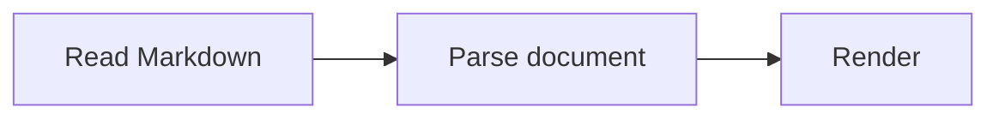

# Markdown Input in Lambda

**Status:** feature policy confirmed by the user on 2026-10-08. The body defines
the required Markdown dialect; Appendix A records current implementation coverage.

**Scope:** Markdown input and its document presentation, including GFM syntax,
embedded math, Mermaid diagrams, footnotes, bare URL autolinks, GitHub emoji
shortcodes, and embedded HTML.

**Formal-spec linkage:** [D7.1.5](../../doc/Lambda_Formal_Design.md#d71-build-packaging-and-layering)
governs Mark API ownership: input construction uses the io-owned `MarkBuilder`.
No existing `S#` or `D#` ruling specifies the Markdown dialect itself. This working
record captures the user-confirmed feature policy without changing a formal ruling.

## 1. Markdown dialect

Lambda Markdown builds on CommonMark and adds GFM syntax, embedded math, Mermaid
diagrams, footnotes, and full GitHub emoji shortcode support. Bare URL autolinking
is required. Embedded HTML is allowed without GFM's HTML tag filtering.

The dialect is therefore **CommonMark + GFM syntax + Lambda document extensions**.
It deliberately omits GFM's `tagfilter` extension; that omission is a design choice,
not a conformance defect.

CommonMark supplies headings, paragraphs, emphasis, links, images, block quotes,
ordered and unordered lists, thematic breaks, inline code, indented and fenced code
blocks, escapes, entities, and angle-bracket autolinks. Fenced code blocks are part
of CommonMark, rather than an additional GFM feature.

The default Markdown profile described here is distinct from the explicit
`{type: "markup", flavor: "commonmark"}` entry point used for CommonMark
conformance testing.

## 2. GFM syntax

Lambda adopts GFM's tables, task lists, strikethrough, and extended autolinks.
Their syntax and parsing rules follow the [GFM specification](https://github.github.io/gfm/),
except for the intentional HTML policy in section 6.

### Tables

Pipe tables support a header row, body rows, inline formatting in cells, and
left, center, or right column alignment:

```markdown
| Feature | Status | Count |
| :--- | :---: | ---: |
| **Tables** | Supported | 1 |
```

### Task lists

List items may start with an unchecked or checked checkbox. Both lowercase and
uppercase `x` mark a checked item:

```markdown
- [ ] Pending
- [x] Complete
- [X] Also complete
```

### Strikethrough

```markdown
Use the ~~old~~ current value.
```

### Bare URL autolinks

Ordinary text containing a URL, a `www.` domain, or an email address becomes
a link without requiring angle brackets or explicit `[text](destination)` syntax:

```markdown
https://example.com/guide
www.example.com
person@example.com
```

The `www.` form uses the GFM-implied `http://` destination; email addresses use
`mailto:`. GFM's boundary, domain, trailing-punctuation, and parenthesis rules
apply. Code spans and code blocks retain literal text.

## 3. Embedded math

Lambda supports LaTeX math inside Markdown, using single dollar signs for inline
math and double dollar signs for display math:

```markdown
The distance is $\sqrt{x^2 + y^2}$.

$$
\frac{a}{b} + c
$$
```

A single-line display expression such as `$$x^2 + y^2$$` is also supported.
AsciiMath display content uses a fenced block labeled `asciimath` or `ascii-math`:

````markdown
```asciimath
sqrt(x^2 + y^2)
```
````

Math source is preserved for formatting and passed to Lambda's math typesetting
pipeline for document presentation. These forms are document extensions, rather
than features of the GFM specification. See [Math Support](../../doc/Math_Support.md)
for the supported mathematical notation.

## 4. Mermaid diagrams

Fenced blocks labeled `mermaid` designate embedded diagrams:

````markdown

````

The fence body preserves the Mermaid source. Diagram presentation uses
Lambda's Mermaid parser and diagram rendering pipeline. Supported diagram families
and syntax follow the [graph package design](../Lambda_Pkg_Graph.md); Markdown
embedding does not imply support for every feature of upstream Mermaid.

## 5. Footnotes

Footnotes are a required Markdown extension. A reference uses `[^label]`, and its
definition uses `[^label]:`:

```markdown
A statement with an explanation[^detail].

[^detail]: The explanation may contain **formatted text** and a [link](https://example.com).
```

Definitions may follow their references and contain multiple paragraphs or lists;
continuation blocks use four columns of indentation. Labels match without regard
to case, and the first definition wins when a label is repeated. References receive
numbers in first-use order, including references from other notes. Repeated
references share a number. Undefined references remain literal text.

The parsed document retains formatted note content in a `footnotes` section,
with a `footnote` element for each definition and linked `footnote-ref` elements
at reference sites. Unused definitions follow the referenced notes so formatting
can preserve them. Markdown formatting writes definitions back using their
original labels. Native document loading and the document viewer present the
numbered notes; editor import preserves definition source in its original position,
including definitions inside lists and block quotes.

Footnotes are separate from the five extensions in the formal GFM specification,
although GitHub also supports them.

## 6. Embedded HTML

Inline HTML and HTML blocks are allowed. HTML content follows CommonMark's raw
HTML rules, including the distinction between HTML blocks and inline tags:

```markdown
Text with <span class="note">an inline annotation</span>.

<div class="panel">
  <strong>Embedded HTML block</strong>
</div>
```

Lambda does **not** apply GFM's `tagfilter`. In particular, tags such as `<script>`,
`<style>`, `<iframe>`, `<title>`, and `<textarea>` are not rejected or escaped merely
because GFM filters them. HTML parsing and source preservation belong to the
Markdown input contract; execution and application-specific preview behavior
belong to the consuming renderer.

## 7. GitHub emoji shortcodes

Lambda Markdown must support **all GFM/GitHub emoji shortcodes**, including every
alias in [GitHub's public emoji catalog](https://docs.github.com/en/rest/emojis/emojis#get-emojis).
GitHub documents the `:name:` syntax under
[Using emojis](https://docs.github.com/en/get-started/writing-on-github/getting-started-with-writing-and-formatting-on-github/basic-writing-and-formatting-syntax#using-emojis).
Emoji are an additional GitHub writing feature beyond the five extensions in the
formal GFM specification.

```markdown
:smile: :+1: :-1: :woman_technologist: :us: :octocat: :shipit:
```

Support includes aliases for the same emoji, flags, and complete Unicode
sequences, including variation selectors and zero-width joiners. Unicode mappings
follow [GitHub's gemoji database](https://github.com/github/gemoji/blob/master/db/emoji.json).
GitHub-specific image emoji such as `:octocat:` and `:shipit:` also require image
presentation, since they have no Unicode equivalent. Catalog data and any bundled
image assets should have a recorded upstream version and license; document parsing
must work offline.

Shortcodes are case-sensitive and expand in normal inline text, including link
labels. Code spans, code blocks, link destinations, and HTML attributes preserve
literal content. Unknown names and an escaped opening colon remain literal text.
Markdown formatting must preserve shortcode spelling and keep escaped literals
literal when parsed again. HTML formatting and document presentation must resolve
recognized shortcodes. Directly authored Unicode emoji remain unchanged. The
explicit CommonMark profile must leave emoji shortcodes as ordinary text.

## Appendix A. Implementation coverage as of 2026-10-08

This snapshot describes the implementation and regression coverage. It does not
weaken the required feature policy above or claim coverage beyond the enabled cases.

| Feature | Current coverage |
| --- | --- |
| CommonMark | Dedicated entry point and specification fixtures; the existing compliance summary passes. |
| GFM tables, task lists, strikethrough | Implemented, with dedicated fixture files in the Markdown harness. |
| Bare URL autolinks | HTTP(S), `www.`, email, `mailto:`, and `xmpp:` links follow GFM domain, boundary, and punctuation rules. Explicit link labels and code remain literal. |
| Embedded math | Inline LaTeX, display LaTeX, and fenced AsciiMath produce math nodes. Embedded AST construction is available to callers requesting it. |
| Mermaid fences | Source and language remain code nodes until presentation. Native document loading and the document viewer render fences through the graph package. |
| Footnotes | Definitions, forward and repeated references, formatted blocks, nested references, and Markdown formatting are implemented. Definitions inside list items and block quotes share document scope. |
| Embedded HTML | Raw source is preserved and also fed to the shared HTML5 parser. No GFM tag filtering is applied. |
| GitHub emoji shortcodes | Complete versioned GitHub catalog: 1,913 Unicode aliases and 23 custom image aliases, plus 25 legacy Lambda aliases. HTML formatting, Markdown round-tripping, editor saves, and strict CommonMark behavior are covered by regression tests. |

### Emoji implementation audit

The shared lookup is generated offline from the checked-in
[catalog snapshot](../../lib/emoji_shortcodes_data.json), using gemoji revision
[`ee6e06c648e85d601756b573d356327d4e51031d`](https://github.com/github/gemoji/blob/ee6e06c648e85d601756b573d356327d4e51031d/db/emoji.json)
and the GitHub emoji API snapshot taken on 2026-10-08. It contains all 1,936
GitHub aliases and 25 additional Lambda aliases. Unicode alias data attribution
is recorded in [EMOJI_LICENSE.txt](../../lib/EMOJI_LICENSE.txt).

[The generator](../../utils/generate_emoji_shortcodes.py) produces a sorted table
for binary search. Run `python3 utils/generate_emoji_shortcodes.py --check` to
verify that the generated table matches the snapshot. Updating the catalog is an
explicit data refresh; parsing never fetches catalog data.

| Check | Current result |
| --- | --- |
| Unicode aliases | All 1,913 aliases parse to symbols and resolve to the upstream Unicode sequence, including flags and zero-width joiners. |
| Custom aliases | All 23 produce inline `` nodes with the canonical GitHub URL, `alt=":name:"`, `data-emoji="name"`, and dimensions of one em. |
| Corrected mappings | `calendar`, `cake`, `chart`, `ice_cream`, `icecream`, `moon`, `pencil`, `phone`, `satellite`, `stars`, `train`, and `umbrella` follow gemoji. |
| HTML formatting | Unicode symbols resolve in the content layer, independently of Radiant initialization. Custom images are normal image elements. |
| Markdown formatting | Unicode symbols and custom images retain their original alias. Literal shortcode text is escaped, including shortcodes spanning adjacent text nodes. |
| Editor saves | Emoji atoms retain their alias and presentation; escaped literals remain text. Both survive import and export. |
| Strict CommonMark | Unicode and custom shortcodes remain literal text. |
| Literal contexts | Code spans, fenced/indented code, escaped colons, unknown names, uppercase names, link destinations, and HTML attributes remain literal. |

Custom image nodes use the URLs supplied by GitHub. Image presentation follows the
ordinary image resource loader and requires access to those URLs or its cache;
parsing and Markdown saves work offline. The catalog bundles URL metadata, while
image artwork remains hosted by GitHub.

[The catalog regression](../../test/lambda/input_markdown_emoji.ls) checks every
Unicode mapping and every custom image alias, full-document Markdown round-tripping,
literal contexts, strict CommonMark, and editor import/export. Native emoji tests
assert exact shortcode round-trips, standalone HTML output, legacy aliases, and
bounded matching. The [emoji sample](../../test/input/markdown_emoji.md) and
[viewer UI test](../../test/ui/doc_editor_emoji_shortcodes.json) exercise presentation.

### Implementation references

- [Markdown entry points](../../lambda/input/markup/markup_parser.cpp):
  `input_markup_modular()` and `input_markup_commonmark()` select the profiles.
- [Markdown adapter](../../lambda/input/markup/format/markdown_adapter.cpp):
  `MarkdownAdapter::supportsFeature()` advertises features, but its flags alone
  do not establish complete implementation.
- [Inline HTML and autolinks](../../lambda/input/markup/inline/inline_html.cpp):
  `parse_autolink()` handles angle-bracket links and `parse_extended_autolink()`
  handles bare links; `parse_raw_html()` preserves source and feeds HTML fragments
  to the shared HTML5 parser.
- [Emoji parsing](../../lambda/input/markup/inline/inline_special.cpp):
  `parse_emoji_shortcode()` uses [the shared catalog](../../lib/emoji_shortcodes.cpp),
  `emoji_shortcode_match()`, and emits either a symbol or a custom image.
  [Content-layer symbol resolution](../../lambda/input/css/css_symbol_hook.cpp),
  `css_symbol_resolve()`, supplies both HTML formatting and
  [Radiant symbol resolution](../../radiant/symbol_resolver.cpp), `resolve_symbol()`.
  [Markup formatting](../../lambda/format/format-markup.cpp),
  `MarkupEmitter::format_item()`, writes symbols as `:name:`; `md_emit_image()`
  in the Markdown formatter preserves custom image aliases.
- [Native emoji tests](../../test/test_entity_emoji_gtest.cpp):
  `MarkdownEmojiParsingTest`, `MarkdownFormatterEmojiTest`, and
  `HtmlFormatterSymbolTest` complement the exhaustive catalog regression.
- [Footnote references](../../lambda/input/markup/inline/inline_special.cpp):
  `parse_footnote_reference()` creates the reference node;
  [document parsing](../../lambda/input/markup/block/block_document.cpp) collects
  definitions, resolves labels, and adds numbered links and the notes section.
- [Markdown formatting](../../lambda/format/format-md.cpp) preserves footnote
  labels and indents continuation blocks independently of label length.
- [Math completion](../../lambda/input/markup/block/block_utils.cpp):
  `finish_math_element()` attaches the math AST when embedded math is requested.
- [Code fences](../../lambda/input/markup/block/block_code.cpp):
  `parse_code_block()` preserves the language and source; AsciiMath has special
  handling, and Mermaid nodes are registered for presentation.
- [Mermaid input](../../lambda/input/input-graph-mermaid.cpp) and
  [diagram presentation](../../lmd/package/graph/document.ls):
  `parse_graph_mermaid()`, `to_html()`, and `from_mermaid()` provide the shared
  diagram pipeline.
- [Native Markdown loader](../../radiant/cmd_layout.cpp) renders math and Mermaid
  through one retained runtime, following **D5.4.1** for loader context binding.
- [Document viewer](../../lmd/package/doc/doc_viewer.ls) renders Mermaid fences
  and numbered notes. The [editor adapter](../../lmd/package/edit/markdown.ls)
  preserves definitions as source instead of importing the generated footer.
- [Markdown specification harness](../../test/markup/test_markdown_gtest.cpp):
  `MarkdownSpecTest::load_examples()` loads CommonMark, md4c, table, task-list,
  strikethrough, and GFM autolink fixtures. The md4c permissive-autolink fixture
  stays separate because its scheme and punctuation rules differ from GFM.

Regression scripts cover [footnotes, autolinks, and unfiltered HTML](../../test/lambda/input_markdown_extensions.ls),
[Mermaid presentation](../../test/lambda/input_markdown_mermaid.ls), and
[editor source preservation](../../test/lambda/input_markdown_edit.ls).
The combined [render fixture](../../test/input/markdown_extensions.md) exercises
math, Mermaid, footnotes, autolinks, and HTML together.

## Related documentation

- [Lightweight markup parser design](Input_Lightweight_Markup.md)
- [Markup and data format support](../../doc/Markup_Formats_Support.md)
- [Mark document schema](../../doc/Doc_Schema.md)
- [GitHub footnote syntax](https://docs.github.com/en/get-started/writing-on-github/getting-started-with-writing-and-formatting-on-github/basic-writing-and-formatting-syntax#footnotes)
