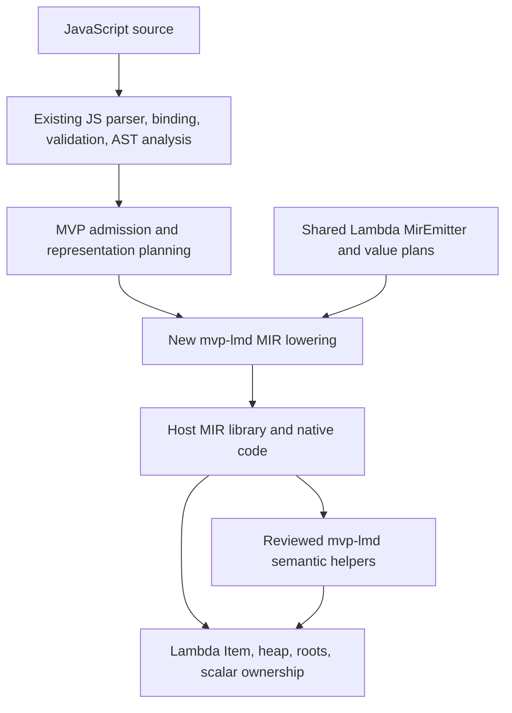

# JS MVP Lmd — JavaScript MIR on the untyped Lambda substrate

**Date:** 2026-10-07

**Status:** PROPOSAL FOR REVIEW — the design goals in §1 are fixed by the
user (2026-10-07); runtime helper APIs remain proposed and unimplemented.

**Implementation destination:** `lambda/js/mvp-lmd/`

**Scope:** existing JS parsing and AST analysis; new MIR lowering and execution
for basic scalars, dense arrays, variable assignment, control flow, and functions.

## 1. Objective and fixed constraints

Execute the current JS subset as efficiently as possible using untyped
Lambda's representation and compilation machinery, with minimal emitted MIR
and minimal new runtime code. Measure these properties independently; sharing
code alone does not establish a performance improvement.

### Governing design goals — USER, 2026-10-07

1. **Keep emitted MIR minimal.** Emit only instructions, checks, conversions,
   roots, wrappers, and function bodies needed by the admitted program. Reuse
   existing analysis to eliminate redundant work before MIR emission.
2. **Keep new helpers and helper code minimal.** Minimize both the number of
   helpers and their total implementation, including internal utility functions,
   adapters, and new shared code. Reuse audited Lambda/lib primitives. A single
   large dispatcher is not an improvement over several small helpers merely
   because it reduces the exported symbol count.
3. **Implement exactly the current scope.** Section 3 is the capability
   boundary. Do not implement, design for, reserve hooks for, or plan future
   expansion. Unsupported features need only recognition and a diagnostic.
4. **Keep the MVP as efficient as possible.** Keep proven scalar computations
   native, avoid unnecessary calls and allocations, and use direct storage and
   call paths where current-scope proofs permit. Validate choices on release
   builds with unchanged source and output oracles.

These goals apply together. Do not reduce MIR by moving every operation into
a C dispatcher, reduce helper code by duplicating long algorithms at every MIR
site, or gain speed by changing JS results. Correct admitted behavior, precise
ownership, and the ban on existing JS runtime helpers remain constraints
(**S1.11**, **D2.4.3**, **D5.3**, **D8.2.6**). If speed and size trade off,
record the measured runtime, emitted-instruction count, and added helper code;
retain extra machinery only when it earns its cost on an in-scope workload.

The requested constraints are:

1. Keep the current JS parser, AST, binding, validation, and applicable analysis.
2. Emit **new MIR** under `lambda/js/mvp-lmd/`; do not invoke the current JS
   lowering, JS interpreter, or the private-value MVP under `lambda/js/mvp/`.
3. Base execution on untyped Lambda's `Item`, native scalar lanes, containers,
   precise roots, memory ownership, and shared MIR emitter.
4. Support JS `var` declaration and assignment, including runtime type changes.
5. Call **no existing JS runtime helper**, directly or transitively.
6. Present every proposed runtime helper and its dependencies for review before
   implementing it. Section 7 is that review inventory.

This is an explicit experimental selector, not a replacement for the current
JS engine. A source outside the admitted subset is reported as unsupported;
there is no fallback into either existing JS execution engine.

### Authority and proposal status

The [formal semantics](../../doc/Lambda_Formal_Semantics.md) and
[formal design](../../doc/Lambda_Formal_Design.md) govern the proposal:

| Concern | Authority | Application here |
|---|---|---|
| Hosted language semantics | **S1.11**, **D1.1** | Admitted programs retain JS meaning; unsupported capabilities are explicit. |
| Shared substrate and values | **D1.2v2–D1.3v3** | Use host `Item`, heap, execution ownership, and MIR infrastructure. |
| Representation versus conversion | **D2.4.1–D2.4.3** | Native representation never substitutes for JS coercion. |
| Returned failures | **D1.4v4**, **D8.4.3v2** | Failures return through every frame and its cleanup. |
| Scalar lifetime and rooting | **D5.2.1v3–D5.2.3**, **D5.3.1–D5.3.5** | Shared companion returns, destination ownership, and precise roots. |
| AST and passes | **D8.2.1–D8.2.6** | Existing indexed AST and pass manager; new lowering consumes resolved facts. |
| Specialization | **D8.3.1v2**, **D8.4.1v2** | Use proven native operations and necessary local guards; no automatic body cloning, feedback vectors, or mutable inline caches. |

The user's new experimental lane is recorded here. It does not change Lambda
language rulings or authorize changing the behavior of full LambdaJS. The
specific feature boundary, helper APIs, and integration details remain review
items. No formal-spec ruling is revised by this proposal.

## 2. What “based on untyped Lambda” means

The new lane uses Lambda's physical execution substrate with a JS semantic
profile. It does not translate JavaScript into Lambda source, relabel JS nodes
as Lambda expressions, or pass JS operations to Lambda language builtins.



Untyped source may still compile to native `MIR_T_D` and Boolean registers.
Unknown or changing values use `Item`. Preserve JS semantics at every join,
store, call, and return; an inferred Number is a representation opportunity,
not a declaration restricting what a JS variable may later contain.

### Existing assets and limits

- [`js_c_parser.cpp`](../../lambda/js/js_c_parser.cpp) exposes
  `js_transpiler_parse_c()`, which schedules parse/build, bind, validate, and
  index in the existing `CompilerPassManager`.
- [`js_ast.hpp`](../../lambda/js/js_ast.hpp) already aliases many core AST
  layouts. Use its `AstBindingId`/`FunctionId` infrastructure and shared child
  enumeration; do not implement another spelling-based binder.
- [`mir_emitter_shared.hpp`](../../lambda/runtime/mir_emitter_shared.hpp)
  contains numeric opcode plans, `MirValue`/representation work, float
  boxing/unboxing, call/return plans, and rooting infrastructure. These are
  compiler utilities; they are not JS runtime helpers.
- [`lambda-data-runtime.cpp`](../../lambda/runtime/lambda-data-runtime.cpp)
  supplies ordinary `Array` allocation. Its `array_get()` returns Lambda
  `null` out of bounds, so it cannot implement a JS indexed read unchanged.
- [`collection_runtime.cpp`](../../lambda/runtime/collection_runtime.cpp)
  distinguishes verbatim storage from Lambda spreading and capture. Only
  physical storage operations with compatible ownership are reuse candidates.
- [`lib/utf.h`](../../lib/utf.h) provides UTF codecs, WTF-8 encoding, and UTF-16
  length utilities. They avoid copying the JS string runtime; each reused
  operation still needs a contract check, especially for lone surrogates.

Later JS analysis is currently coupled to `JsMirTranspiler` in
[`js_mir_module_batch_lowering.cpp`](../../lambda/js/js_mir_module_batch_lowering.cpp).
Retaining analysis therefore requires separating backend-independent collection,
capture/effect, and type facts from old environment layout, MIR declarations,
literal recipes, and emission state. Promote useful existing analyses into a
shared interface used by both clients; do not duplicate them or call the old
compiler merely to obtain its facts. MVP frame layout and representation plans
consume those facts in the existing pass schedule (**D8.2.4v2–D8.2.6**).
Extract only facts consumed by this scope. Do not undertake a general compiler
framework refactor or retain old lowering plans for unsupported features.

## 3. Current admission boundary

This is the proposal's current concrete interpretation of basic scalars,
dense arrays, control flow, and functions. The new minimization goals do not
silently narrow this scope or weaken its semantics. The right column is an
exclusion list, not an expansion backlog: no corresponding runtime machinery,
adapter, reserved field, or extension interface belongs in this MVP.

| Area | Current scope | Out of scope |
|---|---|---|
| Scalars | `undefined`, `null`, Boolean, Number, String; NaN, infinities, signed zero | BigInt, Symbol, boxed primitive objects |
| Scalar operators | Arithmetic including `%` and `**`; unary `+ - ! ~`; bitwise and shifts; relational, loose and strict equality; `typeof`, `void`; short-circuit `&&`, `||`, `??`; conditional and comma expressions | Object/array/function-to-primitive coercion; `instanceof`, `in`, `delete` |
| Variables | `var`, `let`, `const`; simple identifiers; assignment, compound assignment, logical assignment, prefix/postfix update; changing runtime types | Destructuring; unresolved-name writes creating sloppy globals |
| Arrays | Dense literals, empty arrays, nested arrays, mixed values, indexed reads/writes, append at current length, `.length` reads and shrinking | Holes, sparse writes, named properties other than length, descriptors, prototypes, array constructors and methods |
| Control flow | Blocks, `if`/`else`, `while`, `do`/`while`, classic `for`, `switch` with fallthrough, `break`, `continue`, labels, `return` | `for-in`, `for-of`, generators, async/await, throw/try/catch/finally |
| Functions | Ordinary declarations/expressions and arrows with simple parameters; recursion and mutual recursion; function values, reassignment, indirect calls; access to program bindings | Captured enclosing function locals, defaults/rest/spread, observable `this`/`arguments`/`new.target`, constructors, methods/classes |
| Program | One JS script with execution-owned top-level bindings; existing strictness/early-error checks | Modules, imports, eval, Function constructors, `with`, DOM, Node APIs, general global object |

String support includes literal preservation, concatenation, comparison,
primitive conversion, UTF-16 `.length`, and indexed code-unit reads. String
methods are out of scope. This is not an ASCII-only profile.

The ordinary Number globals `NaN` and `Infinity`, and `undefined`, resolve
through the retained binding facts and an explicit minimal global record.
Lexical shadowing remains valid. Do not recognize an intrinsic by spelling at
an arbitrary use site. An undeclared identifier read is a ReferenceError;
`typeof` on an unresolvable name returns `"undefined"`, while a TDZ read still
fails. Sloppy implicit global creation remains an unsupported capability.

Noncapturing functions can still be passed, returned, stored in arrays, and
called through variables. Every evaluated function expression creates a fresh
function identity. A reference to a program binding uses the execution's
program slots; it is not a captured enclosing-function local. Mutable local
closures are out of scope; implement neither cells nor snapshot emulation.

Unsupported syntax is diagnosed across the entire retained unit, including
unexecuted function bodies, before execution. Runtime-dependent unsupported
operations return a capability failure when encountered. Such a failure is
distinct from a JS TypeError/ReferenceError/RangeError and makes that execution
ineligible for a correctness or timing success. Already-performed effects are
not replayed or rolled back.

## 4. JS behavior that the shared substrate must preserve

### 4.1 Scalars and operators

All JS Numbers use Lambda's canonical FLOAT Item encoding at boxed boundaries;
native Number computations use binary64. Machine integers may implement
indices and proven bitwise operations, but they never change the observable
Number type or import Lambda int53 poison/overflow rules.

Scalar conversion must distinguish null, undefined, Boolean, Number, and String.
For example, `null + 1` is `1`, `undefined + 1` is NaN, and `"2" + 1` is `"21"`.
Guarded numeric entries test for Number; they never coerce arguments to make
a guard pass (**D2.4.3**, **D8.3.1v2**).

JS truthiness is emitted directly from the admitted value domain: zero, NaN,
false, null, undefined, and the empty string are falsy; arrays and functions
are truthy. Lambda's truthiness (**S3.1**) is not reused. Logical operators
return their selected operand, not its Boolean conversion.

Strict equality compares scalar values and array/function identity; it never
uses Lambda structural container equality (**S5.1**, **S9.1.5v2**). Loose
equality implements primitive conversions and null/undefined equivalence.
An operation that would require an excluded object's primitive conversion
reports the capability boundary, rather than guessing a numeric result.

Bitwise lowering performs ECMAScript ToInt32/ToUint32 and masks the shift count.
It must handle NaN, infinities, and out-of-range finite doubles before any
machine conversion. `%` is numeric remainder; `**` needs its JS special cases
around NaN, infinities, negative zero, and negative bases. A raw C cast or
unqualified `pow()` is not a semantic implementation.

These admitted conversions follow
[ECMAScript abstract operations](https://tc39.es/ecma262/multipage/abstract-operations.html#sec-type-conversion)
under **S1.11**; the MVP excludes object conversion protocols explicitly.

### 4.2 Assignment and binding lifetime

The JS binding model remains intact:

- `var` is function/program scoped, instantiated as undefined before the body,
  and is not reinitialized by a later `var x;`. Its initializer executes where
  written. Repeated declarations refer to the binding selected by the binder.
- `let` and `const` retain block scope and TDZ checks. A const binding prevents
  rebinding; it does not freeze an array reached through that binding.
- Parameters are local bindings. Missing arguments become undefined; extra
  arguments are evaluated in order even when the body does not use them.
- Program variables live in execution-owned slots shared by functions from
  that execution. They are not Lambda module-level `var`s (**S9.1.7**).
- Assignment copies a scalar value or an array/function reference. There is
  no Lambda COW capture, snapshot, or inout-parameter rewrite (**S9.1.2–S9.1.4**).

For example, both of these must work without source annotations:

```js
var x;
x = 1;
x = "two";
x = [3];

var a = [1];
var b = a;
b[0] = 7;                 // a[0] is 7
function change(v) { v[0] = 9; }
change(a);                // b[0] is 9
```

The compiler plans a stable carrier at joins and loop headers. If a binding
may hold multiple kinds, its complete generic implementation stores Item.
Proven Number regions keep native registers while their proof holds; they do
not require a second copy of the function or loop. Reassignment never
truncates a value to fit an earlier register choice.

Computed assignments use a reference plan: evaluate receiver and key once,
canonicalize the key in JS order, retain the reference, then evaluate the RHS
and store. Compound assignments additionally load the old value before the
RHS. Calls in the RHS may grow or shrink the same array; therefore retain its
owner and index, not a backing-buffer address. `continue` in a classic `for`
targets the update expression; switch discriminants and case tests preserve
their specified evaluation order.

### 4.3 Dense arrays

Use one array representation: ordinary host `Array` with boxed Item elements.
Do not implement ArrayNum promotion, representation transitions, or a private
heap. Arrays may contain any
admitted value, including other arrays and functions; aliasing and cycles are
legal within this JS execution. The shared collector must trace them precisely.

The admitted invariant is that every index below `length` has an own data
element. A stored undefined is an element, not a hole. All arrays originate in
this lane; foreign containers and prototype mutation cannot enter through its
host boundary. Consequently, generated accesses need no descriptor, prototype,
proxy, sparse-storage, or native-lane dispatch. Retain only receiver-type,
key, bounds, and ownership checks not already discharged by analysis.

| Operation | Behavior |
|---|---|
| `[a, b]` | Evaluate left to right and store each value once; no spreading, null dropping, or COW capture. |
| `a[i]`, `0 <= i < length` | Read its own element. |
| `a[i]`, canonical index at/above length | Return undefined; the admitted environment has no inherited numeric properties. |
| `a[i] = v`, `i < length` | Mutate the existing shared array and return `v`. |
| `a[a.length] = v` | Append one element, grow storage if needed, return `v`. |
| `a[i] = v`, `i > length` | Capability failure: this would create holes. |
| `a.length = n`, valid `n <= length` | Shrink or keep the visible prefix; truncated values cease to be reachable through the array. Assignment evaluates to the RHS. |
| `a.length = n`, valid `n > length` | Capability failure: length growth creates holes. |
| Invalid array length | RangeError, distinguished from unsupported valid growth. |

Numeric `-0` is index zero; the string `"-0"` is not. Canonical index strings
such as `"0"` are admitted; `"01"`, negative indices, and other named keys are
outside this profile. Index `2^32 - 1` is not an array index. Both dot and
computed `"length"` access are supported. Key evaluation/conversion runs once;
objects requiring ToPropertyKey are unsupported. These boundaries follow the
[ECMAScript array algorithms](https://tc39.es/ecma262/multipage/ordinary-and-exotic-objects-behaviours.html#sec-array-exotic-objects).

Fast stores of immediate Items or stable heap references can emit MIR directly
after ownership/bounds proofs. An out-of-band FLOAT needs destination-owned
scalar storage; growth must rebase that storage correctly. Never store a
number-stack pointer into an array or retain `items` across a MAY_GC call.
Likewise, reading a scalar home must materialize its value into a native
register or independently owned destination before the owner can be mutated,
resized, or collected. `var x = a[0]; a[0] = y;` must not change `x` through a
borrowed pointer to the array's old scalar home.

Length shrink needs no new runtime helper. For the admitted primitive RHS,
emit conversion, finite/integral/range validation, the no-growth check, and
the length store; preserve the original RHS as the assignment result. The
ordinary Array collector traces only the visible prefix, so shrinking does
not require clearing the entire removed range or reallocating the buffer.
Preserve the shared scalar-tail metadata for retained values and overwrite
an appended slot before publishing its new length. This is a property of the
single admitted storage layout, not a general array-resize implementation.

### 4.4 Functions and completions

Emit **one semantic body per source function**. Choose native parameters and
results only when all admitted incoming edges prove their contracts; otherwise
use Item where needed and keep proven local computations native. Do not emit
a boxed/native pair of full bodies by default or clone loops speculatively.

Known stable direct calls pass individual operands. A function used as a
value or reached by a dynamic edge has one uniform boxed `Item* + argc` entry
(**D8.4.2v2**). It is the body itself when that ABI fits, or a thin adapter to
the single body when adaptation is necessary and sound for every incoming
value. Unknown actuals require a generic semantic body; an adapter must not
coerce or reject an otherwise admitted argument merely to reach a native body.
Omit unused adapters and internal function-object allocations when identity
cannot be observed.

An indirect call checks the MVP callable ABI, loads its boxed entry, and emits
`MIR_CALL` through that pointer using the same call emitter as direct calls.
There is no new C call-dispatch helper. It calls no `js_call`,
`lambda_dynamic_call`, or old MVP dispatcher. Callability failure goes to the
shared cold error path; arbitrary host function values cannot enter this lane.

Function declaration instantiation uses the existing binding/validation facts.
Do not assume a declaration's target stays constant: JS can assign a different
function to its binding. Direct call eligibility requires a stable target or
an exact identity guard. Capture-free arrows and ordinary functions may share
the physical call path because this scope excludes observation of their
receiver/constructor distinctions. No missing `this` behavior is fabricated.

One normal-return cleanup path restores root and number watermarks. Boxed MIR
returns use **D5.2.1v3**'s companion lane when needed; native returns carry the
required companion error lane. C-reachable wrappers use the existing declared
companion-slot protocol. A pending scalar never enters an array, binding,
argument slot, or persistent table. Resolve/own it at the relevant store.

Runtime semantic errors and capability failures return ERROR-tagged Items
through every caller (**D1.4v4**, **D8.4.3v2**). The MVP terminates on
such a failure because catch/finally is out of scope. It still needs correct cleanup
and a stable error category/site; it does not construct JS Error objects.

## 5. MIR lowering strategy

Preserve the existing AST and semantic-analysis results. Add MVP admission and
backend plans through named passes in the existing manager; do not rewrite the
tree into a Lambda-shaped shadow AST. A proposed pass outline is:

1. Existing parse/build → bind → validate → index.
2. Reused collection and capture/effect analysis, with MVP admission checked
   over the shared index. Reject unsupported nodes/captures.
3. MVP environment layout, applicable existing type analysis, and MVP
   representation planning, in the shared manager's established order.
4. New forward declarations and demand-driven MIR lowering.
5. Shared root/final-store insertion, completion validation, finalize/link.

The public semantic type remains on its existing AST authority; lowering plans
carry physical choices and guards (**D2.4.1**, **D8.2.5v3**). JS Number evidence
must not be interpreted as a Lambda integer contract. Facts coupled to old
backend storage are converted at an explicit analysis seam, not treated as
portable merely because their fields have similar names.

The desired hot form is native arithmetic over native loop state, with boxing
at real generic boundaries. Mixed-type assignment retains a complete Item
path within the one body. Where an operation needs a runtime tag guard, its
miss performs that operation's admitted conversion or reports the excluded
capability; it never restarts the body or replays prior effects. Do not build
a multi-version planner, deoptimizer, interpreter tier, or feedback system.

Truthiness, primitive tag classification, immediate equality, branches,
assignment, arithmetic on proven Numbers, existing dense-element reads, and
direct calls are compiler emission responsibilities. Do not create one C
runtime call per such operation. Use `MirValue` demands, including BRANCH and
DEST_REG, to avoid unnecessary Item materialization (**D8.2.6**).

### MIR and runtime-code minimization decisions

| Decision | Required emitted form |
|---|---|
| Proven Number arithmetic | Native arithmetic; no coercion helper, Item round trip, or redundant error check. |
| Branch-only result | Direct comparison/branch; no materialized boxed Boolean. |
| Assignment | Write the planned destination directly; do not produce an unused temporary or result. Preserve RHS effects. |
| Scalar conversion | Handle constant-time primitive cases locally; use a small string/formatting leaf only for variable-length work. |
| Dense array read | Owner/type proof, necessary key/bounds check, load, scalar ownership if needed. No general property kernel. |
| Dense array creation | Existing `array()` and, when useful, one checked `array_reserve_append_slots()` call; no new allocation wrapper. |
| Array literal | Reserve known capacity once and evaluate/store elements in order; do not grow once per element. |
| Dense array write | Direct store for proven immediate/reference cases; reviewed slow leaf only for growth or scalar-home ownership. |
| Array length shrink | Required conversion/validation and a length store; no resize helper, tail-clearing loop, or buffer copy. |
| Function calls | Direct or checked indirect MIR call; one necessary ABI adapter, no C dispatch hop. |
| Function/loop bodies | One body; no automatic generic/specialized clones. |
| GC roots | Existing liveness/effect-driven root stores at MAY_GC calls; no root frame for a proven zero-root body (**D5.3.1**). |
| Failure checks | Check fallible results once; share cold failure blocks by category/site needs. No error check on an infallible raw result. |

Keep existing analyses only when this table or scope validation consumes their
results. Small compile-time emission helpers can share repeated shapes without
adding runtime calls. Do not introduce a generic operation protocol or virtual
dispatch layer to organize a finite set of current-scope operations.

## 6. Memory ownership and the no-JS-runtime boundary

### Shared host services

Use a fresh ordinary host `EvalContext`, the host heap, existing root/number
stacks, source ownership, and the host MIR lifecycle. The selector branches
before full-JS realm/global/prototype initialization. No second Runtime, event
loop, allocator framework, collector, or root-stack owner is introduced
(**D1.3v3**, **D1.5v2**).

Generated roots and final stores are owned by `MirEmitter`. New native helpers
use `RootFrame` / `Rooted` and audited source/destination ownership. Unknown
calls remain MAY_GC. Wide-capable mutable bindings reserve reusable scalar
homes rather than allocating one per assignment (**D5.2.2v3**, **D5.3**).

One existing execution owner retains the source/AST, compiled code, program
bindings, and literal tables until execution and host result inspection finish.
Reuse its lifetime and root facilities; add no cross-execution callable lease
system or module loader. Program bindings are execution-local slots, never
process globals or baked mutable pointers (**D1.8**, **D5.4**).

### An existing transitive dependency that needs attention

Reusing a host `Function` allocation does not currently prove runtime isolation.
`lambda/runtime/gc/gc_heap.c` tries the registered JS trace/compact callbacks
for function objects. `heap_gc_destroy_external_payload()` in
`lambda/runtime/lambda-mem.cpp` also calls `js_function_gc_destroy()` for
`LMD_TYPE_FUNC`, including objects the callback may subsequently ignore.

The proposal is to discriminate callable ownership/ABI in the shared collector
and finalization boundary **before** calling a language callback. MVP callables
must have an explicit entry ABI and a shared, precisely traced layout; full-JS
callables retain their existing callbacks. Use the smallest existing-layout
ABI discrimination needed for these two cases; do not introduce a callback
registry or a general guest-callable framework. The exact layout/ABI change
is part of helper review. Merely invoking a JS callback that does nothing is
not sufficient. These are Lambda-owned files, not vendored GC code.

### Dependency enforcement

Maintain an explicit import/helper manifest for this lane. It covers generated
MIR imports, new helper dependencies, indirect function targets, and lifecycle
callbacks. Permit existing `js_*` frontend analysis calls only during
compilation; execution, collection, teardown, and error handling must never
enter existing JS runtime helpers or `lambda/js/mvp/`.

Do not call a renamed wrapper around a forbidden helper or copy its body into
this directory. Reuse non-JS physical primitives after audit. If a useful
physical operation exists only as a static in another owner, propose promoting
it to the proper shared module and update both clients; review that change
explicitly. JS-specific existing semantic helpers remain excluded.

Check both the static dependency closure and execution traces in focused tests.
The host binary may still link full LambdaJS for its other selector; absence
of `js_*` symbols from that binary is neither required nor a meaningful test.

## 7. Runtime helper inventory for joint review

All names in this section beginning `mvp_lmd_` are **proposed interfaces**.
They do not exist yet. Grouping an operation here does not authorize an
unlisted transitive helper. Final signatures must include their shared call
catalog's return, companion, allocation, and ownership contracts.

The revised inventory has **10 candidates**, reduced from 13 by removing the
array-creation, array-resize, and C call-dispatch wrappers. This is an inventory,
not a requirement to implement ten helpers: omit a candidate if an audited
existing primitive already satisfies its complete current-scope contract.
Conversely, do not hide new helper code in another directory to lower the count.

Before adding a helper, identify the in-scope operation that needs it, the
existing primitives searched, the smallest missing semantic/ownership work,
and its effect on emitted MIR and call frequency. A forwarding wrapper needs
a concrete ABI, ownership, or completion adaptation; naming consistency is
not a reason to add one. Internal helper functions and new shared utility
code count toward the same helper-code budget. Factor genuinely shared work;
do not collapse unrelated operations into a mode-switched dispatcher.

`Item` results below are success-or-ERROR completions. Raw results are allowed
only after an infallible, transitive NO_GC audit. All other calls are MAY_GC;
side outputs are consumed only after checking successful completion.

### 7.1 Proposed new semantic/runtime entry points

| Proposed helper | Purpose / result | Why generated MIR alone is insufficient | Dependencies and admission |
|---|---|---|---|
| `mvp_lmd_fail(kind, site) -> Item` | Capability, TypeError, ReferenceError, RangeError, and execution diagnostics | Error allocation and source ownership | Shared `err_create_heap`/ERROR carrier; no JS Error factory. MAY_GC. |
| `mvp_lmd_string_to_number(String*) -> double` | String arm of primitive ToNumber | Variable-length numeric grammar and whitespace handling | `lib/str` conversion behind JS grammar checks; invalid numeric text returns NaN. Other primitive arms stay in MIR. Infallible candidate NO_GC; no Item boxing in this leaf. |
| `mvp_lmd_number_to_string(double) -> Item` | Number arm of primitive ToString | Formatting and string allocation | Shared finite-double formatter/string allocation; only JS Number spelling is new. Boolean/null/undefined use literal strings in MIR; String is already its own result. MAY_GC. |
| `mvp_lmd_string_concat(Item, Item) -> Item` | Concatenate already-converted strings | Precise roots, immutable result, and completion adaptation | Reuse the audited `fn_strcat`/string-freeze physical path; do not copy its allocation/growth/copy algorithm or invoke Lambda coercion. MAY_GC. |
| `mvp_lmd_string_compare(Item, Item) -> int64` | UTF-16 code-unit ordering/equality | Variable-length scan over shared WTF-8 storage | Shared codecs; equal code-unit sequences must compare equal even if byte encodings differ. Candidate NO_GC. |
| `mvp_lmd_string_at(Item, uint32 index) -> Item` | One UTF-16 code unit or undefined | Allocating the one-unit string, including lone surrogates | Shared UTF/WTF-8 primitives and string allocation. MAY_GC. |
| `mvp_lmd_number_pow(double, double) -> double` | JS Number exponentiation | IEEE/ECMAScript special-case policy around the math primitive | Platform `pow` behind explicit JS rules. Infallible candidate NO_GC. |
| `mvp_lmd_string_key(String*) -> int64` | String-key classification only | Canonical decimal-index scan | Shared byte/number primitives; return index, `-1` for length, or `-2` for an excluded key. These are internal machine results, never JS values. Numeric keys are classified in MIR; the caller constructs any capability failure. Infallible candidate NO_GC. |
| `mvp_lmd_array_store(Item owner, uint32 index, Item value) -> Item` | Overwrite or append and return the assigned value | Growth and destination-owned out-of-band scalars | Audited shared reserve/store primitives; no COW, splice, or capture. Unsupported gaps fail before mutating length. MAY_GC. |
| `mvp_lmd_function_new(code_id, execution_owner) -> Item` | New callable with identity and compiled-entry metadata | Managed lifetime and source/code ownership | Shared heap/callable layout plus the neutral GC seam in §6; no JsFunction allocation. MAY_GC. |

The current scope determines every helper's argument domain; it does not need
cases for unsupported JS types. Emit proven primitive conversions and numeric
keys locally, and call the string leaves only for their actual variable-length
work. Dynamic `+` selects numeric MIR or primitive-to-string and concatenation;
it does not call existing `js_add`, Lambda `fn_add`, or a new opcode dispatcher.
Do not inline a complete string parser/comparison loop at each call site to
make the helper inventory shorter.

The precise `Function` layout, allocation error propagation, and array storage
leaves are intentionally not claimed settled. Their existing C APIs include
void-returning mutators and assumptions about ownership; a wrapper must not
report success after a failed reserve/store. Prefer extracting a checked
physical leaf used by both clients over duplicating that algorithm.

### 7.2 Existing non-JS runtime dependencies requiring review

| Candidate family | Intended reuse | Check before admitting it |
|---|---|---|
| `heap_calloc`, `heap_data_alloc`, `heap_strcpy` | Host-managed objects, buffers, strings | Exact root coverage, checked size/allocation outcome, callback closure |
| `array()`, `array_reserve_append_slots()`, and audited array store leaves | Dense physical allocation/growth/storage | No COW/capture/spreading; FLOAT home ownership; explicit failure handling; no JS callback path. `array_set`/`array_push_verbatim` are candidates only where their complete preconditions hold. |
| `fn_strcat` / `fn_string_freeze` | Existing string allocation/copy and immutable publication | Already-converted strings only; rooted arguments/results, overflow/error-sentinel handling, and no mutation visible through an alias. No Lambda `fn_string` coercion. |
| `flt2it`, `scalar_storage_read`, and shared scalar-home/return transport | Canonical Number storage and owned reads | Preserve negative zero/NaN; keep number-home lifetime and companion ABI correct; never retain a mutable owner's scalar-home pointer |
| Side-stack/root-frame primitives from `side_stack.h` | Exact generated/native roots and cleanup | Reuse through shared emitter/root facilities, not a private root implementation |
| `err_create_heap` and error-site support | Explicit ERROR completion | No pending-error channel or JS Error construction; safe allocation failure |
| `lambda_finite_double_to_shortest` | Already-classified finite Number formatting | New JS wrapper owns nonfinite and formatting policy |
| `str_to_double`, UTF/WTF-8 codecs, `utf8_to_utf16_length` | Primitive parsing and string operations | No assumption that generic parsing or byte length already implements JS |
| `fmod`, `pow`, `trunc` and necessary C/lib byte primitives | Infallible numeric/physical leaves | Domain behavior, defined conversion, signed zero, and transitive NO_GC |
| Shared stack-budget and execution-owner primitives | Recursion limits, literals/program slots, source/code lifetime for this run | No new module loader, cross-execution lease system, JS realm initialization, callback dispatch, or hidden runtime helper |

The generated import manifest must enumerate the concrete symbols selected
from these families. This table does not whitelist an entire module. MIR
construction/link APIs, AST utilities, and `lib` containers used only while
compiling belong to a separate compile-time dependency manifest.

### 7.3 Work proposed without new runtime helpers

Emit constants, scalar tags, truthiness, nullish checks, `typeof` dispatch,
TDZ/const guards, strict equality, primitive loose-equality dispatch, Boolean
operators, numeric arithmetic/comparisons, bitwise conversion, assignments,
control flow, direct/indirect calls, dense in-range reads, array length loads,
and validated length shrink in MIR. Call existing array allocation/reserve
primitives directly. Existing string length primitives serve the UTF-16 scan.

At every error branch call only the reviewed error constructor. At every
allocation/call use the shared root machinery. Do not add `mvp_lmd_add`,
`mvp_lmd_if`, or a generic opcode interpreter merely to reduce emitter code.

## 8. Acceptance and evaluation

The MVP's compatibility population is defined by §3, not by whichever tests
happen to pass. Select matching existing JS fixtures and Test262 cases before
timing; record pass, failure, static rejection, and runtime capability failure
separately. Do not modify `test_js_test262_gtest` or weaken its oracles to admit
this profile. Full Test262 conformance is outside the MVP's scope.

Required behavior checks include:

- var hoisting/redeclaration, TDZ, const assignment versus array mutation,
  program slots, and type-changing assignment at branches and loop backedges;
- `-0`, NaN, infinities, zero division, shift wrapping, primitive coercion,
  string code-unit equality/indexing, embedded NULs and lone surrogates;
- array aliases through parameters/returns, nested/cyclic arrays, mixed
  elements, boundary keys, dense append, length shrink, and rejected holes;
- receiver/key/RHS evaluation order, including RHS calls that resize the
  assignment's array, prefix/postfix result differences, and short circuiting;
- recursion, mutual recursion, missing/extra arguments, function reassignment,
  expression identity, indirect calls, and function values held by arrays;
- labeled loop/switch exits, `for` continue/update behavior, and single cleanup
  on every normal/error return;
- forced/poisoned GC during nested calls, string conversion, array growth,
  scalar-home escape, and callable finalization, with zero existing-JS-runtime
  entries including trace/compact/destroy callbacks.

Use a host test adapter to invoke a selected function and inspect its Item
result while its execution owner remains live. It is test infrastructure, not
a silently injected JS builtin. Node/full LambdaJS receive the same admitted
source and argument values; preserve Number bit-sensitive checks and identity
checks rather than comparing only printed output.

Benchmark release builds only (`make release`), with instrumentation disabled
for timing. Compare this lane with full JS MIR and Node using identical JS
source, input, loop counts, and result oracles. Report workload execution and
end-to-end startup/compile time separately, alongside memory, MIR size, and
new versus removed source lines. Untyped Lambda ports are secondary references
whose algorithm/layout differences must be disclosed.

For each changed operation, inspect the emitted MIR and record instruction,
call, branch, conversion, and root-store counts; note body/adapter count and
hot-loop helper calls. Count new helper implementation across this directory
and shared owners, including internal functions and adapters. Count semantic
code reductions, never removed comments/blank lines or compressed formatting.
Do not use fewer exported helper names as a proxy for less helper code.

An added guard, wrapper, allocation, helper, or code copy must explain which
current-scope obligation or measured bottleneck requires it. Remove redundant
work shown by those checks. A speed gain must pass correctness/forced-GC gates;
a size reduction must not hide extra runtime dispatch or an unexplained release
regression. Keep performance instrumentation in the test/diagnostic path and
disabled during timing, not as a new runtime feedback mechanism.

Begin with scalar arithmetic/recursion, dense array traversal and append,
mixed-assignment controls, and small string operations. Publish all preselected
rows, including unsupported/failed ones. No Node parity, percentage gain, or
63-workload coverage target is asserted before a baseline exists. This lane
initially adds code; genuine consolidation is measured only when shared
extractions replace existing duplicated physical implementations.

Because the planned extraction and GC seams affect shared infrastructure,
implementation acceptance includes `make test-lambda-baseline` and the
unchanged full-JS Test262 baseline, in addition to MVP-specific tests. Add any
new Lambda `*.ls` regression with its corresponding expected `*.txt`.

## 9. Remaining helper review

The scope and four minimization/efficiency goals govern implementation. The
requested joint review now concerns the ten candidate helpers in §7.1 and
their concrete non-JS dependencies in §7.2: necessity, total added code,
ownership/completion contracts, and cost at emitted call sites.

Review the smallest callable-GC discrimination and checked storage changes
needed for this scope. No review item proposes adding capabilities, preparing
an extension architecture, or introducing console/Math/Node surfaces.

## Appendix A. Proposed integration shape

File names below are planning suggestions; only this proposal is created now.

```text
lambda/js/mvp-lmd/
    mvp_lmd.h                 entry API and execution ownership
    mvp_lmd_frontend.cpp       existing frontend/analysis adapter and admission
    mvp_lmd_mir.hpp            plans and emitter context
    mvp_lmd_mir.cpp            new expression, statement, function MIR lowering
    mvp_lmd_runtime.h          reviewed helper contracts/import inventory
    mvp_lmd_runtime.cpp        reviewed semantic and ownership adapters
```

Keep common physical algorithms in their established Lambda/lib owners and
promote existing statics when needed. Do not copy `transpile-mir.cpp`,
`js_mir_*.cpp`, existing JS runtime helpers, or the private-value MVP into this
directory. Treat this listing as responsibilities, not a six-file minimum;
create only the files and interfaces the implementation actually needs.

Proposed invocation, **not currently implemented**:

```sh
./lambda.exe js --runtime=mvp-lmd script.js
```

Add the opt-in selector and its source set through `build_lambda_config.json`,
then regenerate with `make`; never edit generated Lua. Keep the current
`--runtime=mvp` distinct. Use existing source admission with a distinct
MVP-Lmd profile/ABI key so old-JS artifacts cannot be executed accidentally
(**D1.7**, **D8.5.1v7**). Add no MVP cache, serialization format, or artifact
management subsystem.

Suggested implementation order after review: frontend/dependency isolation;
scalar and assignment correctness; dense storage and ownership; function/GC
integration; native specialization and release measurement. Each step retains
its complete admitted behavior instead of introducing fallback into old JS.

## Appendix B. Relevant existing evidence

- [JS MVP Runtime](JS_MVP_Runtime.md): the existing private-value MVP is a
  separate experiment; its representation/runtime are not reused here.
- [Untyped Lambda reference audit](../../test/benchmark/js_mvp/untyped_reference_20260929/README.md):
  port workload/layout differences prevent interpreting JS/Lambda ratios as
  predicted compiler speedups.
- [Shared-emitter and guarded-loop evidence](../../test/benchmark/js_mvp/untyped_tuning_20260929/README.md):
  prior measured reuse successes and rejected experiments; new work should
  account for those outcomes rather than repeat them unexamined.
- [Earlier unification investigation](../Lambda_Proposal_JS_Unify_P7.md):
  shared AST tags alone do not establish removable lowering duplication.
