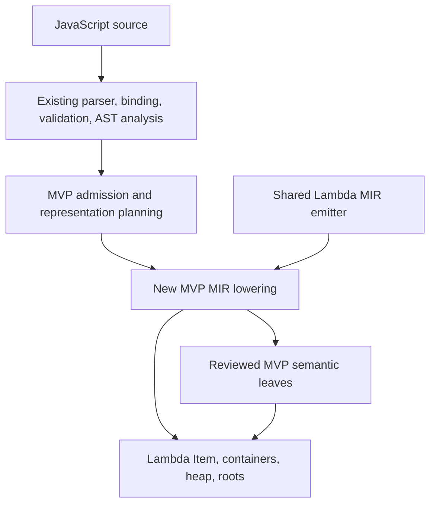

# JS MVP Lmd — JavaScript MIR on the untyped Lambda substrate

**Date:** 2026-10-07

**Status:** scalar/dense-array/function MVP, integer tuning, and the map/plain-object
phase implemented. Current validation and measurements are recorded in §10.8.

**Destination:** `lambda/js/mvp-lmd/`

**Scope:** JS execution on Lambda's values, containers, memory ownership, and
MIR infrastructure. This document records design and the latest measurement
round; implementation narratives and earlier measurement rounds are omitted.

## 1. Objective and fixed constraints

Execute the admitted JS subset efficiently on untyped Lambda's substrate.
The four governing goals remain fixed (USER, 2026-10-07):

1. **Keep emitted MIR minimal.** Use retained analysis to avoid unnecessary
   checks, conversions, roots, wrappers, and function bodies.
2. **Keep new helpers and helper code minimal.** Reuse audited Lambda/lib
   primitives; count internal utilities, adapters, and shared additions too.
3. **Implement exactly the admitted scope.** Section 3 describes the shipped
   subset; §10 records the object/Map extension. Excluded capabilities receive
   diagnostics, without reserved machinery for later features.
4. **Keep the MVP as efficient as possible.** Preserve native computations and
   direct storage/calls where proven; measure release performance with fixed
   sources and correctness oracles.

These goals apply together. Correct JS results, precise ownership, and the
execution boundary take precedence over reducing a single size metric.
Retain added machinery only when its semantic need or measured benefit
justifies its MIR, helper-code, allocation, and execution cost.

Keep the existing JS parser, AST, binding, validation, and applicable analysis.
Use new MVP MIR lowering over Lambda `Item`, scalar lanes, containers, roots,
and the shared emitter. **Call no existing JS runtime helper, directly or
transitively**, including during collection, error handling, and teardown.
Do not fall back into full LambdaJS or the retired private-value MVP.
Present each new helper and its dependency closure for review before coding.

The [formal semantics](../../doc/Lambda_Formal_Semantics.md) and
[formal design](../../doc/Lambda_Formal_Design.md) govern this design:

| Concern | Authority |
|---|---|
| Hosted JS retains ECMAScript behavior | **S1.11**, **D1.1** |
| Host values and shared physical substrate | **D1.2v2–D1.3v3** |
| Integer subtype and numeric FFI | **D2.2.5**, **S4.9.1** |
| Representation is distinct from conversion | **D2.4.1–D2.4.3** |
| Nominal objects and shared map layouts | **D2.6.6v3**, **D2.6.9v3**, **D3.4.1–D3.4.7** |
| Name identity | **S8.2.2v5**, **D3.4.4v4**, **D4.6.1v4–D4.6.2v2** |
| Returned failures and precise ownership | **D1.4v4**, **D1.5v2**, **D5.2–D5.3**, **D8.4.3v2** |
| Retained analysis and immutable specialization | **D8.2.1–D8.2.6**, **D8.3.1v2**, **D8.4.1v2** |

## 2. Shared substrate and semantic ownership



Reuse physical allocation, field storage, shape transitions, scalar ownership,
and control-flow emission. JS owns coercion, equality, reference mutation,
property behavior, and completion semantics (**S1.11**, **D1.3v3**).

Unknown or changing values use `Item`; proven scalar regions use native
registers. An inferred kind selects a representation without restricting
later JS assignments. Lambda COW, structural equality, list spreading, and
null-on-missing conventions do not implement the corresponding JS operations.

## 3. Implemented admission boundary

This table summarizes the implemented subset. Section 10 defines the detailed
object/Map boundary and its scope decisions.

| Area | Implemented | Excluded from the implemented phase |
|---|---|---|
| Scalars | Undefined, null, Boolean, Number, String; NaN, infinities, signed zero | BigInt, Symbol, boxed primitive objects |
| Operators | Arithmetic, remainder/power, bitwise/shifts, comparisons, loose/strict equality, `typeof`, `void`, short-circuiting, conditional/comma; object `in`/property `delete` | Object-to-primitive coercion; `instanceof` |
| Variables | `var`, `let`, `const`; assignments, logical/compound assignments, updates, changing kinds | Destructuring; sloppy implicit global creation |
| Arrays | Dense mixed/nested literals, indexed reads/writes, append at length, length reads/shrink | Holes, sparse writes, other named properties, constructors/methods, descriptors/prototypes |
| Objects/Map | Data properties, own projections, `new Map()` and fixed collection operations (§10) | `__proto__`, descriptors/accessors, proxies, custom prototypes, iterable Map construction |
| Control flow | Blocks, conditionals, while/do/for, direct `for-of` with simple pair binding (§10.5), switch/fallthrough, labels, break/continue, return | `for-in`, general iterators, generators, async, throw/try/catch/finally |
| Functions | Ordinary declarations/expressions, arrows, simple parameters, recursion, function values, indirect calls, program bindings | Enclosing local captures, default/rest/spread parameters, observable `this`/`arguments`/`new.target`, constructors/methods/classes |
| Program | One script with execution-owned bindings and retained early-error/strictness rules | Modules, eval, Function constructor, with, DOM/Node APIs, general global object |

Strings preserve Unicode, including lone surrogates, with UTF-16 length and
indexed code-unit reads. String methods remain excluded.

Unsupported syntax is diagnosed throughout the unit, including unexecuted
functions, before execution. Runtime-dependent unsupported operations return
a capability failure distinct from JS semantic errors. Effects already
performed are neither replayed nor rolled back; failed executions are not
correctness or timing successes.

## 4. Semantic contracts

### 4.1 Values and operators

JS observes one Number type across INT and FLOAT representations (§9).
Primitive conversions distinguish null, undefined, Boolean, Number, and
String. For example, `null + 1` is `1`, `undefined + 1` is NaN, and
`"2" + 1` is `"21"`. Native entry guards test kinds without coercing them.

Use JS truthiness and identity equality for reference values. Logical
operators return the selected operand. Loose equality performs only admitted
primitive conversions; an excluded object-conversion protocol causes a
capability failure. Preserve NaN, signed zero, per-operation binary64 rounding,
ToInt32/ToUint32 wrapping, and JS remainder/power behavior (**S1.11**,
**D2.4.3**).

### 4.2 Bindings and references

- `var` is function/program scoped and instantiated before execution;
  redeclaration without an initializer does not reset it.
- `let`/`const` retain block scope and TDZ; const prevents rebinding without
  freezing the referenced container.
- Program bindings are execution-local and shared by functions in that
  execution. Enclosing function/block captures remain excluded.
- `undefined`, `NaN`, and `Infinity` use resolved intrinsic bindings, with
  proper shadowing, restricted global declarations, and strict/sloppy writes.
  An unresolved read and a TDZ read retain their distinct `typeof` behavior.
- Assignment preserves scalar values and reference aliases. Receiver and key
  are evaluated once before the RHS; compound assignment reads first.
  Retain the owner/key through calls, never a potentially stale data address.
- Preserve prefix/postfix snapshots, logical short-circuiting, switch order,
  and the classic-for update target of `continue`.

These are JS binding/reference contracts under **S1.11**, independent of
Lambda's mutable-value rules in **S9.1**.

### 4.3 Dense arrays

Use ordinary host `Array` with mixed Item elements. Every index below length
is an own data element; stored undefined is not a hole. Aliases and cycles
are valid. Foreign containers and mutable prototypes are outside admission.

| Operation | Contract |
|---|---|
| Literal | Evaluate/store left to right, preserving every value and alias. |
| In-bounds read/write | Read or mutate the own element; assignment returns its original RHS. |
| Read at/above length | Undefined for an admitted canonical index. |
| Write at length | Append one element. |
| Write beyond length | Capability failure before creating a hole. |
| Length assignment | Shrink/retain a valid length; invalid lengths cause RangeError; valid growth is unsupported. |

Numeric `-0` denotes index zero; string `"-0"` does not. `2^32 - 1` is not an
array index. Key conversion runs once. Length conversion, RHS evaluation,
and truncation preserve ECMAScript order and release removed references.
Wide scalar storage is destination-owned across overwrite and growth
(**D5.2–D5.3**). ArrayNum promotion and a private heap are excluded.

### 4.4 Functions and failures

Each source function has one semantic body and chosen entry. All arguments,
including unused extras, evaluate in order; missing arguments are undefined.
Direct-call specialization requires complete stable-target/domain evidence.
Observed function values and indirect calls retain a checked boxed boundary.
Every evaluated function expression has fresh identity.

Proven native scalar calls use the shared companion return/error convention.
Self-tail reentry must preserve argument snapshots and fresh local
initialization. Other recursion retains the ordinary stack checks. All normal
and error exits restore root/number ownership once (**D5.2.1v3**, **D5.3**).

Semantic and capability failures return explicitly through every frame
(**D1.4v4**, **D8.4.3v2**). Pending-error side channels and old JS dispatchers
are excluded; catch/finally remains outside the admitted language.

## 5. MIR design

Retain one AST and semantic-analysis authority. Separate admission, physical
planning, and lowering through the existing pass infrastructure
(**D8.2.4v2–D8.2.6**). Use native arithmetic, branches, direct loads/stores,
and calls where facts suffice. Box at generic boundaries; a guard miss
performs the pending operation once and rejoins the same body.

Use compile-predicted layout guards and shared physical operations on misses.
No mutable inline caches, feedback vectors, speculative body/loop clones,
deoptimizer, interpreter tier, or generic opcode dispatcher is introduced
(**D8.4.1v2**). Keep analysis only where admission or emission consumes it.

## 6. Ownership and execution isolation

Use the host evaluation context, heap, precise roots, scalar homes, source/code
owner, and MIR lifecycle. Execution starts without initializing full LambdaJS.
The execution owner outlives its values and all host inspection of them.

Generated and native calls follow shared rooting/effect contracts. Allocation
may move backing data, so reload it from a rooted owner. Borrowed scalar
payloads become owned before their source can move, mutate, or die. Mutable
slots reuse homes; no pending scalar escapes into a persistent container.

The dependency boundary covers execution, GC tracing/compaction, finalization,
and teardown as well as generated imports. Reuse of a host allocator or
container is valid only when those lifecycle paths also avoid existing JS
runtime callbacks (**D1.3v3**, **D1.5v2**, **D5.3**).

## 7. Helper review policy

The original MVP has ten semantic/runtime helpers, covering failure
creation; string/Number conversion, concatenation, comparison and indexing;
power; array-key classification; array growth/storage; and function identity.
Integer tuning adds none. The object/Map phase adds ten audited entry points;
their contracts and dependencies are recorded in
[JS MVP objects implementation](../impl/JS_MVP_Lmd_Objects.md).

For every proposed addition, review its operation contract, existing reuse
candidates, complete dependencies, GC/scalar ownership, failure completion,
call frequency, and total code cost. A wrapper needs a real ownership, ABI,
or completion adaptation. Promote shared physical work and update its
clients; do not copy a static helper or rename a forbidden JS dependency.

Infallible raw leaves need a transitive no-GC audit. Fallible operations return
explicit completions; other calls are treated as potentially collecting.
Internal utilities and shared additions count toward the helper-code budget.
Section 10.6 records the object/Map phase's completion criteria.

## 8. Acceptance and evaluation

Define admitted fixtures before measuring. Separate passes, semantic failures,
static rejection, and runtime capability failures. Test bindings, numeric
edges, Unicode, aliases/cycles, evaluation order, recursion/indirect calls,
cleanup, and storage ownership normally and under forced GC with freed-memory
poisoning. Exercise rejection paths and lifecycle isolation too.

Shared changes require the Lambda/input baseline and unchanged full-JS
Test262 baseline. The latter checks full-JS nonregression; it does not establish
MVP conformance. Do not alter harnesses, oracles, timeouts, or budgets to pass.
Any new Lambda script regression also needs its expected result file.

Compare release builds with fixed sources, inputs, and result checks. Report
workload execution separately from startup/compilation, retain failed and
regressed rows, and disclose Lambda-port differences. Record emitted MIR,
branches/conversions/calls, roots/homes, body count, helper-code cost, and
memory alongside timing. Additional tuning must earn its cost; source-line
reductions never come from removing comments or changing formatting.

## 9. Integer-tuning phase

**Accepted and implemented:** USER, 2026-10-07; **D2.2.5**.
This phase extends the implemented scope's internal representations without
adding JS syntax or restricting later assignments.

### 9.1 Runtime subtype and observable behavior

Lambda `int` is an internal subtype of JS Number. Finite integers in
±(2^53 - 1), excluding negative zero, may use canonical INT Items and proven
native integer lanes. Fractions, negative zero, out-of-band Numbers, NaN,
and infinities use the existing FLOAT representation. INT zero means `+0`.

All numeric consumers accept both representations. Equal INT/FLOAT Numbers
compare equal; NaN remains unequal to itself. A FLOAT tag does not imply a
fraction. Narrowing requires a finite, integral, in-band value with the
correct zero sign. No universal retagging pass is required. The host numeric
FFI still exports JS Number as Lambda float (**S4.9.1**).

### 9.2 Arithmetic and widening

Preserve binary64 rounding at each JS operation. Integer addition/subtraction
may retain an in-band result; otherwise use the original operands for double
arithmetic. Multiplication needs complete overflow/range/zero-sign proofs.
Division remains double unless exactness and zero sign are proven; remainder
must preserve negative zero and zero-divisor NaN. Bitwise/shift operations
retain JS 32-bit conversion rules. Power retains its JS Number contract.

A failed guard executes only that operation, without replaying effects.
Lambda saturation and out-of-band exact intermediates are forbidden
(**S1.11**, **S4.1.2**, **D2.4.3**).

### 9.3 Representation proofs

Facts cover all writes, joins, backedges, call edges, implicit returns, and
possible negative zero. A terminating conservative analysis falls back to
Number/Item when it cannot prove a range. Integer regions require complete
bounds; no workload/input-specific assumptions are allowed. In particular,
Collatz and recursive Fibonacci do not acquire integer workers merely because
one measured input stays in range.

### 9.4 Storage and calls

INT survives program slots, arrays, mixed locals, and generic calls. FLOAT
ownership remains correct through overwrites and growth. Native functions
select a carrier valid for every admitted call and return, retaining one body
and the shared completion ABI (**D5.2–D5.3**, **D8.4.2v2**).

### 9.5 Acceptance

Verify actual Item kinds, widening, intermediate rounding, signed zero,
machine overflow, proof invalidation, and alias/call boundaries. Retain
integer guards only with correctness, ownership, MIR-size, and release
measurement evidence. This phase introduced no new runtime helper.

### 9.6 Archived integer evidence — 2026-10-07

The preceding integer-tuning measurements are retained in
[`integer_mir_20261007.json`](../../test/benchmark/js_mvp_lmd/integer_mir_20261007.json).
The latest round of phase results is §10.8.

## 10. Map and plain-object phase

**Status:** IMPLEMENTED; user constraints recorded 2026-10-07. The phase extends
§3 while retaining §1's four goals and the execution-isolation boundary.
Section 10.7 records scope decisions; §10.8 contains the latest results.

**Fixed direction:** reuse Lambda map/object storage and shape transitions;
align string-key identity through shared canonical UTF-8; include map
iteration along the model of Lambda for-expressions/loops; exclude
`__proto__`, advanced descriptors, accessors, and proxies. **Use no VMap for
either plain objects or ES Map collections, including their backing storage.**
Possible VMap use for exotic features belongs to a separate future phase and
introduces no hook or dependency here.

### 10.1 Admission boundary

| Area | Added in this phase | Excluded |
|---|---|---|
| Plain objects | Empty/nested literals; named, shorthand and computed data properties; values of any admitted kind | Getters/setters, descriptor APIs, spread, classes and user constructors |
| Properties | Dot/computed reads, assignments, compound/logical assignments, updates, addition, deletion, `in`, own-presence checks | Object-to-primitive key conversion, Symbols, private-field syntax, prototype mutation, `instanceof` |
| Object projections | `Object.hasOwn`, `Object.keys`, `Object.values`, `Object.entries` on plain objects and ES Map's attribute face | Projections of arrays/functions/primitives; general reflection and arbitrary host/foreign objects |
| ES Map | `new Map()`, `get`, `set`, `has`, `delete`, `clear`, `size`; admitted values as keys/values | Iterable constructors, subclassing, weak collections, callbacks/`forEach` |
| Iteration | Direct `for-of` over Map entries/keys/values and object projections; simple pair binding as described in §10.5 | General iterator objects/protocols, custom iterables, generators, async iteration, general destructuring, `for-in` |

All `__proto__` **property** forms are excluded: literal definitions, dot
access, and computed access after key conversion. A dynamic spelling must
reach the same capability diagnostic. This phase implements no prototype
setter or literal special case for that name.

Ordinary data properties have the default writable/enumerable/configurable
behavior without materialized descriptor records. Missing own properties
remain distinguishable from present properties holding undefined. Object/Map
values are truthy, use identity equality, and preserve aliases through const
bindings, parameters, arrays, and returns (**S1.11**).

Resolve `Map` and `Object` operations through binding and receiver facts;
shadowed identifiers or overwritten members never receive a builtin fast
path merely because their spelling matches. Unsupported builtin escapes or
prototype observations receive capability diagnostics under §10.7.

### 10.2 Ordinary Lambda storage and shape transitions

Plain objects use the ordinary Lambda `Map` carrier, `TypeMap`/`ShapeEntry`
layout, and a nominal object-family record. ES Map uses the same ordinary
object carrier with a distinct nominal family and internal collection state.
Every transition preserves nominal identity (**D2.6.6v3**, **D2.6.9v3**).
No VMap carrier, backend, or virtual property dispatch participates.

Use the shared transition tree for property addition and field retyping
(**D3.4.3v5–D3.4.6**). Shapes reached by the same ordered fields and storage
contracts share metadata within the same semantic family:

```text
empty -> {x: INT} -> {x: INT, y: STRING}
              \-> {x: STRING}
```

- Compatible overwrites retain the layout. An incompatible write selects a
  new shape and repacks as necessary; equal byte widths alone are insufficient.
- Shared fields remain immutable. Mutating one instance never retags a
  sibling's fields. All shape walks respect the owning shape's field boundary.
- Growth/repacking publishes storage and shape consistently, with explicit
  failure and no partially committed object. Transition-budget exhaustion
  selects the shared substrate's private-shape fallback without narrowing JS.
- Deletion initially rebuilds the live shape; re-adding a string property
  gives it a new creation position. Undefined cannot stand in for deletion.
- Fixed literals may use a predicted final shape while preserving initializer
  order, duplicate-key effects, and last-write values. Dynamic layouts use
  transitions. Never publish uninitialized references to the collector.

Named accesses use proven offsets or immutable predicted-shape guards, with
a small semantic property operation on a miss (**D8.4.1v2**). Stores recheck
the shape after RHS calls that may mutate an alias. Retain owner/key/value
roots and scalar ownership through conversion, growth, and repacking
(**D5.3**).

Reuse requires separating neutral storage work from existing full-JS hooks.
The current general map setter can enter JS shape helpers, and the generic
transition tree declines full-JS metadata layouts. The MVP needs an explicit
data-only nominal family and audited shared storage operations; copying the
old JS property kernel or hiding it behind a wrapper is excluded. Preserve
semantic-family identity when sharing a layout (**D1.3v3**, **D3.4.7**).

### 10.3 Shared canonical UTF-8 key identity

**User direction:** Lambda and MVP string keys share canonical UTF-8 identity.
Reuse one common canonicalization/name mechanism for literals, computed keys,
lookup, hashing, transitions, and enumeration. A separate JS interning scheme
would recreate the same-spelling/different-pool problem.

Under **S8.2.2v5**, **D3.4.4v4**, and **D4.6.1v4**, the key is the resolved
namespace and decoded spelling. Equal NameIds may prove equality; differing
or absent IDs still require kind/namespace/length/content comparison. Hashes
route lookups and never prove identity. Empty and embedded-NUL names are valid.

The encoding contract is canonical UTF-8 for Unicode scalar values:
equivalent literal escapes and computed strings produce the same bytes.
Canonicalization preserves the character sequence; it performs no NFC/NFKC,
case folding, or locale transformation. In particular, composed and decomposed
spellings remain distinct JS keys, as required by **S1.11** and the
[ECMAScript String model](https://tc39.es/ecma262/multipage/ecmascript-data-types-and-values.html#sec-ecmascript-language-types-string-type).

**S8.2.2v5**, **D4.6.1v4:** JS also admits lone UTF-16
surrogates. Use the shared lossless WTF-8 extension for those units, combining
valid surrogate pairs into their canonical scalar encoding. Never replace a lone surrogate with U+FFFD for
key identity. This keeps the existing MVP string domain and gives equal
code-unit sequences one key representation. It does not change UTF-16 JS
length, indexing, or comparison to byte-based operations.

NamePool creation/lookup, shared shape additions, and dynamic Lambda map
reads/writes now canonicalize at their boundaries. Focused coverage checks
computed JS keys against Lambda map lookup, including embedded NUL. Ordinary Map string keys use the same
canonical string-content relation; other Map keys retain §10.4's rules.

### 10.4 ES Map entry storage

Object properties and collection entries are separate domains:
`m.x = 1` does not create the entry addressed by `m.get("x")`. Property
shapes describe the ordinary object's fields; arbitrary collection keys
cannot be encoded as ShapeEntry property names.

Use host-owned ordered Item storage and a `lib` hash index of stable entry
positions inside the ordinary Map's collection state. Keep all key/value
edges visible to precise tracing and own numeric payloads across overwrite,
growth, and deletion. The native index must not hide untraced Item references;
its lifetime follows the collection. No VMap is involved (**D1.3v3**, **D5.3**).

Keys follow SameValueZero: INT/FLOAT forms of one Number share a key, NaNs
match, and both zeros share the canonical zero key. Reference keys use
identity. Updating an entry retains its order; delete/reinsert moves it to
the end. Missing `get` returns undefined, `has` distinguishes presence,
`set` returns the receiver, and `delete` reports whether an entry existed.
These follow the [ECMAScript Map contract](https://tc39.es/ecma262/multipage/keyed-collections.html#sec-map-objects)
under **S1.11**. `size` is the live entry count; supporting this fixed builtin
observation does not admit user-defined accessor machinery.

### 10.5 Iteration through the shared loop model

**User direction:** map iteration should resemble Lambda for-expressions and
loops. Reuse their traversal, key/value binding, control-flow, and rooting
model (**S8.1.2v2**, **S8.2.1v4**, **S8.4.1v2**, **D8.2.6**), while preserving
JS syntax and observable behavior under **S1.11**.

| JS surface | Loop binding |
|---|---|
| `for (const [k, v] of m)` / `for (const [k, v] of m.entries())` | Key and value, analogous to Lambda `for (k, v in m)` |
| `for (const k of m.keys())` | Key only |
| `for (const v of m.values())` | Value only |
| `for (const pair of m)` | A fresh ordinary `[key, value]` array when observable |
| `for (const k of Object.keys(o))` | Own string keys |
| `for (const v of Object.values(o))` / pair binding over `Object.entries(o)` | Own values / key-value pairs |

The pair pattern is restricted to two simple bindings without defaults/rest;
it does not admit general destructuring or captured per-iteration locals.
Collection and projection expressions evaluate once. Proven intrinsic loop
sources lower directly to a cursor/key/value loop; escaping iterator values
and custom iterator protocols remain unsupported. Elide an entry array only
when its identity and contents cannot be observed independently.

Share neutral traversal primitives rather than adopting Lambda's existing
symbol-key list or fixed-length walk unchanged. JS Map loops are live:
skip deleted entries, observe later updates to unvisited entries, and visit
entries appended before exhaustion, including delete/reinsert. Clear and
nested iteration must preserve each active cursor. Do not cache initial size
as the termination bound or compact storage in a way that invalidates cursors.
These requirements follow [CreateMapIterator](https://tc39.es/ecma262/multipage/keyed-collections.html#sec-createmapiterator).

Object projections instead produce snapshots at expression evaluation;
lazy lowering must not change their captured keys/values. Array-index keys
come first in numeric order, followed by other strings in creation order.
Retyping preserves order; deletion/re-addition changes it as above. This is
[ordinary own-property order](https://tc39.es/ecma262/multipage/ordinary-and-exotic-objects-behaviours.html#sec-ordinaryownpropertykeys),
not a change to Lambda iteration semantics. General `for-in` remains excluded.

### 10.6 Completion criteria

Acceptance covers shared-shape siblings, add/retype/delete/re-add, aliases,
cycles, duplicate keys, undefined versus absence, exact evaluation order,
cross-pool and computed key identity, Unicode boundaries, collection key
identity/order, mutation during nested iteration, and rejection of excluded
property forms. It includes scalar relocation, native-index cleanup under
forced GC, and zero existing-JS-runtime callbacks.

The implementation record and concrete helper inventory are in
[JS MVP objects implementation](../impl/JS_MVP_Lmd_Objects.md). Apply §8's
focused and shared baseline gates. Release measurements cover fixed fields,
computed growth, retyping, deletion churn, lookup/update, and key/value loops.

### 10.7 Scope decisions

- Canonical keys use lossless UTF-8/WTF-8 with no Unicode normalization
  (**S8.2.2v5**, **D4.6.1v4**).
- Fixed intrinsic prototype operations beyond this phase's admitted builtins
  produce capability diagnostics. An inherited method is never reported as
  an absent own field. Extracted Map method values and builtin mutation are
  diagnosed; shadowed user bindings and own methods follow ordinary calls.
- Native ordered-entry storage is traced and finalized by the shared GC.
  Active loops preserve slot positions; inactive storage can compact.
  Neither VMap nor existing JS lifecycle hooks participates (**D2.6.9v3**,
  **D5.3**).
- `__proto__`, descriptors, accessors, proxies, user prototype mutation,
  general iterator objects/callbacks, and general destructuring remain outside
  this phase. No further scope decision blocks the admitted subset.

### 10.8 Latest validation and release evidence — 2026-10-07

- Focused MVP suite: **30/30** groups.
- New object/Map groups with `LAMBDA_GC_FORCE_EVERY=1` and
  `LAMBDA_GC_POISON_FREED=1`: **10/10**.
- Shared Lambda/input baseline: **6,286/6,286**, including **194/194** full-JS
  script/ownership groups and the canonical-string client regression.
- Unchanged full-JS Test262 regression gate: **exit 0, zero semantic failures
  or regressions**. Latest rerun: **40,259 fully passed + 2 retry-only** out of
  40,261. Unicode identifier-start cases for versions 9 and 10 remain batch
  unstable/slow; both pass isolated retry. This is not a clean all-fully-passing
  result. No runner, baseline, timeout, or test expectation was changed.

Release comparison: five fresh-process samples per engine, rotating order,
after one untimed process. Timings exclude startup, compilation, printing and
teardown; MVP measures program entry, while full JS and Node bracket `work()`.
Node's tiering within that call is included. All **6/6** workload oracles pass.

| Workload | MVP ms | Full JS MIR ms | Node ms | MIR instructions, MVP / full JS |
|---|---:|---:|---:|---:|
| Fixed fields | 3.367 | 10.074 | 1.667 | 1,047 / 894 |
| Computed growth | 3.777 | 42.708 | 4.061 | 1,103 / 850 |
| Retyping | 38.161 | 60.650 | 1.534 | 858 / 794 |
| Delete/re-add | 3.159 | 96.198 | 1.115 | 1,052 / 881 |
| Map lookup/update | 28.739 | 108.679 | 3.939 | 1,203 / 976 |
| Map key/value loop | 1.923 | 674.256 | 3.617 | 1,358 / 1,085 |

MIR counts are finalized before JIT and include cold/error paths. MVP emits
two bodies per workload; full JS emits three. MVP's emitter plans use 6–12
root slots and 7–16 scalar homes in total across those bodies. Static MIR is
larger than full JS in all six rows, despite fewer calls and bodies. Further
MIR reduction and retyping/lookup performance remain tuning work. These
cross-engine measurements do not establish a causal optimization gain.

Separate single-process peak RSS observations, including startup and JIT:
MVP **27.6–30.6 MiB**, full JS **31.1–150.0 MiB**, Node **45.3–47.3 MiB**.
These are process peaks, not live container sizes or allocation counts.

Code cost: **20 imported MVP runtime entries**, ten added in this phase;
**333 lines** of new object/Map runtime code including internal utilities,
and **503 runtime C++ lines** total. The MIR compiler adds 468 net lines;
shared substrate changes add 244/remove 33 lines. The full-JS encoding client
fixes add 28/remove 13 lines. Counts include comments and blank lines.

The checked sources, raw timing samples, MIR/frame metrics, RSS observations,
gate logs and hashes are indexed in
[`objects_mir_20261007.json`](../../test/benchmark/js_mvp_lmd/objects_mir_20261007.json).
Release binary SHA-256:
`3e2cc7f7d392493c4874a182b987d0147b2f52657b7603579c895053d58678af`.
Its exact archive and fresh MIR artifacts remain under `temp/mvp_lmd_objects/`.
