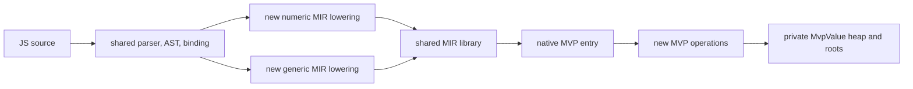

# JS MVP Runtime

**Version:** 1.1.1

**Date:** 2026-09-16

**Status:** IMPLEMENTED — the selected runtime executes the frozen 63-workload
standard JavaScript benchmark population through a new MIR execution core. Two
fresh release sessions meet the requested MVP / QuickJS geometric-mean target:
**0.695110x** and **0.691519x**. Every engine/row/session sample is recorded in
[JS_MVP_Release_Acceptance_20260915.md](../../test/benchmark/js_mvp/JS_MVP_Release_Acceptance_20260915.md).

The later Lambda-`Item` alignment experiment is recorded as abandoned history in
§7. It is not the selected runtime or a compatibility fallback.

The follow-up [full LambdaJS comparison and optimization proposal](JS_MVP_Full_Runtime_Comparison.md)
traces v1's performance advantages, records fresh diagnostic measurements, and
identifies designs that can improve the full engine while retaining Lambda types
and ECMAScript semantics (**S1.11**, **D1.3v3**, **D8.4.1v2**).

## 1. Objective and acceptance boundary

The MVP is a new JavaScript execution runtime selected by:

```sh
./lambda.exe js --runtime=mvp script.js
```

It reuses the existing JavaScript parser and AST builder. It does not reuse the
existing JavaScript execution representation, coercion, property, call, heap,
or MIR helper layer. It compiles accepted scripts directly to MIR and executes
the resulting native entry point.

The owner fixed the MVP boundary on 2026-09-15:

- The acceptance population is the standard runner's **63 canonical workloads**.
  Repository microbenchmarks diagnose performance only.
- The performance target is the geometric mean of each row's MVP / QuickJS
  execution-time ratio, at most **0.80x**. Every row is reported. There is no
  per-row 0.80x requirement.
- The scope is a synchronous benchmark runtime. Modules, DOM, async scheduling,
  general Node loading, and full ECMAScript conformance are outside this MVP.

The frozen source, input, and wrapper identities are in
[js_mvp_manifest_v1.json](../../test/benchmark/js_mvp_manifest_v1.json). Run
`python3 test/benchmark/verify_js_mvp_manifest.py` before accepting a result;
it rejects changed sources, inputs, wrapper descriptions, or population size.

## 2. Design decisions

**JM1 — Reuse the untyped Lambda substrate, keep JavaScript semantics private.**
This implements **D1.3v3**. The MVP reuses source admission, the parser/AST
builder, the MIR library lifecycle, `memtrack` allocation categories, diagnostics,
and release/baseline workflow. It does not create a second host runtime, event
loop, general allocator framework, source cache, or compiler backend.

A private representation is used only where an untyped Lambda representation
would change guest identity, coercion, property, or tracing semantics:

| Reused host capability | New MVP capability |
|---|---|
| `InputScriptCache` source admission under `js-mvp` / `js-mvp-mir` ABI keys | `MvpValue` NaN-boxed JS values |
| `js_transpiler_parse_c()` and AST/binding/index facts | private tracing heap and root frames |
| MIR public API and native generation | direct numeric and generic JS-to-MIR lowering |
| `mem_calloc` / `mem_free`, `MEM_CAT_JS_RUNTIME`, `str_copy` | strings, objects, arrays, Map, functions, closures, BigInt, RegExp, Date and JSON behavior |
| `lambda_finite_double_to_shortest()` | all JS number conversion, coercion, string construction and JSON policy |
| CLI dispatch, release build and baseline gates | benchmark host globals, timing, stdout and synchronous `fs.readFileSync` |

The finite-double formatter is the sole semantic helper retained from untyped
Lambda. It has exactly two audited boundary calls: finite Number-to-text and
finite JSON-number spelling. It receives an already classified MVP Number and
never boxes values or makes a JavaScript coercion decision.

**JM2 — One direct execution path.** `mvp_execute_source()` parses and validates
through the shared frontend, tries a numeric direct-MIR lowering, then uses the
generic direct-MIR lowering for the remaining accepted AST. The generic path is
not an AST interpreter and never transfers execution to LambdaJS. Both paths
link their own imports, create a private `MvpExecution`, call the generated
native entry, and return an `MvpExecutionResult`.



**JM3 — Keep the hot call flow small.** Known numeric functions lower to native
MIR arithmetic and direct calls. Generic functions use a single MVP function
ABI, private closure environments, and `MvpExecutionFrame` roots. A generic
property access uses the private property kernel; a compiler-proved own field
on `this` uses the corresponding private indexed lookup. Method direct calls are
limited to source classes without a top-level subclass, so prototype dispatch
remains correct where the proof is absent. There is no bytecode VM, tiering,
inline cache, feedback vector, deoptimization, or benchmark-specific rewrite.
This is consistent with **D8.4.1v2**.

## 3. Runtime representation and call flow

### 3.1 Values and heap

`MvpValue` is a one-word private NaN-boxed ABI. It preserves IEEE-754 Numbers,
including NaN, infinities, and negative zero; tagged values represent undefined,
null, booleans, and private heap references. It never aliases Lambda `Item`, as
required by **D1.2v2**.

`MvpHeap` is a new non-moving mark-and-sweep heap. Heap objects form a private
allocation list, and each kind traces its owned `MvpValue` edges explicitly.
`MvpRootFrame` roots only private values. This follows the ownership discipline
of **D1.5v2** without restoring retired native-stack scanning. The execution
owns the global root frame, literal cache, active function frames, and a reusable
frame pool. Leaving a function clears every pooled slot before reuse, so a
released local cannot retain a JS object.

The environment variable `MVP_GC_FORCE_EVERY=1` requests collection at every
eligible allocation. It is an MVP heap switch, not a legacy JS GC setting.

### 3.2 Objects, names, and strings

Objects and Maps have a private insertion-ordered backing store plus a private
open-addressed index. Keys use a cached byte hash. Parser-literal names retain
their source-byte address in the per-execution literal cache, so a repeated
static lookup proves identity before a byte comparison; dynamic names retain the
same hash-and-bytes semantics. Objects, prototypes, arrays, functions, classes,
and closures all remain in the MVP heap.

Arrays use contiguous private `MvpValue` storage with geometric growth. Strings,
BigInts, regex payloads, Date values, array backing, Map backing, and function
environments have explicit heap ownership. The code does not route any of those
operations through LambdaJS helpers, Lambda `Map`/`ShapeEntry`, or an existing
JS object carrier.

### 3.3 Admitted benchmark semantics

The implementation covers the executed features in the frozen population:

- primitive values, number/string coercion, equality, bitwise operations,
  lexical bindings, branches, loops, switches, return/break/continue;
- declarations, expressions, arrows, recursive functions, mutable captures,
  default parameters, receiver handling, `call`/`apply`, and callbacks;
- object and array literals, indexed accesses, methods, classes, inheritance,
  `super`, prototype lookup, enumeration, arrays and their admitted higher-order
  methods;
- Map keys and entries, regular expressions, BigInt arithmetic and formatting,
  Date/JSON paths, string methods, and the benchmark's synchronous file/timing/
  output host surface.

A parser or lowering failure is reported as a capability error. Runtime faults
and uncaught benchmark verification throws terminate the selected script with a
private error result. The benchmark workload does not execute a catch/finally
recovery path. General in-function throw/catch/finally propagation remains
outside this synchronous benchmark profile; accordingly this is not a claim of
full ECMAScript error conformance. The formal returned-completion ruling
**D1.4v4 / D8.4.3v2** remains marked partial in the implementation footnote.

## 4. Independence audit

The source boundary is enforced by:

```sh
python3 test/benchmark/verify_js_mvp_isolation.py
```

The audit permits only `js_transpiler_*` and `js_ast_*` APIs and the parser/AST
headers. It rejects legacy execution-state types and legacy interpreter, runtime,
MIR, value, GC, coercion, operator, and evaluation helpers in every MVP source
file. It also verifies the two finite-number formatter calls described above.

A frontend-only link target is intentionally not claimed: parser/AST admission
is currently provided by the shared frontend translation unit. Source and direct
symbol auditing are the meaningful executable boundary while reusing that
frontend. This is the revision made after reviewing the implementation; the
previous design's standalone-link promise was not true of the shipped code.

## 5. Tests and memory validation

The focused suite is `test/test_js_mvp_gtest.cpp`. It covers the private value
ABI, tagged completion payload representation, tracing, literal cache rooting,
frame-pool clearing, direct numeric MIR, generic MIR, closures, classes/super,
objects, arrays, Map, strings, Date, JSON, file input, host timing/output, and
an uncaught throw at the script boundary.

Verified on 2026-09-15:

```sh
make -C build/premake -s test_js_mvp_gtest -j8 CC=clang CXX=clang++
./test/test_js_mvp_gtest.exe                         # 51 passed
MVP_GC_FORCE_EVERY=1 ./test/test_js_mvp_gtest.exe    # 51 passed
python3 test/benchmark/verify_js_mvp_manifest.py
python3 test/benchmark/verify_js_mvp_isolation.py
make test-lambda-baseline                            # 5,546 / 5,546 passed
make test262-baseline                                # zero baseline regressions
```

The forced-GC run includes allocation, string, array/object backing growth,
closure, class, Map, file, and callback paths. `ExecutionFramePoolClearsReleasedPreciseRoots`
checks both collection of a released local and cleared-slot reuse.
The Test262 runner recovered two known batch-unstable Unicode cases in its retry
phase; it reported zero failures and zero regressions against the 40,261-entry
baseline.

## 6. Performance acceptance

Each run uses the normal release binary and the standard benchmark runner:

```sh
python3 test/benchmark/run_benchmarks.py \
  -e mvpjs,quickjs -n 3 -t 120 --cooldown 0 --fresh --legacy \
  --results-output test/benchmark/js_mvp/js_mvp_release_session<N>.json
```

The runner executes an isolated process for each sample, preserves the source
self-check and `__TIMING__` payload, rejects nonzero exits and `FAIL` output, and
stores every sample. The generated acceptance tool requires three `ok` execution
time samples for MVP and QuickJS on every manifest row. It computes:

```text
R = exp(sum(log(MVP_i / QuickJS_i)) / 63)
accept when R <= 0.80
```

| Fresh session | Time | Host | QuickJS | MVP / QuickJS | Result |
|---|---|---|---|---:|---|
| 1 | 21:09:01–21:19:17 | Darwin arm64 | 2025-09-13 | 0.695110x | pass |
| 2 | 21:19:20–21:29:28 | Darwin arm64 | 2025-09-13 | 0.691519x | pass |

Both sessions used Lambda SHA-256
`11260c2c60d522efe0167c6df0f53d42e4781370b8ada3a5d0f74eac38dad0fb`
and QuickJS SHA-256
`2c8923f779fdfbad032d48f7f1f6442e4a99bbed619dd0182d3758acfc9d85e3`.

The generated [Markdown report](../../test/benchmark/js_mvp/JS_MVP_Release_Acceptance_20260915.md)
and [machine summary](../../test/benchmark/js_mvp/JS_MVP_Release_Acceptance_20260915.json)
contain each row's MVP and QuickJS medians, both ratios, complete session
provenance, and the target decision. They are generated by:

```sh
python3 test/benchmark/report_js_mvp_result.py \
  --session test/benchmark/js_mvp/js_mvp_release_final_session1.json \
  --session test/benchmark/js_mvp/js_mvp_release_final_session2.json \
  --output test/benchmark/js_mvp/JS_MVP_Release_Acceptance_20260915.md \
  --json-output test/benchmark/js_mvp/JS_MVP_Release_Acceptance_20260915.json
```

Rows slower than QuickJS remain in the report. Examples include `beng/revcomp`,
`beng/pidigits`, `awfy/richards`, `awfy/nbody`, `awfy/bounce`,
`text/prettier_ast`, `larceny/gcbench`, and `jetstream/hashmap`. They are not
excluded, reweighted, or replaced by a native benchmark implementation.

## 7. Abandoned v2 Item-alignment experiment

### 7.1 Intent and formal boundary

After v1 met the benchmark target, a v2 experiment tried to satisfy the stronger
unification goal by making JavaScript values use Lambda's `Item` currency and
container substrate. This was an implementation experiment, not a change to the
formal rulings. It explored **D1.2v2**, which allows a private guest ABI only
behind an explicit host adapter, and **D1.3v3**, which requires a guest to reuse
applicable untyped-Lambda substrate before introducing private machinery.
Precise shared rooting remained governed by **D1.5v2**.

### 7.2 Design that was tried

The v2 header replaced the private one-word `MvpValue` ABI with Lambda `Item`
and removed the private `MvpHeap`, `MvpHeapObject`, `MvpRootFrame`, literal-cache,
and compound-value declarations. The execution owner instead carried a shared
`Runtime*`, a `LambdaRootFrame`, a `LambdaSideStackSnapshot`, and `Item` slots
for globals, the current prototype home, the result, and the return handoff.

Arrays and object-like values were rebuilt on Lambda's container and attribute
storage, allocation ownership, GC tracing, and side-root stack. JavaScript-only
behavior stayed in the MVP semantic layer: property/prototype dispatch,
functions and closures, BigInt, RegExp, Date, and typed-array write coercion
(the latter used a small `MvpItemArrayElementKind` descriptor). JSON parsing and
formatting were switched to the existing Lambda JSON input and formatter paths.
The MIR entry and parser/AST admission remained the v1 direct-MIR flow. Thus the
experiment removed duplicate physical carriers, but it did not remove the JS
semantic kernels or their dynamic checks. That separation is also consistent
with **D8.1.3v10**, which keeps JS and Lambda semantic walkers and activation
records distinct.

### 7.3 Benchmark result

The archived capture is
[JS_MVP_Abandoned_V2_20260916.json](../../test/benchmark/js_mvp/JS_MVP_Abandoned_V2_20260916.json).
It used the standard 63-row population, three samples, a 120-second timeout,
Darwin arm64, and QuickJS 2025-09-13 at commit `f72f7552b0`.

| Capture | Successful rows | MVP / QuickJS geometric mean | Interpretation |
|---|---:|---:|---|
| v1 accepted session 1 | 63/63 | 0.695110x | pass |
| v1 accepted session 2 | 63/63 | 0.691519x | pass |
| v2 aligned capture | 62/63 | 1.517897902x | incomplete; fail |
| v2 lower bound with `text_search` charged at 120 s | 63/63 equivalent | **>1.527059684x** | fail |

`text_search` was the missing row: MVP timed out while QuickJS completed in
54,111.715 ms. A separate one-sample diagnostic after the alignment work
measured `beng/knucleotide` at 599.017 ms versus QuickJS at 12.537 ms (47.78x)
and `jetstream/hashmap` at 12,681.957 ms versus 498.514 ms (25.44x). Those two
probe values are diagnostic, not acceptance samples. The v2 lower bound is more
than 2.20x the accepted v1 ratio, so it missed the original 0.80x gate by a wide
margin.

### 7.4 Abandonment decision

The experiment was rolled back before the selected v1 implementation was
changed. The measured regression is a structural observation: hot JavaScript
operations moved from private tagged words and direct private pointers to
`Item` tag classification, shared shape/attribute ownership, shared GC/root
bookkeeping, and JS adapters layered over those paths. Reusing JSON eliminated
some duplicate code, but it did not offset the per-operation representation and
ownership cost. The retained v1 private ABI is therefore intentional under
**D1.2v2** and **D1.3v3**, with its private roots still proved under **D1.5v2**;
v2 is not kept as a runtime mode or fallback.

The v2 run and v1 acceptance sessions were separate captures at different
commits, so they establish a regression observation rather than a causal
interleaved A/B proof. Any future unification attempt must use the same archived
inputs and an interleaved release comparison before attributing a change to one
structural component.

## 8. Review findings and remaining product boundary

The implementation review removed several inaccurate promises from the earlier
proposal: it does not have a frontend-only link target; it does not use a
separate `MvpContext`/planner layer; it uses simple `MvpExecution` ownership;
and it does not implement a general catch/finally completion protocol. None is
needed to run the agreed benchmark population. Keeping those claims would have
made the design less reviewable than the code.

`lambda/js/mvp/` is 10,329 source lines and the focused suite is 733 lines. The
original aspirational line budget has therefore been removed rather than used as
a false completion criterion. The source is organized by the actual responsibility
boundaries: frontend adapter, values, heap, numeric MIR, generic MIR, MIR entry,
and runtime semantics.

The selected runtime deliberately rejects modules and DOM. Broader JavaScript
conformance, cross-runtime object interoperation, asynchronous behavior, and
fully returned in-function language completions require a separate proposal and
must not silently fall back to LambdaJS. The normal LambdaJS engine remains the
broader compatibility path.

## 9. Completion checklist

| Requirement | Evidence | Status |
|---|---|---|
| Reuse existing JS parser/AST builder | `mvp_frontend.cpp` uses `js_transpiler_parse_c()` | complete |
| New MVP MIR runtime | private value/heap/runtime plus direct numeric and generic MIR files | complete |
| Support 63 standard workloads | two fresh 63-row, three-sample release sessions | complete |
| No legacy JS runtime helpers/data structures | isolation audit and private runtime layouts | complete |
| Align with untyped Lambda | D1.3v3 substrate reuse table and normal project gates | complete |
| Simple call flow | one parser adapter, two direct MIR paths, one private execution owner | complete |
| MVP / QuickJS geometric mean <= 0.80 | 0.695110x and 0.691519x | complete |
