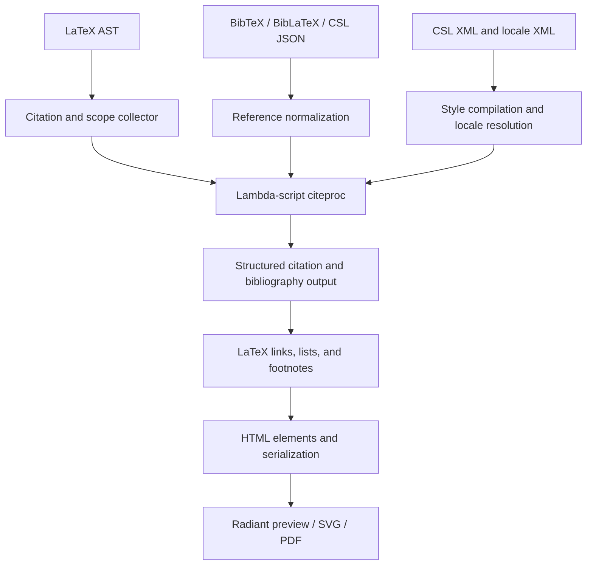

# BibTeX and CSL citation processing in `lambda.latex`

**Status:** Design proposal with an initial bounded implementation, 2026-10-10. The user authorized implementation in `lambda.latex`. Full conformance and the remaining completion gates are tracked in the [implementation record](../impl/Lambda_Impl_BibTeX_CSL.md); this document does not change a formal ruling.

**Confirmed direction:** Use a CSL + citeproc pipeline comparable to Pandoc's. Implement the processor in **Lambda script**, as part of **`lambda.latex`**. Existing libraries may inform the implementation and supply reference results; they are not production runtime dependencies.

**Scope:** Bibliography data, citation processing, and bibliography rendering through the existing LaTeX package and HTML/Radiant output path. Target standard CSL 1.0.2 in stages, with explicit coverage and limitations at every stage.

**Formal linkage:** **D7.2.1–D7.2.4** cover source packages, immutable module bindings, and package resolution; **D7.1.2v2, D7.5.2** cover resource acquisition; **S1.8** keeps source and style data separate from executable programs; **S12.1.1v2, S12.4.1v2** cover pure processing and eager input values; **S7.4.1–S7.4.4** cover failures and located errors; **D4.5.1v4, D4.5.2** cover retaining output in Radiant. See the [formal design](../../doc/Lambda_Formal_Design.md), [formal semantics](../../doc/Lambda_Formal_Semantics.md), and [documentation convention](../../doc/Doc_Convention.md).

## 1. Proposal

Extend `lambda.latex` with a reusable Lambda-script citeproc engine:

> BibTeX/BibLaTeX or CSL JSON → normalized references + document citation requests → CSL style and locale evaluation → structured citations and bibliography → existing HTML/Radiant rendering.

BibTeX supplies bibliographic data. CSL supplies formatting policy. Citeproc evaluates that policy over the whole document, including ordering, disambiguation, and repeated citations. The LaTeX adapter owns command interpretation, reference sections, bibliography placement, links, and footnote integration.

Pandoc provides the architectural comparison: a citation pass consumes bibliography data and CSL, then supplies formatted content to document writers. Its current `citeproc` library is written in Haskell; copying this architecture does not require embedding that implementation or the retired `pandoc-citeproc` executable. [Pandoc citation documentation](https://pandoc.org/MANUAL.html#citations), [jgm/citeproc](https://github.com/jgm/citeproc).

The implementation belongs under `lmd/package/latex/citeproc/`, imported as `lambda.latex.citeproc.*`. It remains part of the existing package, per the selected scope. Package behavior follows **D7.2.1–D7.2.4**.

The first useful milestone is a general CSL evaluator working with checked numeric and author–year styles. It must evaluate style files, rather than add another collection of named formatting functions. Broader style support follows through additional CSL semantics and fixtures.

## 2. Current support and the gap

Pre-implementation source snapshot: **2026-10-10, commit `30bb984ff`**. The observations below describe the starting point. Runtime evidence for the new processor belongs to the implementation record. Older notes under `vibe/latex` describing `lambda/tex` JSON adapters are not the current implementation map.

| Existing component | Current responsibility | Proposed treatment |
|---|---|---|
| [`latex.ls`](../../lmd/package/latex/latex.ls), `render_result` | Package activation, bibliography preparation, analysis, rendering, diagnostics and assets | Insert CSL processing between citation collection and rendering |
| [`packages/bib_data.ls`](../../lmd/package/latex/packages/bib_data.ls), `load` | Local resources and `filecontents`, BibTeX strings/concatenation, raw fields, duplicates and inheritance | Reuse the parser and provenance; expose a data-only parsing entry point |
| [`packages/bib_names.ls`](../../lmd/package/latex/packages/bib_names.ls), `parse` | Personal/corporate names and display helpers | Reuse name parsing; normalize its result to CSL names |
| [`packages/bib_model.ls`](../../lmd/package/latex/packages/bib_model.ls), `prepare` | Source-order requests, sections/segments, selections, labels and targets | Separate collection/selection from the existing style-dependent label pass |
| [`packages/bib_style.ls`](../../lmd/package/latex/packages/bib_style.ls) | Six built-in styles, sorting, labels and language strings | Retain for the existing profile while CSL becomes available explicitly |
| [`packages/biblatex.ls`](../../lmd/package/latex/packages/biblatex.ls) and [`natbib.ls`](../../lmd/package/latex/packages/natbib.ls) | Command compatibility, formatted citations, bibliography elements and links | Adapt command requests and consume citeproc output |
| [`packages/registry.ls`](../../lmd/package/latex/packages/registry.ls) | Package/option validation and located diagnostics | Validate selection of the citation pipeline and conflicting options |
| [`to_html.ls`](../../lmd/package/latex/to_html.ls) | Escaped serialization of Lambda elements | Reuse as the HTML serialization boundary |

The current bounded profile already handles multiple resources, ten entry types, six styles, notes, `\nocite`, filtered/repeated bibliographies, `refsection`/`refsegment`, and English/German/French strings. Its documented limits include arbitrary styles and exact locale collation. The natbib adapter explicitly emits `bibtex-style-approximation`. See [the current package profile, §§6–7](../Lambda_Pkg_Latex3.md#7-phase-2--common-biblatex-workflows-implemented).

The main missing capability is a standard style interpreter. Adding more punctuation templates to `bib_style.ls` would leave style maintenance, locale coverage, and document-level citation rules tied to Lambda-specific code.

There is also an existing [Phase IV M4 proposal](../impl/Lambda_Impl_Latex_Phase4.md#m4-design-biblatex-style-files-on-the-engine) to execute BibLaTeX style files through the TeX expansion engine. That is a separate compatibility path. This proposal recommends prioritizing CSL for bibliography enhancement and deferring that M4 work. It does not claim that `.bbx`/`.cbx` styles become CSL styles or mark M4 complete. Reprioritizing its implementation record is a follow-up decision.

## 3. Boundaries

### 3.1 In scope

- BibTeX and common BibLaTeX data syntax, with explicit normalization to CSL references; direct CSL JSON input.
- Standard CSL style/locale XML interpreted by Lambda script, including document-level citation behavior as coverage grows.
- Existing LaTeX citation commands, bibliography resources and placement, reference scopes, footnotes and links.
- Structured output suitable for serialized HTML and Radiant's existing visual/SVG/PDF path.
- Offline, versioned style/locale resources and reproducible reference fixtures.

### 3.2 Outside this proposal

Executing `.bst`, `.bbx`, `.cbx`, `.lbx`, or `.dbx` files; invoking BibTeX/Biber to produce the result; arbitrary Biber data models; CSL-M extensions; remote metadata lookup; reference-manager synchronization; and TeX-identical pagination or page-number backreferences.

CSL JSON is included because it exposes the processor's data boundary directly. CSL YAML and RIS are later input adapters, not prerequisites for the engine. Markdown citation syntax is a possible later consumer of the same internal modules, without moving them out of `lambda.latex`.

No JavaScript, Lua, Haskell, or external citeproc process is required at runtime. The processor should work wherever the existing LaTeX package is admitted. **D7.1.7v6** explicitly excludes the LaTeX package from `lambda-wasm`; this proposal does not change that profile.

## 4. Processing architecture



Resource acquisition precedes evaluation. Bibliography, style, parent-style and locale bytes become immutable input values through the existing IO boundary (**D7.1.2v2, D7.5.2, S12.4.1v2**). The evaluator receives values and performs no filesystem, network, subprocess, clock, or environment lookup.

Style compilation means converting parsed XML to a validated Lambda data structure. It does not generate or execute Lambda source. CSL macros are named declarative subtrees interpreted by the engine; bibliography text and CSL attributes never become executable strings (**S1.8**).

The first engine API processes the complete ordered citation sequence. Internal state is an explicit value threaded through passes. Module bindings remain immutable and documents never share a mutable citation registry (**D7.2.1, S12.1.1v2**). Incremental processing is an optimization after batch correctness, with batch output as its oracle.

### 4.1 Suggested API

Names and exact result types below are proposed. Resource loading stays in the package adapter; the low-level functions accept already captured data.

| Function | Contract |
|---|---|
| `bibtex_to_references(text, source, options)` | Reuse the shared parser, normalize references, return provenance and diagnostics |
| `normalize_csl_json(value, source, options)` | Validate IDs/types and normalize CSL JSON to the same reference shape |
| `compile_style(xml, parent_styles, options)` | Validate XML vocabulary, resolve macros and parent styles, return immutable style data or a raised error |
| `compile_locales(locale_xml, options)` | Parse supplied locale values and build lookup data |
| `process(style, locales, references, citations, options)` | Return all citation results, bibliography entries/layout metadata, diagnostics and capability information |
| `to_elements(output, link_context)` | Project structured output into the package's HTML elements |
| `to_text(output)` | Project the same output into plain text for diagnostics and tests |

Invalid styles and unusable reference sets use explicit raised errors at the package boundary (**S7.4.2**). A preview adapter may engage that error and display unsupported output with diagnostics; a strict export engages it and fails. Recoverable field issues are structured diagnostics. System faults retain their existing channel (**S7.4.3**).

## 5. Data contracts

### 5.1 References

Use CSL-compatible maps as the canonical interchange shape. Keep source-specific information in a separate provenance/extension map keyed by reference ID. The evaluator must not need to know whether a reference came from BibTeX, BibLaTeX, or JSON.

```json
{
  "id": "lovelace1843",
  "type": "article-journal",
  "author": [{"family": "Lovelace", "given": "Ada"}],
  "title": "Notes on the Analytical Engine",
  "container-title": "Scientific Memoirs",
  "issued": {"date-parts": [[1843]]},
  "volume": "3",
  "page": "666–731"
}
```

IDs are exact, case-sensitive strings. Preserve the original citation key, Unicode and source identity; never lowercase or slugify IDs to look up references. Output anchors use a separate collision-free encoding plus scope/print identity. Detect duplicate keys across resources with both locations. For preview recovery, retain the existing duplicate policy only if its behavior is explicit; strict export rejects ambiguous duplicates.

Missing data remains absent. Never substitute a fabricated author or year into the reference. A style decides whether to use a title, localized no-date term, or other fallback.

### 5.2 BibTeX/BibLaTeX normalization

Keep parsing and normalization separate. The current `bib_data.ls` retains `raw_fields` alongside brace-stripped `fields`; normalization must start from the raw form whenever protection or name grouping matters.

| Source | Proposed CSL mapping |
|---|---|
| `article` | `article-journal` |
| `book` | `book` |
| `inbook`, `incollection` | `chapter`, with parent/container metadata |
| `inproceedings` | `paper-conference` |
| `thesis`, `mastersthesis`, `phdthesis` | `thesis`, retaining degree in `genre` |
| `report`, `techreport` | `report` |
| `online`, `misc`, `unpublished` | Defined adapter rules using `webpage`, `document`, or `manuscript`; preserve source type and diagnose uncertain conversion |
| `author`, `editor`, `translator` | Name arrays, preserving personal/literal names and particles |
| `journaltitle` / `journal`, `booktitle` | `container-title`, with type-aware precedence |
| `date` / `year` + `month`, `urldate` | `issued`, `accessed`; preserve precision and date ranges |
| `publisher`, `location` / `address` | `publisher`, `publisher-place` |
| `pages`, `number`, `edition` | `page`, type-aware `issue`/`number`, `edition` |
| `doi`, `url`, `isbn`, `issn` | `DOI`, `URL`, `ISBN`, `ISSN` |
| `langid`, `shorttitle`, `shortjournal` | Normalized `language`, `title-short`, `container-title-short` |
| `keywords`, `crossref`, `xdata`, explicit sort overrides | Adapter metadata; resolve inheritance before evaluation, retain unsupported distinctions and diagnose requested behavior |

This mapping is an implementation checklist, not a claim of lossless Biber conversion. Validate each rule against data fixtures and a pinned converter. The [citeproc-lua BibTeX-to-CSL adapter](https://github.com/zepinglee/citeproc-lua/blob/main/citeproc/citeproc-bibtex2csl.lua) is a useful mapping reference.

Extend the existing parser's admitted entry types where required by this table. Do not create a second BibTeX parser. Resolve `@string`, concatenation and inheritance once, retaining child-field precedence, parent provenance and cycle errors. Data-only `xdata` records never become bibliography items.

Name normalization must retain family/given names, suffixes, literal corporate names and CSL particle distinctions. Cases such as `de la Cruz, Jr., Juan`, brace-protected organizations, `and` inside braces, and `and others` need fixtures; do not infer particles from capitalization alone where the source is explicit.

Date conversion must distinguish a year, a complete date, an interval and a literal date. Preserve uncertain/approximate or unsupported extended-date syntax with a diagnostic and the original value; do not invent a month/day or silently truncate an interval. Retain both field locations when conflicting date sources are diagnosed.

Decode supported LaTeX accents and inline formatting through a restricted bibliography-field converter. Preserve protected title spans as no-case content. Do not run the document's macro environment or TeX package files while converting a field. Unsupported commands retain source information and receive diagnostics.

CSL JSON's field markup needs a controlled decoder into the same rich-text representation, including no-case and no-decoration spans. The accepted markup is a data contract, not arbitrary HTML injection. [CSL JSON markup documentation](https://citeproc-js.readthedocs.io/en/latest/csl-json/markup.html).

### 5.3 Citation clusters and scopes

Each citation occurrence has a stable document ID, source location, reference section, segment, actual note index, command mode, and ordered items. Source offsets alone are insufficient IDs when macro expansion produces multiple occurrences at one call site.

```json
{
  "citation_id": "s0-c17",
  "section": 0,
  "segment": 1,
  "note_index": 0,
  "mode": "normal",
  "items": [
    {"id": "lovelace1843", "prefix": "see ", "locator": "12–14", "label": "page"}
  ],
  "source": {"file": "paper.tex", "offset": 420}
}
```

Keep cluster-level and item-level pre/postnotes distinct. Recognize a locator only when the adapter can parse its label and value unambiguously. Otherwise preserve the postnote as a suffix. Do not turn every optional argument into a page locator or emit a page prefix twice.

`\nocite` changes bibliography membership without creating a displayed citation or an occurrence in citation history. Each `refsection` has an independent processor context. A `refsegment` selects a subset within that context; it must not reset document citation state. Multiple print requests filter already processed references and reuse established numbering/disambiguation unless an explicitly supported option specifies otherwise.

## 6. The Lambda-script CSL engine

### 6.1 Style compilation

Reuse Lambda's XML parser and preserve namespace identity. Accept standard CSL elements in `http://purl.org/net/xbiblio/csl`, whether the source uses a default namespace or a prefix. Check style class/version, macro references, conditional attributes, duplicate definitions, and rendering options before processing citations.

The target semantics are CSL 1.0.2; its XML styles commonly declare `version="1.0"`. Independent and dependent styles, locale fallback, rendering elements, sorting, disambiguation and collapse are standard vocabulary to track in the capability inventory. Do not reject a standard style merely because its XML version is not the string `1.0.2`. [CSL 1.0.2 specification](https://docs.citationstyles.org/en/stable/specification.html).

Resolve dependent-style parent URIs through an explicitly supplied catalog of captured files. Detect missing parents and cycles. Style metadata URLs are identifiers; they do not grant permission to fetch a resource. Unknown executable semantics or unsupported standard attributes produce a located capability error, including in unused branches, so coverage is observable before export.

Compile macros to references in an immutable style graph. Check cycles and apply evaluation budgets. Keep CSL interpretation in script; no style-specific C++ parser or special native code path is needed. [jgm/citeproc's style loader](https://github.com/jgm/citeproc/blob/master/src/Citeproc/Style.hs) offers a reference decomposition.

### 6.2 Evaluation and rich output

Use a shared evaluator for `text`, `number`, `label`, `names`, `date`, `group`, `choose` and `layout`, with common handling for formatting, affixes and delimiters. Macro calls reuse the same evaluator. A table of style names must never select different rendering algorithms.

An evaluation result needs more than a string: retain content, whether variables were attempted/nonempty, consumed substitutions, reference/item identity, name/date fragments, and formatting boundaries. That information supports empty-group suppression, substitution, disambiguation, collapse and links without parsing rendered text. The [Haskell evaluator](https://github.com/jgm/citeproc/blob/master/src/Citeproc/Eval.hs) is a useful reference for explicit evaluation context and variable accounting.

Represent output as text runs and semantic containers: emphasis, strong, small caps, super/subscript, quotes, protected spans, links and layout blocks. Apply punctuation and formatting through this representation. Never repair output by replacing punctuation strings or attaching affixes to content that was suppressed.

Formatting passes must handle nested quotes, locale punctuation, repeated punctuation and decoration inheritance while preserving reference boundaries. A numeric range may represent several references; retain its member IDs even when only its endpoints are displayed. Avoid nested anchors when an entry already contains a DOI/URL link.

### 6.3 Locales, names, dates and numbers

Replace hand-maintained bibliography strings with compiled locale data for the CSL path. Start with `en-US`, `de-DE` and `fr-FR` to cover the existing profile. Locale lookup is per term/date/option with standard fallback and in-style overrides, including intentional empty terms; it is not a wholesale choice of one dictionary.

Keep output locale distinct from a reference's language. A German-language work does not automatically change the whole document's citation locale. Resolve document/package aliases to locale tags in the adapter, and preserve the source tag for diagnostics.

Dedicated script helpers should handle names, initialization and truncation; date precision/ranges and localized forms; number/ordinal forms and labels. Reuse parsing and string helpers already in the package. Advanced behavior is admitted by fixtures, not by recognizing a style name.

### 6.4 Ordering, disambiguation and history

Use document-wide passes with explicit dependencies:

1. Build indexed references and the selected reference set for each section.
2. Evaluate bibliography and citation sort keys from the compiled style; retain source order for stable ties.
3. Establish citation numbers according to the style's ordering requirements. Preserve item notes during citation sorting.
4. Evaluate ambiguous citation forms. Apply the style's enabled disambiguation operations over collision groups, carrying the resulting name/year-suffix state explicitly.
5. Re-evaluate affected citations and bibliography entries using the final state. Suffix allocation must be deterministic and consistent across every occurrence.
6. Evaluate occurrence history and note-sensitive forms over the ordered document; apply grouping/collapse using structured fragments; then serialize.

This is a dependency model, not a promise that all styles fit one irreversible linear pass. Sorting, disambiguation and numbering may require staged reevaluation. Make each pass independently testable and bound reevaluation by finite state changes; a budget failure is an error, not a partially successful bibliography.

History includes actual note positions, intervening citations, locators, first-reference notes and the distinction between citation clusters and items. Note styles must distinguish repeated references with unchanged/changed locators and citations in a note containing other references. Do not implement `ibid` by comparing only adjacent keys.

Citation updates can change earlier output. The [citeproc-js processing API](https://citeproc-js.readthedocs.io/en/latest/running.html#processcitationcluster) illustrates that constraint. Batch processing avoids freezing an earlier citation before the complete reference set and history are known. Later incremental work must return every changed citation, including ones preceding the edit.

### 6.5 Collation and abbreviations

Supply sorting with an explicit collation policy. First audit the existing Unicode/string facilities against multilingual fixtures. A deterministic code-point comparison can be an experimental profile, but it cannot be advertised as locale-aware CSL sorting.

Prefer shared Unicode services or pinned data interpreted in Lambda script if richer collation is required. Any new host primitive needs a separate, general-purpose contract and review; it must not move citeproc policy into C++. Record the collation/data version with reference artifacts.

Accept an explicit abbreviation map as input, with no online journal lookup. Treat absent short-title data according to the style and documented adapter policy. Exact Biber/CLDR equivalence is outside the claim.

## 7. Integration with `lambda.latex`

### 7.1 Explicit selection and compatibility

Add an opt-in `citeproc` render option. Existing documents keep their checked built-in profile until a separately reviewed default change. Proposed use:

```lambda no-run
// Select the script processor explicitly; custom filenames resolve against base_uri.
import latex: lambda.latex.latex
let ast = latex.parse_file("paper.tex")
latex.render_result(ast, {
    base_uri: ".",
    citeproc: {style: "styles/apa.csl", locale: "en-US"}
})
```

Resources still come from `\addbibresource` or `\bibliography`; a direct low-level caller may supply normalized references instead. A style path resolves relative to the document base. A symbolic bundled style ID resolves through a static catalog. Do not search arbitrary TeX installations or user-global directories implicitly.

In CSL mode, style XML owns formatting, sorting, name limits and disambiguation. Conflicting BibLaTeX `style`, `citestyle`, `bibstyle`, `sorting`, or formatting overrides must be diagnosed unless an explicit, tested translation exists. Resource, scope, selection and bibliography-heading options remain adapter responsibilities.

CSL does not provide a general equivalent of arbitrary independent BibLaTeX citation and bibliography styles. Do not silently merge two styles. Likewise, `plain`, `unsrt`, `abbrv`, `alphabetic`, and `authoryear-comp` are not promises of exact equivalence to a vaguely similar CSL style. Legacy names may receive documented aliases only after fixture review.

Keep the mode explicit in result metadata. A selected but invalid/unsupported CSL style cannot fall back silently to `numeric` or the legacy renderer. Existing `backend=biber` compatibility does not cause an external process to run; new CSL options must not imply that it does.

### 7.2 Command adaptation

| LaTeX request | Responsibility of the adapter |
|---|---|
| `\cite`, `\parencite`, `\citep` | Construct an ordinary cluster; use style-defined citation formatting |
| `\textcite`, `\citet` | Construct a narrative/composite request; preserve multi-item grouping and author suppression semantically |
| `\autocite` | Select in-text or note placement from the admitted style/adapter profile |
| `\footcite` | Allocate a real footnote and pass its note index before evaluating citations |
| `\cites`, `\parencites`, `\textcites`, `\autocites` | Preserve each item's notes and the command's grouping; do not flatten into a comma-separated key string |
| `\citeauthor`, `\citeyear`, `\citetitle`, `\fullcite` | Explicit auxiliary projections; define and test their participation in citation history rather than slicing rendered strings |
| `\nocite`, `\printbibliography` | Selection and placement requests, retaining section/segment/filter context |

Narrative and auxiliary commands need an adapter contract because they are not all portable CSL primitives. Unsupported combinations receive diagnostics. Starred forms keep the existing explicit-support policy.

The analysis pass must discover all ordinary and generated citation notes before citeproc runs, then pass one stable note plan to rendering. A citation already inside a footnote must not generate a second nested footnote. Rendering should not assign a different note index from the one the processor used.

### 7.3 Output, links and resources

Retain the `render_result` shape and add citation metadata without changing existing projections. The adapter projects engine output to `latex-cite`, bibliography entries and compatible CSS classes, preserving existing viewer selectors where their meaning still applies.

The result should include citation IDs, resolved style identity/version/hash, parent/locale identities, processor coverage, collation policy and diagnostics. Register `.bib`, CSL JSON, `.csl`, dependent-parent and locale files as assets so the viewer can invalidate results when any input changes. Style/locale parse caches key on captured contents, not path alone; mutable document history is never cached with a style (**D7.1.2v2, D7.2.1**).

Preserve scope-aware citation destinations and separate targets for repeated printed entries. If a reference has no printed destination, render its citation without a dangling link. Backreferences remain document locations; physical page numbers need a separate pagination feedback design.

CSL bibliography layout metadata such as hanging indentation, second-field alignment and entry/line spacing must reach CSS/layout, rather than be approximated with spaces in a string. Preview and exported output must be checked visually. Retained Radiant content follows **D4.5.1v4, D4.5.2**; native bridges must copy or root values under those contracts.

No new CLI flags are needed for the first implementation. A later proposal may expose `--citeproc`, `--bibliography`, `--csl`, and locale selection on conversion/render commands, reusing the package options. Those flags do not exist merely because they appear here.

## 8. References and reuse policy

| Reference | Use in this project |
|---|---|
| [CSL specification](https://docs.citationstyles.org/en/stable/specification.html) and [schema](https://github.com/citation-style-language/schema) | Vocabulary, semantics and validation authority for the processor |
| [jgm/citeproc](https://github.com/jgm/citeproc) | Functional batch architecture and independent differential oracle; BSD-2-Clause source |
| [citeproc-lua](https://github.com/zepinglee/citeproc-lua) | Script-oriented implementation and BibTeX conversion reference; MIT code, with its own incomplete-feature caveats |
| [citeproc-js](https://github.com/Juris-M/citeproc-js) | Mature behavioral comparison and citation-edit fixtures; do not assume all extensions are standard CSL |
| [CSL styles](https://github.com/citation-style-language/styles) and [locales](https://github.com/citation-style-language/locales) | Pinned data resources, not handwritten replacements |
| [CSL test suite](https://github.com/citation-style-language/test-suite) | Shared processor fixtures and the basis for coverage accounting |

Use the formal CSL specification to adjudicate disagreements between processors. A reference engine's output alone is not a ruling, and one engine's known failures must not become Lambda's expected results without investigation.

Prefer an original Lambda implementation informed by the specification and permissive references. Record upstream source/version and retain notices for any adapted code. citeproc-js has a CPAL/AGPL alternative license, so it must not be treated as permissively licensed code to translate wholesale. [citeproc-js license](https://github.com/Juris-M/citeproc-js/blob/master/LICENSE), [jgm/citeproc license](https://github.com/jgm/citeproc/blob/master/LICENSE), [citeproc-lua license information](https://github.com/zepinglee/citeproc-lua#license).

Bundle a small checked style set first, including dependencies, and English/German/French locales. Obtain CSL 1.0.2 resources from their version branches and pin exact commits/checksums during implementation. Keep upstream style/locale metadata and required attribution; their repositories distribute these resources under CC BY-SA 3.0. Record file origins, hashes and licenses in the package resource manifest. [Style distribution and licensing](https://github.com/citation-style-language/styles#versioning-and-style-distribution), [locale licensing](https://github.com/citation-style-language/locales#licensing).

Do not patch vendored resources to make a test pass. A Lambda-owned experimental style may be an explicit fixture; a claimed upstream style must run with its pinned, unmodified bytes.

## 9. Review points

The engine language, package ownership and CSL pipeline are confirmed constraints. The following are recommendations for consultation, not new ratified rulings:

| Question | Recommendation |
|---|---|
| Initial public selection | Opt-in `render_result(..., {citeproc: ...})`; retain the existing default |
| First production style set | Pinned IEEE/Vancouver numeric styles and APA/Chicago author–date once their complete feature inventories pass; note style follows the note gate |
| Existing BibLaTeX style overrides | Diagnose conflicting requests; add translations only with explicit fixtures |
| Phase IV M4 | Defer BibLaTeX style execution while the CSL pipeline is built |
| Locale collation | Decide after a source audit and multilingual comparison; publish the selected policy |
| Default migration | Separate review after parity, rendered-output and performance evidence |
| Later CLI / Markdown exposure | Reuse these internal modules; keep outside the initial package change |

Acceptance of the proposal should settle those choices before implementation commits their public behavior. Any resulting change to an existing formal ruling follows the revision procedure in [Doc_Convention.md](../../doc/Doc_Convention.md); this draft leaves the formal specs untouched.

## Appendix A. Implementation plan

Implementation detail is collected here so the design body describes responsibilities and contracts. All new processor modules are Lambda source in `lmd/package/latex/citeproc/`.

### A.1 Suggested module map

| Module(s), proposed | Responsibility |
|---|---|
| `citeproc.ls` | Public batch API and pass orchestration |
| `style.ls`, `locale.ls` | XML-to-style data, macro validation, parents, locale compilation and resolution |
| `data.ls`, `bibtex.ls` | Canonical references and CSL JSON validation; adapter over the existing shared BibTeX parser |
| `eval.ls`, `output.ls` | Generic style evaluation and structured output transformations |
| `names.ls`, `dates.ls`, `numbers.ls` | CSL value formatting, using existing parsing helpers |
| `sort.ls`, `disambiguate.ls` | Sort keys, numbering, ambiguity groups and final label state |
| `position.ls`, `collapse.ls` | Citation history, note positions and structural grouping/collapse |
| `html.ls` | Element projection; reuse `latex/to_html.ls` for serialization |
| `styles/`, `locales/`, `resources.json`, `VENDOR.md` | Pinned data catalog and provenance |

Split modules when their responsibilities require it, rather than generating one file per XML tag. Promote existing helpers for reuse; never fork a parser or copy a third variant of the same evaluator shape. The existing `packages/bib_data.ls` can remain the parser home initially with a new data-only entry point; if moved later, update its callers together.

### A.2 Phases and acceptance

| Phase | Work and code locations | Dependencies | Exit evidence |
|---|---|---|---|
| P0 — inventory and fixtures | Audit the existing parser/model and XML/Unicode facilities; inventory selected styles; add pinned resource and fixture manifests | Review points in §9 | Every feature needed by the initial styles maps to a phase; reference commands/versions and existing behavior are captured |
| P1 — canonical data | Add `citeproc/data.ls`, `bibtex.ls`; expose parser helpers in `packages/bib_data.ls`; extend supported data types; reuse `bib_names.ls` | P0 | BibTeX and equivalent CSL JSON produce the same normalized references; inheritance/name/date/markup and negative fixtures pass |
| P2 — style interpreter | Add style/locale/eval/output/value helpers; implement the shared rendering vocabulary and immutable batch API | P1 | Synthetic numeric and author–year styles render correctly; custom macros and changed style XML change output without processor edits; unsupported features fail visibly |
| P3 — document rules | Add sort/disambiguate/collapse; separate collection from labels in `bib_model.ls`; implement the features needed by initial real styles | P2 | Pinned real numeric/author–year styles pass ordering, collision, suffix and collapse fixtures; no preassigned legacy labels reach citeproc |
| P4 — note styles and remaining CSL | Add position/history semantics, advanced name/date/locale/formatting behavior and dependent styles not completed earlier | P3 | Pinned note-style documents pass first/subsequent/ibid/locator cases; standard CSL gaps are enumerated and resolved against the complete test report |
| P5 — package and rendering | Update `latex.ls`, `packages/{biblatex,natbib,registry}.ls`, `render.ls`, `analyze.ls` and CSS; add resource invalidation and output projection | Starts with P2; final gate needs P3/P4 for each claimed style | Existing legacy fixtures remain green; CSL scopes/notes/filters/links work through actual preview and export |
| P6 — closeout | Complete conformance, release measurements, docs and packaging | P1–P5 | Named supported-style manifests, broad gates, visual evidence, exact resource provenance and remaining scope are published |

P2 is an experimental engine milestone. An initial bounded release requires P1–P3, the corresponding P5 integration and its P6 checks. Note-style support additionally requires P4. A claim of CSL 1.0.2 conformance requires closing the standard-semantics gaps, not merely reaching the phase number or loading a style successfully.

### A.3 Acceptance fixtures

Place new golden scripts directly in **`test/lambda/latex/`**, which the existing discovery harness scans non-recursively. Each new `.ls` has its matching `.txt`. Put data/style inputs under `test/lambda/latex/fixtures/citeproc/` and imported upstream test data under a separately pinned corpus directory.

| Fixture family | Required observations |
|---|---|
| `test_latex_citeproc_data` | Nested/protected braces, strings/concatenation, UTF-8 and accents, corporate/particle/suffix names, date precision/ranges, type mapping, inheritance, duplicate/missing/cyclic data, CSL JSON parity |
| `test_latex_citeproc_style` | Namespace prefixes, macros, conditions, missing-variable groups, substitution, formatting and affixes, locale overrides, unknown features, malformed XML, parent resolution/cycles |
| `test_latex_citeproc_numeric` | Citation and bibliography sort order, repeated keys, numeric ranges, per-item notes/locators, `nocite`, citation-number behavior, independent sections |
| `test_latex_citeproc_authoryear` | Same author/year, same surname/different given names, missing authors/dates, name truncation, stable suffixes, narrative/composite citations and bibliography agreement |
| `test_latex_citeproc_notes` | Existing footnotes mixed with generated citation notes, same/different locators, interrupted history, first-reference-note numbers, repeated citations inside notes, no nested notes |
| `test_latex_citeproc_scopes` | Sections, segments, repeated/filtered prints, unique anchors, hidden destinations, `nocite` without history side effects |
| `test_latex_citeproc_negative` | Missing style/locale/parent/resource, unsupported options/extensions, conflicting legacy styles, invalid IDs/URLs, budgets and strict-export failure |
| Viewer and render fixtures | Citation clicks reach the right bibliography; edits to resources/style refresh output; italics/small caps/quotes, hanging indents and aligned numeric labels survive preview and export |

Reuse the existing `test_latex_biblatex_*`, `test_latex_phase3_natbib` and [`doc_viewer_latex_bibliography.json`](../../test/ui/doc_viewer_latex_bibliography.json) coverage. Add CSL counterparts rather than replacing legacy goldens with new punctuation expectations.

For the upstream suite, write a fixture adapter, not CSL semantics in the test harness. The suite supports citation/bibliography modes and citation-sequence inputs; preserve those distinctions. Report **passed / failed / unsupported / reference-disagreement**, with exact IDs, feature reasons and the full denominator. No broad skips or silent expected-failure conversions. [CSL test-suite fixture format](https://github.com/citation-style-language/test-suite#fixture-layout).

Compare canonical references separately from final citations. Run the same CSL JSON, style/locale bytes, citation order and note data through pinned `jgm/citeproc` and citeproc-js. Pandoc adds reader and writer behavior, so use it as an end-to-end oracle only after checking that its citation AST matches the intended requests. Treat differences as investigations, adjudicated by CSL and the package adapter contract.

### A.4 Validation commands

These are implementation acceptance commands, **not checks run for this proposal**. Follow [Developer_Guide.md §7](../../doc/dev/Developer_Guide.md#7-worktrees-and-agent-gotchas) before building/testing a worktree. Corpus links must be set up as described in [test/README.md](../../test/README.md).

```bash
# Existing package regression gates, after building the relevant runner.
./test/test_lambda_gtest.exe --gtest_filter='AutoDiscovered/*latex_test_latex_biblatex*:AutoDiscovered/*latex_test_latex_phase3_natbib*'

# Proposed new golden cases, once added; verify discovery reports a nonzero count.
./test/test_lambda_gtest.exe --gtest_filter='AutoDiscovered/*latex_test_latex_citeproc*'

make test-lambda-baseline
make test262-baseline

# Required for the rendered package integration and any layout/render changes.
make test-radiant-baseline

git diff --check
```

Add a proposed `utils/test_citeproc.py` command-line adapter during P0/P2 with this documented contract:

```bash
# Proposed runner; these commands become valid when its implementation lands.
python3 utils/test_citeproc.py --suite ref/csl-test-suite --manifest test/latex/citeproc/manifest.json --report temp/citeproc/conformance.json
python3 utils/test_citeproc.py --differential --manifest test/latex/citeproc/manifest.json --report temp/citeproc/differential.json
```

The manifest pins upstream commits, engine versions, fixture IDs, collation and oracle commands. The runner must fail on unexpected differences or missing admitted cases. External reference tools are development dependencies; no automatic runtime installation is introduced.

Performance measurements use **release binaries only** (`make release` in the main checkout, never in a worktree). Capture cold and warm runs, package compilation separately from processor-only time, reference/citation counts, style hashes and output hashes. Exercise 100, 1,000 and 10,000 references with repeated and unique citations. Compare matched workloads and interleaved runs; do not publish a speed claim from unmatched style/output work.

Avoid repeated linear reference lookups and immutable append loops that copy growing arrays. Build indexes once and profile sort, ambiguity groups and output construction. Optimize only after output is frozen and the cost is measured; do not cap data silently to meet a benchmark.

### A.5 Completion criteria

The bounded release is complete only when its declared style set processes pinned, unmodified styles through the Lambda-script evaluator; normalized-data and document-rule fixtures pass; the full capability report identifies every remaining gap; and legacy package behavior passes its regression gates.

Rendered integration also requires preview/click-path evidence and exported artifacts proving formatting, alignment and link destinations. Unsupported combinations must produce located diagnostics, with strict export refusing invalid citations. A green string golden alone does not establish rendered support.

Closeout records the exact tested tree and release artifact, resource/oracle versions, focused and broad gate outcomes, conformance counts and performance methodology. Remaining CSL semantics, locale collation, optional formats, incremental editing, CLI exposure and the separate BibLaTeX style-engine proposal stay explicitly open until their own criteria are met.
