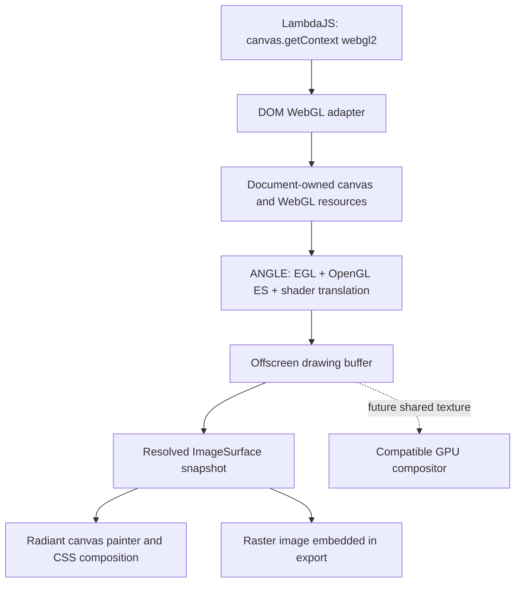

# Radiant WebGL Design — Canvas → ANGLE

**Status:** design proposal; the Canvas → ANGLE architecture and Three.js as
a required workload were confirmed by the user on 2026-10-07. Detailed policies
below are proposed; WebGL is not implemented by this document.

**Date:** 2026-10-07

**Scope:** native Radiant `HTMLCanvasElement` WebGL contexts, backed by ANGLE,
composited into Radiant pages, with WebGL2 and Three.js as acceptance targets.

**Authority:** [documentation convention](../../doc/Doc_Convention.md).
This proposal applies existing formal contracts without revising them. It
supersedes the analysis formerly at `vibe/idea/WebGL.md`.

## 1. Direction

Implement JavaScript WebGL through the existing Canvas/DOM boundary, using
ANGLE for OpenGL ES execution and shader translation. A canvas owns an
offscreen drawing buffer; Radiant composites its completed image as replaced
content in the normal document paint order.

**WebGL2 is the required compatibility target.** Three.js is a required
workload, not an optional demonstration. Its current `WebGLRenderer` requires
WebGL2; WebGL1 support was removed in r163. A small triangle is useful for
bring-up but cannot establish library compatibility or complete this design.
[Three.js renderer documentation](https://threejs.org/docs/pages/WebGLRenderer.html)

ANGLE implements OpenGL ES and EGL and provides shader translation; it can
be embedded independently of Chrome. Use its ES3-capable implementation from
the outset. Radiant supplies the Web API adapter, resource ownership, drawing
buffer presentation, and integration with its page lifecycle.
[ANGLE](https://chromium.googlesource.com/angle/angle/+/main/README.md)

## 2. Formal contracts

| Authority | Ruling applied here |
|---|---|
| **D7.4.1v2** | "raw C pointers never become script-visible"; native resources use opaque resource IDs and host projections. |
| **D7.4.4** | "Declared interfaces + record-owned hooks are the ONLY host-object protocol"; WebGL contexts and objects use that protocol. |
| **D7.5.3** | "Lambda reaches Radiant only through the `radiant-dom` module"; graphics stays behind the DOM host boundary. |
| **D4.5.1v4** | Radiant has native lifetime ownership; its seam is "pin, gen-check, copy-as-value". |
| **D4.5.2** | "Radiant never retains a GC pointer"; keep a script value only by copying it or holding a registered root. |
| **D5.3.3** | Native helpers use "slot-backed `RootFrame` / `Rooted<T>`" and continuously rooted handoffs. |
| **D7.4.2v2** | Modules are "fully shielded from the async substrate"; completion and event delivery use existing host facilities. |
| **D7.3.5** | "Every module kind names its conformance gate, wired into CI"; native graphics tests supplement the relevant web-platform tests. |
| **D7.1.4v2** | Headless profile C retains its null windowing backend and existing dependency exclusions. |
| **D7.1.7v6** | `lambda-wasm` remains the browser evaluation profile; this native graphics proposal does not expand it. |

The rulings above are in [Lambda Formal Design](../../doc/Lambda_Formal_Design.md).
Where the formal spec does not prescribe rendering/thread coordinates, use
existing **RC1** (one page thread for script, style, layout, and display-list
construction) and **RSC1/RSC6/RSC7/RSC8** (logical CSS geometry, explicit raster
conversion, distinct density/zoom, centralized coordinate conversions).
See [concurrency](../radiant/Radiant_Design_Concurrency.md) and
[scale](../radiant/Radiant_Scale.md). No new ruling-ID series is introduced.

## 3. Current foundation and architectural boundary

The existing [Canvas 2D design](../radiant/Radiant_Design_Canvas.md) provides a
document-owned canvas registry, bitmap allocation, native drawing state,
paint invalidation, and raster canvas painting. The current `getContext()`
dispatcher admits only `"2d"`; other names return `null`.

Share canvas identity, sizing, context selection, document cleanup, and
snapshot publication. Keep Canvas 2D state and WebGL state in separate context
payloads. The authoritative 2D result remains its bitmap; the authoritative
WebGL drawing result lives in its GPU drawing buffer. A CPU `ImageSurface` is
a published WebGL snapshot, not the owner of WebGL execution state.



The three directions identified by the retired idea note remain distinct:

| Direction | Relationship to this proposal |
|---|---|
| JavaScript WebGL in native `<canvas>` | Selected: Canvas → WebGL adapter → ANGLE. |
| GPU acceleration of Radiant's own 2D page painter | Independent optimization behind `RdtVector`; not a prerequisite for initial WebGL. |
| Radiant running in a browser through WASM | Separate future proposal; browser-provided WebGL is a different host boundary, and current D7.1.7v6 does not include Radiant. |

Existing GLFW window creation is useful shell infrastructure, but its desktop
OpenGL context does not supply WebGL semantics or an ANGLE ES3 context. WebGL
must not render directly into the window framebuffer or a native child-window
overlay. The surrounding page must retain its normal stacking and clipping.

## 4. Context and object model

### Canvas context selection

A canvas selects one context mode on its first successful `getContext()`.
Repeated requests for that mode return the same script-visible context.
Requests for incompatible modes return `null`; a failed creation leaves the
canvas eligible for a later supported request. Handle `"webgl2"` explicitly.
WebGL1 and its `"experimental-webgl"` alias are a separate compatibility
surface, not a fallback that satisfies the Three.js requirement.

Process context attributes such as alpha, depth, stencil, antialiasing,
premultiplied alpha, and drawing-buffer preservation through a common creation
path. Report the actual attributes and drawing-buffer dimensions. Backend
unavailability returns `null` with a useful native diagnostic; a partially
implemented test build must not advertise browser-complete WebGL2.

### Native ownership

One native graphics provider owns its EGL display/device services. Each canvas
owns an isolated EGL context and drawing-buffer resources. Initially do not
share script-visible GL objects between canvases. A document-owned registry
tracks contexts and resource tables through generation-checked IDs.

WebGL buffers, textures, programs, shaders, framebuffers, renderbuffers,
vertex-array objects, samplers, queries, syncs, transform-feedback objects,
and uniform locations have branded host objects. A handle records its context,
kind, generation, and deletion state. Uniform locations additionally belong
to a program/link generation. Reject cross-context objects and stale handles
according to the API's specified error behavior.

The native table accounts for bindings and attachment references as well as
live script wrappers. Marking an object for deletion must preserve the
underlying API's rules for objects still in use. A wrapper finalizer schedules
native release on the owning page thread; it does not call EGL/GL from an
arbitrary GC/finalizer thread. Document teardown invalidates handles and
releases all remaining resources even if no explicit `dispose()` was called.
This applies D7.4.1v2, D7.4.4, and D4.5.1v4.

### Script memory and argument conversion

Use existing TypedArray/ArrayBuffer accessors for uploads and readback. Validate
type, detachment, offsets, element counts, byte lengths, and overflow before
borrowing storage. Synchronous calls may borrow only for their duration;
deferred work copies bytes into native-owned storage. Never keep a borrowed
GC buffer pointer in a canvas entry (D4.5.2/D5.3.3).

Build shared conversion and dispatch helpers for related operations; do not
grow separate near-identical implementations for every buffer or texture
overload. The wrapper follows Lambda's C+ conventions; ANGLE remains an
unmodified dependency built with its own supported toolchain.

## 5. ANGLE and the WebGL adapter

ANGLE provides graphics validation and GLSL ES translation, including a
WebGL-compatibility context option. Request
`EGL_CONTEXT_WEBGL_COMPATIBILITY_ANGLE` and robust resource initialization
when the pinned provider supports the corresponding extensions. Require
equivalent correctness if an extension is unavailable; do not silently use a
less constrained context.
[WebGL compatibility extension](https://chromium.googlesource.com/angle/angle/+/main/extensions/EGL_ANGLE_create_context_webgl_compatibility.txt),
[resource initialization extension](https://chromium.googlesource.com/angle/angle/+/main/extensions/EGL_ANGLE_robust_resource_initialization.txt)

Radiant still owns WebIDL conversion, receiver branding, object identity,
canvas attributes, extension publication, DOM-source texture uploads, and
context-loss events. WebGL also requires initialized resources, bounded
access, and origin restrictions for source media. These are acceptance
requirements, not assumptions implied by loading an OpenGL ES library.
[WebGL specification](https://registry.khronos.org/webgl/specs/latest/1.0/)

Do not expose ANGLE's extension list directly. Publish a WebGL extension only
when the backend supports it and the adapter implements its API and validation.
Separate mandatory WebGL2 functionality from optional extensions. Preserve GL
error ordering across adapter validation and driver calls; do not consume an
application error while checking internal presentation operations.

The WebGL2 target includes ES3 shader behavior, vertex arrays, instancing,
uniform buffers, integer attributes/textures, multiple render targets,
framebuffer blits, transform feedback, queries, samplers, and sync behavior.
Implement and test the required API even where a particular Three.js scene
does not exercise it. Optional extension coverage is recorded separately.
[WebGL2 specification](https://registry.khronos.org/webgl/specs/latest/2.0/)

## 6. Drawing, presentation, and page composition

### Execution and frame scheduling

Initially execute validated GL operations synchronously on the RC1 page
thread. A context-current guard restores any prior bindings it displaced.
No new GL worker queue, script/layout split, or nested page loop is needed for
the first implementation.

Draws and clears mark the canvas drawing buffer dirty and publish paint-only
invalidation. The existing animation-frame scheduler runs script callbacks;
the page's presentation boundary then resolves dirty canvases before painting
them. Library calls to `flush()` are not a requirement for page repaint.
Synchronous readback observes all preceding relevant writes without causing a
style/layout flush. Script-visible events are delivered through existing host
scheduling (D7.4.2v2).

### First presentation path: GPU → bitmap

Resolve multisampling, read the dirty drawing buffer into native staging
storage, normalize row direction and pixel representation, and publish an
`ImageSurface` snapshot. Read once per changed canvas presentation, not once
per display-list consumer or paint fragment. Publish its generation only after
the pixels are complete; retained paint data must not observe a partly written
surface. Keep prior snapshots alive while a retained consumer uses them.

Internal resolve/readback must restore application framebuffer bindings,
pixel-pack state, and any other state it touches. A hidden default-framebuffer
implementation must preserve the API's observable framebuffer-zero behavior.
Separate render generation, published snapshot generation, and context
generation so an unchanged snapshot cannot hide a context reset.

The normal canvas painter applies CSS position, clipping, transforms, opacity,
and stacking. Normalize premultiplied versus straight alpha explicitly for
the `ImageSurface` contract. Validate color-space conversion, texture orientation,
and antialiasing against independent browser renders.

Presentation also observes `preserveDrawingBuffer`: retain the page's published
snapshot for repaint, while clearing/discarding the underlying drawing buffer
at the specified boundary when preservation is disabled. A cached page image
must not accidentally make the drawing buffer persistent. Define captures and
canvas-source reads against the correct drawing-buffer timing, not merely the
last published page snapshot.
[drawing-buffer rules](https://registry.khronos.org/webgl/specs/latest/1.0/)

### Size, scale, and resize

Canvas bitmap dimensions are script-selected integer pixel counts, independent
of the laid-out CSS box. Layout geometry stays float in CSS logical pixels;
pixel conversion occurs at the existing scale adapters (RSC1/RSC6/RSC7/RSC8).
Radiant does not implicitly multiply the backing store by device-pixel ratio.
Three.js's `setPixelRatio()` and `setSize()` must produce the expected result.

Share attribute parsing with Canvas 2D, but not its state-reset behavior.
WebGL canvas resize reallocates and clears the drawing buffer while retaining
the WebGL state required by the standard; it does not automatically reset the
viewport. Reallocation handles zero-sized canvases and allocation failure
explicitly. Keep limits on dimensions, total pixels, and native/GPU resources
under document accounting; exact initial quotas need measurement.
[resize semantics](https://registry.khronos.org/webgl/specs/latest/1.0/)

### Later presentation path: shared GPU texture

If readback is a bottleneck, add an external-image/texture abstraction consumed
by a compatible Radiant GPU compositor. It needs synchronization fences,
generation ownership, format/alpha/color-space metadata, and a snapshot path
for CPU consumers. A Metal texture cannot be handed to the present CPU painter
as if it were an `ImageSurface`. Establish the compositor seam before promising
zero-copy performance; changing the whole page renderer is not an initial gate.

## 7. Three.js workload contract

Pin an official Three.js package/revision and record source hashes and licenses
before implementation acceptance. Run its unmodified `WebGLRenderer`; fix
LambdaJS, DOM, or WebGL gaps rather than patching the library or supplying
false-success APIs. Do not select an old WebGL1-only Three.js release to avoid
WebGL2 work. Test the real ESM import/dependency path in addition to renderer
initialization.

| Required fixture | What it establishes |
|---|---|
| Renderer startup and animated indexed cube | ES modules, WebGL2 context creation, capability queries, shaders, indexed drawing, and animation-frame delivery. |
| Textured scene with transparency | Image acquisition/decode, DOM-source texture uploads, sampler/pixel-store behavior, orientation, color handling, and alpha composition over CSS content. |
| Standard material with lights and a shadow map | Generated shader variants, depth textures, framebuffer attachments, and offscreen passes. |
| Instanced geometry | VAOs, attribute divisors, instanced draws, and data updates. |
| Render target and a simple postprocessing pass | Render-target switching, required framebuffer formats, resolve/blit behavior, and texture reuse. |
| OrbitControls with real pointer/wheel interaction | Official addon imports, event delivery, pointer capture/coordinates, and interaction with the surrounding page. |
| Resize, density change, two canvases, disposal and restoration | Context isolation, dimensions, resource cleanup, context-loss delivery, and library resource rebuilding. |

Assertions include visible pixels and scene output, not only JavaScript return
values. Use fixed geometry/assets, fixed animation times, and declared image
tolerances against a pinned Chromium reference. Exercise picking and controls
through the real pointer path. Record shader compile/link logs and API errors
as failures rather than accepting a black canvas.

Three.js import, image-loading, event, and animation dependencies are part of
the workload gate. They may reveal existing LambdaJS/DOM gaps; passing native
ANGLE tests does not close those gaps. Broader GLTF loading, compressed assets,
WebXR, WebGPU/TSL rendering, and every upstream example remain separate scope
unless explicitly added.

## 8. Loss, limits, and unavailable graphics

On graphics reset or explicit test loss, invalidate the context generation,
apply specified lost-context API behavior, and schedule `webglcontextlost`.
Restoration creates fresh graphics state and sends `webglcontextrestored` when
allowed; old resource wrappers remain invalid. The application/Three.js
recreates resources. Stop presentation work while teardown or loss is active.

Measure and bound texture/buffer allocations, staging snapshots, simultaneous
contexts, and shader/program caches. Initialization, shader compilation,
readback, and device failures need distinct diagnostics. Native driver work can
outlive a script timeout; existing OS/device recovery and context-loss handling
must be tested. A hardened GPU-process isolation policy is a separate design
decision before claiming hostile-content containment.

The full native Radiant host may probe offscreen EGL operation without a
visible window. Failure to acquire a valid provider returns `null`; software
rendering is not an implicit substitution. Keep the D7.1.4v2 headless-C profile
on its existing null backend with WebGL unavailable. Adding graphics support to
that profile requires a separately reviewed formal-profile change. The
runtime-only CLI and current WASM profile do not acquire ANGLE dependencies.

## 9. Export

For PNG/JPEG page output, composite a WebGL canvas's resolved raster image.
For SVG/PDF page output, embed a raster image at the canvas's CSS content box;
WebGL shader execution does not become vector primitives. Read the canvas at a
defined render/capture point and apply the same drawing-buffer lifetime rules
as on screen. Animation capture uses an explicit chosen frame, not wall-clock
luck.

The current Canvas 2D design records that SVG/PDF canvas dispatch is deferred.
Therefore WebGL export is new work, not a capability obtained automatically by
producing an `ImageSurface`. Share the eventual canvas export path and validate
the rendered PDF/SVG output, including alpha and transforms. Standalone canvas
`toBlob`/`toDataURL` APIs are additional surface, not required to reuse page
export.

## 10. ANGLE packaging and measured size

Package a pinned standalone ANGLE provider with only the chosen platform
backend and necessary shader translators. The initial recommendation is Metal
on macOS; D3D11 on Windows and Vulkan or desktop GL on Linux are follow-on
providers whose support must be validated independently. Keep ANGLE optional
for distributions that do not need WebGL, and load/initialize graphics only
when requested. No browser installation is a runtime dependency.

ANGLE's build exposes backend selection and produces `libEGL`/`libGLESv2`;
the shader translator alone is not a WebGL execution library. Maintain the
upstream GN/Ninja dependency build separately from Lambda's generated build
files. Lambda-side dependency declarations belong in
`build_lambda_config.json`. Ship required dependency notices and platform
library resources; do not edit vendored source.
[ANGLE development and embedding documentation](https://chromium.googlesource.com/angle/angle/+/main/doc/DevSetup.md)

### Measured reference, 2026-10-07

Existing Chrome for Testing headless-shell **148.0.7778.97**, macOS **arm64**,
contains these dynamically linked libraries. File sizes were measured locally;
this is not a newly built Lambda-specific or Metal-only ANGLE configuration.

| Artifact | Bytes | MiB |
|---|---:|---:|
| `libGLESv2.dylib` | 6,823,296 | 6.5072 |
| `libEGL.dylib` | 91,952 | 0.0877 |
| **ANGLE pair** | **6,915,248** | **6.5949** |
| Separate optional `libvk_swiftshader.dylib` | 16,524,720 | 15.7592 |

Compressing the two ANGLE files individually with gzip level 9 gives
**2.5929 MiB combined**. That is a compressed-file reference, not an exact ZIP
or final application-package delta. The measured dylibs depend on OS libraries;
no extra non-system dylib appeared in their `otool -L` dependency lists.
No separate `.metallib` file was present in this sampled distribution.

Two other cached arm64 distributions measured **6.8175 MiB** (143.0.7499.169)
and **6.9750 MiB** (142.0.7444.59) for the EGL/GLES pair. These samples support
an approximate **7 MiB installed / 2.6 MiB compressed** reference for this
macOS packaging style. They do not predict Windows/Linux, universal macOS
binaries, debug builds, or a custom provider's exact size. SwiftShader's
software renderer is a separate cost and is excluded from the initial hardware
provider recommendation.

Local provenance, including paths, SHA-256 values, dependency lists, and
compression measurements, is in
[`temp/webgl-design/angle-size-evidence.json`](../../temp/webgl-design/angle-size-evidence.json).
It is a local verification artifact, not a release input. The 148 sample's
SHA-256 values are:

- EGL: `9f1c9c7906546c9de2c6f71bae4370bf3d9e0c54000915000c1e9654dd94c918`.
- GLES: `45a141579639883bf71b5e7dce73df62a7913b0462d50476629db3b585720ed3`.

The release-size gate must measure Lambda's actual selected provider: ANGLE
commit, GN arguments, architecture, compiler, stripping/symbol policy, all
runtime files, compressed package delta, and the Lambda-side adapter. Source
checkout/build intermediates, installed binary bytes, download bytes, and
runtime CPU/GPU memory are separate quantities. A static archive's size does
not equal its linked executable contribution. Borrowed Chrome binaries above
are measurement references only; shipping uses our pinned provider build.

## 11. Performance questions and retained ideas

CPU readback is the main initial presentation risk. A 1920 × 1080 RGBA8 image
is about **7.91 MiB**; reading one such image at 60 frames/s moves about
**475 MiB/s** of pixel payload before conversion and compositing. Driver
synchronization may cost more than the raw transfer. Measure draw submission,
GPU execution, resolve/readback, conversion, page composition, and end-to-end
frame pacing separately, including multiple dirty canvases.

Use release builds only. Record backend, device, dimensions, density, shaders,
scene revision, warmup, and correctness output. Do not promise a speedup from
enabling a GPU backend alone. The retired idea note's unmeasured 10–50× speedup,
8 MB base executable, LOC totals, and 3–6 MB ANGLE estimate are not acceptance
evidence and are replaced here by explicit measurements or open gates.

Useful ideas retained from that note are the separation of native WebGL,
page-renderer acceleration, and browser hosting; reuse of the rendering
abstraction; explicit shader compilation and resource management; and
separate dependency/binary-growth accounting. Three.js supplies the concrete
workload that the earlier note left unspecified.

## 12. Decisions still requiring implementation evidence or consultation

- Exact ANGLE revision, platform deployment minimums, and the pinned Three.js
  revision. Freeze them before conformance/performance comparisons.
- Distribution mechanics for the optional provider within the existing DOM
  host contract, including signing and library-resource layout.
- Initial resource quotas and a measurable frame-pacing target for the required
  scenes on named hardware.
- Whether WebGL1 ships alongside WebGL2; it is not a prerequisite for the
  required modern Three.js workload.
- The initial optional-extension manifest and whether GLTF/advanced asset
  loaders join the required workload set.
- GPU-process containment and any expansion of existing headless profiles.

These are open details of the proposal, not silent changes to the formal
specification. No implementation-complete or cross-platform claim is made.

## Appendix A — implementation seams and delivery gates

Keep detailed implementation progress in a future `vibe/impl/` plan. The
following existing entry points and proposed extractions make this design
reviewable without prescribing duplicated helpers or a second bridge.

| Location | Responsibility |
|---|---|
| `lambda/dom/dom_canvas.cpp`, `js_canvas_get_context` | Shared context selection and WebIDL conversion; route WebGL requests through the DOM host interface. |
| `lambda/dom/dom_canvas.h` and the existing Radiant DOM service boundary | Declared bridge surface; keep renderer internals and EGL types out of runtime-facing interfaces. |
| `radiant/canvas_2d.cpp`, `CanvasRegistry` / `CanvasEntry` | Extract shared native canvas ownership/sizing; preserve 2D state and behavior. |
| Proposed `radiant/canvas_webgl.*` and a narrow ANGLE-provider adapter | Graphics contexts, resource tables, validation support, loss/recovery, resolve/readback. |
| `radiant/canvas_2d.cpp`, `render_canvas_content` | Share snapshot painting with WebGL; extract a common canvas painter if needed. |
| `radiant/render.hpp`, `radiant/render_svg.cpp`, `radiant/render_pdf.cpp` | Snapshot lifetime and eventual shared canvas export dispatch. |
| Existing script/frame scheduling and DOM event facilities | Animation, invalidation, context-loss/restoration delivery; no separate event loop. |
| `build_lambda_config.json` | Optional native dependency/build wiring; generated Lua is never edited manually. |

| Gate | Required evidence |
|---|---|
| Provider bring-up | Pinned release ANGLE, ES3 offscreen context, shaders, known triangle pixels, actual package size, graceful unavailable-device path. |
| Canvas integration | Identity/mode tests, shared 2D regression coverage, isolation, resize, state preservation, alpha/clipping/stacking, retained snapshot lifetime. |
| WebGL2 adapter | Pinned Khronos conformance/WPT manifests, typed-array validation, error semantics, resource lifetimes, initialized data, extension inventory, loss/restoration. Partial manifests report their omissions. |
| Three.js | Every required scene in §7 using unmodified pinned packages; native Radiant renders and independent browser references; real pointer interaction. |
| Export and lifecycle | Rendered PNG/SVG/PDF assertions, repeated create/destroy, forced GC during uploads/callbacks, bounded resources, clean teardown and unsupported-profile behavior. |
| Release/platform acceptance | Required scenes and conformance on each claimed backend; release frame timings and binary/package deltas; no extrapolation from macOS alone. |

Use existing aggregate gates after implementation:

```sh
make test-radiant-baseline
make test-lambda-baseline
make test262-baseline
```

The implementation must add a focused WebGL/Three.js runner and wire it into
the relevant baseline before declaring completion; such a target does not
exist today. Test262 is the ECMAScript gate, not WebGL conformance. Run focused
native tests, Khronos/WPT manifests, rendered-output references, and the
aggregate baselines as distinct reported gates. A missing graphics backend is
not a successful graphics test on a platform claiming WebGL support.
