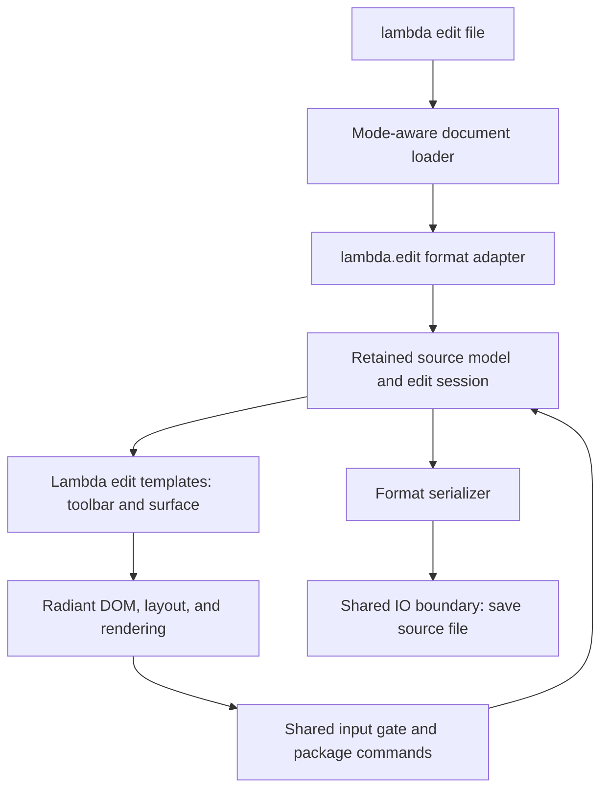

# Radiant Edit Mode — `lambda edit` and the `lambda.edit` Package

**Date:** 2026-09-25  
**Status:** Proposal, implemented for Phases 1–3 (2026-09-26) in
[Radiant_Impl_Edit_Mode](../impl/Radiant_Impl_Edit_Mode.md), which records
the decisions made and the open items; not yet ratified. The command,
document families, script-package ownership, and top toolbar are user
requirements; the detailed behavior below is proposed for review.  
**Scope:** a document-authoring mode for Lambda/Radiant, initially Markdown
and HTML rich text, followed by SVG drawing; an extensible template contract
for later document types.

**Parent designs:** [Radiant Editable Support](Radiant_Design_Editable.md),
[Lambda DOM Editable](../Lambda_Design_DOM_Editable.md), and
[Rich Text Editing](../editing/Radiant_Rich_Text_Editing.md). Drawing reuse is
informed by [Stage 5](../editing/Radiant_Editor_Stage5.md) and
[Editable Drawing Compatibility](Radiant_Design_Editable_Drawing.md).

**Specification linkage:** D7.2.1–D7.2.4 → package loading and state (§3–§4);
D7.2.5 and D7.5.3 → editing-policy and native-mechanism boundaries (§3, §5);
S12.1.1v2 and S12.1.3 → effectful loading/saving and pure rendering (§4);
D1.5v2 and D5.3.3 → retained runtime and precise ownership (§4);
D7.5.2 → persistence through the shared IO boundary (§8). These refer to
[Formal Design](../../doc/Lambda_Formal_Design.md) and
[Formal Semantics](../../doc/Lambda_Formal_Semantics.md).

This proposal adds an application workflow under the existing contracts. It
does not revise a formal ruling or introduce a new editing-ledger series.
Unsettled product choices are recorded in §10; proposal wording is not a
claim that the capability already exists.

## 1. User experience and command boundary

`lambda view doc` opens a document in browser/view mode. `lambda edit doc`
opens that document inside an editing application, with a toolbar at the top
and a format-appropriate editing surface below it.

```sh
lambda view README.md
lambda edit README.md
lambda edit article.html
lambda edit drawing.svg
```

The executable in a source checkout is `./lambda.exe`; `lambda` above is the
installed command name.

| Concern | `lambda view` | Proposed `lambda edit` |
|---|---|---|
| Main purpose | Browse and interact with the document | Author and save the document |
| Loading | Existing view loaders and document transforms | An edit template selected from `lambda.edit` |
| Application toolbar | Existing viewer behavior | Persistent top toolbar, specialized by document type |
| Input | Existing browsing, forms, and page-owned editors | Active rich-text or drawing surface |
| Persistence | Existing page behavior | Save / Save As, dirty state, and unsaved-change handling |
| Link activation | Existing browsing behavior | Select/edit a link; explicit Open Link opens a viewer |

View mode remains capable of forms, `contenteditable`, and script-owned
editors. The new command selects an authoring application; it does not make
all existing viewer interaction read-only.

The first release accepts one existing local file. Supported suffixes are
`.md` / `.markdown`, `.html` / `.htm`, and `.svg`, as their respective phases
land. Missing files, unsupported types, and invalid source produce an
actionable load error rather than an empty editor. Remote editing, new-file
creation, and multiple documents per window are later extensions. A viewer
may remain available for a document that cannot yet be edited safely.

## 2. Document families and initial capabilities

| Family | Editing experience | Initial editable content |
|---|---|---|
| Markdown | Structured rich text rendered as HTML | Paragraphs, headings, emphasis, inline/fenced code, lists, block quotes, links, images, and horizontal rules |
| HTML | Rich text with retained document metadata | The same flow-content features, with HTML-specific marks/attributes where supported by the editor schema and serializer |
| SVG | Drawing surface with object selection | Rectangles, circles/ellipses, lines, simple text, selection, move/resize, fill/stroke, duplicate/delete, and paint-order changes |

These are authoring profiles, not claims of complete format coverage. Tables
and Markdown extensions can be enabled as their parse/edit/save round trips
are verified. Path-node editing, connectors, layer management, and richer
text layout are later SVG capabilities under the proposed initial scope.

Opening an existing document must preserve content outside the editable
profile. The adapter retains such content as structured or opaque source
nodes, with a visible noneditable representation where appropriate. If the
parser/model/serializer cannot retain it, editing that file is rejected with
the unsupported construct identified. An import that silently drops content
does not count as support.

## 3. Ownership and reuse

The new `lambda.edit` package owns the editing application: shell, templates,
format adapters, toolbar presentation, document-session state, and save
coordination. It composes the existing editing packages.

| Layer | Responsibility |
|---|---|
| Lambda CLI / Radiant shell | Select application mode, open the window, host the retained runtime, route close requests and platform input |
| `lambda.edit` | Choose the format template, import/export documents, render the toolbar and surface, manage the file session |
| `lambda.editor` | Source-model schema, commands, Steps/Transactions, source selection, model undo/redo, reusable drawing logic |
| `lambda.dom` behavior package | Shared editing descriptors, requests/actions/results, and the existing UA editing backend |
| Native `radiant-dom` and Radiant | DOM mechanisms, input gate, Selection/Range, IME/clipboard transport, geometry, layout, paint, and lifecycle |

D7.2.5 keeps editing policy in scripts; D7.5.3 keeps Lambda-to-Radiant access
on the declared native waist. Consequently, adding `edit` must not introduce
native Bold/List/Undo algorithms, a second text-input path, or duplicated
command switches in every toolbar.



Both rich-text formats use the source-model backend. The rendered DOM is a
projection used for selection, layout, and interaction; it is not an
additional document authority. Ordinary UA editors continue to use their
existing backend. This follows the implemented split in
[Lambda DOM Editable §1 and §5](../Lambda_Design_DOM_Editable.md).

## 4. Edit templates and loading

### Package organization

D7.2.4 maps shipped `lambda.*` packages to `<lambda-home>/package/`. The
proposed source organization is therefore:

```text
lambda/package/edit/
    edit.ls          package entry and format descriptor registry
    shell.ls         shared edit template and document-session UI
    toolbar.ls       shared toolbar rendering and command presentation
    markdown.ls      Markdown import/export and rich-text profile
    html.ls          HTML import/export and rich-text profile
    rich_text.ls     shared rich-text rendering and surface integration
    svg.ls           SVG import/export, rendering, and drawing profile
    drawing.ls       drawing tools, selection overlay, and gesture control
```

For example, `lambda.edit.markdown` names `lambda/package/edit/markdown.ls`.
These names describe the proposed package surface; the directory does not
exist yet. Generic editor behavior belongs in `lambda.editor` or the shared
DOM protocol, even when first needed by one of these templates.

Each format contributes a descriptor with the following conceptual contract.
Exact export names and record types will be specified during implementation.

| Descriptor part | Contract |
|---|---|
| Identity | Format ID, accepted suffixes, parser and serializer selection |
| Import | Parsed source plus source metadata → editor model and retained source envelope, or a diagnostic |
| Template | Model/session → toolbar and editable surface, using Lambda `view` / `edit` templates |
| Capabilities | Supported commands and round-trip restrictions; toolbar state derives from these and the active selection |
| Export | Current model plus retained envelope → source-format value/bytes, or a diagnostic |

Format dispatch has one owner. The CLI selects edit mode; the package registry
selects the editor. Native code should not acquire a parallel Markdown/HTML/SVG
editor registry. Reuse the existing document-transform loader's file-backed
package invocation and typed arguments, extending its contract where needed
to retain source metadata and instantiate an interactive edit session.

### Loading sequence

1. Resolve the input file and retain its canonical identity, original base
   URL, format, and file version used for overwrite checks.
2. Load the shipped `lambda.edit` entry through ordinary package/public-export
   resolution (D7.2.1–D7.2.3). Pass the source path and options as values.
3. In an effectful initialization step, read the source and select its format
   adapter. Parse once; validate import and preservation coverage before
   exposing an editable document.
4. Create the instance-owned session and run the selected edit template.
   Retain the runtime, source owner, editor state, and generated nodes for the
   lifetime of the document window.
5. Mount the active surface through the existing editing bridge, then use
   Radiant's normal cascade, layout, rendering, and event loop.

S1.8 forbids turning the path or document text into generated Lambda source.
S12.1.1v2 keeps file IO out of module-top-level and pure template evaluation;
initialization and save use a procedural entry/handler. S12.1.3 keeps template
bodies pure and state updates in `on` handlers. Mutable session state is
instance-owned, never module-global (S1.4, D7.2.1).

Retaining a runtime does not by itself root every session value. Native
handoffs and persistent document references must remain precisely rooted
under D1.5v2 and D5.3.3, including selection/history and pending save results.

## 5. Rich-text surfaces

### Common behavior

Markdown and HTML share rich-text templates and the existing
`lambda.editor` command/transaction machinery, with format-specific schemas
and capability sets. Keyboard editing, IME, clipboard, toolbar actions, and
undo/redo converge on the shared descriptor/request/action/result protocol.

The native gate owns `beforeinput` and `input`. Public `beforeinput` remains
notification-only; the selected registered model action applies the edit
after uncanceled notification. Toolbar actions use their descriptor-defined
entry contract and the existing model-completion bridge. They do not mutate
DOM first or dispatch a second pair of input events. See D7.2.5 and
[Lambda DOM Editable §8](../Lambda_Design_DOM_Editable.md).

Source selection remains mapped through model Steps and back into native
Selection after the corresponding render. Clicking a toolbar button or
opening a link dialog retains the target surface and selection bookmark;
completion validates that target and restores selection appropriately.

### Markdown

The editable model comes from Markdown structure, with inline marks and
blocks rendered as HTML. Saving converts the current editor model back to
the Mark representation expected by the Markdown formatter. Plain-text
extraction is not a serializer: headings, marks, destinations, lists, code
fences, and images must survive save and reopen.

Math, raw HTML, front matter, and other extensions need explicit preservation
adapters. Generated math layout and other view-only nodes never replace their
source expressions. Unsupported formatting commands are hidden or disabled;
for example, underline needs an explicit supported HTML-in-Markdown policy.

### HTML

Retain the full source envelope: document/fragment identity, doctype where
present, head metadata, styles/resource references, and supported attributes.
The body flow is the initial rich-text editing target. A schema import must
not flatten arbitrary HTML into the prototype's limited tag/attribute set.

Proposed initial presentation is an **authoring stylesheet** for editable
flow content. Original page styles remain part of the saved document; full
page-cascade fidelity while editing is a later extension. This makes initial
HTML support a rich-text editor, with browser/view mode available to inspect
the page's original presentation.

Source styles and document scripts must not become part of the editor shell
when projecting the document. Scripts and inline handlers are retained as
source data and remain inactive in the proposed authoring mode. Links select
content; explicit Open Link launches a viewer without replacing the session.
Relative assets resolve against the source document, not the package path.

## 6. SVG drawing surface

Load SVG as editable XML/Mark structure and project it as inline SVG. The
existing top-level SVG viewer's image wrapper cannot expose individual
objects for editing.

The saved SVG tree is the authoritative drawing model. Retain namespaces,
`viewBox`, dimensions, IDs, transforms, `<defs>`, references, groups, and
unrecognized subtrees. Editor-only selection handles, guides, and tool
previews live in a separate overlay and never enter serialized SVG.

The existing Stage-5 drawing schema represents semantic drawing blocks; it
is not a lossless importer for arbitrary SVG. Reuse its geometry and
transaction helpers where their contracts fit. Adapt attribute/child edits
to existing Steps instead of converting every input into generic `<shape>`
records and rebuilding SVG from a reduced model. Third-party SVG editor
compatibility remains a separate capability, not a dependency of `lambda.edit`.

Initial interaction includes:

- Select supported objects, shift-select multiple objects, and clear selection.
- Create rectangles, circles/ellipses, lines, and simple text.
- Move, resize, duplicate, delete, change fill/stroke, and adjust paint order.
- Pan and zoom the editing viewport, with zoom-to-fit.
- Undo/redo committed object edits; cancel an in-progress gesture with Escape.

Pointer coordinates pass through the inverse composed viewport/object
transform. Hit testing and geometry use Radiant's existing SVG mechanisms.
Layout and geometry use floating-point coordinates. Unsupported geometry or
noninvertible transforms disable the affected operation with an explanation.

A drag has begin/update/commit/cancel phases. Intermediate previews do not
create one undo entry per pointer move; release commits one transaction and
Escape restores the pre-gesture state. Pan, zoom, selection, and tool changes
are session state and do not dirty the file. Viewport zoom must not rewrite
the SVG's saved `viewBox`.

Complex paths, gradients, filters, and existing groups remain preserved even
when their detailed editing tools are absent. Object operations are enabled
only where their effects on transforms, references, and styling are defined;
duplicate must remap copied IDs and internal references consistently.

## 7. Top toolbar and application input

The toolbar occupies the top of the editor page and remains visible while
the document scrolls. It is outside the editable/exportable document root.
The shared portion shows the filename, unsaved indicator, Save, Save As,
Undo, and Redo. Format-specific actions follow it.

| Rich text | SVG drawing |
|---|---|
| Paragraph/heading selector | Select, rectangle, ellipse, line, text tools |
| Bold, italic, supported inline marks | Fill, stroke, stroke width |
| Bulleted/numbered list, indentation | Duplicate, delete, front/back |
| Link, image, quote, code | Pan, zoom level, fit drawing |

Buttons have labels/tooltips, keyboard focus, and active/disabled/mixed state.
State comes from command descriptors and selection queries. A narrow window
may group less frequent actions into an overflow menu. Toolbar dialogs keep
their own form-control focus and undo behavior; document Undo explicitly
targets the editor surface.

Common shortcuts include platform Cmd/Ctrl+S, Cmd/Ctrl+Z, redo, clipboard
shortcuts, and rich-text formatting shortcuts. Plain character keys always
reach text entry where appropriate. Escape cancels a dialog, composition,
or drawing gesture according to the active interaction; it must not inherit
the viewer's unconditional window-close shortcut.

## 8. Save, history, and session lifecycle

An edit session retains source identity/format/base URL, adapter and template
identity, model plus preserved source envelope, selection/history, the saved
content checkpoint, and transient UI state. The model/history mechanism is
reused; the application adds file lifecycle state.

The proposed initial round-trip contract preserves document meaning, content,
and supported metadata; insignificant source spelling/formatting may normalize.
Exact whitespace, quote style, Markdown delimiter style, and byte-for-byte
preservation are not promised under this option. §10 records the alternative.

Save performs these steps:

1. Finish the current composition/gesture through its existing lifecycle and
   capture a consistent document snapshot.
2. Export the model plus preserved envelope through the format adapter.
   Validate that export contains only document content and satisfies the
   adapter's round-trip contract.
3. Check whether the source file changed externally since load/last save.
   A conflict keeps edits in memory and offers an explicit overwrite, reload,
   or Save As decision.
4. Write through the central IO boundary (D7.5.2), using a failure-safe file
   replacement operation. A failed save leaves the original file and the
   unsaved in-memory document intact.
5. Update the saved checkpoint only after persistence succeeds. If editing
   continued during an asynchronous save, newer changes remain dirty.

Save As initially writes the same format to a new path. Cross-format export
is a later feature. A new directory requires deliberate relative-URL rebasing
to preserve referenced assets; copying an asset tree is not implicit. The new
path and base URL become session state only after a successful save.

Dirty state compares document content to the saved checkpoint, not merely
the number of commands issued. Undoing back to saved content clears it;
selection/zoom/toolbar updates do not set it. Save does not clear undo history.
A new edit after undo discards the redo branch according to existing model
history behavior. No second UA history entry records a model-owned edit.

Window close, application quit, and document replacement all route through
Save / Discard / Cancel when dirty. Cancel keeps the session live; a failed
save also keeps it live. Native shutdown and runtime cancellation occur only
after that decision completes. This is a required shell integration point,
not just a dialog drawn by the template.

## 9. Phased delivery and acceptance

These are product milestones. A detailed implementation plan belongs under
`vibe/impl/` after review.

| Phase | Deliverable | Acceptance boundary |
|---|---|---|
| 1 — Shell and Markdown | `edit` dispatch, `lambda.edit` templates, top toolbar, Markdown rich text, save lifecycle | Open an existing Markdown file, edit via typing and toolbar, undo/redo, save, reopen, and recover the edited structure |
| 2 — HTML | Shared rich-text surface with HTML adapter and retained envelope | Edit supported body content while preserving head/resources/unknown content; shell excluded from output; view-mode regression checks pass |
| 3 — SVG | Inline SVG authoring template and basic drawing tools | Create/select/move/resize/style objects, cancel/undo gestures, save/reopen SVG with namespaces, references, and untouched nodes intact |
| 4 — Broader authoring | More Markdown/HTML features and advanced SVG tools | Each capability adds explicit import/edit/export and interaction coverage |
| 5 — Additional document types | New format adapters/templates | Register a format without adding a new native editing engine or copying the shell |

Markdown, HTML, and SVG together constitute the initial requested document
families; the sequencing does not drop HTML or SVG from scope. Future types
could include structured data, plain text/code, or additional document
formats. Each needs its own editable model and save contract; render support
alone is insufficient.

Acceptance covers four dimensions:

- **Persistence:** parse → edit → serialize → reparse assertions for actual
  structure and metadata; unchanged opaque content; no toolbar/handles in
  output; failed writes and external-change conflicts retain edits.
- **Interaction:** typing, selection, IME, clipboard, toolbar focus transfer,
  undo/redo, keyboard shortcuts, drawing transforms, and dirty-close behavior.
- **Lifecycle:** package initialization failure, document disposal, stale
  surface handles, and forced-GC checks across rendering and native callbacks.
- **Regression:** the relevant existing editor/DOM/drawing suites and Radiant
  baseline; Lambda baseline for engine changes. New Lambda test scripts have
  paired expected `.txt` results. Temporary outputs live under `./temp/`;
  performance measurements use release builds.

## 10. Product choices for review

Two scope decisions remain open:

1. **Source preservation:** use semantic/content-preserving serialization
   with normalized spelling, as proposed here, or preserve original source
   formatting in untouched regions? The latter requires source spans/trivia
   and edit-aware serialization beyond ordinary parser/formatter reuse.
2. **Initial SVG depth:** ship basic shape/text tools first, as proposed here,
   or include path-node editing, connectors, and layers in the first SVG phase?

Additional proposed scope choices are local existing files first, explicit
Save rather than autosave, and HTML authoring styles with inactive source
scripts. Full original-page styling during editing would require an isolated
document/style surface so arbitrary page CSS cannot affect the toolbar; it
should be designed and tested before promising visual fidelity for that mode.

## Appendix A — Existing foundations and implementation touchpoints

The following observations were checked against the working tree on
2026-09-25. They identify reuse and gaps, not completed `lambda edit` support.

| Location / symbol | Relevance |
|---|---|
| `lambda/main.cpp`, `view` command branch | Existing option parsing and interactive launch; add edit mode through shared launch machinery |
| `radiant/window.cpp`, `view_doc_in_window_with_events_internal`, `key_callback`, `window_close_callback` | Window/event-loop reuse; Escape currently requests close before document dispatch; close handling needs a session decision hook |
| `radiant/cmd_layout.cpp`, `load_lambda_document_doc`, `load_lambda_document_transform_doc` | Retained script/transform loading and generated DOM lifecycle |
| `lambda/runtime/transpiler.hpp`, `LambdaDocumentTransformConfig`; `lambda/runtime/transpile-mir.cpp`, `run_lambda_document_transform_with_options` | File-backed public-export invocation with typed options; extend the existing contract rather than generate an import script |
| `test/ui/rte_prototype.ls` | Existing edit template, toolbar, model action, and selection wiring; its Save handler currently assigns `doc_text(editor.doc)` to test UI state, so it is not a file-save or formatted-round-trip implementation |
| `lambda/package/editor/mod_editor.ls`, `mod_dom_adapter.ls`, `mod_edit_registry.ls` | Shared model requests, commands, state queries, selection, and completion |
| `lambda/package/editor/mod_step.ls`, `mod_transaction.ls`, `mod_history.ls` | Model mutation and undo/redo foundations |
| `lambda/package/editor/mod_drawing_commands.ls`, `mod_geom.ls`, `mod_drawing_schema.ls` | Drawing logic to reuse selectively; the drawing-block schema is distinct from arbitrary SVG source |
| `lambda/format/format-md.cpp`, `format-html.cpp`, `format-xml.cpp` | Existing serializers; adapter and preservation coverage still require verification |
| `test/ui/svg-dom-contract.json` and `test/ui/hit-test/` | Existing SVG geometry, serialization, and hit-testing regression coverage |

The separate [Edit History proposal](Radiant_Design_Edit_History.md) remains
unratified. This proposal reuses current model history and does not depend on
that document's proposed replacement of form-control history.
