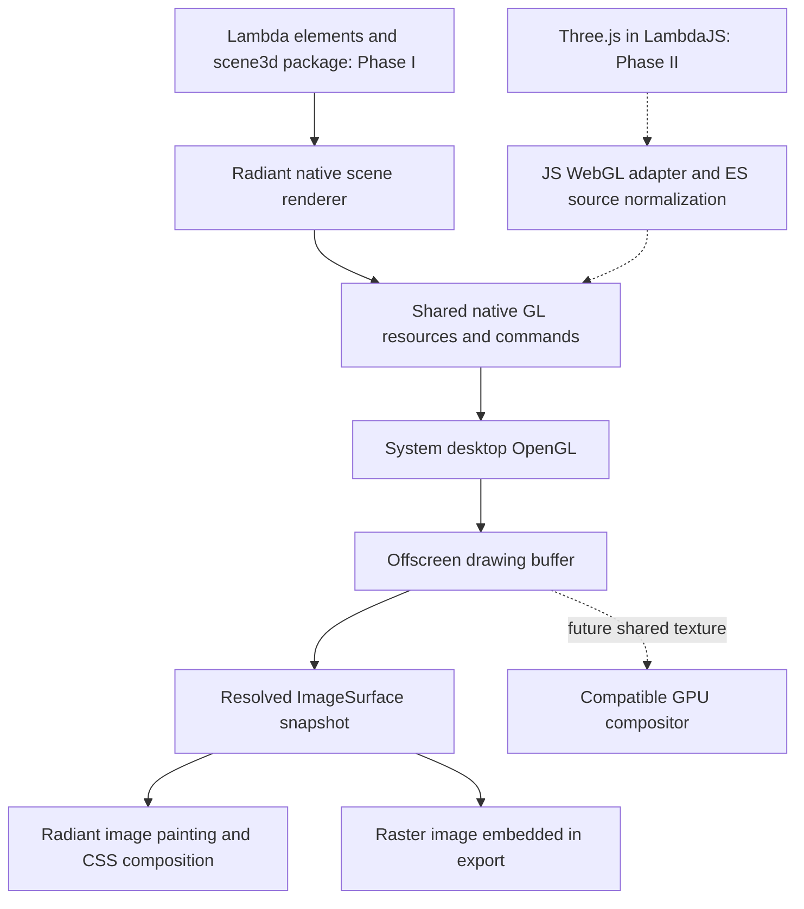
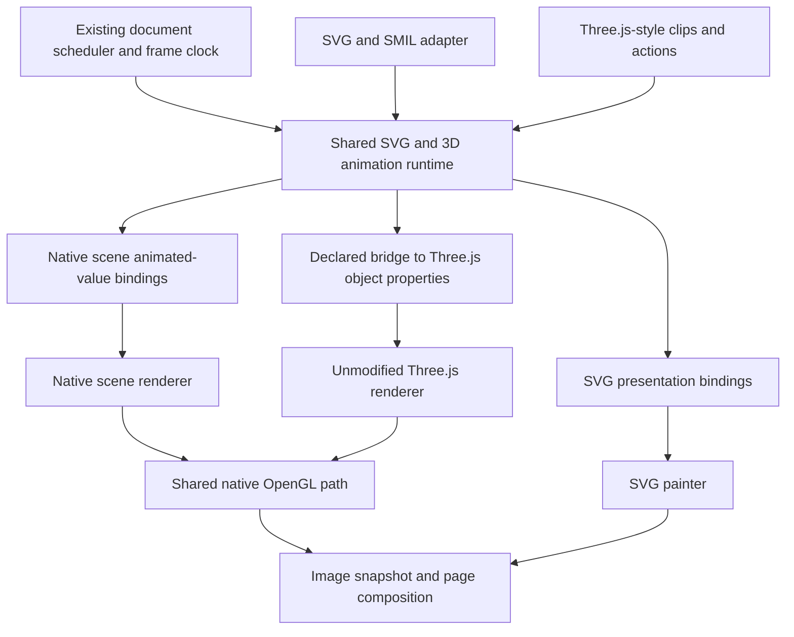

# Radiant 3D and WebGL Design — Lambda Scenes First

**Status:** Phase I implemented natively on macOS; validation and remaining
aggregate-baseline failures are recorded in
[the implementation evidence](../impl/Radiant_Scene3d_Phase1.md).
Phase II's initial native WebGL2/unmodified Three.js profile is implemented
on macOS; its API manifest, browser pixels, validation and limits are recorded
in [the Phase II evidence](../impl/Radiant_WebGL_Phase2.md). On 2026-10-08 the user selected a
Lambda-element scene package and native Radiant rendering for Phase I, with
the JS WebGL wrapper and Three.js execution deferred to Phase II. First-party
system OpenGL, ANGLE as reference only, and desktop GLSL acceptance remain
selected. The user also selected `<scene3d>` and SVG-style HTML sizing through
`viewBox`. Phase I implements the explicit `lambda.scene3d` package and the
bounded native 3D mapping below.
On 2026-10-08 the user selected Phase III: richer interactive Three.js scenes
and Three.js-style animation evaluated by an extension of the existing SVG
animation engine, with OpenGL responsible for 3D rendering. Phase III is
implemented for the selected macOS profile in §8; validation, performance
and binding limits are recorded in [the Phase III evidence](../impl/Radiant_WebGL_Phase3.md).

**Date:** 2026-10-08

**Scope:** Phase I provides the `lambda.scene3d` package and
`<scene3d>` element, embedded alongside HTML/SVG and rendered by Radiant over
system OpenGL. Phase II adds the JS WebGL API around the shared graphics core
and validates Three.js. Phase III adds image textures, PBR, shadows,
postprocessing, controls/picking, complete selected Three.js recovery, and
shared SVG/3D animation. A Three.js-like scene model is the Phase I vocabulary,
not a dependency on Three.js or a promise of its complete feature set.
Textual model inputs map into Lambda data as described in §14.

**Authority:** [documentation convention](../../doc/Doc_Convention.md).
This proposal applies existing formal contracts without revising them. It
supersedes the analysis formerly at `vibe/idea/WebGL.md`.
Superseded decisions from the original ANGLE-based proposal are retained in
Appendix S. The design now lives at the selected `vibe/radiant/` path.

## 1. Direction

Implement a declarative Lambda scene model and a native Radiant 3D renderer
first. Radiant owns scene traversal, transforms, camera projection, geometry,
materials, lighting, GPU resources, draw ordering, and page presentation.
Execute graphics with system desktop OpenGL. ANGLE is an
engineering reference for implementation choices and edge cases; do not link,
load, or ship ANGLE, its standalone translator, `libEGL`, or `libGLESv2`.
Consult its context/state/resource handling and shader adaptation as reference;
the applicable API specifications and this desktop profile define our contract.
[ANGLE source](https://chromium.googlesource.com/angle/angle/+/main/)

A scene viewport owns an offscreen drawing buffer; Radiant composites its
completed image in normal document paint order. Lambda elements are the
authoritative declarative scene description; native scene records are a
derived rendering projection. System OpenGL compiles and links shaders and
executes GPU work. Neither a GPU driver nor a GPU compiler is being recreated.

**Phase I is tested through Lambda scenes and native rendered output.** It
does not require JS, `canvas.getContext("webgl2")`, or loading Three.js.
Model a bounded set of Three.js concepts with ordinary Lambda elements.

**Phase II adds the JS WebGL adapter and Three.js workload.** Its modern
`WebGLRenderer` requires WebGL2; WebGL1 support was removed in r163. Audit and
pin that later workload before defining the adapter's complete startup/API
manifest. Phase I scene success does not imply JS/WebGL compatibility.
[Three.js renderer documentation](https://threejs.org/docs/pages/WebGLRenderer.html)

**Phase III adds richer scenes and shared animation.** Use Three.js's
clip/track/action/mixer model to define the selected animation behavior.
Extend the existing SVG animation engine into shared timing, sampling and
mixing services; SVG and 3D use target-specific bindings and renderers (§8).
The native 3D renderer and Three.js/WebGL renderer consume sampled values and
submit OpenGL work. Animation evaluation remains independent of that renderer.

**Desktop GLSL acceptance is intentional.** Accept native desktop shaders that
the active OpenGL context accepts, including constructs outside browser
WebGL's shader restrictions. Phase I uses native desktop shaders for built-in
materials; GLSL ES source adaptation belongs to the Phase II JS adapter.
Delegate shader parsing and semantic validation to the driver.
Browser-equivalent GLSL ES validation and full WebGL conformance are
outside the initial contract; the compatibility difference is documented and
tested explicitly rather than treated as an implementation bug.

## 2. Formal contracts

| Authority | Ruling applied here |
|---|---|
| **D7.2.1 / D7.2.3 / D7.2.4** | The scene helper package is a source-distributed Lambda module under the reserved `lambda.*` root; graphics resources belong to the renderer, not module-scope mutable state. |
| **S12.1.1v2** | Pure scene construction/normalization stays in `fn`; rendering effects belong to Radiant's host lifecycle. |
| **S16.9.6 / S16.9.8** | Use ordinary dotted package paths and existing resolution roots; no new import syntax or implicit directory entry point. |
| **D7.4.1v2** | "raw C pointers never become script-visible"; native resources use opaque resource IDs and host projections. |
| **D7.4.4** | "Declared interfaces + record-owned hooks are the ONLY host-object protocol"; WebGL contexts and objects use that protocol. |
| **D7.5.3** | "Lambda reaches Radiant only through the `radiant-dom` module"; graphics stays behind the DOM host boundary. |
| **D4.5.1v4** | Radiant has native lifetime ownership; its seam is "pin, gen-check, copy-as-value". |
| **D4.5.2** | "Radiant never retains a GC pointer"; keep a script value only by copying it or holding a registered root. |
| **D5.3.3** | Native helpers use "slot-backed `RootFrame` / `Rooted<T>`" and continuously rooted handoffs. |
| **D7.4.2v2** | Modules are "fully shielded from the async substrate"; completion and event delivery use existing host facilities. |
| **D7.3.5** | "Every module kind names its conformance gate, wired into CI"; Phase I uses package/native-rendering corpora, Phase II adds applicable web-platform slices, and Phase III adds animation parity, SVG regressions and interactive rendered fixtures. |
| **D7.1.4v2** | Headless profile C retains its null windowing backend and existing dependency exclusions. |
| **D7.1.7v6** | `lambda-wasm` remains the browser evaluation profile; this native graphics proposal does not expand it. |

The rulings above are in [Lambda Formal Design](../../doc/Lambda_Formal_Design.md).
The S-numbered rulings are in
[Lambda Formal Semantics](../../doc/Lambda_Formal_Semantics.md).
They prescribe ownership, host boundaries, scheduling, and build profiles;
none selects ANGLE or mandates a shader translator. The user's revised
provider and GLSL decisions therefore do not revise a formal ruling.
Where the formal spec does not prescribe rendering/thread coordinates, use
existing **RC1** (one page thread for script, style, layout, and display-list
construction) and **RSC1/RSC6/RSC7/RSC8** (logical CSS geometry, explicit raster
conversion, distinct density/zoom, centralized coordinate conversions).
See [concurrency](../radiant/Radiant_Design_Concurrency.md) and
[scale](../radiant/Radiant_Scale.md). No new ruling-ID series is introduced.

## 3. Current foundation and architectural boundary

The existing [Canvas 2D design](../radiant/Radiant_Design_Canvas.md) provides a
document-owned canvas registry, bitmap allocation, native drawing state,
paint invalidation, and raster canvas painting. Phase II extends its
`getContext()` dispatcher with the selected `"webgl2"` profile while preserving
Canvas 2D and context-mode exclusivity.

Reuse document-owned graphics lifetimes, snapshot publication, and image
painting from the canvas foundation. Add a native scene viewport with its own
scene/state payload. A scene is not implemented by requiring a hidden JS
canvas. Its GPU drawing buffer and scene resources are native; an
`ImageSurface` is a published snapshot, not the authoritative scene description.
Extract shared surface/presentation helpers instead of copying Canvas 2D code.



The retired idea note's directions remain distinct from the new scene path:

| Direction | Relationship to this proposal |
|---|---|
| Declarative Lambda 3D mixed with HTML/SVG | Phase I: scene elements → Radiant scene renderer → shared native GL core. |
| JavaScript WebGL in native `<canvas>` | Phase II: JS adapter → shared native GL core; Three.js owns the scene on that path. |
| GPU acceleration of Radiant's own 2D page painter | Independent optimization behind `RdtVector`; not a prerequisite for native 3D. |
| Radiant running in a browser through WASM | Separate future proposal; browser-provided WebGL is a different host boundary, and current D7.1.7v6 does not include Radiant. |

Existing GLFW infrastructure supplies context creation and platform function
loading. Its current shell context is not automatically the required modern
core context, and desktop GL does not supply a scene renderer or DOM/WebGL API.
Create an explicitly configured graphics context and render to framebuffer
objects, preserving normal page stacking and clipping. Hidden provider windows
are context infrastructure, not native child-window overlays in the page.

## 4. Lambda package and scene elements

### Selected viewport name and recommended package

**`<scene3d>` is the selected embedded viewport name.** It identifies the 3D
scene when mixed with HTML and SVG. Its HTML sizing follows SVG viewport and
`viewBox` behavior (§7). The earlier tag alternatives are retained in Appendix S.

**`lambda.scene3d`** is the implemented general 3D graphics package, alongside
the selected `<scene3d>` element name.

The earlier `import graphics: lambda.3d` suggestion fails current parsing, while
`lambda.scene3d` uses the existing dotted-name syntax (S16.9.6/S16.9.8).
This recommends an ordinary name, not a grammar exception. Under D7.2.4 this
is a general graphics package beneath `lambda.<package>`; document-format
adapters may consume it without changing the reserved namespace hierarchy.

Provide an explicit public `lmd/package/scene3d.ls` entry module, with helpers
under `lmd/package/scene3d/`, following the existing `lambda.slide` pattern.
There is no implicit directory index. The package provides scene types,
constructors, reusable geometry/material descriptions, validation, and pure
transform helpers. GPU creation and drawing remain in Radiant; package
functions produce data and do not hide effectful GL calls inside `fn`
(D7.2.1/D7.2.3, S12.1.1v2).

### Element vocabulary and embedding

The root is a native Radiant visual element, usable directly inside an HTML
element tree like inline SVG. A literal scene does not need a JS bootstrap,
an imperative render call, or an imported package solely to make its tag
recognizable. Importing the package supplies the construction/type helpers.
Inside the scene root, children describe 3D objects and resources rather than
ordinary HTML layout boxes. This is a renderer vocabulary boundary, not new
Lambda syntax. The following data example uses the implemented native scene
vocabulary.

```lambda
<div class: "preview",
    <h2 "Native 3D preview">
    <scene3d width: 640, height: 360, viewBox: "0 0 640 360",
        preserveAspectRatio: "xMidYMid meet", camera: "main", background: "#20242b",
        <camera id: "main", type: 'perspective', fov: 50,
            near: 0.1, far: 100.0, position: [0.0, 0.0, 4.0],
            target: [0.0, 0.0, 0.0]>
        <light type: 'ambient', color: "#ffffff", intensity: 0.3>
        <light type: 'directional', color: "#ffffff", intensity: 0.8,
            position: [3.0, 4.0, 5.0], target: [0.0, 0.0, 0.0]>
        <group rotation: [0.0, 0.5, 0.0],
            <mesh id: "cube",
                <geometry type: 'box', size: [1.0, 1.0, 1.0]>
                <material type: 'lambert', color: "#4c8bf5">
            >
        >
    >
    <svg width: 32, height: 32,
        <circle cx: 16, cy: 16, r: 12, fill: "#4c8bf5">
    >
    <p "HTML, a native 3D viewport, and SVG share one document.">
>
```

### Bounded Three.js-like model

Three.js's `Scene`/`Object3D` hierarchy and its separation of mesh geometry and
material are conceptual references. Phase I implements the equivalent selected
concepts natively, without instantiating Three.js objects or reproducing every
class and option.
[Scene](https://threejs.org/docs/pages/Scene.html),
[Object3D](https://threejs.org/docs/pages/Object3D.html),
[Mesh](https://threejs.org/docs/pages/Mesh.html)

| Lambda description | Native meaning / Three.js concept |
|---|---|
| `<scene3d>` | Scene plus embedded viewport; SVG-style width/height, `viewBox`/`preserveAspectRatio`, background, active camera ID, and a 3D subtree. |
| `<group>` | Hierarchy and inherited transforms, corresponding to Group/Object3D. |
| `<camera type:'perspective'>` | Perspective camera; position/target or orientation, FOV, near/far planes. Orthographic cameras can extend the same shape. |
| `<light type:'ambient'/'directional'>` | Initial light types, color/intensity, and direction/target where applicable. |
| `<mesh>` | Renderable object: transform, visibility, geometry, material, and optional instance data. |
| `<geometry>` | Box/plane primitives and indexed buffer geometry with positions, normals, UVs, and indices. |
| `<material>` / texture descriptions | Initial basic/unlit and Lambert shading, color, opacity, culling, and local image textures. |
| Scene-local resource definitions/references | Optional shared geometry/material/texture IDs; native caches own derived GPU resources. |

Common object attributes include `id`, position, rotation, scale, and visibility.
Proposed conventions match familiar Three.js usage: right-handed coordinates,
Y up, cameras looking along local -Z, rotation angles in radians, and camera
FOV in degrees. Initial rotation is Euler XYZ; quaternion/matrix input is
additional explicit coverage rather than an ambiguous simultaneous override.
Camera aspect defaults to the logical projected frame ratio defined in §7;
with a valid `viewBox`, CSS resizing fits that frame without reframing the
camera. Resolve the named active camera; missing/duplicate IDs, invalid near/far
ranges, malformed arrays, or unknown geometry/material types produce diagnostics
instead of silent output.

The root's CSS properties affect its page box. 3D transforms/materials come
from the scene schema; CSS layout does not position individual meshes.
HTML/SVG labels or overlays remain normal page siblings around the viewport;
arbitrary HTML nested in the 3D subtree is not an initial feature.

## 5. Radiant scene renderer and shared native GL core

### Context provider and API mapping

Use a narrow native provider for context creation, current-context management,
function loading, capability discovery, and destruction. Start on macOS with
an explicitly requested forward-compatible OpenGL 4.1 core context. For other
desktops, an OpenGL 3.3 core context is a candidate baseline for the initial
subset; verify actual entry points, formats, and limits rather than equating
a GL version with complete WebGL2 support. The existing shell context need
not change its profile to accommodate a scene viewport.

GLFW can create a hidden window/context for offscreen execution. Use FBOs for
the viewport drawing buffer rather than depending on that hidden window's size.
Create and destroy platform windows through the shell on the thread required
by GLFW; make their GL contexts current only on their owning page thread.
Reuse the host's event scheduling instead of introducing another polling loop.
[GLFW context guide](https://www.glfw.org/docs/latest/context_guide.html),
[context hints](https://www.glfw.org/docs/latest/window_guide.html#window_hints_ctx)

Load OpenGL entry points through the provider and keep native format/state
mapping centralized. Phase I needs only mechanisms exercised by the native
scene renderer. The Phase II WebGL adapter adds ES/API compatibility such as
default-framebuffer emulation, precision queries, GLES format mapping, and
immutable texture-storage rules. Where required, missing `glTexStorage*` can
be implemented by mip-level allocation plus resource-record validation.
No EGL or GLES runtime is involved.

### Native scene processing

Validate and project the document-owned scene elements into native scene
records. Resolve resource/camera references, compose parent/world/view/projection
matrices, derive normal matrices and bounds, select visible objects, choose
material shader variants, upload changed resources, and submit draws. Handle
opaque depth/culling and transparent ordering/blending explicitly. Radiant now
owns this work on the Lambda path; Three.js performs none of it in Phase I.

Basic materials provide unlit color/texture rendering. Lambert materials add
ambient/directional lighting with correct transformed normals. Define the
linear-light shading and sRGB input/output conversions together with snapshot
composition; test them rather than assuming a Three.js-identical appearance.
Instancing uses the same geometry/material path with per-instance transforms,
not a separate renderer. Phase III adds shared animation, including skeletal
poses and morph weights, to this native scene path (§8). Its PBR, shadows and
postprocessing fixtures first exercise the pinned Three.js/WebGL client;
additional native material parity, GLTF loaders and arbitrary upstream Three.js
features remain follow-on scope.

### Shared graphics mechanisms

| Native mechanism | Phase I use / later reuse |
|---|---|
| Contexts and capabilities | Native scene viewport setup and explicit driver diagnostics; later WebGL context setup. |
| Buffers, textures, VAOs | Validated native-owned geometry, instances, and decoded images; later JS uploads use the same resource mechanisms. |
| Shader/program services | Native desktop material shaders, compile/link logs, reflection, uniform updates, and cache generations. |
| GL state and draw submission | Depth, culling, blending, viewport/scissor, indexed/non-indexed and instanced draws; state scoped to the client/context. |
| Drawing buffers and snapshots | FBO allocation, optional multisample resolve, readback, image publication, and page composition for both scene viewports and future WebGL canvases. |
| Resource accounting | Allocation limits, generation checks, cleanup, and failure diagnostics without exposing native GL names. |

Keep this core below both the high-level scene renderer and future JS adapter.
It must not depend on a JS realm, TypedArray object layout, WebIDL conversions,
or JS callbacks. Conversely, the Phase II imperative WebGL adapter must be able
to submit GPU operations directly without constructing a Lambda scene for each
draw. Share applicable provider/resource/state helpers; the two clients need
different scene/API policy above that waist.

### Ownership and validation

A document-owned registry tracks scene viewport, scene projection, asset,
context, and GPU-resource generations. Initially use isolated contexts per
viewport and share resources only within their valid context. Resource IDs
and native GL names have separate identities. Changes/removal invalidate the
appropriate projection or cache entries; stale retained paint data keeps its
published image alive until released (D4.5.1v4).

Scene elements and Lambda numeric arrays are ordinary values. During
projection/upload, borrow only for the call; copy retained scene/mesh/material
data into native/document-owned storage. Retained IDs do not pin a borrowed GC
pointer. Any retained script-identity value uses an explicit registered root
(D4.5.2/D5.3.3). GPU release runs with the correct context on the owning thread,
and document teardown releases resources without JS finalizers or `dispose()`.

Validate finite transforms, geometry component counts, index/attribute bounds,
byte-size overflow, image dimensions/formats, framebuffer completeness, and
allocation limits before issuing affected GL calls. Resource storage is
initialized before visible reads. Asset acquisition uses existing document
resource policies; failed acquisition or malformed scene input produces a
diagnostic rather than a successful blank viewport.

Build shared conversion/dispatch helpers instead of repeated per-type copies.
All first-party code follows Lambda's C+ conventions and C++17 with existing
`lib` containers, ownership facilities, and logging. Future host objects and
JS wrappers follow D7.4.1v2/D7.4.4; they are not Phase I prerequisites.

## 6. GLSL policy: native shaders first, ES adaptation in Phase II

### Accepted shader language

For native desktop GLSL, preserve the source and let the active driver
determine language, extension, compile, and link acceptance. Acceptance
is limited by that context's supported versions and capabilities; desktop
targeting does not imply support for every GLSL version on every machine.
Unversioned source uses the driver's default desktop dialect. Explicit ES
version declarations select the source-adaptation path below; legacy ES 1.00
support is additional scope if needed by a fixture.

Phase I compiles Radiant's own desktop GLSL for the selected materials,
initially targeting GLSL 330 core where supported. Test native shader services
and driver diagnostics directly; no ES translator or browser-specific
shader-language validator is a Phase I dependency.

In Phase II, for Three.js-generated GLSL ES, implement a first-party,
token-aware source adapter. Its job is source normalization, not a complete
GLSL compiler. Keep
macros and conditional compilation for the desktop preprocessor; delegate
parsing, type checking, optimization, linking, and reflection to OpenGL. Do not
add an ANGLE translator, a duplicate GLSL AST/type checker, or an ES-only
rejection pass to the desktop profile.

Browser WebGL2 restricts the accepted ES language and forbids some desktop-only
constructs. Radiant intentionally accepts the active desktop compiler's wider
language. Track this policy separately from API implementation gaps. Full
browser shader validation would require a future explicit design change.
[WebGL2 shader-language rules](https://registry.khronos.org/webgl/specs/latest/2.0/#5.6)

### Phase II: Three.js source adaptation

Current Three.js resolves shader chunks and unrolls selected loops before
submitting source; ordinary built-in materials and `ShaderMaterial` receive a
GLSL ES 3.00 prefix. This makes ES-to-desktop source normalization necessary
even though Radiant accepts desktop GLSL. Pin and capture the actual submitted
sources rather than rewriting Three.js itself.
[Three.js program construction](https://github.com/mrdoob/three.js/blob/dev/src/renderers/webgl/WebGLProgram.js)

The Phase II adapter handles its pinned shader corpus with these rules:

- Convert `#version 300 es` to a compatible desktop version, initially
  `#version 330 core` on contexts supporting it; preserve explicit desktop
  versions. Keep version/directive placement valid.
- Normalize ES precision declarations/qualifiers only where required by the
  desktop dialect. Preserve line positions or maintain a source map for logs.
- Preserve Three.js's emitted input/output and texture aliases when they are
  already valid desktop GLSL. Add legacy ES 1.00 adaptation only if a required
  fixture uses it; this is additional coverage, not automatic WebGL1 support.
- Handle ES extension directives and `GL_ES`/`__VERSION__` conditionals
  deliberately for the captured source; do not blindly replace identifiers
  inside comments, unrelated names, or preprocessor bodies. Unsupported ES
  constructs produce compile diagnostics rather than silently changed meaning.

Native desktop source bypasses ES normalization. Preserve the original string
for `getShaderSource()` and retain the submitted desktop source for diagnostics.
`getShaderInfoLog()`/`getProgramInfoLog()` expose actual driver failures, with
line mapping where normalization changes positions. Reflection uses linked
driver results and generation-checked uniform locations. Precision queries map
to the actual desktop numeric representation; they must support the renderer's
precision selection without pretending mobile precision tiers were compiled.

Phase I acceptance covers native desktop material shaders, actual reflection,
uniform updates, and driver compile/link failures. Phase II acceptance adds
generated vertex/fragment pairs from every required Three.js scene,
macros and precision guards, native desktop-only constructs, compile/link
failures, source retrieval, reflection, and uniform updates. Browser renders
are pixel references for common shaders; desktop-only shader tests use native
expected results because a browser may reject their source by design.

## 7. Drawing, presentation, and page composition

### Execution and frame scheduling

Render dirty native scenes on the RC1 page thread after the necessary scene
projection and box layout. A context-current guard restores prior bindings.
No new GL worker queue, script/layout split, or nested page loop is needed for
the first implementation.

Scene/resource changes mark the viewport dirty and request paint; box changes
also use normal layout invalidation. Update existing scene elements through
the normal Lambda view/DOM path. Do not introduce an imperative GL API or a
new animation loop for Lambda authors. Phase III's clip/track descriptions and
playback bindings use the shared SVG/3D engine (§8). A scene can be sampled at
an explicit time for deterministic animation tests and capture.

In Phase II, WebGL draws/clears and existing animation-frame callbacks dirty
their canvas; the same presentation boundary resolves its image. Script-visible
events use existing host scheduling (D7.4.2v2). Library `flush()` calls are not
required to repaint, and synchronous readback observes preceding GPU writes.

### First presentation path: GPU → bitmap

Resolve multisampling, read the dirty viewport drawing buffer into native staging
storage, normalize row direction and pixel representation, and publish an
`ImageSurface` snapshot. Read once per changed viewport presentation, not once
per display-list consumer or paint fragment. Publish its generation only after
the pixels are complete; retained paint data must not observe a partly written
surface. Keep prior snapshots alive while a retained consumer uses them.
Use the same image-painting mechanism for native scene viewports and later
WebGL canvases rather than implementing separate compositors.

Internal resolve/readback must restore application framebuffer bindings,
pixel-pack state, and any other state it touches. A hidden default-framebuffer
implementation must preserve Phase II's observable framebuffer-zero behavior.
Separate render generation, published snapshot generation, and context
generation so an unchanged snapshot cannot hide a context reset.

The normal page painter applies CSS position, clipping, transforms, opacity,
and stacking. Normalize premultiplied versus straight alpha explicitly for
the `ImageSurface` contract. Validate color-space conversion, texture orientation,
and antialiasing with native rendered-output assertions. Browser/Three.js
pixel comparisons join the Phase II workload.

Native scene frames explicitly clear/render their target when dirty and keep
their published snapshot for subsequent page repaints. Phase II WebGL
presentation also observes `preserveDrawingBuffer`: retain the page's published
snapshot for repaint, while clearing/discarding the underlying drawing buffer
at the specified boundary when preservation is disabled. A cached page image
must not accidentally make the drawing buffer persistent. Define captures and
canvas-source reads against the correct drawing-buffer timing, not merely the
last published page snapshot.
[drawing-buffer rules](https://registry.khronos.org/webgl/specs/latest/1.0/)

### SVG-style HTML sizing, viewBox, and resize

**Selected policy:** `<scene3d>` follows inline SVG sizing within HTML. CSS
determines its viewport; `viewBox` determines how a logical projected frame
fits that viewport. Use the existing replaced-content sizing machinery for
width/height, percentages, `auto`, min/max constraints, and flex/grid placement.
Width/height attributes supply presentation hints that CSS can override.

Absolute width/height can supply natural dimensions. A `viewBox` alone supplies
a ratio, not a natural pixel size; intrinsic-ratio precedence follows SVG.
Resolve an automatic dimension from the available ratio through CSS sizing.
When neither dimension is definite, use the applicable SVG/CSS fallback
algorithm rather than assigning every scene an intrinsic 300 × 150 size.
[SVG intrinsic sizing (§8.12)](https://www.w3.org/TR/SVG2/coords.html),
[CSS object sizing](https://www.w3.org/TR/css-images-3/#default-sizing)

Accept `viewBox: "minX minY width height"` and `preserveAspectRatio`, defaulting
to `xMidYMid meet`. `meet` fits uniformly; `slice` fills with cropping; `none`
stretches independently on each axis. Support SVG alignment values. Without
`viewBox`, ignore `preserveAspectRatio`. Malformed/negative extents invalidate
the attribute; zero extents suppress scene rendering while retaining its CSS
layout box. Clear any previous snapshot on that transition.
[SVG viewBox and fitting](https://www.w3.org/TR/SVG2/coords.html#ViewBoxAttribute)

**Proposed 3D mapping:** the camera projects world geometry into a 2D frame
with logical bounds `(0, 0, viewBox.width, viewBox.height)`. Apply the shared SVG
fitting transform, including `minX`/`minY` translation, to that projected frame.
The default perspective-camera aspect is `viewBox.width / viewBox.height`;
without a valid `viewBox`, use the CSS viewport ratio and an identity logical
mapping. World coordinates, FOV, near/far planes, and camera zoom remain scene
properties. `viewBox` is a projected-image rectangle, not a 3D bounding box.
Fixed `viewBox` composition therefore scales/fits on CSS resize; it does not
implicitly change camera aspect to match every new page box. An explicit
camera aspect remains an override. The fitting coordinate system is X-right,
Y-down, separate from the Y-up 3D world. The initial offscreen image is bounded
by the root viewport; ordinary page clipping/stacking applies to its snapshot.

For `viewBox: "0 0 640 360"`, CSS `width:320px; height:auto` yields a
320 × 180 viewport. A definite 320 × 240 viewport with default fitting keeps
the projected frame at 320 × 180, centered with 30 logical pixels above/below.
The root background covers the viewport. `slice` crops horizontally in that
same box; `none` stretches to 320 × 240.

Allocate the drawing target from the **used CSS viewport × destination raster
scale**, with centralized integer rounding and resource limits, never from
raw `viewBox` numbers (RSC1/RSC6/RSC7/RSC8). Layout and fitting stay float.
Resize updates the raster target and fit; only the no-`viewBox` default camera
aspect follows the viewport ratio. Density changes rebuild raster resources
without changing logical sizing or camera framing. Authors do not manage pixel
ratio or framebuffers manually.

Reuse `calculate_svg_intrinsic_size()`, `svg_parse_viewbox()`, and
`svg_viewbox_transform()` through shared sizing/validation helpers. These are
existing integration seams, not evidence that all required SVG edge cases
already pass. Validate the shared path against the named sizing/fitting
fixtures; fix any shared-policy gap there instead of copying a scene-only
algorithm.

Phase II `<canvas>` retains its distinct Web API contract: bitmap dimensions
are script-selected integer pixel counts, independent of the CSS box, without
an extra implicit device-ratio multiplier. Three.js `setPixelRatio()` and
`setSize()` must work. WebGL resize clears/reallocates its buffer while retaining
required GL state and does not automatically reset the viewport. Do not impose
that imperative-canvas policy on the native scene element.

Both paths handle zero-sized targets and allocation failure explicitly, with
limits on dimensions, pixels, and native/GPU resources under document
accounting. Exact initial quotas need measurement.
[resize semantics](https://registry.khronos.org/webgl/specs/latest/1.0/)

### Later presentation path: shared GPU texture

If readback is a bottleneck, add an external-image/texture abstraction consumed
by a compatible Radiant GPU compositor. It needs synchronization fences,
generation ownership, format/alpha/color-space metadata, and a snapshot path
for CPU consumers. An OpenGL texture cannot be handed to the present CPU painter
as if it were an `ImageSurface`. Establish the compositor seam before promising
zero-copy performance; changing the whole page renderer is not an initial gate.

## 8. Delivery phases and acceptance

### Phase I — Lambda scenes rendered natively

Deliver the scene package, native viewport integration, bounded scene model,
and shared GL mechanisms needed to render it. The package is authored/tested
as Lambda source and the renderer as Radiant/native code. JS WebGL wrappers,
Three.js imports, JS shader generation, TypedArrays, and ESM startup are not
Phase I dependencies or completion gates.

| Required Phase I fixture | What it establishes |
|---|---|
| Lambda construction/types and invalid scenes | Element model, helper package, normalization, invalid IDs/cameras/geometry diagnostics, and pure data construction. |
| Indexed colored cube inside an HTML document | Native camera/projection, buffers, shader/program services, depth/culling, real GL pixels, and normal page composition. |
| Parent group transforms and nonuniform scale | Hierarchy, world transforms, normal matrices, visibility, and correct lighting as objects/cameras change. |
| Textured plane/cube and transparent meshes | Local asset decode, UV/orientation, material state, blending/order, color conversion, and alpha over HTML/SVG. |
| Ambient/directional Lambert scene | Radiant's native light/material implementation, with deterministic pixel expectations. |
| Multiple meshes and instancing | Shared resource descriptions, resource reuse within a context, per-instance transforms, and native instanced draws. |
| Mixed HTML/SVG/scene layout, resize, and display scale | Inline/replaced-content behavior, flex/grid use, clipping, CSS transforms/stacking, correct camera aspect and raster size. |
| SVG sizing and viewBox fitting | ViewBox-only ratio, width/height versus CSS, auto/percent/min/max sizing, alignment, meet/slice/none, nonzero origins, absent/invalid/zero viewBox, and stable camera framing across resize/density changes. |
| Scene update/removal, two viewports, and teardown | Invalidation, snapshots, context isolation, resource retirement, forced-GC safety, and bounded allocations without JS disposal. |
| Native shader failures and unavailable graphics | Driver diagnostics, rejected uploads, useful failure states, and explicit excluded-profile behavior. |

Use fixed Lambda data, local assets, chosen frame times, analytic geometry/color
checks, and native image assertions with declared tolerances. Verify rendered
scene pixels and the surrounding page, not only normalized data or GL return
codes. A black viewport cannot pass as successful rendering. Add the `.txt`
golden for every new Lambda unit-test `.ls` fixture; rendered-output checks are
additional evidence, not replaced by text goldens.

### Phase II — JS WebGL around the native graphics core

Add DOM `canvas.getContext("webgl2")`, declared/branded WebGL host objects,
WebIDL/TypedArray conversion, WebGL error/state rules, ES-source normalization,
capability/extension publication, and context-loss events. This is additional
adapter work above the Phase I core; native scene tests do not establish those
contracts. A separate high-level JS scene facade can be considered later, but
does not substitute for the WebGL API required by Three.js.

A canvas selects one mode on its first successful context request; repeated
requests preserve identity and incompatible modes return `null`. Keep Canvas
2D state separate. Use context/kind/generation-branded resource wrappers and
program/link-generation uniform locations. Follow the ownership and declared
host-interface contracts in D7.4.1v2/D7.4.4; never expose GL names or retain a
borrowed JS buffer pointer. Validate detachment, offsets, sizes, and ranges
before borrowing/copying uploads. Preserve application state and errors across
internal resolve/readback.

Pin an official modern Three.js package/revision with source hashes/licenses.
Run its unmodified `WebGLRenderer` and real ESM/addon import path. Audit both
startup and scene calls: renderer initialization may use APIs not evident in
the visible scene, such as placeholder 3D/array texture allocation. Move all
required calls into the Phase II manifest; no false-success stubs or library
patches. Advertise the partial desktop profile honestly and publish a WebGL
extension only when its native support and adapter behavior are implemented.
[Three.js initialization](https://github.com/mrdoob/three.js/blob/dev/src/renderers/webgl/WebGLState.js)

On this path, Three.js retains its own scene graph in LambdaJS and submits
imperative WebGL calls. It does not require a second native scene graph or
round-trip through `<scene3d>` for each draw. Both clients reuse the GL provider,
resource mechanisms, shader services, and image-presentation path.

Phase II's initial library fixtures cover renderer startup/indexed drawing,
textures/transparency, basic/Lambert materials, instancing, resize/density,
multiple canvases, disposal, and actual image output. Validate the WebGL API
with named Khronos/WPT slices separately from those library scenes. Add
browser reference images and real pointer tests when controls/picking land.
JS/DOM/module/animation dependencies are part of this phase and may reveal
existing engine gaps.

### Phase III — richer interactive scenes and shared SVG/3D animation

**Selected scope (USER, 2026-10-08; implementation and evidence in [Phase III record](../impl/Radiant_WebGL_Phase3.md)):** deliver the richer
Three.js scene features below and animation based on Three.js's definitions.
The animation engine must reuse and extend Radiant's existing SVG animation
engine; the 3D rendering stage uses the native OpenGL path. Reusing only the
frame clock while creating an independent 3D evaluator does not satisfy this
requirement.

#### Scene and interaction scope

| Capability | Required behavior |
|---|---|
| Image textures | Unmodified `TextureLoader` loads local PNG/JPEG assets through existing document resource/decode policies. Implement the needed image/canvas upload overloads, with dimensions, orientation, alpha, color space, mipmaps and upload lifetime validated. |
| PBR materials | Render `MeshStandardMaterial` with metalness/roughness, normal maps and environment lighting. Audit its actual shader/API/extension requirements and implement those requirements in the shared GL services and WebGL adapter. |
| Shadows | Render actual shadow maps, including a moving caster/light and the required depth-texture/render-target behavior. Verify the shadow changes with the sampled animation pose. |
| Postprocessing | Run a pinned unmodified Three.js multipass addon, such as `EffectComposer` with a selected pass. Validate offscreen targets, pass ordering, resize and preservation of application framebuffer/viewport state. |
| Controls and picking | Run pinned unmodified `OrbitControls` with real pointer drag, wheel zoom and pointer capture/cancellation. Use `Raycaster` for click selection and verify coordinates under CSS sizing/transforms and display density. |
| Lifecycle and recovery | Reconstruct the selected Three.js scene after controlled loss/restoration; cover loss during animation, resize/density, two canvases, disposal and repeated resource recreation with bounded allocations. |

Retain the Phase II official Three.js pin unless a documented upgrade is needed.
Add source hashes/licenses for required unmodified addons and local assets;
expand the audited call, query, extension and shader manifests for every new
fixture. New WebGL formats, methods or extensions enter the supported profile
only with actual behavior and named API tests. DOM/image loading and input
dependencies are part of this phase's acceptance.

#### Three.js animation model

Use the pinned Three.js implementation as the behavioral reference, with these
roles kept distinct:

| Concept | Phase III contract |
|---|---|
| `AnimationClip` | Reusable named data containing a duration in seconds and property tracks; inferred duration follows the final track key when requested. |
| `KeyframeTrack` | A target property path, ordered key times, typed values and an interpolation mode. Support number, vector, color, quaternion, boolean and string value classes for the declared binding profile. |
| `AnimationAction` | Per-playback state: play/stop/reset, enabled/paused, scheduled start, local time/time scale, `LoopOnce`, finite or infinite `LoopRepeat`/`LoopPingPong`, reverse playback and clamp-on-finish. Include effective weight, normal/additive blending, fades, crossfades and time warping. |
| `AnimationMixer` | Root-scoped action/binding ownership, mixer time/time scale, explicit delta advancement and exact-time sampling. Reusing a clip/root preserves action identity; stop/uncache operations release playback and binding state. |
| Property binding and mixing | Resolve declared scene-node/property paths, combine active contributions once per property, preserve the base value and restore it when the final contributing action is released. Emit the selected `loop`/`finished` events with pinned ordering and payloads. |

References: [AnimationClip](https://threejs.org/docs/pages/AnimationClip.html),
[KeyframeTrack](https://threejs.org/docs/pages/KeyframeTrack.html),
[AnimationAction](https://threejs.org/docs/pages/AnimationAction.html),
[AnimationMixer](https://threejs.org/docs/pages/AnimationMixer.html), and
[PropertyBinding](https://threejs.org/docs/pages/PropertyBinding.html).
The checked-in Three.js 0.186.1 source, identified by its
[manifest](../../test/demo/scene3d/vendor/three/manifest.json), is the versioned
oracle when rolling documentation differs; record the tested methods and
type/interpolation pairs.

Require discrete and linear sampling, quaternion spherical interpolation, and
the pinned smooth/Bezier modes for the track types that support them. Boolean
and string tracks select discrete values. Quaternion interpolation/mixing must
respect normalization and equivalent signs. Three.js smooth interpolation and
tangent-based Bezier tracks are distinct from SVG `keySplines` timing easing;
implement their mathematics as shared typed samplers instead of substituting
one curve for another. Preserve the applicable pinned endpoint, loop and blend
rules, including base-value contribution and additive quaternion composition.

The initial binding profile includes node position/quaternion/scale and
visibility, camera/light and material numeric/color properties, skeletal bone
transforms and morph-target weights. Publish the supported paths and types;
reject invalid bindings or malformed tracks before playback. Use procedural
bone/morph fixtures so animation acceptance does not depend on a general asset
loader. Lambda clip/track constructors remain pure data (S12.1.1v2); mutable
playback state and evaluated values belong to the document host.

#### Reuse of the SVG animation engine

Extract and extend renderer-independent timeline, keyframe-segment lookup,
typed interpolation, composition, playback control and invalidation services
from the existing SVG animation implementation. SVG remains a client of those
shared services. Preserve SVG/SMIL's own interval, event, repeat, accumulate,
additive and sandwich-order rules in its adapter; Three.js actions apply their
own loop, weight and blending policies through the same engine. Sharing
mechanisms must not equate different SVG and Three.js semantics.



Add typed vector/quaternion samplers and weighted action mixing to that shared
engine where SVG has no equivalent. Keep parsing and property bindings at the
edges: SVG resolves presentation attributes, native `<scene3d>` resolves
document-owned animated scene properties, and a declared JS/native animation
bridge applies sampled values to Three.js objects. Native samples use an
animated-value overlay without rewriting authored Lambda data or SVG base
attributes. Bone/morph pose evaluation uses the same engine; OpenGL consumes
the resulting matrices/weights for drawing.

The Three.js bridge is first-party adapter code around unmodified Three.js
objects and clip data. Its native playback uses the shared engine; do not
claim that upstream JavaScript `AnimationMixer.update()` has automatically
become native. Run the unmodified upstream mixer separately as the comparison
oracle. A bound property has one playback owner per frame, preventing a native
action and an upstream mixer from advancing/applying the same track twice.
The native Lambda path needs no JavaScript evaluator.

Use the existing document `AnimationScheduler`, `RadiantFrameClock` and RC1
page thread. Sample a frame with one host timestamp, apply bindings before the
affected draw, invalidate changed scene/canvas generations, then render through
OpenGL and publish the normal image snapshot. Explicit `update(delta)` and
automatic scheduling are mutually exclusive playback drivers; exact-time
sampling supports repeatable tests/capture. SVG and 3D share scheduling while
retaining their independently controllable timelines. Paused/finished playback
lets the page loop park when no active playback/control envelope or other page
work needs frames. Events use existing host scheduling
(D7.4.2v2); GL work remains on its owning thread.

Playback records, bindings and sampled state have document ownership and
generation validation. Retained JS targets use registered roots and declared
host interfaces (D4.5.2/D5.3.3, D7.4.1v2/D7.4.4); no borrowed JS array or object
pointer survives a call. Detachment, root replacement and teardown cancel the
affected bindings and release caches. Graphics loss suspends presentation;
CPU playback follows its existing play/pause state. Restoration uploads the
current evaluated pose into new GPU resources without resetting or advancing
the timeline twice. Published images retain the snapshot leases of §7.

#### Acceptance and evidence

Deliver an animated textured PBR scene with environment lighting, moving
shadows, a postprocessing pass, orbit controls and click selection. Include a
mixed SVG/native-3D page driven by the shared engine. Keep demo assets,
addons, hashes and browser references under `test/demo/scene3d/`.

| Required evidence | What it establishes |
|---|---|
| Fixed-time animation samples | Compare typed values and event traces against the pinned unmodified Three.js mixer at key boundaries, intermediate times, seeks, reverse playback, repeated/ping-pong loops, fades, crossfades and additive blends. Include quaternion sign/normalization and base-value restoration. |
| Native animated pixels | Render transform/material, skeletal and morph fixtures at chosen times; verify visible motion/deformation and reuse of unchanged geometry/resources. |
| Shared SVG/3D runtime | A mixed page demonstrates the shared clock and evaluator, independent pause/seek controls and correct invalidation. Existing SVG/SMIL timing, interpolation, events, `<use>` instances and animated-image fixtures must keep passing. Sharing only scheduling is insufficient. |
| Rich scene/browser comparison | Capture independent browser and native references at identical frame times and declared pixel tolerances for textures, PBR, shadows and multipass output; record the expanded API/shader manifest. |
| Real input | Pointer/wheel/capture/cancellation and raycast selection tests verify visible camera/selection changes across resize, CSS transforms and display density. |
| Lifecycle, GC and performance | Two scenes/canvases, target removal, repeated play/stop/uncache, resize, loss/restoration during a crossfade, forced GC and teardown preserve resources and event order. Record bounded CPU/GPU/cache growth, animation sampling cost and release frame pacing on named hardware. |

Wire the focused animation, SVG regression, native rendering and interaction
gates into the existing test lanes (D7.3.5). Retain the Phase I/II rendering,
Lambda, JS runtime and selected Khronos/WPT gates. Implementation sequencing
and measured progress belong in a Phase III implementation record; this
section selects behavior and completion evidence.

### Further coverage after Phase III

Additional native material parity, advanced asset loaders, broader
formats/UBOs/MRT/transform-feedback/query/sync coverage, comprehensive device
reset recovery and additional platforms need separate scope and evidence.
Full browser shader validation remains a separate decision; WebGPU/TSL,
WebXR and every Three.js example are not implied deliverables.

## 9. Loss, limits, and unavailable graphics

Phase I requires resource accounting, generation checks, unavailable-driver
diagnostics, and clean teardown. A failed/reset native provider invalidates its
graphics generation and stops using the affected resources; a scene can rebuild
its native projection/resources from the retained document description when
recovery is supported. Do not report stale pixels as a successful new frame.

Phase II adds the WebGL lost-context API rules and `webglcontextlost` /
`webglcontextrestored` events. Old script wrappers remain invalid after recovery;
the application/Three.js recreates its resources. Stop presentation work while
teardown or loss is active. Phase III adds the selected complete Three.js
scene reconstruction gate, including loss during shared-engine animation;
comprehensive device-reset recovery remains further coverage.

Measure and bound texture/buffer allocations, staging snapshots, simultaneous
contexts, and shader/program caches. Initialization, shader compilation,
readback, and device failures need distinct diagnostics. Native driver work can
outlive a script timeout; existing OS/device recovery and context-loss handling
must be tested. A hardened GPU-process isolation policy is a separate design
decision before claiming hostile-content containment.

The full native Radiant host may explicitly enable a hidden-window desktop GL
provider for rendered tests. Ordinary headless runs remain windowless; do not
silently create a GLFW window for every headless test. Failure to acquire a
valid provider returns `null`. Record the actual driver, including whether it
uses hardware or software; Radiant bundles no software renderer. Keep the
D7.1.4v2 headless-C profile on its null backend with native 3D/WebGL unavailable.
Adding graphics support to that profile requires a separately reviewed
formal-profile change. The runtime-only CLI and current WASM profile do not
acquire graphics dependencies.

## 10. Export

For PNG/JPEG page output, composite the scene viewport's resolved raster image.
For SVG/PDF page output, embed a raster image at its CSS content box;
3D shader execution does not become vector primitives. Capture the scene at a
defined render/capture point and apply the same drawing-buffer lifetime rules
as on screen. Animation capture uses an explicit chosen frame, not wall-clock
luck.

Page export is follow-on work after the native Phase I core. The current
Canvas 2D design records that SVG/PDF canvas dispatch is deferred.
Therefore SVG/PDF scene and WebGL export are new work, not capabilities obtained
by producing an `ImageSurface`. Share the eventual export path and validate
the rendered PDF/SVG output, including alpha and transforms. Standalone canvas
`toBlob`/`toDataURL` APIs are additional surface, not required to reuse page
export.

## 11. Dependencies and binary size

The runtime dependencies are the existing native context infrastructure and
system desktop OpenGL. Ship the native scene renderer and GL resource/state
services with Radiant, plus the Lambda package as source. The JS API and ES
source adapter are Phase II additions. No ANGLE/GLES/EGL/translator library or
browser installation is required. Initialize the graphics provider lazily when
a scene viewport or supported future canvas context needs it. Keep the
D7.1.4v2 null backend for builds excluding native graphics, without stripping the common
Radiant source set or leaking GL types into runtime-facing headers.

Build declarations belong in `build_lambda_config.json`; generated Lua is never
edited manually. Reuse existing dependency declarations and helpers before
adding another platform loader. Linux/Windows native GL bring-up and any future
Metal/Vulkan backend require their own verified API mapping; they are not
obtained automatically from this macOS design.

System drivers add no bundled library bytes, but the host implementation,
function tables, diagnostics, caches, staging images, and GPU allocations all
have costs. Phase I now includes native scene traversal, geometry generation,
materials, and lighting; it is larger in scope than a thin WebGL wrapper.
Neither phase includes an independent GLSL compiler. Earlier translator-only
size estimates do not predict the size of the native 3D renderer or JS adapter.
Do not promise an installed size before implementing and linking it.

Measure release executable/module growth and compressed package delta with
matched baseline/new builds. Record architecture, compiler/link flags, symbol
policy, enabled API manifest, and all runtime files. Measure runtime CPU/GPU
memory separately. Reference ANGLE measurements are preserved in Appendix B;
they are not dependencies or a prediction of first-party implementation size.

## 12. Performance questions and retained ideas

CPU readback is the main Phase I presentation risk. A 1920 × 1080 RGBA8 image
is about **7.91 MiB**; reading one such image at 60 frames/s moves about
**475 MiB/s** of pixel payload before conversion and compositing. Driver
synchronization may cost more than the raw transfer. Measure draw submission,
GPU execution, resolve/readback, conversion, page composition, and end-to-end
frame pacing separately, including multiple dirty viewports.

Use release builds only. Record GL/GLSL versions, driver/device, dimensions,
density, shaders, Lambda scene revision, warmup, and correctness output. Measure
scene projection/resource updates and driver compilation separately from
steady-state frames; add ES-source adaptation measurements in Phase II.
Cache shaders/programs by source, adaptation policy, and context generation;
invalidate on loss or incompatible context changes. Do not promise a speedup from
enabling a GPU backend alone. The retired idea note's unmeasured 10–50× speedup,
8 MB base executable, LOC totals, and 3–6 MB ANGLE estimate are not acceptance
evidence and are replaced here by explicit measurements or open gates.

Useful ideas retained from that note are the separation of native WebGL,
page-renderer acceleration, and browser hosting; reuse of the rendering
abstraction; explicit shader compilation and resource management; and
separate dependency/binary-growth accounting. Three.js supplies the concrete
model reference and Phase II workload. Phase I acceptance is the Lambda scene
corpus, not Three.js execution.

## 13. Decisions still requiring implementation evidence or consultation

- Phase I package exports, scene/resource schema, transform conventions,
  material/light equations, color-space policy and initial quotas are recorded
  in the implementation evidence above. Expansions need their own tests.
- Pinned Three.js revision, submitted ES-shader corpus, and complete startup/draw
  API manifest for Phase II, not prerequisites for native scene bring-up.
- Platform deployment minimums and verified GL/GLSL capabilities, including
  whether the proposed GL 3.3 baseline suffices for other desktops.
- Phase II ES-source adaptation and desktop precision-query mapping;
  native desktop shader acceptance is already selected.
- Revisions to initial resource quotas and a measurable frame-pacing target for the required
  scenes on named hardware.
- Whether WebGL1 is ever added as a separate API; it is deferred initially.
- The Phase II optional-extension manifest and whether advanced asset loaders
  join either phase's required workload set.
- Phase III's selected animation binding/interpolation manifest, shared SVG
  engine extraction, rich-scene API/shader expansion and frame-pacing evidence
  are specified in §8; implementation, validation and measured limits are
  recorded in [the Phase III evidence](../impl/Radiant_WebGL_Phase3.md).
- GPU-process containment and any expansion of existing headless profiles.

These follow-on decisions do not change the formal specification. Phase I
evidence covers the named macOS driver; other desktops remain unverified.

## 14. Textual 3D asset input

On 2026-10-08 the user selected textual model parsers, automatic file-type
detection, and a mapping into ordinary Lambda data. This adds `obj`, `mtl`,
`gltf`, and `a3d` to `input()` and `parse()`. No new runtime value type is
needed. Parsing produces data for inspection, transformation, validation, and
eventual scene loading; it does not yet import these documents into a Radiant
scene or Three.js GPU resources.

### Detection and ownership

| Format | Extension | Input MIME type | Root value |
|---|---|---|---|
| Wavefront geometry | `.obj` | `model/obj` | `<obj …>` |
| Wavefront material library | `.mtl` | `model/mtl` | `<mtl …>` |
| glTF JSON | `.gltf` | `model/gltf+json` | JSON map, without a wrapper |
| ASCII Model3D | `.a3d` | `text/x-3d-model` | `<a3d …>` |

Filename detection is case-insensitive and uses the URL pathname. A3D also
has a distinctive `3dmodel` header followed by space or tab, with an optional
UTF-8 BOM. Filename-free OBJ/MTL input requires an explicit type: short words
such as `v` and `newmtl` are too ambiguous for content sniffing. Filename-free
glTF JSON follows ordinary JSON detection; use `gltf` explicitly for its
minimal document checks. HTTP Content-Type lookup recognizes the four MIME
types above. GLB, binary M3D, IQM, and VOX are outside this increment.

```lambda
let geometry = input("model.obj")^
let materials = input("model.mtl")^
let asset = input("scene.gltf")^
let animated = input("character.a3d")^
let triangle = parse("v 0 0 0\nv 1 0 0\nv 0 1 0\nf 1 2 3\n", 'obj')^
```

**D4.1.3** places input allocations in the Input pool/arena, outside GC
rooting. Parsed strings, numeric values, arrays, maps, and elements all belong
to that Input; no value borrows a temporary line buffer. **S2.5.1v2** and
**S2.6.3** keep arrays as single content items. **S2.6.4** merges adjacent
strings in element content, so positional operands use arrays and repeated
file references use separate `<file>` elements. Element child order retains
state transitions and repeated properties rather than overwriting them in a
map. Whitespace, comments, and quoting are normalized; source-byte roundtrip
and OBJ/MTL/A3D output formatters are not provided.

### Wavefront OBJ and MTL mapping

OBJ uses an ordered stream of elements tagged with the original keyword.
Vertices, texture coordinates, normals, and parameter vertices carry a
numeric array child; coordinate values are floats. Polygon, line, and point
references become maps with `v`, optional `vt`, and optional `vn` integer
fields. Signed one-based OBJ indices remain as authored, including negative
relative indices. Faces remain polygons of their original cardinality.

```lambda
<obj
  <o "Hull">
  <g ["front", "visible"]>
  <v [0.0, 1.0, 2.0]>
  <vt [0.25, 0.5]>
  <usemtl "copper">
  <f {v: -3, vt: 1, vn: 2}, {v: -2, vn: 2}, {v: -1, vn: 2}>
>
```

`curv`/`surf` have numeric `u0`, `u1`, and, for surfaces, `v0`, `v1`
attributes plus control-point reference maps. `parm`/`bmat` carry an `axis`
attribute and numeric array. `trim`/`hole`/`scrv` carry `{start, end, curve}`
maps. Numeric declarations such as `deg` use numeric arrays. Other
statements, including grouping, free-form declarations, library references,
`call`, and unknown extensions, retain operands in an array; groups and library
names stay strings, and other operands distinguish integers, floats, and
strings. Object/material names and the `csh`
command tail are single strings. Backslash continuation and `#` comments are
handled outside quoted tokens.

MTL becomes `<mtl <material name: "…", …> …>`. Material properties remain
ordered keyword elements, including duplicate properties and PBR extensions.
Colors retain their authored component count in an array and have
`space: "rgb"` or `space: "xyz"`; spectral colors have `space: "spectral"`,
`file`, and `factor` attributes. Scalar material properties carry a one-item
numeric array; `illum` is integer and `d -halo` has `halo: true`. Texture
statements carry `file` and `options` attributes:

```lambda
<material name: "copper",
  <Kd space: "rgb", [0.8, 0.4, 0.2]>
  <Ks space: "spectral", file: "copper.rfl", factor: 1.0>
  <map_Kd file: "copper.png",
    options: <options <o -1.0, 0.5> <s 2.0, 2.0, 2.0> <clamp "on">>>
>
```

The standard texture options retain order and variable operand counts.
Unknown property keywords preserve their typed operands. Unknown texture
switches retain the complete remaining statement tail in an `unparsed` string
and emit a warning: without their arity, the filename boundary is ambiguous.
A future option definition can interpret that tail. Undefined numeric values,
missing required fields, zero OBJ corner references, incomplete corners, and
unfinished continuations produce parser errors. Parsing does not resolve
indices against the tables, validate every free-form command, triangulate,
tessellate, load material libraries, or execute `call`/`csh`.

### glTF mapping, including animation

The existing JSON parser supplies the complete Lambda map/array/scalar
mapping. Root `asset.version` must be a nonempty string; complete glTF schema,
version support, accessor bounds, and reference validation belong to a later
loader. `extensions` and `extras` survive unchanged, including unknown
extensions. The parser rejects malformed JSON, incomplete containers,
non-JSON numeric spellings, trailing content, and embedded NUL bytes.

Meshes, primitives, nodes, materials, scenes, skins, inverse-bind accessor
references, and morph targets keep the glTF JSON structure. Animation
`samplers` and `channels` remain arrays of maps; interpolation names, target
node/path, and accessor indices are retained. This data can later feed the
shared animation engine in §8 after accessor decoding and binding. Parsing
alone does not create animation actions or start playback.

### ASCII Model3D mapping, including skeletal actions

The `<a3d>` root has `scale`, `name`, `license`, `author`, and `description`
attributes. Chunk order is retained; chunk names are optional `name`
attributes except where the format requires one. Known chunks map as follows:

| A3D chunk | Lambda representation |
|---|---|
| `Textmap` | `<textmap>` with `[u, v]` array children |
| `Vertex` | `<vertices>` with `<vertex [x,y,z,w]>` children; optional `color` string and `weights: [{bone, weight}, …]` |
| `Bones` | `<bones>` with `<bone name, position, orientation, parent>`; parent is a zero-based bone index or `null` for roots |
| `Material` | `<material name>` with ordered property elements; A3D colors stay `#AARRGGBB` strings and texture names stay strings |
| `Mesh` | `<mesh>` with ordered `<use>`, `<par>`, and `<face>` records; corner maps have zero-based `v`, optional `vt`, `vn`, `maximum` |
| `Shape` | `<shape>` with ordered command elements and typed operand arrays; `use` has a single material-name string |
| `VoxTypes` | `<voxtypes <type …>>`; color/name strings, decoded rotation/shape integers, weight maps and inventory `{count, type}` arrays |
| `Voxel` | `<voxel>` with `pos`/`dim` integer array records and `<layer>` children of row arrays; `.` becomes `-1`, `-` becomes `-2` |
| `Labels` | `<labels>` with ordered `color`/`lang` changes and `<label vertex: n, "text">` records |
| `Action` | `<action name, duration_ms>` with `<frame time_ms>` children containing `{bone, position, orientation}` pose maps |
| `Preview`, `Assets`, `Procedural` | Corresponding lowercase chunk with one `<file "path">` child per line |
| `Extra` | `<extra name: "ABCD", binary>`; hex bytes decode to Lambda `binary` |
| Unknown chunk | `<chunk kind: "Keyword", name: "…", <line "raw line"> …>` plus a warning |

The same Vertex table contains positions, normals, and orientation
quaternions; consumers determine their role through references. Bone slash
depth becomes explicit parent indices. Weights retain their authored values
and must be normalized with at most eight influences. Actions preserve
millisecond timing and pose references, including standalone animation files.
Voxel row/layer counts, bone parent levels, action frame times, chunk field
shapes, and hex payload syntax are checked. A terminating `End` is required.
No cross-chunk resource/reference validation or mathematical shape evaluation
is performed. An empty `Extra` is childless rather than an empty binary,
following **S2.2.2v2**.

### What needs interpretation beyond the Lambda mapping

All core textual records have a natural Lambda representation. The following
parts need explicit consumers, or remain opaque:

- **External or encoded resources:** glTF buffer/image URIs and data URIs,
  OBJ material libraries, MTL texture/spectral files, and A3D assets remain
  references. Textual glTF commonly references binary geometry, skinning, and
  animation buffers; JSON parsing cannot expose decoded vertex/keyframe arrays
  without buffer loading and accessor decoding. Compression extensions likewise
  require their own decoders. No resource is fetched implicitly.
- **Geometry and execution:** OBJ free-form surfaces and trimming curves,
  A3D parametric shape commands, and procedural texture/surface scripts map to
  definitions and references. Producing triangles requires tessellation or
  script execution. The parsers perform neither, and preserve the input data.
- **Application-specific meaning:** A3D `Extra` payloads become opaque binary;
  unknown chunks/properties and glTF extensions retain data but acquire no
  rendering semantics. There is no lossless universal conversion from these
  features to the current native scene vocabulary.

**S12.1.1v2** separates pure value construction from host effects, and
**S12.4.1v2** makes `input()` return an acquired value rather than an open
resource. Accordingly these parsers read only the supplied document; a later
asset loader must explicitly acquire dependencies and bind geometry,
materials, skeletons, and clips to the renderer and animation engine.

Format references: [original Wavefront OBJ reference](https://help.autodesk.com/cloudhelp/2022/ENU/Alias-ImportExportData/files/File-format-reference/GUID-A1CC091A-A9C8-45DB-A3EA-2DAFE7E1A59D.html),
[preserved original MTL specification](https://github.com/Alhadis/language-wavefront/blob/master/docs/mtl-spec.rst),
[Khronos glTF 2.0 specification](https://registry.khronos.org/glTF/specs/2.0/glTF-2.0.html),
and [ASCII Model3D specification](https://gitlab.com/bztsrc/model3d/blob/master/docs/a3d_format.md).
Implementation: `lambda/input/input-model.cpp`; focused checks:
`test/test_input_model_gtest.cpp`, `test/input/model/`, and
`test/lambda/input_model_formats.ls` with its `.txt` golden.
Validation and broader-suite limits are recorded in
[the input implementation evidence](../impl/Lambda_Input_Models.md).

## Appendix A — implementation seams and delivery gates

Detailed Phase I implementation and validation are recorded in
[`vibe/impl/Radiant_Scene3d_Phase1.md`](../impl/Radiant_Scene3d_Phase1.md).
The following table records Phase I/II seams and the selected Phase III
extensions; selected macOS Phase III evidence is recorded
[separately](../impl/Radiant_WebGL_Phase3.md), and export remains follow-on work.

| Location | Responsibility |
|---|---|
| `lmd/package/scene3d.ls` and `lmd/package/scene3d/` | Explicit public module, scene types/constructors, pure normalization and transform/geometry helpers (D7.2.1–D7.2.4, S12.1.1v2). |
| Existing Lambda element/DOM admission and `radiant-dom` boundary | Admit the root/scene subtree as document-owned values; no direct runtime-to-GL link (D7.5.3). |
| `radiant/layout_block.cpp`, `radiant/render_svg_inline.cpp`, shared declarations in `radiant/render.hpp`, and existing replaced-content dispatch | Reuse/extract SVG intrinsic sizing, viewBox validation, and fitting helpers; keep scene children out of HTML box layout; use float layout dimensions. |
| `radiant/scene3d.cpp` and `radiant/scene3d_math.hpp` | Scene projection with SVG-style projected-frame fitting, references, transforms/cameras, geometry, materials/lights, draw ordering, invalidation, and document-owned caches. |
| `radiant/gl_core.cpp` | Context/resource tables, explicit core-context creation/function loading, shader services, validated native uploads, scoped state/draws, FBOs, resolve/readback, accounting and owning-thread lifetime. |
| `radiant/ui_context.cpp` / `radiant/window.cpp` | Existing full-host GLFW infrastructure and explicit hidden-window test opt-in; ordinary headless operation stays windowless. |
| `radiant/canvas_2d.cpp`, `render_canvas_content`, and existing image painting | Extract shared snapshot/image-presentation helpers; preserve Canvas 2D behavior. |
| `radiant/render.hpp`, SVG/PDF dispatch, and image-generation support | Snapshot lifetime and follow-on scene/canvas export. |
| Phase II `lambda/dom/dom_canvas.cpp` / declared host interfaces | Context selection, JS resource wrappers and argument conversion above the shared native GL core (D7.4.1v2/D7.4.4). |
| Phase III `radiant/svg_animation.cpp`, `radiant/animation.cpp`, and shared declarations | Extract/extend shared timeline, typed sampling and composition services; preserve the SVG adapter and add clip/action/mixer policy and 3D bindings. Reuse `radiant_tick_document_animations`, `RadiantFrameClock` and the existing page loop. |
| Phase III scene projection and declared JS/native animation bridge | Consume shared sampled values for native scenes and Three.js objects; own/revalidate bindings, root script identities, invalidate changed generations, and keep all GL calls in the rendering path. |
| `build_lambda_config.json` | First-party build wiring and existing system-GL dependencies; no ANGLE dependency. |

| Gate | Required evidence |
|---|---|
| Phase I: package/model | Explicit module import, helper/type/normalization cases, `.ls`/`.txt` goldens, diagnostics, and mixed-element example syntax. |
| Phase I: provider/core | Explicit desktop core context, real shader/draw/readback pixels, reflection/uniforms, failure paths, native resource bounds/generations, and measured release growth. |
| Phase I: scene rendering | Every native scene fixture in §8 with analytic/image assertions for cameras, hierarchy, normals, lighting, geometry, textures, transparency, and instancing. |
| Phase I: page/lifecycle | Mixed HTML/SVG layout and pixels, SVG sizing/viewBox fixture matrix, clipping/stacking/scale, updates/removal, multiple viewports, forced GC, resource accounting, teardown, and Canvas 2D regressions. |
| Phase II: WebGL adapter | Actual context/object semantics, JS conversions/uploads, shader adaptation, state/error preservation, extensions/loss, and named Khronos/WPT API slices. |
| Phase II: Three.js | Unmodified pinned package and ESM path, complete selected startup/draw manifest, native canvas pixels and browser references, JS/DOM/event dependencies. |
| Phase III: richer scenes | Image/canvas textures, PBR/environment lighting, moving shadows, multipass rendering, real OrbitControls/picking, and selected full Three.js restoration; expanded API/shader manifests and browser/native pixels. |
| Phase III: shared animation | Pinned Three.js clip/track/action/mixer parity, shared SVG/3D evaluator, native animated pixels including bones/morphs, SVG regression coverage, input/lifecycle/forced-GC tests, bounded memory and measured release frame pacing. |
| Follow-on | Additional native material parity, broader WebGL API coverage, rendered PNG/SVG/PDF export, additional desktops and comprehensive device-reset recovery. |

The focused `test/test_scene3d_gtest.cpp` runner and `test/lambda/scene3d/`
goldens are wired into their relevant baselines, with rendered scene/page fixtures
under `test/scene3d/`. `make test-scene3d` runs the native gate. Commands and
evidence are recorded in the implementation plan and `test/README.md`.

Use existing aggregate gates after Phase I implementation:

```sh
make test-radiant-baseline
make test-lambda-baseline
```

Phases II and III also run the JS runtime gate:

```sh
make test262-baseline
```

Test262 checks ECMAScript, not scene rendering or WebGL conformance. Report
focused native rendering, Lambda goldens, JS/Three.js, selected Khronos/WPT,
and aggregate results separately. A missing graphics backend cannot count as a
passed rendered test on a platform claiming native 3D support.

## Appendix B — historical ANGLE size references

These local measurements informed the earlier alternatives; no listed library
is selected by this revision. They are not matched builds of the same revision.

| Measured macOS arm64 artifact | Installed MiB | gzip MiB |
|---|---:|---:|
| Chrome for Testing 148.0.7778.97 `libGLESv2.dylib` + `libEGL.dylib` | 6.5949 | 2.5929 combined |
| Optional SwiftShader dylib from that distribution | 15.7592 | Not recorded here |
| Standalone GLSL-only ANGLE translator size probe | 0.9429 | 0.3300 |

The 148 pair is 6,915,248 bytes: GLES 6,823,296 and EGL 91,952. Cached
143.0.7499.169 and 142.0.7444.59 pairs measured 6.8175 and 6.9750 MiB.
These are browser-distributed libraries, not custom Metal-only builds. Their
recorded dependency lists contain only system libraries; no separate
`.metallib` was present in the sampled distribution. Paths, hashes, and full
compression provenance remain in
[`angle-size-evidence.json`](../../temp/webgl-design/angle-size-evidence.json).

The standalone translator probe used ANGLE revision
`36b74e4dd47d2704de451621e57573ec8dd3c9be`, GLSL output only, `-Oz`, dead
stripping, and stripped symbols. Its dylib measured 988,672 bytes. An upstream
sample linked against it translated valid ES3 shaders and rejected an invalid
shader; GPU rendering, Three.js, and full conformance were not tested. Its
4.7872 MiB static archive is an intermediate, not the shipped contribution.
This custom out-of-tree size probe is documented in
[`measurement.json`](../../temp/angle-translator-size/measurement.json).
Scratch artifacts are local evidence, not durable release inputs.

## Appendix S — superseded decisions

The following earlier directions were replaced by the user's 2026-10-08
revisions. They remain as history and do not constrain the current design.

- ~~The root name remains proposed, with `<scene>` as an alternative to `<scene3d>`.~~ Replaced by §4: the user selected `<scene3d>`. `<scene>` was more generic; numeric-leading `<3d_scene>` failed bare parsing; `<canvas type:'webgl'>` described a backend rather than the declarative vocabulary. The package spelling remains a recommendation.
- ~~Default intrinsic size is 300 × 150 CSS pixels; resize updates the auto-aspect camera to the used viewport ratio.~~ Replaced by §7: SVG-style intrinsic sizing and viewBox fitting. A valid viewBox fixes the default camera's logical frame ratio; CSS resize fits that frame. The viewport ratio supplies the default camera aspect only without a valid viewBox.
- ~~Implement JavaScript WebGL through the existing Canvas/DOM boundary, using ANGLE for OpenGL ES execution and shader translation.~~ Replaced by §1/§5: first-party host implementation over system desktop OpenGL; ANGLE is reference only.
- ~~One native graphics provider owns its EGL display/device services. Each canvas owns an isolated EGL context and drawing-buffer resources.~~ Replaced by §4/§5: native desktop GL contexts and private FBO drawing buffers.
- ~~Request `EGL_CONTEXT_WEBGL_COMPATIBILITY_ANGLE` and robust resource initialization when the pinned provider supports the corresponding extensions. Require equivalent correctness if an extension is unavailable; do not silently use a less constrained context.~~ Replaced by §5/§6: first-party host/resource validation with intentionally broader desktop GLSL acceptance.
- ~~The WebGL2 target includes ES3 shader behavior, vertex arrays, instancing, uniform buffers, integer attributes/textures, multiple render targets, framebuffer blits, transform feedback, queries, samplers, and sync behavior. Implement and test the required API even where a particular Three.js scene does not exercise it.~~ Replaced by §5/§8: native Lambda scene core in Phase I, JS/API manifest in Phase II, then incremental coverage; full browser shader validation is separate.
- ~~Package a pinned standalone ANGLE provider with only the chosen platform backend and necessary shader translators. The initial recommendation is Metal on macOS; D3D11 on Windows and Vulkan or desktop GL on Linux are follow-on providers.~~ Replaced by §11: system desktop OpenGL without bundled ANGLE/GLES/EGL/translator libraries; additional native backends need separate evidence.
- ~~Standard material with lights and a shadow map~~, ~~Render target and a simple postprocessing pass~~, ~~OrbitControls with real pointer/wheel interaction~~, and ~~Resize, density change, two canvases, disposal and restoration~~ were initial required fixtures. Replaced by §8: native Lambda fixtures first, JS fixtures in Phase II, and advanced coverage later. Native teardown remains a Phase I gate.
- ~~Three.js is the initial compatibility target, using its WebGL2 entry point.~~ Replaced by §1/§8: native Lambda scenes are Phase I; JS WebGL and Three.js are Phase II.
- ~~Radiant needs no duplicate native 3D scene graph for this workload. Its retained page display list references the canvas image; Three.js's retained scene lives in the script heap.~~ Replaced by §4/§5: Lambda elements drive a native rendering projection in Phase I. The quoted ownership still describes the separate Phase II Three.js path.
- ~~For Three.js-generated GLSL ES, implement a first-party, token-aware source adapter.~~ Its placement in initial delivery is superseded by §6: native desktop material shaders first; ES normalization joins Phase II.

## 15. Asset loading into native scenes

**D7.2.4**, **D4.1.3**, and **S12.1.1v2** apply: `lambda.scene3d` exposes
source-package constructors; the input layer resolves model dependencies and
owns the resulting values; the document host owns graphics and playback.
Section 14's raw `obj`, `mtl`, `gltf`, and `a3d` inputs retain their original
Lambda mappings. Asset loading is an additional conversion, selected internally
by `input(source, {type: 'scene3d-asset', flavor: 'auto'})`.

```lambda
import s: lambda.scene3d
let model = s.load("test/demo/scene3d/assets/loading/articulated.gltf",
    {id: "flag", autoplay: true, clip: "Wave"})^
let viewport = s.normalize(s.scene([
    s.camera({id: "camera", position: [0.0, 0.0, 4.0]}),
    s.light('ambient'), model
], {camera: "camera", width: 480, height: 360}))^
```

`load(source, options)` returns a `<group>` containing resource definitions,
object hierarchy, meshes, skeletons, and animation clips. It can be placed
beside ordinary package-created objects. Supply the enclosing scene's camera
and lights. Standalone MTL loading returns a group containing material and
texture resources. Loading validates references and supported representations;
`normalize` also checks the final composed scene.

| Option | Meaning |
|---|---|
| `id` | Group ID and prefix for every descendant ID, resource reference and track path; default `"model"`. Use distinct IDs for multiple loads. Nonempty, at most 48 characters, without `.`. |
| `format` | `'auto'` by default, or `'obj'`, `'mtl'`, `'gltf'`, `'a3d'` for extensionless sources. |
| `autoplay` | `false` by default. `true` starts the selected clip through the existing document animation scheduler. |
| `clip` | Original clip ID (e.g. `"asset-clip-0"`) or label; a supplied selection must identify exactly one clip. The first clip is selected by default. |
| `transform` | Optional attributes applied to the returned group, e.g. `{position: [2, 0, 0], scale: [0.5, 0.5, 0.5]}`. |

Generated IDs use source indices rather than author names, which may repeat or
contain animation-path separators. For example, `id: "flag"` produces
`flag-asset-node-0`, `flag-asset-node-2-primitive-0`, and
`flag-asset-clip-0`. Author names become `name` or clip `label` attributes.
The native scene's 127-byte ID limit also applies to composed IDs.

### Dependency resolution and ownership

OBJ material libraries resolve against the OBJ URL, and diffuse texture paths
resolve against their own MTL URL. Library declarations are collected before
meshes are converted. glTF buffer/image URIs resolve against the glTF URL.
Existing URL/input services perform dependency acquisition; images use the
existing document image path. The loader has no second network stack. Data URIs use the shared
base64 decoder. Images stored in glTF buffer views become image data URIs for
the existing image acquisition path. Missing dependencies produce input errors.

Decoded buffers are Input-owned binary values. Geometry, materials, skeletons,
and tracks are rebuilt in the destination Input arena (**D4.1.3**), with no
retained parser scratch pointers. Enum attributes use Lambda symbols; IDs,
names, paths and URIs use strings. Numeric streams remain arrays, preserving
component boundaries under **S2.6.4**. No new runtime value type is required.

### Renderable format profiles

| Format | Native scene conversion | Explicit limits / omitted data |
|---|---|---|
| OBJ | Polygon faces, signed relative indices at the statement position, independent position/normal/UV references, homogeneous positions, object/group/material boundaries, concave polygon triangulation, authored normals or generated flat normals. | Smoothing groups require authored normals. Lines, points, free-form curves/surfaces, legacy texture commands, `call` and `csh` are rejected. No commands execute. |
| MTL | One-component gray or three-component RGB diffuse color, opacity (`d`/`Tr`), unlit `illum 0` or Lambert shading, diffuse images, repeat wrapping and `-clamp on/off`. | Spectral/XYZ colors, halo dissolve and unsupported texture options are errors. Out-of-range diffuse colors are clipped with a warning. Specular, ambient, emissive and PBR properties have no faithful Lambert equivalent and emit warnings. |
| glTF 2.0 JSON | Selected scene, node hierarchy and TRS/matrices, multiple primitives, triangles/strips/fans, normals, UV0, RGB colors, base-color texture/factor, opaque/blended materials, skinning, inverse-bind matrices, relative position/normal morph targets, clips and channels. | Required extensions other than `KHR_materials_unlit` are rejected. Optional extensions use the core fallback with warnings. PBR metallic/roughness shading uses a documented Lambert base-color approximation; secondary PBR maps are warned and omitted. Alpha masking, vertex alpha, non-UV0/transformed textures, lines/points and compressed geometry are unsupported. Embedded glTF cameras are omitted with a warning; supply a native scene camera. GLB remains outside this textual profile. |
| A3D | Polygon meshes/materials, zero-based references, vertex color/UV/normal data, model scale, parent-relative bone transforms and persistent partial action-frame overrides. Actions become position and quaternion tracks in seconds. | At most four influences per skinned vertex; vertices in skinned meshes need weights. Texture-name/embedded-asset resolution, maximum-vertex/parametric records, mathematical shapes, voxels and procedural/unknown chunks are rejected. Preview, labels, asset lists and extra application bytes remain available through raw parsing and are omitted from rendering. |

The glTF decoder supports little-endian signed/unsigned byte/short, unsigned
int and float components, normalized integer attributes, accessor/view offsets,
interleaved strides, and sparse overrides. It validates reference indices,
component encodings, declared buffer lengths, accessor bounds and increasing
sparse indices. It is a supported-profile loader, not a complete glTF schema
validator. Raster sampling honors glTF wrap and min/mag filters, generates
mipmaps when requested, and accounts for their GPU storage. glTF's top-origin
UVs convert to the native raster convention; OBJ UVs already use that convention.
Materials carry `alpha-mode: 'opaque'` or `'blend'`; glTF's default `OPAQUE`
ignores factor and texture alpha, while `BLEND` uses the ordered transparent
pass, per the [glTF alpha-coverage specification](https://registry.khronos.org/glTF/specs/2.0/glTF-2.0.html#alpha-coverage).
Hand-authored native materials without this attribute retain automatic alpha detection.

Resource limits include 64 MiB per glTF buffer, 4,194,304 decoded components per
accessor, 262,144 vertices per geometry, 4,096 corners per polygon, 4,096 glTF
nodes and hierarchy depth 64. Native deformation retains 16 bones (including
joint ancestors), four normalized influences per vertex, and two relative morph
targets. Larger models report a limit error. Singular matrices and zero-scale poses
are unsupported by the native transform path. These limits are separate from
whether their raw data maps naturally into Lambda.

### Bind poses, transforms, and shared animation

Native nodes accept a nonzero static `quaternion` (`[x,y,z,w]`) (normalized when read) or an affine
column-major `matrix`. Matrix and TRS attributes are exclusive, and TRS animation
cannot target a matrix node. Animation bindings read authored quaternions as
the base pose, so stopping a clip restores the imported pose.

A bone may carry `inverse-bind-matrix`. For these authored binds the skin
matrix is `inverse(meshWorld) * boneWorld * inverseBind`; native scenes without
an authored inverse bind retain their existing inferred bind-pose behavior.
The importer remaps glTF joint indices to native skeleton preorder and includes
joint ancestors, retaining their animation channels. This avoids replacing an
authored bind with a guess from the current hierarchy.

Per the [Khronos glTF 2.0 specification](https://registry.khronos.org/glTF/specs/2.0/glTF-2.0.html),
`STEP` maps to shared discrete sampling, `LINEAR` to linear/vector or quaternion
SLERP, and `CUBICSPLINE` to shared Hermite sampling. Hermite tangents are
derivatives per second; the sampler multiplies them by the segment duration
and normalizes sampled quaternion results. Native `hermite` tracks carry one
`in-tangents` / `out-tangents` value per value component, unlike Bezier's absolute
time/value pairs. The evaluator, mixer, actions, scheduler, seek, and context-loss
lifetime are the existing SVG/native animation machinery from §8; only the
native draw path consumes the resulting bone matrices and morph weights.
A3D quaternion actions use this engine's SLERP interpolation.

### Verification fixtures

`test/demo/scene3d/asset-gallery.ls` displays all three mesh formats. Its CC0
assets and dependency files are under `assets/loading/`, with a reproducible
Python standard-library generator. The glTF fixture includes an external buffer
and an equivalent data-URI version, an interleaved vertex stream, normalized
byte colors/weights, a sparse morph target, reversed joint order, authored bind
matrices, a transformed mesh node, static quaternion/matrix markers, and STEP,
LINEAR and CUBICSPLINE playback. The A3D fixture exercises two-bone actions.
An alpha-bearing embedded texture verifies default glTF OPAQUE rendering
against an explicit BLEND rendering of the same material.

Native tests assert visible textured/color geometry, marker pixels, changed
pixels at fixed playback times, restoration after stop, unchanged geometry/GPU
allocations while seeking, and identical poses after context loss. Package
goldens check composition, ID rewriting, clip selection and validation across
execution tiers. Negative fixtures cover unsupported required extensions,
cycles, truncated buffers, accessor overruns, invalid OBJ references and inert
commands. Validation results and capture commands are recorded in
[the implementation record](../impl/Radiant_Scene3d_Assets.md).
