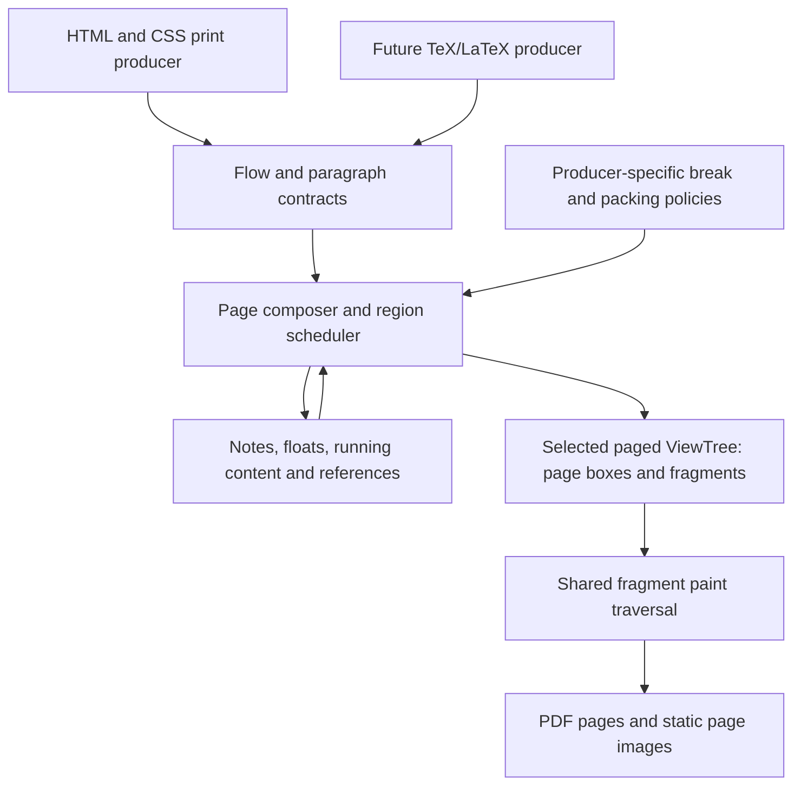

# Radiant Layout: Multiple Views, Paged Media and Publishing Typesetting

**Status:** implementation in progress; see [implementation record](../impl/Radiant_Impl_Paged_Media.md) for delivered behavior, evidence and remaining gates. Scope confirmed on 2026-10-05: advanced publishing in the initial delivery, future TeX/LaTeX extensibility, no interaction work, and A4 fallback. The generalized model is one DOM/CSS source with multiple `ViewTree`s; the DOM's embedded view remains the default browsing view for the current window and screen (§3.2). Each paged tree has one root containing its page boxes, with configurable grids, page-number/range filtering and two-page book preview (§3.2.5–§3.2.6). Experimental HTML/Lambda PDF pagination is available through `render --paged`; unsupported formatting contexts are diagnosed. This entry point does not establish complete publishing support.
**Date:** 2026-10-05.
**Source audit:** original pre-implementation working tree at `f722d537f`; §1.1 describes that baseline, not the partially implemented working tree. Implementation changes are tracked separately below and in the implementation record.
**Scope:** generalized view ownership supporting different paper sizes, thumbnails, configurable page-preview grids and viewport/display snapshots, plus paged layout/typesetting, advanced publishing composition and proper PDF paging. Preserve the existing DOM-backed default browsing view. The core must admit future TeX/LaTeX typesetting without replacement; implementing that frontend and its compatibility policies is future work. Preview-root layout and rendering are included; new interaction, editing, input routing and hit testing are out of scope.
**Formal-spec linkage:** D4.5.1v4 and D4.1.4v5 govern ownership; D5.3.3 and D5.4.1 govern callback rooting and evaluator ownership; D7.1.1, D7.1.2v2, D7.1.4v2, D7.2.4, D7.5.2 and D7.5.3 govern layering, packaging and embedding. S2.6.6v2 / D2.6.12v2 cover the separate Lambda PDF byte-output destination, not CSS pagination. No current formal ruling defines Radiant page layout. Coordinate decisions remain governed by [RSC1, RSC6–RSC8, RSC11](Radiant_Scale.md).

This document defines architecture and delivery boundaries. It does not change a formal ruling, declare a new decision-ID series, or claim that the entire proposed CSS surface already works. Ratification follows [Doc_Convention](../../doc/Doc_Convention.md); implementation progress belongs in the linked `vibe/impl/` record.

## 1. Findings and recommendation

Radiant has useful foundations for pagination: print-media matching, block and inline layout, multicolumn fragmentation, text rectangles, generated content and counters, a shared vector render walk, and a PDF writer that already serializes multiple pages. The missing foundation is **multiple independent views of one DOM/CSS source**, with page composition inside each paged view.

The recommended design keeps one DOM-backed default browsing view and adds independently owned secondary view trees for alternate layouts. Each paged tree uses a shared page-composition core with explicit fragmentation contexts, source-independent contributions, replaceable paragraph/page policies, and page boxes whose fragment subtrees belong to that tree. CSS layout is its first producer. Future TeX/LaTeX typesetting should supply another producer and policy set while reusing page regions, insertions, deferred floats, running content, references, fragments and output. PDF export consumes a selected finalized view. Changing only the PDF writer or clipping a tall screen layout into equal rectangles cannot provide this contract.

### 1.1 What the current code actually does

| Area | Verified implementation | Consequence for this proposal |
|---|---|---|
| Document layout | `layout_html_doc()` creates one `LayoutContext`, then the existing block/inline/flex/grid/table drivers mutate the DOM-backed views. The context has sizing, line, float, counter and scratch state, but no page continuation contract. | Introduce fragmentation constraints and continuations at layout boundaries. A PDF-only coordinate adjustment is insufficient. |
| DOM/view topology | `View` is an alias for `DomNode`; `ViewTree::root` points at a `View`. `ViewElement::first_placed_child()` follows DOM child/sibling links, and each source node has one parent and one geometry rectangle. | Generalize layout traversal to admit page boxes and multiple occurrences of a source view, while preserving its semantic DOM links. One source rectangle cannot describe a split view. |
| Default-view ownership | `DomDocument::view_tree` is singular. `DomElement` stores cascade output in `specified_style` and resolved view props; `DomText` stores text rectangles. `ViewTree::reset_retained()` and `destroy()` walk the DOM-backed root. | Reserve these embedded slots for the default browsing view. Secondary views need their own node/style state, geometry, generations and teardown; another root pointer alone is insufficient. |
| CSS environment | `CssEngine::context` contains mutable viewport/media/device settings; `css_condition_environment_key()` already includes several of them. | Share CSS rule inputs, but resolve styles in an explicit per-view environment. One global current CSS environment cannot serve coexisting views. |
| Print media | `CssEngine::context.print_media` participates in media matching and cache identity. `render_html_to_pdf()` enables it through the HTML export loader. | Reuse this path; print styling already exists independently of pagination. |
| Transformed documents | `render_document_transform_to_pdf()` uses the shared transform export session, whose initializer currently supplies `print_media = false`; its loader does not receive the HTML loader's print argument. | Unify presentation settings across HTML, script and document-transform entry points. Audit when their styles are attached, not just the final PDF call. |
| `@page` | `css_parser.cpp` recognizes `CSS_RULE_PAGE`, retaining a generic content string. Searches of the CSS engine and Radiant found no page-rule layout consumer. | Recognition is not a page cascade. Add typed rules, descriptors and margin-box rules. |
| Break properties | Modern and legacy property names are registered and resolve into the same `BlockProp` fields. The keyword table has `page`, but no entries for `always`, `avoid-page`, `avoid-column`, `recto` or `verso`. The resolver copies a keyword without legacy value normalization. | Fix validation and aliasing before sharing break policy; property registration alone does not establish compatibility. |
| Multicolumn layout | `ColumnGroup`, `ColumnFragment`, `FragmentedFlowCursor`, `MulticolFlowItem` and `LayoutFragmentBox` already exist. The main path lays out at column width, then distributes/projects content, with substantial special handling for nested blocks, lines, floats and spanners. | Reuse policy and measurement work selectively. The existing implementation is more capable than the early multicol proposal describes, but is not a general resumable paginator. |
| Break type handling | `multicol_forces_column_break()` treats `column`, `page`, `left` and `right` alike. `multicol_avoids_column_break()` recognizes only `avoid`. | A nested page/column context needs explicit break targets; copying this helper would preserve the wrong abstraction. |
| Fragment geometry | `LayoutFragmentBox` stores a rectangle and fragment/column/row indexes; text uses linked `TextRect`s. Neither is a complete page layout tree with source intervals and resumable state. | Extend the common fragment model without inventing a second DOM or assuming every fragment index denotes a page. |
| Export sizing | `render_export_session_begin_internal()` performs continuous layout, measures content bounds, adds 50 units, and can enlarge the output even when a viewport size was supplied. | Paged export requires an independent sizing policy. Page dimensions must not be enlarged to fit total document height. |
| PDF rendering | `render_view_tree_to_pdf()` calls `HPDF_AddPage()` once and renders the root through `render_walk_block()` / `render_walk_children()`. Dimensions are content dimensions multiplied by `output_scale`. | Add a page-result consumer and page-local render lifecycle. |
| PDF units | At scale 1, content dimensions in CSS pixels are passed numerically to the PDF page-size API. | Add a named CSS-pixel-to-PDF-point conversion for physical page output. Compatibility for existing canvas export is a separate choice. |
| PDF writer | `lib/pdf_writer.c` owns an array of pages and writes individual `/MediaBox` and `/Contents` entries, then `/Kids` and `/Count`. Tests already cover multiple pages. | Keep this writer. Pagination does not require a new PDF library. |
| Existing tests | Export parity includes print-media selection; PDF visual tests also exercise PDF import through the Lambda PDF package. | Keep these gates, and add tests specifically for newly generated paged documents. PDF import fidelity is not pagination coverage. |

Exact symbols and source locations are collected in Appendix A. Historical statements and suite counts in [Radiant_Layout_Multicol](Radiant_Layout_Multicol.md) are background, not current measurements.

### 1.2 Executed probe

A temporary HTML fixture specified `@page { size: 320px 480px; margin: 40px }`, a bottom page counter, three 120px sections, and both modern and legacy forced breaks before sections two and three. It also used a blue print-only 96px ruler, red in screen media.

```sh
./lambda.exe render temp/radiant_paged_media_audit/paging_probe.html \
  -o temp/radiant_paged_media_audit/paging_probe.pdf --no-log
pdfinfo temp/radiant_paged_media_audit/paging_probe.pdf
pdftoppm -scale-to 1000 -singlefile -png \
  temp/radiant_paged_media_audit/paging_probe.pdf \
  temp/radiant_paged_media_audit/paging_probe
```

Observed: **one page, 850 × 410 PDF points**, with all three sections contiguous, no requested page margin or footer, and a blue ruler. The raster was visually inspected. The intended paged result is three 240 × 360-point pages. The source explains the observed dimensions: the fallback width is 800, section content height is 360, and export adds 50 units to each measured extent.

Evidence is under `temp/radiant_paged_media_audit/`: HTML, PDF, PNG, `pdfinfo.txt`, logs and `binary.json`. These are local audit artifacts, not committed fixtures. The executable was **not rebuilt**; its SHA-256 is `56a2941a696a1dca74c4b1f96d9bb13e638fce17a938b008a5e93585aa6e96a7`. This probe characterizes that executable and corroborates the independently inspected source; it is not a fresh-build conformance result or performance measurement.

## 2. Intended capability and delivery boundary

The first delivery includes **advanced publishing**, not just ordinary report pagination. Footnotes, running content, deferred figures/tables, references and generated lists participate in the initial architecture and acceptance gate. Implementation still has dependency milestones, but completing a basic paginator does not complete the requested work.

| Capability | Required initial delivery | Future or separately scoped work |
|---|---|---|
| Multiple views | Preserve the DOM-backed default browser view; retain independent continuous/paged views sharing source DOM/CSS, with per-view style/layout state | Parallel layout scheduling and independent script realms are separate work |
| Snapshots and page previews | Alternate viewport/screen environments, static snapshots, a preview root with configurable grids, page-number/range filtering and a current left/right book spread; scaled finalized pages and derived thumbnails | New preview interaction, navigation controls and input handling are outside this proposal |
| Print presentation | `@media print`, print stylesheet links, an explicit environment per typesetting view | Interaction is outside this proposal |
| Page geometry | `@page` size, orientation through `size`, physical margins/longhands, border/padding/background, named and mixed-size pages | Press production: bleed, crop marks, imposition and device-specific printing |
| Page sequence | `:first`, `:left`, `:right`, `:blank`, recto/verso chapter starts, page counter styles/resets and page totals | Additional draft page-group selectors require an explicit support entry |
| Break controls | Modern and legacy breaks, page/column distinctions, avoidance, line minima and fragmented decoration | Exact TeX break-cost and packing policies |
| Running content | All 16 margin boxes, named strings, running elements, first/start/last page-occurrence selection and blank-page handling | TeX token-list marks and arbitrary output-routine execution |
| Notes | Footnote calls/markers, per-page regions, reservation with body rollback, long-note continuation; endnote flow as an alternative | Additional insertion classes via the same region/scheduler interfaces |
| Deferred material | Figure/table queues, allowed top/bottom/column/page regions, ordering, float-only pages and explicit flush boundaries | LaTeX-specific placement flags, document-class rules and float-package compatibility |
| References and generated lists | Target text/counters/page labels, TOC/list-of-figures entries and leaders, convergence when generated text changes layout | BibTeX/Biber execution, citation style engines and general indexing-language support |
| Main and complex flow | Paragraphs/lists, nested blocks, images/math, repeated table groups and cell continuations, nested columns and defined flex/grid fragmentation | Full orthogonal/vertical coverage can extend the logical-axis contract; no blanket conformance claim |
| Typesetting contracts | Source-independent flow, measured boxes/baselines, flexible-space and penalty records, paragraph alternatives, policy hooks, checkpoints and finalization | A real TeX/LaTeX producer, Knuth–Plass/TeX policy implementation, macro/package/output-routine compatibility |
| PDF | One page per committed layout page, physical units and isolated paint state; glyph placement/metrics preserved for admitted fonts/scripts | General font-program compatibility, tagged PDF/PDF-A, PDF navigation/annotation features |

The CSS-facing advanced surface follows selected features of [CSS Generated Content for Paged Media](https://www.w3.org/TR/css-gcpm-3/) and [CSS Page Floats](https://www.w3.org/TR/css-page-floats-3/), both work in progress. Record supported syntax and specification revisions explicitly. A shared insertion or float scheduler is an internal mechanism; it must not imply support for every draft property or translate a TeX command into CSS with different semantics.

TeX/LaTeX compatibility here means **architectural capability for a later typesetting frontend and policies**, not current macro-language conformance, package completeness, or identical pagination to an arbitrary TeX engine. Extensibility must be demonstrated by non-DOM contract fixtures in this delivery, rather than left as an untested future claim.

An illustrative author-facing target:

```css
@page {
  size: A4;
  margin: 20mm 18mm;
  @bottom-center { content: "Page " counter(page) " of " counter(pages); }
}
@page :first { @bottom-center { content: none; } }
@page :left { margin-left: 24mm; }
@page :right { margin-right: 24mm; }
@page wide { size: A4 landscape; }

.chapter { break-before: recto; }
h2 { break-after: avoid-page; }
p { widows: 3; orphans: 3; }
figure { break-inside: avoid-page; }
.wide-section { page: wide; }
```

Feature status should distinguish **parsed**, **resolved**, **laid out**, and **painted**. A parsed descriptor or recognized keyword must never count as completed end-to-end support.

## 3. Architecture

### 3.1 A presentation mode separate from output format

Introduce an explicit layout presentation (`continuous` or `paged`) and, for the CSS producer, a media environment (`screen` or `print`). PDF is an output target; it is not itself a sufficient layout-mode selector. Continuous print-styled PDF remains useful for diagrams and compatibility. Paged typesetting produces the same reusable result for PDF and static page-image validation; no interaction subsystem is required.



The batch typesetting session owns resolved options, the source provider, resources, layout passes, finalization and cleanup. For the CSS path, document scripts and resource readiness settle before composition; retries replay layout, not scripts. Use a fixed animation time and font/resource generation. A future stateful TeX producer may contribute additional material through an explicit resumable provider contract (§3.4), without making the composer execute a document frontend repeatedly.

Use a dedicated layout generation in the selected view tree. The default browsing view and several secondary layouts must remain valid side by side. Secondary style resolution, measurement and composition write only their own state; saving and restoring the default DOM's geometry or style slots is not the isolation mechanism. Initial scheduling may build views sequentially on the document's writer thread; simultaneous retained views do not require parallel layout threads. No new event lifecycle is part of this work.

Resource acquisition remains below Radiant under **D7.1.2v2**; output IO follows **D7.5.2**. The same paged layout code must run in both Radiant headless profiles under **D7.1.4v2**.

### 3.2 One DOM, a default browsing view, and multiple secondary view trees

The generalized structure is **one document and semantic DOM/CSS source, one default browsing view embedded in the DOM, and zero or more secondary `ViewTree`s**. Every tree has a stable identity, its own environment and layout generation. An A4 book, a Letter edition, a narrow-screen snapshot and a wide-screen snapshot can coexist. Within each paged tree, all its pages belong to that tree; changing one edition's page breaks does not change another edition or the browsing view. There is still one source `html` and one source `body`.

```text
Document: one DOM + authored CSS / parsed stylesheets + source resources
├── Default ViewTree
│   └── DOM-backed views: current window viewport and screen environment
├── A4 ViewTree
│   └── PagedRootBox → configurable page arrangement on one canvas
│       ├── PageBox 1 → body fragment → paragraph P, first part
│       └── PageBox 2 → body fragment → paragraph P, remainder
├── Letter ViewTree
│   └── PagedRootBox → its own page boxes and occurrences of source P
├── Narrow-screen ViewTree → continuous layout at an emulated viewport
├── Wide-screen ViewTree   → continuous layout at another viewport
└── Thumbnail ViewTree    → PagedRootBox → scaled finalized page instances
```

**Preserve the default DOM-backed view.** The existing embedded `DomNode::{x,y,width,height}`, resolved property slots, `DomText::rect`, fragment lists and layout flags describe only the default browsing view. Its environment follows the current window's logical viewport and screen/device settings. Window resize or a screen change updates that view through the existing browsing layout path. It does not overwrite a fixed-size export/emulation environment. In headless use the default handle may exist without materializing a window layout; creating a paged view must not require a preliminary browser layout.

**Secondary views own all of their derived state.** They use layout-only nodes referencing source identities, including for continuous layout and unsplit boxes. A secondary tree has its own style table, resolved properties, used metrics, text lines, anonymous/generated boxes, geometry, fragment links, caches and pagination state. Reusing the source DOM does not mean borrowing the default view's mutable `font`, `blk`, `bound`, `specified_style`, custom-property results or text rectangles. Source `display: none` in one view can coexist with visible occurrences in another; there is no required one-to-one node correspondence.

Each paged tree has one explicit `PagedRootBox`, containing the ordered `PageBox` children. The root arranges pages on a continuous two-dimensional preview canvas; it is not limited to a vertical strip. Each paged occurrence has one layout parent beneath a page's region hierarchy. Regions can contain columns, notes, floats and margin content. Ancestor fragments preserve containing-block, decoration and paint context. A blank page still has a page box. Source DOM links retain their semantic meaning for selectors and inheritance; they are never reparented under a page box. `typedef DomNode View` can remain a compatibility name for the default view, but the generalized view API cannot assume it describes every view node.

Use a storage-kind-aware `ViewTree`/layout-node handle: the default adapter accesses embedded DOM view storage, while a secondary adapter accesses view-owned state and occurrences. Shared style/layout/paint algorithms receive the selected view context explicitly. Do not cast a page/fragment node to `DomNode*`, swap `doc->view_tree` to a temporary tree, or introduce an ambient global current view. A source pointer alone is not a sufficient geometry or resolved-style key. Calls that intentionally preserve today's default behavior can use a named default-view adapter.

The following names describe internal contracts, not a finalized public ABI:

| Record | Required information |
|---|---|
| `DocumentViews` | Designated default handle plus separately owned secondary trees; enumeration/lookup by `ViewTreeId`; one owner per tree |
| `ViewEnvironment` | Continuous/paged presentation, media type, logical viewport/page environment, device/emulated-screen metrics, CSS preferences, font/resource generation and sampled time |
| `ViewTree` | Identity, source epoch, storage kind, environment, root, per-source state, local caches/arenas, committed layout generation and optional arrangement generation; continuous, paged or derived presentation |
| `ViewNodeState` | One selected view's cascade/resolved properties and layout state for a source; style-only state can exist without a box; occurrence index may have zero, one or many entries |
| `RenderTarget` | Selected tree/layout generation and, for previews, arrangement generation; explicit export-page selection when requested, output format/surface and raster density; preview selection comes from the root, and output settings do not replace the view environment |
| `PagedLayoutOptions` | Producer/policy selection, fallback sheet, explicit overrides and diagnostics, associated with one paged view |
| `SourceRef` | Provider ID, stable source ID/range and generation; optional DOM mapping owned by the CSS adapter |
| `FlowContribution` | Measured box/paragraph/context, space, break constraint, insertion, float, mark or reference anchor; lazy subflow where appropriate |
| `PageStyle` / `PageTemplate` | CSS-resolved page style and its normalized page/region geometry; another producer can supply a template without CSS selectors |
| `PagedRootBox` | Single layout-only root containing ordered pages or derived page instances; page selection, visible-placement index, arrangement/book-spread state, canvas bounds, background/padding and presentation generation |
| `PageArrangement` / `PagePlacement` | Row/column/grid/book mode, grouping/fill direction, gaps, alignment, preview fit/scale policy and per-child transforms; independent of typesetting geometry |
| `PageSelection` | All pages or normalized physical page numbers and inclusive ranges, resolved against a particular composed-page generation; preserves original identities/order |
| `BookSpread` / `BookPreviewState` | Original-sequence spread identity and left/right page handles or presentation-only empty slots; binding/first-side policy and the current eligible spread |
| `PageBox` | Child of a paged tree's root; physical index, page label/side/name/blank state, page-local regions, template identity and fragment children; physical sheet dimensions do not include preview gaps |
| `Fragmentainer` | Page or column kind, logical available extent, parent context, local origin and stable identity |
| `LayoutFragment` | View occurrence in one secondary tree; `SourceRef`, view-style handle, optional fragmentainer identity, layout links, local geometry, baseline/glyph or paint payload, source interval and continuation/decoration/repetition roles |
| `BreakToken` | Producer cursor, open-context continuation, selected paragraph alternative and page-composition checkpoint |
| `PageCompositionState` | Region reservations, insertion/float queues, running marks, logical counters, reference bindings and policy state |
| `PagedLayoutResult` | Handle to one finalized paged tree/generation, its page/source/anchor indexes, reference map and diagnostics; does not replace the default view or own duplicate fragment geometry |
| `PageInstance` | Derived child node referencing a retained finalized page generation, with a placement supplied by its root's arrangement; no independent source reflow or duplicate transform authority |

Use `float` for all layout dimensions and positions (RSC1). Integers describe indexes, counts and source offsets only. Existing `lib` containers and ownership annotations should be used; these names describe contracts, not a request for an STL-based framework.

`LayoutFragmentBox` can become a compatibility projection of richer fragments, or be extended after auditing its geometry consumers. There is one authoritative fragment set **per view generation**, not one set per document. Page/source indexes point at that view's occurrences, and every retained fragment/page handle includes tree and generation identity. A page index of 2 in the A4 tree is unrelated to page 2 in the Letter tree. Reusing `column_index` or inferring a page from a global Y coordinate would fail for nested columns and mixed page heights.

Source markup and explicit labels are shared, but CSS counters, generated content, running marks, page labels and target-page bindings are evaluated within each view. Repeated headers and fixed content have explicit repetition roles so each view can check ordinary-content coverage independently. The core must still accept non-DOM producers: a future TeX producer supplies source identities and paint payloads to the same secondary view model, without fabricating HTML elements.

#### 3.2.1 Where multiple rectangles live

**The built-in `DomNode::{x,y,width,height}` rectangle belongs exclusively to the default browsing view.** It cannot also represent a paragraph in another viewport or split across pages. Each secondary tree has a per-source `ViewNodeState` and independently placed `LayoutFragment` occurrences. Even a source producing only one secondary box gets an occurrence record. The source node may therefore have one embedded browser rectangle, two occurrences in the A4 tree, and three in the Letter tree, all valid at the same time.

There is already a partial precedent in the implementation: `DomElementExt::layout_fragments` points to a list of `LayoutFragmentBox` rectangles, and `DomText::rect` points to `TextRect` records with text ranges. These fields remain the default view's storage. The generalized accessor takes a tree: it can read these fields for the default view, or secondary-owned records for another view. Evolve the record contracts without repointing the DOM fields at whichever view was last laid out. `TextRect`-like line/run data in a secondary view belongs to the appropriate committed occurrence, rather than one document-wide list replayed for every page or tree.

The conceptual fields below describe the storage split, not a finalized C++ declaration. IDs are generation-checked handles into `ViewTree`-owned storage under **D4.5.1v4**; coordinates are `float` CSS pixels under RSC1.

```text
Source node P: the one existing DomElement for <p>
    semantic parent/children, content and authored style inputs
    built-in rectangle and resolved props: default browsing view only

A4 ViewNodeState for P:
    this view's resolved styles and layout state
    occurrence index: [F1, F2]

LayoutFragment F1:
    source = P
    view / style = A4 tree / its ViewNodeState for P
    parent = body fragment on page 1
    page / fragmentainer = page 1 / its content region
    border_box = { x, y, width, height } relative to layout parent
    children = line/text/inline occurrences for the first part
    continuation_role = first

LayoutFragment F2:
    source = P
    view / style = A4 tree / its ViewNodeState for P
    parent = body fragment on page 2
    page / fragmentainer = page 2 / its content region
    border_box = { x, y, width, height } relative to layout parent
    children = line/text/inline occurrences for the remainder
    continuation_role = last

Source-to-fragment lookup: (A4 tree, generation, P) → [F1, F2]
Letter tree and emulated-screen tree have their own state and occurrences.
```

For example, if a six-line paragraph breaks after line 4, F1 contains line occurrences 1–4 and F2 contains 5–6. Both refer to P for source identity. Their child text occurrences refer to the original text nodes and carry the exact source ranges and selected glyph runs to paint. A paragraph with nested spans needs ranges across those child sources, not a fictitious flat string offset on the paragraph element. Source ranges use the provider's declared offset unit; shaped glyph/cluster ranges are recorded separately. If page 2 has a different width, the remaining material may form different lines; the continuation cannot be represented by translating the same six-line rectangle.

Each fragment additionally carries or references its own used box metrics, content box/overflow, clip and transform context, first/middle/last and repetition roles, and decoration edges. Its computed styles come from the selected view's style state; used values depending on fragment geometry belong to the occurrence. In particular, do not mutate P's default-view props or the A4 view's shared style to hide the bottom border on F1 and restore it on F2. `box-decoration-break` and background continuity are resolved from the fragment's role and geometry.

Within a view, the layout tree and source index refer to the **same records**. Layout child/sibling links establish the tree; a per-source index or occurrence chain provides reverse lookup and does not establish another ownership hierarchy. Text occurrences participate through the same provider/source index, so the design does not depend on every source having a `DomElementExt`. Anonymous page/region boxes can have no element source. Each occurrence belongs to one view generation; safely retained immutable inputs/resources can be shared across views.

The built-in DOM rectangle is **not** the first page's rectangle, a cross-page union, or a slot overwritten as each page paints. Page-local rectangles have different origins and may have different widths; a cross-page union requires the explicit `PagedRootBox` placement transforms (§3.2.5). Such a union is preview-canvas geometry, not a source element's layout rectangle. Any diagnostic needing one extent must identify the view and coordinate space. Tree/generation checks at geometry adapters reject accidental reads from another view. Secondary measurement must use its own state throughout; temporarily replacing and restoring default-view values would break nested rendering and cannot satisfy retained-view isolation.

#### 3.2.2 Layout and paint changes required by this storage model

1. The CSS layout adapter resolves shared source CSS in the selected view environment, measures using that view's state, and produces trial occurrence geometry. Its break token identifies the remaining child/text/line state within that view/generation. On commitment, fragments join the selected view's continuous root or page/region hierarchy.
2. Every further page receives new occurrences for continuing boxes, preserving the same source IDs. A source-to-fragment index is built from committed occurrences. Trials and repeated headers must not repeat semantic counter or note-number allocation.
3. A secondary walker traverses layout links and passes an explicit view/occurrence to painters. Its paint input combines source identity with that view's resolved style and the occurrence's rectangle, used metrics, child list, text slice and decoration flags. It must not fetch geometry, props or rendered children implicitly from the source DOM's default-view slots.
4. Extract the existing algorithms' source/style and geometry access at shared boundaries. The default adapter supplies embedded view state; the secondary adapter supplies its node state and occurrences for both continuous and paged layout. Temporary DOM rewrites or copying a `DomElement` into a fake view are not a compatibility strategy. Sharing algorithms does not require relocating the default view out of the DOM.
5. Render each `PageBox` subtree into its PDF page using that page's origin and clip. The source node is read-only during painting; the renderer never switches its rectangle to make a page appear correct.

This preserves DOM/view identity as the **default browsing storage optimization**, while generalizing the document to multiple rendered hierarchies. Every secondary view has its own geometry and layout links; every paged edition has its own complete page sequence. The required change is in state access and ownership throughout CSS resolution, layout and paint, not merely PDF serialization.

#### 3.2.3 Shared CSS inputs, view-specific resolution

"Share the DOM and CSS" means sharing authored style attributes, parsed stylesheets, declarations, selectors, rule order and source resources. It does not require identical cascade results. Media conditions select rules using the rendering environment; computed and used values are distinct stages of value processing. See [Media Queries §2](https://www.w3.org/TR/mediaqueries-4/#media) and [CSS Cascade §4](https://www.w3.org/TR/css-cascade-5/#value-stages).

| State | Sharing/ownership rule |
|---|---|
| Semantic DOM, attributes/text, authored inline CSS, stylesheet source/rules | One document-owned source, versioned when changed |
| Selector/rule indexes and parsed value syntax | Share immutable data; cache matches only with the source/state dependencies in the key |
| Media matching, cascade winners, inherited/custom-property results, resolved props | Per-view state; inherit through semantic DOM parents using that same view's style table |
| Pseudo/generated content, counters, container-query results where supported | Per-view derived state; layout differences can change generated boxes and style results |
| Used dimensions, line breaking, intrinsic/measurement caches, fragments and page bindings | Per-view by default; share a cached value only when all inputs match |
| Immutable font/image/vector assets and shaping results | Share with explicit lifetime and complete input keys; font selection, image candidate selection and raster surfaces may differ by view |

The existing `DomElement::specified_style` is cascade output, despite its name; it is not a universal immutable copy of authored CSS. Its resolved props, `css_variables`, style flags and style-version bookkeeping must be audited as default-view state. Secondary cascade output goes to `ViewNodeState`, including state for ancestors that have no visible box. Never seed a print view only from rules that survived the browsing view's screen-media filtering; preserve and evaluate the original shared rule inputs.

Split `CssEngine`'s reusable rule/parse facilities from mutable resolution context, or provide a lightweight per-view resolver borrowing those inputs. Thread the selected `ViewEnvironment` and style destination through resolution; do not toggle the default engine's `print_media`, viewport or device settings around an export. Any shared condition cache must include every supported environment dependency; the existing environment-key helper is a starting point, not proof that all future dimensions are covered. Resolved style objects may be interned across views only when values/dependencies and lifetime match, with immutable storage that survives either tree's independent destruction.

#### 3.2.4 Window/display emulation and thumbnails

The default environment reflects the actual window viewport in CSS logical pixels and the current screen/device metrics. Screen resolution/device scale and logical viewport dimensions are distinct (RSC1, RSC6–RSC8): rendering the same CSS viewport at a higher raster density does not inherently make it a wider layout. Supported resolution media queries and responsive asset selection may respond to a changed device environment. An emulated view supplies its own explicit viewport, screen/device metrics, media/preferences and sampled time without overwriting `UiContext`, `DomDocument::viewport` or the default CSS context.

The API separates **layout environment** from **render target**. Changing paper size or logical viewport creates/rebuilds that view's layout. Changing only an output image's density or a page's thumbnail placement uses the finalized layout. To get a truly responsive narrow layout, request a narrow-screen view; scaling a wide-screen image does not supply one. Snapshot APIs select a tree/generation and record its environment, source/resource epochs, page selection and output settings for reproducibility.

A PDF-style thumbnail can use either a direct render of a selected finalized page at reduced output scale, or a separate derived `Thumbnail ViewTree` whose `PagedRootBox` arranges `PageInstance` children. Each instance references an immutable page generation or retained page display list. It uses the same arrangement contract as full-size page preview (§3.2.5), retaining the original page breaks, page labels and glyph placement. It does not run print CSS against the thumbnail's small width. References retain the page/resource generation explicitly; they do not borrow another tree's rewindable scratch or mutable default view. Changing thumbnail size invalidates presentation/raster caches only. Changing its source paged edition invalidates/rebinds the instances as a unit.

Static emulation uses one settled DOM and a declared state/time snapshot. It does not rerun document scripts as different devices or create several independent browser realms; scripts that would author different DOM content require separate document executions outside this layout proposal. Existing default browsing behavior remains intact. Secondary interaction and event routing remain out of scope.

#### 3.2.5 One preview root with configurable page arrangements

The page-preview root is a real layout box. It contains and positions the page boxes so a selected view renders as **one continuous screen canvas containing distinct physical pages**. The canvas can extend in either axis. Layout inside a page is completed by the paginator; layout of the pages themselves is performed by the root's arrangement pass. These are separate operations.

```text
PagedRootBox                         Example placement: 2 rows × 2 columns
├── PageBox 1                        ┌─────────┐  ┌─────────┐
├── PageBox 2                        │ Page 1  │  │ Page 2  │
├── PageBox 3                        └─────────┘  └─────────┘
└── PageBox 4                        ┌─────────┐  ┌─────────┐
                                    │ Page 3  │  │ Page 4  │
                                    └─────────┘  └─────────┘
```

The arrangement contract supports a vertical column, horizontal row, fixed-column wrapping grid, and bounded `rows × columns` groups such as 1×1 or 2×2. Here the first dimension denotes rows. A 1×1 group places one page; a 2×2 group places up to four pages. Documents with more pages produce further groups, whose progression can be vertical or horizontal within the same root. An explicitly selected page range may also be arranged on its own. There is no four-page document limit and no requirement that all preview modes become one long column. Incomplete final groups leave unoccupied cells; those cells do not create blank source/PDF pages.

`PageArrangement` declares the column/row counts or wrapping constraints, group progression, row-major/column-major fill and direction, root padding, row/column/group gaps, page alignment, and a uniform preview scale or fit policy. Counts must be positive where specified, and geometry/scale finite and valid. The default fill follows the logical page sequence; placement never changes page IDs, labels, recto/verso classification or export order. Booklet imposition is outside this preview feature.

For mixed page sizes, derive track extents from the scaled sheet bounds and align each page within its cell. Root content bounds enclose the placed pages plus configured padding and any declared preview-decoration outsets. This determines the canvas extent for rendering or capture. Any viewport clipping is applied to that canvas; page backgrounds, borders and margins retain their physical page geometry. Root gaps/padding and optional paper shadows are preview settings, separate from authored `@page` margins and decorations.

Keep three coordinate spaces explicit (RSC1, RSC6–RSC8):

```text
page-local CSS point → root-canvas CSS point → target raster point
root_point   = page_origin + preview_scale * page_point
raster_point = raster_scale * (root_point - viewport_origin)
```

All content stays in page-local coordinates. A `PagePlacement` supplies the transform from a page into its root, rather than rewriting every descendant's rectangle. The page boundary clips page content according to its existing paint rules; root decorations are painted in the root's scope. The PDF exporter uses the page-local geometry and physical unit conversion directly, omitting preview placement, fit scale, gaps, shadows and root background. The entire preview canvas must not become one oversized PDF page.

The root is layout-only: its screen width does not become the containing block, CSS viewport, media-query environment or fragmentation height of the source content. A print-styled A4 edition previewed on screen remains that edition. Resizing the preview viewport can recompute placement/fit without recascading or repaginating it. Requesting another paper size or another source viewport is a separate view/layout operation. Positioned/fixed content belonging to a physical page continues to resolve in that page's context, not against the preview root.

Track presentation changes separately from the composed-page generation. A new grid/gap/fit setting produces a new root arrangement generation referencing the same finalized page content. Publish placement changes coherently so a retained render sees one complete arrangement. If two arrangements must remain visible simultaneously, create another derived view with `PageInstance` children; never give a physical `PageBox` two owning parents. Rendering may cull pages outside a target clip using root-space page bounds, but culling must not remove pages from the sequence or alter typesetting. This feature defines root geometry and painting only; input handling remains outside the proposal.

#### 3.2.6 Page filtering and two-page book preview

The root owns a complete composed page sequence and a separate **presentation selection**. Callers can show individual page numbers, inclusive ranges, or their union; for example, pages `1, 4, 8–12`. The selector uses one-based physical sequence numbers in the chosen paged view. These differ from printed page labels, which may be Roman numerals, reset at a chapter, or repeat. Labels remain visible as authored, but are not silently interpreted as physical selection indexes. Selection by printed label would need a separately named, ambiguity-aware API.

Represent selection structurally as `all` or a set of page numbers/ranges. Normalize by merging overlaps, removing duplicates and retaining original document order. Omitted selection means all pages; an explicit empty set means none. Reject nonintegral/nonpositive numbers, reversed ranges and endpoints outside the finalized page count with a diagnostic. Resolve the selector again after repagination; never reuse stale page handles or silently clamp a formerly valid range. These are proposed API policies, not new CLI syntax.

Filtering runs **after composition and reference convergence**. It controls which pages receive preview placements and paint calls; it does not remove `PageBox` children, reflow source content, renumber pages, change `counter(pages)`, or recompute TOC targets against only visible pages. The root's visible-placement index references existing pages. Source-coverage validation still checks the complete composition, while preview validation checks the selected subset. Showing only page 10 is not permission to skip typesetting the content needed to determine page 10.

Ordinary row/column/grid arrangements pack the selected pages in sequence order and derive bounds from those placements. An empty selection paints only the configured root background, with no invented page; an offscreen target requiring positive output dimensions must obtain them explicitly. Snapshot metadata records the normalized selection and composed-page generation. Viewport culling is an additional paint optimization over selected placements, not another change to selection or page identity.

**Book preview is a facing-page arrangement with one current spread.** It has a left slot, a right slot, a spine gap, binding/first-side settings, and a current spread handle. At most two physical pages are painted at a time. A caller can select a spread directly or select a page and request the spread containing it. The initial current spread is the first eligible spread; if a changed filter removes the current spread entirely, select the first remaining eligible spread, or show the empty root if none remain. This is layout/presentation state for an API; it does not require new keyboard, pointer or navigation controls.

Proposed default for a left-bound book, where the first composed page is a right-hand page:

| Spread | Left slot | Right slot |
|---|---|---|
| Opening | empty presentation slot | page 1 |
| Next | page 2 | page 3 |
| Next | page 4 | page 5 |
| Final, for a six-page document | page 6 | empty presentation slot |

Construct spreads from the full ordered sequence and its resolved physical left/right metadata, before applying the filter. Do not infer page sides from printed counter labels. Support right binding and an explicit first-page side for sources without sidedness metadata; mirror visual slots as appropriate. Binding defaults must agree with the page environment's resolved side progression. A preview option must not silently override CSS-resolved left/right page styles; a conflicting side-progression request needs a compatible recomposed view. A two-column grid remains available for arbitrary pairing without book-side semantics.

Apply the filter to the original spread slots, then omit spreads with neither partner selected. If only one partner is selected, keep it on its original side and leave the other slot empty. For example, selecting pages `3–4` in the sequence above gives two eligible spreads: `[empty, 3]` and `[4, empty]`; book mode shows one of them at a time. It does not pair page 3 with page 4 or automatically reveal an unselected page. Book preview therefore preserves physical pairing, while grid mode can place the same selected pages beside each other.

An empty slot is presentation metadata, not a `PageBox`; it contributes no page count, `:blank` match or PDF output. A real blank page inserted by pagination remains a selectable physical page and keeps its existing side. Hidden-partner slots can retain that partner's sheet bounds without painting it; an absent opening/final partner uses the opposite page's slot size by default. Align facing pages at the spine with a common preview scale and explicit vertical alignment, preserving mixed sheet sizes. Root canvas/fit bounds describe only the current spread, rather than a strip of every spread in the document. The existing grid/group mode covers an overview of many spreads/pages when desired.

The root pipeline is `finalized pages → normalized selection → grid placements or eligible book spreads → current presentation → viewport culling → paint`. Changes to selection, current spread, binding-compatible placement or fit advance only the presentation generation. Independent roots can show different filters/spreads of the same finalized content. PDF export continues to enumerate physical pages independently of preview state; an explicitly requested export subset can reuse `PageSelection` normalization, but never inherits the current book spread or preview filter implicitly. Export subset selection likewise preserves original page content/labels and does not emit empty preview slots.

### 3.3 Ownership and publication

Follow **D4.5.1v4**: Radiant layout records are arena/pool-owned and are not GC objects. A document owns its default view and secondary view registry; each tree owns its derived state, property/cache storage and layout generations. The current owning `DomDocument::view_tree` can remain the default-view slot during migration, with a separate owning secondary registry and non-owning combined enumeration. Never give both the default slot and the registry ownership of the same tree. Views borrow the document; a session pins the document and selected generations while consuming results. Lambda callbacks and values still obey **D5.3.3** precise rooting and **D5.4.1** evaluator ownership; creating a view must not create an evaluator per view or page.

Each view gets independent layout/render scratch arenas, property storage, counter/generated-content state and display-list lifetime. Resetting or destroying a secondary tree must not walk the source DOM clearing default `ViewProp` slots. Retain the current DOM teardown visitor for the default adapter; use an owner-specific visitor for secondary state. Shared immutable assets must be owned outside individually resettable trees or explicitly retained, never borrowed from a sibling's property pool. This is especially important for the current canonical property arenas and text-rectangle free lists.

Use separate allocation lifetimes for speculative layout and committed output within each view. A failed trial rewinds only that view's scratch region. Tokens belong to the selected pagination generation, not a stack-local `LayoutContext` or rewound scope. Committing a pass replaces that tree's committed root/indexes; sibling trees and the DOM-backed default remain valid. Release a previous generation only after its consumers, including thumbnails, finish. This uses **D4.1.4v5** batch/region lifetime and single-writer/multiple-reader rules, not individual arena frees or uncontrolled concurrent mutation.

Identity and invalidation are explicit:

- A source handle identifies the document/source generation and node; a layout handle also identifies the `ViewTreeId` and its generation. Equal node/page indexes in different trees cannot alias.
- DOM or authored-CSS mutations invalidate every dependent tree; font/resource changes invalidate affected views. Recomputing default-view styles is derived work and must not itself masquerade as an authored source mutation.
- A window resize updates the default environment; changing an emulated viewport or paper size updates only the selected secondary view. Output-density-only changes invalidate the corresponding raster output, unless the caller explicitly changes the CSS device environment too.
- A preview filter, current book spread, grid, gap, page-placement or fit change updates the root's presentation generation and dependent raster caches while retaining composed page content. A derived view retains the page generation and its own arrangement generation independently.
- Initial batch layout/render reads one fixed source epoch and publishes only against that epoch. An outdated tree is rejected or explicitly refreshed before use, not silently mixed with current source content. Keeping an older snapshot renderable requires retained immutable paint payloads/resources; a source pointer and generation number alone do not freeze a mutable DOM.
- View computations may initially run sequentially. Keeping several committed views resident is required; parallel layout is a separate scheduling optimization after mutable resolver/font/cache ownership is audited.

Provide explicit internal entry points for default-view lookup, secondary creation, layout, rendering and release. Conceptually, `view_tree_default(doc)` accesses the DOM-backed view; `view_tree_create(doc, environment)` creates an independent view; `view_node_state(tree, source)` selects that view's styles/layout data; layout/render operations accept a tree handle and validate source/generation state. Page exports take `PagedLayoutResult(tree_id, generation)`. No export or snapshot silently changes which view is the default.

The export session can adopt a selected existing tree or create an owned secondary tree. Reference-resolution passes initially repaginate that complete view; prefix reuse is an optimization. A pass is provisional until its references and composition state are stable. Separate A4/Letter target-page maps and generated TOCs remain view-owned, even though they refer to the same source anchors.

### 3.4 Contracts that preserve future TeX/LaTeX extensibility

The core shares **composition mechanisms**, while producers retain their formatting semantics. A CSS producer uses existing formatting contexts and cascade results; a later TeX producer can supply expanded box/list material, paragraph parameters and page policy without round-tripping through HTML. Do not flatten flex/grid/table semantics into an impoverished linear list: a contribution may expose a lazy nested formatting context with its own continuation.

| Contract | Required capability now | Future TeX/LaTeX use |
|---|---|---|
| Flow provider | Stable identities, ordered/lazy contributions, checkpoint/restore and source diagnostics | Expanded horizontal/vertical material without mandatory `DomElement`s |
| Box metrics | Advance, ascent/height, depth, baseline, logical bounds and separate ink overflow; glyph positions and font identity | Horizontal/vertical boxes, kerns, rules, math boxes and exact baseline relationships |
| Flexible space | Natural size, separate stretch/shrink capacities and ordered flexibility classes; no numeric infinity sentinel | Finite glue and `fil`/`fill`/`filll` packing without converting it to CSS margins |
| Break policy | Legality separate from cost; forced/forbidden tags, finite penalty, reason and continuation | TeX penalties/badness and context-specific break choice, without weakening CSS hard constraints |
| Paragraph provider | Shape/measure independently of page commitment; return line sequences/alternatives for a width profile and resume state | Knuth–Plass paragraph optimization, discretionary pre/post/no-break material, hyphenation and fitness/looseness policies |
| Page policy | Select candidates, pack regions, interpret boundary discard/retain rules and carry policy-owned continuation | TeX page-builder decisions, top/baseline glue and vertical packing |
| Composition services | Typed regions, insertion splits, deferred floats, mark snapshots and target-page bindings | TeX insertions/marks and LaTeX document-class/float scheduling adapters |
| Page assembly/finalization | Assemble a page, hold/reinsert contributions or emit finalized page boxes; queue side effects until commitment | A future output-routine adapter with explicit state and shipout ownership |

These are internal C+ contracts, not a new public plugin ABI. CSS may return one paragraph solution initially; a test provider must already be able to return several and drive a different selection policy. Ordered stretch classes and signed penalties must be representable and exercised now, even though TeX-specific algorithms are deferred. Do not share one unconditional greedy algorithm between all producers or encode CSS `avoid` as a conveniently large TeX-style penalty.

The architectural reference is Knuth's [TeX source](https://raw.githubusercontent.com/TeX-Live/texlive-source/trunk/texk/web2c/tex.web), particularly `line_break`, `build_page`, insertion/mark nodes and output processing. Paragraph optimization and page building are distinct operations; compatibility does not require inventing a globally optimal whole-book algorithm. LaTeX float policy is also distinct from both ordinary CSS floats and TeX insertion storage.

A future stateful frontend must not be speculatively re-executed. Its adapter should checkpoint or journal expansion/output state and supply replayable contributions; irreversible effects occur once after commitment. Page-assembly hooks can return `hold`, `reinsert`, or finalized boxes, with progress checks. They cannot mutate a published result or borrow trial scratch after return. Arbitrary TeX output-routine semantics remain future work, but the core must not assume every page selection immediately emits exactly one irreversible PDF page.

Retain a provider-owned native metric payload when exact arithmetic is needed. Radiant positions/dimensions remain `float` under RSC1; a future TeX adapter can keep scaled-point calculations in its own metrics/policy layer and export float paint geometry once. It must not reconstruct exact metrics by reading back rounded rectangles. Exact TeX numerical parity would require its own tolerance/conformance gate, not a claim based on this interface alone.

### 3.5 Present LaTeX path and the later adapter

The live source uses the direct parser in `lambda/input/input-latex-c.cpp`, then the shipped `lmd/package/latex/` analysis/rendering package for HTML output. `analyze.ls` collects headings, labels and footnotes; `latex.ls::render()` runs that analysis and dispatches rendering. Its `postprocess()` appends a footnote section, `render.ls` maps both `newpage` and `clearpage` to the same `<hr>` class, and `render_figure()` emits a figure element. These provide semantic inputs but do not implement a TeX page builder.

The later producer should branch before lossy HTML serialization: preserve note anchors/bodies, figure placement preferences, distinct break-versus-flush commands, reference targets, marks and paragraph/box parameters. Existing semantic analysis and `lmd/package/math/box.ls` width/height/depth metrics are reuse candidates, not evidence of complete TeX layout compatibility. Keep any language-facing adapter within **D7.5.3** and follow **D7.2.4** for new shipped document packages.

Historical documents such as [Latex_Pipeline_Design](../latex/Latex_Pipeline_Design.md) and [Latex_Typeset_Design2](../latex/Latex_Typeset_Design2.md) describe `lambda/tex/`, `TexNode` and DVI paths that are absent from this audited checkout. Their architecture is background, not an available implementation to revive or a prerequisite for this proposal. A fresh TeX implementation and compatibility scope should be designed against the contracts above when that future work starts.

## 4. CSS and page style resolution

Use the external standards as conformance targets, with their draft status recorded. [CSS Paged Media Level 3](https://www.w3.org/TR/css-page-3/) defines page contexts; [CSS Fragmentation Level 3](https://www.w3.org/TR/css-break-3/) defines break behavior. The proposal chooses an implementation structure and a bounded delivery schedule, not alternative CSS meanings.

### 4.1 Typed `@page` rules and a separate cascade

Replace generic-string consumption with a typed page-rule payload at CSS parse time. Retain selector components, declaration source positions, page descriptors and nested margin-box rules. Use the existing tokenizer, declaration parsing and cascade machinery wherever applicable. Page selectors are not DOM selectors: supply a page-specific matcher and specificity calculation instead of manufacturing a `DomElement` that accidentally matches normal rules.

Page rules must retain stylesheet origin, importance, layer/order and conditional ancestry as they pass through imports and conditional rules. Unknown declarations or nested at-rules should recover locally without swallowing a following ordinary rule. Descriptor validation must be context-specific: `size` inside a page rule is not an element width shorthand.

Page style resolution takes a page name, side, first/blank flags and the print environment. Cache by those inputs and the stylesheet generation. Page-context inheritance and margin-box inheritance need separate paths from normal element inheritance; see [CSS Paged Media §4–6](https://www.w3.org/TR/css-page-3/#page-selectors).

Keep page geometry, element percentage containing blocks, and media-query dimensions as distinct inputs. For the selected published specification, paper-dependent media queries use the default sheet environment and do not recursively follow a `size` they select; the first page area establishes the initial containing block. Pin the relevant tests to [§3](https://www.w3.org/TR/css-page-3/#page-model) and [§7.1](https://www.w3.org/TR/css-page-3/#page-size-prop). Do not recascade the entire document against each remaining-page height.

### 4.2 Resolve break aliases before layout

Normalize legacy declarations into the modern property slots with their original cascade rank. In particular, legacy `always` maps to `page`; applying aliases in a later resolver loop would make precedence depend on property enumeration. Add property-specific accepted-value tables and validation. Test importance, declaration order, shorthand reset behavior and CSS-wide keywords across the alias boundary. The compatibility mapping is specified in [CSS Fragmentation §3.4](https://www.w3.org/TR/css-break-3/#page-break-properties).

Represent forced targets and avoidance by fragmentation kind. The current column helper must stop treating a page request as an ordinary column advance. In a nested flow, a page request is propagated to its matching outer context; an ordinary column request remains local. Preserve the distinction between a physical page index, sidedness and a displayed page counter.

### 4.3 Page geometry and margin content

Compute the page box before laying out its content. Resolve page margins, borders and padding to a finite page-area rectangle, including percentage and `auto` cases from the selected standard. Keep body margins as ordinary document styles; never add them to the page margin option or suppress them implicitly.

Use shared paragraph/text services for margin boxes, with page-local generated-content context. Reserve page margins before body pagination. Margin-only page totals can resolve after body layout against fixed margin rectangles. Long labels may wrap or overflow according to their styles, but cannot silently enlarge the body area. Running-content selection and body-affecting references are part of the initial composition/convergence services in §5.8–5.9.

The page selector/counter test corpus must include blank inserted pages, suppressed first-page footers, counter resets, different left/right margins, and a named landscape section followed by ordinary pages. Margin geometry and margin-box generated content are separate milestones even though authors commonly use them together.

## 5. Fragmentation integrated with layout

### 5.1 The contract a formatting context should expose

Add a fragmentation input alongside available size: current fragmentainer, full and remaining logical block extent, break policy, and optional incoming token. A layout call returns committed fragments, consumed extent, completion status, outgoing token and the reason a break was selected.

The result must distinguish `complete`, `continue`, `needs-earlier-break` and `error`. A boolean success result cannot express both successful partial layout and an unplaceable object. Initially integrate this contract with block flow and paragraph layout. Share existing intrinsic sizing, line breaking, float avoidance and border-box calculations; avoid building a miniature second layout engine in `render_pdf.cpp`.

Break tokens should capture:

- The next child/source position plus the continuation chain of open ancestors.
- Inline resume state at a valid text/shaping boundary, including whitespace, bidi and inline ancestry; a UTF-8 byte offset alone is insufficient.
- Consumed block extent, pending margin state, first/last-fragment state, and whether an encountered forced break has already been consumed.
- Counter/generated-content checkpoints, insertion/float queues, region reservations, running marks, reference bindings and deferred out-of-flow anchors.
- Formatting-specific state such as a table row/cell cursor or nested column token.

A token should reference stable owned state rather than copy the complete mutable `LayoutContext`. Place resume points between committed units. `line_break()` currently performs alignment and other mutations, so inserting an overflow return after those mutations would require rollback of text rectangles, view links, counters and floats. Refactor commit/checkpoint boundaries first.

### 5.2 Break selection and progress

Collect candidate boundaries as layout proceeds; record source position, constraints, region capacities, forced targets, avoidance, line counts, cost and replay checkpoint. The CSS policy first honors applicable forced breaks and, for an unforced break, prefers a fitting legal candidate after accounting for notes/floats and keep constraints. A latest-fitting choice is one policy, not a core invariant. Relax CSS constraints only through the standard's fallback stages and record the stage. Alternative typesetting policies select among the same checkpoints without reinterpreting CSS rules. See [CSS Fragmentation §4](https://www.w3.org/TR/css-break-3/#breaking-rules).

The CSS paragraph provider may use line-group lookahead for widow/orphan constraints. The core must also accept whole-paragraph alternatives; it cannot cap every provider at that small lookahead. Do not permanently lay out an entire paragraph at the first page's width and slice its rectangles if the continuation page has another width. A paragraph provider receives the width profile or is explicitly asked to recompute alternatives at a changed boundary. Reuse immutable shaping where its inputs match.

Make termination explicit. Each retry must consume source content, consume a one-time break/parity transition, advance a formatting-specific continuation, or return a diagnostic. Track repeated token/constraint states and a configurable resource budget. A page-count cap by itself must not turn an infinite loop into a silently truncated successful PDF.

An atomic object that fits a fresh page can move there once. If it still cannot fit, return an oversized-content diagnostic. Proposed default for publishing export is failure rather than publishing an apparently complete document with missing content; an explicit tolerant export may place it once and report clipping. No automatic shrink-to-fit is implied. Breakable text, table cells and notes must use their continuation contracts instead of this atomic fallback.

### 5.3 Margins, decoration and variable page sizes

Boundary state must distinguish forced versus unforced breaks, collapsed margins and retained/discarded edges. This is necessary for [fragment margins and decorations](https://www.w3.org/TR/css-break-3/#break-margins), including `box-decoration-break: slice | clone`. Store which fragment owns each edge and the decoration/background origin used for that fragment; do not paint the union rectangle as one large border on every page.

Page geometry is requested from the page sequence when a continuation is needed. A differently sized page supplies new constraints to the unconsumed content. Preserve the initial-containing-block and percentage sizing rules separately; changing fragment width does not mean every specified percentage is reinterpreted against an arbitrary remaining-space rectangle.

A page-name transition needs lookahead to the next participating in-flow content and a checkpoint before committing its boundary. Forced breaks, named-page changes and sidedness must resolve together, so the engine does not insert duplicate blank pages. A final forced break should not mechanically create an extra empty trailing page. Empty-document behavior should be deterministic: proposed default is one empty page.

### 5.4 Formatting-context integration

| Context | Proposed integration and required limits |
|---|---|
| Blocks, paragraphs and lists | Make child and line continuation the first shared consumers. Preserve list/counter state across breaks; continuation fragments do not re-enter the source element and increment its counter again. |
| Tables | Reuse column measurement across equal-width pages. Support row boundaries and cell continuations for oversized rows and spanning cells; reserve repeated header/footer space. Repeated groups are occurrences of the same source. Captions, group fit, collapsed borders and row-group ordering need explicit cases; unsupported combinations fail visibly rather than truncating a table. |
| Flex | Reuse axis and line machinery, exposing flex-line/item continuations with tested supported combinations. Fitting containers can remain atomic where semantics permit; oversized flex content cannot be advertised as complete merely because it paints. Follow [Flexbox fragmentation](https://www.w3.org/TR/css-flexbox-1/#pagination), including column-direction behavior. |
| Grid | Keep track sizing and placement separate from row/item continuation. Repeatedly running grid placement on the remaining DOM would change auto-placement and spans. Follow [Grid fragmentation](https://www.w3.org/TR/css-grid-1/#pagination); row-spanning items need explicit state. |
| Multicolumn | Model a column sequence inside a page fragment. A page end resumes the column formatting context; it does not project already laid-out overflow columns onto later pages. Keep balancing and spanner grouping column-specific while sharing candidate selection and fragment emission. |
| Floats and out-of-flow boxes | Preserve parallel-flow and containing-block identity. Ordinary floats need deferred-placement state; fragmented floats require independent continuations. Absolute anchors reference a source fragment. Only fixed boxes whose containing block is the page repeat as page furniture; a transformed ancestor can change that relationship. |
| Replaced/embedded/custom content | Images, SVG, math and non-fragment-aware custom layouts can initially be atomic. A future custom-layout fragmentation capability must be explicit; never re-invoke a callback per page with changed semantics without a contract. Existing PDF-page imports keep their own source-page identities. |
| Overflow and transforms | Retain authored overflow clipping. Fragment selection uses layout geometry, while painting applies transforms; rotated paint bounds must not manufacture source breakpoints. Support for scrolling/monolithic cases must be declared. |

Table repetition and row splitting should be validated against [CSS Tables fragmentation](https://www.w3.org/TR/css-tables-3/#fragmentation), with the tested draft revision recorded. Repeating headers is not equivalent to duplicating the `<thead>` DOM subtree.

### 5.5 Extract shared mechanisms without destabilizing columns

Start by separating break-value interpretation, candidate policy, line-minimum checks and fragment recording from column placement. Promote reusable helpers to a coherent module header; do not copy `static` helpers into a new paginator. Keep column dimensions, balancing, rows and spanners in `layout_multicol.cpp`.

Introduce the page consumer against this shared contract, then migrate column consumers incrementally with existing multicol fixtures. A complete rewrite of the 10,000-line multicol implementation is not a prerequisite. Conversely, wrapping it in a one-column container would inherit its projection assumptions and page/column conflation.

Layout cache keys need the fragmentation generation and relevant continuation constraints. The current size/available-space match is not sufficient for a page-dependent result. Initially bypass final-layout cache reuse for fragmented calls that lack a sound key, while retaining independent intrinsic measurements. Add cache support only when a result can be proven independent of excluded page state.

### 5.6 Region composition and footnote insertions

Represent the main body, columns, footnote area, float areas and page furniture as typed regions with explicit capacities and ownership. CSS page rules provide the initial template; a later document class can provide the same region graph through its adapter. Margins remain page furniture; the footnote body region normally reduces body capacity inside the page area rather than becoming a footer drawn over the last paragraph.

A footnote call creates a stable insertion identity and source-order counter event. Its displayed number follows the selected counter scope; page-scoped resets are resolved after placement and can require remeasurement. Its body is a separate continuable flow with an anchor, region class, separator/spacing, minimum first portion and split policy. The scheduler needs the following page trial:

1. Start from a checkpoint containing body, insertion/float queues, counters, marks and region reservations.
2. Lay out a candidate body prefix and collect its anchored insertions. Measure notes at the region's own width, with independent paragraph state.
3. Reserve note separators and fitting note portions; if the body no longer fits, choose an earlier legal break and restore the checkpoint.
4. If a call moves off the page, remove its trial insertion and recompute the reservation. A rejected trial must not leave a note without its call or increment its number again.
5. Split long notes at admitted body/line boundaries, preserving the insertion ID and numbering. Queue the remainder ahead of later notes according to policy, with continuation furniture accounted for.
6. Commit body and auxiliary regions together only when their boundaries and reservations agree.

This is a joint composition problem: a greedy body break followed by appended notes will fail near page boundaries. Candidate search must track repeated states and eventually select a progressing legal composition or return failure; merely repeating measurements until they happen to stabilize is insufficient. Notes larger than a page need continuation, not an endless defer-to-next-page loop. Note-only continuation pages and maximum note-area policy must be explicit and tested.

Implement the selected CSS footnote surface (`float: footnote`, call/marker pseudo-elements, `@footnote`, display/keep policy) with the draft's admitted values. Internal insertion classes are more general than those spellings. Per-column versus shared-page notes must be an explicit region attachment; the first delivered profile uses page-level notes, and the same mechanism must pass a synthetic column-level insertion test. Nested notes require an explicit supported rule or a diagnostic, never accidental recursion. Endnotes use a separate ordered flow and the same stable reference identities.

### 5.7 Deferred floats and page assembly

Keep publishing floats separate from ordinary left/right floats that affect line exclusion. A deferred figure/table records its anchor, ordering class, allowed regions, size alternatives, keep-with-caption relation, earliest permitted placement and deferral state. The scheduler reserves top/bottom or column regions, can create float-only pages, and honors a flush boundary. Reaching the end of source does not complete the job while float or insertion queues remain.

Placement is policy-driven: CSS Page Floats supplies the selected CSS behavior, while a later LaTeX adapter can interpret class parameters and placement flags. A generic `flush-deferred` contribution is distinct from a forced page break, allowing the future adapter to preserve the difference between `\clearpage` and `\newpage`. Do not map both operations to `break-before: page` in the shared core.

When a float reduces body width or height, remeasure affected paragraph alternatives from the last safe checkpoint. Preserve ordering within constrained float classes, and record a reason when a candidate placement is rejected. Fairness/progress rules must either place a deferred float, advance to a permitted float page, consume a policy transition, or report an impossible placement. A retry count alone cannot discard it.

The page-assembly policy receives the selected body and auxiliary regions before finalization. It can arrange column boxes and furniture, hold a candidate, or reinsert owned material for a subsequent composition step. It returns data, not PDF drawing commands. A future TeX output-routine bridge can occupy this seam without replacing the page scheduler or writer.

### 5.8 Running content, marks and counters

Collect running-content changes as source-linked events, then snapshot the state at committed page boundaries. The CSS adapter selects the proper start/first/last/first-except occurrence for `string()` and `element()`; formatted running elements retain resolved style and content without re-running source counters. A future TeX adapter can keep opaque token-list marks and its own selection rules in the same snapshot mechanism.

Maintain separate source counters, page-label counters and physical page indexes. A header may repeat a chapter title across many pages without re-entering that chapter's counter scope. Blank inserted pages, float-only pages and note-only continuations participate in page numbering and running-state selection according to the active policy. Labels such as `iv` or `A-3` are formatted values, not replacements for page identity.

Margin content uses fixed region constraints and the chosen running snapshot. Running content that appears first in a discarded trial must not become the next page's starting state. Commit or restore mark/counter state together with the body and queues.

### 5.9 References, generated lists and convergence

The initial publishing scope includes [CSS Generated Content](https://www.w3.org/TR/css-content-3/) target references and leaders, with an explicit admitted syntax set. Keep an anchor table from source IDs to logical labels and committed page/fragment positions. TOC/list-of-figures generation consumes semantic entries plus those bindings; bibliographic parsing and citation-style computation remain frontend concerns.

Use a document-pass controller:

1. Expand known semantic entries and placeholders for unresolved layout-dependent values. A placeholder's measured width is provisional, not a fixed hard-coded page-number width.
2. Compose all flows, drain deferred material, and resolve anchors, displayed page labels, totals and running content.
3. Rebuild affected generated text and remeasure it. Repaginate when its metrics or contributed content change; a TOC widening from `9` to `10` can move its own targets.
4. Compare a state signature containing page templates/breaks, queue outcomes, anchor bindings, generated strings and metrics. Finalize when these agree, not merely when page count is unchanged.

Detect repeated nonconverged signatures and enforce a configured pass budget. Failure reports the unstable targets/pages and does not silently publish stale page references. No arbitrary fixed page-count cap or unconditional "two passes are enough" rule is a correctness strategy. Measurement-envelope optimization is permitted only where it preserves the specified layout semantics and has regression evidence.

Layout retries must not append duplicate TOC entries, counters, notes or floats. The initial implementation may rebuild a full immutable generation per pass; dependency-driven invalidation can follow once stable dependencies are recorded.

### 5.10 Proving extensibility without implementing TeX now

Provide a small synthetic non-DOM producer in the test harness. Feed boxes with height/depth, flexible spaces of different orders, positive/negative and forced/forbidden penalties, two paragraph alternatives, mark events, insertions, deferred floats and anchors. Change the selection policy and page template while keeping the fragment/PDF consumers unchanged.

The gate must demonstrate paragraph-level alternative selection, vertical packing, rollback after footnote reservation, float flushing, held/reinserted contributions, convergent target references, and correctly placed non-DOM glyph/paint payloads. Provider-native metrics must survive checkpoint/restore without a float round-trip. This is the evidence for "extend without major rework"; implementing a real TeX parser, macro expansion engine, Knuth–Plass policy, package system or output routine is not part of that gate.

## 6. Painting and PDF output

### 6.1 One layout page, one PDF page

Add a paged consumer beside the continuous export path. It accepts a selected view and committed generation; it never infers the target from the DOM's default view slot. After reference convergence and page-assembly finalization, it creates one PDF document, then for each final `PageBox` in that view:

1. Creates an `HPDF_Page` and sets its physical dimensions.
2. Initializes a fresh page-local paint/effect/clip/font state and backdrop.
3. Traverses only that page's committed fragment occurrences in stacking order.
4. Paints page furniture through the same semantic paint facilities.
5. Verifies balanced state and releases page-local scratch before advancing.

Enumerate the logical page index beneath `PagedRootBox`, regardless of whether its preview is a row, column, 2×2 grid or filtered book spread. Export each physical page using its own size and page-local origin, applying an export selection only when explicitly requested. Root-canvas bounds, hidden-page filters, empty spread slots and preview transforms do not determine PDF page dimensions or implicitly select output pages.

The existing PDF backend and Paint IR lowering remain responsible for graphics. The composer decides which content occurs on a page. Refactor the shared walker to accept fragment geometry, glyph runs and semantic paint payloads; the CSS adapter can reuse existing view painters. Non-DOM fragments must reach the same lowering without a fake DOM. Text drawing honors committed glyph positions and source intervals; the current whole-`ViewText` traversal cannot be replayed unchanged on every page.

Document-level resources can be shared where the writer already supports them; page resource references remain local. `PdfRenderContext::page_backdrop_dl`, effect fallback capture, transform stacks and opacity state must reset for every page. An effect spanning source fragments must be bounded and reconstructed per output page without sampling the preceding page's backdrop. Preserve stacking-context ancestors when selecting page fragments; filtering individual paint commands without their scopes would lose clips and effects.

Use explicit page/content clips and page-local transforms. Do not apply the body-area clip indiscriminately to margin boxes or page backgrounds. The sheet bounds remain a physical paint clip; an unplaceable source object fails composition by default. Only an explicitly tolerant export may publish the diagnosed clipped result (§5.2). Bleed-aware clipping is a later extension.

### 6.2 Physical units and scale

Keep layout in CSS pixels and convert once at the PDF boundary (RSC1, RSC6, RSC8). From [CSS absolute lengths](https://www.w3.org/TR/css-values-3/#absolute-lengths), `1in = 96px = 72pt`, so at physical scale 1:

```text
pdf_points = css_pixels * 0.75
A4: 210mm × 297mm ≈ 793.701px × 1122.520px
                   ≈ 595.276pt × 841.890pt
```

A page-local top-left point maps to PDF's bottom-left coordinates using that page's height. Consolidate this with the current backend's Y conversion: either retain its Y handling and apply the unit factor once, or migrate to one root transform, but never flip/scale twice. Validate rectangles, baselines, paths, clips and raster fallbacks together.

Proposed paged-mode policy: `--scale` controls raster fallback density and leaves sheet dimensions and line breaks fixed, consistent with the output-density role in RSC7. An eventual physical scaling/imposition option needs a different name. Existing continuous PDF export currently scales its page dimensions; preserve that behavior during opt-in rollout and document the difference until the compatibility choice in §10 is settled.

For raster effects, derive pixel allocation from explicit export density, not monitor DPI. PDF page sizes and CSS page margins must be identical on a Retina display and a headless host.

Keep a future TeX unit adapter distinct from CSS length parsing. TeX `pt` is 1/72.27 inch and `sp` is 1/65536 of that point; PDF points and CSS `pt` are 1/72 inch. Thus `tex_pt × 96/72.27` gives canonical CSS pixels, and `tex_pt × 72/72.27` gives PDF points. These ratios follow the unit conversions in [TeX's `scan_dimen` and DVI output](https://raw.githubusercontent.com/TeX-Live/texlive-source/trunk/texk/web2c/tex.web). Unit identity and provider-native precision must survive until the named adapter boundary; sharing the spelling `pt` is not grounds for sharing its numerical interpretation.

### 6.3 PDF quality boundaries

Keep text/vector output when supported; do not rasterize an entire page merely to obtain pagination. The existing backend is a quality gap: `pdf_render_glyph_run()` replays text through PDF fonts and the writer uses Type1 font dictionaries. Publishing output cannot discard the composer's chosen advances or substitute font metrics after pagination. Add a positioned-glyph/font-resource contract and verify it for the delivered font/script profile. If the writer cannot represent an admitted glyph, use an explicit supported outline fallback or fail visibly; do not silently emit a different word shape.

Test rendered pages and text extraction separately. General searchable Unicode/`ToUnicode`, unrestricted font-program compatibility, tagged PDF/PDF-A, outlines and annotations can have separate backend scopes, but preserving the measured glyph positions is an initial typesetting requirement. Complex-script/math geometry must remain intact even where a declared outline fallback limits extraction.

Source-to-fragment mappings resolve printed target-page references now and can also support future PDF annotations. Page ranges select the finalized pages; they do not alter total-page counters or renumber the underlying layout unless an explicit option requests that behavior.

`HPDF_SaveToFile()` and resource errors must propagate to the export result. Build a complete validated result before publishing a final file; a failure halfway through should not be reported as successful complete output.

## 7. Proposed command and integration surface

There are three independent choices:

| Choice | Meaning | Example |
|---|---|---|
| Pagination mode | Flow content into a sequence of physical pages, or retain one content-sized canvas | Paged versus continuous PDF |
| Fallback paper size | Sheet size used in paged mode when neither source styling nor explicit options provides one | A4 versus Letter |
| Default/activation | Whether the user must request paged mode | `--paged` initially, or paged PDF by default |

**A4 fallback is not an alternative to paged PDF.** Both an opt-in paged export and a default-paged export can use A4 fallback. A document declaring another size still uses that declaration unless the user supplies a force override. This separates the two decisions that the original question combined.

The first command is implemented experimentally for HTML/Lambda input and PDF output. The paper-size and margin overrides in the following commands remain proposed options:

```sh
./lambda.exe render report.html -o report.pdf --paged
./lambda.exe render report.html -o report.pdf --paged --page-size A4
./lambda.exe render report.html -o report.pdf --paged --page-margin 20mm
```

Current experimental rollout and proposed option extensions (§10):

- `--paged` opts into physical pagination; existing exports keep their current canvas behavior.
- Page settings come from the CSS page cascade, subject to explicit export overrides. With no source/option sheet size, use the accepted A4 fallback; portrait is the default orientation. Zero UA page margins remain a proposed policy. Authors can choose report margins in CSS; do not reuse the current export's unexplained 50-unit padding.
- Explicit `--page-size` / `--page-margin` values are documented force overrides at the export boundary, not ordinary CSS declarations with accidental cascade priority. An optional future fallback-only setting must have a distinct name.
- Reject contradictory explicit `--viewport-width/height` and page-sizing options in paged mode. Internal print media/ICB dimensions come from the page environment; no silent reuse of screen viewport flags as paper dimensions.
- Reject nonfinite/nonpositive effective page-area geometry with an actionable diagnostic. Unsupported features follow a documented tolerant/strict policy and never count as supported just because a file was produced.

The experimental CLI accepts viewport flags as media/emulation inputs while keeping the fallback paper size independent. Complete first-page-area initial-containing-block and percentage bindings remain an implementation gate. File-based `--paged` currently requires PDF output; embedding callers can render PNG previews from an already composed secondary root.

HTML and the document transforms feeding `RenderOutputTarget` should converge on the same options structure. Already-paged PDF input needs a separate preservation policy: importing its pages is not permission to reflow those pages as one HTML article. The current Lambda PDF byte-output feature (S2.6.6v2 / D2.6.12v2) remains independent; it does not mandate migration of Radiant export to `PDFBuilder`.

Embedding callers can create or select a secondary view of an already-loaded document and render it without reloading or cloning the source. The current APIs are `view_tree_secondary_create()`, `layout_secondary_view()`, `view_tree_preview_arrange()`, `render_secondary_view_snapshot()` / `render_secondary_view_to_png()` and `render_secondary_view_to_pdf()`. Raster snapshots consume the selected root arrangement; PDF traversal consumes physical sheets. Embedding hosts own the vector-engine lifecycle, and returned snapshot surfaces have explicit caller ownership (D4.5.1v4, D4.1.4v5). File-based commands may create a document plus the requested view for the session. The designated default **browsing view** is independent of the CLI's default **PDF pagination policy**: opting into paged PDF never replaces the document's default view.

## 8. Delivery sequence and acceptance boundaries

All milestones below belong to the **initial advanced-publishing delivery**. They order dependencies; they are not permission to defer notes, running content or references to a later release. None is an implementation status or time estimate.

| Milestone | Deliverable | Exit evidence |
|---|---|---|
| A: multiple-view foundation and CSS | Default/secondary storage adapters, explicit view environments, per-view style/state/cache ownership and teardown; source-independent flow/paragraph/policy interfaces, typed page cascade and units | Default view stays valid while alternate continuous/paged views coexist; media/cascade isolation, lifecycle tests and non-DOM contract fixtures |
| B: resumable composition | Block/inline and nested contexts, candidate checkpoints, region state, one paged root containing named/sided/mixed pages, decoration and multipage PDF | Probe, root/page topology, source coverage, rollback/progress tests, page-state isolation and measured physical dimensions |
| C: advanced publishing | Footnote insertion/splitting, deferred floats/flush boundaries, running strings/elements, counters, targets, TOC/leaders and pass convergence | Joint body/note/float tests, running-state rollback, TOC pagination changes and nonconvergence failures |
| D: formatting and output fidelity | Table/cell continuations, repeated groups, page/column composition, admitted flex/grid cases, positioned glyph output, custom-box paint, viewport snapshots, page-root grids/filtering/book spreads and thumbnails | Report/book corpus with every fixture page raster-checked; grids, selected pages and left/right spreads preserve page content/identity; shared-source snapshot and font fidelity |
| E: complete delivery gate | Combined publishing documents, simultaneous retained views, independent relayout/release, non-DOM policies, resource limits and regression controls | All admitted initial features pass together; default browsing remains intact; aggregate gates reported separately; no unresolved silent content loss |

Future work is the actual TeX/LaTeX producer and compatibility policies, press production and separately scoped PDF capabilities. The shared core contracts and their synthetic tests are required now. Full TeX language/package emulation is not part of this delivery.

Move task checklists and completion records to an implementation plan when work begins. After each extraction, run existing continuous-layout and multicol coverage. Do not mark this proposal's scope complete after only milestone B.

## 9. Validation and performance

### 9.1 Tests that establish pagination

| Test family | Essential assertions |
|---|---|
| Document/view topology | One source DOM with a DOM-backed default and multiple secondary trees; every occurrence belongs to exactly one tree/generation and is reachable once through layout links; source `html`/`body` and semantic ancestry remain unique; each paged tree has exactly one root containing its ordered page boxes |
| Geometry ownership | Default embedded rectangles remain intact; split and unsplit secondary boxes use their own geometry; a six-line paragraph breaks 4/2 without loss/duplication; different page/view widths yield independent occurrences; secondary rendering ignores deliberately different default geometry |
| Cross-view style isolation | Retain screen, print, narrow/wide and differing device environments together; media/viewport/custom-property/inheritance/generated-content results differ as expected; building in reversed order gives the same per-view results; no print rule disappears due to screen prefiltering |
| Independent lifecycle | Relayout/resize/reset/destroy one view while hashing other views' geometry, styles and render output; destroy/rebuild the default while secondary state survives; reject cross-tree/stale handles; source/CSS changes invalidate all affected trees; default layout recomputation alone does not invalidate fixed secondary environments |
| Snapshot/thumbnail fidelity | Record emulated environment and source epochs; distinguish narrow reflow from scaled output; thumbnails preserve selected edition's page count, labels, text ranges and break positions; resize derived thumbnail arrangement without repagination; retain/rebind parent page generations safely |
| Preview-root arrangements | 1×1, 2×2, horizontal/vertical and wrapping grids; five pages across incomplete groups; mixed sizes and blank physical pages; gaps/padding/alignment and fit policies; correct root bounds and page-to-root transforms; empty cells create no PDF pages; viewport culling never drops sequence entries |
| Page selection | Single numbers, inclusive/disjoint/overlapping ranges, duplicate removal and source-order normalization; all versus explicit empty; invalid/reversed/out-of-bounds rejection; printed labels do not alias physical numbers; repagination revalidates selection; totals/TOC/page IDs stay unchanged; hidden pages have no paint calls |
| Book spreads | One current left/right spread; opening and final empty slots, real blank pages, mixed sizes and spine alignment; left/right binding with compatible first-side metadata; printed-label resets do not change pairing; filter `3–4` preserves two distinct original spreads; current-spread fallback after filter changes; no unselected partner painted |
| Presentation/composition isolation | Rearrange identical pages without changing glyphs, page breaks, source styles, counters or PDF page order/dimensions; compare PDF output from different preview arrangements; root gaps/shadows/background stay out of PDF; simultaneous full-size and thumbnail roots retain independent arrangement generations |
| CSS parse/cascade | Page selectors, nested margin rules, import/media/layer ordering, invalid-rule recovery, units, shorthand/longhand and legacy/modern precedence |
| Page geometry | A4/Letter/custom sizes, asymmetric and percentage margins, border/padding, landscape, mixed sizes, first-page ICB, media-query environment |
| Break selection | Natural overflow, forced break conflicts, avoidance, widow/orphan minima and fallback, margins at breaks, first/last empty content, no trailing blank page |
| Source coverage | Every ordinary text/source interval occurs once in order; no skipped or repeated lines; intentional header/fixed repetitions have explicit occurrence roles |
| Fragment composition | Nested blocks, lists/counters, wide/narrow continuation pages, nested columns, floats, absolute anchors, transformed fixed descendants, decoration slice/clone |
| Tables and complex contexts | Header/footer reserve and repetition, captions, rowspans, oversize rows, collapsed borders; separate flex/grid and writing-mode matrices |
| Footnotes and insertions | Call moves after reservation, no detached/duplicate note, multi-page notes, note-only continuation, source-order numbers, page/column region attachment and impossibly constrained notes |
| Publishing floats | Top/bottom/column/float-page placement, keep-with-caption, class order, starvation/progress, break versus queue flush, draining at end-of-document |
| Running content | Start/first/last/first-except selection, styled running elements, carry across blank/float-only pages, discarded-trial rollback and no duplicate counter effects |
| References and generated lists | Page labels/totals, forward/backward targets, TOC/list-of-figures and leaders; 9-to-10 and 99-to-100 width changes; cycle detection, missing target errors and stable replay |
| Non-DOM extensibility | Box height/depth/baselines, glue orders, signed/tagged penalties, alternate paragraph/page policies, held/reinserted material, native metric payloads and source-independent painting |
| Termination and ownership | Zero-height nodes, huge atomic objects, impossible line constraints, repeated forced breaks, deep nesting, cancellation/OOM, repeated exports and stale generation references |
| PDF structure | Page count/order, every page's `/MediaBox`, valid `/Parent`/`Kids`/`Count`, isolated content/resources, no state leakage, save failures |
| Rendered output | Rasterize every page of small fixtures; compare regions, glyph positions, math baselines, clips and repeated furniture; check CSS 96px and TeX 72.27pt both project to 72 PDF points |
| Entry-point parity | HTML, script and transformed inputs; print-only rules and linked styles; fixed resource readiness; existing continuous export unchanged |

Add a machine-readable dump containing page/region geometry, policy IDs, source/fragment intervals, glyph advances, break reasons, tokens, reservation/queue outcomes, marks, target bindings, pass signatures and diagnostics. Preview records also include the normalized physical selection, eligible/current spread and slot identities, placement transforms and presentation generation. Geometry assertions should not depend on PDF bytes or font-antialiasing noise. Conversely, geometry-only success does not establish correct export: rasterize the PDF independently with Poppler and inspect its page regions. Later TeX producer work should add pinned-engine references; the current synthetic tests prove interface capability, not TeX compatibility.

Use WPT print/reftest material and pinned browser print captures where available. Browser agreement is supporting evidence, not authority for unsupported or divergent draft features. Record browser version, print options, font files and capture DPI. Use Puppeteer's headless shell on macOS when needed; keep all generated material under `./temp/`. Screen screenshots and the existing continuous-layout reference JSON do not establish print behavior.

Extend `test/css/` and the existing PDF writer/export tests rather than duplicating their runners. Add pagination fixtures to a registered suite with explicit expected page geometry and images. A missing rasterizer or all-skipped fixture set cannot satisfy the new acceptance gate. Do not automatically initialize golden images during acceptance.

### 9.2 Existing gates and evidence reporting

For implementation changes, run focused CSS/fragmentation/PDF tests first, then `make test-radiant-baseline`. Use `make test-pdf-render` or a focused `ARGS` filter to exercise the existing export/import visual suite, without treating its PDF-import rows as paging tests. Parser/core/runtime changes additionally require `make test-lambda-baseline`; LambdaJS changes require `make test262-baseline` as applicable. Run `make lint ARGS='--rule ^no-int-cast-radiant$'` for layout changes.

Report focused pagination results separately from aggregate baselines, including skipped tests, environment failures and unsupported features. This proposal-only audit ran the probe in §1.2; it did not run these implementation gates or change the engine.

### 9.3 Cost model

For the CSS fast path, target work proportional to measured content plus emitted fragments per view pass, with bounded local candidate work. Advanced composition adds insertion/float search and reference passes; paragraph optimization can have a different complexity bound. Report candidate states and passes rather than claiming a universal linear algorithm. Avoid a full DOM walk for each page. Page indexes let painting visit relevant occurrences; reuse intrinsic/shaping results only when their inputs match.

Measure 1-, 10-, 100- and 1,000-page article/table fixtures plus note-heavy books, float-heavy reports, long generated lists, mixed page sizes and nested contexts. Record shaping/paragraph, composition, reference-pass, paint and PDF encoding time, peak memory, candidate/fragment/token counts and retries separately. The writer retains page streams until save, so page-local scratch does **not** imply constant-memory output; measure writer memory separately. Exhausting an optimization/search budget must be visible and must not silently change policy or omit material.

Also retain the default plus several A4/Letter/viewport views and thumbnail presentations together. Account for one shared source/resource footprint plus each view's derived state and retained output generations; source sharing does not make extra layouts free. Measure default-only overhead, secondary creation/release, environment-specific cache reuse, root rearrangement and thumbnail resize without reflow. Page-placement work should depend on page count, not rewalk or reshape every source paragraph. Do not claim concurrent execution merely because several trees remain resident.

Use `make release` and retain exact binaries and input/output hashes for performance evidence. A bounded page limit should report resource exhaustion, never silently truncate a successful export. Compare continuous-layout controls before and after shared-helper extraction to detect regressions outside paged mode.

## 10. Confirmed scope and remaining choices

Confirmed by the user on 2026-10-05:

- Advanced publishing features belong in the initial delivery.
- The architecture must extend to TeX/LaTeX-style paged typesetting without major core rework; implementation of that producer and its compatibility policies can follow later.
- This proposal concerns layout/typesetting and output. No interaction work is required.
- A4 is the fallback sheet size when paged layout has no source or explicit option providing a size.
- The generalized model is one DOM/CSS source with multiple view trees, including different page-sized media, PDF-style thumbnails and alternate viewport/display snapshots (§3.2). This supersedes the earlier restriction to one view tree per document.
- The DOM retains the default browsing view for the current window size and screen/device environment. Additional views own their styles/layout results without overwriting the default view. CSS source/rules are shared; environment-dependent cascade results need not be identical.
- Each paged view tree contains its own page boxes and flowed fragments. A split source view has occurrences under applicable pages in that selected tree, preserving shared source identity.
- One root box contains those page boxes and renders them together on a continuous screen canvas. Page arrangement supports 1×1, 2×2 and configurable row/column/grid configurations; it is not limited to a long vertical strip. Preview placement remains independent of content pagination and physical PDF pages (§3.2.5).
- The root can show only specified page numbers/ranges and can show one facing left/right pair at a time in book preview mode. Filtering and spread selection are presentation state over the composed pages (§3.2.6); navigation controls remain outside the interaction-free scope.

**Current rollout policy:** retain continuous PDF by default and require `--paged` initially. A future change to default-paged PDF remains a product decision. Accepting A4 resolves the fallback paper choice independently of that activation policy.

Related proposed policies are zero UA page margins, paged `--scale` affecting raster density only, explicit force overrides, and failure by default for unplaceable content or unstable references. These are reviewable product policies, not facts inferred from today's code. They do not change the shared composition architecture.

Preview-policy defaults proposed in §3.2.6 are one-based physical page selectors, inclusive ranges, strict range validation, original facing-page pairing under filtering, and a left-bound opening spread when compatible with source sidedness. The requested filtering/book capabilities are confirmed; these detailed defaults are design choices that can be adjusted without changing page composition.

## Appendix A. Implementation touchpoints

Line references describe the audited tree and will drift; confirm the named symbols before editing.

| Source | Symbol / proposed work |
|---|---|
| [`lambda/input/css/dom_node.hpp`](../../lambda/input/css/dom_node.hpp):75, :84 and [`radiant/view.hpp`](../../radiant/view.hpp):2176, :2791 | `View` alias, semantic links and embedded geometry, `ViewElement::first_placed_child()` and `ViewTree::root`; preserve the default adapter while admitting secondary node/fragment storage |
| [`lambda/input/css/dom_element.hpp`](../../lambda/input/css/dom_element.hpp):311, :731, :817 and [`radiant/view_pool.cpp`](../../radiant/view_pool.cpp):1132, :1157 | Singular document view owner, DOM-held styles/fragments and teardown visitors; default plus secondary ownership, explicit view-state lookup and isolated lifecycle |
| [`lambda/input/css/css_parser.cpp`](../../lambda/input/css/css_parser.cpp):3467 | `CSS_RULE_PAGE` branch currently stores `generic_rule`; add typed parsing and local error recovery |
| [`lambda/input/css/css_style.hpp`](../../lambda/input/css/css_style.hpp):947 | `CssRuleType`, `CssRule`; typed page selectors/descriptors/margin rules |
| [`lambda/input/css/css_properties.cpp`](../../lambda/input/css/css_properties.cpp):416 and [`css_value.cpp`](../../lambda/input/css/css_value.cpp):395 | Break registrations and keyword registry; aliases, value validation and page properties |
| [`lambda/input/css/css_engine.cpp`](../../lambda/input/css/css_engine.cpp):127, :812 and [`css_engine.hpp`](../../lambda/input/css/css_engine.hpp):86 | `css_condition_environment_key()`, media matching and mutable context; shared rules with per-view resolution state and complete cache dependencies |
| [`radiant/resolve_css_style.cpp`](../../radiant/resolve_css_style.cpp):7465 | `resolve_flow_break_property()`; consume normalized properties |
| [`radiant/view.hpp`](../../radiant/view.hpp):2066 | `BlockProp` break fields; add missing resolved page/avoidance facts without mixing page style into element style |
| [`radiant/layout.hpp`](../../radiant/layout.hpp):674, :1740, :1773, :1890, :3292 | `layout_cache_constraints_match()`, multicol structures, `FragmentedFlowCursor`, `LayoutContext`; shared fragmentation contract |
| [`lambda/input/css/dom_element.hpp`](../../lambda/input/css/dom_element.hpp):553, :731, :1147 and [`radiant/view.hpp`](../../radiant/view.hpp):2150 | `LayoutFragmentBox`, `DomElementExt::layout_fragments`, fragment accessors and `TextRect`; unify occurrence geometry, page/parent identity and text ranges without duplicate authoritative lists |
| [`radiant/layout.cpp`](../../radiant/layout.cpp):4133, :5305 | `layout_flow_node()`, `layout_html_doc()`; driver/presentation integration |
| [`radiant/layout_block.cpp`](../../radiant/layout_block.cpp):7666 | `layout_block_content()`; child commit points, margins and resumable block state |
| [`radiant/layout_text.cpp`](../../radiant/layout_text.cpp):2338, :3102 | `line_break()`, `output_text()`; line checkpoint/commit and fragment text ranges |
| [`radiant/layout_multicol.cpp`](../../radiant/layout_multicol.cpp):1050, :8581, :9282, :9892 | Break interpretation, widow/orphan helper, cursor advance, `layout_multicol_content()`; extract common policy, retain column placement |
| [`radiant/layout_table.cpp`](../../radiant/layout_table.cpp):4808 and [`layout_counters.cpp`](../../radiant/layout_counters.cpp):21 | Existing row-group ordering and `counter_context_create()`; table continuations and counter checkpoints |
| [`radiant/render_output.cpp`](../../radiant/render_output.cpp):180, :271, :291 | Export session initialization and loaders; selected-view lifecycle, independent environments, page sizing versus content bounds and output-density-only thumbnail rendering |
| [`radiant/render_walk.cpp`](../../radiant/render_walk.cpp):103, :265 | Shared block traversal; consume fragment geometry while preserving paint scopes |
| [`radiant/render_pdf.cpp`](../../radiant/render_pdf.cpp):612, :1305, :1754, :1892, :1921, :1934 | Text replay, one-page render, export entry points; page loop and target conversion |
| [`lib/pdf_writer.c`](../../lib/pdf_writer.c):419, :1118, :1171 | `HPDF_AddPage()`, page object and page-tree serialization; reuse and extend structural tests |
| [`test/test_pdf_render_visual_gtest.cpp`](../../test/test_pdf_render_visual_gtest.cpp):3277, :4627 | Existing print-media parity and PDF-input visual tests; add distinct paged-output coverage |
| [`test/lib/test_pdf_writer_gtest.cpp`](../../test/lib/test_pdf_writer_gtest.cpp):153, :670 | `AddMultiplePages`, `SaveMultiplePages`; expand per-page geometry/resource assertions |
| [`lambda/main.cpp`](../../lambda/main.cpp):3566 | Render CLI; proposed presentation options and compatibility diagnostics |
| [`lmd/package/latex/latex.ls`](../../lmd/package/latex/latex.ls):44, :93 and [`render.ls`](../../lmd/package/latex/render.ls):211, :866 | `render()`, `postprocess()`, break markers and `render_figure()`; future adapter branches before lossy HTML conversion |
| [`lmd/package/latex/analyze.ls`](../../lmd/package/latex/analyze.ls):570, :590 | `walk_label()`, `walk_footnote()`; preserve semantic target/insertion identities |
| [`lmd/package/math/box.ls`](../../lmd/package/math/box.ls):23 | `ml_box()` width/height/depth; reuse as adapter inputs without claiming a TeX page builder |

Extend the existing `view.hpp`/`view_pool.cpp` ownership boundary with explicit default/secondary adapters and view identities before introducing another view framework. Likely new modules are `radiant/layout_fragmentation.{hpp,cpp}` for shared continuations, `radiant/layout_paged.{hpp,cpp}` for page composition/results, and focused publishing services for regions, deferred content and reference convergence. Define producer/policy contracts in a small coherent header; CSS DOM adaptation stays separate from the source-independent composer. Per-view cascade destinations and the CSS page cascade belong with the existing CSS engine. Do not duplicate helpers to make modules self-contained. Register sources through `build_lambda_config.json` and run `make`; do not hand-edit generated Lua files.

## Appendix B. Standards and related design records

External references checked on 2026-10-05:

- [CSS Paged Media Level 3](https://www.w3.org/TR/css-page-3/), published Working Draft 2023-09-14: page model, selectors, margin boxes and sizing.
- [CSS Fragmentation Level 3](https://www.w3.org/TR/css-break-3/), published Candidate Recommendation 2018-12-04: break types, aliases, continuation constraints and fragmented decoration.
- [CSS Values and Units Level 3, absolute lengths](https://www.w3.org/TR/css-values-3/#absolute-lengths): physical unit relationships.
- [Media Queries Level 4](https://www.w3.org/TR/mediaqueries-4/): view-environment-dependent stylesheet conditions, logical viewport dimensions and resolution features.
- [CSS Cascading and Inheritance Level 5, value processing](https://www.w3.org/TR/css-cascade-5/#value-stages): shared declarations versus per-view cascaded/computed/used results.
- [CSS 2.2, paged media](https://www.w3.org/TR/CSS2/page.html): compatibility background.
- [CSS Generated Content for Paged Media](https://www.w3.org/TR/css-gcpm-3/): publishing extensions, with draft limitations retained in scope decisions.
- [CSS Generated Content Level 3](https://www.w3.org/TR/css-content-3/): target references and leaders; separate from the GCPM footnote/running-content surface.
- [CSS Page Floats](https://www.w3.org/TR/css-page-floats-3/): selected draft deferred-placement surface, not a substitute for future LaTeX float policy.
- [Knuth's TeX source, distributed by TeX Live](https://raw.githubusercontent.com/TeX-Live/texlive-source/trunk/texk/web2c/tex.web): paragraph/page separation, nodes, output processing and unit conversions. Referenced for interface requirements; no vendor modification or source port is proposed here.
- [Flexbox fragmentation](https://www.w3.org/TR/css-flexbox-1/#pagination), [Grid fragmentation](https://www.w3.org/TR/css-grid-1/#pagination), and [Tables fragmentation](https://www.w3.org/TR/css-tables-3/#fragmentation): formatting-context-specific requirements.

Repository references: [formal design](../../doc/Lambda_Formal_Design.md), [formal semantics](../../doc/Lambda_Formal_Semantics.md), [coordinate decisions RSC1–RSC12](Radiant_Scale.md), [multicol working proposal](Radiant_Layout_Multicol.md), [layout driver overview](../../doc/dev/radiant/RAD_03_Layout_Driver_Block_BFC.md), [paint/render overview](../../doc/dev/radiant/RAD_13_Render_Walk_Painters.md), and [Lambda PDF byte-output design](../Lambda_Design_PDF_Output.md).
