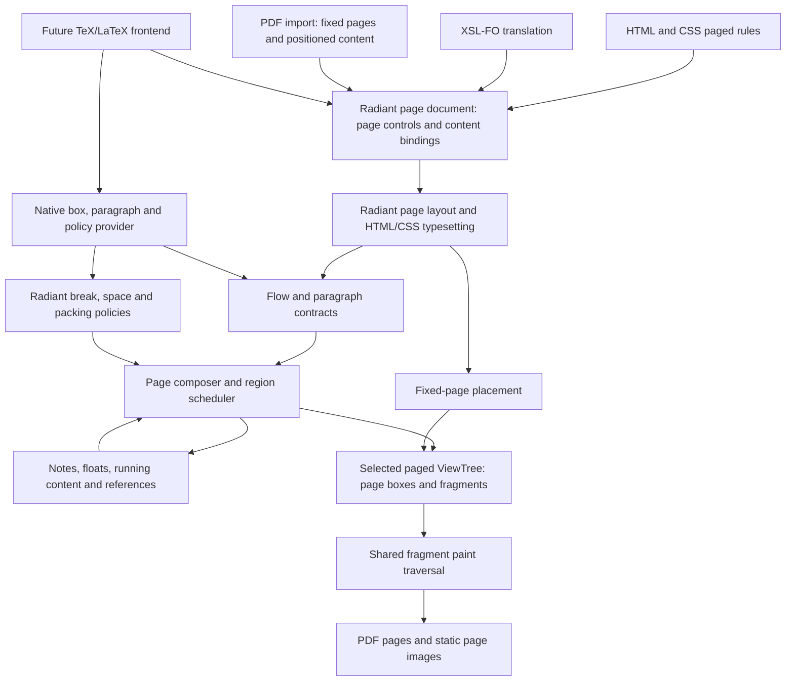

# Radiant Layout: Multiple Views, Paged Media and Publishing Typesetting

**Status:** implementation in progress; see [implementation record](../impl/Radiant_Impl_Paged_Media.md) for delivered behavior, evidence and remaining gates. Scope confirmed on 2026-10-05: advanced publishing in the initial delivery, future TeX/LaTeX extensibility, no interaction work, and A4 fallback. The DOM's embedded view remains the default browsing view; each secondary paged tree has one root containing page boxes, with grids, filtering and book preview (§3.2). The 2026-10-08 extension adds native `view --paged` scrolling (§7). The 2026-10-09 user direction establishes **one Radiant page model for CSS paged media, PDF, XSL-FO and future TeX/LaTeX typesetting**: FO enriches the common model and translates to Radiant page elements plus HTML/CSS; TeX retains native material/policy contracts (§11). XSLT execution is excluded. Native page controls, FO translation and fixed-PDF integration are implemented for the profiles recorded below; the remaining report, producer and acceptance gates are open. A complete TeX frontend remains future work. Experimental HTML/Lambda PDF pagination is available through `render --paged`; unsupported formatting contexts are diagnosed.
**Date:** 2026-10-05; unified CSS/PDF/XSL-FO model revised 2026-10-09.
**Source audit:** original pre-implementation working tree at `f722d537f`; §1.1 describes that baseline, not the partially implemented working tree. Implementation changes are tracked separately below and in the implementation record.
**Scope:** generalized view ownership, a unified Radiant page vocabulary and typesetting model, advanced publishing composition, fixed PDF-page intake, proper PDF export, thumbnails and page previews. CSS paged media and translated FO use Radiant page controls with HTML/CSS flow content; imported PDF pages use fixed page controls with positioned content (§11). Preserve the DOM-backed default browsing view and independent secondary layouts. The core must admit future TeX/LaTeX typesetting without replacement; that frontend and its compatibility policies remain future work. Window scrolling and keyboard navigation are included; editing, source hit testing and document controls in secondary previews remain out of scope.
**Formal-spec linkage:** D4.5.1v4 and D4.1.4v5 govern ownership; D5.3.3 and D5.4.1 govern callback rooting and evaluator ownership; D7.1.1, D7.1.2v2, D7.1.4v2, D7.2.4, D7.5.2 and D7.5.3 govern layering, packaging and embedding. S2.6.6v2 / D2.6.12v2 cover the separate Lambda PDF byte-output destination, not CSS pagination. No current formal ruling defines Radiant page layout. Coordinate decisions remain governed by [RSC1, RSC6–RSC8, RSC11](Radiant_Scale.md).

This document defines architecture and delivery boundaries. It does not change a formal ruling, declare a new decision-ID series, or claim that the entire proposed CSS surface already works. Ratification follows [Doc_Convention](../../doc/Doc_Convention.md); implementation progress belongs in the linked `vibe/impl/` record.

## 1. Findings and recommendation

Radiant has useful foundations for pagination: print-media matching, block and inline layout, multicolumn fragmentation, text rectangles, generated content and counters, a shared vector render walk, and a PDF writer that already serializes multiple pages. The missing foundation is **multiple independent views of one DOM/CSS source**, with page composition inside each paged view.

The recommended design keeps one DOM-backed default browsing view and adds independently owned secondary view trees for alternate layouts. Each paged tree uses a shared page-composition core with explicit fragmentation contexts, source-independent contributions, replaceable paragraph/page policies, and page boxes whose fragment subtrees belong to that tree. CSS layout is its first producer. Future TeX/LaTeX typesetting should supply another producer and policy set while reusing page regions, insertions, deferred floats, running content, references, fragments and output. PDF export consumes a selected finalized view. Changing only the PDF writer or clipping a tall screen layout into equal rectangles cannot provide this contract.

The 2026-10-09 direction formalizes this as one **Radiant page document** with page controls and HTML/CSS content. CSS page rules normalize into that model; FO translates into it; PDF imports preserve fixed pages within it. FO's richer page and spacing concepts become common Radiant capabilities. Section 11 defines this unified model and the translation boundary. A separate FO formatter is superseded (Appendix S).

### 1.1 What the current code actually does

| Area | Verified implementation | Consequence for this proposal |
|---|---|---|
| Document layout | `layout_html_doc()` creates one `LayoutContext`, then the existing block/inline/flex/grid/table drivers mutate the DOM-backed views. The context has sizing, line, float, counter and scratch state, but no page continuation contract. | Introduce fragmentation constraints and continuations at layout boundaries. A PDF-only coordinate adjustment is insufficient. |
| DOM/view topology | `View` is an alias for `DomNode`; `ViewTree::root` points at a `View`. `ViewElement::first_placed_child()` follows DOM child/sibling links, and each source node has one parent and one geometry rectangle. | Generalize layout traversal to admit page boxes and multiple occurrences of a source view, while preserving its semantic DOM links. One source rectangle cannot describe a split view. |
| Default-view ownership | `DomDocument::view_tree` is singular. `DomElement` stores cascade output in `specified_style` and resolved view props; `DomText` stores text rectangles. `ViewTree::reset_retained()` and `destroy()` walk the DOM-backed root. | Reserve these embedded slots for the default browsing view. Secondary views need their own node/style state, geometry, generations and teardown; another root pointer alone is insufficient. |
| CSS environment | `CssEngine::context` contains mutable viewport/media/device settings; `css_condition_environment_key()` already includes several of them. | Share CSS rule inputs, but resolve styles in an explicit per-view environment. One global current CSS environment cannot serve coexisting views. |
| Print media | `CssEngine::context.print_media` participates in media matching and cache identity. `render_html_to_pdf()` enables it through the HTML export loader. | Reuse this path; print styling already exists independently of pagination. |
| Transformed documents | `render_document_transform_to_pdf()` uses the shared transform export session, whose initializer currently supplies `print_media = false`; its loader does not receive the HTML loader's print argument. | Unify presentation settings across HTML, script and document-transform entry points. Audit when their styles are attached, not just the final PDF call. |
| `@page` | `css_parser.cpp` recognizes `CSS_RULE_PAGE`, retaining a generic content string. Searches of the CSS engine and Radiant found no page-rule layout consumer. | Recognition is not a page cascade. Add typed rules, descriptors and margin-box rules. |
| Break properties | Modern and legacy property names are registered and resolve into the same `BlockProp` fields. The keyword table has `page`, but no entries for `always`, `avoid-page`, `avoid-column`, `recto` or `verso`. The resolver copies a keyword without legacy value normalization. | Fix validation and aliasing before sharing break policy; property registration alone does not establish compatibility. |
| Multicolumn layout | `ColumnGroup`, `ColumnFragment`, `FragmentedFlowCursor`, `MulticolFlowItem` and `LayoutFragmentBox` already exist. The main path lays out at column width, then distributes/projects content, with substantial special handling for nested blocks, lines, floats and spanners. | Reuse policy and measurement work selectively. The existing implementation is more capable than the early multicol proposal describes, but is not a general resumable paginator. |
| Break type handling | `multicol_forces_column_break()` treats `column`, `page`, `left` and `right` alike. `multicol_avoids_column_break()` recognizes only `avoid`. | A nested page/column context needs explicit break targets; copying this helper would preserve the wrong abstraction. |
| Fragment geometry | `LayoutFragmentBox` stores a rectangle and fragment/column/row indexes; text uses linked `TextRect`s. Neither is a complete page layout tree with source intervals and resumable state. | Extend the common fragment model without inventing a second DOM or assuming every fragment index denotes a page. |
| Export sizing | `render_export_session_begin_internal()` performs continuous layout, measures content bounds, adds 50 units, and can enlarge the output even when a viewport size was supplied. | Paged export requires an independent sizing policy. Page dimensions must not be enlarged to fit total document height. |
| PDF rendering | `render_view_tree_to_pdf()` calls `HPDF_AddPage()` once and renders the root through `render_walk_block()` / `render_walk_children()`. Dimensions are content dimensions multiplied by `output_scale`. | Add a page-result consumer and page-local render lifecycle. |
| PDF units | At scale 1, content dimensions in CSS pixels are passed numerically to the PDF page-size API. | Add a named CSS-pixel-to-PDF-point conversion for physical page output. Compatibility for existing canvas export is a separate choice. |
| PDF writer | `lib/pdf_writer.c` owns an array of pages and writes individual `/MediaBox` and `/Contents` entries, then `/Kids` and `/Count`. Tests already cover multiple pages. | Keep this writer. Pagination does not require a new PDF library. |
| Existing tests | Export parity includes print-media selection; PDF visual tests also exercise PDF import through the Lambda PDF package. | Keep these gates, and add tests specifically for newly generated paged documents. PDF import fidelity is not pagination coverage. |

Exact symbols and source locations are collected in Appendix A. Historical statements and suite counts in [Radiant_Layout_Multicol](Radiant_Layout_Multicol.md) are background, not current measurements.

### 1.2 Executed probe

A temporary HTML fixture specified `@page { size: 320px 480px; margin: 40px }`, a bottom page counter, three 120px sections, and both modern and legacy forced breaks before sections two and three. It also used a blue print-only 96px ruler, red in screen media.

```sh
./lambda.exe render temp/radiant_paged_media_audit/paging_probe.html \
  -o temp/radiant_paged_media_audit/paging_probe.pdf --no-log
pdfinfo temp/radiant_paged_media_audit/paging_probe.pdf
pdftoppm -scale-to 1000 -singlefile -png \
  temp/radiant_paged_media_audit/paging_probe.pdf \
  temp/radiant_paged_media_audit/paging_probe
```

Observed: **one page, 850 × 410 PDF points**, with all three sections contiguous, no requested page margin or footer, and a blue ruler. The raster was visually inspected. The intended paged result is three 240 × 360-point pages. The source explains the observed dimensions: the fallback width is 800, section content height is 360, and export adds 50 units to each measured extent.

Evidence is under `temp/radiant_paged_media_audit/`: HTML, PDF, PNG, `pdfinfo.txt`, logs and `binary.json`. These are local audit artifacts, not committed fixtures. The executable was **not rebuilt**; its SHA-256 is `56a2941a696a1dca74c4b1f96d9bb13e638fce17a938b008a5e93585aa6e96a7`. This probe characterizes that executable and corroborates the independently inspected source; it is not a fresh-build conformance result or performance measurement.

## 2. Intended capability and delivery boundary

The first delivery includes **advanced publishing**, not just ordinary report pagination. Footnotes, running content, deferred figures/tables, references and generated lists participate in the initial architecture and acceptance gate. Implementation still has dependency milestones, but completing a basic paginator does not complete the requested work.

| Capability | Required initial delivery | Future or separately scoped work |
|---|---|---|
| Multiple views | Preserve the DOM-backed default browser view; retain independent continuous/paged views sharing source DOM/CSS, with per-view style/layout state | Parallel layout scheduling and independent script realms are separate work |
| Snapshots and page previews | Alternate viewport/screen environments, static snapshots, a preview root with configurable grids, page-number/range filtering and a current left/right book spread; scaled finalized pages and derived thumbnails | Window scrolling and keyboard navigation added 2026-10-08; source interaction remains outside this proposal |
| Print presentation | `@media print`, print stylesheet links, an explicit environment per typesetting view | Secondary source interaction is outside this proposal |
| Page geometry | `@page` size, orientation through `size`, physical margins/longhands, border/padding/background, named and mixed-size pages | Press production: bleed, crop marks, imposition and device-specific printing |
| Page sequence | `:first`, `:left`, `:right`, `:blank`, recto/verso chapter starts, page counter styles/resets and page totals | Additional draft page-group selectors require an explicit support entry |
| Break controls | Modern and legacy breaks, page/column distinctions, avoidance, line minima and fragmented decoration | Exact TeX break-cost and packing policies |
| Running content | All 16 margin boxes, named strings, running elements, first/start/last page-occurrence selection and blank-page handling | TeX token-list marks and arbitrary output-routine execution |
| Notes | Footnote calls/markers, per-page regions, reservation with body rollback, long-note continuation; endnote flow as an alternative | Additional insertion classes via the same region/scheduler interfaces |
| Deferred material | Figure/table queues, allowed top/bottom/column/page regions, ordering, float-only pages and explicit flush boundaries | LaTeX-specific placement flags, document-class rules and float-package compatibility |
| References and generated lists | Target text/counters/page labels, TOC/list-of-figures entries and leaders, convergence when generated text changes layout | BibTeX/Biber execution, citation style engines and general indexing-language support |
| Main and complex flow | Paragraphs/lists, nested blocks, images/math, repeated table groups and cell continuations, nested columns and defined flex/grid fragmentation | Full orthogonal/vertical coverage can extend the logical-axis contract; no blanket conformance claim |
| Typesetting contracts | Source-independent flow, measured boxes/baselines, flexible-space and penalty records, paragraph alternatives, policy hooks, checkpoints and finalization | A real TeX/LaTeX producer, Knuth–Plass/TeX policy implementation, macro/package/output-routine compatibility |
| Unified page model (scope revised 2026-10-09) | Radiant page elements for templates, sequences, regions, flows, repeated content and fixed pages; CSS paged rules and translated FO use the same HTML/CSS layout/typesetting path (§11) | Public element/property spellings remain proposed; additional typesetting policies extend the same model |
| XSL-FO translation | FO XML intake and refinement translate to Radiant page elements and HTML/CSS; FO enriches common Radiant semantics for spaces, keeps, marks and references | XSLT execution is excluded; full FO conformance and vendor extensions need separate support entries |
| PDF | Imported PDF pages retain fixed boundaries/geometry in the common page model; output emits one physical PDF page per committed page, with shared painting | General font-program/import fidelity, tagged PDF/PDF-A and navigation/annotation features remain separately gated |

The CSS-facing advanced surface follows selected features of [CSS Generated Content for Paged Media](https://www.w3.org/TR/css-gcpm-3/) and [CSS Page Floats](https://www.w3.org/TR/css-page-floats-3/), both work in progress. Record supported syntax and specification revisions explicitly. A shared insertion or float scheduler is an internal mechanism; it must not imply support for every draft property or translate a TeX command into CSS with different semantics.

TeX/LaTeX compatibility here means **architectural capability for a later typesetting frontend and policies**, not current macro-language conformance, package completeness, or identical pagination to an arbitrary TeX engine. Extensibility must be demonstrated by non-DOM contract fixtures in this delivery, rather than left as an untested future claim.

An illustrative author-facing target:

```css
@page {
  size: A4;
  margin: 20mm 18mm;
  @bottom-center { content: "Page " counter(page) " of " counter(pages); }
}
@page :first { @bottom-center { content: none; } }
@page :left { margin-left: 24mm; }
@page :right { margin-right: 24mm; }
@page wide { size: A4 landscape; }

.chapter { break-before: recto; }
h2 { break-after: avoid-page; }
p { widows: 3; orphans: 3; }
figure { break-inside: avoid-page; }
.wide-section { page: wide; }
```

Feature status should distinguish **parsed**, **resolved**, **laid out**, and **painted**. A parsed descriptor or recognized keyword must never count as completed end-to-end support.

## 3. Architecture

### 3.1 A presentation mode separate from output format

Introduce an explicit layout presentation (`continuous` or `paged`) and a CSS media environment (`screen` or `print`). PDF output alone is not a sufficient layout-mode selector; continuous print-styled PDF remains useful for diagrams and compatibility. PDF input carries existing fixed pages and is represented explicitly in the unified page document. Flow and fixed pages use the same selected-view, painting and output model. FO translation enters through Radiant page elements and HTML/CSS before layout (§11).



The batch typesetting session owns resolved options, the source provider, resources, layout passes, finalization and cleanup. For the CSS path, document scripts and resource readiness settle before composition; retries replay layout, not scripts. Use a fixed animation time and font/resource generation. A future stateful TeX producer may contribute additional material through an explicit resumable provider contract (§3.4), without making the composer execute a document frontend repeatedly.

Use a dedicated layout generation in the selected view tree. The default browsing view and several secondary layouts must remain valid side by side. Secondary style resolution, measurement and composition write only their own state; saving and restoring the default DOM's geometry or style slots is not the isolation mechanism. Initial scheduling may build views sequentially on the document's writer thread; simultaneous retained views do not require parallel layout threads. No new event lifecycle is part of this work.

Resource acquisition remains below Radiant under **D7.1.2v2**; output IO follows **D7.5.2**. The same paged layout code must run in both Radiant headless profiles under **D7.1.4v2**.

### 3.2 One DOM, a default browsing view, and multiple secondary view trees

The generalized structure is **one document and semantic DOM/CSS source, one default browsing view embedded in the DOM, and zero or more secondary `ViewTree`s**. Every tree has a stable identity, its own environment and layout generation. An A4 book, a Letter edition, a narrow-screen snapshot and a wide-screen snapshot can coexist. Within each paged tree, all its pages belong to that tree; changing one edition's page breaks does not change another edition or the browsing view. There is still one source `html` and one source `body`.

The unified page document extends this source with Radiant page controls (§11.2). For FO input, translation creates a real Radiant source document containing page elements and HTML/CSS content; original FO identities remain in a provenance map. This is source construction, independent of layout and page count. Each document can own several secondary editions without first materializing a browsing layout. CSS normalization attaches page controls without reparenting the authored DOM. Fixed PDF-page controls reference positioned page content in the same source/view ownership model.

```text
Document: one DOM + authored CSS / parsed stylesheets + source resources
├── Default ViewTree
│   └── DOM-backed views: current window viewport and screen environment
├── A4 ViewTree
│   └── PagedRootBox → configurable page arrangement on one canvas
│       ├── PageBox 1 → body fragment → paragraph P, first part
│       └── PageBox 2 → body fragment → paragraph P, remainder
├── Letter ViewTree
│   └── PagedRootBox → its own page boxes and occurrences of source P
├── Narrow-screen ViewTree → continuous layout at an emulated viewport
├── Wide-screen ViewTree   → continuous layout at another viewport
└── Thumbnail ViewTree    → PagedRootBox → scaled finalized page instances
```

**Preserve the default DOM-backed view.** The existing embedded `DomNode::{x,y,width,height}`, resolved property slots, `DomText::rect`, fragment lists and layout flags describe only the default browsing view. Its environment follows the current window's logical viewport and screen/device settings. Window resize or a screen change updates that view through the existing browsing layout path. It does not overwrite a fixed-size export/emulation environment. In headless use the default handle may exist without materializing a window layout; creating a paged view must not require a preliminary browser layout.

**Secondary views own all of their derived state.** They use layout-only nodes referencing source identities, including for continuous layout and unsplit boxes. A secondary tree has its own style table, resolved properties, used metrics, text lines, anonymous/generated boxes, geometry, fragment links, caches and pagination state. Reusing the source DOM does not mean borrowing the default view's mutable `font`, `blk`, `bound`, `specified_style`, custom-property results or text rectangles. Source `display: none` in one view can coexist with visible occurrences in another; there is no required one-to-one node correspondence.

Each paged tree has one explicit `PagedRootBox`, containing the ordered `PageBox` children. The root arranges pages on a continuous two-dimensional preview canvas; it is not limited to a vertical strip. Each paged occurrence has one layout parent beneath a page's region hierarchy. Regions can contain columns, notes, floats and margin content. Ancestor fragments preserve containing-block, decoration and paint context. A blank page still has a page box. Source DOM links retain their semantic meaning for selectors and inheritance; they are never reparented under a page box. `typedef DomNode View` can remain a compatibility name for the default view, but the generalized view API cannot assume it describes every view node.

Use a storage-kind-aware `ViewTree`/layout-node handle: the default adapter accesses embedded DOM view storage, while a secondary adapter accesses view-owned state and occurrences. Shared style/layout/paint algorithms receive the selected view context explicitly. Do not cast a page/fragment node to `DomNode*`, swap `doc->view_tree` to a temporary tree, or introduce an ambient global current view. A source pointer alone is not a sufficient geometry or resolved-style key. Calls that intentionally preserve today's default behavior can use a named default-view adapter.

The following names describe internal contracts, not a finalized public ABI:

| Record | Required information |
|---|---|
| `DocumentViews` | Designated default handle plus separately owned secondary trees; enumeration/lookup by `ViewTreeId`; one owner per tree |
| `ViewEnvironment` | Continuous/paged presentation, media type, logical viewport/page environment, device/emulated-screen metrics, CSS preferences, font/resource generation and sampled time |
| `ViewTree` | Identity, source epoch, storage kind, environment, root, per-source state, local caches/arenas, committed layout generation and optional arrangement generation; continuous, paged or derived presentation |
| `ViewNodeState` | One selected view's cascade/resolved properties and layout state for a source; style-only state can exist without a box; occurrence index may have zero, one or many entries |
| `RenderTarget` | Selected tree/layout generation and, for previews, arrangement generation; explicit export-page selection when requested, output format/surface and raster density; preview selection comes from the root, and output settings do not replace the view environment |
| `PagedLayoutOptions` | Producer/policy selection, fallback sheet, explicit overrides and diagnostics, associated with one paged view |
| `RadiantPageDocument` | Canonical page controls and HTML/CSS or native-material bindings; flowing sequences and fixed-page entries, source provenance and shared resources (§11) |
| `SourceRef` | Provider ID, stable source ID/range and generation; optional DOM mapping owned by the CSS adapter |
| `FlowContribution` | Measured box/paragraph/context, space, break constraint, insertion, float, mark or reference anchor; lazy subflow where appropriate |
| `PageStyle` / `PageTemplate` | Radiant-resolved page and region traits; CSS page cascade and translated page elements normalize into the same geometry/policy contract |
| `PagedRootBox` | Single layout-only root containing ordered pages or derived page instances; page selection, visible-placement index, arrangement/book-spread state, canvas bounds, background/padding and presentation generation |
| `PageArrangement` / `PagePlacement` | Row/column/grid/book mode, grouping/fill direction, gaps, alignment, preview fit/scale policy and per-child transforms; independent of typesetting geometry |
| `PageSelection` | All pages or normalized physical page numbers and inclusive ranges, resolved against a particular composed-page generation; preserves original identities/order |
| `BookSpread` / `BookPreviewState` | Original-sequence spread identity and left/right page handles or presentation-only empty slots; binding/first-side policy and the current eligible spread |
| `PageBox` | Committed flow or fixed page beneath the root; physical index, sequence/folio/side/blank metadata, page-local regions, template or imported-box metadata and fragment children; sheet dimensions exclude preview gaps |
| `Fragmentainer` | Page or column kind, logical available extent, parent context, local origin and stable identity |
| `LayoutFragment` | View occurrence in one secondary tree; `SourceRef`, view-style handle, optional fragmentainer identity, layout links, local geometry, baseline/glyph or paint payload, source interval and continuation/decoration/repetition roles |
| `BreakToken` | Producer cursor, open-context continuation, selected paragraph alternative and page-composition checkpoint |
| `PageCompositionState` | Region reservations, insertion/float queues, running marks, logical counters, reference bindings and policy state |
| `PagedLayoutResult` | Handle to one finalized paged tree/generation, its page/source/anchor indexes, reference map and diagnostics; does not replace the default view or own duplicate fragment geometry |
| `PageInstance` | Derived child node referencing a retained finalized page generation, with a placement supplied by its root's arrangement; no independent source reflow or duplicate transform authority |

Use `float` for all layout dimensions and positions (RSC1). Integers describe indexes, counts and source offsets only. Existing `lib` containers and ownership annotations should be used; these names describe contracts, not a request for an STL-based framework.

`LayoutFragmentBox` can become a compatibility projection of richer fragments, or be extended after auditing its geometry consumers. There is one authoritative fragment set **per view generation**, not one set per document. Page/source indexes point at that view's occurrences, and every retained fragment/page handle includes tree and generation identity. A page index of 2 in the A4 tree is unrelated to page 2 in the Letter tree. Reusing `column_index` or inferring a page from a global Y coordinate would fail for nested columns and mixed page heights.

Source markup and explicit labels are shared, but CSS counters, generated content, running marks, page labels and target-page bindings are evaluated within each view. Repeated headers and fixed content have explicit repetition roles so each view can check ordinary-content coverage independently. The core must still accept non-DOM producers: a future TeX producer supplies source identities and paint payloads to the same secondary view model, without fabricating HTML elements.

#### 3.2.1 Where multiple rectangles live

**The built-in `DomNode::{x,y,width,height}` rectangle belongs exclusively to the default browsing view.** It cannot also represent a paragraph in another viewport or split across pages. Each secondary tree has a per-source `ViewNodeState` and independently placed `LayoutFragment` occurrences. Even a source producing only one secondary box gets an occurrence record. The source node may therefore have one embedded browser rectangle, two occurrences in the A4 tree, and three in the Letter tree, all valid at the same time.

There is already a partial precedent in the implementation: `DomElementExt::layout_fragments` points to a list of `LayoutFragmentBox` rectangles, and `DomText::rect` points to `TextRect` records with text ranges. These fields remain the default view's storage. The generalized accessor takes a tree: it can read these fields for the default view, or secondary-owned records for another view. Evolve the record contracts without repointing the DOM fields at whichever view was last laid out. `TextRect`-like line/run data in a secondary view belongs to the appropriate committed occurrence, rather than one document-wide list replayed for every page or tree.

The conceptual fields below describe the storage split, not a finalized C++ declaration. IDs are generation-checked handles into `ViewTree`-owned storage under **D4.5.1v4**; coordinates are `float` CSS pixels under RSC1.

```text
Source node P: the one existing DomElement for <p>
    semantic parent/children, content and authored style inputs
    built-in rectangle and resolved props: default browsing view only

A4 ViewNodeState for P:
    this view's resolved styles and layout state
    occurrence index: [F1, F2]

LayoutFragment F1:
    source = P
    view / style = A4 tree / its ViewNodeState for P
    parent = body fragment on page 1
    page / fragmentainer = page 1 / its content region
    border_box = { x, y, width, height } relative to layout parent
    children = line/text/inline occurrences for the first part
    continuation_role = first

LayoutFragment F2:
    source = P
    view / style = A4 tree / its ViewNodeState for P
    parent = body fragment on page 2
    page / fragmentainer = page 2 / its content region
    border_box = { x, y, width, height } relative to layout parent
    children = line/text/inline occurrences for the remainder
    continuation_role = last

Source-to-fragment lookup: (A4 tree, generation, P) → [F1, F2]
Letter tree and emulated-screen tree have their own state and occurrences.
```

For example, if a six-line paragraph breaks after line 4, F1 contains line occurrences 1–4 and F2 contains 5–6. Both refer to P for source identity. Their child text occurrences refer to the original text nodes and carry the exact source ranges and selected glyph runs to paint. A paragraph with nested spans needs ranges across those child sources, not a fictitious flat string offset on the paragraph element. Source ranges use the provider's declared offset unit; shaped glyph/cluster ranges are recorded separately. If page 2 has a different width, the remaining material may form different lines; the continuation cannot be represented by translating the same six-line rectangle.

Each fragment additionally carries or references its own used box metrics, content box/overflow, clip and transform context, first/middle/last and repetition roles, and decoration edges. Its computed styles come from the selected view's style state; used values depending on fragment geometry belong to the occurrence. In particular, do not mutate P's default-view props or the A4 view's shared style to hide the bottom border on F1 and restore it on F2. `box-decoration-break` and background continuity are resolved from the fragment's role and geometry.

Within a view, the layout tree and source index refer to the **same records**. Layout child/sibling links establish the tree; a per-source index or occurrence chain provides reverse lookup and does not establish another ownership hierarchy. Text occurrences participate through the same provider/source index, so the design does not depend on every source having a `DomElementExt`. Anonymous page/region boxes can have no element source. Each occurrence belongs to one view generation; safely retained immutable inputs/resources can be shared across views.

The built-in DOM rectangle is **not** the first page's rectangle, a cross-page union, or a slot overwritten as each page paints. Page-local rectangles have different origins and may have different widths; a cross-page union requires the explicit `PagedRootBox` placement transforms (§3.2.5). Such a union is preview-canvas geometry, not a source element's layout rectangle. Any diagnostic needing one extent must identify the view and coordinate space. Tree/generation checks at geometry adapters reject accidental reads from another view. Secondary measurement must use its own state throughout; temporarily replacing and restoring default-view values would break nested rendering and cannot satisfy retained-view isolation.

#### 3.2.2 Layout and paint changes required by this storage model

1. The CSS layout adapter resolves shared source CSS in the selected view environment, measures using that view's state, and produces trial occurrence geometry. Its break token identifies the remaining child/text/line state within that view/generation. On commitment, fragments join the selected view's continuous root or page/region hierarchy.
2. Every further page receives new occurrences for continuing boxes, preserving the same source IDs. A source-to-fragment index is built from committed occurrences. Trials and repeated headers must not repeat semantic counter or note-number allocation.
3. A secondary walker traverses layout links and passes an explicit view/occurrence to painters. Its paint input combines source identity with that view's resolved style and the occurrence's rectangle, used metrics, child list, text slice and decoration flags. It must not fetch geometry, props or rendered children implicitly from the source DOM's default-view slots.
4. Extract the existing algorithms' source/style and geometry access at shared boundaries. The default adapter supplies embedded view state; the secondary adapter supplies its node state and occurrences for both continuous and paged layout. Temporary DOM rewrites or copying a `DomElement` into a fake view are not a compatibility strategy. Sharing algorithms does not require relocating the default view out of the DOM.
5. Render each `PageBox` subtree into its PDF page using that page's origin and clip. The source node is read-only during painting; the renderer never switches its rectangle to make a page appear correct.

This preserves DOM/view identity as the **default browsing storage optimization**, while generalizing the document to multiple rendered hierarchies. Every secondary view has its own geometry and layout links; every paged edition has its own complete page sequence. The required change is in state access and ownership throughout CSS resolution, layout and paint, not merely PDF serialization.

#### 3.2.3 Shared CSS inputs, view-specific resolution

"Share the DOM and CSS" means sharing authored style attributes, parsed stylesheets, declarations, selectors, rule order and source resources. It does not require identical cascade results. Media conditions select rules using the rendering environment; computed and used values are distinct stages of value processing. See [Media Queries §2](https://www.w3.org/TR/mediaqueries-4/#media) and [CSS Cascade §4](https://www.w3.org/TR/css-cascade-5/#value-stages).

| State | Sharing/ownership rule |
|---|---|
| Semantic DOM, attributes/text, authored inline CSS, stylesheet source/rules | One document-owned source, versioned when changed |
| Selector/rule indexes and parsed value syntax | Share immutable data; cache matches only with the source/state dependencies in the key |
| Media matching, cascade winners, inherited/custom-property results, resolved props | Per-view state; inherit through semantic DOM parents using that same view's style table |
| Pseudo/generated content, counters, container-query results where supported | Per-view derived state; layout differences can change generated boxes and style results |
| Used dimensions, line breaking, intrinsic/measurement caches, fragments and page bindings | Per-view by default; share a cached value only when all inputs match |
| Immutable font/image/vector assets and shaping results | Share with explicit lifetime and complete input keys; font selection, image candidate selection and raster surfaces may differ by view |

The existing `DomElement::specified_style` is cascade output, despite its name; it is not a universal immutable copy of authored CSS. Its resolved props, `css_variables`, style flags and style-version bookkeeping must be audited as default-view state. Secondary cascade output goes to `ViewNodeState`, including state for ancestors that have no visible box. Never seed a print view only from rules that survived the browsing view's screen-media filtering; preserve and evaluate the original shared rule inputs.

Split `CssEngine`'s reusable rule/parse facilities from mutable resolution context, or provide a lightweight per-view resolver borrowing those inputs. Thread the selected `ViewEnvironment` and style destination through resolution; do not toggle the default engine's `print_media`, viewport or device settings around an export. Any shared condition cache must include every supported environment dependency; the existing environment-key helper is a starting point, not proof that all future dimensions are covered. Resolved style objects may be interned across views only when values/dependencies and lifetime match, with immutable storage that survives either tree's independent destruction.

#### 3.2.4 Window/display emulation and thumbnails

The default environment reflects the actual window viewport in CSS logical pixels and the current screen/device metrics. Screen resolution/device scale and logical viewport dimensions are distinct (RSC1, RSC6–RSC8): rendering the same CSS viewport at a higher raster density does not inherently make it a wider layout. Supported resolution media queries and responsive asset selection may respond to a changed device environment. An emulated view supplies its own explicit viewport, screen/device metrics, media/preferences and sampled time without overwriting `UiContext`, `DomDocument::viewport` or the default CSS context.

The API separates **layout environment** from **render target**. Changing paper size or logical viewport creates/rebuilds that view's layout. Changing only an output image's density or a page's thumbnail placement uses the finalized layout. To get a truly responsive narrow layout, request a narrow-screen view; scaling a wide-screen image does not supply one. Snapshot APIs select a tree/generation and record its environment, source/resource epochs, page selection and output settings for reproducibility.

A PDF-style thumbnail can use either a direct render of a selected finalized page at reduced output scale, or a separate derived `Thumbnail ViewTree` whose `PagedRootBox` arranges `PageInstance` children. Each instance references an immutable page generation or retained page display list. It uses the same arrangement contract as full-size page preview (§3.2.5), retaining the original page breaks, page labels and glyph placement. It does not run print CSS against the thumbnail's small width. References retain the page/resource generation explicitly; they do not borrow another tree's rewindable scratch or mutable default view. Changing thumbnail size invalidates presentation/raster caches only. Changing its source paged edition invalidates/rebinds the instances as a unit.

The direct-render path is implemented by `render_secondary_page_snapshot()` and independent bounded `RenderPageSnapshotCache` instances. Their keys retain page identity, layout/source/resource generations and output settings; preview arrangement changes leave physical-page entries valid. A cache owns only raster copies, with no borrowed source-view arenas or font handles between calls, following **D4.5.1v4** and **D4.1.4v5**. Callers retain a live tree for each render request, while cached pixels can survive its destruction. The derived-root path is now `view_tree_page_instances_create(source, selection, options, status)`. It creates independently owned instance nodes and placements over every physical page of the source edition; filtering changes placements only. Each instance carries a generation-checked material-page reference. A counted `ViewPageGeneration` retains the original fragment/glyph/style storage, with no second owning parent or copy of the fragment tree. Derived-from-derived views normalize to the same material generation. Raster, SVG and PDF share the material-page resolver, and physical snapshot caches can reuse the same material identity across different roots. A source reset creates a fresh generation in its stable active shell while retaining the old ownership bundle in a reserved retired shell; source release leaves that bundle alive until the final instance lease ends. Retired owners reject reset/destruction while leased. Failed reset allocation preserves the old committed edition. Instance reset releases its lease and can become an independent reflowed view. Document cleanup releases registered roots and retired generations. All of these lifetimes remain subordinate to the shared document under **D4.5.1v4** and **D4.1.4v5**; a DOM mutation invalidates old source epochs even when their storage remains retained.

Static emulation uses one settled DOM and a declared state/time snapshot. It does not rerun document scripts as different devices or create several independent browser realms; scripts that would author different DOM content require separate document executions outside this layout proposal. Existing default browsing behavior remains intact. Secondary source interaction remains out of scope; preview scrolling consumes window input without DOM hit testing (§7).

Resource admission belongs to the document execution that supplies that shared source. The working implementation carries `InputResourcePolicy` through `DomDocument`, loader host configuration and its script `Runtime`. Default documents admit network dependencies; `layout --block-remote-resources` and `render --paged --block-remote-resources` select local dependencies for capture/export. Local paths, embedded data and inline scripts remain usable. The explicitly requested top-level source is separate from its dependencies. Admission must run before source, namespace, image or ready-resource cache reuse; a warm shared cache cannot expand a document's admitted dependency set. Child and generated wrapper documents must retain that selection before their own discovery or script execution. The neutral predicate is supplied by Lambda IO under **D7.1.2v2**; runtime/full/null-backend hosts share the same engine contract under **D7.1.4v2**. Per-view derived assets and layout generations retain the ownership rules of **D4.5.1v4** and **D4.1.4v5**. The audited child/wrapper paths and warm CommonJS/ES-module registries have focused native/HTTP regressions in the implementation record; final aggregate, release and platform gates remain open. The atomic `` adapter now uses the shared loader with a selected-generation image cache. Those assets survive through retained page-instance leases under D4.5.1v4 and D4.1.4v5. Admission precedes cache reuse; local, data and admitted remote images have identical ownership. Shared responsive source selection and density-corrected image sizing are implemented; rendered lazy auto-sizing, animation, alternative-image producers and richer backgrounds remain required.

#### 3.2.5 One preview root with configurable page arrangements

The page-preview root is a real layout box. It contains and positions the page boxes so a selected view renders as **one continuous screen canvas containing distinct physical pages**. The canvas can extend in either axis. Layout inside a page is completed by the paginator; layout of the pages themselves is performed by the root's arrangement pass. These are separate operations.

```text
PagedRootBox                         Example placement: 2 rows × 2 columns
├── PageBox 1                        ┌─────────┐  ┌─────────┐
├── PageBox 2                        │ Page 1  │  │ Page 2  │
├── PageBox 3                        └─────────┘  └─────────┘
└── PageBox 4                        ┌─────────┐  ┌─────────┐
                                    │ Page 3  │  │ Page 4  │
                                    └─────────┘  └─────────┘
```

The arrangement contract supports a vertical column, horizontal row, fixed-column wrapping grid, and bounded `rows × columns` groups such as 1×1 or 2×2. Here the first dimension denotes rows. A 1×1 group places one page; a 2×2 group places up to four pages. Documents with more pages produce further groups, whose progression can be vertical or horizontal within the same root. An explicitly selected page range may also be arranged on its own. There is no four-page document limit and no requirement that all preview modes become one long column. Incomplete final groups leave unoccupied cells; those cells do not create blank source/PDF pages.

`PageArrangement` declares the column/row counts or wrapping constraints, group progression, row-major/column-major fill and direction, root padding, row/column/group gaps, page alignment, and a uniform preview scale or fit policy. Counts must be positive where specified, and geometry/scale finite and valid. The default fill follows the logical page sequence; placement never changes page IDs, labels, recto/verso classification or export order. Booklet imposition is outside this preview feature.

For mixed page sizes, derive track extents from the scaled sheet bounds and align each page within its cell. Root content bounds enclose the placed pages plus configured padding and any declared preview-decoration outsets. This determines the canvas extent for rendering or capture. Any viewport clipping is applied to that canvas; page backgrounds, borders and margins retain their physical page geometry. Root gaps/padding and optional paper shadows are preview settings, separate from authored `@page` margins and decorations.

Keep three coordinate spaces explicit (RSC1, RSC6–RSC8):

```text
page-local CSS point → root-canvas CSS point → target raster point
root_point   = page_origin + preview_scale * page_point
raster_point = raster_scale * (root_point - viewport_origin)
```

All content stays in page-local coordinates. A `PagePlacement` supplies the transform from a page into its root, rather than rewriting every descendant's rectangle. The page boundary clips page content according to its existing paint rules; root decorations are painted in the root's scope. The PDF exporter uses the page-local geometry and physical unit conversion directly, omitting preview placement, fit scale, gaps, shadows and root background. The entire preview canvas must not become one oversized PDF page.

The root is layout-only: its screen width does not become the containing block, CSS viewport, media-query environment or fragmentation height of the source content. A print-styled A4 edition previewed on screen remains that edition. Resizing the preview viewport can recompute placement/fit without recascading or repaginating it. Requesting another paper size or another source viewport is a separate view/layout operation. Positioned/fixed content belonging to a physical page continues to resolve in that page's context, not against the preview root.

Track presentation changes separately from the composed-page generation. A new grid/gap/fit setting produces a new root arrangement generation referencing the same finalized page content. Publish placement changes coherently so a retained render sees one complete arrangement. If two arrangements must remain visible simultaneously, create another derived view with `PageInstance` children; never give a physical `PageBox` two owning parents. Rendering may cull pages outside a target clip using root-space page bounds, but culling must not remove pages from the sequence or alter typesetting. This feature defines root geometry and painting only; input handling remains outside the proposal.

#### 3.2.6 Page filtering and two-page book preview

The root owns a complete composed page sequence and a separate **presentation selection**. Callers can show individual page numbers, inclusive ranges, or their union; for example, pages `1, 4, 8–12`. The selector uses one-based physical sequence numbers in the chosen paged view. These differ from printed page labels, which may be Roman numerals, reset at a chapter, or repeat. Labels remain visible as authored, but are not silently interpreted as physical selection indexes. Selection by printed label would need a separately named, ambiguity-aware API.

Represent selection structurally as `all` or a set of page numbers/ranges. Normalize by merging overlaps, removing duplicates and retaining original document order. Omitted selection means all pages; an explicit empty set means none. Reject nonintegral/nonpositive numbers, reversed ranges and endpoints outside the finalized page count with a diagnostic. Resolve the selector again after repagination; never reuse stale page handles or silently clamp a formerly valid range. These selection policies are implemented structurally and accepted by the experimental CLI as `--pages` / `--page-range` and the distinct `--export-pages` option; printed labels are never selection indexes.

Filtering runs **after composition and reference convergence**. It controls which pages receive preview placements and paint calls; it does not remove `PageBox` children, reflow source content, renumber pages, change `counter(pages)`, or recompute TOC targets against only visible pages. The root's visible-placement index references existing pages. Source-coverage validation still checks the complete composition, while preview validation checks the selected subset. Showing only page 10 is not permission to skip typesetting the content needed to determine page 10.

Ordinary row/column/grid arrangements pack the selected pages in sequence order and derive bounds from those placements. An empty selection paints only the configured root background, with no invented page; an offscreen target requiring positive output dimensions must obtain them explicitly. Snapshot metadata records the normalized selection and composed-page generation. Viewport culling is an additional paint optimization over selected placements, not another change to selection or page identity.

**Book preview is a facing-page arrangement with one current spread.** It has a left slot, a right slot, a spine gap, binding/first-side settings, and a current spread handle. At most two physical pages are painted at a time. A caller can select a spread directly or select a page and request the spread containing it. The initial current spread is the first eligible spread; if a changed filter removes the current spread entirely, select the first remaining eligible spread, or show the empty root if none remain. This is layout/presentation state for an API; it does not require new keyboard, pointer or navigation controls.

Proposed default for a left-bound book, where the first composed page is a right-hand page:

| Spread | Left slot | Right slot |
|---|---|---|
| Opening | empty presentation slot | page 1 |
| Next | page 2 | page 3 |
| Next | page 4 | page 5 |
| Final, for a six-page document | page 6 | empty presentation slot |

Construct spreads from the full ordered sequence and its resolved physical left/right metadata, before applying the filter. Do not infer page sides from printed counter labels. Support right binding and an explicit first-page side for sources without sidedness metadata; mirror visual slots as appropriate. Binding defaults must agree with the page environment's resolved side progression. A preview option must not silently override CSS-resolved left/right page styles; a conflicting side-progression request needs a compatible recomposed view. A two-column grid remains available for arbitrary pairing without book-side semantics.

Apply the filter to the original spread slots, then omit spreads with neither partner selected. If only one partner is selected, keep it on its original side and leave the other slot empty. For example, selecting pages `3–4` in the sequence above gives two eligible spreads: `[empty, 3]` and `[4, empty]`; book mode shows one of them at a time. It does not pair page 3 with page 4 or automatically reveal an unselected page. Book preview therefore preserves physical pairing, while grid mode can place the same selected pages beside each other.

An empty slot is presentation metadata, not a `PageBox`; it contributes no page count, `:blank` match or PDF output. A real blank page inserted by pagination remains a selectable physical page and keeps its existing side. Hidden-partner slots can retain that partner's sheet bounds without painting it; an absent opening/final partner uses the opposite page's slot size by default. Align facing pages at the spine with a common preview scale and explicit vertical alignment, preserving mixed sheet sizes. Root canvas/fit bounds describe only the current spread, rather than a strip of every spread in the document. The existing grid/group mode covers an overview of many spreads/pages when desired.

The root pipeline is `finalized pages → normalized selection → grid placements or eligible book spreads → current presentation → viewport culling → paint`. Changes to selection, current spread, binding-compatible placement or fit advance only the presentation generation. Independent roots can show different filters/spreads of the same finalized content. PDF export continues to enumerate physical pages independently of preview state; an explicitly requested export subset can reuse `PageSelection` normalization, but never inherits the current book spread or preview filter implicitly. Export subset selection likewise preserves original page content/labels and does not emit empty preview slots.

### 3.3 Ownership and publication

Follow **D4.5.1v4**: Radiant layout records are arena/pool-owned and are not GC objects. A document owns its default view and secondary view registry; each tree owns its derived state, property/cache storage and layout generations. The current owning `DomDocument::view_tree` can remain the default-view slot during migration, with a separate owning secondary registry and non-owning combined enumeration. Never give both the default slot and the registry ownership of the same tree. Views borrow the document; a session pins the document and selected generations while consuming results. Lambda callbacks and values still obey **D5.3.3** precise rooting and **D5.4.1** evaluator ownership; creating a view must not create an evaluator per view or page.

Each view gets independent layout/render scratch arenas, property storage, counter/generated-content state and display-list lifetime. Resetting or destroying a secondary tree must not walk the source DOM clearing default `ViewProp` slots. Retain the current DOM teardown visitor for the default adapter; use an owner-specific visitor for secondary state. Shared immutable assets must be owned outside individually resettable trees or explicitly retained, never borrowed from a sibling's property pool. This is especially important for the current canonical property arenas and text-rectangle free lists.

Use separate allocation lifetimes for speculative layout and committed output within each view. A failed trial rewinds only that view's scratch region. Tokens belong to the selected pagination generation, not a stack-local `LayoutContext` or rewound scope. Committing a pass replaces that tree's committed root/indexes; sibling trees and the DOM-backed default remain valid. Release a previous generation only after its consumers, including thumbnails, finish. This uses **D4.1.4v5** batch/region lifetime and single-writer/multiple-reader rules, not individual arena frees or uncontrolled concurrent mutation.

Identity and invalidation are explicit:

- A source handle identifies the document/source generation and node; a layout handle also identifies the `ViewTreeId` and its generation. Equal node/page indexes in different trees cannot alias.
- DOM or authored-CSS mutations invalidate every dependent tree; font/resource changes invalidate affected views. Recomputing default-view styles is derived work and must not itself masquerade as an authored source mutation.
- A window resize updates the default environment; changing an emulated viewport or paper size updates only the selected secondary view. Output-density-only changes invalidate the corresponding raster output, unless the caller explicitly changes the CSS device environment too.
- A preview filter, current book spread, grid, gap, page-placement or fit change updates the root's presentation generation and dependent raster caches while retaining composed page content. A derived view retains the page generation and its own arrangement generation independently.
- Initial batch layout/render reads one fixed source epoch and publishes only against that epoch. An outdated tree is rejected or explicitly refreshed before use, not silently mixed with current source content. Keeping an older snapshot renderable requires retained immutable paint payloads/resources; a source pointer and generation number alone do not freeze a mutable DOM.
- View computations may initially run sequentially. Keeping several committed views resident is required; parallel layout is a separate scheduling optimization after mutable resolver/font/cache ownership is audited.

Provide explicit internal entry points for default-view lookup, secondary creation, layout, rendering and release. Conceptually, `view_tree_default(doc)` accesses the DOM-backed view; `view_tree_create(doc, environment)` creates an independent view; `view_node_state(tree, source)` selects that view's styles/layout data; layout/render operations accept a tree handle and validate source/generation state. Page exports take `PagedLayoutResult(tree_id, generation)`. No export or snapshot silently changes which view is the default.

The export session can adopt a selected existing tree or create an owned secondary tree. Reference-resolution passes initially repaginate that complete view; prefix reuse is an optimization. A pass is provisional until its references and composition state are stable. Separate A4/Letter target-page maps and generated TOCs remain view-owned, even though they refer to the same source anchors.

### 3.4 Contracts that preserve future TeX/LaTeX extensibility

The core shares **composition mechanisms**, while producers retain their formatting semantics. A CSS producer uses existing formatting contexts and cascade results; a later TeX producer can supply expanded box/list material, paragraph parameters and page policy without round-tripping through HTML. Do not flatten flex/grid/table semantics into an impoverished linear list: a contribution may expose a lazy nested formatting context with its own continuation.

FO follows the translation route in §11: its content uses Radiant's HTML/CSS formatting contexts and its enriched page semantics are common Radiant page controls. The non-DOM contracts here remain for synthetic coverage and future TeX material; they are not a separate FO runtime path.

| Contract | Required capability now | Future TeX/LaTeX use |
|---|---|---|
| Flow provider | Stable identities, ordered/lazy contributions, checkpoint/restore and source diagnostics | Expanded horizontal/vertical material without mandatory `DomElement`s |
| Box metrics | Advance, ascent/height, depth, baseline, logical bounds and separate ink overflow; glyph positions and font identity | Horizontal/vertical boxes, kerns, rules, math boxes and exact baseline relationships |
| Flexible space | Natural size, separate stretch/shrink capacities and ordered flexibility classes; no numeric infinity sentinel | Finite glue and `fil`/`fill`/`filll` packing without converting it to CSS margins |
| Break policy | Legality separate from cost; forced/forbidden tags, finite penalty, reason and continuation | TeX penalties/badness and context-specific break choice, without weakening CSS hard constraints |
| Paragraph provider | Shape/measure independently of page commitment; return line sequences/alternatives for a width profile and resume state | Knuth–Plass paragraph optimization, discretionary pre/post/no-break material, hyphenation and fitness/looseness policies |
| Page policy | Select candidates, pack regions, interpret boundary discard/retain rules and carry policy-owned continuation | TeX page-builder decisions, top/baseline glue and vertical packing |
| Composition services | Typed regions, insertion splits, deferred floats, mark snapshots and target-page bindings | TeX insertions/marks and LaTeX document-class/float scheduling adapters |
| Page assembly/finalization | Assemble a page, hold/reinsert contributions or emit finalized page boxes; queue side effects until commitment | A future output-routine adapter with explicit state and shipout ownership |

These are internal C+ contracts, not a new public plugin ABI. CSS may return one paragraph solution initially; a test provider must already be able to return several and drive a different selection policy. Ordered stretch classes and signed penalties must be representable and exercised now, even though TeX-specific algorithms are deferred. Do not share one unconditional greedy algorithm between all producers or encode CSS `avoid` as a conveniently large TeX-style penalty.

The architectural reference is Knuth's [TeX source](https://raw.githubusercontent.com/TeX-Live/texlive-source/trunk/texk/web2c/tex.web), particularly `line_break`, `build_page`, insertion/mark nodes and output processing. Paragraph optimization and page building are distinct operations; compatibility does not require inventing a globally optimal whole-book algorithm. LaTeX float policy is also distinct from both ordinary CSS floats and TeX insertion storage.

A future stateful frontend must not be speculatively re-executed. Its adapter should checkpoint or journal expansion/output state and supply replayable contributions; irreversible effects occur once after commitment. Page-assembly hooks can return `hold`, `reinsert`, or finalized boxes, with progress checks. They cannot mutate a published result or borrow trial scratch after return. Arbitrary TeX output-routine semantics remain future work, but the core must not assume every page selection immediately emits exactly one irreversible PDF page.

Retain a provider-owned native metric payload when exact arithmetic is needed. Radiant positions/dimensions remain `float` under RSC1; a future TeX adapter can keep scaled-point calculations in its own metrics/policy layer and export float paint geometry once. It must not reconstruct exact metrics by reading back rounded rectangles. Exact TeX numerical parity would require its own tolerance/conformance gate, not a claim based on this interface alone.

The native fragment boundary is `ViewNativeMaterial`: a `TypesetSource`, source interval, projected `TypesetMetrics` with its exact record, selected paragraph solution, and optional ordinary `PaintGlyphRun` / `PaintImageBox` descriptors. `view_tree_native_fragment_append()` copies those descriptors into the selected generation without requiring a content DOM mapping or CSS style. Native and DOM occurrences share one `ViewNodeState` index and one fragment chain: native keys contain provider, source generation and source node, while DOM keys use the document namespace. `view_tree_native_state()` resolves native occurrences, including repeated source intervals, without dereferencing a possibly transient query record; mismatched offset units are rejected. Nested checkpoints restore index entries and occurrence tails alongside geometry/leases, and retained previews resolve the producing generation after its view resets. An explicit immutable owner lease covers all borrowed exact/source records, glyph arrays, fonts and image resources. Retain failure rejects admission; invalid providers, offset overflow and nonfinite projected metrics fail before publication. Nested view checkpoints release rejected leases before arena rewind. Accepted leases move with retained page generations through source-view reset/release and end when the final generation consumer releases them, following **D4.5.1v4 / D4.1.4v5**. Ordinary fragment paint traversal consumes copied geometry; exact metrics are never reconstructed from it. The surrounding document can still own shared resources and editions without fabricating content elements.

`PagedNativeFlowBinding` attaches a replayable producer to a real, otherwise empty `r:flow` control. The selected page program supplies geometry and ordinary HTML/CSS furniture; native content stays source-neutral. Body boxes, paragraph alternatives, ordered vertical glue and explicit boundaries participate in the same whole-page candidate search, closure constraints, target-area attribution and retained generation. Complete paragraph solution counts have an explicit producer bound independent of item count. Native checkpoints preserve canonical resume tokens, source intervals, exact metric/solution records and provider state across width changes, rejected pages and convergence passes. A selectable `TypesetPagePolicy` supplies candidate choice and page packing; its checkpoint/restore callbacks journal provisional page effects with the edition. Native mark and declared-target events now enter common source-scoped publishing stores. Forward references retain separate compositor binding metadata while the target value remains the opaque producer record. Native marks retain their source namespace and support ordinary string values or opaque native values; DOM running-element payloads keep their existing adapter. Target placements and mark counts rewind with page journals, and retained queries follow the producing generation. Native insertion and float contributions now join the existing typed region queues. Selected slices enumerate ordinary native paint in region-local coordinates. A composite lease retains both the producer and measured plan scratch through rollback and retained preview/export; queue identity includes the producer namespace. Native target areas follow placed fragments, including note/float pages. `flush-deferred` waits for earlier queued regions and remains distinct from an ordinary page eject. The admitted profile covers page notes and top/bottom floats with existing split, delay and ordering controls. Journaled hold/reinsert transitions now retain a selected plan or replan its original immutable input without shipout. Stable policy checkpoints detect unchanged/repeated states, and an explicit transition budget bounds continuing policies. Rejected terminal-master/relaxation trials and reference passes rewind policy state with the existing edition journals. The combined synthetic session exercises paragraph alternatives, ordered glue, signed/forced/forbidden boundaries, marks, native targets, split-capable insertions, deferred-float flushing, held/reinserted plans, width changes and retained paint through one page/HTML/CSS session. Flow, queue-drained region, blank and fixed pages now reach the same assembly transition handler. Candidate metadata records physical page number and kind. Region reinsertion restores its selected queue input and remeasures; fixed reinsertion retains its immutable source geometry. All paths journal policy effects, preserve callback order and share one monotonic transition budget per composition pass. Native nested/column/margin producers remain required; aggregate/platform/performance qualification is tracked separately.

### 3.5 Present LaTeX path and the later adapter

The live source uses the direct parser in `lambda/input/input-latex-c.cpp`, then the shipped `lmd/package/latex/` analysis/rendering package for HTML output. `analyze.ls` collects headings, labels and footnotes; `latex.ls::render()` runs that analysis and dispatches rendering. Its `postprocess()` appends a footnote section, `render.ls` maps both `newpage` and `clearpage` to the same `<hr>` class, and `render_figure()` emits a figure element. These provide semantic inputs but do not implement a TeX page builder.

The later producer should branch before lossy HTML serialization: preserve note anchors/bodies, figure placement preferences, distinct break-versus-flush commands, reference targets, marks and paragraph/box parameters. Existing semantic analysis and `lmd/package/math/box.ls` width/height/depth metrics are reuse candidates, not evidence of complete TeX layout compatibility. Keep any language-facing adapter within **D7.5.3** and follow **D7.2.4** for new shipped document packages.

Historical documents such as [Latex_Pipeline_Design](../latex/Latex_Pipeline_Design.md) and [Latex_Typeset_Design2](../latex/Latex_Typeset_Design2.md) describe `lambda/tex/`, `TexNode` and DVI paths that are absent from this audited checkout. Their architecture is background, not an available implementation to revive or a prerequisite for this proposal. A fresh TeX implementation and compatibility scope should be designed against the contracts above when that future work starts.

## 4. CSS and page style resolution

Use the external standards as conformance targets, with their draft status recorded. [CSS Paged Media Level 3](https://www.w3.org/TR/css-page-3/) defines page contexts; [CSS Fragmentation Level 3](https://www.w3.org/TR/css-break-3/) defines break behavior. The proposal chooses an implementation structure and a bounded delivery schedule, not alternative CSS meanings.

The unified model in §11 retains these CSS semantics. Its additional page elements and typed style traits cover concepts learned from FO. Standard CSS uses its specified cascade and normalization rules; translated FO supplies explicit HTML/CSS declarations and Radiant extensions where required. Both resolve into common page/flow traits before composition.

### 4.1 Typed `@page` rules and a separate cascade

Replace generic-string consumption with a typed page-rule payload at CSS parse time. Retain selector components, declaration source positions, page descriptors and nested margin-box rules. Use the existing tokenizer, declaration parsing and cascade machinery wherever applicable. Page selectors are not DOM selectors: supply a page-specific matcher and specificity calculation instead of manufacturing a `DomElement` that accidentally matches normal rules.

Page rules must retain stylesheet origin, importance, layer/order and conditional ancestry as they pass through imports and conditional rules. Unknown declarations or nested at-rules should recover locally without swallowing a following ordinary rule. Descriptor validation must be context-specific: `size` inside a page rule is not an element width shorthand.

Page style resolution takes a page name, side, first/blank flags and the print environment. Cache by those inputs and the stylesheet generation. Page-context inheritance and margin-box inheritance need separate paths from normal element inheritance; see [CSS Paged Media §4–6](https://www.w3.org/TR/css-page-3/#page-selectors).

Keep page geometry, element percentage containing blocks, and media-query dimensions as distinct inputs. For the selected published specification, paper-dependent media queries use the default sheet environment and do not recursively follow a `size` they select; the first page area establishes the initial containing block. Pin the relevant tests to [§3](https://www.w3.org/TR/css-page-3/#page-model) and [§7.1](https://www.w3.org/TR/css-page-3/#page-size-prop). Do not recascade the entire document against each remaining-page height. The admitted horizontal normal-flow adapter now retains the first page-area height for root percentages and each definite ancestor content height for descendant percentages, including border-box subtraction and zero heights. Auto-height ancestry leaves source height percentages unresolved. Trial, continuation and auxiliary-paint replay preserve that distinction under **D4.5.1v4** and **D4.1.4v5**; positioned and nested formatting-context sizing remain required.

### 4.2 Resolve break aliases before layout

Normalize legacy declarations into the modern property slots with their original cascade rank. In particular, legacy `always` maps to `page`; applying aliases in a later resolver loop would make precedence depend on property enumeration. Add property-specific accepted-value tables and validation. Test importance, declaration order, shorthand reset behavior and CSS-wide keywords across the alias boundary. The compatibility mapping is specified in [CSS Fragmentation §3.4](https://www.w3.org/TR/css-break-3/#page-break-properties).

Represent forced targets and avoidance by fragmentation kind. The current column helper must stop treating a page request as an ordinary column advance. In a nested flow, a page request is propagated to its matching outer context; an ordinary column request remains local. Preserve the distinction between a physical page index, sidedness and a displayed page counter.

### 4.3 Page geometry and margin content

Compute the page box before laying out its content. Resolve page margins, borders and padding to a finite page-area rectangle, including percentage and `auto` cases from the selected standard. Keep body margins as ordinary document styles; never add them to the page margin option or suppress them implicitly.

Use shared paragraph/text services for margin boxes, with page-local generated-content context. Reserve page margins before body pagination. Margin-only page totals can resolve after body layout against fixed margin rectangles. Long labels may wrap or overflow according to their styles, but cannot silently enlarge the body area. Running-content selection and body-affecting references are part of the initial composition/convergence services in §5.8–5.9.

The page selector/counter test corpus must include blank inserted pages, suppressed first-page footers, counter resets, different left/right margins, and a named landscape section followed by ordinary pages. Margin geometry and margin-box generated content are separate milestones even though authors commonly use them together.

## 5. Fragmentation integrated with layout

### 5.1 The contract a formatting context should expose

Add a fragmentation input alongside available size: current fragmentainer, full and remaining logical block extent, break policy, and optional incoming token. A layout call returns committed fragments, consumed extent, completion status, outgoing token and the reason a break was selected.

The result must distinguish `complete`, `continue`, `needs-earlier-break` and `error`. A boolean success result cannot express both successful partial layout and an unplaceable object. Initially integrate this contract with block flow and paragraph layout. Share existing intrinsic sizing, line breaking, float avoidance and border-box calculations; avoid building a miniature second layout engine in `render_pdf.cpp`.

Break tokens should capture:

- The next child/source position plus the continuation chain of open ancestors.
- Inline resume state at a valid text/shaping boundary, including whitespace, bidi and inline ancestry; a UTF-8 byte offset alone is insufficient.
- Consumed block extent, pending margin state, first/last-fragment state, and whether an encountered forced break has already been consumed.
- Counter/generated-content checkpoints, insertion/float queues, region reservations, running marks, reference bindings and deferred out-of-flow anchors.
- Formatting-specific state such as a table row/cell cursor or nested column token.

A token should reference stable owned state rather than copy the complete mutable `LayoutContext`. Place resume points between committed units. `line_break()` currently performs alignment and other mutations, so inserting an overflow return after those mutations would require rollback of text rectangles, view links, counters and floats. Refactor commit/checkpoint boundaries first.

The current secondary composer has nested `PagedCheckpoint` transactions over the view model, frame continuations, region plans/queues and running state. Model journals restore touched surviving records and rewind new arena allocations; discarded view IDs remain unavailable until layout-generation reset, preserving D4.5.1v4 handle identity and D4.1.4v5 batch lifetime. Auxiliary plans retain their exact scratch payloads through explicit leases. Queue rollback advances the incarnation and revalidates only the saved plan. A whole-page HTML provider now emits replayable block-entry, line, extent and block-closure contributions to `typeset_page_plan()`. It retains legal candidates across sibling boundaries and jointly probes body/note/float reservations. Trial restoration reverses top-float translations and first-placement targets; selected-candidate replay commits under a fresh transaction. Stable continuations carry flow-step indices, paragraph item offsets and per-page line counts, never trial-arena pointers. Sibling keep chains, enclosing avoidance and line minima restrict candidate legality; forced boundaries override avoidance. Bounded fresh-page fallback records relaxed constraints, while impossible material preserves a producer diagnostic. `max_block_trials` is monotonic across rejected trials and replay, independent of physical page count. Complete multi-page note-policy scheduling remains required. Text lists now use this provider: ordinals and marker content settle in logical source order; inside markers consume inline width, and outside markers attach to the first content line as zero-advance contributions. Marker occurrences carry the source list item and selected-view pseudo style, appear only in the first continuation and roll back with that line under D4.5.1v4/D4.1.4v5. The shared counter walk accepts explicit view queries, including visibility and list-item display, so HTML reversed lists do not read default-view geometry. Images/custom counter styles, general reversed counter scopes and writing-mode marker placement remain open.

### 5.2 Break selection and progress

Collect candidate boundaries as layout proceeds; record source position, constraints, region capacities, forced targets, avoidance, line counts, cost and replay checkpoint. The CSS policy first honors applicable forced breaks and, for an unforced break, prefers a fitting legal candidate after accounting for notes/floats and keep constraints. A latest-fitting choice is one policy, not a core invariant. Relax CSS constraints only through the standard's fallback stages and record the stage. Alternative typesetting policies select among the same checkpoints without reinterpreting CSS rules. See [CSS Fragmentation §4](https://www.w3.org/TR/css-break-3/#breaking-rules).

The CSS paragraph provider may use line-group lookahead for widow/orphan constraints. The core must also accept whole-paragraph alternatives; it cannot cap every provider at that small lookahead. Do not permanently lay out an entire paragraph at the first page's width and slice its rectangles if the continuation page has another width. A paragraph provider receives the width profile or is explicitly asked to recompute alternatives at a changed boundary. Reuse immutable shaping where its inputs match.

Make termination explicit. Each retry must consume source content, consume a one-time break/parity transition, advance a formatting-specific continuation, or return a diagnostic. Track repeated token/constraint states and a configurable resource budget. A page-count cap by itself must not turn an infinite loop into a silently truncated successful PDF.

An atomic object that fits a fresh page can move there once. If it still cannot fit, return an oversized-content diagnostic. Proposed default for publishing export is failure rather than publishing an apparently complete document with missing content; an explicit tolerant export may place it once and report clipping. No automatic shrink-to-fit is implied. Breakable text, table cells and notes must use their continuation contracts instead of this atomic fallback.

### 5.3 Margins, decoration and variable page sizes

Boundary state must distinguish forced versus unforced breaks, collapsed margins and retained/discarded edges. This is necessary for [fragment margins and decorations](https://www.w3.org/TR/css-break-3/#break-margins), including `box-decoration-break: slice | clone`. Store which fragment owns each edge and the decoration/background origin used for that fragment; do not paint the union rectangle as one large border on every page.

Page geometry is requested from the page sequence when a continuation is needed. A differently sized page supplies new constraints to the unconsumed content. Preserve the initial-containing-block and percentage sizing rules separately; changing fragment width does not mean every specified percentage is reinterpreted against an arbitrary remaining-space rectangle.

A page-name transition needs lookahead to the next participating in-flow content and a checkpoint before committing its boundary. Forced breaks, named-page changes and sidedness must resolve together, so the engine does not insert duplicate blank pages. A final forced break should not mechanically create an extra empty trailing page. Empty-document behavior should be deterministic: proposed default is one empty page.

### 5.4 Formatting-context integration

| Context | Proposed integration and required limits |
|---|---|
| Blocks, paragraphs and lists | Make child and line continuation the first shared consumers. Preserve list/counter state across breaks; continuation fragments do not re-enter the source element and increment its counter again. |
| Tables | Reuse column measurement across equal-width pages. Support row boundaries and cell continuations for oversized rows and spanning cells; reserve repeated header/footer space. Repeated groups are occurrences of the same source. Captions, group fit, collapsed borders and row-group ordering need explicit cases; unsupported combinations fail visibly rather than truncating a table. |
| Flex | Reuse axis and line machinery, exposing flex-line/item continuations with tested supported combinations. Fitting containers can remain atomic where semantics permit; oversized flex content cannot be advertised as complete merely because it paints. Follow [Flexbox fragmentation](https://www.w3.org/TR/css-flexbox-1/#pagination), including column-direction behavior. |
| Grid | Keep track sizing and placement separate from row/item continuation. Repeatedly running grid placement on the remaining DOM would change auto-placement and spans. Follow [Grid fragmentation](https://www.w3.org/TR/css-grid-1/#pagination); row-spanning items need explicit state. |
| Multicolumn | Model a column sequence inside a page fragment. A page end resumes the column formatting context; it does not project already laid-out overflow columns onto later pages. Keep balancing and spanner grouping column-specific while sharing candidate selection and fragment emission. |
| Floats and out-of-flow boxes | Preserve parallel-flow and containing-block identity. Ordinary floats need deferred-placement state; fragmented floats require independent continuations. Absolute anchors reference a source fragment. Only fixed boxes whose containing block is the page repeat as page furniture; a transformed ancestor can change that relationship. |
| Replaced/embedded/custom content | Images, SVG, math and non-fragment-aware custom layouts can initially be atomic. A future custom-layout fragmentation capability must be explicit; never re-invoke a callback per page with changed semantics without a contract. Existing PDF-page imports keep their own source-page identities. |
| Overflow and transforms | Retain authored overflow clipping. Fragment selection uses layout geometry, while painting applies transforms; rotated paint bounds must not manufacture source breakpoints. Support for scrolling/monolithic cases must be declared. |

The working atomic-image adapter uses producer-owned immutable source items and a pure width-specific measurement callback. A changed page width regenerates percentage/ratio-constrained image metrics; independent fragment boxes retain each page-local result. Baseline-aware paragraphs combine the maximum ascent and descent with the parent strut. The default and paged paths share replaced facts/sizing, object-fit/object-position geometry and SVG subscene painting. A selected-generation asset cache is independent of mutable default-view embed slots, following D4.5.1v4 and D4.1.4v5; retained page instances keep the original assets alive. Image paint geometry rolls back and translates with body/note/float composition. SVG image paint remains vector in physical PDF; cold-start raster exports register the same shared backend. Before-item neutral boundaries now provide atomic wrapping without including an unconsumed image in the preceding line metrics. The CSS adapter uses the nearest common selected-style ancestor's wrapping mode, preserves source-only anchors and no-break controls, and admits the NBSP exception under [CSS Text 3 section 5.1](https://www.w3.org/TR/css-text-3/#line-breaking). No synthetic DOM nodes or empty image fragments are needed. Fractional SVG root-attribute axes and natural ratio availability are now retained separately from decoder extents. Shared default sizing and object fitting retain single-axis provenance, apply definite-axis ratio precedence over `viewBox`, and keep SVG viewport fitting internal. Default grid intrinsic-height queries preserve ratio-less fallback axes, and flex distinguishes loaded partial-axis images from broken sources before transferring definite dimensions. This follows [SVG 2 section 8.12](https://www.w3.org/TR/SVG2/coords.html#IntrinsicSizing) and [CSS Images 3 section 4.3.1](https://www.w3.org/TR/css-images-3/#default-sizing), with metadata retained by the existing asset owner under D4.5.1v4 and D4.1.4v5. This is a bounded producer: SVG stylesheet/view intrinsic overrides, rendered lazy auto-sizing, animated sampling, alternative content and effect groups remain open. The shared responsive selector now evaluates picture sources, media/type conditions, width/density candidates and CSS source sizes in the selected view environment, with density-corrected intrinsic facts and cache-admission checks; see the [implementation record](../impl/Radiant_Impl_Paged_Media.md#responsive-image-selection-and-encoded-target-urls). Native inline SVG, math and other embedded/custom producers are separate required integrations.

Table repetition and row splitting should be validated against [CSS Tables fragmentation](https://www.w3.org/TR/css-tables-3/#fragmentation), with the tested draft revision recorded. Repeating headers is not equivalent to duplicating the `<thead>` DOM subtree.

The table adapter now emits row boundaries and independent paragraph-cell continuations, including nested single-child block boxes with automatic heights and zero margins/spaces, caching tracks at each used page width and reserving repeated header/footer groups. Fixed layout uses the first visual row; automatic layout measures all admitted cells, including later body rows and repeated groups. Automatic or definite table widths, absolute cell width constraints, percentage tracks and horizontal auto margins share the default table driver's width distribution. Intrinsic text ranges use the paragraph producer's legal boundaries, preserving nowrap, explicit newlines and glue trimming. Automatic sizing follows the permitted algorithm model in [CSS 2.2 §17.5.2.2](https://www.w3.org/TR/CSS22/tables.html#auto-table-layout); complete CSS Tables 3 sizing conformance is not claimed. Occurrences and immutable measurements retain source identities and selected-generation ownership under **D4.5.1v4 / D4.1.4v5**. This admits rectangular grids with horizontal cell spans, cells aligned to the baseline, top, middle or bottom, separate borders and computed horizontal/vertical border spacing. Internal cell margins are ignored consistently in measurement and replay. Cell borders fill the row while content alignment uses its actual extent; split cells align each consumed slice with its visible decoration edges. Baseline cells share the first in-flow line baseline, with an empty-cell content-edge fallback; their ascent/descent constraints can increase row height. Inline continuations reserve alignment space before consuming independent cell lines, and completed cell cursors do not contribute another baseline. Spanning cells cover their tracks and internal gaps; automatic sizing applies shorter span constraints before longer ones while preserving single-column contributions. Cell continuation cursors count source cells independently of covered tracks. Spacing contributes to intrinsic widths, track allocation and each fragment's row/furniture reservations; row/group backgrounds leave cell gaps transparent. Body row-group forced breaks and before/after/inside keeps now participate in the shared page trials; fitting groups move together, oversized groups relax explicitly, and terminal breaks ignore collapsed trailing whitespace while retaining source records. Repeated-group forced breaks and group height distribution remain diagnosed. Cyclic descendant percentages and calculated cell percentage widths are diagnosed; collapsed borders, cross-page spanning-cell continuations, richer cell/group continuations and remaining intrinsic sizing cases are still required. The [fixed-layout record](../impl/Radiant_Impl_Paged_Media.md#fixed-layout-table-fragmentation-2026-10-08) records fragmentation validation against the 16 December 2025 CSS Tables 3 working draft; the [automatic sizing record](../impl/Radiant_Impl_Paged_Media.md#automatic-table-sizing-2026-10-08) and [border-spacing record](../impl/Radiant_Impl_Paged_Media.md#table-border-spacing-2026-10-08) record those increments; the [column-span record](../impl/Radiant_Impl_Paged_Media.md#table-column-spans-2026-10-08) records horizontal spans and their admission checks; the [row-group break record](../impl/Radiant_Impl_Paged_Media.md#table-row-group-break-controls-2026-10-08) records group keeps, forced boundaries and sidedness. The [cell-alignment record](../impl/Radiant_Impl_Paged_Media.md#table-cell-vertical-alignment-2026-10-08) records alignment, retained image geometry and explicit-padding export controls. The [baseline record](../impl/Radiant_Impl_Paged_Media.md#table-cell-baseline-alignment-2026-10-08) records shared row baselines, empty/image-only cells and baseline-aware slice fitting. P4 remains partial.

Explicit column and column-group sources now contribute CSS widths and flat background layers, with independent occurrences on each table fragment. HTML spans share the default table adapter's bounded normalization; child columns determine a populated group's span. Fixed tracks take column widths before first-visual-row cell widths. Automatic tracks use group widths for otherwise automatic child columns, within the existing permitted automatic algorithm. Width-dependent tracks remeasure on each sheet; column layers cover cells originating in their tracks, including horizontal spans, while separated-border gaps retain the table background. Row-group, row and cell layers paint above them. Paint uses retained grid indexes rather than comparing fractional pixel bounds. Occurrences, column styles and retained editions follow **D4.5.1v4 / D4.1.4v5**. Column collapse, zero-width fixed tracks, calculated intrinsic percentages, HTML width hints and column background images/gradients remain outside this increment. Surplus tracks now use the missing-cell completion described below. The [column-box record](../impl/Radiant_Impl_Paged_Media.md#table-columns-and-column-groups-2026-10-08) records browser sizing controls, continuation/ownership checks and explicit-cell PDF/preview comparisons. Column width and background behavior are checked against [CSS 2.2 §§17.3 and 17.5.1](https://www.w3.org/TR/CSS22/tables.html#columns); complete table conformance remains open.

Table captions now use a transparent wrapper around the decorated grid, following [CSS 2.2 §17.4](https://www.w3.org/TR/CSS22/tables.html#model). Top and bottom captions retain their relative source order on each side, compose once, and can continue across pages using the block/paragraph producer. Table margins and outer forced breaks belong to the wrapper; caption borders/backgrounds remain separate from grid decoration and repeated row groups. Caption minimum outer widths constrain both automatic and fixed tables, consistent with [CSS Tables 3 §3.9.1](https://www.w3.org/TR/css-tables-3/#computing-the-table-width). Caption percentage widths contribute as auto during intrinsic sizing and resolve against the settled grid border width. Caption-side inheritance, generated counters and selected styles retain logical source order even when visual placement changes. Retained wrapper, grid and caption occurrences follow **D4.5.1v4 / D4.1.4v5**. Nested tables and insertions in captions, cyclic intrinsic padding/margins/min/max constraints, anonymous table fixup and remaining table sizing cases stay diagnosed or outstanding. The [caption record](../impl/Radiant_Impl_Paged_Media.md#table-captions-2026-10-08) records sizing, page continuation, rollback, ownership and explicit-block PDF/preview controls. P4–P7 remain partial.

Rectangular row-span grids now share occupied-slot placement and height distribution with the continuous table driver. Positive spans are clipped to their actual row group; `rowspan="0"` reaches the remaining group rows, invalid attributes use one, and large positive values clamp to the HTML limit. A spanning cell contributes its baseline to its first row and its height to the full span. Connected spanning rows form one page contribution, so each cell paints once and the cluster moves together when it fits; repeated header/footer spans use the same measurement. Separate-border spacing, column origins, captions and retained previews remain supported under **D4.5.1v4 / D4.1.4v5**. Overlapping slots, exhausted span-coverage budgets, forced internal breaks and clusters exceeding a fresh page are explicitly diagnosed. Cross-page spanning-cell continuation is still outstanding. See the [row-span implementation record](../impl/Radiant_Impl_Paged_Media.md#bounded-row-spans-2026-10-08); P4–P7 remain partial.

Missing grid slots now receive anonymous empty cells after the final column count is known, including surplus declared columns and holes around row spans. These cells inherit computed row typography while non-inherited properties use their initial values; element selectors, counters and source occurrences are not replayed for them. Their geometry participates in ordinary row continuation and repeated header/footer measurement. Missing cells suppress cell, row/group and column/group background layers, leaving the table background visible, as specified by [CSS Tables 3 §§3.4 and 5.3.2](https://www.w3.org/TR/css-tables-3/#missing-cells-fixup). Source-free fragments, styles and grid metadata retain the selected generation under **D4.5.1v4 / D4.1.4v5**. Completed slot coverage and anonymous flow nodes consume the existing budgets; failed completion publishes no edition. Non-cell content needing anonymous wrappers, misparented table structures and zero-sized tracks remain outside this increment. See the [missing-cell record](../impl/Radiant_Impl_Paged_Media.md#missing-table-cells-2026-10-08).


### 5.5 Extract shared mechanisms without destabilizing columns

Start by separating break-value interpretation, candidate policy, line-minimum checks and fragment recording from column placement. Promote reusable helpers to a coherent module header; do not copy `static` helpers into a new paginator. Keep column dimensions, balancing, rows and spanners in `layout_multicol.cpp`.

Introduce the page consumer against this shared contract, then migrate column consumers incrementally with existing multicol fixtures. A complete rewrite of the 10,000-line multicol implementation is not a prerequisite. Conversely, wrapping it in a one-column container would inherit its projection assumptions and page/column conflation.

Layout cache keys need the fragmentation generation and relevant continuation constraints. The current size/available-space match is not sufficient for a page-dependent result. Initially bypass final-layout cache reuse for fragmented calls that lack a sound key, while retaining independent intrinsic measurements. Add cache support only when a result can be proven independent of excluded page state.

### 5.6 Region composition and footnote insertions

Represent the main body, columns, footnote area, float areas and page furniture as typed regions with explicit capacities and ownership. CSS page rules provide the initial template; a later document class can provide the same region graph through its adapter. Margins remain page furniture; the footnote body region normally reduces body capacity inside the page area rather than becoming a footer drawn over the last paragraph.

The implemented page-level adapter resolves `@footnote` widths, heights, minima/maxima, signed margins and box sizing per selected sheet, alongside padding and solid borders. Percentage dimensions use the stable page-area containing block, rather than the shrinking body budget. Floated auto margins use zero. The region planner reserves a producer-specified minimum extent only when notes are admitted, preserving exact material metrics and leaving unused area space below the notes. Signed separators represent noncollapsing margins. Body/float admission consumes the complete margin-box reservation; anonymous area painting uses the corresponding border box in the selected view arena under D4.5.1v4 and D4.1.4v5. A fixed height limits each note slice; a note-only page ignores the separate maximum-height limit. Page, margin and footnote-area contexts now own computed font/color/line-height styles in the selected CSS pool. Page styles inherit the root style; furniture/area styles inherit the page context and resolve their own custom properties. Shared font shorthand projection supplies the admitted family, size, weight and style components. Relative area lengths use the area font, while source notes preserve DOM inheritance. Page geometry uses the same computed context for scoped variables; font-relative sheet dimensions resolve from the page font before margin percentages, following [CSS Paged Media 3 section 7.1](https://www.w3.org/TR/css-page-3/#page-size-prop). Direct generated furniture also preserves scoped variables, quotes, spacing and whitespace. This follows [CSS Paged Media 3 section 6](https://www.w3.org/TR/css-page-3/#page-properties) and [CSS Cascade 4 inheritance](https://www.w3.org/TR/css-cascade/#inheriting). Default note-font variants and the remaining transformations/decorations remain required. Bottom margin-edge attachment and the maximum-height exception follow [GCPM 3 section 2.4](https://www.w3.org/TR/css-gcpm-3/#footnote-area), a working draft.

Default calls currently use a private UA stylesheet in the selected view, following the 65% font-size/superscript fallback in [GCPM 3 Appendix B](https://www.w3.org/TR/css-gcpm-3/#ua-stylesheet). Author declarations, `inherit`, `initial` and `unset` override those defaults through the shared cascade. Runs with omitted or reset vertical alignment use the paragraph baseline even when their font metrics differ. The stylesheet and computed fragments follow D4.5.1v4 and D4.1.4v5; the semantic DOM and browsing stylesheet set are unchanged. Native positional font variants remain required.

A footnote call creates a stable insertion identity and source-order counter event. Its displayed number follows the selected counter scope; page-scoped resets are resolved after placement and can require remeasurement. Its body is a separate continuable flow with an anchor, region class, separator/spacing, minimum first portion and split policy. The scheduler needs the following page trial:

1. Start from a checkpoint containing body, insertion/float queues, counters, marks and region reservations.
2. Lay out a candidate body prefix and collect its anchored insertions. Measure notes at the region's own width, with independent paragraph state.
3. Reserve note separators and fitting note portions; if the body no longer fits, choose an earlier legal break and restore the checkpoint.
4. If a call moves off the page, remove its trial insertion and recompute the reservation. A rejected trial must not leave a note without its call or increment its number again.
5. Split long notes at admitted body/line boundaries, preserving the insertion ID and numbering. Queue the remainder ahead of later notes according to policy, with continuation furniture accounted for.
6. Commit body and auxiliary regions together only when their boundaries and reservations agree.

This is a joint composition problem: a greedy body break followed by appended notes will fail near page boundaries. Candidate search must track repeated states and eventually select a progressing legal composition or return failure; merely repeating measurements until they happen to stabilize is insufficient. Notes larger than a page need continuation, not an endless defer-to-next-page loop. Note-only continuation pages and maximum note-area policy must be explicit and tested.

Implement the selected CSS footnote surface (`float: footnote`, call/marker pseudo-elements, `@footnote`, display/keep policy) with the draft's admitted values. Internal insertion classes are more general than those spellings. Per-column versus shared-page notes must be an explicit region attachment; the first delivered profile uses page-level notes, and the same mechanism must pass a synthetic column-level insertion test. Nested notes require an explicit supported rule or a diagnostic, never accidental recursion. Endnotes use a separate ordered flow and the same stable reference identities.

### 5.7 Deferred floats and page assembly

Keep publishing floats separate from ordinary left/right floats that affect line exclusion. A deferred figure/table records its anchor, ordering class, allowed regions, size alternatives, keep-with-caption relation, earliest permitted placement and deferral state. The scheduler reserves top/bottom or column regions, can create float-only pages, and honors a flush boundary. Reaching the end of source does not complete the job while float or insertion queues remain.

Placement is policy-driven: CSS Page Floats supplies the selected CSS behavior, while a later LaTeX adapter can interpret class parameters and placement flags. A generic `flush-deferred` contribution is distinct from a forced page break, allowing the future adapter to preserve the difference between `\clearpage` and `\newpage`. Do not map both operations to `break-before: page` in the shared core.

When a float reduces body width or height, remeasure affected paragraph alternatives from the last safe checkpoint. Preserve ordering within constrained float classes, and record a reason when a candidate placement is rejected. Fairness/progress rules must either place a deferred float, advance to a permitted float page, consume a policy transition, or report an impossible placement. A retry count alone cannot discard it.

The page-assembly policy receives the selected body and auxiliary regions before finalization. It can arrange column boxes and furniture, hold a candidate, or reinsert owned material for a subsequent composition step. It returns data, not PDF drawing commands. A future TeX output-routine bridge can occupy this seam without replacing the page scheduler or writer.

### 5.8 Running content, marks and counters

Collect running-content changes as source-linked events, then snapshot the state at committed page boundaries. The CSS adapter selects the proper start/first/last/first-except occurrence for `string()` and `element()`; formatted running elements retain resolved style and content without re-running source counters. A future TeX adapter can keep opaque token-list marks and its own selection rules in the same snapshot mechanism.

Maintain separate source counters, page-label counters and physical page indexes. A header may repeat a chapter title across many pages without re-entering that chapter's counter scope. Blank inserted pages, float-only pages and note-only continuations participate in page numbering and running-state selection according to the active policy. Labels such as `iv` or `A-3` are formatted values, not replacements for page identity.

The CSS adapter now evaluates page and margin counter declarations over the finalized physical sequence, following [CSS Paged Media 3 §6.1](https://www.w3.org/TR/css-page-3/#page-based-counters). Target-page references retain the corresponding logical counter snapshot across reference passes; physical indexes continue to identify pages for selection, sidedness and preview placement. Ownership follows D4.5.1v4 / D4.1.4v5. The [implementation record](../impl/Radiant_Impl_Paged_Media.md#logical-page-counters-and-retained-target-labels-2026-10-07) describes the admitted forms and remaining counter boundaries.

Margin content uses fixed region constraints and the chosen running snapshot. Running content that appears first in a discarded trial must not become the next page's starting state. Commit or restore mark/counter state together with the body and queues.

### 5.9 References, generated lists and convergence

The initial publishing scope includes [CSS Generated Content](https://www.w3.org/TR/css-content-3/) target references and leaders, with an explicit admitted syntax set. Keep an anchor table from source IDs to logical labels and committed page/fragment positions. TOC/list-of-figures generation consumes semantic entries plus those bindings; bibliographic parsing and citation-style computation remain frontend concerns.

Use a document-pass controller:

1. Expand known semantic entries and placeholders for unresolved layout-dependent values. A placeholder's measured width is provisional, not a fixed hard-coded page-number width.
2. Compose all flows, drain deferred material, and resolve anchors, displayed page labels, totals and running content.
3. Rebuild affected generated text and remeasure it. Repaginate when its metrics or contributed content change; a TOC widening from `9` to `10` can move its own targets.
4. Compare a state signature containing page templates/breaks, queue outcomes, anchor bindings, generated strings and metrics. Finalize when these agree, not merely when page count is unchanged.

Detect repeated nonconverged signatures and enforce a configured pass budget. Failure reports the unstable targets/pages and does not silently publish stale page references. No arbitrary fixed page-count cap or unconditional "two passes are enough" rule is a correctness strategy. Measurement-envelope optimization is permitted only where it preserves the specified layout semantics and has regression evidence.

Layout retries must not append duplicate TOC entries, counters, notes or floats. The initial implementation may rebuild a full immutable generation per pass; dependency-driven invalidation can follow once stable dependencies are recorded.

### 5.10 Proving extensibility without implementing TeX now

Provide a small synthetic non-DOM producer in the test harness. Feed boxes with height/depth, flexible spaces of different orders, positive/negative and forced/forbidden penalties, two paragraph alternatives, mark events, insertions, deferred floats and anchors. Change the selection policy and page template while keeping the fragment/PDF consumers unchanged.

The gate must demonstrate paragraph-level alternative selection, vertical packing, rollback after footnote reservation, float flushing, held/reinserted contributions, convergent target references, and correctly placed non-DOM glyph/paint payloads. Provider-native metrics must survive checkpoint/restore without a float round-trip. This is the evidence for "extend without major rework"; implementing a real TeX parser, macro expansion engine, Knuth–Plass policy, package system or output routine is not part of that gate.

The native synthetic session and focused hold/reinsert failure controls are implemented in `test/test_view_tree_model_gtest.cpp`. The 502-test native suite and 196 export/Type 1 controls pass at this checkpoint. Independent Poppler rasterization matches all three held/reinserted physical pages and the combined session's retained first-page paragraph glyph bounds; the combined PDF retains five 200×140 sheets. This correctness increment follows **D4.5.1v4 / D4.1.4v5**. The subsequent physical-page increment passes 507 native tests and the same 196 export controls, with independent glyph/image parity on both body and drained-region sheets. Leading/sidedness/end-padding blanks and fixed pages exercise the same journaled transitions. The full 502-test snapshot's 4,515-result aggregate retains seven failures, each reproduced exactly on unchanged HEAD across three same-directory trials; this aggregate predates the physical-page increment. Native nested/column/margin production and broader aggregate/platform/performance acceptance remain open.

## 6. Painting and PDF output

### 6.1 One layout page, one PDF page

Add a paged consumer beside the continuous export path. It accepts a selected view and committed generation; it never infers the target from the DOM's default view slot. After reference convergence and page-assembly finalization, it creates one PDF document, then for each final `PageBox` in that view:

1. Creates an `HPDF_Page` and sets its physical dimensions.
2. Initializes a fresh page-local paint/effect/clip/font state and backdrop.
3. Traverses only that page's committed fragment occurrences in stacking order.
4. Paints page furniture through the same semantic paint facilities.
5. Verifies balanced state and releases page-local scratch before advancing.

Enumerate the logical page index beneath `PagedRootBox`, regardless of whether its preview is a row, column, 2×2 grid or filtered book spread. Export each physical page using its own size and page-local origin, applying an export selection only when explicitly requested. Root-canvas bounds, hidden-page filters, empty spread slots and preview transforms do not determine PDF page dimensions or implicitly select output pages.

The existing PDF backend and Paint IR lowering remain responsible for graphics. The composer decides which content occurs on a page. Refactor the shared walker to accept fragment geometry, glyph runs and semantic paint payloads; the CSS adapter can reuse existing view painters. Non-DOM fragments must reach the same lowering without a fake DOM. Text drawing honors committed glyph positions and source intervals; the current whole-`ViewText` traversal cannot be replayed unchanged on every page.

Document-level resources can be shared where the writer already supports them; page resource references remain local. `PdfRenderContext::page_backdrop_dl`, effect fallback capture, transform stacks and opacity state must reset for every page. An effect spanning source fragments must be bounded and reconstructed per output page without sampling the preceding page's backdrop. Preserve stacking-context ancestors when selecting page fragments; filtering individual paint commands without their scopes would lose clips and effects.

Use explicit page/content clips and page-local transforms. Do not apply the body-area clip indiscriminately to margin boxes or page backgrounds. The sheet bounds remain a physical paint clip; an unplaceable source object fails composition by default. Only an explicitly tolerant export may publish the diagnosed clipped result (§5.2). Bleed-aware clipping is a later extension.

### 6.2 Physical units and scale

Keep layout in CSS pixels and convert once at the PDF boundary (RSC1, RSC6, RSC8). From [CSS absolute lengths](https://www.w3.org/TR/css-values-3/#absolute-lengths), `1in = 96px = 72pt`, so at physical scale 1:

```text
pdf_points = css_pixels * 0.75
A4: 210mm × 297mm ≈ 793.701px × 1122.520px
                   ≈ 595.276pt × 841.890pt
```

A page-local top-left point maps to PDF's bottom-left coordinates using that page's height. Consolidate this with the current backend's Y conversion: either retain its Y handling and apply the unit factor once, or migrate to one root transform, but never flip/scale twice. Validate rectangles, baselines, paths, clips and raster fallbacks together.

Proposed paged-mode policy: `--scale` controls raster fallback density and leaves sheet dimensions and line breaks fixed, consistent with the output-density role in RSC7. An eventual physical scaling/imposition option needs a different name. Existing continuous PDF export currently scales its page dimensions; preserve that behavior during opt-in rollout and document the difference until the compatibility choice in §10 is settled.

For raster effects, derive pixel allocation from explicit export density, not monitor DPI. PDF page sizes and CSS page margins must be identical on a Retina display and a headless host.

Keep a future TeX unit adapter distinct from CSS length parsing. TeX `pt` is 1/72.27 inch and `sp` is 1/65536 of that point; PDF points and CSS `pt` are 1/72 inch. Thus `tex_pt × 96/72.27` gives canonical CSS pixels, and `tex_pt × 72/72.27` gives PDF points. These ratios follow the unit conversions in [TeX's `scan_dimen` and DVI output](https://raw.githubusercontent.com/TeX-Live/texlive-source/trunk/texk/web2c/tex.web). Unit identity and provider-native precision must survive until the named adapter boundary; sharing the spelling `pt` is not grounds for sharing its numerical interpretation.

### 6.3 PDF quality boundaries

Keep text/vector output when supported; do not rasterize an entire page merely to obtain pagination. The existing backend is a quality gap: `pdf_render_glyph_run()` replays text through PDF fonts and the writer uses Type1 font dictionaries. Publishing output cannot discard the composer's chosen advances or substitute font metrics after pagination. Add a positioned-glyph/font-resource contract and verify it for the delivered font/script profile. If the writer cannot represent an admitted glyph, use an explicit supported outline fallback or fail visibly; do not silently emit a different word shape.

Test rendered pages and text extraction separately. General searchable Unicode/`ToUnicode`, unrestricted font-program compatibility, tagged PDF/PDF-A, outlines and annotations can have separate backend scopes, but preserving the measured glyph positions is an initial typesetting requirement. Complex-script/math geometry must remain intact even where a declared outline fallback limits extraction.

Source-to-fragment mappings resolve printed target-page references now and can also support future PDF annotations. Page ranges select the finalized pages; they do not alter total-page counters or renumber the underlying layout unless an explicit option requests that behavior.

`HPDF_SaveToFile()` and resource errors must propagate to the export result. Build a complete validated result before publishing a final file; a failure halfway through should not be reported as successful complete output.

## 7. Proposed command and integration surface

There are three independent choices:

| Choice | Meaning | Example |
|---|---|---|
| Pagination mode | Flow content into a sequence of physical pages, or retain one content-sized canvas | Paged versus continuous PDF |
| Fallback paper size | Sheet size used in paged mode when neither source styling nor explicit options provides one | A4 versus Letter |
| Default/activation | Whether the user must request paged mode | `--paged` initially, or paged PDF by default |

**A4 fallback is not an alternative to paged PDF.** Both an opt-in paged export and a default-paged export can use A4 fallback. A document declaring another size still uses that declaration unless the user supplies a force override. This separates the two decisions that the original question combined.

The first command is implemented experimentally for HTML/Lambda input and PDF output. The paper-size and margin overrides in the following commands remain proposed options:

```sh
./lambda.exe render report.html -o report.pdf --paged
./lambda.exe render report.html -o report.pdf --paged --page-size A4
./lambda.exe render report.html -o report.pdf --paged --page-margin 20mm
```

Current experimental rollout and proposed option extensions (§10):

- `--paged` opts into physical pagination; existing exports keep their current canvas behavior.
- Page settings come from the CSS page cascade, subject to explicit export overrides. With no source/option sheet size, use the accepted A4 fallback; portrait is the default orientation. Zero UA page margins remain a proposed policy. Authors can choose report margins in CSS; do not reuse the current export's unexplained 50-unit padding.
- Explicit `--page-size` / `--page-margin` values are documented force overrides at the export boundary, not ordinary CSS declarations with accidental cascade priority. An optional future fallback-only setting must have a distinct name.
- Reject contradictory explicit `--viewport-width/height` and page-sizing options in paged mode. Internal print media/ICB dimensions come from the page environment; no silent reuse of screen viewport flags as paper dimensions.
- Reject nonfinite/nonpositive effective page-area geometry with an actionable diagnostic. Unsupported features follow a documented tolerant/strict policy and never count as supported just because a file was produced.

The experimental CLI accepts viewport flags as media/emulation inputs while keeping the fallback paper size independent. Complete first-page-area initial-containing-block and percentage bindings remain an implementation gate. File-based `--paged` now accepts PDF, PNG, JPEG and SVG output from HTML/Lambda input. PDF enumerates physical sheets, while image/SVG output consumes the arranged preview root. `--pages` / `--page-range` accepts `all`, `none` or unions such as `1,3-5`; `--export-pages` separately selects physical PDF sheets in source order. `--page-grid RxC`, `--page-fill row|column`, `--page-groups vertical|horizontal`, `--page-scale`, root padding and three gap options arrange previews. `--book` / `--book-page N` selects an original facing pair; `--right-binding` changes compatible spread grouping. `--thumbnail-page N` exports a physical sheet to PNG/JPEG/SVG independently of preview placement and scale. Output/device density applies once to raster output. SVG output scale changes its viewport with a fixed logical viewBox; physical PDF sizes ignore output density. These arguments require `--paged`; the full publishing/producer scope remains incomplete.

`lambda view document.html --paged` (also `.htm`, `.ls`, `.fo`, `.xslfo`, `.rpd`, or an HTML URL) opens a native print preview. The window admits paged formats through the render format predicate and reaches the same document loaders. It reuses the render page-selection, grid, zoom, gap and book options; export-only options are rejected. Window defaults add 24px outer padding and group spacing. Mouse-wheel and arrow keys scroll the preview; PageUp/PageDown move by one viewport, Home returns to the origin, and End reaches the bottom. Paper geometry comes from `@page` or the common page controls, with the existing A4 fallback. Resizing or changing framebuffer density repaints the visible viewport without changing paper size. Only visible page placements are recorded, and raster memory is bounded by the window surface. Source mutations trigger replacement composition; failed initial composition returns a diagnostic and nonzero status. The document registry owns the secondary tree, while the window borrows it and keeps independent scroll state (D4.5.1v4 / D4.1.4v5). The default DOM view is never replaced. This preview does not route clicks, editing or form interactions into the source DOM.

```sh
./lambda.exe view test/html/paged_media_demo.html --paged
./lambda.exe view test/html/paged_media_demo.html --paged --page-grid 1x2 --page-column-gap 24
./lambda.exe view test/html/paged_media_column_rules.rpd --paged
```

HTML and document transforms feeding `RenderOutputTarget` converge on the same options structure. Under the unified model, PDF input becomes ordered fixed-page elements with positioned HTML/SVG content (§11.5); source page boundaries and geometry survive preview/export without article reflow. The current Lambda PDF byte-output feature (S2.6.6v2 / D2.6.12v2) remains independent; it does not mandate migration of Radiant export to `PDFBuilder`.

Embedding callers can create or select a secondary view of an already-loaded document and render it without reloading or cloning the source. The current APIs are `view_tree_secondary_create()`, `view_tree_page_instances_create()`, `layout_secondary_view()`, `view_tree_preview_arrange()`, `render_secondary_view_snapshot()` / `render_secondary_page_snapshot()`, `render_secondary_view_to_png()` / `render_secondary_view_to_svg()` and `render_secondary_view_to_pdf()`. Raster snapshots consume the selected root arrangement; PDF traversal consumes physical sheets. Embedding hosts own the vector-engine lifecycle, and returned snapshot surfaces have explicit caller ownership (D4.5.1v4, D4.1.4v5). File-based commands may create a document plus the requested view for the session. The designated default **browsing view** is independent of the CLI's default **PDF pagination policy**: opting into paged PDF never replaces the document's default view.

## 8. Delivery sequence and acceptance boundaries

All milestones below belong to the **initial advanced-publishing delivery**. They order dependencies; they are not permission to defer notes, running content or references to a later release. None is an implementation status or time estimate.

| Milestone | Deliverable | Exit evidence |
|---|---|---|
| A: multiple-view foundation and CSS | Default/secondary storage adapters, explicit view environments, per-view style/state/cache ownership and teardown; source-independent flow/paragraph/policy interfaces, typed page cascade and units | Default view stays valid while alternate continuous/paged views coexist; media/cascade isolation, lifecycle tests and non-DOM contract fixtures |
| B: resumable composition | Block/inline and nested contexts, candidate checkpoints, region state, one paged root containing named/sided/mixed pages, decoration and multipage PDF | Probe, root/page topology, source coverage, rollback/progress tests, page-state isolation and measured physical dimensions |
| C: advanced publishing | Footnote insertion/splitting, deferred floats/flush boundaries, running strings/elements, counters, targets, TOC/leaders and pass convergence | Joint body/note/float tests, running-state rollback, TOC pagination changes and nonconvergence failures |
| D: formatting and output fidelity | Table/cell continuations, repeated groups, page/column composition, admitted flex/grid cases, positioned glyph output, custom-box paint, viewport snapshots, page-root grids/filtering/book spreads and thumbnails | Report/book corpus with every fixture page raster-checked; grids, selected pages and left/right spreads preserve page content/identity; shared-source snapshot and font fidelity |
| E: complete delivery gate | Combined publishing documents, simultaneous retained views, independent relayout/release, non-DOM policies, resource limits and regression controls | All admitted initial features pass together; default browsing remains intact; aggregate gates reported separately; no unresolved silent content loss |

Future work is the actual TeX/LaTeX producer and compatibility policies, press production and separately scoped PDF capabilities. The shared core contracts and their synthetic tests are required now. Full TeX language/package emulation is not part of this delivery.

The 2026-10-09 scope extends this roadmap through the unified Radiant page vocabulary, FO-to-page/HTML/CSS translation and fixed PDF-page intake (§11 and Appendix C). Common page/style semantics come first. Milestones A–E remain incomplete until their gates pass; the proposed FO report subset does not establish full FO conformance. Existing CSS gates remain required throughout.

Move task checklists and completion records to an implementation plan when work begins. After each extraction, run existing continuous-layout and multicol coverage. Do not mark this proposal's scope complete after only milestone B.

## 9. Validation and performance

### 9.1 Tests that establish pagination

| Test family | Essential assertions |
|---|---|
| Document/view topology | One source DOM with a DOM-backed default and multiple secondary trees; every occurrence belongs to exactly one tree/generation and is reachable once through layout links; source `html`/`body` and semantic ancestry remain unique; each paged tree has exactly one root containing its ordered page boxes |
| Geometry ownership | Default embedded rectangles remain intact; split and unsplit secondary boxes use their own geometry; a six-line paragraph breaks 4/2 without loss/duplication; different page/view widths yield independent occurrences; secondary rendering ignores deliberately different default geometry |
| Cross-view style isolation | Retain screen, print, narrow/wide and differing device environments together; media/viewport/custom-property/inheritance/generated-content results differ as expected; building in reversed order gives the same per-view results; no print rule disappears due to screen prefiltering |
| Independent lifecycle | Relayout/resize/reset/destroy one view while hashing other views' geometry, styles and render output; destroy/rebuild the default while secondary state survives; reject cross-tree/stale handles; source/CSS changes invalidate all affected trees; default layout recomputation alone does not invalidate fixed secondary environments |
| Snapshot/thumbnail fidelity | Record emulated environment and source epochs; distinguish narrow reflow from scaled output; thumbnails preserve selected edition's page count, labels, text ranges and break positions; resize derived thumbnail arrangement without repagination; retain/rebind parent page generations safely |
| Preview-root arrangements | 1×1, 2×2, horizontal/vertical and wrapping grids; five pages across incomplete groups; mixed sizes and blank physical pages; gaps/padding/alignment and fit policies; correct root bounds and page-to-root transforms; empty cells create no PDF pages; viewport culling never drops sequence entries |
| Page selection | Single numbers, inclusive/disjoint/overlapping ranges, duplicate removal and source-order normalization; all versus explicit empty; invalid/reversed/out-of-bounds rejection; printed labels do not alias physical numbers; repagination revalidates selection; totals/TOC/page IDs stay unchanged; hidden pages have no paint calls |
| Book spreads | One current left/right spread; opening and final empty slots, real blank pages, mixed sizes and spine alignment; left/right binding with compatible first-side metadata; printed-label resets do not change pairing; filter `3–4` preserves two distinct original spreads; current-spread fallback after filter changes; no unselected partner painted |
| Presentation/composition isolation | Rearrange identical pages without changing glyphs, page breaks, source styles, counters or PDF page order/dimensions; compare PDF output from different preview arrangements; root gaps/shadows/background stay out of PDF; simultaneous full-size and thumbnail roots retain independent arrangement generations |
| CSS parse/cascade | Page selectors, nested margin rules, import/media/layer ordering, invalid-rule recovery, units, shorthand/longhand and legacy/modern precedence |
| Page geometry | A4/Letter/custom sizes, asymmetric and percentage margins, border/padding, landscape, mixed sizes, first-page ICB, media-query environment |
| Break selection | Natural overflow, forced break conflicts, avoidance, widow/orphan minima and fallback, margins at breaks, first/last empty content, no trailing blank page |
| Source coverage | Every ordinary text/source interval occurs once in order; no skipped or repeated lines; intentional header/fixed repetitions have explicit occurrence roles |
| Fragment composition | Nested blocks, lists/counters, wide/narrow continuation pages, nested columns, floats, absolute anchors, transformed fixed descendants, decoration slice/clone |
| Tables and complex contexts | Header/footer reserve and repetition, captions, rowspans, oversize rows, collapsed borders; separate flex/grid and writing-mode matrices |
| Footnotes and insertions | Call moves after reservation, no detached/duplicate note, multi-page notes, note-only continuation, source-order numbers, page/column region attachment and impossibly constrained notes |
| Publishing floats | Top/bottom/column/float-page placement, keep-with-caption, class order, starvation/progress, break versus queue flush, draining at end-of-document |
| Running content | Start/first/last/first-except selection, styled running elements, carry across blank/float-only pages, discarded-trial rollback and no duplicate counter effects |
| References and generated lists | Page labels/totals, forward/backward targets, TOC/list-of-figures and leaders; 9-to-10 and 99-to-100 width changes; cycle detection, missing target errors and stable replay |
| Non-DOM extensibility | Box height/depth/baselines, glue orders, signed/tagged penalties, alternate paragraph/page policies, held/reinserted material, native metric payloads and source-independent painting |
| Unified page model and FO translation | Hand-authored Radiant and FO-translated page controls/HTML/CSS produce equivalent geometry; namespace/whitespace/provenance, spaces/keeps, master/region/folio/mark/reference behavior and independent retained editions (§11.6) |
| Fixed PDF pages | Imported page count/order, mixed boxes/origins/rotation, fixed content, resources and clips survive common preview/selection/export; no flow pagination or preview decorations alter imported page geometry (§11.5) |
| Termination and ownership | Zero-height nodes, huge atomic objects, impossible line constraints, repeated forced breaks, deep nesting, cancellation/OOM, repeated exports and stale generation references |
| PDF structure | Page count/order, every page's `/MediaBox`, valid `/Parent`/`Kids`/`Count`, isolated content/resources, no state leakage, save failures |
| Rendered output | Rasterize every page of small fixtures; compare regions, glyph positions, math baselines, clips and repeated furniture; check CSS 96px and TeX 72.27pt both project to 72 PDF points |
| Entry-point parity | HTML, script and transformed inputs; print-only rules and linked styles; fixed resource readiness; existing continuous export unchanged |

Add a machine-readable dump containing page/region geometry, policy IDs, source/fragment intervals, glyph advances, break reasons, tokens, reservation/queue outcomes, marks, target bindings, pass signatures and diagnostics. Preview records also include the normalized physical selection, eligible/current spread and slot identities, placement transforms and presentation generation. Geometry assertions should not depend on PDF bytes or font-antialiasing noise. Conversely, geometry-only success does not establish correct export: rasterize the PDF independently with Poppler and inspect its page regions. Later TeX producer work should add pinned-engine references; the current synthetic tests prove interface capability, not TeX compatibility.

Use WPT print/reftest material and pinned browser print captures where available. Browser agreement is supporting evidence, not authority for unsupported or divergent draft features. Record browser version, print options, font files and capture DPI. Use Puppeteer's headless shell on macOS when needed; keep all generated material under `./temp/`. Screen screenshots and the existing continuous-layout reference JSON do not establish print behavior.

Extend `test/css/` and the existing PDF writer/export tests rather than duplicating their runners. Add pagination fixtures to a registered suite with explicit expected page geometry and images. A missing rasterizer or all-skipped fixture set cannot satisfy the new acceptance gate. Do not automatically initialize golden images during acceptance.

### 9.2 Existing gates and evidence reporting

For implementation changes, run focused CSS/fragmentation/PDF tests first, then `make test-radiant-baseline`. Use `make test-pdf-render` or a focused `ARGS` filter to exercise the existing export/import visual suite, without treating its PDF-import rows as paging tests. Parser/core/runtime changes additionally require `make test-lambda-baseline`; LambdaJS changes require `make test262-baseline` as applicable. Run `make lint ARGS='--rule ^no-int-cast-radiant$'` for layout changes.

Report focused pagination results separately from aggregate baselines, including skipped tests, environment failures and unsupported features. This proposal-only audit ran the probe in §1.2; it did not run these implementation gates or change the engine.

### 9.3 Cost model

For the CSS fast path, target work proportional to measured content plus emitted fragments per view pass, with bounded local candidate work. Advanced composition adds insertion/float search and reference passes; paragraph optimization can have a different complexity bound. Report candidate states and passes rather than claiming a universal linear algorithm. Avoid a full DOM walk for each page. Page indexes let painting visit relevant occurrences; reuse intrinsic/shaping results only when their inputs match.

Measure 1-, 10-, 100- and 1,000-page article/table fixtures plus note-heavy books, float-heavy reports, long generated lists, mixed page sizes and nested contexts. Record shaping/paragraph, composition, reference-pass, paint and PDF encoding time, peak memory, candidate/fragment/token counts and retries separately. The writer retains page streams until save, so page-local scratch does **not** imply constant-memory output; measure writer memory separately. Exhausting an optimization/search budget must be visible and must not silently change policy or omit material.

Also retain the default plus several A4/Letter/viewport views and thumbnail presentations together. Account for one shared source/resource footprint plus each view's derived state and retained output generations; source sharing does not make extra layouts free. Measure default-only overhead, secondary creation/release, environment-specific cache reuse, root rearrangement and thumbnail resize without reflow. Page-placement work should depend on page count, not rewalk or reshape every source paragraph. Do not claim concurrent execution merely because several trees remain resident.

Use `make release` and retain exact binaries and input/output hashes for performance evidence. A bounded page limit should report resource exhaustion, never silently truncate a successful export. Compare continuous-layout controls before and after shared-helper extraction to detect regressions outside paged mode.

## 10. Confirmed scope and remaining choices

Confirmed by the user on 2026-10-05:

- Advanced publishing features belong in the initial delivery.
- The architecture must extend to TeX/LaTeX-style paged typesetting without major core rework; implementation of that producer and its compatibility policies can follow later.
- The core concerns layout/typesetting and output. The 2026-10-08 window extension adds preview scrolling without source hit testing or editing (§7).
- A4 is the fallback sheet size when paged layout has no source or explicit option providing a size.
- The generalized model is one DOM/CSS source with multiple view trees, including different page-sized media, PDF-style thumbnails and alternate viewport/display snapshots (§3.2). This supersedes the earlier restriction to one view tree per document.
- The DOM retains the default browsing view for the current window size and screen/device environment. Additional views own their styles/layout results without overwriting the default view. CSS source/rules are shared; environment-dependent cascade results need not be identical.
- Each paged view tree contains its own page boxes and flowed fragments. A split source view has occurrences under applicable pages in that selected tree, preserving shared source identity.
- One root box contains those page boxes and renders them together on a continuous screen canvas. Page arrangement supports 1×1, 2×2 and configurable row/column/grid configurations; it is not limited to a long vertical strip. Preview placement remains independent of content pagination and physical PDF pages (§3.2.5).
- The root can show only specified page numbers/ranges and can show one facing left/right pair at a time in book preview mode. Filtering and spread selection are presentation state over the composed pages (§3.2.6); the native window extension adds scrolling and keyboard navigation over that presentation (§7).

**Current rollout policy:** retain continuous PDF by default and require `--paged` initially. A future change to default-paged PDF remains a product decision. Accepting A4 resolves the fallback paper choice independently of that activation policy.

Related proposed policies are zero UA page margins, paged `--scale` affecting raster density only, explicit force overrides, and failure by default for unplaceable content or unstable references. These are reviewable product policies, not facts inferred from today's code. They do not change the shared composition architecture.

Preview-policy defaults proposed in §3.2.6 are one-based physical page selectors, inclusive ranges, strict range validation, original facing-page pairing under filtering, and a left-bound opening spread when compatible with source sidedness. The requested filtering/book capabilities are confirmed; these detailed defaults are design choices that can be adjusted without changing page composition.

**Direction confirmed on 2026-10-09:** ignore XSLT execution; use FO to enrich and formalize one Radiant paged model supporting CSS paged media, PDF and FO; add Radiant page elements as needed; translate FO into those elements and HTML/CSS so layout/typesetting continues through Radiant page and HTML/CSS machinery. Retain TeX/LaTeX paged typesetting in this unified design, including native material and policy contracts (§3.4–§3.5, §11.7). Section 11 applies this direction. Exact element/property names and incremental support profiles remain proposed. No formal ruling changes.

## 11. Unified Radiant page model and XSL-FO translation

### 11.1 Design direction and scope

The user confirmed the following direction on 2026-10-09:

- Radiant owns one page model supporting CSS paged media, PDF and XSL-FO.
- FO enriches and formalizes Radiant's page/typesetting semantics. Page-level Radiant elements may be added where the current model lacks a concept.
- FO translates into Radiant page elements and HTML/CSS. Radiant performs page layout, content layout and typesetting through that common representation.
- XSLT execution is excluded. The input boundary starts with an FO result document or equivalent Mark tree.
- TeX/LaTeX paged typesetting remains a target of the same model, with native box/paragraph/policy contracts retained (§3.4–§3.5, §11.7). Implementing the full frontend and compatibility policies remains future work.

The formatting reference remains [XSL 1.1, W3C Recommendation 2006-12-05](https://www.w3.org/TR/2006/REC-xsl11-20061205/) and its [published errata](https://www.w3.org/2006/12/xsl11-errata.html), checked on 2026-10-09. Its area model (§4), property refinement (§5), formatting objects (§6) and properties (§7) inform the common model below. Existing CSS behavior retains its own standard semantics. The resulting Radiant model can express several boundary, numbering and spacing policies without treating the source format as a layout-engine switch.

There are two layers: a **source page document** containing page controls and content bindings, and a **committed paged `ViewTree`** containing the resulting page boxes/fragments. CSS/FO content bindings supply HTML/CSS; future TeX bindings can supply native material through §3.4. The first layer describes how to compose or preserve pages; the second owns used geometry and paint payloads. CSS page rules, FO translation and PDF import all enter the source layer. The existing planner, formatting contexts, region services and paint pipeline implement the common model. No FO-specific formatter sits beside that path.

The first implementation increment provides native masters/body bindings, CSS page-rule normalization, formatting-preserving XML intake and a block/inline FO translator. Fixed-PDF intake is implemented for the recorded page/box/label profile; broader report semantics and PDF fidelity remain in progress; evidence and outstanding work are tracked in [the implementation record](../impl/Radiant_Impl_Paged_Media.md#unified-page-document-implementation-2026-10-09-active-goal). The initial FO profile targets horizontal `lr-tb` and the fonts/scripts admitted by Radiant. XSL's Basic/Extended/Complete conformance levels require their full applicable feature sets; a selected report subset must describe its own support matrix.

### 11.2 Radiant page elements and document structure

Define a small typed page vocabulary owned by Radiant. Its namespace is `urn:lambda:radiant:page`; `r:` below is an arbitrary bound prefix. The elements have typed native records and may be constructed from Mark/DOM input. They are page controls with explicit content bindings, not ordinary block boxes whose dimensions accidentally determine pagination. The current XML entry point uses `.rpd`; `.fo` and `.xslfo` invoke translation before the same formatter. Formatting documents retain embedded/linked CSS and imports in document order through the shared CSS loader, with print media and document-relative resource admission under **D7.1.2v2**; they do not start browser script execution.

| Proposed element | Common Radiant meaning |
|---|---|
| `r:page-document` | Owns page definitions, ordered flowing sequences/fixed-page entries, HTML/CSS or native-material bindings, resources and provenance |
| `r:master-set`, `r:page-master` | Named sheet templates: size, box geometry, page style and region definitions; reusable across sequences |
| `r:region` | Named, typed region with logical geometry, columns, styles, overflow/clip and extent/precedence rules; body, furniture, note and float roles are explicit |
| `r:page-sequence`, `r:sequence-master`, `r:master-run`, `r:master-rule` | Ordered flow composition, master-selection predicates/repetition, sequence boundaries, numbering and end-page constraints |
| `r:flow` | Binds an HTML/CSS subtree/source range or a future TeX native provider to a named flowing region with continuation state |
| `r:column` | Empty child of a body region; declares an independently positioned and sized continuation rectangle in authored flow order (§11.8) |
| `r:static-content` | Binds styled content to a repeated region with explicit repetition and generated-content context |
| `r:fixed-pages`, `r:fixed-page` | One existing page with sheet/display geometry and positioned HTML/SVG content; preserves its boundary and bypasses flow break selection |
| Publishing controls | Typed note/float bindings, markers/retrieval, page-number/target queries and leaders; inline controls participate inside HTML/CSS content |

A CSS document normally supplies an implicit sequence bound to its existing body. The page cascade normalizes `@page` definitions and margin boxes into page templates/region rules, retaining selector specificity, conditional ancestry, inheritance and source locations (§4). Normalization may retain a rule resolver until the page state is known; it need not eagerly enumerate every page. These page records attach to the document without adding selector ancestors or moving authored content. CSS's 16 margin-box regions retain their identities and geometry rules.

FO translation constructs a genuine Radiant source document: common page elements plus HTML blocks, inline spans, tables, lists and graphics. Its page masters, named regions and flow bindings become instances of the same vocabulary. Translation occurs once per source revision; it does not clone HTML per output page. Each edition subsequently performs its own CSS resolution, measurement and composition. Repeated furniture references the source subtree and produces repeated view occurrences without duplicating semantic counter/target events.

PDF import supplies fixed `r:fixed-page` entries whose content is positioned HTML/SVG, using the existing PDF interpretation facilities (§11.5). The page document can represent ordered fixed pages and flowing sequences with explicit boundaries. A first implementation may admit homogeneous documents while diagnosing unsupported mixed composition. The proposed source/result contracts distinguish both content modes from the outset.

Page-control elements are separate from generated `PageBox` occurrences. A flowing sequence may produce many pages; a fixed source page produces one committed page. Neither creates additional semantic `html`/`body` roots in an existing document. Page preview grids, filtering, thumbnails and export enumerate the same committed page list for all input formats.

### 11.3 Common page, style and typesetting semantics enriched by FO

Make the following capabilities part of Radiant's native model. They must be expressible by native Radiant page content and tested without an FO input. The FO translator maps to them; the composer consumes resolved Radiant records. It does not parse FO attributes or invoke an FO-only policy callback.

| Radiant contract | Required semantics and normalization |
|---|---|
| Page-master selection | Named templates, ordered alternatives/repeat limits, first/last/only/rest and blank predicates; explicit physical-side versus logical-folio parity domains |
| Sequence numbering | Separate physical page identity, sequence identity/ordinal, numeric folio, formatted label and side; initial numbering and sequence-end parity/count constraints |
| Region geometry and flow binding | Logical inline/block axes, named body/furniture/note/float regions, columns, explicit extents/precedence/overlap and clip rules; CSS margin boxes and FO-style edge regions have distinct admitted geometry modes |
| `RadiantSpaceSpec` | Minimum/optimum/maximum space, precedence, forcing and start/end conditionality; resolve interacting ranges before flexible packing. Standard CSS margins retain their margin-collapse behavior |
| `RadiantKeepSpec` | Line/column/page keep strengths, keep-with-next/previous/within relationships and forced-break resolution; numeric strengths survive normalization alongside hard legality constraints |
| Mark and target queries | Marker class, retrieval position/boundary, committed snapshots; first/last generated-area page bindings, folio formatting and leader constraints |
| Resolved flow traits | CSS typography, whitespace, indents, baselines, logical dimensions and decorations, plus typed extensions needed for semantics outside the standard CSS property set |
| Native material and policy hooks | Box advance/height/depth/baseline, exact producer metrics, ordered glue, kerns, signed penalties, paragraph alternatives, replaceable page policy and hold/reinsert/finalize assembly (§3.4) |
| Tables and auxiliary flows | Track sizing/repetition, spans, continuation/repeated groups, border/empty-cell policies; note/float regions, separators and ordering, all expressed through common nested-flow services |
| Fixed page geometry | Sheet and visible bounds, page-local transform/clip, source box/rotation metadata and immutable positioned content; flow pagination is disabled for that entry |

These are conceptual native records, not a second style engine. Ordinary CSS declarations and Radiant extension declarations resolve through the selected view's style/context machinery into common used traits. Publish precise typed contracts for any extension before implementing it; public CSS spellings remain proposed. Rich spacing/keeps must remain real data consumed by layout, not inert attributes attached to generated HTML. Standard CSS inputs normalize to the corresponding existing behavior, so adding FO capabilities does not reinterpret CSS `avoid`, counters or margin collapse.

Native `r:style-transparent="true|false"` controls whether a structural wrapper supplies its children's computed inheritance context. It is false initially and does not inherit. A child skips consecutive transparent wrappers when selecting its style parent; the document root remains the initial style anchor. Wrappers retain their own styles/layout boxes and DOM ancestry still controls selectors. This preserves original inheritance when lowering inserts structure: generated FO list rows carry the flag, so label/body cells inherit computed properties directly from the original item. Explicit noninherited-property inheritance must also use that parent. Styles remain selected-view data under **D4.5.1v4 / D4.1.4v5**.

Native `r:property-bindings="--name:parent(property);…"` exposes selected-view computed ancestor values as ordinary CSS variables. `ancestor(depth,property)` selects a positive one-based semantic ancestor depth; traversing beyond the root yields the native initial. `parent(property)` is depth one. Bindings use the semantic style parent, are computed once at their declaration owner, and inherit through the existing custom-property machinery. A local binding takes precedence over an authored CSS variable with the same name. The admitted query catalogue is font family/size/weight/style, letter/word spacing, foreground/background and physical border colors, text alignment, orphans/widows, physical border styles, computed line height, start/end indents, all five space-before/after components, all three scopes of keep-together/with-next/with-previous, and physical margin/padding/border widths. Queried colors, including currentcolor, retain their computed declaration-owner color and alpha; keywords and line limits retain their computed types. Box queries require definite computed lengths; declaration-area percentages remain pending. Font-family queries retain the typed ordered fallback list, including quoted names containing commas. Letter/word spacing queries distinguish `normal` from a zero length and retain finite signed lengths computed at the declaring font. Supported CSS letter-spacing percentages also compute at that owner before binding or inheritance. Root queries select native initials. Compound component query names use CSS identifier escaping, for example `parent(space-before\.optimum)`. Space queries read the normalized computed range at its declaring font; policy queries preserve signed integers and force/discard/retain keywords. Keep queries preserve auto/always or their signed integer strength. Missing ancestors select zero space lengths/precedence, discard conditionality and auto keeps. Native space/keep policy expressions use shared CSS component parsing, variable substitution and owner-context numeric computation, with exact signed-32-bit domain checks before conversion. Each attribute admits at most 256 distinct binding names and uses the shared CSS tokenizer, including identifier escape decoding. Invalid syntax, unavailable values, invalid substituted property types and nonfinite resolved arithmetic reject the edition transactionally. These bindings are common page/style metadata: FO expressions lower to them and CSS `var`/typed math, without a source-format branch in layout. Binding values, caches and retained paint obey **D4.5.1v4 / D4.1.4v5**.

Native `r:table-omit-header-at-break` / `r:table-omit-footer-at-break` are noninherited true/false components, initially false; explicit inherit copies the parent component. Header omission retains the header on the table's first actual fragment and removes its height/content from continuations. Footer omission retains the footer only on the actual terminal table fragment. Nonterminal fitting reserves the trailing grid gap; terminal fitting includes the footer, and an otherwise finishing cell slice retains a legal real tail if the footer cannot fit. Source-order continuations, marks and retained furniture follow the same checkpoints as body material. FO properties lower to these common traits under [XSL 1.1 §§7.28.17–7.28.18](https://www.w3.org/TR/2006/REC-xsl11-20061205/#table-omit-footer-at-break), with **D4.5.1v4 / D4.1.4v5** ownership.

Native `r:column-number` is a noninherited one-based positive integer on leaf table columns and cells; auto initially follows the preceding placed column/cell, and explicit inherit copies the parent component. Explicit numbers may decrease in source order. Repeated leaf columns occupy consecutive tracks beginning at their number; the next implicit declaration follows their endpoint. Column groups retain the bounding range of their children. Explicitly placed cells retain their requested start without skipping occupied tracks; overlaps are diagnosed before publication. Uncovered grid slots reuse anonymous missing-cell normalization, and declared positions consume the ordinary track/coverage budgets. FO numbers round to the nearest integer at least one before lowering to this native trait, following [XSL 1.1 §§5.4.2 and 7.28.8](https://www.w3.org/TR/2006/REC-xsl11-20061205/#column-number). Overlapping column-property definitions and from-table-column() expression refinement remain separate capabilities. Source and selected geometry retain **D4.5.1v4 / D4.1.4v5** ownership.

Native `r:column-proportion` is a noninherited table-column component: `none` initially, a finite positive number, or explicit `inherit` to copy the parent component. On a fixed-layout table with a definite inline extent, each repeated column receives that weight. Its ordinary CSS width contributes a fixed base; the remaining track budget is distributed in proportion to weights after fixed bases, grid spacing and first-row widths for otherwise unspecified tracks are resolved. Automatic tracks without an authored weight share that remainder with unit weight. First-row widths do not replace an explicitly weighted column. Automatic table layout requires a separate proportional intrinsic-sizing policy and remains diagnosed. FO affine `proportional-column-width(number)` expressions lower to this native coefficient plus an ordinary CSS fixed-base width. Addition/subtraction, multiplication or division by resolved unitless scalars, and `min`/`max` branches with equal coefficients retain lengths, font terms and percentages in the common CSS base. Fractional symbols exist only during adapter projection; numeric operations and base validation use common typed CSS math. Nonlinear combinations, unavailable scalar factors and nonpositive final coefficients remain diagnosed. Shared track distribution is remeasured for each selected page width. This contract follows [XSL 1.1 §5.10.4](https://www.w3.org/TR/2006/REC-xsl11-20061205/) and [§7.28.9](https://www.w3.org/TR/2006/REC-xsl11-20061205/#column-width); source and retained geometry ownership remain **D4.5.1v4 / D4.1.4v5**.

Native `r:border-before-width.conditionality`, `r:border-after-width.conditionality`, `r:padding-before.conditionality` and `r:padding-after.conditionality` independently select `css`, `discard` or `retain`. These noninherited components initially use `css`, which delegates to the selected style's `box-decoration-break`; explicit `inherit` copies the parent policy. First/last source edges always retain their full decoration. At continuation reference-area boundaries, the common composer reserves and publishes each retained border and padding component separately, including nested table-cell subflows. This policy applies to measurement, candidate tails, reopening and occurrence-owned paint boundaries under **D4.5.1v4 / D4.1.4v5**. FO supplies initial `discard`, lowers explicit compound `.conditionality`, and refines the compound `.length` before the existing absolute/relative property precedence. A component-only specification gives unspecified components their initial values, overriding less precise shorthand expansion. An explicit corresponding physical longhand replaces the whole relative compound, including its conditionality. Whole-property inheritance copies both components; `.length="inherit"` copies only the computed length. These refinement rules follow [XSL 1.1 §5.11](https://www.w3.org/TR/2006/REC-xsl11-20061205/). Start/end inline conditionality requires inline decoration fragmentation. The rule follows [XSL 1.1 §§7.8.9, 7.8.12 and 7.8.31–7.8.32](https://www.w3.org/TR/2006/REC-xsl11-20061205/#border-before-width).

Native image attributes `r:content-width`, `r:content-height` and `r:scaling` keep content scaling independent of the CSS viewport dimensions. Content axes accept `auto`, intrinsic-axis percentages, lengths and `scale-to-fit` / `scale-down-to-fit` / `scale-up-to-fit`. Scaling is `uniform` initially or `non-uniform`; a single specified content axis scales both directions. These properties do not inherit implicitly; explicit `inherit` copies the parent's computed component. Used content geometry, alignment and visible/hidden viewport clipping remain common image-producer and paint data. FO external graphics lower to `img`; embedded SVG lowers to an owned SVG image resource. XML Base resolves through the common URI resolver before the existing resource policy admits a load (**D7.1.2v2**).

`r:line-stacking-strategy` is an inherited native paragraph trait: `line-height` (also native `css`) uses per-inline expanded geometry, `max-height` encloses nominal font geometry and inline allocation rectangles before adding the block's half-leading, and `font-height` uses nominal font geometry with that leading regardless of taller inline areas. The native initial policy is `line-height`; FO's initial policy is `max-height`. Half-leading is half the difference between computed line height and nominal font altitude plus depth; it is added on both sides for the latter two policies, following [XSL 1.1 §4.5](https://www.w3.org/TR/2006/REC-xsl11-20061205/#area-line) and [§7.16.6](https://www.w3.org/TR/2006/REC-xsl11-20061205/#line-stacking-strategy). Font metric choice remains explicit shared Radiant policy; reference-engine metric selection may differ. Nontrivial line-height space ranges and conditionality need their own typed refinement before admission.

Native `r:text-altitude` and `r:text-depth` formalize nominal text geometry independently of CSS line height. An absent native trait retains the existing CSS font-metric selection. Explicit `use-font-metrics` selects shared OpenType typographic ascent/descent (falling back to the shared horizontal-header metrics when unavailable); a length or font-em percentage replaces that axis. These components do not inherit implicitly; explicit `inherit` copies the parent's computed axis. FO supplies its initial `use-font-metrics` on each translated object, including non-applicable ancestors needed by explicit inheritance. The same nominal geometry drives paragraph allocation and glyph baseline placement; no reference-engine-specific offsets are applied. See [XSL 1.1 §7.29.4–§7.29.5](https://www.w3.org/TR/2006/REC-xsl11-20061205/#text-altitude).

Native `r:provisional-distance-between-starts` and `r:provisional-label-separation` are inherited length/percentage components, initially 24pt and 6pt per [XSL 1.1 §§7.30.11–7.30.12](https://www.w3.org/TR/2006/REC-xsl11-20061205/#provisional-label-separation). Font-relative lengths compute at the declaring style; percentages retain their containing block width basis. `r:label-body-grid="true"` selects a common two-part grid on an HTML table: the first cell ends at distance minus separation, and the second starts at distance, with an undecorated gap between them. Neither flag inherits implicitly. `r:label-body-context="true"` binds descendant grids to the closest declaring list context, preserving the original font computation even when an item overrides the provisional properties. A standalone grid uses its own resolved components. The initial profile requires one row, exactly two unspanned cells, no declared columns/furniture, zero grid spacing and horizontal decoration on the grid and its list context, and nonoverlapping positive part widths. Shared table subflows own alignment, continuation and checkpoints; no automatic marker is inserted. FO lists lower to a block containing one such table per item, with a transparent row and real label/body cells. The first refinement profile admits authored `label-end()` on the label and `body-start()` on the body with zero complementary indents; other reference-relative indents and nested reference contexts need the common logical-indent model before admission. This preserves an explicit limited profile rather than treating those property functions as CSS strings. Selected traits and fragments follow **D4.5.1v4 / D4.1.4v5**.

Native `r:block-inline-geometry="css|reference"` keeps CSS containing-block sizing distinct from reference-relative block content geometry. The initial policy is css and does not inherit implicitly. Reference geometry places a zero-indent block's content rectangle on its current reference area's inline extent; horizontal padding/borders extend outside that content rectangle. Nested ordinary blocks retain the same reference extent, while cells and independent page/auxiliary regions establish their own reference areas. The initial FO zero-indent block/list-block profile lowers to reference geometry, following [XSL 1.1 §4.4.1](https://www.w3.org/TR/2006/REC-xsl11-20061205/#area-block). The common frame contract carries the reference origin/extent through body, cell, measurement, auxiliary and next-page paths. Native `r:start-indent` / `r:end-indent` inherit finite computed lengths, percentages or typed mixed length/percentage expressions, including negative outdents. Font-relative terms compute at the declaring style. A percentage declaration on an ordinary block retains the inline extent of its first selected containing reference area; inherited values and page/cell/note/static continuations reuse that extent while their current reference width may change. Pure measurements restore speculative first-area bindings, and page checkpoints journal creation/invalidation, including empty-sheet master reselection. Reference blocks subtract the computed indents from their current reference extent independently of parent decoration. Selected contexts and retained paint obey **D4.5.1v4 / D4.1.4v5**. This follows [XSL 1.1 §§5.1, 7.3 and 7.11.7–7.11.8](https://www.w3.org/TR/2006/REC-xsl11-20061205/#refinement-percentage-reference). Percentage declarations on other formatting contexts and percentage computed-property queries remain diagnosed; nonzero table/list grid refinement and corresponding margins remain required.

FO border and padding correspondence in the admitted `lr-tb` profile refines relative before/after/start/end components into physical CSS longhands. Explicit physical longhands win over their relative counterpart; explicit relative properties win over physical shorthand expansion. Interrelated border shorthands expand from least to most precise, independently of XML attribute order, following [XSL 1.1 §§5.2–5.3.1](https://www.w3.org/TR/2006/REC-xsl11-20061205/#computing-the-values-of-corresponding-properties). Computed border styles, widths and colors and absolute padding lengths inherit through the common selected CSS context, including zero widths for none/hidden borders. CSS percentage padding retains its receiving containing-block basis and computed font terms; FO percentage inheritance still requires declaration-reference refinement. Solid borders may use distinct side colors; common miter geometry feeds native raster, SVG and deferred paged paint, whose paths have explicit ownership under **D4.5.1v4 / D4.1.4v5**. Border/padding conditionality and additional writing modes remain pending.

Native `r:area-source="box|descendants"` distinguishes a source object's own generated area from a transparent structural wrapper. Its initial value is box; it does not inherit implicitly. Descendants-only wrappers retain source identity, styles and visual fragments, while page references count only areas generated by their descendants. FO list-item-label/body use this trait because [XSL 1.1 §§6.8.4–6.8.5](https://www.w3.org/TR/2006/REC-xsl11-20061205/#fo_list-item-body) returns their children's areas without generating an area of their own. A short label's empty parallel continuation consequently cannot extend its last-area citation. Native and translated queries use the same committed-area aggregation.

The native flow-trait attribute contract uses the page namespace on HTML/content elements: `r:space-before`, `r:space-after`, `r:keep-together`, `r:keep-with-next` and `r:keep-with-previous`. Space components append `.minimum`, `.optimum`, `.maximum`, `.precedence` or `.conditionality`; keep components append `.within-line`, `.within-column` or `.within-page`. Prefix aliases and rebinding follow XML namespace rules. A space shorthand sets all three lengths; explicit components override the shorthand. Space initial values are zero lengths, precedence zero and `discard`. Lengths resolve with the selected element's computed font and reject percentages. Minimum and maximum normalize around optimum per XSL 1.1 §5.11. Precedence is a signed 32-bit integer or `force`; conditionality is `discard` or `retain`. Interacting spaces apply §4.3.1 before packing, independently of CSS margin collapse.

`RadiantKeepSpec` retains three `RadiantKeepStrength` components, each `auto`, a signed 32-bit integer, or `always`; it does not encode `always` as the largest integer. A shorthand sets all scopes and explicit components override it. Initial components are `auto`. `inherit` copies the parent's computed native component, avoiding repeated font-relative evaluation. Stronger numeric keeps take priority over weaker keeps; `always` outranks every numeric value. Forced boundaries override keeps. Each formatter consumes the scopes corresponding to its context; page and column domains remain distinct when nested fragmentainers are present. These contracts also admit native construction without FO translation. Delivery status for packing and each context stays in the implementation record.

FO first/last/only and numbering rules motivate richer sequence state. Master selection explicitly declares which numbering domain its predicates use: CSS side matching follows its physical page policy, while FO odd/even predicates translate to the logical folio domain. Physical selection/book preview remains independent of label resets. Sequence-end constraints can create real blank pages with their selected master and static content.

The native sequence contract names a reusable `r:sequence-master` with `name`. Its ordered `r:master-run` children carry `maximum-repeats` (a rounded nonnegative count, or `no-limit`; zero skips a run). Each run contains ordered `r:master-rule` alternatives with an exact `master-reference` to a simple `r:page-master`, `page-position` (`any`, `first`, `last`, `only`, `rest`), `odd-or-even` (`any`, `odd`, `even`, using the logical folio) and `blank-or-not-blank` (`any`, `blank`, `not-blank`). All predicates must match; the first eligible alternative wins. Master names are unique across simple and sequence masters, including forward declarations. Exhausted programs and missing eligible alternatives are diagnosed. FO single/repeatable master references lower to runs containing one unconditional rule; FO repeatable alternatives lower directly to runs of conditional rules.

`r:page-sequence` accepts `initial-page-number` (`auto`, `auto-odd`, `auto-even`, or a rounded number at least one) and `force-page-count` (`auto`, `even`, `odd`, `end-on-even`, `end-on-odd`, `no-force`). `auto` numbering continues the preceding sequence's final folio, including padding; parity variants advance that number if needed. End constraints distinguish sequence page count from final folio parity. The `auto` end constraint considers the following sequence's explicit/parity initial value per XSL 1.1 §7.27.6. Each committed page retains its physical index, sequence identity, sequence ordinal, numeric folio and formatted label independently. Existing CSS page-counter behavior remains unchanged for implicit CSS sequences; native sequence counters use the logical folio. Numeric counter limits are diagnosed.

Sequence `format`, `letter-value`, `grouping-separator` and `grouping-size` describe folio conversion under XSL 1.1 §7.26 / [XSLT 1.0 §7.7.1](https://www.w3.org/TR/1999/REC-xslt-19991116#convert). The initial format is `1`. Unicode decimal tokens retain their zero digit and minimum width; `a`, `A`, `i` and `I` select Latin alphabetic and Roman counters through the shared counter formatter. Unsupported numbering tokens fall back to decimal as specified. Leading/trailing punctuation surrounds the number; paired grouping properties insert one Unicode separator at a positive integer interval. The admitted alphabetic language is Latin; additional language-specific numbering needs a support entry. Empty native `r:folio` controls emit the placed page's label; `r:folio-ref` requires `ref-id`, accepts `edge="first|last"` (initial `first`) and `area="all|normal|non-blank"` (initial `all`). FO page-number/citation/citation-last lower to these controls, with first citation selecting normal areas. References use the target sequence's conversion. Query text participates in measurement and convergence, and current-page queries remeasure each repeated occurrence. Generated text and label snapshots belong to the selected generation under **D4.5.1v4 / D4.1.4v5**.

Native logical edge regions use `r:region role="before|after|start|end"`, a unique `name`, an `extent` CSS length and `precedence="true|false"` on before/after (initial false). Extents resolve in the selected page's font and reference-area axes; body margins independently define body placement, so overlap remains explicit. Before/after precedence determines which adjoining region owns each corner under XSL 1.1 §§6.4.15–6.4.18. These rectangles are distinct from CSS margin boxes. `r:static-content region-name="…"` under a sequence binds an HTML/CSS subtree to a named edge region; it is excluded from body flow and produces repeated static occurrences on all selected pages, including sequence padding. Bindings and region names are unique within their owner. Region `display-align="before|center|after"` and admitted CSS `overflow` control placement and clipping. Body alignment uses the final free body extent after top/bottom floats and notes reserve their areas; it moves the complete body subtree, including repeated table furniture, without moving those reserved regions. Placement and its completion flag checkpoint with the common composer. The initial physical mapping is lr-tb; additional writing modes retain their explicit support gates. Static content uses common subflow layout, generated-content queries and paint, with generation-owned snapshots and no duplicated semantic counter events.

Body-region margins locate its viewport inside the page reference rectangle; admitted padding and borders inset its flowing content. Edge-region decoration similarly insets static content without changing corner ownership. Region overflow clips content at the padding box, preserving the region's own decoration. Body clipping covers its normal, note and float areas independently of page margins and static furniture. The native `box-policy="zero-border-padding"` constraint requires zero used padding and border widths on that region; FO regions lower this constraint under XSL 1.1 §§6.4.14–6.4.18. FO `overflow="auto"` lowers to the admitted clipped viewport behavior, while native CSS retains its own initial visible overflow. These are common page/style constraints, independent of the input adapter.

Last/only masters may change available width/height. The Radiant composer therefore holds terminal candidates provisionally, remeasures changed regions and revisits the break when necessary. Page-control cursors, sequence numbering, marks, queues and body continuation checkpoint together. Master IDs, sequence boundaries, folios and generated references join the convergence signature; repeated unresolved states and exhausted budgets are diagnosed. This service is available equally to native Radiant and translated content.

Native `r:note` binds one inline `r:note-call` followed by one flowing `r:note-body`. The call and body retain authored styles, sources, counters and generated queries; this binding inserts no automatic number or marker. Its last generated call area anchors the note, including a call that wraps across pages or ends with retained whitespace; an empty call retains a zero-sized anchor. The body enters the common note queue and continuation/checkpoint services. CSS `float:footnote` retains its call/marker pseudo-elements and automatic counter path. FO `footnote`, its `inline` call and `footnote-body` lower to these native elements under XSL 1.1 §§6.12.3–6.12.4. Invalid call/body bindings, block calls and nested notes receive diagnostics. Each insertion is attached to one item rather than mutating a shared text-source record. Retained call/body material follows **D4.5.1v4 / D4.1.4v5**.

`RadiantWhitespaceSpec` separates linefeed treatment, whitespace collapsing, suppression at each line edge and wrapping. CSS `white-space` supplies its ordinary normalized values, including `pre-line` and preserved-space modes. Native inherited `r:linefeed-treatment`, `r:white-space-treatment`, `r:white-space-collapse` and `r:wrap-option` override that projection independently; explicit `inherit` uses the parent's computed trait. They retain the XSL 1.1 §§7.16.7–7.16.8 and §§7.16.12–7.16.13 value domains. FO initial values lower at the source root; original inline ancestry supplies inheritance thereafter. Retained linefeeds force breaks; ignored linefeeds disappear; zero-width replacements offer a break without extra ink/advance. Whitespace collapse spans inline sources and removes collapsible spaces adjacent to retained linefeeds. Conditional line-edge glue is trimmed by the common planner, independently of collapse, while native painted break payloads retain their material. Invalid values receive source diagnostics. Layout-dependent overflow remains subject to the admitted common producer profile.

A terminal trial may also fit content that would require additional ordinary pages. If terminal geometry cannot finish the sequence, restore the nonterminal geometry before choosing a break. When the ordinary trial would finish but the terminal trial cannot, retain real body material for a following terminal page. This avoids relying on page-count guesses that can oscillate when the last master changes width. End padding is a real terminal blank page, with its own selected template and numbering; it does not relabel the preceding body page as terminal.

### 11.4 FO-to-Radiant translation

The translation pipeline is **FO XML/Mark → validated/refined FO input → Radiant page elements and HTML/CSS → Radiant page layout/typesetting → paged `ViewTree`**. FO-specific work ends at translation/refinement and provenance. Layout-dependent values are retained as typed Radiant expressions/traits and resolved by the common engine at the correct stage.

| FO input | Radiant translation target |
|---|---|
| `root`, `layout-master-set`, `simple-page-master` | Page document, master set and page-master elements |
| `page-sequence`, master references/alternatives | Page sequence plus ordered common master rules and numbering/end constraints |
| `region-body/before/after/start/end`, `flow`, `static-content` | Typed regions and bindings to HTML/CSS subtrees; preserve named region semantics and region geometry mode |
| `block`, `inline`, `wrapper`, admitted `block-container` | HTML block/span/container content with explicit CSS and common Radiant flow traits |
| Lists, tables, columns, groups and cells | HTML/CSS structures plus common label/body, track, span, repetition and continuation traits where needed |
| `external-graphic`, admitted SVG `instream-foreign-object` | Existing HTML image/SVG content and common sizing/fit traits |
| Spaces, keeps, breaks, whitespace and writing mode | Standard CSS where semantics agree; otherwise typed Radiant space/keep/logical-axis/whitespace traits |
| Footnotes, floats, markers/retrieval, page numbers/citations and leaders | Common Radiant publishing controls and styled HTML/CSS subflows/inline content |

Reuse XML/Mark infrastructure with formatting-preserving intake. The current `input-xml.cpp::parse_element()` preserves mixed content but trims text-only edges and drops some whitespace-only children. Preserve text/CDATA and source ranges until the appropriate FO whitespace refinement, without changing the data-oriented XML default or duplicating the parser. Resolve QNames by namespace URI/local name, including aliases, default namespaces and rebinding. Preserve `xml:base` and language information, and validate content models, IDs, master references and region bindings.

Formatting intake validates the admitted XML 1.0/UTF-8 document syntax before translation: one document element, terminated markup, distinct attributes, valid characters/references and namespace-qualified names/bindings. Physical CR/CRLF line ends normalize before text/attribute processing; whitespace supplied by character references remains distinct. Source ranges continue to address original input bytes. Namespace validation checks expanded attribute identity and reserved bindings without imposing a prefix-length limit. The current formatting profile diagnoses DTD declarations and non-UTF-8 declarations explicitly; entity expansion and external DTD loading require an explicit adapter/resource policy under **D7.1.2v2**, rather than the data XML parser's compatibility entity handling. Data-oriented XML retains its existing default behavior.

The admitted typography profile lowers ordered `font-family` lists and `letter-spacing` / `word-spacing` values (`normal`, signed lengths and explicit inheritance) to common CSS. Font-family parent, inherited and nearest-specified functions use common typed bindings, preserving original FO ancestry. Spacing admits matching whole-property parent/inherited queries through computed CSS inheritance and arithmetic using scalar properties such as font-size. Other whole-spacing queries require compound refinement and are diagnosed under [XSL 1.1 §5.10.4](https://www.w3.org/TR/2006/REC-xsl11-20061205/#property-value-functions). The spacing profile rejects percentages and nonzero unitless numbers. XSL spacing ranges and their minimum/optimum/maximum/conditionality/precedence components require shared text-spacing refinement before admission; this increment does not claim those ranges. See [XSL 1.1 §7.9.2](https://www.w3.org/TR/2006/REC-xsl11-20061205/#font-family), [§7.17.2](https://www.w3.org/TR/2006/REC-xsl11-20061205/#letter-spacing) and [§7.17.8](https://www.w3.org/TR/2006/REC-xsl11-20061205/#word-spacing). Selected values and retained editions follow **D4.5.1v4 / D4.1.4v5**.

FO refinement handles FO initial values, inheritance, shorthand/corresponding-property rules and admitted expressions/functions. Emit explicit CSS defaults where HTML UA behavior would otherwise differ: body margins, list markers, typography, whitespace and box styles. Preserve the original FO inheritance context even when structural lowering introduces HTML wrappers. Shared low-level font/color/length parsers may be reused where definitions agree. FO expressions such as `from-parent()` are evaluated or lowered with their original context; `proportional-column-width()` becomes a common track-sizing expression. Unsupported expressions receive diagnostics rather than being passed to CSS as if equivalent.

The admitted arithmetic adapter lowers FO parentheses, unary minus, sums, products, `div`, `mod` and `floor`/`ceiling`/`round`/`abs`/two-argument `min`/`max` into common typed CSS math. Rounding requires unitless arguments; FO remainder uses CSS `rem` to preserve truncation toward zero. Sheet sizes, numeric style values, native numeric traits, table counts and proportional weights use this path. Flat operator sequences retain linear allocation and bounded stack use; expression nodes share the translation budget. Font-relative native lengths compute in their declaring selected style and inherit as computed lengths under **D4.5.1v4 / D4.1.4v5**. Whole-property `from-parent()` / `inherited-property-value()` with an omitted or matching property name use common computed inheritance, including independent compound components and original FO ancestry through structural wrappers. Root queries retain FO initials; nominal metric keywords retain child-font actual-value selection. `inherited-property-value()` requires an inherited FO property. Cross-property and embedded numeric parent/inherited references use the admitted common computed-property bindings, with FO root initials and strict post-substitution type checks. `from-nearest-specified-value()` selects the closest original FO ancestor with an authored property assignment, including admitted shorthand/corresponding expansion, and lowers its computed value to a common ancestor binding. Missing assignments use FO initials. In the admitted lr-tb profile, logical border color/style names and explicit border/padding `.length` component queries normalize to the corresponding common physical property. Dotted component names remain one FO property name in arithmetic references; compound whole values are not flattened to a length. Space-before/after minimum, optimum and maximum component queries lower to the existing common computed traits. Nearest-specified selection recognizes explicit component assignments and compound short forms. Missing assignments use zero; noninherited space queries remain invalid through inherited-property-value. Space precedence/conditionality and all keep-component queries now use common typed bindings. Nearest selection recognizes compound short forms, including their initial non-length space components. Keep-together inherits as a whole FO compound before explicit component overrides; the translator selects native explicit inheritance without changing native defaults. Inherited-property-value admits keep-together and its components while rejecting noninherited space/with-next/with-previous domains, following [XSL 1.1 §§5.11 and 7.20.3–7.20.5](https://www.w3.org/TR/2006/REC-xsl11-20061205/#keep-together). The shared evaluator retains intermediate dimension powers across products, quotients, compatible sums and admitted numeric functions; canonical units and declaring-font terms remain common CSS computation. Final uncancelled compound powers fail property admission. FO `rgb()` admits three unitless numeric channel expressions, including dimensional cancellation and computed ancestor queries, and lowers them to the common CSS color function. Color channels compute, clamp and paint through the existing style engine. Post-substitution checks reject wrong channel dimensions and nonfinite nested math before page publication. Expression budgets cover the enclosing color and its arithmetic. RGB argument percentages normalize to unitless channels with the function-specific 100% = 255 base, including nested numeric operations and computed bindings; percentages outside RGB retain their property context. This follows [CSS2 §4.3.6](https://www.w3.org/TR/CSS2/syndata.html#color-units). Arithmetic in padding and border shorthands lowers to typed component lists containing numeric expressions, keywords and hex/computed RGB colors; the shared CSS validators and expansion retain the XSL precision and corresponding-property order. Calculated border widths remain typed lengths through common style projection. ICC/system colors remain pending. This follows [XSL 1.1 §5.10.2](https://www.w3.org/TR/2006/REC-xsl11-20061205/#color-functions). This covers pure dimensional arithmetic under [XSL 1.1 §5.9.6](https://www.w3.org/TR/2006/REC-xsl11-20061205/) and [CSS Values 4 §10.9](https://www.w3.org/TR/2024/WD-css-values-4-20240312/#calc-type-checking). Body-column property queries use the FO initial-value refinement in §11.8; table-column queries, further computed-property domains, nonlinear percentage arithmetic, remaining declaration-reference percentage domains and nonlinear proportional-track combinations remain open. See [XSL 1.1 §§5.9–5.10](https://www.w3.org/TR/2006/REC-xsl11-20061205/) and the [arithmetic implementation record](../impl/Radiant_Impl_Paged_Media.md#fo-numeric-expression-refinement-2026-10-09).

The first table translation profile preserves the ordered `table-column*`, optional header/footer and one or more body groups, with block-containing cells under explicit rows or directly under a group. Each group must choose one child model. Direct cells group by noninherited `starts-row` / `ends-row` (false initially); the first cell opens a row, starts-row closes any nonempty pending row, ends-row closes after its cell, and the final pending row closes at group end. Explicit inherit or a same-property parent query uses the parent's initial false in this admitted profile. Boundary properties on cells inside explicit rows are diagnosed. Inserted rows use native style-transparent inheritance and count against translation-node budgets; the common grid owns column numbers, spans, anonymous missing cells, repeated furniture and continuation. It emits real HTML table/column/group/row/cell elements; the common table producer owns track measurement, spans, repeated furniture and cell continuation. Column repetition and cell spans use FO's nearest-integer/minimum-one rule, with explicit diagnostics beyond the admitted HTML grid domain. Emit FO's initial zero separation and zero cell padding explicitly. Inherited `display-align` has initial `auto`; regions refine auto to before, while cells use inherited `relative-align` (initial before). Explicit before/center/after lower to CSS top/middle/bottom, and relative baseline lowers to CSS baseline. Relative before requires native `r:cell-alignment="relative-before"`: the common table producer aligns first-child content edges across differing cell/child padding, separately from baseline and border-edge alignment. Row sizing, bounded spans and cell continuations reserve that adjustment. Native `r:cell-alignment="css"` retains the CSS policy. Refine original FO ancestry before lowering; validate alignment keywords even on ancestors where the property only propagates. References: [XSL 1.1 §7.14.4](https://www.w3.org/TR/2006/REC-xsl11-20061205/#display-align) and [§7.14.6](https://www.w3.org/TR/2006/REC-xsl11-20061205/#relative-align). FO's inherited initial `border-collapse="collapse"` must remain collapse; the current separate-border profile therefore requires an authored/inherited `separate`, while collapsed borders remain common producer work. Default header/footer repetition is shared with HTML. First/last-only furniture, direct-cell grouping, numbered columns and affine proportional tracks use the common contracts in §11.3. Remaining FO border refinement and `from-table-column()` queries require shared capabilities or translation refinement before admission. Original cell/group identities and retained measurements follow **D4.5.1v4 / D4.1.4v5**. Table property/content-model references are [XSL 1.1 §6.7](https://www.w3.org/TR/2006/REC-xsl11-20061205/#fo_table) and [§7.28](https://www.w3.org/TR/2006/REC-xsl11-20061205/#border-collapse).

The common cell continuation cursor is a source-order position across block subflows and paragraph items, with distinct boundaries for empty blocks. Block paths retain each source box's start/end interval, so adjacent sibling paragraphs share one ancestor occurrence per page, and changing track widths remeasure the active path. Selected slices own measured lines and decoration boundaries; rejected trials retain neither phantom opening boxes nor consumed source bytes. Automatic-height block forests with zero block margins/native spaces are admitted; explicit-height distribution, margin/space refinement and nested formatting contexts remain separate common capabilities. This cursor serves native HTML tables and translated table/list parts equally under **D4.5.1v4 / D4.1.4v5**.

The first list translation profile validates ordered label/body children and block content, then lowers the list block to HTML block flow and each item to the native two-part grid in §11.3. The original list context binds provisional values independently of item overrides. A transparent generated row preserves CSS inheritance; label/body source wrappers use descendants-only area attribution. Authored labels, inline queries, relative-before/baseline alignment and parallel block-forest continuations use common producers. The admitted function profile requires explicit `label-end()` / `body-start()` with zero complementary indents. General logical indents, nested list/table contexts, constrained heights and richer list keeps still require the shared producer/refinement work recorded in the implementation plan. No marker text or numbering is synthesized by translation. See [XSL 1.1 §6.8](https://www.w3.org/TR/2006/REC-xsl11-20061205/#section-Formatting-Objects-for-Lists).

The admitted graphic profile lowers external graphics and one SVG root in `instream-foreign-object` to ordinary HTML images with the native sizing traits in §11.3. External `src` must contain one nonempty `url()`; the common URI resolver applies nested XML Base before resource admission. Embedded SVG is serialized into an owned image resource with its in-scope namespace declarations; translation budgets cover its subtree. Independent viewport/content dimensions, intrinsic percentages, fit/down/up scaling, uniform/non-uniform scaling, start/center/end and before/center/after positioning, and hidden/visible clipping use the same native image producer and paint data. The FO initial clipped overflow, `max-height` line stacking and explicit nominal font geometry remain common traits. Invalid content models, dimensions and exhausted budgets fail transactionally with FO provenance. The shared SVG loader, stylesheet/resource dispatch and geometry helpers resolve namespace membership and local names, including qualified roots, ancestor-declared prefixes, nested prefix rebinding and XLink aliases. FO preserves authored qualified names and closes the detached root namespace scope; it does not rewrite SVG into a private rendering dialect. Referenced gradient/use documents retain their own namespace and animation context. SVG image resource restrictions remain in the common loader. Headless snapshots and paged window recording supply display-list storage for gradient stops, dash arrays and captured metadata through replay. This follows [SVG 2 §5.1.2](https://www.w3.org/TR/SVG2/struct.html#Namespace). The common image specification now admits inherited `allowed-width-scale` / `allowed-height-scale` lists of finite nonnegative percentages and `any`. The fit solver intersects uniform axes, selects independent non-uniform axes, prefers discrete factors before `any` fallback and rejects unsatisfied constraints transactionally. FO whitespace-separated expression lists lower to common CSS values; native traits resolve percentages in the selected CSS generation. Exact intrinsic/length/percentage requests and inactive up/down-fit branches retain their existing constraints. Lists are unordered; normalization sorts generation-owned factors for bounded lookup. These rules follow [XSL 1.1 §§7.15.1–2](https://www.w3.org/TR/2006/REC-xsl11-20061205/#allowed-height-scale). Focused qualification passes 513 native tests, 196 export/Type 1 checks and 41 FO/native pairs. The graphics-scale audit asserts nine full SVG dimensions and independent Poppler physical-page raster interiors; Apache FOP 2.11 rejects these properties, and its failed comparison remains preserved. The common computed-property interface also exposes both content axes, scaling mode and allowed-scale lists, including their initial values. Parent/ancestor and FO nearest-specified queries retain the original owner's computed units; whole lists substitute through the common CSS variable path. Keyword fit/scaling traits resolve bindings before domain admission. The subsequent graphic-query increment passes 515 native tests, 196 export/Type 1 checks and 42 FO/native pairs, with the nine-size SVG/Poppler audit repeated. Logical dimension ranges, scaling-method hints, complex baseline alignment and further graphic/refinement profiles remain open. References: [XSL 1.1 §§6.6.5–6.6.6](https://www.w3.org/TR/2006/REC-xsl11-20061205/#fo_external-graphic) and [§7.15](https://www.w3.org/TR/2006/REC-xsl11-20061205/#content-height). Retained image resources follow **D4.5.1v4 / D4.1.4v5**, and loading follows **D7.1.2v2**. Resource-base URL cloning now retains each component without leaking constructor defaults; 18 FO/native PNG/SVG/PDF process controls finish with zero live allocations, compared with six unchanged-HEAD controls retaining 114 bytes/12 allocations. The URL clone regression fails against the old implementation and both URL suites pass after the fix. Full aggregate qualification of this later lifecycle increment remains pending.

Keep percentage bases, font-relative lengths and width-dependent measurements deferred where needed. Radiant's resolved traits express those bases explicitly. FO `pt` is 1/72 inch; 1pt becomes 4/3 Radiant logical pixels and then 1 PDF point through §6.2. Native HTML/CSS shaping, line layout, table measurement and fragment painting handle the resulting content. A translator must not precompute line positions, run a separate FO page builder, or paint FO content through a parallel renderer.

Maintain original-FO → translated-source provenance with stable IDs/ranges. Diagnostics expose both the original QName/location and the generated page/content node. IDs, references and ordinary content coverage survive lowering; repeated occurrences retain repetition roles. Translation caches invalidate with the source revision, while edition-specific styles, folios, breaks and reference bindings remain view-owned.

### 11.5 PDF as fixed pages in the same model

The native vocabulary uses one `r:fixed-pages` container with ordered `r:fixed-page` children. Each page declares positive absolute `width` / `height` viewport lengths and contains ordinary admitted HTML/CSS content. A fixed document cannot mix this container with visible flowing content or native flow sequences. The page program snapshots these records and the common compositor emits exactly one retained page per record, without master selection, margin furniture, insertion queues or generated blank sheets. Content uses the common fragment producers and is clipped to its viewport. Invalid geometry, unsupported producers and exhausted budgets fail transactionally; they never publish a truncated successful edition. The continuous presentation of this vocabulary requires an explicit paged view.

Optional `source-media-box`, `source-crop-box`, `source-bleed-box`, `source-trim-box` and `source-art-box` contain four finite PDF-point coordinates; `source-rotation` retains a signed multiple of 90 degrees and `source-page` retains the original one-based ordinal. Original optional boxes remain distinct from their effective clipping intersection. The common fixed-page record owns both this source metadata and the normalized logical viewport. PDF intake supplies these controls and vector SVG content through the existing document transform; CSS absolute units convert once at the viewport boundary. Source metadata and content resources survive retained-page selection and recomposition under **D4.5.1v4 / D4.1.4v5**. Source-preserving PDF export applies the inverse viewport normalization before writing the original boxes and rotation; it must not rotate already-normalized content a second time.

PDF input uses existing interpretation and geometry facilities to construct fixed page elements with positioned HTML/SVG content. The current `lmd/package/pdf/pdf.ls::pdf_to_html()` already emits one SVG-backed HTML page per admitted source page; `coords.ls::page_geometry()` resolves page boxes, origins and rotation. Reuse that interpretation without flattening the sequence into an ordinary flowing article. The new adapter makes page boundaries and geometry explicit in the common page document.

Each fixed page retains its source sheet boxes and rotation separately from its normalized visible viewport and page-local transform/clip. CSS/FO flow pages use the same geometry contract with their applicable boxes and transforms. Preview paints the admitted visible viewport; PDF export uses the sheet/box metadata and consistent content transform. Original box/rotation preservation and any explicit normalized-export mode need writer support and their own fidelity tests; the current writer's page-size support alone does not establish that preservation. Apply source-unit and orientation conversions once. Imported PDF glyph/path positions stay fixed while Radiant lays out and paints the positioned HTML/SVG content.

Fixed entries bypass flow break selection, note admission, `@page` size overrides and generated blank-page insertion. They still use the common selected-view lifecycle, page/fragment storage, resource ownership, clips, paint IR, root arrangement, filtering, thumbnails and page-by-page export. Existing source labels remain metadata; preview page labels, gaps and shadows stay outside exported source content. Viewing or exporting a fixed PDF page does not infer a semantic reading order or attempt text reflow.

The native PDF route now uses `pdf_to_document()` to choose the explicit fixed-page mode while preserving the existing `pdf_to_html()` API and its continuous-display cap. `pdf_to_fixed_pages()` exposes the same adapter directly. `--import-pages` selects source ordinals before translation, deduplicates overlaps and retains source order; `--import-page-limit` diagnoses exhausted limits before constructing SVG content. Resulting physical preview/export selections remain independent. Fixed content currently uses self-contained SVG vector images through the common image producer. Original optional boxes, nonzero origins and signed quarter turns round-trip through writer metadata plus the inverse viewport transform. The admitted geometry profile diagnoses reversed/empty boxes, non-default `UserUnit` and unresolved image/form handles. PDF page-label number trees normalize into generation-owned `source-label` strings. Decimal, Roman and PDF repeated-letter styles, prefixes, positive starts and empty labels follow PDF §12.4.2; PDFDocEncoding, UTF-16BE and BOM-tagged UTF-8 prefixes normalize to UTF-8. Tree order, keys, limits, cycles, traversal and label-byte budgets are validated before publishing a label set. The existing tolerant PDF data parser records an error; paged intake rejects it. Selected exports write explicit per-page prefix labels, preserving source labels independently of output ordinal. Fixed text-selection material, complete content-stream admission and remaining PDF resource/fidelity gates are unfinished. Source and exported rasters may differ at fractional viewport edges and by one color-channel step from the engine's 8-bit color representation; interoperability checks assert source geometry and interior paint independently of that boundary rasterization.

The current `pdf_to_html()` transform defaults to at most 48 rendered pages. Unified paged intake must explicitly select the requested pages or preserve the full sequence within resource limits; the transform's display cap cannot silently truncate a successful document. Report exhausted limits and unsupported import features. The acceptance target is page/visual preservation for admitted PDF features, with byte identity, arbitrary PDF round trips, annotations, tagged PDF and PDF/A separately scoped. The Lambda PDF byte-output destination remains independent under **S2.6.6v2 / D2.6.12v2**.

### 11.6 Delivery, ownership and acceptance

Build native Radiant capabilities first, then exercise them through FO translation and PDF intake. A small initial FO slice can use one simple master/body flow, fixed lengths and ordinary blocks/inlines. The proposed report target then adds conditional/terminal masters, named static regions/columns, lists, tables and graphics, spaces/keeps, notes, admitted floats, markers, citations and leaders. Additional writing modes, positioned/rotated FO containers, XSL 1.1 multiple-flow maps, table-marker retrieval, indexes/change bars and vendor extensions need explicit support entries. XSLT execution is outside the task.

The current implementation already uses `PagedFlowNode` with `DomElement*` / `ViewCssStyle*`, and `layout_secondary_view()` resolves CSS content/pages. Preserve that shared content path while adding page-control intake and common traits; extend the page resolver/composer beyond CSS-only page metadata. `typeset.hpp` provides planner/checkpoint/paragraph contracts and `view_tree_model.hpp` provides retained pages. Source-neutral test/TeX contracts remain useful; FO support does not require replacing the DOM owner with a separate FO view framework. Current cross-page spanning-cell continuations, collapsed borders and richer cell/publishing contexts still need implementation before their translated forms can be admitted.

Source/page-control/provenance storage and retained output obey **D4.5.1v4 / D4.1.4v5**. A translated document owns its real DOM/page controls and pins any original Input retained for provenance; no edition borrows another's rewindable traits or scratch. Lambda-supplied values cross through Input-owned storage or **D4.1.3 / D4.5.2** copy/root ownership. Resource IO stays below Radiant under **D7.1.2v2**, output follows **D7.5.2**, and the same formatter runs in headless profiles B/C under **D7.1.4v2**. Shipped translation helpers use **D7.2.4**; language-facing integration follows **D7.5.3**. No formal ruling changes.

Required evidence includes:

- Native Radiant page fixtures and equivalent FO inputs yield the same normalized page controls, resolved styles, geometry, text ranges and page images, excluding provenance. Formatting after translation must not require the original FO interpreter or a source-format branch.
- CSS page normalization retains cascade, default DOM ancestry/style behavior, margin-box geometry, breaks and counters; all existing continuous/paged regression gates remain required.
- Namespace/whitespace, inheritance, expression/percentage bases and provenance survive translation; bad content, IDs, masters, region names and unsupported features fail with source-located diagnostics.
- Native and translated fixtures exercise spaces/keep strengths, alternating/terminal masters, folio resets, blank pages, static regions/columns, marker rollback, tables, graphics, notes/floats, first/last citations and reference convergence.
- Fixed PDF fixtures retain page count/order, mixed sizes, boxes/origins/rotation, resource and clip behavior under preview, selection and PDF export. Exercise more than 48 pages, explicit ranges and budget failure.
- Synthetic TeX-style providers retain exact metrics, ordered glue, penalties, alternate paragraphs, insertions/marks, float flushing and held/reinserted material through the common page model; FO translation must not remove or force these through CSS equivalents.
- Several editions and thumbnail generations survive independent reset/release; snapshot paint does not read mutable source/default geometry. Geometry/fragment dumps identify common page controls, regions, source ranges, policy decisions and provenance.

Rasterize every small fixture's exported PDF page independently and compare with native page images. Use specification-derived assertions as the authority and a pinned [Apache FOP](https://xmlgraphics.apache.org/fop/fo.html) corpus/its [area-tree output](https://xmlgraphics.apache.org/fop/2.11/intermediate.html) as supporting FO interoperability evidence. Browser HTML captures alone do not validate FO semantics. PDF import fidelity requires its own references; passing FO/CSS layout fixtures does not establish it.

The implemented `.fo` / `.xslfo` entry points translate first and then reuse `render` / `view --paged`; `.xml` needs explicit FO selection or namespace-aware root detection. PDF input constructs fixed page elements. Output grids, page ranges, book preview and raster density retain §7 semantics. Native `.rpd`, FO and fixed PDF entry points are implemented for their recorded profiles; the remaining report and acceptance scope stays open. The page vocabulary and package APIs are specified above.

### 11.7 TeX/LaTeX in the unified page model

Retain the complete architectural requirements in §3.4–§3.5 and the non-DOM acceptance gate in §5.10. A future TeX/LaTeX frontend supplies common page definitions, sequence/region bindings, insertions, deferred material, marks and reference anchors. Its content binding can supply native boxes/paragraphs through `TypesetFlowProvider`, with paragraph/page policy selection carried by the same Radiant session. The current LaTeX-to-HTML path can also use HTML/CSS bindings where its semantics suffice. Both produce the same page/fragment generation and use shared paint, preview and export.

Preserve exact scaled-point/native metrics, box height/depth and baselines, kerns, ordered `fil`/`fill`/`filll` glue, signed penalties, discretionary line alternatives and future Knuth–Plass policies. TeX-specific page packing and a future output-routine adapter use the existing checkpoint and hold/reinsert/finalize seams; LaTeX float placement and `clearpage` versus `newpage` retain their separate meaning. Stateful expansion is replayable/checkpointed, with effects committed once. The FO translation route does not impose HTML/CSS serialization on exact TeX material or replace these contracts with ordinary CSS margins/breaks.

Native `PagedNativeFlowBinding` registrations may supply a body `r:flow`, repeated `r:static-content`, or an absent control for a nested-only provider. Every registration supplies its immutable owner, canonical start cursor, material/region callbacks and optional target declarations. Provider identity/generation pairs are unique within the session. A `TYPESET_CONTRIBUTION_NESTED` references a registered nested-only provider; its supplied provider descriptor must match that registration. The child starts at its registered checkpoint and returns to the parent's post-contribution checkpoint when exhausted. Its boundary applies after its child stream, and its content uses the current common frame's available inline extent. Child paragraph alternatives, boxes, glue, events and region anchors retain their own provider identities and exact records. Continuations retain an immutable bounded provider path; recursive provider cycles and depth/cursor-budget exhaustion reject the edition. Page retries, reference convergence and hold/reinsert restore every registered provider, including lookahead. Owners remain leased with retained fragments under **D4.5.1v4 / D4.1.4v5**. Repeated native static content is measured and painted at each selected margin-region width, through the same paragraph and nested-stream adapters. Its local cursor and every provider checkpoint are restored after measurement or paint. Exact records and owners survive retained editions. Static providers may publish target areas but cannot schedule body marks, insertions, floats or forced nonterminal fragmentainer breaks. Arbitrary independently sized nested column scopes remain separate work.

TeX paragraph/page policies remain selectable under the unified model. The shared model requires compatible source/region/continuation and output contracts, not one identical algorithm for every typesetting policy. Exact TeX metrics project to Radiant `float` geometry only at the established adapter boundary (RSC1; §6.2), while provider-native values survive retries. A real frontend, arbitrary macro/package/output-routine compatibility and pinned-engine conformance remain future delivery work; their architecture and synthetic acceptance remain required now.

### 11.8 Common body-region columns and attachment profile

A native body `r:region` may declare ordinary CSS `column-count` and `column-gap`. The selected page style retains the full body rectangle and equal-width column geometry; the composer advances its column index and reopens the existing block/table/native continuations on the same physical page. Page numbering, folios, running furniture, target pages, preview placement and PDF selection count physical sheets once. The column rectangle changes only the active layout constraints. The first page's full body remains the initial containing block for percentage block extents. Column count is bounded by the common node budget; impossible gaps or extents reject the edition. Continuous presentation diagnoses body-region columns until it has its own column producer.

An explicit native geometry program uses empty `r:column` children under that body region. Each child requires `inline-size`; `inline-start` and `block-start` initially use zero, while `block-size` initially uses 100%. These attributes contain typed CSS lengths, percentages or scalar length/percentage math, including variable substitution in the selected body's computed font context. Percentages use the full body content rectangle, before column selection. Explicit children supply the used column count and rectangles instead of the CSS equal-track calculation. Authored child order is continuation order, independently of physical coordinates; native authors may place independent rectangles into body margins or overlap them deliberately. Origins must be finite and extents positive and finite. Geometry belongs to the selected CSS/page generation under **D4.5.1v4 / D4.1.4v5**. The same geometry accessor supplies paragraph/table/native producers, regional reservation, physical policy candidates and terminal-master retry. An empty region that cannot fit the next body input may be bypassed without consuming its source cursor; only a sheet with input progress can eject. A wholly unplaceable sheet fails rather than producing empty sheets. `test/html/paged_media_explicit_columns.rpd` is the native example. This explicit geometry is a common model capability; FO continues to lower its equal-column properties into CSS, without its own layout solver.

Column gaps compute font-relative terms at the declaring style and retain percentages until the selected body's width is available. Explicit inheritance and native computed-property bindings borrow these typed values. A CSS `normal` gap retains its keyword and uses the recipient's font for the used gap. Integer math contexts reuse the common nearest-integer count conversion, following [CSS Values 4 calculation ranges](https://www.w3.org/TR/css-values-4/#calc-range). FO region-body columns lower into these same properties: count initially 1, counts rounded to an integer at least 1, gap initially 12pt, and negative gaps clamped through common typed CSS math. Column declarations on the hidden layout-master-set and simple-page-master controls retain computed values for explicit region inheritance and parent/nearest queries. Unassigned noninherited parent values and missing nearest assignments use FO initials, separately from CSS auto/normal. Embedded numeric references parse without imposing a length property grammar, then validate in the receiving domain. Selected native page/region styles resolve their actual control's bindings and preserve that source in diagnostics. The translation contains no column layout solver. This follows [XSL 1.1 §§7.27.2–7.27.3](https://www.w3.org/TR/2006/REC-xsl11-20061205/#column-count).

A forced column break advances within the current sheet, then to the next sheet when its final column is exhausted. A forced page or sided break skips the remaining columns. CSS avoidance and native keep components select their column or physical-page boundary domain; forced breaks retain precedence. Table headers/footers repeat for each column continuation, preserving body source ranges. Display alignment and top-float movement retain the current column root through frame closure, so earlier columns do not move again. All column/frame/queue/provider state participates in the existing edition checkpoints under **D4.5.1v4 / D4.1.4v5**.

`TypesetRegionMaterial.reference` explicitly chooses page attachment (the zero-initialized default) or column attachment. Column-attached native insertions/floats and HTML `float-reference:column` notes/top/bottom floats use the active column's width and reservation. Measurement constraints expose the one-based column number and physical sheet's column count. Pending material can continue into another column on the same sheet, including after body input ends; page deferral still counts physical pages. Paint leases retain selected scratch records independently of later queue commits and source release. Page-attached auxiliary regions with multiple columns remain diagnosed until joint sheet reservation exists.

Terminal-master selection replays every column from a checkpoint at the start of the physical sheet. Ordinary and terminal trials may use different page sizes, counts, gaps and reference areas. Queued column notes/floats can finish in unused columns before terminal status is decided; auxiliary-only sheets use the same whole-sheet retry and retain a real tail when the terminal master is smaller. Suspended body frames do not close again on auxiliary-only columns. Earlier body/provider/queue/mark/target placements rewind with rejected sheet trials under **D4.5.1v4 / D4.1.4v5**. Custom assembly/commit callbacks see only selected master geometry, and reinsertion preserves journaled policy progress while geometry is selected again. Blank sequence padding retains its existing physical-sheet selection.

Custom page policies choose physical eject candidates along the sequentially filled column prefix. Each `TypesetPageCandidate` includes all physical `TypesetFragmentainerCandidate` rectangles and selected source boundaries; unused trailing columns carry equal start/end cursors and zero material extents. Aggregate heights/capacity describe the complete sheet. Each selected column exposes typed `TypesetRegionSelection` records for its note/top/bottom placements, including their original continuation boundaries, measured metrics and exact paint records. Retained region-plan leases keep those records alive through choice, column queue commits and held assembly; ordinary paint leases separately own the committed generation. An interior forced column boundary is not a mandatory physical eject, and a page-scoped always keep still forbids an early sheet eject. Stable selected endpoints replay through the existing column planner; the shared held plan retains every selected contribution and exact native record until assembly completes. Assembly/commit runs once per physical sheet. Reinsertion restores the sheet input, retains journaled policy progress and repeats master/policy selection. Candidate/region copies, measured-slice leases and transitions remain bounded. Leading sidedness blanks are separate physical inputs before body choice and its retry checkpoint: their policy transitions can change the following body choice, and body reinsertion cannot recommit the blank. The enclosing edition checkpoint still rolls all sheets back on failure under **D4.5.1v4 / D4.1.4v5**.

Column-attached queues participate in those same physical policy candidates. Unused columns can contain auxiliary-only input after body or sequence input ends; host continuation progress preserves the original region cursor and exact records. Auxiliary-only sheets use the same choice/hold/reinsert replay and terminal-master selection, including a smaller final master and a following sequence. A selected early physical eject leaves its remaining columns empty: later queue drain starts another physical sheet and cannot append material after the earlier sheet's commit. All physical inputs share the composition's monotonic transition budget and edition rollback.

Pending column material may bypass an explicit rectangle that cannot fit its minimum legal slice. The common region contract permits deferral only when the host can advance to another bounded column or the physical sheet already contains input progress. Queue order, original continuation cursors and physical-page eligibility remain unchanged; required incoming anchors still need a first slice unless their producer permits deferral. An infeasible padded note area supplies zero capacity and retains pending input without measuring or painting a substitute slice. Skipped columns carry equal start/end cursors in policy metadata and create no independent eject candidate. A sheet with no placed body or auxiliary input fails at its last unplaceable column, while a progressing sheet may retain its remaining queue for the next sheet. Native exact records, queue checkpoints and retained paint continue to follow **D4.5.1v4 / D4.1.4v5**.

Common body regions admit solid CSS `column-rule` decoration, including its longhands, computed declaration-font widths, custom properties, explicit inheritance and `currentColor`. Rules occupy no layout space and paint above the region's border/background, below its column content. Only consecutive authored columns that both received selected body or auxiliary input share a rule; unused/skipped rectangles and blank sheets supply none. Equal CSS tracks use the full content height and gap midpoint. Explicit rectangles use the midpoint between horizontally separated facing edges and their shared vertical extent, independently of authored left/right order. Body overflow clips rules with the content, and the physical sheet supplies the outer clip. Occupancy is immutable edition material restored with page checkpoints and retained with the view generation under **D4.5.1v4 / D4.1.4v5**. Non-solid visible styles receive a profile diagnostic before publication. This follows [CSS Multi-column Layout 1 §4](https://www.w3.org/TR/2024/CR-css-multicol-1-20240516/#column-gaps-and-rules) for equal tracks; explicit-rectangle facing-edge geometry is the native common-model extension.

This is sequential body-region composition with equal CSS tracks or explicit native rectangles. Arbitrary nested CSS columns, balancing, spans and non-solid rules remain open. Page keep chains that require rewinding an earlier column still require additional sheet planning. Page-attached auxiliary reservation over multiple columns remains diagnosed pending a common joint reservation solver. FO parent/nearest body-column queries and their scalar arithmetic use the common computed bindings; `inherited-property-value()` continues to reject these noninherited properties. General assignments outside the admitted hidden master/body-region controls and `from-table-column()` remain open. These limits do not narrow the future TeX contracts in §11.7. XSLT execution and a full TeX frontend remain excluded.

## Appendix A. Implementation touchpoints

Line references describe the audited tree and will drift; confirm the named symbols before editing.

| Source | Symbol / proposed work |
|---|---|
| [`lambda/input/css/dom_node.hpp`](../../lambda/input/css/dom_node.hpp):75, :84 and [`radiant/view.hpp`](../../radiant/view.hpp):2176, :2791 | `View` alias, semantic links and embedded geometry, `ViewElement::first_placed_child()` and `ViewTree::root`; preserve the default adapter while admitting secondary node/fragment storage |
| [`lambda/input/css/dom_element.hpp`](../../lambda/input/css/dom_element.hpp):311, :731, :817 and [`radiant/view_pool.cpp`](../../radiant/view_pool.cpp):1132, :1157 | Singular document view owner, DOM-held styles/fragments and teardown visitors; default plus secondary ownership, explicit view-state lookup and isolated lifecycle |
| [`lambda/input/css/css_parser.cpp`](../../lambda/input/css/css_parser.cpp):3467 | `CSS_RULE_PAGE` branch currently stores `generic_rule`; add typed parsing and local error recovery |
| [`lambda/input/css/css_style.hpp`](../../lambda/input/css/css_style.hpp):947 | `CssRuleType`, `CssRule`; typed page selectors/descriptors/margin rules |
| [`lambda/input/css/css_properties.cpp`](../../lambda/input/css/css_properties.cpp):416 and [`css_value.cpp`](../../lambda/input/css/css_value.cpp):395 | Break registrations and keyword registry; aliases, value validation and page properties |
| [`lambda/input/css/css_engine.cpp`](../../lambda/input/css/css_engine.cpp):127, :812 and [`css_engine.hpp`](../../lambda/input/css/css_engine.hpp):86 | `css_condition_environment_key()`, media matching and mutable context; shared rules with per-view resolution state and complete cache dependencies |
| [`radiant/resolve_css_style.cpp`](../../radiant/resolve_css_style.cpp):7465 | `resolve_flow_break_property()`; consume normalized properties |
| [`radiant/view.hpp`](../../radiant/view.hpp):2066 | `BlockProp` break fields; add missing resolved page/avoidance facts without mixing page style into element style |
| [`radiant/layout.hpp`](../../radiant/layout.hpp):674, :1740, :1773, :1890, :3292 | `layout_cache_constraints_match()`, multicol structures, `FragmentedFlowCursor`, `LayoutContext`; shared fragmentation contract |
| [`lambda/input/css/dom_element.hpp`](../../lambda/input/css/dom_element.hpp):553, :731, :1147 and [`radiant/view.hpp`](../../radiant/view.hpp):2150 | `LayoutFragmentBox`, `DomElementExt::layout_fragments`, fragment accessors and `TextRect`; unify occurrence geometry, page/parent identity and text ranges without duplicate authoritative lists |
| [`radiant/layout.cpp`](../../radiant/layout.cpp):4133, :5305 | `layout_flow_node()`, `layout_html_doc()`; driver/presentation integration |
| [`radiant/layout_block.cpp`](../../radiant/layout_block.cpp):7666 | `layout_block_content()`; child commit points, margins and resumable block state |
| [`radiant/layout_text.cpp`](../../radiant/layout_text.cpp):2338, :3102 | `line_break()`, `output_text()`; line checkpoint/commit and fragment text ranges |
| [`radiant/layout_multicol.cpp`](../../radiant/layout_multicol.cpp):1050, :8581, :9282, :9892 | Break interpretation, widow/orphan helper, cursor advance, `layout_multicol_content()`; extract common policy, retain column placement |
| [`radiant/layout_table.cpp`](../../radiant/layout_table.cpp):4808 and [`layout_counters.cpp`](../../radiant/layout_counters.cpp):21 | Existing row-group ordering and `counter_context_create()`; table continuations and counter checkpoints |
| [`radiant/render_output.cpp`](../../radiant/render_output.cpp):180, :271, :291 | Export session initialization and loaders; selected-view lifecycle, independent environments, page sizing versus content bounds and output-density-only thumbnail rendering |
| [`radiant/render_walk.cpp`](../../radiant/render_walk.cpp):103, :265 | Shared block traversal; consume fragment geometry while preserving paint scopes |
| [`radiant/render_pdf.cpp`](../../radiant/render_pdf.cpp):612, :1305, :1754, :1892, :1921, :1934 | Text replay, one-page render, export entry points; page loop and target conversion |
| [`lib/pdf_writer.c`](../../lib/pdf_writer.c):419, :1118, :1171 | `HPDF_AddPage()`, page object and page-tree serialization; reuse and extend structural tests |
| [`test/test_pdf_render_visual_gtest.cpp`](../../test/test_pdf_render_visual_gtest.cpp):3277, :4627 | Existing print-media parity and PDF-input visual tests; add distinct paged-output coverage |
| [`test/lib/test_pdf_writer_gtest.cpp`](../../test/lib/test_pdf_writer_gtest.cpp):153, :670 | `AddMultiplePages`, `SaveMultiplePages`; expand per-page geometry/resource assertions |
| [`lambda/main.cpp`](../../lambda/main.cpp):3566 | Render CLI; proposed presentation options and compatibility diagnostics |
| [`lmd/package/latex/latex.ls`](../../lmd/package/latex/latex.ls):44, :93 and [`render.ls`](../../lmd/package/latex/render.ls):211, :866 | `render()`, `postprocess()`, break markers and `render_figure()`; future adapter branches before lossy HTML conversion |
| [`lmd/package/latex/analyze.ls`](../../lmd/package/latex/analyze.ls):570, :590 | `walk_label()`, `walk_footnote()`; preserve semantic target/insertion identities |
| [`lmd/package/math/box.ls`](../../lmd/package/math/box.ls):23 | `ml_box()` width/height/depth; reuse as adapter inputs without claiming a TeX page builder |

Extend the existing `view.hpp`/`view_pool.cpp` ownership boundary with explicit default/secondary adapters and view identities before introducing another view framework. Likely new modules are `radiant/layout_fragmentation.{hpp,cpp}` for shared continuations, `radiant/layout_paged.{hpp,cpp}` for page composition/results, and focused publishing services for regions, deferred content and reference convergence. Define producer/policy contracts in a small coherent header; CSS DOM adaptation stays separate from the source-independent composer. Per-view cascade destinations and the CSS page cascade belong with the existing CSS engine. Do not duplicate helpers to make modules self-contained. Register sources through `build_lambda_config.json` and run `make`; do not hand-edit generated Lua files.

## Appendix B. Standards and related design records

External references checked on 2026-10-05:

- [CSS Paged Media Level 3](https://www.w3.org/TR/css-page-3/), published Working Draft 2023-09-14: page model, selectors, margin boxes and sizing.
- [CSS Fragmentation Level 3](https://www.w3.org/TR/css-break-3/), published Candidate Recommendation 2018-12-04: break types, aliases, continuation constraints and fragmented decoration.
- [CSS Values and Units Level 3, absolute lengths](https://www.w3.org/TR/css-values-3/#absolute-lengths): physical unit relationships.
- [Media Queries Level 4](https://www.w3.org/TR/mediaqueries-4/): view-environment-dependent stylesheet conditions, logical viewport dimensions and resolution features.
- [CSS Cascading and Inheritance Level 5, value processing](https://www.w3.org/TR/css-cascade-5/#value-stages): shared declarations versus per-view cascaded/computed/used results.
- [CSS 2.2, paged media](https://www.w3.org/TR/CSS2/page.html): compatibility background.
- [CSS Generated Content for Paged Media](https://www.w3.org/TR/css-gcpm-3/): publishing extensions, with draft limitations retained in scope decisions.
- [CSS Generated Content Level 3](https://www.w3.org/TR/css-content-3/): target references and leaders; separate from the GCPM footnote/running-content surface.
- [CSS Page Floats](https://www.w3.org/TR/css-page-floats-3/): selected draft deferred-placement surface, not a substitute for future LaTeX float policy.
- [Knuth's TeX source, distributed by TeX Live](https://raw.githubusercontent.com/TeX-Live/texlive-source/trunk/texk/web2c/tex.web): paragraph/page separation, nodes, output processing and unit conversions. Referenced for interface requirements; no vendor modification or source port is proposed here.
- [Flexbox fragmentation](https://www.w3.org/TR/css-flexbox-1/#pagination), [Grid fragmentation](https://www.w3.org/TR/css-grid-1/#pagination), and [Tables fragmentation](https://www.w3.org/TR/css-tables-3/#fragmentation): formatting-context-specific requirements.

XSL-FO references checked separately on 2026-10-09: [XSL 1.1 Recommendation, 2006-12-05](https://www.w3.org/TR/2006/REC-xsl11-20061205/) and [its published errata](https://www.w3.org/2006/12/xsl11-errata.html), covering the scope and semantics in §11. The proposed implementation follows the existing formal ownership/layering rulings; neither specification is a claim of current FO support.

Repository references: [formal design](../../doc/Lambda_Formal_Design.md), [formal semantics](../../doc/Lambda_Formal_Semantics.md), [coordinate decisions RSC1–RSC12](Radiant_Scale.md), [multicol working proposal](Radiant_Layout_Multicol.md), [layout driver overview](../../doc/dev/radiant/RAD_03_Layout_Driver_Block_BFC.md), [paint/render overview](../../doc/dev/radiant/RAD_13_Render_Walk_Painters.md), and [Lambda PDF byte-output design](../Lambda_Design_PDF_Output.md).

## Appendix C. Unified page model implementation sketch

This dependency order is being implemented. The detailed checklist, completed increments and verification limits are recorded in [the active implementation record](../impl/Radiant_Impl_Paged_Media.md#unified-page-document-implementation-2026-10-09-active-goal); the full proposal remains open until all exit gates pass.

| Step | Change and existing touchpoints | Exit evidence |
|---|---|---|
| 1. Establish common page controls | Add typed Radiant page definitions/bindings beside `DomDocument`; normalize CSS page rules through `view_tree_css.{hpp,cpp}` and consume controls in `layout_paged.cpp`; keep native-provider hooks in `typeset.hpp` | Existing CSS/retained-view output stays equivalent; native page elements and synthetic TeX material produce the same page records |
| 2. Enrich Radiant semantics | Common sequence/terminal-master/region, space/keep and mark/target contracts in the page/style/composer modules; reuse current checkpoints and publishing services | Native fixtures prove each new capability without FO input; alternate TeX policies, exact metrics and hold/reinsert paths still pass |
| 3. Translate a small FO slice | Formatting-preserving XML intake, FO validation/refinement and page-element/HTML/CSS translation for one master/body flow and fixed-length blocks/inlines | Equivalent native Radiant and translated FO documents share normalized controls, layout/typesetting and PDF/page-image output |
| 4. Admit fixed PDF pages | Adapt `lmd/package/pdf/pdf.ls` / `coords.ls` page interpretation into fixed page elements; extend common page geometry and writer metadata support where required | Full/ranged sequences, more than 48 pages, mixed boxes/origins/rotation, clips/resources and common preview/export preserve admitted pages |
| 5. Expand the report target | Translate lists/tables/graphics and rich publishing controls to the common model; implement required shared continuation/paint gaps | Combined native/FO reports exercise masters, spaces/keeps, notes, marks and citations; all unsupported cases remain explicit |
| 6. Integrate and qualify | Reuse `render_output.cpp` sessions, `render_secondary_view_to_pdf()` and current preview/page-image consumers; register sources through `build_lambda_config.json` | CLI/headless/retained-preview parity, interoperability references, existing aggregate gates, TeX architecture fixtures and separate release cost measurements |

Keep input translation separate from layout. The FO module constructs common page elements and HTML/CSS; the PDF adapter constructs fixed page elements; the TeX provider supplies native material and selectable policy. Common Radiant modules own page, style, measurement, planning and paint services. Detailed checklists/completion evidence belong in the implementation record when work starts.

## Appendix S. Superseded FO integration proposal

The first unratified 2026-10-09 draft proposed a direct FO provider with its own refined traits and page policy. The user's subsequent direction replaces it with FO-to-Radiant-page/HTML/CSS translation and common Radiant semantics (§11), while explicitly retaining TeX/LaTeX native contracts. These excerpts retain the superseded boundary choices; no formal-spec ruling was changed:

- ~~The FO resolver supplies those traits directly, alongside its richer policy payload; it must not manufacture CSS declarations merely to reach the painter.~~ Replaced by explicit HTML/CSS lowering and common Radiant extension traits where standard CSS is insufficient (§11.3–§11.4).
- ~~An FO owner can have several editions and retained previews without fabricating `html`/`body` nodes or allocating a default browsing layout.~~ Replaced by a translated Radiant source document with real HTML/CSS content, page controls and original-FO provenance (§11.2). Several editions still coexist without a preliminary browsing layout.
- ~~Resolve these rules in the FO adapter/policy and expose common results to the composer.~~ Replaced by native Radiant space/keep/master/mark/reference semantics that can be authored and tested independently of FO (§11.3). FO translation selects those common capabilities. TeX-specific paragraph/page policy hooks remain available (§11.7).
